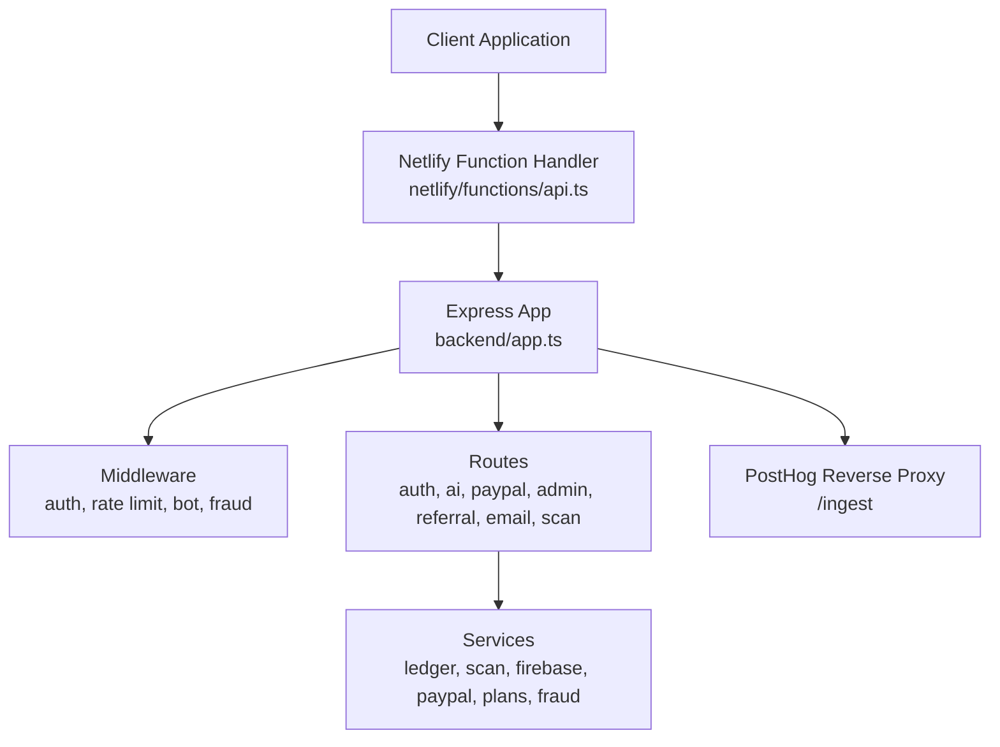
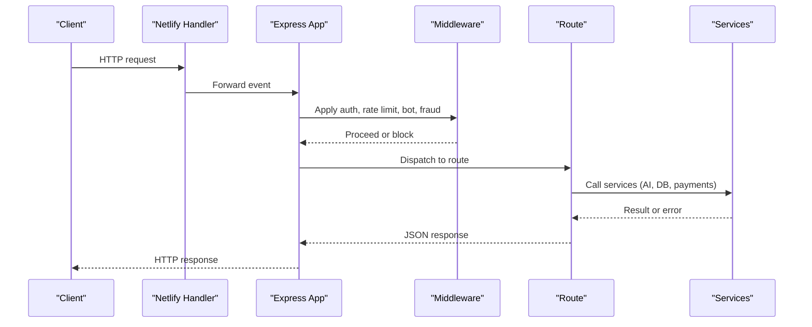
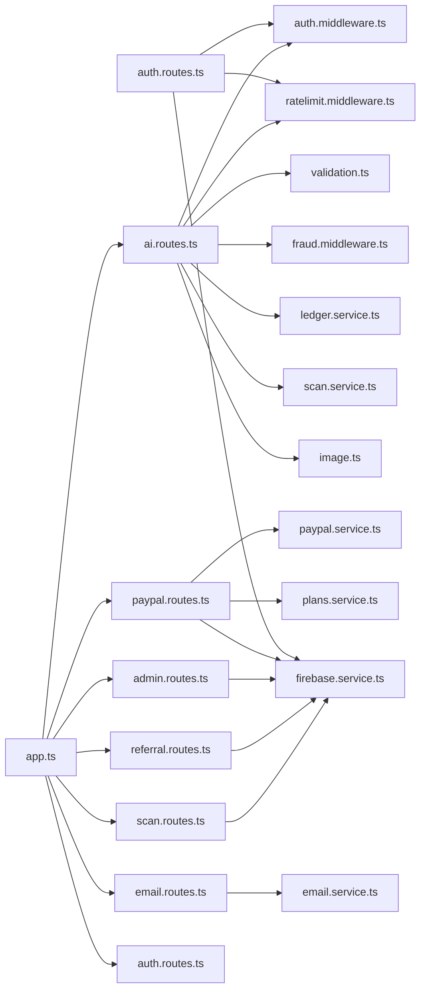

# API Reference

<cite>
**Referenced Files in This Document**
- [backend/app.ts](file://backend/app.ts)
- [backend/index.ts](file://backend/index.ts)
- [netlify/functions/api.ts](file://netlify/functions/api.ts)
- [backend/utils/config.ts](file://backend/utils/config.ts)
- [backend/utils/validation.ts](file://backend/utils/validation.ts)
- [backend/middleware/auth.middleware.ts](file://backend/middleware/auth.middleware.ts)
- [backend/middleware/ratelimit.middleware.ts](file://backend/middleware/ratelimit.middleware.ts)
- [backend/middleware/bot.middleware.ts](file://backend/middleware/bot.middleware.ts)
- [backend/middleware/fraud.middleware.ts](file://backend/middleware/fraud.middleware.ts)
- [backend/routes/auth.routes.ts](file://backend/routes/auth.routes.ts)
- [backend/routes/ai.routes.ts](file://backend/routes/ai.routes.ts)
- [backend/routes/paypal.routes.ts](file://backend/routes/paypal.routes.ts)
- [backend/routes/admin.routes.ts](file://backend/routes/admin.routes.ts)
- [backend/routes/scan.routes.ts](file://backend/routes/scan.routes.ts)
- [backend/routes/email.routes.ts](file://backend/routes/email.routes.ts)
- [backend/routes/referral.routes.ts](file://backend/routes/referral.routes.ts)
- [backend/services/ledger.service.ts](file://backend/services/ledger.service.ts)
- [backend/services/scan.service.ts](file://backend/services/scan.service.ts)
- [backend/services/firebase.service.ts](file://backend/services/firebase.service.ts)
- [backend/services/fraud.service.ts](file://backend/services/fraud.service.ts)
- [backend/services/plans.service.ts](file://backend/services/plans.service.ts)
- [backend/services/paypal.service.ts](file://backend/services/paypal.service.ts)
- [backend/utils/logger.ts](file://backend/utils/logger.ts)
- [backend/utils/image.ts](file://backend/utils/image.ts)
- [src/lib/api.ts](file://src/lib/api.ts)
</cite>

## Table of Contents
1. [Introduction](#introduction)
2. [Project Structure](#project-structure)
3. [Core Components](#core-components)
4. [Architecture Overview](#architecture-overview)
5. [Detailed Component Analysis](#detailed-component-analysis)
6. [Dependency Analysis](#dependency-analysis)
7. [Performance Considerations](#performance-considerations)
8. [Troubleshooting Guide](#troubleshooting-guide)
9. [Conclusion](#conclusion)
10. [Appendices](#appendices)

## Introduction
This document provides comprehensive API documentation for FaceAnalytics Pro’s REST endpoints. It covers authentication, AI-powered analysis, payment processing, referrals, email, scanning, and administrative functions. For each endpoint, you will find HTTP methods, URL patterns, request/response schemas, authentication requirements, validation rules, error codes, rate limiting policies, security considerations, and versioning strategies. Practical examples and client integration patterns are included, along with webhook guidance and troubleshooting tips.

## Project Structure
The API is implemented as a serverless Express application with dynamic imports for cold-start optimization. Routes are mounted under `/api` and grouped by domain: auth, AI analysis, PayPal, admin, referral, email, scans. A reverse proxy forwards analytics events to PostHog. Environment configuration is validated at startup, and request logging attaches unique request IDs.

**Diagram sources**
- [netlify/functions/api.ts:1-28](file://netlify/functions/api.ts#L1-L28)
- [backend/app.ts:15-201](file://backend/app.ts#L15-L201)

**Section sources**
- [backend/app.ts:15-201](file://backend/app.ts#L15-L201)
- [netlify/functions/api.ts:12-27](file://netlify/functions/api.ts#L12-L27)

## Core Components
- Authentication: JWT-based session verification middleware enforces protected routes.
- Rate Limiting: Shared and daily rate limiters protect resources and bound usage.
- Validation: Zod schemas define request contracts and middleware returns structured 400 errors.
- Fraud Protection: IP-based checks and daily caps mitigate abuse.
- Analytics Proxy: Requests to `/ingest` are proxied to PostHog for telemetry.
- Environment Configuration: Strict validation at startup ensures required secrets are present.

**Section sources**
- [backend/middleware/auth.middleware.ts](file://backend/middleware/auth.middleware.ts)
- [backend/middleware/ratelimit.middleware.ts](file://backend/middleware/ratelimit.middleware.ts)
- [backend/utils/validation.ts:89-102](file://backend/utils/validation.ts#L89-L102)
- [backend/middleware/fraud.middleware.ts](file://backend/middleware/fraud.middleware.ts)
- [backend/app.ts:49-59](file://backend/app.ts#L49-L59)
- [backend/utils/config.ts:59-82](file://backend/utils/config.ts#L59-L82)

## Architecture Overview
The API follows a layered architecture:
- Entry: Netlify function initializes the Express app on first request.
- Routing: Route modules register endpoints under `/api/<group>`.
- Processing: Middleware validates, authenticates, limits, and checks fraud.
- Services: Business logic interacts with external providers (Vertex AI, PayPal) and Firestore.
- Telemetry: PostHog ingestion is proxied through a dedicated endpoint.

**Diagram sources**
- [netlify/functions/api.ts:24-27](file://netlify/functions/api.ts#L24-L27)
- [backend/app.ts:171-179](file://backend/app.ts#L171-L179)
- [backend/middleware/auth.middleware.ts](file://backend/middleware/auth.middleware.ts)
- [backend/middleware/ratelimit.middleware.ts](file://backend/middleware/ratelimit.middleware.ts)
- [backend/middleware/bot.middleware.ts](file://backend/middleware/bot.middleware.ts)
- [backend/middleware/fraud.middleware.ts](file://backend/middleware/fraud.middleware.ts)

## Detailed Component Analysis

### Authentication Endpoints
- Base Path: `/api/auth`
- Authentication: Requires a valid session verified by the auth middleware.

Endpoints:
- POST /init-user
  - Purpose: Initialize a user profile on first sign-in.
  - Auth: Required.
  - Body Schema:
    - None (uses session user ID).
  - Responses:
    - 201 Created: User initialized successfully.
    - 200 OK: User already exists (cached).
    - 500 Internal Server Error: Database not initialized (strict environments).
  - Notes: Uses an in-memory cache keyed by user ID to avoid repeated Firestore reads.

**Section sources**
- [backend/routes/auth.routes.ts:23-88](file://backend/routes/auth.routes.ts#L23-L88)

### AI Analysis Endpoints
- Base Path: `/api`
- Authentication: Required for all analysis endpoints.
- Rate Limits: Shared and daily caps apply per endpoint.
- Validation: Zod schemas enforce request bodies.

Endpoints:
- POST /gemini-analysis
  - Purpose: Dermatology and aesthetics analysis using Vertex AI.
  - Auth: Required.
  - Rate Limit: Shared (e.g., 5 per 10 minutes).
  - Daily Cap: 50 per user.
  - Body Schema (Zod):
    - image: string, min length 1, max ~15MB; base64 image data or data URL.
  - Response: Structured JSON containing metrics, insights, recommendations.
  - Errors:
    - 400 Validation failed: Structured details with field/message.
    - 403 Insufficient credits.
    - 429 Too many requests or unusual activity detected.
    - 502 AI processing failed or response parsing error.
    - 500 Internal server error.
  - Notes:
    - Credit-safe ordering: AI call first, then best-effort credit deduction.
    - Image compression reduces payload size.
    - Cache hit returns result without reprocessing.

- POST /celebrity-lookalike
  - Purpose: Identify top celebrity lookalikes.
  - Auth: Required.
  - Rate Limit: Shared (e.g., 3 per 10 minutes).
  - Daily Cap: 30 per user.
  - Body Schema (Zod):
    - image: string, min length 1; supports base64 or Firebase Storage URL.
  - Response: JSON with up to five celebrities and similarity percentages.
  - Errors: Similar to gemini-analysis with additional 400 for SSRF restrictions.

- POST /hair-analysis
  - Purpose: Hair-related recommendations and styling suggestions.
  - Auth: Required.
  - Rate Limit: Shared (e.g., 3 per 10 minutes).
  - Daily Cap: 30 per user.
  - Body Schema (Zod):
    - image: string, min length 1; base64 or data URL.
  - Response: JSON with hair recommendations tailored to face shape and features.
  - Errors: Similar to other analysis endpoints.

- GET /celebrity-photo
  - Purpose: Retrieve a thumbnail for a given celebrity name.
  - Query:
    - name: string, trimmed, max 120 chars.
  - Response: JSON with imageUrl or 404 if not found.
  - Cache-Control: Public cache for 24 hours.

**Section sources**
- [backend/routes/ai.routes.ts:271-516](file://backend/routes/ai.routes.ts#L271-L516)
- [backend/routes/ai.routes.ts:520-754](file://backend/routes/ai.routes.ts#L520-L754)
- [backend/routes/ai.routes.ts:758-1146](file://backend/routes/ai.routes.ts#L758-L1146)
- [backend/routes/ai.routes.ts:105-123](file://backend/routes/ai.routes.ts#L105-L123)
- [backend/utils/validation.ts:13-23](file://backend/utils/validation.ts#L13-L23)

### Payment Processing Endpoints
- Base Path: `/api/paypal`
- Authentication: Not required for order creation; requires auth for capture and webhooks.

Endpoints:
- POST /create-order
  - Purpose: Create a PayPal order for a plan.
  - Auth: Optional (client-side).
  - Body Schema (Zod):
    - planId: string, min length 1.
  - Response: Order ID and approval URL.
  - Errors: 400 validation failure; 500 if PayPal credentials missing.

- POST /capture-order
  - Purpose: Capture a PayPal order and update user subscription.
  - Auth: Required.
  - Body Schema (Zod):
    - orderID: string, min length 1.
    - planId: string (optional).
  - Response: Transaction result and user credits/plan update.
  - Errors: 400 validation failure; 500 if PayPal credentials missing.

- POST /webhook (PayPal)
  - Purpose: Receive PayPal subscription and payment notifications.
  - Auth: Not required.
  - Body: PayPal webhook payload.
  - Response: Acknowledgement or error.
  - Notes: Webhook ID is configured via environment variable.

**Section sources**
- [backend/routes/paypal.routes.ts](file://backend/routes/paypal.routes.ts)
- [backend/utils/validation.ts:57-64](file://backend/utils/validation.ts#L57-L64)
- [backend/utils/config.ts:25-28](file://backend/utils/config.ts#L25-L28)

### Scanning and History Endpoints
- Base Path: `/api/scans`
- Authentication: Required.

Endpoints:
- POST /save
  - Purpose: Save analysis results to user history.
  - Auth: Required.
  - Body Schema (Zod):
    - overallScore: number between 0 and 10.
    - analysisData: string, min length 1, max ~1MB.
    - imageUrl: string (optional, max 100).
  - Response: Success or error.
  - Errors: 400 validation failure; 500 on database issues.

**Section sources**
- [backend/routes/scan.routes.ts](file://backend/routes/scan.routes.ts)
- [backend/utils/validation.ts:77-81](file://backend/utils/validation.ts#L77-L81)

### Referral Endpoints
- Base Path: `/api/referral`
- Authentication: Required.

Endpoints:
- POST /redeem
  - Purpose: Redeem a referral code to grant credits.
  - Auth: Required.
  - Body Schema (Zod):
    - referralCode: string, min length 1, max 20.
    - fingerprint: string (optional).
  - Response: Credits updated or error.
  - Errors: 400 validation failure; 404 if invalid code; 429 if rate-limited.

**Section sources**
- [backend/routes/referral.routes.ts](file://backend/routes/referral.routes.ts)
- [backend/utils/validation.ts:66-69](file://backend/utils/validation.ts#L66-L69)

### Email Endpoints
- Base Path: `/api/email`
- Authentication: Not required.

Endpoints:
- POST /welcome
  - Purpose: Send welcome email.
  - Body Schema (Zod):
    - email: string, valid email.
    - name: string (optional, max 100).
    - userId: string (optional).
  - Response: Success or error.
  - Errors: 400 validation failure; 500 if email provider not configured.

**Section sources**
- [backend/routes/email.routes.ts](file://backend/routes/email.routes.ts)
- [backend/utils/validation.ts:71-75](file://backend/utils/validation.ts#L71-L75)

### Administrative Endpoints
- Base Path: `/api/admin`
- Authentication: Required (admin role).
- Notes: Admin-only routes for managing users, credits, and system state.

**Section sources**
- [backend/routes/admin.routes.ts](file://backend/routes/admin.routes.ts)

### Client-Side Integration Patterns
- SDK Utilities:
  - API client module encapsulates HTTP calls, request IDs, and error handling.
  - Example usage patterns:
    - Wrap fetch calls with a helper that sets Content-Type and Authorization headers.
    - Handle structured 400 errors from validation middleware.
    - Implement exponential backoff for AI endpoints when receiving 429.
    - Manage rate-limiting UI feedback and retry prompts.
- Recommended Headers:
  - Authorization: Bearer <JWT>.
  - Content-Type: application/json.
- Request ID Logging:
  - Server attaches a unique request ID to logs; include it in bug reports.

**Section sources**
- [src/lib/api.ts](file://src/lib/api.ts)

### Webhook Endpoints
- PayPal Webhooks:
  - Endpoint: POST /api/paypal/webhook
  - Purpose: Receive subscription status updates and payment events.
  - Security: Validate webhook signature and resource type; update Firestore accordingly.
  - Configuration: Webhook ID is configured via environment variable.

**Section sources**
- [backend/routes/paypal.routes.ts](file://backend/routes/paypal.routes.ts)
- [backend/utils/config.ts:28](file://backend/utils/config.ts#L28)

## Dependency Analysis

**Diagram sources**
- [backend/app.ts:171-179](file://backend/app.ts#L171-L179)
- [backend/routes/auth.routes.ts:1-91](file://backend/routes/auth.routes.ts#L1-L91)
- [backend/routes/ai.routes.ts:1-18](file://backend/routes/ai.routes.ts#L1-L18)
- [backend/routes/paypal.routes.ts](file://backend/routes/paypal.routes.ts)
- [backend/routes/admin.routes.ts](file://backend/routes/admin.routes.ts)
- [backend/routes/referral.routes.ts](file://backend/routes/referral.routes.ts)
- [backend/routes/email.routes.ts](file://backend/routes/email.routes.ts)
- [backend/routes/scan.routes.ts](file://backend/routes/scan.routes.ts)

**Section sources**
- [backend/app.ts:171-179](file://backend/app.ts#L171-L179)

## Performance Considerations
- Cold Starts:
  - Dynamic imports in the Netlify handler and Express app reduce initialization overhead.
- Timeouts:
  - AI requests are bounded by an AbortController timeout to avoid platform termination.
- Payload Limits:
  - JSON body sizes vary by endpoint to balance capability and safety.
- Caching:
  - Image hashing and cached results reduce redundant AI calls.
- Compression:
  - Images are compressed before being sent to Vertex AI to minimize latency and cost.

**Section sources**
- [netlify/functions/api.ts:12-27](file://netlify/functions/api.ts#L12-L27)
- [backend/app.ts:61-66](file://backend/app.ts#L61-L66)
- [backend/routes/ai.routes.ts:165](file://backend/routes/ai.routes.ts#L165)
- [backend/services/scan.service.ts](file://backend/services/scan.service.ts)
- [backend/utils/image.ts](file://backend/utils/image.ts)

## Troubleshooting Guide
Common Issues and Remedies:
- Validation Errors (400):
  - Review the details array for field and message. Fix input according to schema constraints.
- Insufficient Credits (403):
  - Ensure the user has sufficient credits before invoking analysis endpoints.
- Rate Limit Exceeded (429):
  - Implement exponential backoff and user messaging. Respect the rate limiter windows.
- AI Processing Failures (502):
  - Retry with backoff; check Vertex AI key configuration and model availability.
- Database Initialization Errors (500):
  - Confirm Firestore credentials and that the admin DB is initialized in strict environments.
- Unexpected Response Parsing:
  - The server strips markdown fences and extracts JSON; ensure the model responds with valid JSON.

Debugging Tips:
- Enable development mode for richer error payloads.
- Use request IDs to correlate logs across services.
- Monitor PostHog ingestion via the `/ingest` proxy.

**Section sources**
- [backend/utils/validation.ts:89-102](file://backend/utils/validation.ts#L89-L102)
- [backend/routes/ai.routes.ts:314-322](file://backend/routes/ai.routes.ts#L314-L322)
- [backend/routes/ai.routes.ts:433-442](file://backend/routes/ai.routes.ts#L433-L442)
- [backend/utils/config.ts:64-82](file://backend/utils/config.ts#L64-L82)
- [backend/app.ts:182-191](file://backend/app.ts#L182-L191)

## Conclusion
FaceAnalytics Pro exposes a secure, rate-limited, and fraud-aware REST API with robust validation and error handling. AI endpoints follow a credit-safe flow, while payment and administrative functions integrate with PayPal and Firestore. Client integrations should leverage the provided SDK patterns, respect rate limits, and implement resilient retry logic for optimal reliability.

## Appendices

### API Versioning Strategy
- Versioning is implicit via base paths under `/api`. New features are introduced under new subpaths without breaking existing endpoints.
- Backward compatibility is maintained for existing endpoints.

### Security Considerations
- Helmet-enabled CSP restricts script, connect, frame, and worker sources.
- CORS is origin-controlled and only set for allowed origins.
- Bot protection blocks known scrapers and empty user agents on API routes.
- Admin emails are configurable for administrative access control.

**Section sources**
- [backend/app.ts:90-140](file://backend/app.ts#L90-L140)
- [backend/app.ts:145-164](file://backend/app.ts#L145-L164)
- [backend/utils/config.ts:40-47](file://backend/utils/config.ts#L40-L47)

### Environment Variables
Critical variables validated at startup:
- FIREBASE_SERVICE_ACCOUNT, FIRESTORE_DATABASE_ID
- VERTEX_API_KEY (required)
- GCP_PROJECT, GCP_REGION, GEMINI_MODEL
- UPSTASH_REDIS_REST_URL, UPSTASH_REDIS_REST_TOKEN
- PAYPAL_CLIENT_ID, PAYPAL_CLIENT_SECRET, PAYPAL_WEBHOOK_ID
- RESEND_API_KEY
- APP_URL, VITE_PUBLIC_POSTHOG_HOST
- ADMIN_EMAILS
- FRAUD_* thresholds

**Section sources**
- [backend/utils/config.ts:7-48](file://backend/utils/config.ts#L7-L48)

### Request/Response Examples
- POST /api/auth/init-user
  - Request: No body; Authorization: Bearer <JWT>.
  - Response: 201 Created or 200 OK with message.
- POST /api/gemini-analysis
  - Request: { "image": "<base64 or data URL>" }.
  - Response: Structured analysis JSON.
- POST /api/paypal/create-order
  - Request: { "planId": "gold-yearly-2025" }.
  - Response: { "orderId": "...", "approveUrl": "..." }.
- POST /api/scans/save
  - Request: { "overallScore": 8.5, "analysisData": "{...}", "imageUrl": "..." }.
  - Response: Success acknowledgment.

**Section sources**
- [backend/routes/auth.routes.ts:23-88](file://backend/routes/auth.routes.ts#L23-L88)
- [backend/utils/validation.ts:13-15](file://backend/utils/validation.ts#L13-L15)
- [backend/utils/validation.ts:57-59](file://backend/utils/validation.ts#L57-L59)
- [backend/utils/validation.ts:77-81](file://backend/utils/validation.ts#L77-L81)