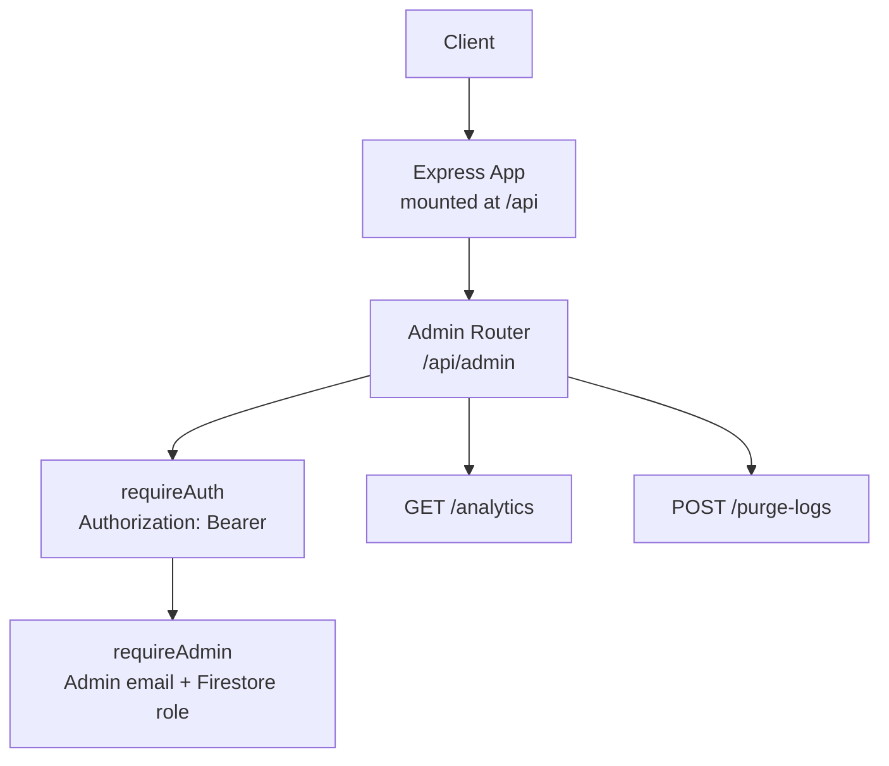
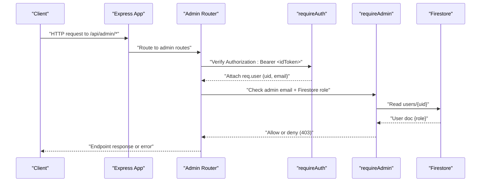
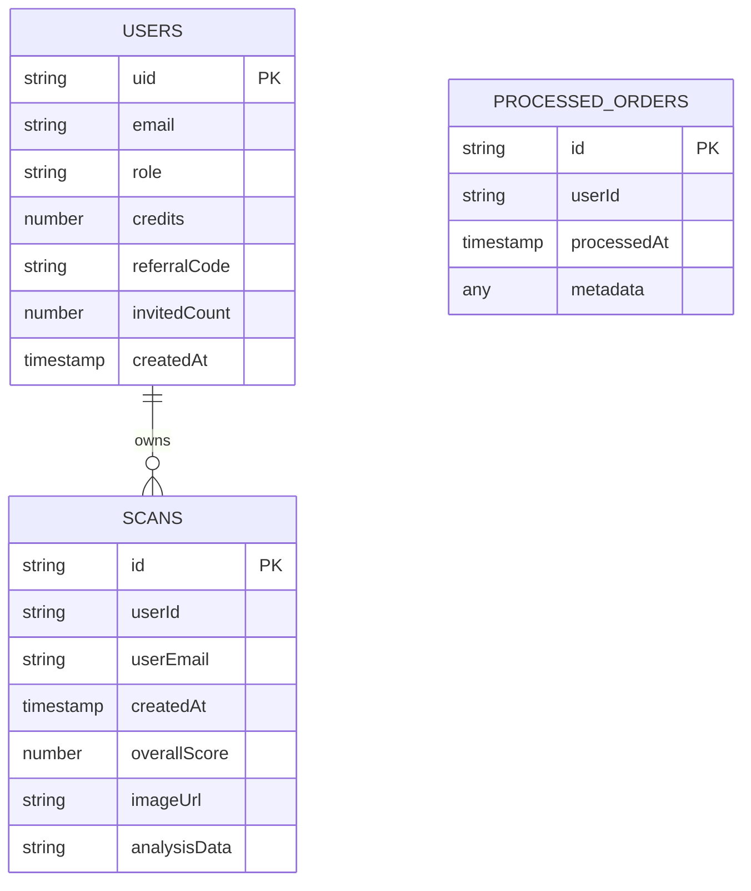
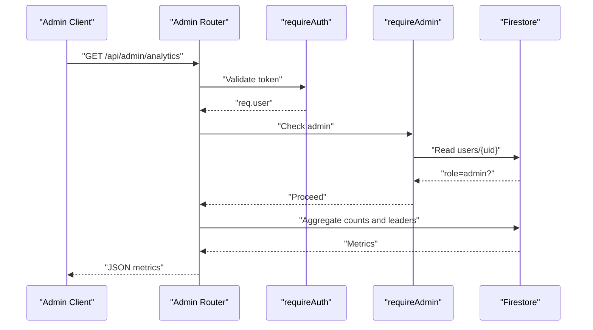
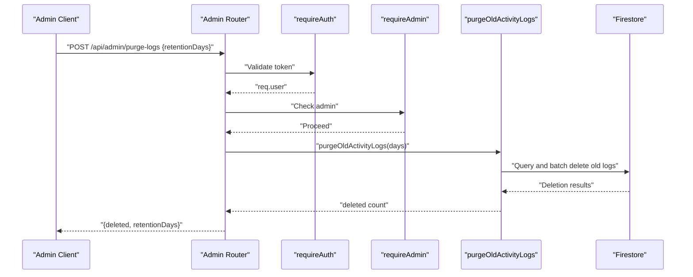
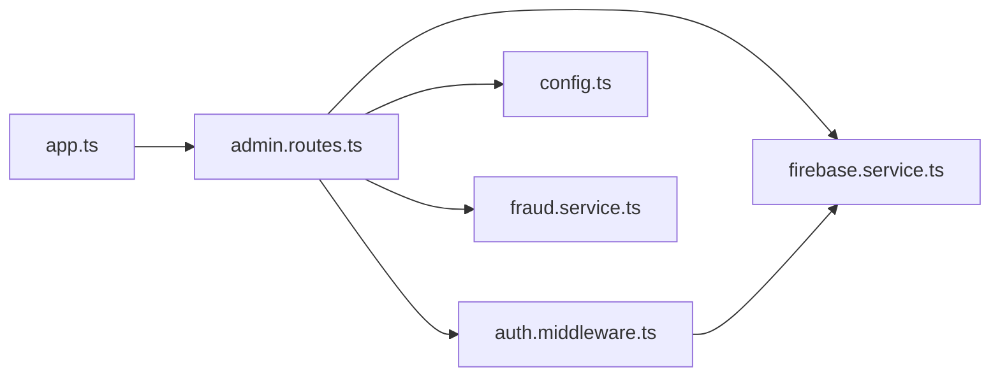

# Administrative API

<cite>
**Referenced Files in This Document**
- [admin.routes.ts](file://backend/routes/admin.routes.ts)
- [auth.middleware.ts](file://backend/middleware/auth.middleware.ts)
- [firebase.service.ts](file://backend/services/firebase.service.ts)
- [config.ts](file://backend/utils/config.ts)
- [app.ts](file://backend/app.ts)
- [fraud.service.ts](file://backend/services/fraud.service.ts)
- [logger.ts](file://backend/utils/logger.ts)
- [firestore.rules](file://firestore.rules)
- [auth.routes.ts](file://backend/routes/auth.routes.ts)
</cite>

## Table of Contents
1. [Introduction](#introduction)
2. [Project Structure](#project-structure)
3. [Core Components](#core-components)
4. [Architecture Overview](#architecture-overview)
5. [Detailed Component Analysis](#detailed-component-analysis)
6. [Dependency Analysis](#dependency-analysis)
7. [Performance Considerations](#performance-considerations)
8. [Troubleshooting Guide](#troubleshooting-guide)
9. [Conclusion](#conclusion)

## Introduction
This document provides comprehensive API documentation for FaceAnalytics Pro administrative endpoints. It covers admin-only endpoints for system monitoring and administrative operations, including strict authentication and authorization requirements, request/response schemas, and operational workflows. It also documents role-based access control, admin authentication mechanisms, security considerations, and error handling.

## Project Structure
The administrative endpoints are implemented as Express routes mounted under /api/admin. Authentication is enforced via a Firebase Admin SDK-based middleware that validates ID tokens and verifies admin privileges against Firestore user records. Supporting services handle database access, fraud detection, and logging.

**Diagram sources**
- [app.ts:171-179](file://backend/app.ts#L171-L179)
- [admin.routes.ts:1-134](file://backend/routes/admin.routes.ts#L1-L134)
- [auth.middleware.ts:18-39](file://backend/middleware/auth.middleware.ts#L18-L39)

**Section sources**
- [app.ts:171-179](file://backend/app.ts#L171-L179)
- [admin.routes.ts:1-134](file://backend/routes/admin.routes.ts#L1-L134)

## Core Components
- Admin Router: Defines two admin-only endpoints under /api/admin.
- Authentication Middleware: Validates Authorization header containing a Firebase ID token and attaches decoded user info to the request.
- Admin Middleware: Confirms the caller’s email is in ADMIN_EMAILS and the Firestore user document has role=admin.
- Firebase Services: Provides Firestore and Auth clients used by middleware and admin endpoints.
- Fraud Service: Supplies purgeOldActivityLogs used by the purge-logs endpoint.

**Section sources**
- [admin.routes.ts:1-134](file://backend/routes/admin.routes.ts#L1-L134)
- [auth.middleware.ts:18-39](file://backend/middleware/auth.middleware.ts#L18-L39)
- [firebase.service.ts:75-119](file://backend/services/firebase.service.ts#L75-L119)
- [fraud.service.ts:595-633](file://backend/services/fraud.service.ts#L595-L633)

## Architecture Overview
The admin endpoints enforce a two-layer security model:
1. Authentication: Authorization header with a valid Firebase ID token.
2. Authorization: Admin email whitelist plus Firestore user role=admin.

**Diagram sources**
- [auth.middleware.ts:18-39](file://backend/middleware/auth.middleware.ts#L18-L39)
- [admin.routes.ts:14-42](file://backend/routes/admin.routes.ts#L14-L42)
- [firebase.service.ts:75-119](file://backend/services/firebase.service.ts#L75-L119)

## Detailed Component Analysis

### Endpoint Catalog

#### GET /api/admin/analytics
- Purpose: Retrieve system usage, revenue, growth, credits, and referral leaderboards.
- Authentication: Bearer token required.
- Authorization: Admin email + Firestore role=admin.
- Request
  - Headers: Authorization: Bearer <idToken>
  - Query: None
- Response (success)
  - Body: {
      timestamp: string,
      users: { total: number, last7d: number },
      scans: { total: number, last7d: number },
      orders: { total: number, last7d: number },
      credits: { inCirculation: number },
      referrals: { topReferrers: [{ email: string, invitedCount: number }] }
    }
- Response (errors)
  - 401 Unauthorized: Missing or invalid Authorization header; invalid token.
  - 403 Forbidden: Not an admin.
  - 500 Internal Server Error: Database not available or internal failure.
- Notes
  - Computes weekly aggregates for users, scans, and orders.
  - Calculates total credits held by top 50 users.
  - Identifies top referrers by invitedCount.

**Section sources**
- [admin.routes.ts:44-119](file://backend/routes/admin.routes.ts#L44-L119)

#### POST /api/admin/purge-logs
- Purpose: Delete activity_log entries older than a specified retention period.
- Authentication: Bearer token required.
- Authorization: Admin email + Firestore role=admin.
- Request
  - Headers: Authorization: Bearer <idToken>
  - Body: { retentionDays: number (1..365, default 30) }
- Response (success)
  - Body: { deleted: number, retentionDays: number }
- Response (errors)
  - 401 Unauthorized: Missing or invalid Authorization header; invalid token.
  - 403 Forbidden: Not an admin.
  - 500 Internal Server Error: Failure to purge logs.
- Notes
  - Deletion occurs in batches of 200 to comply with Firestore limits.
  - Logs purge activity is written to server logs.

**Section sources**
- [admin.routes.ts:121-131](file://backend/routes/admin.routes.ts#L121-L131)
- [fraud.service.ts:595-633](file://backend/services/fraud.service.ts#L595-L633)

### Authentication and Authorization

#### Authentication: Bearer Token Validation
- Validates Authorization header format and verifies Firebase ID token.
- Attaches decoded user identity (uid, email) to req.user.

**Section sources**
- [auth.middleware.ts:18-39](file://backend/middleware/auth.middleware.ts#L18-L39)
- [firebase.service.ts:113-119](file://backend/services/firebase.service.ts#L113-L119)

#### Authorization: Admin Access Control
- Email-based allowlist: ADMIN_EMAILS environment variable (comma-separated).
- Role-based enforcement: Firestore users/{uid} must have role=admin.
- Caching: In-memory cache per uid with 60-second TTL to reduce Firestore reads.

**Section sources**
- [admin.routes.ts:9-42](file://backend/routes/admin.routes.ts#L9-L42)
- [config.ts:88-94](file://backend/utils/config.ts#L88-L94)

### Data Models and Firestore Contracts

**Diagram sources**
- [firestore.rules:10-31](file://firestore.rules#L10-L31)
- [firestore.rules:89-111](file://firestore.rules#L89-L111)

**Section sources**
- [firestore.rules:10-31](file://firestore.rules#L10-L31)
- [firestore.rules:89-111](file://firestore.rules#L89-L111)

### Administrative Workflows

#### Workflow: System Analytics Retrieval

**Diagram sources**
- [admin.routes.ts:44-119](file://backend/routes/admin.routes.ts#L44-L119)

#### Workflow: Activity Logs Purge

**Diagram sources**
- [admin.routes.ts:121-131](file://backend/routes/admin.routes.ts#L121-L131)
- [fraud.service.ts:595-633](file://backend/services/fraud.service.ts#L595-L633)

### Practical Examples

- Authentication Header
  - Authorization: Bearer <valid-firebase-id-token>

- Example: Retrieve Analytics
  - curl -H "Authorization: Bearer <idToken>" https://your-domain/api/admin/analytics

- Example: Purge Old Activity Logs
  - curl -X POST https://your-domain/api/admin/purge-logs \
    -H "Authorization: Bearer <idToken>" \
    -H "Content-Type: application/json" \
    -d '{"retentionDays": 30}'

Notes:
- Replace your-domain with the actual API hostname.
- Ensure the token corresponds to an admin user (email in ADMIN_EMAILS and Firestore role=admin).

**Section sources**
- [auth.middleware.ts:18-39](file://backend/middleware/auth.middleware.ts#L18-L39)
- [admin.routes.ts:44-131](file://backend/routes/admin.routes.ts#L44-L131)

## Dependency Analysis

**Diagram sources**
- [app.ts:171-179](file://backend/app.ts#L171-L179)
- [admin.routes.ts:1-5](file://backend/routes/admin.routes.ts#L1-L5)
- [auth.middleware.ts:1-2](file://backend/middleware/auth.middleware.ts#L1-L2)
- [firebase.service.ts:1-5](file://backend/services/firebase.service.ts#L1-L5)
- [config.ts:1-5](file://backend/utils/config.ts#L1-L5)
- [fraud.service.ts:1-5](file://backend/services/fraud.service.ts#L1-L5)

**Section sources**
- [app.ts:171-179](file://backend/app.ts#L171-L179)
- [admin.routes.ts:1-5](file://backend/routes/admin.routes.ts#L1-L5)

## Performance Considerations
- Admin verification caching: requireAdmin caches admin status for 60 seconds per uid to minimize Firestore reads.
- Firestore HTTP/1.1 transport: Firestore client is configured to prefer REST to avoid gRPC timeouts in serverless environments.
- Batched activity log purging: Deletes logs in batches of 200 with small delays to remain within Firestore limits.

**Section sources**
- [admin.routes.ts:11, 31-32](file://backend/routes/admin.routes.ts#L11,L31-L32)
- [firebase.service.ts:103-108](file://backend/services/firebase.service.ts#L103-L108)
- [fraud.service.ts:604-623](file://backend/services/fraud.service.ts#L604-L623)

## Troubleshooting Guide
- 401 Unauthorized
  - Cause: Missing Authorization header or invalid/revoked token.
  - Action: Regenerate a valid Firebase ID token and retry.
- 403 Forbidden
  - Cause: Caller email not in ADMIN_EMAILS or Firestore user role != admin.
  - Action: Verify admin credentials and Firestore user role.
- 500 Internal Server Error
  - Analytics endpoint: Database not available or aggregation failure.
  - Purge endpoint: Failure to query or delete logs.
  - Action: Check server logs and Firestore connectivity.
- Audit Logging
  - Server logs capture purge operations and analytics errors.
  - Request IDs are logged for traceability.

**Section sources**
- [auth.middleware.ts:20-38](file://backend/middleware/auth.middleware.ts#L20-L38)
- [admin.routes.ts:18-41](file://backend/routes/admin.routes.ts#L18-L41)
- [admin.routes.ts:115-118, 127-130](file://backend/routes/admin.routes.ts#L115-L118,L127-L130)
- [logger.ts:11-71](file://backend/utils/logger.ts#L11-L71)

## Conclusion
The administrative API enforces strict two-factor admin controls: verified Firebase ID tokens and Firestore role=admin. It exposes analytics retrieval and activity log maintenance endpoints with robust error handling and performance optimizations. Administrators should protect admin credentials, monitor audit logs, and apply appropriate retention policies for operational hygiene.