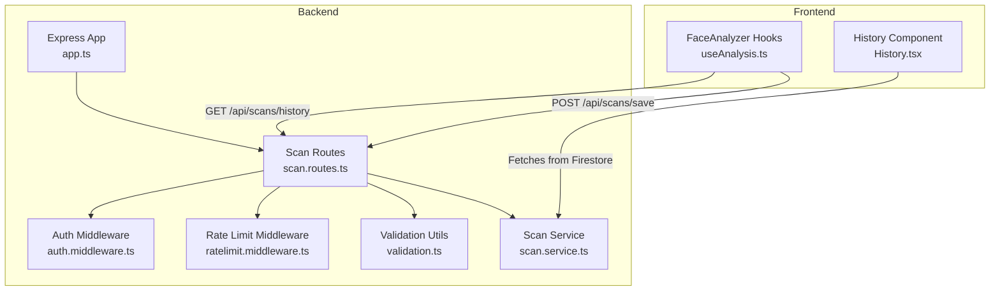
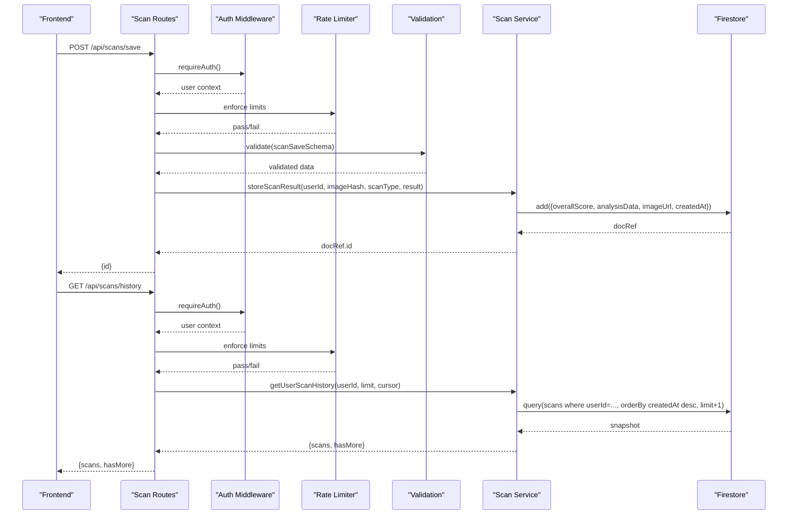
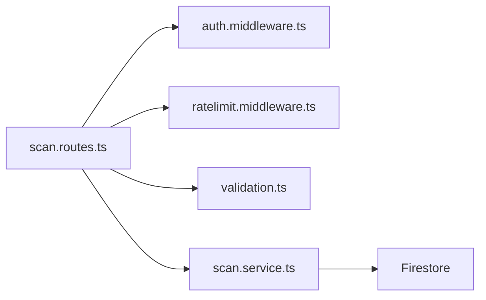

# Analysis Management API

<cite>
**Referenced Files in This Document**
- [scan.routes.ts](file://backend/routes/scan.routes.ts)
- [scan.service.ts](file://backend/services/scan.service.ts)
- [validation.ts](file://backend/utils/validation.ts)
- [ratelimit.middleware.ts](file://backend/middleware/ratelimit.middleware.ts)
- [auth.middleware.ts](file://backend/middleware/auth.middleware.ts)
- [analysis.ts](file://src/types/analysis.ts)
- [useAnalysis.ts](file://src/components/FaceAnalyzer/hooks/useAnalysis.ts)
- [History.tsx](file://src/components/History.tsx)
- [app.ts](file://backend/app.ts)
</cite>

## Table of Contents
1. [Introduction](#introduction)
2. [Project Structure](#project-structure)
3. [Core Components](#core-components)
4. [Architecture Overview](#architecture-overview)
5. [Detailed Component Analysis](#detailed-component-analysis)
6. [Dependency Analysis](#dependency-analysis)
7. [Performance Considerations](#performance-considerations)
8. [Troubleshooting Guide](#troubleshooting-guide)
9. [Conclusion](#conclusion)

## Introduction
This document provides comprehensive API documentation for FaceAnalytics Pro's analysis management endpoints, focusing on saving scans and retrieving scan history. It covers HTTP methods, URL patterns, request/response schemas, authentication requirements, rate limiting policies, validation schemas, and the scan data model. It also explains the relationship between frontend analysis components and backend storage, including practical examples and error handling guidance.

## Project Structure
The analysis management endpoints are implemented in the backend under `/api/scans` and integrated with frontend components that trigger analysis, save results, and display history.

**Diagram sources**
- [app.ts:179](file://backend/app.ts#L179)
- [scan.routes.ts:22](file://backend/routes/scan.routes.ts#L22)
- [auth.middleware.ts:18](file://backend/middleware/auth.middleware.ts#L18)
- [ratelimit.middleware.ts:25](file://backend/middleware/ratelimit.middleware.ts#L25)
- [validation.ts:89](file://backend/utils/validation.ts#L89)
- [scan.service.ts:99](file://backend/services/scan.service.ts#L99)
- [useAnalysis.ts:162](file://src/components/FaceAnalyzer/hooks/useAnalysis.ts#L162)
- [History.tsx:40](file://src/components/History.tsx#L40)

**Section sources**
- [app.ts:179](file://backend/app.ts#L179)
- [scan.routes.ts:22](file://backend/routes/scan.routes.ts#L22)

## Core Components
- Scan saving endpoint: POST /api/scans/save
- Scan history retrieval endpoint: GET /api/scans/history

Both endpoints require authentication via Firebase ID tokens and apply rate limiting. The scan service persists results to Firestore and supports paginated history retrieval.

**Section sources**
- [scan.routes.ts:22](file://backend/routes/scan.routes.ts#L22)
- [scan.routes.ts:47](file://backend/routes/scan.routes.ts#L47)
- [scan.service.ts:99](file://backend/services/scan.service.ts#L99)

## Architecture Overview
The endpoints integrate frontend analysis components with backend storage and validation:

**Diagram sources**
- [scan.routes.ts:22](file://backend/routes/scan.routes.ts#L22)
- [scan.routes.ts:47](file://backend/routes/scan.routes.ts#L47)
- [auth.middleware.ts:18](file://backend/middleware/auth.middleware.ts#L18)
- [ratelimit.middleware.ts:25](file://backend/middleware/ratelimit.middleware.ts#L25)
- [validation.ts:89](file://backend/utils/validation.ts#L89)
- [scan.service.ts:68](file://backend/services/scan.service.ts#L68)
- [scan.service.ts:99](file://backend/services/scan.service.ts#L99)

## Detailed Component Analysis

### Authentication and Authorization
- Both endpoints require a valid Firebase ID token in the Authorization header.
- The auth middleware verifies the token and attaches user context to the request.

**Section sources**
- [auth.middleware.ts:18](file://backend/middleware/auth.middleware.ts#L18)
- [useAnalysis.ts:175](file://src/components/FaceAnalyzer/hooks/useAnalysis.ts#L175)

### Rate Limiting Policies
- Save endpoint: 20 requests per 10 minutes per user/IP.
- History endpoint: 30 requests per 1 minute per user/IP.
- Rate limiter uses Upstash Redis with sliding windows and per-user/per-IP enforcement.
- During development, rate limiting is disabled to facilitate testing.

**Section sources**
- [scan.routes.ts:11](file://backend/routes/scan.routes.ts#L11)
- [scan.routes.ts:16](file://backend/routes/scan.routes.ts#L16)
- [ratelimit.middleware.ts:25](file://backend/middleware/ratelimit.middleware.ts#L25)

### Validation Schema: scanSaveSchema
- overallScore: number, min 0, max 10.
- analysisData: string, min 1 character, max 1,000,000 characters.
- imageUrl: optional string, min 1, max 100 characters.

On validation failure, the middleware returns structured errors with field and message details.

**Section sources**
- [validation.ts:77](file://backend/utils/validation.ts#L77)
- [validation.ts:89](file://backend/utils/validation.ts#L89)

### Scan Saving Endpoint: POST /api/scans/save
- Purpose: Persist analysis results for the authenticated user.
- Request body:
  - overallScore: number (0–10)
  - analysisData: stringified JSON containing the full analysis result
  - imageUrl: optional URL or marker indicating base64 stored in analysisData
- Response:
  - 201 Created with { id: string } representing the Firestore document ID
  - On error: 500 Internal Server Error with { error: string }

Storage fields:
- userId, userEmail, createdAt (server timestamp), overallScore, imageUrl, analysisData, scanType: "analysis"

**Section sources**
- [scan.routes.ts:22](file://backend/routes/scan.routes.ts#L22)
- [scan.routes.ts:29](file://backend/routes/scan.routes.ts#L29)

### Scan History Retrieval Endpoint: GET /api/scans/history
- Purpose: Paginate user's scan history.
- Query parameters:
  - limit: number, default 20, max 50
  - cursor: string (optional timestamp for pagination)
- Response:
  - { scans: array, hasMore: boolean }
  - Each scan includes id, overallScore, imageUrl, createdAt, and analysisData
  - On error: 500 Internal Server Error with { error: string }

Pagination logic:
- Backend queries Firestore with limit+1 to determine hasMore.
- Frontend can pass the last scan's createdAt timestamp as cursor for subsequent pages.

**Section sources**
- [scan.routes.ts:47](file://backend/routes/scan.routes.ts#L47)
- [scan.routes.ts:50](file://backend/routes/scan.routes.ts#L50)
- [scan.routes.ts:53](file://backend/routes/scan.routes.ts#L53)
- [scan.service.ts:99](file://backend/services/scan.service.ts#L99)
- [scan.service.ts:118](file://backend/services/scan.service.ts#L118)

### Scan Data Model
- Backend storage model (StoredScan):
  - userId: string
  - imageHash: string (SHA-256 of compressed image data)
  - scanType: "analysis" | "celebrity" | "hair"
  - result: Record<string, any> (serialized analysis result)
  - overallScore?: number
  - createdAt: server timestamp

- Frontend analysis result (AnalysisResult):
  - overallScore: number
  - structuralScore?: number
  - visualScore?: number
  - breakdown: BreakdownScores
  - metrics: Record<string, string | number>
  - analysis: AnalysisInsightsData
  - detailedSymmetry?: SymmetryDetail[]
  - visionAnalysis?: VisionAnalysis
  - landmarks?: { x: number; y: number }[]
  - cropInfo?: CropInfo

- Timestamp handling:
  - Backend stores createdAt as Firestore server timestamp.
  - Frontend converts timestamps to ISO strings for display.

**Section sources**
- [scan.service.ts:11](file://backend/services/scan.service.ts#L11)
- [analysis.ts:96](file://src/types/analysis.ts#L96)
- [analysis.ts:26](file://src/types/analysis.ts#L26)

### Frontend Integration
- Saving analysis:
  - Frontend constructs a saveable result, sets historyImage, and posts to /api/scans/save.
  - Uses Firebase ID token for Authorization.

- Retrieving history:
  - Frontend can use the backend endpoint for paginated history.
  - Alternatively, the History component fetches directly from Firestore for quick UI rendering.

**Section sources**
- [useAnalysis.ts:162](file://src/components/FaceAnalyzer/hooks/useAnalysis.ts#L162)
- [useAnalysis.ts:176](file://src/components/FaceAnalyzer/hooks/useAnalysis.ts#L176)
- [History.tsx:40](file://src/components/History.tsx#L40)

### Practical Examples

#### Example: Saving Analysis Results
- Request:
  - Method: POST
  - URL: /api/scans/save
  - Headers: Authorization: Bearer <Firebase ID Token>, Content-Type: application/json
  - Body:
    - overallScore: number (0–10)
    - analysisData: stringified JSON of AnalysisResult
    - imageUrl: optional URL or marker

- Response:
  - 201 Created: { id: "<documentId>" }

**Section sources**
- [scan.routes.ts:22](file://backend/routes/scan.routes.ts#L22)
- [useAnalysis.ts:176](file://src/components/FaceAnalyzer/hooks/useAnalysis.ts#L176)

#### Example: Retrieving Historical Scans
- Request:
  - Method: GET
  - URL: /api/scans/history?limit=20&cursor=<timestamp>
  - Headers: Authorization: Bearer <Firebase ID Token>

- Response:
  - { scans: [{ id, overallScore, imageUrl, createdAt, analysisData }], hasMore: boolean }

**Section sources**
- [scan.routes.ts:47](file://backend/routes/scan.routes.ts#L47)
- [scan.routes.ts:50](file://backend/routes/scan.routes.ts#L50)
- [scan.routes.ts:53](file://backend/routes/scan.routes.ts#L53)

### Error Handling
- Authentication failures:
  - 401 Unauthorized with { error: string } when no/invalid token is provided.

- Validation failures:
  - 400 Bad Request with { error: "Validation failed", details: [{ field, message }] }.

- Rate limiting:
  - 429 Too Many Requests with { error: string, code: "RATE_LIMITED" }.

- Database connectivity issues:
  - 500 Internal Server Error with { error: string } for save and history operations.

- Frontend-specific:
  - Save attempts without authentication show a user-facing error message.
  - History fetch errors are handled gracefully with UI feedback.

**Section sources**
- [auth.middleware.ts:18](file://backend/middleware/auth.middleware.ts#L18)
- [validation.ts:89](file://backend/utils/validation.ts#L89)
- [ratelimit.middleware.ts:71](file://backend/middleware/ratelimit.middleware.ts#L71)
- [scan.routes.ts:27](file://backend/routes/scan.routes.ts#L27)
- [scan.routes.ts:58](file://backend/routes/scan.routes.ts#L58)
- [useAnalysis.ts:163](file://src/components/FaceAnalyzer/hooks/useAnalysis.ts#L163)

## Dependency Analysis
The endpoints depend on shared middleware and services:

**Diagram sources**
- [scan.routes.ts:22](file://backend/routes/scan.routes.ts#L22)
- [auth.middleware.ts:18](file://backend/middleware/auth.middleware.ts#L18)
- [ratelimit.middleware.ts:25](file://backend/middleware/ratelimit.middleware.ts#L25)
- [validation.ts:89](file://backend/utils/validation.ts#L89)
- [scan.service.ts:99](file://backend/services/scan.service.ts#L99)

**Section sources**
- [scan.routes.ts:22](file://backend/routes/scan.routes.ts#L22)
- [scan.service.ts:99](file://backend/services/scan.service.ts#L99)

## Performance Considerations
- Rate limiting prevents abuse while allowing reasonable usage.
- Validation enforces size limits to protect backend resources.
- Pagination with limit+1 enables efficient hasMore detection.
- Frontend can cache recent history locally to reduce repeated requests.

## Troubleshooting Guide
- 401 Unauthorized:
  - Ensure the Authorization header contains a valid Firebase ID token.
  - Verify the token is not expired and belongs to the authenticated user.

- 400 Bad Request (Validation failed):
  - Check that overallScore is within [0, 10].
  - Ensure analysisData is a non-empty string and within the size limit.
  - Confirm imageUrl is present or omitted appropriately.

- 429 Too Many Requests:
  - Respect the per-user sliding window limits for both endpoints.
  - In development, rate limiting is disabled.

- 500 Internal Server Error:
  - Database unavailability or internal errors during save/history retrieval.
  - Retry after a short delay; monitor logs for details.

- Frontend save failures:
  - Confirm the user is signed in and the Authorization header is attached.
  - Verify the analysisData JSON is valid and not excessively large.

**Section sources**
- [auth.middleware.ts:18](file://backend/middleware/auth.middleware.ts#L18)
- [validation.ts:89](file://backend/utils/validation.ts#L89)
- [ratelimit.middleware.ts:71](file://backend/middleware/ratelimit.middleware.ts#L71)
- [scan.routes.ts:27](file://backend/routes/scan.routes.ts#L27)
- [scan.routes.ts:58](file://backend/routes/scan.routes.ts#L58)
- [useAnalysis.ts:163](file://src/components/FaceAnalyzer/hooks/useAnalysis.ts#L163)

## Conclusion
The analysis management endpoints provide a secure, validated, and rate-limited mechanism to persist and retrieve user scans. The backend integrates robust authentication, validation, and storage, while the frontend components streamline the user experience for saving and reviewing analysis results. Proper adherence to schemas, rate limits, and error handling ensures reliable operation across environments.