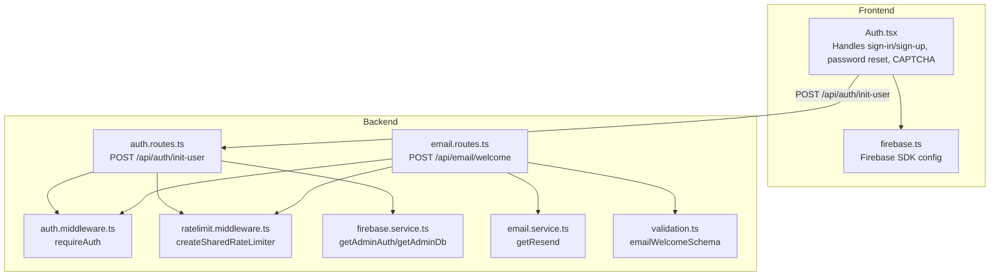
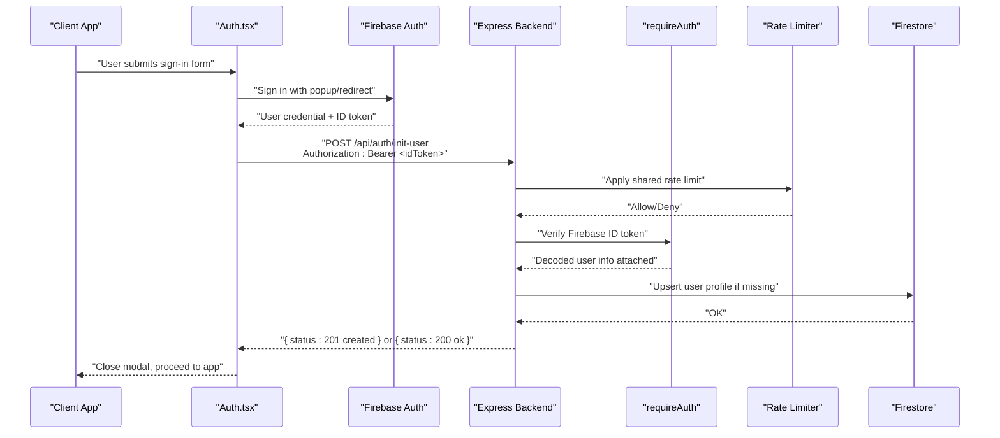
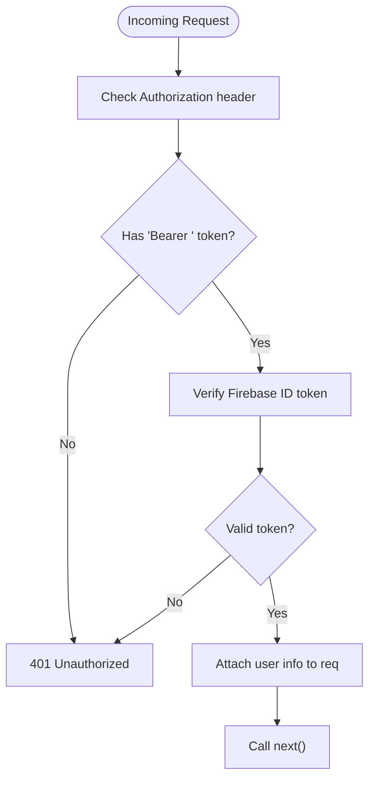
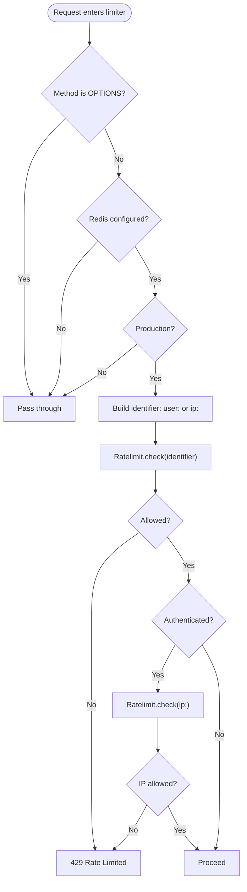
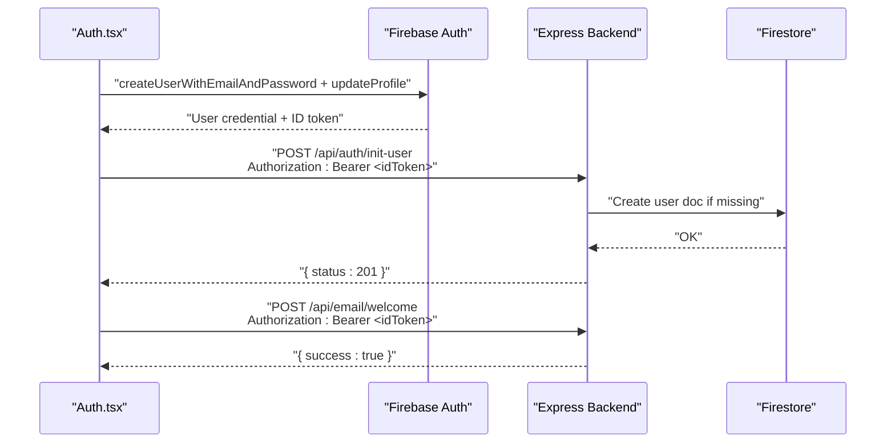
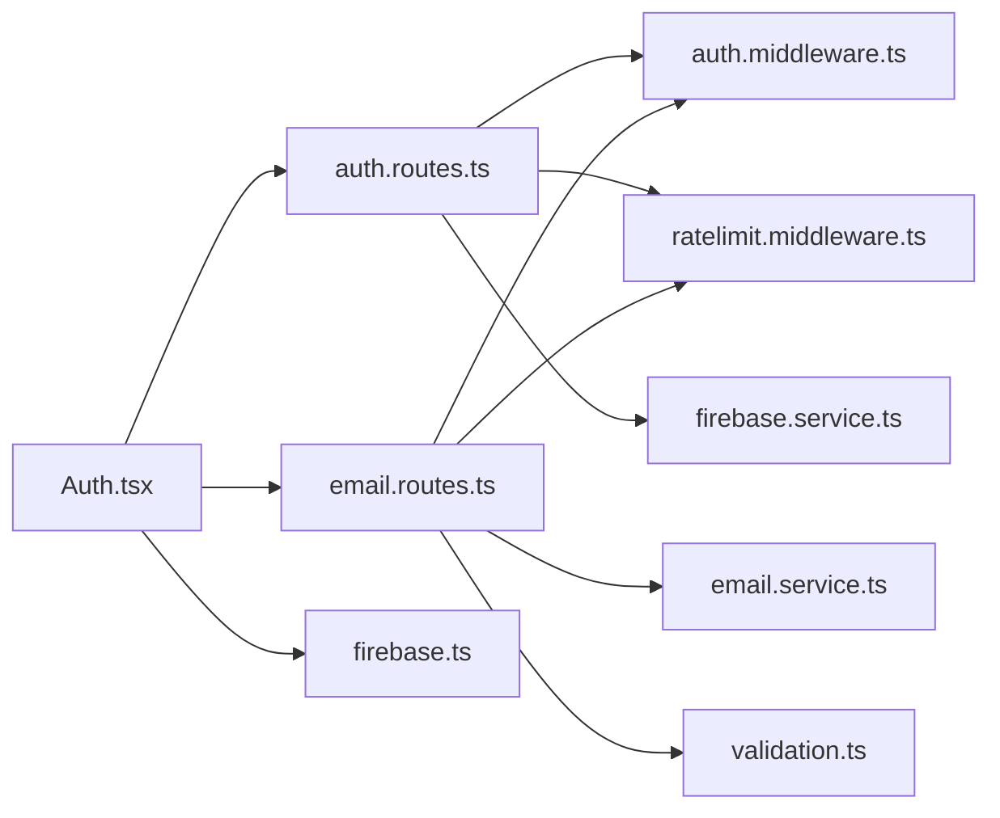

# Authentication API

<cite>
**Referenced Files in This Document**
- [auth.routes.ts](file://backend/routes/auth.routes.ts)
- [auth.middleware.ts](file://backend/middleware/auth.middleware.ts)
- [ratelimit.middleware.ts](file://backend/middleware/ratelimit.middleware.ts)
- [firebase.service.ts](file://backend/services/firebase.service.ts)
- [email.service.ts](file://backend/services/email.service.ts)
- [email.routes.ts](file://backend/routes/email.routes.ts)
- [validation.ts](file://backend/utils/validation.ts)
- [Auth.tsx](file://src/components/Auth.tsx)
- [firebase.ts](file://src/firebase.ts)
</cite>

## Table of Contents
1. [Introduction](#introduction)
2. [Project Structure](#project-structure)
3. [Core Components](#core-components)
4. [Architecture Overview](#architecture-overview)
5. [Detailed Component Analysis](#detailed-component-analysis)
6. [Dependency Analysis](#dependency-analysis)
7. [Performance Considerations](#performance-considerations)
8. [Troubleshooting Guide](#troubleshooting-guide)
9. [Conclusion](#conclusion)

## Introduction
This document provides comprehensive API documentation for FaceAnalytics Pro authentication endpoints. It covers user registration, login, password reset initiation, and session management flows. It explains JWT token handling via Firebase ID tokens, authentication middleware integration, rate limiting, and security considerations such as CAPTCHA and secure cookie handling. Practical examples illustrate typical authentication flows with request/response patterns.

## Project Structure
Authentication spans frontend and backend components:
- Frontend handles user interactions, Firebase Auth operations, and initiates backend initialization.
- Backend verifies Firebase ID tokens, initializes user profiles, and enforces rate limits.

**Diagram sources**
- [auth.routes.ts:1-91](file://backend/routes/auth.routes.ts#L1-L91)
- [auth.middleware.ts:1-40](file://backend/middleware/auth.middleware.ts#L1-L40)
- [ratelimit.middleware.ts:1-134](file://backend/middleware/ratelimit.middleware.ts#L1-L134)
- [firebase.service.ts:1-120](file://backend/services/firebase.service.ts#L1-L120)
- [email.service.ts:1-17](file://backend/services/email.service.ts#L1-L17)
- [email.routes.ts:1-63](file://backend/routes/email.routes.ts#L1-L63)
- [validation.ts:1-103](file://backend/utils/validation.ts#L1-L103)
- [Auth.tsx:1-696](file://src/components/Auth.tsx#L1-L696)
- [firebase.ts:1-21](file://src/firebase.ts#L1-L21)

**Section sources**
- [auth.routes.ts:1-91](file://backend/routes/auth.routes.ts#L1-L91)
- [auth.middleware.ts:1-40](file://backend/middleware/auth.middleware.ts#L1-L40)
- [ratelimit.middleware.ts:1-134](file://backend/middleware/ratelimit.middleware.ts#L1-L134)
- [firebase.service.ts:1-120](file://backend/services/firebase.service.ts#L1-L120)
- [email.service.ts:1-17](file://backend/services/email.service.ts#L1-L17)
- [email.routes.ts:1-63](file://backend/routes/email.routes.ts#L1-L63)
- [validation.ts:1-103](file://backend/utils/validation.ts#L1-L103)
- [Auth.tsx:1-696](file://src/components/Auth.tsx#L1-L696)
- [firebase.ts:1-21](file://src/firebase.ts#L1-L21)

## Core Components
- Authentication middleware: Verifies Firebase ID tokens and attaches user info to requests.
- Rate limiting middleware: Enforces sliding-window limits per user/IP with timeouts and safe fallbacks.
- Auth route: Initializes user profile on first sign-in and returns creation status.
- Email route: Sends welcome email after successful sign-up; rate-limited and validated.
- Frontend Auth component: Manages sign-in/sign-up, password reset, and CAPTCHA integration.

**Section sources**
- [auth.middleware.ts:18-39](file://backend/middleware/auth.middleware.ts#L18-L39)
- [ratelimit.middleware.ts:25-92](file://backend/middleware/ratelimit.middleware.ts#L25-L92)
- [auth.routes.ts:23-88](file://backend/routes/auth.routes.ts#L23-L88)
- [email.routes.ts:17-60](file://backend/routes/email.routes.ts#L17-L60)
- [Auth.tsx:88-116](file://src/components/Auth.tsx#L88-L116)

## Architecture Overview
High-level authentication flow:
- Frontend signs in via Firebase Auth and obtains an ID token.
- Frontend calls backend to initialize user profile using the ID token.
- Backend verifies the token, creates a user record if missing, and responds with status.
- Optional: Backend sends a welcome email upon new user creation.

**Diagram sources**
- [Auth.tsx:88-116](file://src/components/Auth.tsx#L88-L116)
- [auth.routes.ts:23-88](file://backend/routes/auth.routes.ts#L23-L88)
- [auth.middleware.ts:18-39](file://backend/middleware/auth.middleware.ts#L18-L39)
- [ratelimit.middleware.ts:38-91](file://backend/middleware/ratelimit.middleware.ts#L38-L91)
- [firebase.service.ts:75-119](file://backend/services/firebase.service.ts#L75-L119)

## Detailed Component Analysis

### Authentication Endpoints

#### POST /api/auth/init-user
- Purpose: Initialize user profile on first sign-in.
- Authentication: Requires a valid Firebase ID token in the Authorization header.
- Rate Limiting: Enforced via shared rate limiter (sliding window).
- Request Headers:
  - Authorization: Bearer <Firebase ID Token>
- Response Codes:
  - 201 Created: New user initialized.
  - 200 OK: User already exists.
  - 401 Unauthorized: Missing/invalid token.
  - 429 Too Many Requests: Rate limit exceeded.
  - 500 Internal Server Error: Database not initialized or internal failure.
- Behavior:
  - Skips Firestore writes if user already cached in process memory.
  - Creates user document with default fields if not present.
  - Logs secure initialization in production.

**Section sources**
- [auth.routes.ts:23-88](file://backend/routes/auth.routes.ts#L23-L88)
- [auth.middleware.ts:18-39](file://backend/middleware/auth.middleware.ts#L18-L39)
- [ratelimit.middleware.ts:38-91](file://backend/middleware/ratelimit.middleware.ts#L38-L91)

#### POST /api/email/welcome
- Purpose: Send welcome email to new users.
- Authentication: Requires a valid Firebase ID token in the Authorization header.
- Rate Limiting: Enforced via shared rate limiter (sliding window).
- Request Body Schema:
  - email: string (required, valid email)
  - name: string (optional)
  - userId: string (optional)
- Response Codes:
  - 200 OK: Email sent successfully.
  - 400 Bad Request: Validation failed.
  - 401 Unauthorized: Missing/invalid token.
  - 429 Too Many Requests: Rate limit exceeded.
  - 500 Internal Server Error: Failed to send email.

**Section sources**
- [email.routes.ts:17-60](file://backend/routes/email.routes.ts#L17-L60)
- [validation.ts:71-75](file://backend/utils/validation.ts#L71-L75)

### Authentication Middleware and Token Handling

#### requireAuth
- Extracts Authorization header and expects "Bearer <token>".
- Verifies Firebase ID token and attaches decoded user info (uid, email) to the request.
- Returns 401 on missing/invalid token.

**Diagram sources**
- [auth.middleware.ts:18-39](file://backend/middleware/auth.middleware.ts#L18-L39)
- [firebase.service.ts:113-119](file://backend/services/firebase.service.ts#L113-L119)

**Section sources**
- [auth.middleware.ts:18-39](file://backend/middleware/auth.middleware.ts#L18-L39)
- [firebase.service.ts:113-119](file://backend/services/firebase.service.ts#L113-L119)

### Rate Limiting and Abuse Prevention

#### createSharedRateLimiter
- Uses Upstash Redis with sliding window policy.
- Identifier: user:<userId> if authenticated; otherwise ip:<ip>.
- Dual enforcement: Per-account AND per-IP to prevent rotation abuse.
- Timeout: 2 seconds for rate limit checks; failsafe allows request on timeout.
- Environment: Disabled in non-production unless Redis is configured.

**Diagram sources**
- [ratelimit.middleware.ts:25-92](file://backend/middleware/ratelimit.middleware.ts#L25-L92)

**Section sources**
- [ratelimit.middleware.ts:25-92](file://backend/middleware/ratelimit.middleware.ts#L25-L92)

### Session Management and Refresh Tokens
- The backend relies on Firebase ID tokens passed in the Authorization header.
- There is no dedicated logout endpoint in the backend; Firebase Auth sign-out is handled client-side via the Firebase SDK.
- The frontend manages token lifecycle and redirects users appropriately after sign-in.

**Section sources**
- [Auth.tsx:133-183](file://src/components/Auth.tsx#L133-L183)
- [firebase.ts:7-13](file://src/firebase.ts#L7-L13)

### Registration and Login Workflows

#### Registration (Email/Password)
- Frontend collects name, email, password, optional referral code, and CAPTCHA token.
- Calls Firebase to create user and update profile.
- Optionally redeems a referral code and sends a welcome email.
- After successful registration, the frontend calls the backend initialization endpoint with the ID token.

**Diagram sources**
- [Auth.tsx:185-248](file://src/components/Auth.tsx#L185-L248)
- [auth.routes.ts:23-88](file://backend/routes/auth.routes.ts#L23-L88)
- [email.routes.ts:17-60](file://backend/routes/email.routes.ts#L17-L60)

**Section sources**
- [Auth.tsx:185-248](file://src/components/Auth.tsx#L185-L248)
- [auth.routes.ts:23-88](file://backend/routes/auth.routes.ts#L23-L88)
- [email.routes.ts:17-60](file://backend/routes/email.routes.ts#L17-L60)

#### Login (Email/Password)
- Frontend authenticates via Firebase and retrieves the ID token.
- Calls the backend initialization endpoint to ensure user profile exists.
- Proceeds to application after successful initialization.

**Section sources**
- [Auth.tsx:185-248](file://src/components/Auth.tsx#L185-L248)
- [auth.routes.ts:23-88](file://backend/routes/auth.routes.ts#L23-L88)

#### Password Reset Initiation
- Frontend triggers Firebase’s password reset email flow.
- The backend does not expose a dedicated password reset endpoint; reset links are handled by Firebase.

**Section sources**
- [Auth.tsx:74-86](file://src/components/Auth.tsx#L74-L86)

### Security Considerations
- CSRF Protection: Not implemented in the backend. Use anti-CSRF tokens and SameSite cookies at the application level if needed.
- Rate Limiting: Sliding window enforced per user/IP; safe fallback on Redis timeout.
- Secure Cookies: Not used; rely on Authorization header with bearer tokens.
- CAPTCHA: Turnstile integration on the frontend for registration to mitigate bot sign-ups.
- Transport Security: Use HTTPS in production; avoid transmitting secrets over insecure channels.

**Section sources**
- [ratelimit.middleware.ts:38-91](file://backend/middleware/ratelimit.middleware.ts#L38-L91)
- [Auth.tsx:133-183](file://src/components/Auth.tsx#L133-L183)

## Dependency Analysis

**Diagram sources**
- [auth.routes.ts:1-91](file://backend/routes/auth.routes.ts#L1-L91)
- [auth.middleware.ts:1-40](file://backend/middleware/auth.middleware.ts#L1-L40)
- [ratelimit.middleware.ts:1-134](file://backend/middleware/ratelimit.middleware.ts#L1-L134)
- [firebase.service.ts:1-120](file://backend/services/firebase.service.ts#L1-L120)
- [email.routes.ts:1-63](file://backend/routes/email.routes.ts#L1-L63)
- [email.service.ts:1-17](file://backend/services/email.service.ts#L1-L17)
- [validation.ts:1-103](file://backend/utils/validation.ts#L1-L103)
- [Auth.tsx:1-696](file://src/components/Auth.tsx#L1-L696)
- [firebase.ts:1-21](file://src/firebase.ts#L1-L21)

**Section sources**
- [auth.routes.ts:1-91](file://backend/routes/auth.routes.ts#L1-L91)
- [auth.middleware.ts:1-40](file://backend/middleware/auth.middleware.ts#L1-L40)
- [ratelimit.middleware.ts:1-134](file://backend/middleware/ratelimit.middleware.ts#L1-L134)
- [firebase.service.ts:1-120](file://backend/services/firebase.service.ts#L1-L120)
- [email.routes.ts:1-63](file://backend/routes/email.routes.ts#L1-L63)
- [email.service.ts:1-17](file://backend/services/email.service.ts#L1-L17)
- [validation.ts:1-103](file://backend/utils/validation.ts#L1-L103)
- [Auth.tsx:1-696](file://src/components/Auth.tsx#L1-L696)
- [firebase.ts:1-21](file://src/firebase.ts#L1-L21)

## Performance Considerations
- Firestore HTTP/1.1 transport is enabled in the backend to reduce cold-start latency in serverless environments.
- In-memory cache tracks known user IDs to minimize repeated Firestore reads for the same user.
- Rate limiter timeouts are bounded to prevent cascading delays.

**Section sources**
- [firebase.service.ts:94-108](file://backend/services/firebase.service.ts#L94-L108)
- [auth.routes.ts:17-21](file://backend/routes/auth.routes.ts#L17-L21)
- [ratelimit.middleware.ts:54-65](file://backend/middleware/ratelimit.middleware.ts#L54-L65)

## Troubleshooting Guide
- 401 Unauthorized on /api/auth/init-user:
  - Cause: Missing or invalid Authorization header.
  - Resolution: Ensure the frontend passes a valid Firebase ID token.
- 500 Database not initialized:
  - Cause: Firestore admin client not configured in strict environments.
  - Resolution: Set proper Firebase service account environment variables.
- 429 Too Many Requests:
  - Cause: Exceeded sliding window limit per user/IP.
  - Resolution: Wait for reset window or reduce request frequency.
- Email sending failures:
  - Cause: Missing or invalid RESEND_API_KEY.
  - Resolution: Configure the environment variable or use mock behavior in development.

**Section sources**
- [auth.middleware.ts:18-39](file://backend/middleware/auth.middleware.ts#L18-L39)
- [auth.routes.ts:36-48](file://backend/routes/auth.routes.ts#L36-L48)
- [ratelimit.middleware.ts:62-91](file://backend/middleware/ratelimit.middleware.ts#L62-L91)
- [email.service.ts:5-16](file://backend/services/email.service.ts#L5-L16)

## Conclusion
FaceAnalytics Pro uses Firebase Auth for identity and Express middleware to verify ID tokens and manage user initialization. The backend exposes a minimal set of endpoints focused on user onboarding and welcome emails, with robust rate limiting and safe fallbacks. The frontend integrates CAPTCHA and handles Firebase flows, then calls backend endpoints to finalize user setup. For production, ensure HTTPS, configure environment variables properly, and consider adding CSRF protections and refresh token handling if required.