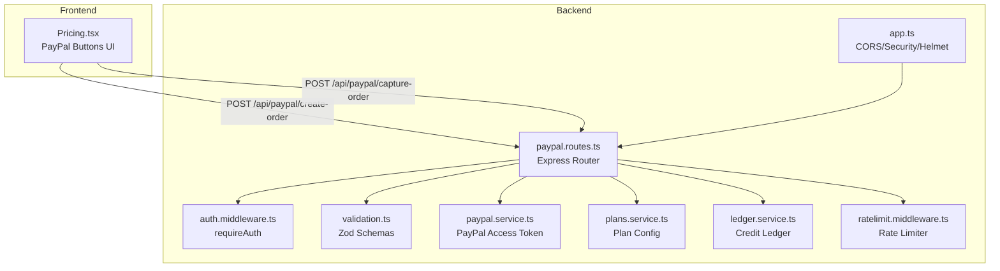
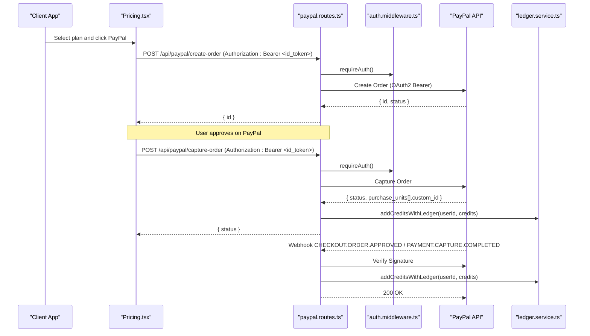
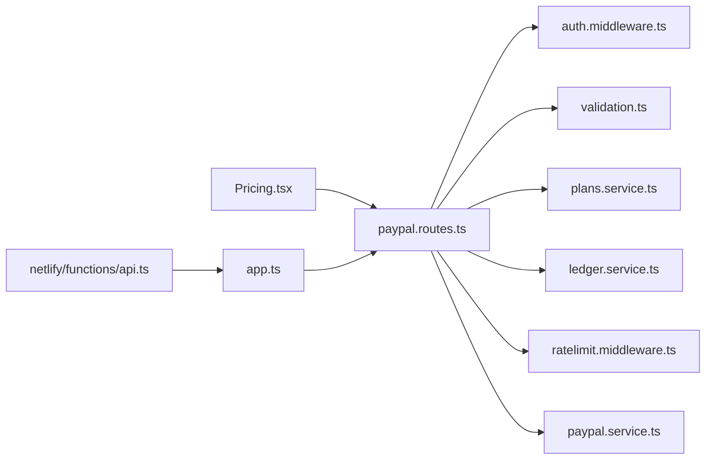
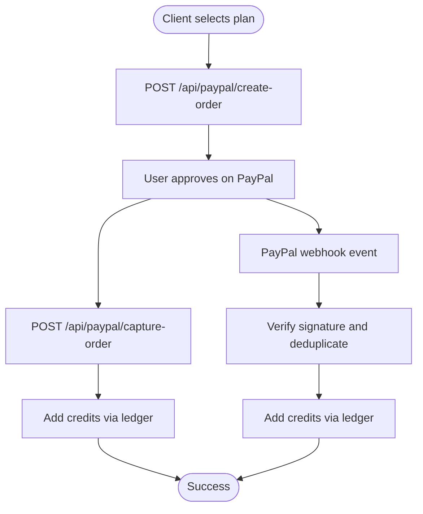

# Payment Processing API

<cite>
**Referenced Files in This Document**
- [paypal.routes.ts](file://backend/routes/paypal.routes.ts)
- [paypal.service.ts](file://backend/services/paypal.service.ts)
- [plans.service.ts](file://backend/services/plans.service.ts)
- [auth.middleware.ts](file://backend/middleware/auth.middleware.ts)
- [validation.ts](file://backend/utils/validation.ts)
- [ledger.service.ts](file://backend/services/ledger.service.ts)
- [app.ts](file://backend/app.ts)
- [ratelimit.middleware.ts](file://backend/middleware/ratelimit.middleware.ts)
- [netlify/functions/api.ts](file://netlify/functions/api.ts)
- [Pricing.tsx](file://src/components/Pricing.tsx)
</cite>

## Table of Contents
1. [Introduction](#introduction)
2. [Project Structure](#project-structure)
3. [Core Components](#core-components)
4. [Architecture Overview](#architecture-overview)
5. [Detailed Component Analysis](#detailed-component-analysis)
6. [Dependency Analysis](#dependency-analysis)
7. [Performance Considerations](#performance-considerations)
8. [Troubleshooting Guide](#troubleshooting-guide)
9. [Conclusion](#conclusion)
10. [Appendices](#appendices)

## Introduction
This document provides comprehensive API documentation for FaceAnalytics Pro payment processing endpoints powered by PayPal. It covers PayPal integration endpoints for initiating payments, executing captures, and handling webhooks. It also documents payment plan configurations, pricing tiers, and subscription billing cycles, along with security measures such as webhook signature verification and replay protection. Practical workflows, error handling strategies, and security considerations are included to guide both developers and operators.

## Project Structure
The payment processing stack is implemented in the backend and integrated with the frontend checkout flow:
- Backend routes define secure endpoints for PayPal order creation and capture.
- Services encapsulate PayPal OAuth, plan definitions, and credit ledger operations.
- Middleware enforces authentication, rate limiting, and CORS/security headers.
- Frontend components integrate PayPal Buttons and call the backend endpoints.

**Diagram sources**
- [paypal.routes.ts:1-302](file://backend/routes/paypal.routes.ts#L1-L302)
- [auth.middleware.ts:1-40](file://backend/middleware/auth.middleware.ts#L1-L40)
- [validation.ts:57-64](file://backend/utils/validation.ts#L57-L64)
- [paypal.service.ts:1-41](file://backend/services/paypal.service.ts#L1-L41)
- [plans.service.ts:1-34](file://backend/services/plans.service.ts#L1-L34)
- [ledger.service.ts:245-269](file://backend/services/ledger.service.ts#L245-L269)
- [ratelimit.middleware.ts:19-92](file://backend/middleware/ratelimit.middleware.ts#L19-L92)
- [app.ts:15-201](file://backend/app.ts#L15-L201)

**Section sources**
- [paypal.routes.ts:1-302](file://backend/routes/paypal.routes.ts#L1-L302)
- [app.ts:15-201](file://backend/app.ts#L15-L201)

## Core Components
- PayPal Order Creation Endpoint: Initiates a PayPal Checkout order with plan metadata and returns the order ID for client redirection.
- PayPal Capture Endpoint: Executes the payment capture server-side and credits user account.
- PayPal Webhook Endpoint: Validates signatures, prevents replays, and credits accounts on approved/capture-completed events.
- Plan Configuration Service: Centralizes plan IDs, names, prices, and credit allocations.
- Authentication Middleware: Enforces Firebase ID token verification for protected endpoints.
- Validation Layer: Zod schemas enforce request payload correctness.
- Ledger Service: Atomic credit additions and immutable audit trail.
- Rate Limiting: Shared sliding-window limiter with IP+userId composite keys.

**Section sources**
- [paypal.routes.ts:25-159](file://backend/routes/paypal.routes.ts#L25-L159)
- [paypal.routes.ts:161-299](file://backend/routes/paypal.routes.ts#L161-L299)
- [plans.service.ts:13-33](file://backend/services/plans.service.ts#L13-L33)
- [auth.middleware.ts:18-39](file://backend/middleware/auth.middleware.ts#L18-L39)
- [validation.ts:57-64](file://backend/utils/validation.ts#L57-L64)
- [ledger.service.ts:245-269](file://backend/services/ledger.service.ts#L245-L269)
- [ratelimit.middleware.ts:25-92](file://backend/middleware/ratelimit.middleware.ts#L25-L92)

## Architecture Overview
The payment flow integrates frontend PayPal Buttons with backend endpoints and PayPal APIs. The system ensures idempotent credit updates and robust webhook verification.

**Diagram sources**
- [Pricing.tsx:137-190](file://src/components/Pricing.tsx#L137-L190)
- [paypal.routes.ts:25-159](file://backend/routes/paypal.routes.ts#L25-L159)
- [paypal.routes.ts:161-299](file://backend/routes/paypal.routes.ts#L161-L299)
- [auth.middleware.ts:18-39](file://backend/middleware/auth.middleware.ts#L18-L39)
- [ledger.service.ts:245-269](file://backend/services/ledger.service.ts#L245-L269)

## Detailed Component Analysis

### PayPal Order Creation Endpoint
- Method: POST
- URL: /api/paypal/create-order
- Authentication: Bearer token required (Firebase ID token verified)
- Rate Limiting: Sliding window (shared limiter)
- Request Schema:
  - planId: string (required)
- Response:
  - PayPal v2 Orders response (includes order id and status)
- Behavior:
  - Validates planId against centralized plan registry
  - Builds purchase unit with currency USD, plan price, and human-readable description
  - Embeds userId and planId in custom_id for downstream processing
  - Uses cached PayPal access token for OAuth2 calls

**Section sources**
- [paypal.routes.ts:25-76](file://backend/routes/paypal.routes.ts#L25-L76)
- [validation.ts:57-59](file://backend/utils/validation.ts#L57-L59)
- [plans.service.ts:13-33](file://backend/services/plans.service.ts#L13-L33)
- [paypal.service.ts:12-40](file://backend/services/paypal.service.ts#L12-L40)
- [ratelimit.middleware.ts:19-92](file://backend/middleware/ratelimit.middleware.ts#L19-L92)

### PayPal Capture Endpoint
- Method: POST
- URL: /api/paypal/capture-order
- Authentication: Bearer token required
- Request Schema:
  - orderID: string (required)
  - planId: string (optional)
- Response:
  - PayPal v2 Orders capture response (status, purchase units)
- Behavior:
  - Calls PayPal capture endpoint
  - Parses custom_id from purchase unit or capture metadata to extract planId
  - Validates planId and computes credits
  - Idempotently credits user and marks order processed
  - Writes ledger entries atomically

**Section sources**
- [paypal.routes.ts:78-159](file://backend/routes/paypal.routes.ts#L78-L159)
- [validation.ts:61-64](file://backend/utils/validation.ts#L61-L64)
- [plans.service.ts:20-33](file://backend/services/plans.service.ts#L20-L33)
- [ledger.service.ts:245-269](file://backend/services/ledger.service.ts#L245-L269)

### PayPal Webhook Endpoint
- Method: POST
- URL: /api/paypal/webhook
- Authentication: Public endpoint with signature verification and replay protection
- Headers:
  - paypal-auth-algo, paypal-cert-url, paypal-transmission-id, paypal-transmission-sig, paypal-transmission-time
- Body: PayPal webhook event payload
- Behavior:
  - Replay protection: deduplicates events using Redis keyed by event id
  - Signature verification: validates webhook authenticity against PayPal using stored webhook id
  - Event filtering: processes APPROVED and CAPTURE COMPLETED events
  - Extracts userId and planId from custom_id and credits user if not already processed
  - Sends receipt email via Resend when applicable

**Section sources**
- [paypal.routes.ts:161-299](file://backend/routes/paypal.routes.ts#L161-L299)
- [paypal.service.ts:12-40](file://backend/services/paypal.service.ts#L12-L40)

### Plan Configuration and Pricing
- Centralized plan registry defines:
  - price_single, price_basic, price_pro, price_elite
  - Human-readable names, USD prices, and credit allocations
- Used by:
  - Order creation (price and description)
  - Capture and webhook handlers (credit allocation)
  - Frontend selection logic

**Section sources**
- [plans.service.ts:13-33](file://backend/services/plans.service.ts#L13-L33)

### Authentication and Authorization
- All protected endpoints require a valid Firebase ID token passed in Authorization header.
- Token verification decodes uid and email for request context.

**Section sources**
- [auth.middleware.ts:18-39](file://backend/middleware/auth.middleware.ts#L18-L39)

### Validation Layer
- Zod schemas validate request payloads:
  - paypalCreateOrderSchema: planId required
  - paypalCaptureOrderSchema: orderID required; planId optional
- On validation failure, returns structured error details.

**Section sources**
- [validation.ts:57-64](file://backend/utils/validation.ts#L57-L64)

### Ledger Operations
- addCreditsWithLedger: Adds credits and writes immutable ledger entry
- Idempotency: processed_orders collection prevents duplicate crediting
- Audit trail: Every credit change is recorded with metadata (orderId, planId, source)

**Section sources**
- [ledger.service.ts:245-269](file://backend/services/ledger.service.ts#L245-L269)
- [paypal.routes.ts:128-151](file://backend/routes/paypal.routes.ts#L128-L151)

### Rate Limiting
- Shared sliding window limiter keyed by user or IP
- Composite protection: authenticated users are also rate limited by IP to prevent rotation abuse
- Timeout-safe: rate limit checks have a 2-second timeout and fail open if Redis is slow

**Section sources**
- [ratelimit.middleware.ts:25-92](file://backend/middleware/ratelimit.middleware.ts#L25-L92)

### Frontend Integration
- PayPalScriptProvider loads PayPal SDK with client id
- PayPalButtons trigger createOrder and onApprove callbacks
- createOrder calls backend to create order and returns order id
- onApprove calls backend capture endpoint and handles success/failure

**Section sources**
- [Pricing.tsx:137-190](file://src/components/Pricing.tsx#L137-L190)

## Dependency Analysis

**Diagram sources**
- [paypal.routes.ts:1-302](file://backend/routes/paypal.routes.ts#L1-L302)
- [auth.middleware.ts:1-40](file://backend/middleware/auth.middleware.ts#L1-L40)
- [validation.ts:1-103](file://backend/utils/validation.ts#L1-L103)
- [plans.service.ts:1-34](file://backend/services/plans.service.ts#L1-L34)
- [ledger.service.ts:1-269](file://backend/services/ledger.service.ts#L1-L269)
- [ratelimit.middleware.ts:1-134](file://backend/middleware/ratelimit.middleware.ts#L1-L134)
- [paypal.service.ts:1-41](file://backend/services/paypal.service.ts#L1-L41)
- [app.ts:15-201](file://backend/app.ts#L15-L201)
- [netlify/functions/api.ts:1-28](file://netlify/functions/api.ts#L1-L28)

**Section sources**
- [paypal.routes.ts:1-302](file://backend/routes/paypal.routes.ts#L1-L302)
- [app.ts:15-201](file://backend/app.ts#L15-L201)

## Performance Considerations
- Token caching: PayPal access tokens are cached with a 5-minute buffer before expiry to reduce OAuth2 overhead.
- Idempotency: processed_orders collection and Redis replay protection prevent duplicate crediting under high event volume.
- Rate limiting: Sliding window with per-user and per-IP enforcement reduces abuse while allowing legitimate usage.
- Serverless cold start mitigation: Backend modules are dynamically imported on first invocation to keep initialization fast.

[No sources needed since this section provides general guidance]

## Troubleshooting Guide
Common issues and resolutions:
- Invalid plan ID
  - Cause: Unknown planId in request or response metadata
  - Resolution: Ensure planId matches centralized registry
  - Evidence: Validation and plan lookup checks
- Invalid order metadata
  - Cause: Malformed or missing custom_id in PayPal response
  - Resolution: Verify order creation and capture flows; ensure custom_id is present
- Duplicate webhook events
  - Cause: Replay attack or PayPal retry
  - Resolution: Replay protection uses Redis to block duplicates
- Webhook signature verification failed
  - Cause: Missing or incorrect webhook id, or tampered event
  - Resolution: Configure PAYPAL_WEBHOOK_ID; verify headers and event payload
- Insufficient credits or user not found
  - Cause: Ledger transaction errors
  - Resolution: Check Firestore availability and user existence
- Rate limit exceeded
  - Cause: Too many requests within window
  - Resolution: Back off and retry; ensure proper user/IP identification

**Section sources**
- [paypal.routes.ts:36-38](file://backend/routes/paypal.routes.ts#L36-L38)
- [paypal.routes.ts:113-124](file://backend/routes/paypal.routes.ts#L113-L124)
- [paypal.routes.ts:172-179](file://backend/routes/paypal.routes.ts#L172-L179)
- [paypal.routes.ts:207-214](file://backend/routes/paypal.routes.ts#L207-L214)
- [ledger.service.ts:108-140](file://backend/services/ledger.service.ts#L108-L140)
- [ratelimit.middleware.ts:71-83](file://backend/middleware/ratelimit.middleware.ts#L71-L83)

## Conclusion
The payment processing API integrates PayPal Checkout with robust security, idempotent credit updates, and comprehensive webhook handling. The modular design centralizes plan definitions, enforces authentication and validation, and provides resilient rate limiting and replay protection. The frontend seamlessly connects PayPal Buttons to backend endpoints, ensuring a smooth customer experience from initiation to completion.

[No sources needed since this section summarizes without analyzing specific files]

## Appendices

### API Reference

- Base URL
  - Production: https://yourdomain.com/api/paypal
  - Local development: http://localhost:3000/api/paypal

- Authentication
  - All protected endpoints require Authorization: Bearer <Firebase ID Token>

- Endpoints

  1) Create Order
  - Method: POST
  - URL: /create-order
  - Headers:
    - Content-Type: application/json
    - Authorization: Bearer <id_token>
  - Request Body:
    - planId: string (required)
  - Response:
    - PayPal v2 Orders response including order id

  2) Capture Order
  - Method: POST
  - URL: /capture-order
  - Headers:
    - Content-Type: application/json
    - Authorization: Bearer <id_token>
  - Request Body:
    - orderID: string (required)
    - planId: string (optional)
  - Response:
    - PayPal v2 Orders capture response

  3) Webhook
  - Method: POST
  - URL: /webhook
  - Headers:
    - paypal-auth-algo, paypal-cert-url, paypal-transmission-id, paypal-transmission-sig, paypal-transmission-time
  - Request Body:
    - PayPal webhook event payload
  - Response:
    - 200 OK on success; 403 on invalid signature; 429 on duplicate (when blocked)

**Section sources**
- [paypal.routes.ts:25-159](file://backend/routes/paypal.routes.ts#L25-L159)
- [paypal.routes.ts:161-299](file://backend/routes/paypal.routes.ts#L161-L299)

### Payment Plans and Pricing
- price_single: Trial, $1.49, 1 credit
- price_basic: Explorer, $4.99, 5 credits
- price_pro: Max Potential, $12.99, 15 credits
- price_elite: Elite, $29.99, 50 credits

**Section sources**
- [plans.service.ts:13-18](file://backend/services/plans.service.ts#L13-L18)

### Security Considerations
- Webhook Signature Verification
  - Endpoint verifies incoming webhook signatures using PayPal’s verification API
  - Requires PAYPAL_WEBHOOK_ID environment variable in production
- Replay Protection
  - Redis keyed by event id prevents duplicate processing
- Authentication
  - All protected endpoints require Firebase ID token verification
- CORS and Security Headers
  - Helmet CSP allows PayPal domains; CORS validated against APP_URL allowlist
- PCI Compliance
  - Client-side payment flow uses PayPal hosted buttons; sensitive payment data never touches the server

**Section sources**
- [paypal.routes.ts:182-221](file://backend/routes/paypal.routes.ts#L182-L221)
- [app.ts:90-140](file://backend/app.ts#L90-L140)

### Error Handling Examples
- Validation failure
  - Response: 400 with structured error details
- Unauthorized
  - Response: 401 with unauthorized message
- Rate limit exceeded
  - Response: 429 with rate limit details
- Internal server error
  - Response: 500 with request id

**Section sources**
- [validation.ts:90-102](file://backend/utils/validation.ts#L90-L102)
- [auth.middleware.ts:20-22](file://backend/middleware/auth.middleware.ts#L20-L22)
- [ratelimit.middleware.ts:71-74](file://backend/middleware/ratelimit.middleware.ts#L71-L74)
- [app.ts:182-191](file://backend/app.ts#L182-L191)

### Payment Flow Diagram

**Diagram sources**
- [Pricing.tsx:137-190](file://src/components/Pricing.tsx#L137-L190)
- [paypal.routes.ts:25-159](file://backend/routes/paypal.routes.ts#L25-L159)
- [paypal.routes.ts:161-299](file://backend/routes/paypal.routes.ts#L161-L299)
- [ledger.service.ts:245-269](file://backend/services/ledger.service.ts#L245-L269)