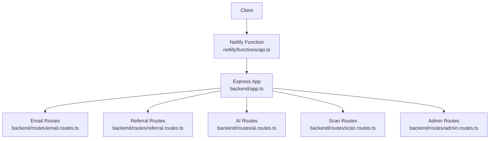
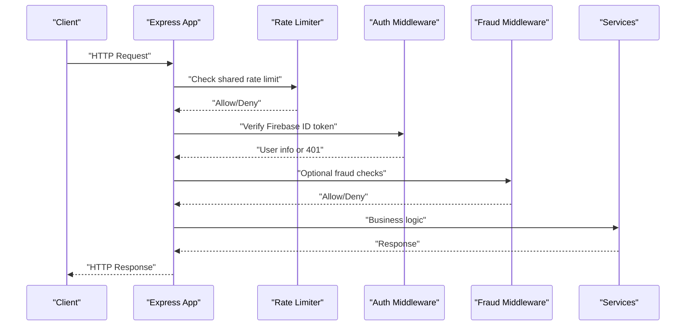
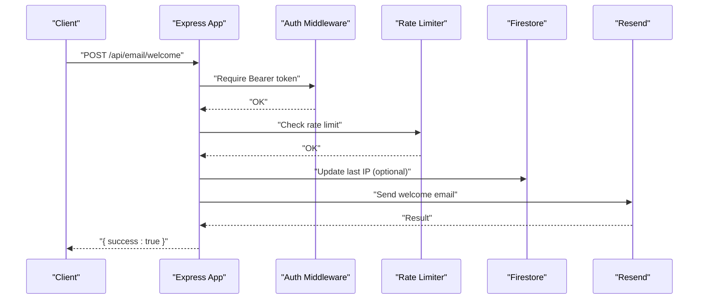
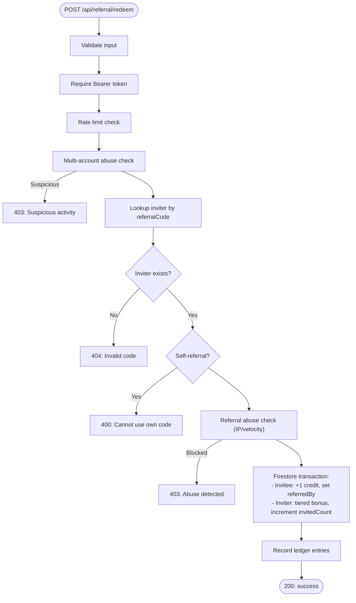
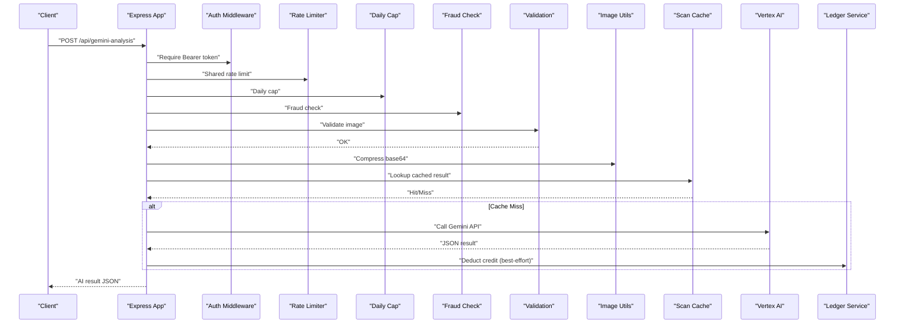
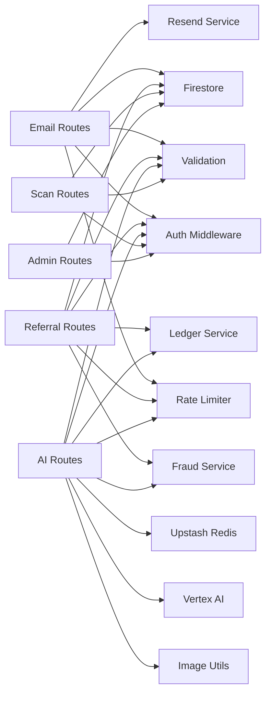

# Utility and Support API

<cite>
**Referenced Files in This Document**
- [app.ts](file://backend/app.ts)
- [api.ts](file://netlify/functions/api.ts)
- [email.routes.ts](file://backend/routes/email.routes.ts)
- [referral.routes.ts](file://backend/routes/referral.routes.ts)
- [ai.routes.ts](file://backend/routes/ai.routes.ts)
- [scan.routes.ts](file://backend/routes/scan.routes.ts)
- [admin.routes.ts](file://backend/routes/admin.routes.ts)
- [email.service.ts](file://backend/services/email.service.ts)
- [fraud.service.ts](file://backend/services/fraud.service.ts)
- [ratelimit.middleware.ts](file://backend/middleware/ratelimit.middleware.ts)
- [validation.ts](file://backend/utils/validation.ts)
</cite>

## Table of Contents
1. [Introduction](#introduction)
2. [Project Structure](#project-structure)
3. [Core Components](#core-components)
4. [Architecture Overview](#architecture-overview)
5. [Detailed Component Analysis](#detailed-component-analysis)
6. [Dependency Analysis](#dependency-analysis)
7. [Performance Considerations](#performance-considerations)
8. [Troubleshooting Guide](#troubleshooting-guide)
9. [Conclusion](#conclusion)

## Introduction
This document describes the Utility and Support API surface for FaceAnalytics Pro, focusing on:
- Email notification endpoints
- Referral system endpoints
- AI assistance endpoints
- Health check endpoint for system monitoring
- Contact form submission patterns
- Integration guidelines for email services, referral tracking, and AI-powered assistance
- Practical usage examples, error handling, rate limiting, and security considerations

## Project Structure
The API is served via an Express application mounted under /api. Serverless deployment is handled by a Netlify function wrapper that lazily initializes the backend on first request.

**Diagram sources**
- [api.ts:12-27](file://netlify/functions/api.ts#L12-L27)
- [app.ts:166-179](file://backend/app.ts#L166-L179)

**Section sources**
- [app.ts:166-179](file://backend/app.ts#L166-L179)
- [api.ts:12-27](file://netlify/functions/api.ts#L12-L27)

## Core Components
- Authentication: All secure endpoints require a valid Firebase ID token via Authorization: Bearer <token>.
- Rate Limiting: Shared sliding-window rate limits keyed by user or IP, with per-user daily caps for AI endpoints.
- Fraud Controls: Device fingerprinting, IP/device correlation, and risk-aware gating for expensive operations.
- Email Delivery: Resend integration with graceful fallback when API key is missing.
- AI Assistants: Gemini-powered analysis endpoints with robust retry, timeouts, and credit-safe flows.

**Section sources**
- [ratelimit.middleware.ts:25-92](file://backend/middleware/ratelimit.middleware.ts#L25-L92)
- [ratelimit.middleware.ts:98-133](file://backend/middleware/ratelimit.middleware.ts#L98-L133)
- [fraud.service.ts:99-121](file://backend/services/fraud.service.ts#L99-L121)
- [fraud.service.ts:210-259](file://backend/services/fraud.service.ts#L210-L259)
- [fraud.service.ts:315-341](file://backend/services/fraud.service.ts#L315-L341)
- [email.service.ts:5-16](file://backend/services/email.service.ts#L5-L16)

## Architecture Overview
The API exposes public and secure endpoints grouped by function. Secure endpoints enforce authentication and often combine rate limiting, daily caps, and fraud checks. AI endpoints perform Vertex AI calls with retry/backoff and credit-safe deduction.

**Diagram sources**
- [app.ts:166-179](file://backend/app.ts#L166-L179)
- [ratelimit.middleware.ts:38-91](file://backend/middleware/ratelimit.middleware.ts#L38-L91)
- [fraud.service.ts:127-204](file://backend/services/fraud.service.ts#L127-L204)

## Detailed Component Analysis

### Health Check Endpoint
- Method: GET
- URL: /api/health
- Purpose: Lightweight system health probe
- Authentication: Not required
- Response: { status: "ok" }
- Notes: Minimal logging and no environment details exposed

**Section sources**
- [app.ts:166-169](file://backend/app.ts#L166-L169)

### Email Notification Endpoint
- Method: POST
- URL: /api/email/welcome
- Authentication: Required (Bearer token)
- Rate Limit: 3 per 10 minutes
- Request Body Schema (validated):
  - email: string (required, valid email)
  - name: string (optional, max 100)
  - userId: string (optional)
- Behavior:
  - Updates user’s last IP in Firestore if userId provided
  - Sends a welcome email via Resend
  - Mocks email sending if API key is missing
- Response: { success: true } on success
- Errors:
  - 400: Validation failure
  - 401: Unauthorized
  - 429: Rate limit exceeded
  - 500: Internal error or email send failure

**Diagram sources**
- [email.routes.ts:18-60](file://backend/routes/email.routes.ts#L18-L60)
- [email.service.ts:5-16](file://backend/services/email.service.ts#L5-L16)

**Section sources**
- [email.routes.ts:10-15](file://backend/routes/email.routes.ts#L10-L15)
- [email.routes.ts:18-60](file://backend/routes/email.routes.ts#L18-L60)
- [validation.ts:71-75](file://backend/utils/validation.ts#L71-L75)
- [email.service.ts:5-16](file://backend/services/email.service.ts#L5-L16)

### Referral System Endpoints
- Method: POST
- URL: /api/referral/redeem
- Authentication: Required (Bearer token)
- Rate Limit: 5 per 15 minutes
- Request Body Schema (validated):
  - referralCode: string (required, max 20)
  - fingerprint: string (optional)
- Behavior:
  - Validates referral code existence and self-referral
  - Fraud checks: multi-account abuse and referral abuse
  - Atomic transaction updates invitee (+1 credit) and inviter (tiered bonuses)
  - Records ledger entries
- Response: { success: true, message: "...bonus credit." }
- Errors:
  - 400: Invalid code, already used, insufficient credits (soft check), invalid input
  - 401: Unauthorized
  - 403: Suspicious activity or abuse detected
  - 404: Invalid referral code
  - 429: Rate limit exceeded
  - 500: Internal error

**Diagram sources**
- [referral.routes.ts:24-144](file://backend/routes/referral.routes.ts#L24-L144)
- [fraud.service.ts:210-259](file://backend/services/fraud.service.ts#L210-L259)
- [fraud.service.ts:265-309](file://backend/services/fraud.service.ts#L265-L309)

**Section sources**
- [referral.routes.ts:16-21](file://backend/routes/referral.routes.ts#L16-L21)
- [referral.routes.ts:24-144](file://backend/routes/referral.routes.ts#L24-L144)
- [validation.ts:66-69](file://backend/utils/validation.ts#L66-L69)

- Method: GET
- URL: /api/referral/leaderboard
- Authentication: Optional (Bearer token accepted to tag current user)
- Public endpoint returning top 5 inviters with anonymized names and invite counts
- Response: { leaderboard: [ { rank, name, invites, isCurrentUser? }, ... ] }
- Errors:
  - 500: Database error

**Section sources**
- [referral.routes.ts:147-231](file://backend/routes/referral.routes.ts#L147-L231)

### AI Assistance Endpoints
All AI endpoints:
- Require authentication
- Apply shared rate limits and per-user daily caps
- Perform soft credit checks before expensive operations
- Compress images and cache results to reduce cost and latency
- Call Vertex AI with retry/backoff and strict JSON parsing
- Deduct credits only after successful AI processing

- Method: POST
- URL: /api/gemini-analysis
- Authentication: Required
- Rate Limit: 5 per 10 minutes
- Daily Cap: 50 per user
- Request Body Schema (validated):
  - image: string (required, base64 image)
- Response: Structured JSON with skin quality, aesthetics, insights, recommendations, and improvement plan
- Errors:
  - 400: Validation failure
  - 401: Unauthorized
  - 403: Insufficient credits or flagged for unusual activity
  - 429: Rate limit or daily cap exceeded
  - 502: Vertex AI upstream failure or parse error
  - 500: Internal error

- Method: POST
- URL: /api/celebrity-lookalike
- Authentication: Required
- Rate Limit: 3 per 10 minutes
- Daily Cap: 30 per user
- Request Body Schema (validated):
  - image: string (required, supports data URL or Firebase Storage URL)
- Response: { celebritySimilarity: [ { name, percentage, reason, imageUrl }, ... ] }
- Errors:
  - 400: Validation or SSRF/url restrictions
  - 401: Unauthorized
  - 403: Insufficient credits or flagged
  - 429: Rate limit or daily cap exceeded
  - 502: Vertex AI or parse error
  - 500: Internal error

- Method: POST
- URL: /api/hair-analysis
- Authentication: Required
- Rate Limit: 3 per 10 minutes
- Daily Cap: 30 per user
- Request Body Schema (validated):
  - image: string (required)
- Response: Structured JSON with hair-related insights and recommendations
- Errors:
  - 400: Validation failure
  - 401: Unauthorized
  - 403: Insufficient credits or flagged
  - 429: Rate limit or daily cap exceeded
  - 502: Vertex AI or parse error
  - 500: Internal error

**Diagram sources**
- [ai.routes.ts:271-516](file://backend/routes/ai.routes.ts#L271-L516)
- [ai.routes.ts:518-754](file://backend/routes/ai.routes.ts#L518-L754)
- [ai.routes.ts:756-800](file://backend/routes/ai.routes.ts#L756-L800)
- [ratelimit.middleware.ts:25-92](file://backend/middleware/ratelimit.middleware.ts#L25-L92)
- [ratelimit.middleware.ts:98-133](file://backend/middleware/ratelimit.middleware.ts#L98-L133)
- [fraud.service.ts:315-341](file://backend/services/fraud.service.ts#L315-L341)

**Section sources**
- [ai.routes.ts:51-70](file://backend/routes/ai.routes.ts#L51-L70)
- [ai.routes.ts:73-79](file://backend/routes/ai.routes.ts#L73-L79)
- [ai.routes.ts:271-516](file://backend/routes/ai.routes.ts#L271-L516)
- [ai.routes.ts:518-754](file://backend/routes/ai.routes.ts#L518-L754)
- [ai.routes.ts:756-800](file://backend/routes/ai.routes.ts#L756-L800)
- [validation.ts:13-19](file://backend/utils/validation.ts#L13-L19)
- [validation.ts:17-23](file://backend/utils/validation.ts#L17-L23)
- [validation.ts:66-69](file://backend/utils/validation.ts#L66-L69)

### Scan History and Save Endpoints
- Method: POST
- URL: /api/scans/save
- Authentication: Required
- Rate Limit: 20 per 10 minutes
- Request Body Schema (validated):
  - overallScore: number (0–10)
  - analysisData: string (required, max ~1MB)
  - imageUrl: string (optional, max 100)
- Response: { id: "<scan-id>" }
- Errors:
  - 400: Validation failure
  - 401: Unauthorized
  - 429: Rate limit exceeded
  - 500: Internal error

- Method: GET
- URL: /api/scans/history
- Authentication: Required
- Rate Limit: 30 per minute
- Query Parameters:
  - limit: number (default 20, max 50)
  - cursor: string (pagination token)
- Response: { scans: [...], hasMore: boolean }
- Errors:
  - 401: Unauthorized
  - 429: Rate limit exceeded
  - 500: Internal error

**Section sources**
- [scan.routes.ts:11-20](file://backend/routes/scan.routes.ts#L11-L20)
- [scan.routes.ts:22-44](file://backend/routes/scan.routes.ts#L22-L44)
- [scan.routes.ts:46-60](file://backend/routes/scan.routes.ts#L46-L60)
- [validation.ts:77-81](file://backend/utils/validation.ts#L77-L81)

### Admin Analytics and Logs Management
- Method: GET
- URL: /api/admin/analytics
- Authentication: Required + Admin role verification
- Response: Aggregated metrics (users, scans, orders, credits, top referrers)
- Errors:
  - 401/403: Unauthorized or not admin
  - 500: Internal error

- Method: POST
- URL: /api/admin/purge-logs
- Authentication: Required + Admin role verification
- Request Body:
  - retentionDays: number (clamped 1–365)
- Response: { deleted: number, retentionDays: number }
- Errors:
  - 401/403: Unauthorized or not admin
  - 500: Internal error

**Section sources**
- [admin.routes.ts:44-119](file://backend/routes/admin.routes.ts#L44-L119)
- [admin.routes.ts:121-131](file://backend/routes/admin.routes.ts#L121-L131)

## Dependency Analysis
- Route dependencies:
  - Email: rate limiter, auth, validation, Resend service, Firestore
  - Referral: rate limiter, auth, validation, fraud service, ledger service, Firestore
  - AI: rate limiter, auth, validation, fraud middleware, image compression, Vertex AI, Redis/Upstash for caching, ledger service
  - Scan: auth, validation, Firestore
  - Admin: auth, admin middleware, Firestore
- External integrations:
  - Resend (emails)
  - Upstash Redis (rate limiting, caching)
  - Vertex AI (Google Generative Language / Vertex AI)
  - Firebase Admin (Firestore, Auth)

**Diagram sources**
- [email.routes.ts:1-8](file://backend/routes/email.routes.ts#L1-L8)
- [referral.routes.ts:1-14](file://backend/routes/referral.routes.ts#L1-L14)
- [ai.routes.ts:1-18](file://backend/routes/ai.routes.ts#L1-L18)
- [scan.routes.ts:1-9](file://backend/routes/scan.routes.ts#L1-L9)
- [admin.routes.ts:1-7](file://backend/routes/admin.routes.ts#L1-L7)

**Section sources**
- [email.routes.ts:1-8](file://backend/routes/email.routes.ts#L1-L8)
- [referral.routes.ts:1-14](file://backend/routes/referral.routes.ts#L1-L14)
- [ai.routes.ts:1-18](file://backend/routes/ai.routes.ts#L1-L18)
- [scan.routes.ts:1-9](file://backend/routes/scan.routes.ts#L1-L9)
- [admin.routes.ts:1-7](file://backend/routes/admin.routes.ts#L1-L7)

## Performance Considerations
- Image compression reduces payload sizes and API call costs for Vertex AI.
- Redis caching (Upstash) is used for rate limiting, daily caps, and leaderboard caching.
- Retry with exponential backoff mitigates transient upstream failures.
- Timeout budgets balance responsiveness with reliability (24s for serverless, 60s for local).
- Best-effort credit deduction ensures users still receive results even if Firestore is temporarily unavailable.

[No sources needed since this section provides general guidance]

## Troubleshooting Guide
Common error categories and remedies:
- Authentication failures (401):
  - Ensure Authorization: Bearer <valid Firebase ID token> is included.
- Authorization failures (403):
  - Admin endpoints require verified admin role.
  - Risk-aware fraud checks may block operations; contact support if flagged.
- Rate limiting (429):
  - Respect X-RateLimit-* headers; reduce request frequency.
  - Daily caps reset at midnight UTC; retry later.
- Validation errors (400):
  - Confirm request body matches schema (image size limits, required fields).
- AI failures (502/500):
  - Retry after delay; check Vertex AI availability and API key configuration.
- Email failures:
  - Verify RESEND_API_KEY is set; otherwise, emails are mocked.

Operational checks:
- Health: GET /api/health
- Logs: Review server logs for request IDs and error traces.

**Section sources**
- [app.ts:166-169](file://backend/app.ts#L166-L169)
- [ratelimit.middleware.ts:71-74](file://backend/middleware/ratelimit.middleware.ts#L71-L74)
- [ratelimit.middleware.ts:118-123](file://backend/middleware/ratelimit.middleware.ts#L118-L123)
- [fraud.service.ts:429-472](file://backend/services/fraud.service.ts#L429-L472)
- [ai.routes.ts:433-442](file://backend/routes/ai.routes.ts#L433-L442)
- [email.service.ts:8-12](file://backend/services/email.service.ts#L8-L12)

## Conclusion
The Utility and Support API provides secure, rate-limited, and fraud-aware endpoints for email notifications, referral management, and AI-powered facial analysis. Integrators should adhere to rate limits, handle validation errors, and prepare for transient upstream failures. Admin endpoints enable operational oversight and maintenance.