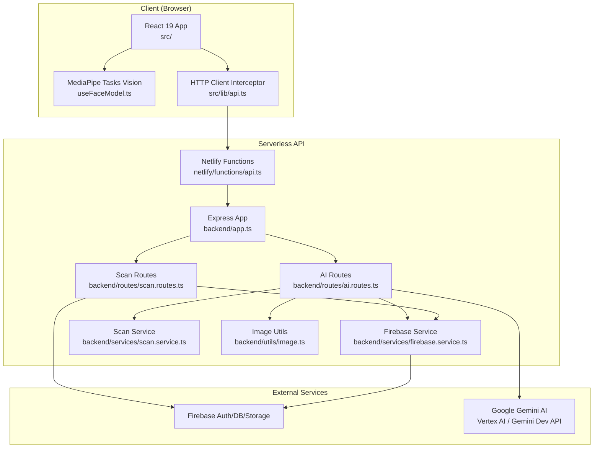
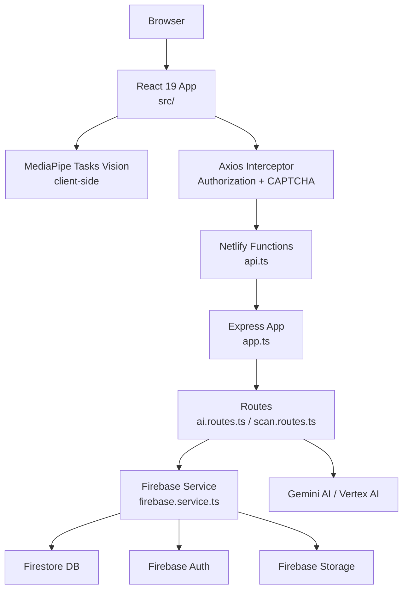
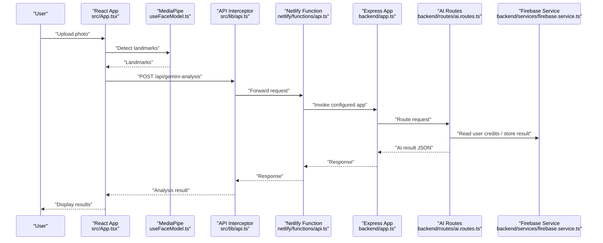
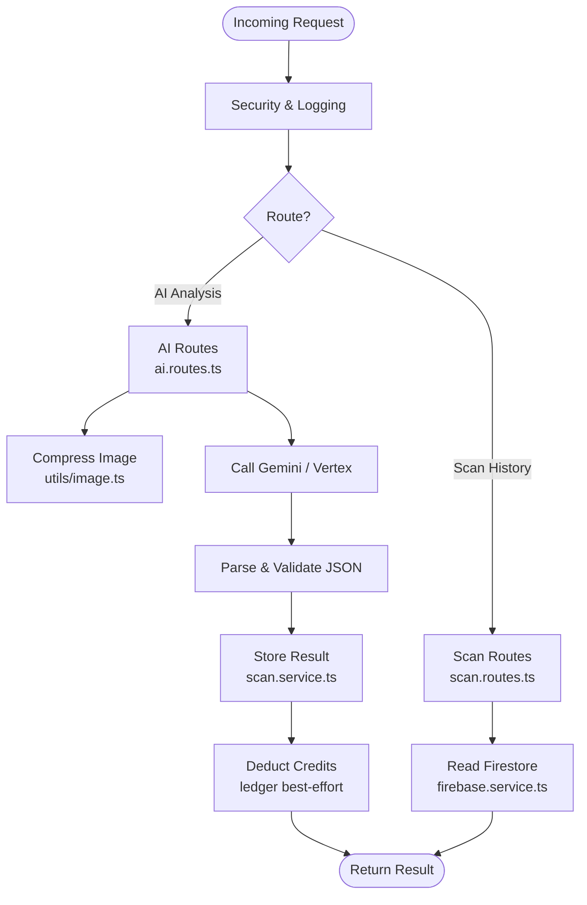
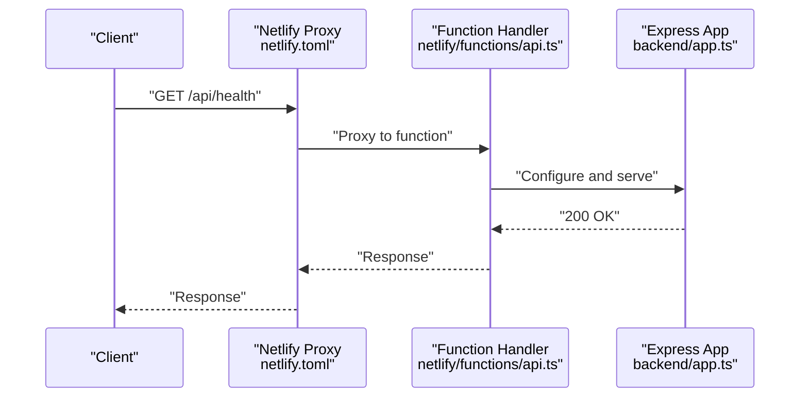
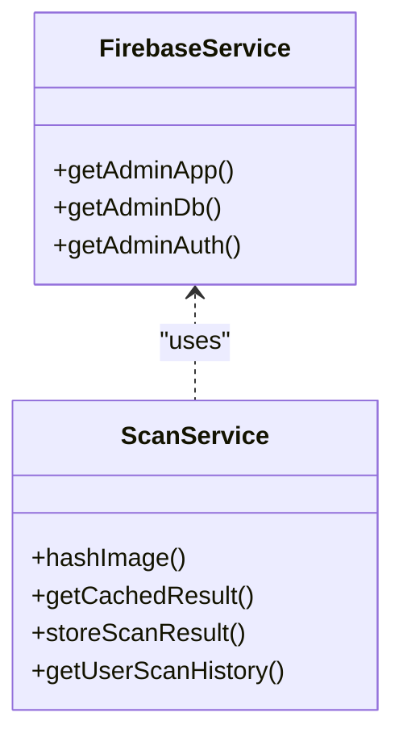
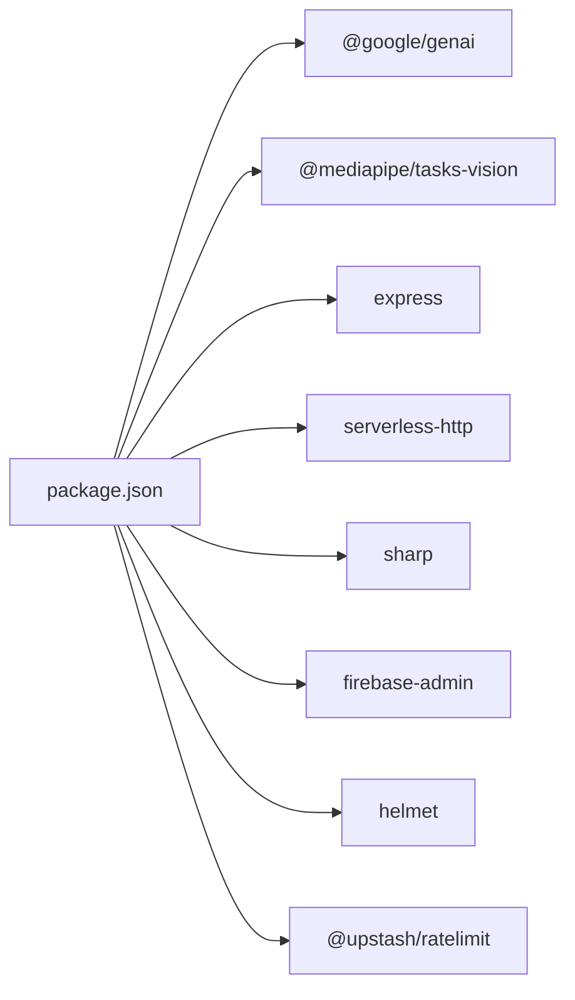
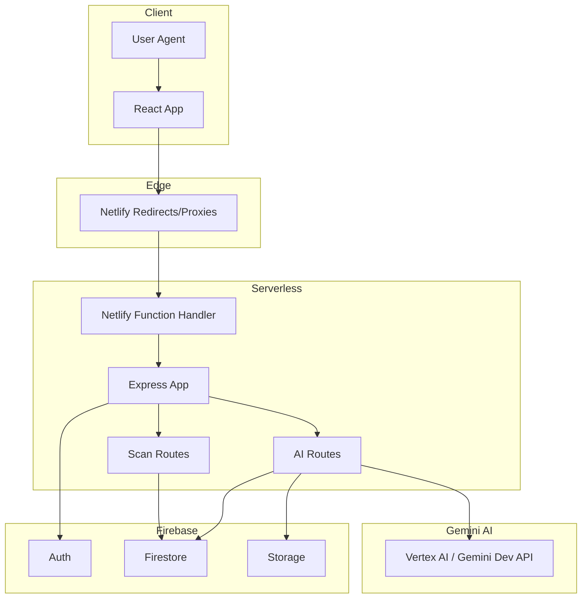

# Architecture Overview

<cite>
**Referenced Files in This Document**
- [package.json](file://package.json)
- [netlify.toml](file://netlify.toml)
- [backend/app.ts](file://backend/app.ts)
- [backend/index.ts](file://backend/index.ts)
- [netlify/functions/api.ts](file://netlify/functions/api.ts)
- [src/main.tsx](file://src/main.tsx)
- [src/App.tsx](file://src/App.tsx)
- [src/firebase.ts](file://src/firebase.ts)
- [src/lib/api.ts](file://src/lib/api.ts)
- [src/components/FaceAnalyzer/hooks/useFaceModel.ts](file://src/components/FaceAnalyzer/hooks/useFaceModel.ts)
- [src/components/FaceAnalyzer/hooks/useAnalysis.ts](file://src/components/FaceAnalyzer/hooks/useAnalysis.ts)
- [src/components/FaceAnalyzer/utils/geometry.ts](file://src/components/FaceAnalyzer/utils/geometry.ts)
- [backend/services/firebase.service.ts](file://backend/services/firebase.service.ts)
- [backend/services/scan.service.ts](file://backend/services/scan.service.ts)
- [backend/routes/scan.routes.ts](file://backend/routes/scan.routes.ts)
- [backend/routes/ai.routes.ts](file://backend/routes/ai.routes.ts)
- [backend/utils/image.ts](file://backend/utils/image.ts)
- [backend/types/mediapipe.ts](file://backend/types/mediapipe.ts)
</cite>

## Table of Contents
1. [Introduction](#introduction)
2. [Project Structure](#project-structure)
3. [Core Components](#core-components)
4. [Architecture Overview](#architecture-overview)
5. [Detailed Component Analysis](#detailed-component-analysis)
6. [Dependency Analysis](#dependency-analysis)
7. [Performance Considerations](#performance-considerations)
8. [Troubleshooting Guide](#troubleshooting-guide)
9. [Conclusion](#conclusion)
10. [Appendices](#appendices)

## Introduction
This document describes the FaceAnalytics Pro system architecture. The platform consists of:
- A React 19 frontend that performs client-side facial landmark detection using MediaPipe and orchestrates image uploads and AI analysis.
- An Express.js backend that validates requests, enforces rate limits and fraud controls, interacts with Firebase, and calls Gemini AI for advanced analysis.
- A serverless deployment on Netlify Functions that exposes REST endpoints via a reverse proxy and static hosting.

Technology stack highlights include React 19, Express.js, Firebase (Firestore, Authentication, Storage), MediaPipe Tasks Vision, and Google Gemini AI (Vertex AI/Gemini Developer API). The system emphasizes secure, scalable, and responsive processing of facial analysis workflows.

## Project Structure
The repository is organized into:
- Frontend (React 19): src/ and public/
- Backend (Express): backend/
- Serverless adapter: netlify/functions/
- Deployment configuration: netlify.toml
- Root package and tooling: package.json

**Diagram sources**
- [src/main.tsx:1-40](file://src/main.tsx#L1-L40)
- [src/lib/api.ts:1-36](file://src/lib/api.ts#L1-L36)
- [netlify/functions/api.ts:1-28](file://netlify/functions/api.ts#L1-L28)
- [backend/app.ts:1-205](file://backend/app.ts#L1-L205)
- [backend/routes/ai.routes.ts:1-800](file://backend/routes/ai.routes.ts#L1-L800)
- [backend/routes/scan.routes.ts:1-63](file://backend/routes/scan.routes.ts#L1-L63)
- [backend/services/firebase.service.ts:1-120](file://backend/services/firebase.service.ts#L1-L120)
- [backend/services/scan.service.ts:1-134](file://backend/services/scan.service.ts#L1-L134)
- [backend/utils/image.ts:1-42](file://backend/utils/image.ts#L1-L42)
- [src/firebase.ts:1-21](file://src/firebase.ts#L1-L21)

**Section sources**
- [package.json:1-79](file://package.json#L1-L79)
- [netlify.toml:1-42](file://netlify.toml#L1-L42)
- [backend/app.ts:1-205](file://backend/app.ts#L1-L205)
- [netlify/functions/api.ts:1-28](file://netlify/functions/api.ts#L1-L28)

## Core Components
- React 19 Frontend
  - Initializes PostHog analytics and renders routed pages.
  - Uses MediaPipe Tasks Vision to detect facial landmarks locally.
  - Sends cropped images to backend endpoints for AI analysis and saves results to Firebase.
- Express Backend
  - Dynamically imports heavy modules on first request to optimize Lambda cold start.
  - Enforces security headers, CORS, rate limiting, bot protection, and fraud checks.
  - Exposes routes for AI analysis and scan history.
- Firebase Integration
  - Provides Auth, Firestore, and Storage; Firestore configured for HTTP/1.1 in serverless.
  - Stores scan results and user data; supports caching and deduplication.
- Serverless Adapter
  - Netlify Functions wraps the Express app and serves static assets in production.
- AI Analysis Pipeline
  - Calls Gemini AI via Vertex AI or Gemini Developer API depending on credentials.
  - Applies image compression, robust parsing, and credit-safe ordering.

**Section sources**
- [src/App.tsx:1-473](file://src/App.tsx#L1-L473)
- [src/main.tsx:1-40](file://src/main.tsx#L1-L40)
- [src/components/FaceAnalyzer/hooks/useFaceModel.ts:1-37](file://src/components/FaceAnalyzer/hooks/useFaceModel.ts#L1-L37)
- [src/components/FaceAnalyzer/hooks/useAnalysis.ts:1-207](file://src/components/FaceAnalyzer/hooks/useAnalysis.ts#L1-L207)
- [backend/app.ts:1-205](file://backend/app.ts#L1-L205)
- [backend/routes/ai.routes.ts:1-800](file://backend/routes/ai.routes.ts#L1-L800)
- [backend/services/firebase.service.ts:1-120](file://backend/services/firebase.service.ts#L1-L120)
- [backend/services/scan.service.ts:1-134](file://backend/services/scan.service.ts#L1-L134)
- [netlify/functions/api.ts:1-28](file://netlify/functions/api.ts#L1-L28)

## Architecture Overview
The system boundary separates:
- Client-side React application (browser)
- Serverless API functions (Netlify)
- External services (Firebase, Gemini AI)

**Diagram sources**
- [src/main.tsx:1-40](file://src/main.tsx#L1-L40)
- [src/lib/api.ts:1-36](file://src/lib/api.ts#L1-L36)
- [netlify/functions/api.ts:1-28](file://netlify/functions/api.ts#L1-L28)
- [backend/app.ts:1-205](file://backend/app.ts#L1-L205)
- [backend/routes/ai.routes.ts:1-800](file://backend/routes/ai.routes.ts#L1-L800)
- [backend/routes/scan.routes.ts:1-63](file://backend/routes/scan.routes.ts#L1-L63)
- [backend/services/firebase.service.ts:1-120](file://backend/services/firebase.service.ts#L1-L120)

## Detailed Component Analysis

### React Frontend: Client-Side Facial Landmarking and Upload Flow
- Model Loading
  - Loads MediaPipe Face Landmarker from CDN and initializes GPU delegate.
- Image Processing
  - Uses client-side geometry utilities to render overlays and prepare cropped images.
- API Interaction
  - Axios interceptor attaches Firebase ID tokens and optional CAPTCHA tokens.
  - Calls backend endpoints for analysis and scan history.
- Analytics
  - PostHog provider configured to send events to a proxied ingest endpoint.

**Diagram sources**
- [src/components/FaceAnalyzer/hooks/useFaceModel.ts:1-37](file://src/components/FaceAnalyzer/hooks/useFaceModel.ts#L1-L37)
- [src/components/FaceAnalyzer/utils/geometry.ts:1-15](file://src/components/FaceAnalyzer/utils/geometry.ts#L1-L15)
- [src/lib/api.ts:1-36](file://src/lib/api.ts#L1-L36)
- [netlify/functions/api.ts:1-28](file://netlify/functions/api.ts#L1-L28)
- [backend/app.ts:1-205](file://backend/app.ts#L1-L205)
- [backend/routes/ai.routes.ts:1-800](file://backend/routes/ai.routes.ts#L1-L800)
- [backend/services/firebase.service.ts:1-120](file://backend/services/firebase.service.ts#L1-L120)

**Section sources**
- [src/main.tsx:1-40](file://src/main.tsx#L1-L40)
- [src/App.tsx:1-473](file://src/App.tsx#L1-L473)
- [src/components/FaceAnalyzer/hooks/useFaceModel.ts:1-37](file://src/components/FaceAnalyzer/hooks/useFaceModel.ts#L1-L37)
- [src/components/FaceAnalyzer/hooks/useAnalysis.ts:1-207](file://src/components/FaceAnalyzer/hooks/useAnalysis.ts#L1-L207)
- [src/lib/api.ts:1-36](file://src/lib/api.ts#L1-L36)

### Express Backend: Security, Routing, and AI Orchestration
- Dynamic Imports
  - Heavy modules (helmet, crypto, http-proxy-middleware, route handlers) are dynamically imported to reduce Lambda initialization overhead.
- Security and Middleware
  - Helmet CSP, COOP/COEP adjustments, CORS allowlist, bot blocking, and request logging.
- Routes
  - AI analysis and celebrity/hair analysis endpoints with rate limits, daily caps, and fraud checks.
  - Scan history and save endpoints backed by Firestore.
- AI Integration
  - Calls Vertex AI or Gemini Developer API based on credential type.
  - Applies retry logic, timeouts, and robust JSON parsing.
- Image Compression
  - Sharp-based compression to reduce payload sizes for AI calls.

**Diagram sources**
- [backend/app.ts:1-205](file://backend/app.ts#L1-L205)
- [backend/routes/ai.routes.ts:1-800](file://backend/routes/ai.routes.ts#L1-L800)
- [backend/routes/scan.routes.ts:1-63](file://backend/routes/scan.routes.ts#L1-L63)
- [backend/utils/image.ts:1-42](file://backend/utils/image.ts#L1-L42)
- [backend/services/scan.service.ts:1-134](file://backend/services/scan.service.ts#L1-L134)
- [backend/services/firebase.service.ts:1-120](file://backend/services/firebase.service.ts#L1-L120)

**Section sources**
- [backend/app.ts:1-205](file://backend/app.ts#L1-L205)
- [backend/routes/ai.routes.ts:1-800](file://backend/routes/ai.routes.ts#L1-L800)
- [backend/routes/scan.routes.ts:1-63](file://backend/routes/scan.routes.ts#L1-L63)
- [backend/utils/image.ts:1-42](file://backend/utils/image.ts#L1-L42)
- [backend/services/scan.service.ts:1-134](file://backend/services/scan.service.ts#L1-L134)
- [backend/services/firebase.service.ts:1-120](file://backend/services/firebase.service.ts#L1-L120)

### Serverless Adapter: Netlify Functions and Static Hosting
- Function Entrypoint
  - Defer heavy imports until first invocation to stay within Lambda budget.
  - Wraps Express app with serverless-http.
- Redirects and Proxies
  - Redirects /api/* to Netlify Functions.
  - Reverse proxy for PostHog ingest to avoid CORS issues.
- Build and Runtime
  - Vite builds static assets; Netlify publishes dist and compiles functions.

**Diagram sources**
- [netlify/functions/api.ts:1-28](file://netlify/functions/api.ts#L1-L28)
- [netlify.toml:1-42](file://netlify.toml#L1-L42)
- [backend/app.ts:1-205](file://backend/app.ts#L1-L205)

**Section sources**
- [netlify/functions/api.ts:1-28](file://netlify/functions/api.ts#L1-L28)
- [netlify.toml:1-42](file://netlify.toml#L1-L42)
- [backend/index.ts:1-29](file://backend/index.ts#L1-L29)

### Firebase Services: Auth, DB, Storage, and HTTP/1.1 Settings
- Admin SDK Initialization
  - Supports environment-variable-based service account and local fallback.
- Firestore Settings
  - Switches to HTTP/1.1 (REST) to avoid gRPC handshake latency in cold Lambda containers.
- Scan Storage
  - Stores analysis results with deduplication via image hashing and caching.

**Diagram sources**
- [backend/services/firebase.service.ts:1-120](file://backend/services/firebase.service.ts#L1-L120)
- [backend/services/scan.service.ts:1-134](file://backend/services/scan.service.ts#L1-L134)

**Section sources**
- [src/firebase.ts:1-21](file://src/firebase.ts#L1-L21)
- [backend/services/firebase.service.ts:1-120](file://backend/services/firebase.service.ts#L1-L120)
- [backend/services/scan.service.ts:1-134](file://backend/services/scan.service.ts#L1-L134)

## Dependency Analysis
- Frontend Dependencies
  - React 19, @mediapipe/tasks-vision, axios, @posthog/react, lucide-react, motion, react-router-dom, resend, sharp, tailwind-merge, zod.
- Backend Dependencies
  - express, helmet, http-proxy-middleware, serverless-http, sharp, pino, @upstash/ratelimit, @google/generative-ai, firebase-admin.
- Netlify Runtime
  - external_node_modules includes sharp, firebase-admin, pino, esbuild, lightningcss for optimized builds.

**Diagram sources**
- [package.json:1-79](file://package.json#L1-L79)

**Section sources**
- [package.json:1-79](file://package.json#L1-L79)
- [netlify.toml:6-16](file://netlify.toml#L6-L16)

## Performance Considerations
- Cold Starts
  - Dynamic imports in Express app and Netlify function handler minimize initialization time.
- AI Latency
  - Gemini 2.5 Flash vision analysis can take 20–40s; backend sets a 24s timeout for Netlify and 60s for local dev.
- Image Compression
  - Sharp reduces payload size to improve throughput and cost efficiency.
- Firestore Transport
  - HTTP/1.1 REST preferred over gRPC in serverless to avoid handshake delays.
- Client Timeout
  - Frontend waits up to 70s for AI responses to accommodate backend AbortController timing.

[No sources needed since this section provides general guidance]

## Troubleshooting Guide
- 403 Insufficient Credits
  - Backend soft-checks credits before AI call; if credits are insufficient, returns 403. Frontend should prompt credit purchase or notify user.
- 429 Too Many Requests
  - Shared rate limiters and daily caps enforce usage quotas; reduce frequency or upgrade plan.
- 502 Gemini Parsing Failure
  - Backend returns 502 with parse preview; verify prompt correctness and model response format.
- 502/504 Server Errors
  - Check Netlify logs for cold start failures or backend exceptions; confirm environment variables and Firebase credentials.
- CORS and CSP
  - Ensure APP_URL allowlist matches frontend origin; review CSP directives for external resources.

**Section sources**
- [backend/routes/ai.routes.ts:270-516](file://backend/routes/ai.routes.ts#L270-L516)
- [backend/app.ts:145-164](file://backend/app.ts#L145-L164)
- [backend/app.ts:90-140](file://backend/app.ts#L90-L140)

## Conclusion
FaceAnalytics Pro integrates a modern React 19 frontend with MediaPipe for client-side landmarking, a security-hardened Express backend, and serverless deployment on Netlify Functions. Firebase provides identity, storage, and data persistence, while Gemini AI delivers advanced facial analysis. The architecture balances performance, scalability, and security through careful transport choices, rate limiting, and robust error handling.

[No sources needed since this section summarizes without analyzing specific files]

## Appendices

### System Context Diagram: Client, Serverless API, and Firebase

**Diagram sources**
- [netlify.toml:27-42](file://netlify.toml#L27-L42)
- [netlify/functions/api.ts:1-28](file://netlify/functions/api.ts#L1-L28)
- [backend/app.ts:1-205](file://backend/app.ts#L1-L205)
- [backend/routes/ai.routes.ts:1-800](file://backend/routes/ai.routes.ts#L1-L800)
- [backend/routes/scan.routes.ts:1-63](file://backend/routes/scan.routes.ts#L1-L63)
- [src/firebase.ts:1-21](file://src/firebase.ts#L1-L21)

### Cross-Cutting Concerns
- Security
  - Helmet CSP, COOP/COEP, CORS allowlist, bot protection, and fraud checks.
- Authentication
  - Firebase Auth with ID token injection via Axios interceptor.
- Observability
  - PostHog ingestion via reverse proxy; request logging with unique IDs.
- Scalability
  - HTTP/1.1 Firestore, dynamic imports, and function-level timeouts.

**Section sources**
- [backend/app.ts:90-164](file://backend/app.ts#L90-L164)
- [src/lib/api.ts:9-33](file://src/lib/api.ts#L9-L33)
- [netlify.toml:32-36](file://netlify.toml#L32-L36)
- [backend/services/firebase.service.ts:97-108](file://backend/services/firebase.service.ts#L97-L108)