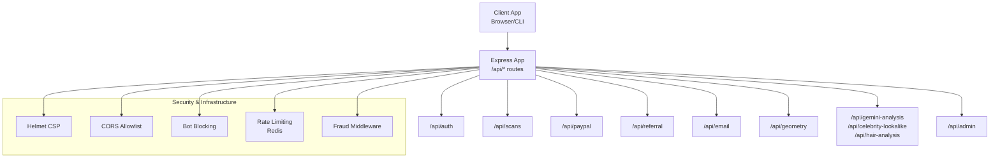
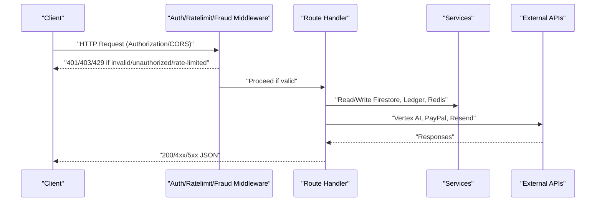
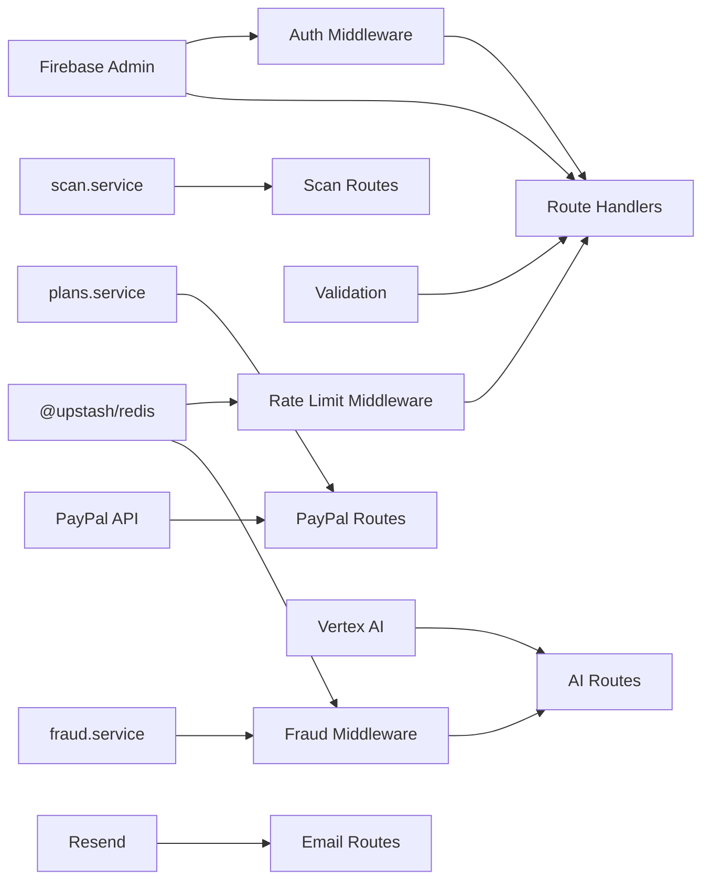

# API Routes

<cite>
**Referenced Files in This Document**
- [auth.routes.ts](file://backend/routes/auth.routes.ts)
- [scan.routes.ts](file://backend/routes/scan.routes.ts)
- [paypal.routes.ts](file://backend/routes/paypal.routes.ts)
- [email.routes.ts](file://backend/routes/email.routes.ts)
- [referral.routes.ts](file://backend/routes/referral.routes.ts)
- [ai.routes.ts](file://backend/routes/ai.routes.ts)
- [geometry.routes.ts](file://backend/routes/geometry.routes.ts)
- [admin.routes.ts](file://backend/routes/admin.routes.ts)
- [auth.middleware.ts](file://backend/middleware/auth.middleware.ts)
- [ratelimit.middleware.ts](file://backend/middleware/ratelimit.middleware.ts)
- [fraud.middleware.ts](file://backend/middleware/fraud.middleware.ts)
- [validation.ts](file://backend/utils/validation.ts)
- [scan.service.ts](file://backend/services/scan.service.ts)
- [plans.service.ts](file://backend/services/plans.service.ts)
- [app.ts](file://backend/app.ts)
- [api.ts](file://netlify/functions/api.ts)
- [config.ts](file://backend/utils/config.ts)
- [fraud.service.ts](file://backend/services/fraud.service.ts)
</cite>

## Table of Contents
1. [Introduction](#introduction)
2. [Project Structure](#project-structure)
3. [Core Components](#core-components)
4. [Architecture Overview](#architecture-overview)
5. [Detailed Component Analysis](#detailed-component-analysis)
6. [Dependency Analysis](#dependency-analysis)
7. [Performance Considerations](#performance-considerations)
8. [Troubleshooting Guide](#troubleshooting-guide)
9. [Conclusion](#conclusion)
10. [Appendices](#appendices)

## Introduction
This document provides comprehensive API route documentation for FaceAnalytics Pro. It covers authentication, scan management, payment processing, referral and email services, geometry analysis, AI-powered analysis, and administrative operations. For each endpoint, you will find:
- Purpose and feature domain
- Authentication and authorization requirements
- Request/response schemas and validation rules
- Rate limiting and daily caps
- Error handling patterns and response formatting
- Security considerations (CORS, CSRF, rate limiting, fraud detection)
- Example curl commands and integration patterns
- Testing strategies, mock implementations, and versioning approaches
- Webhook endpoints for PayPal integration and real-time notifications

## Project Structure
The backend is organized around modular Express route handlers mounted under /api. Each feature domain has its own route module. The application initializes lazily to meet serverless cold start budgets and applies security headers, CORS, and bot blocking at the gateway level.

**Diagram sources**
- [app.ts:15-201](file://backend/app.ts#L15-L201)

**Section sources**
- [app.ts:15-201](file://backend/app.ts#L15-L201)

## Core Components
- Authentication middleware verifies Firebase ID tokens and attaches user info to requests.
- Rate limiting middleware enforces sliding-window limits per user/IP with Redis and falls back gracefully in development.
- Fraud middleware integrates device fingerprinting, risk profiles, and Cloudflare Turnstile verification for high-risk operations.
- Validation middleware uses Zod schemas to standardize request bodies and return structured 400 errors.
- Services encapsulate Firestore and third-party integrations (PayPal, Vertex AI, Resend).

**Section sources**
- [auth.middleware.ts:18-39](file://backend/middleware/auth.middleware.ts#L18-L39)
- [ratelimit.middleware.ts:25-92](file://backend/middleware/ratelimit.middleware.ts#L25-L92)
- [fraud.middleware.ts:30-104](file://backend/middleware/fraud.middleware.ts#L30-L104)
- [validation.ts:89-102](file://backend/utils/validation.ts#L89-L102)

## Architecture Overview
The API follows a layered architecture:
- Route handlers define endpoints and compose middleware.
- Middleware enforces auth, rate limits, and fraud checks.
- Services abstract persistence and external APIs.
- Validation ensures consistent request shapes.
- Global error handling standardizes responses.

**Diagram sources**
- [auth.middleware.ts:18-39](file://backend/middleware/auth.middleware.ts#L18-L39)
- [ratelimit.middleware.ts:38-91](file://backend/middleware/ratelimit.middleware.ts#L38-L91)
- [fraud.middleware.ts:30-104](file://backend/middleware/fraud.middleware.ts#L30-L104)
- [ai.routes.ts:271-516](file://backend/routes/ai.routes.ts#L271-L516)
- [paypal.routes.ts:25-159](file://backend/routes/paypal.routes.ts#L25-L159)
- [email.routes.ts:18-60](file://backend/routes/email.routes.ts#L18-L60)
- [scan.routes.ts:22-60](file://backend/routes/scan.routes.ts#L22-L60)

## Detailed Component Analysis

### Authentication Routes
- Purpose: Initialize user records and manage secure onboarding.
- Endpoints:
  - POST /api/auth/init-user
    - Authentication: Bearer token required (Firebase ID token).
    - Rate limit: Shared limiter (e.g., 5 per 15 minutes).
    - Behavior: Ensures a Firestore user document exists; caches existence per process to reduce quota usage.
    - Responses: 200/201 on success, 400/500 on error.
    - Errors: Unauthorized, database not initialized, failed to initialize.
    - Notes: In production/dev degraded mode, behavior differs; dev skips Firestore initialization if unavailable.

- Example curl:
  - curl -X POST https://your-domain/api/auth/init-user -H "Authorization: Bearer YOUR_ID_TOKEN"

- Security considerations:
  - Requires Firebase ID token verification.
  - Rate limiting protects brute-force attempts.
  - Dev mode degrades gracefully to avoid blocking local development.

**Section sources**
- [auth.routes.ts:23-88](file://backend/routes/auth.routes.ts#L23-L88)
- [auth.middleware.ts:18-39](file://backend/middleware/auth.middleware.ts#L18-L39)
- [ratelimit.middleware.ts:25-92](file://backend/middleware/ratelimit.middleware.ts#L25-L92)

### Scan Management Routes
- Purpose: Save analysis results and fetch paginated scan history.
- Endpoints:
  - POST /api/scans/save
    - Authentication: Bearer token required.
    - Rate limit: Shared limiter (e.g., 20 per 10 minutes).
    - Validation: scanSaveSchema (overallScore, analysisData, optional imageUrl).
    - Behavior: Stores scan in Firestore with metadata and returns document ID.
    - Responses: 201 with { id }, 400/500 on error.
  - GET /api/scans/history
    - Authentication: Bearer token required.
    - Rate limit: Shared limiter (e.g., 30 per minute).
    - Query params: limit (default 20, max 50), cursor (ISO date string).
    - Behavior: Paginates scans for the authenticated user.
    - Responses: 200 with { scans, hasMore }, 500 on error.

- Example curl:
  - curl -X POST https://your-domain/api/scans/save -H "Authorization: Bearer YOUR_ID_TOKEN" -H "Content-Type: application/json" -d '{"overallScore":8.5,"analysisData":"...","imageUrl":"..."}'
  - curl -X GET "https://your-domain/api/scans/history?limit=20&cursor=2024-01-01T00:00:00Z" -H "Authorization: Bearer YOUR_ID_TOKEN"

- Data storage:
  - Firestore collection: scans
  - Fields include userId, userEmail, createdAt, overallScore, imageUrl, analysisData, scanType.

**Section sources**
- [scan.routes.ts:22-60](file://backend/routes/scan.routes.ts#L22-L60)
- [validation.ts:77-81](file://backend/utils/validation.ts#L77-L81)
- [scan.service.ts:99-133](file://backend/services/scan.service.ts#L99-L133)

### Payment Processing Routes (PayPal)
- Purpose: Create and capture PayPal orders, and handle PayPal webhooks for real-time notifications.
- Endpoints:
  - POST /api/paypal/create-order
    - Authentication: Bearer token required.
    - Rate limit: Shared limiter (e.g., 10 per 10 minutes).
    - Validation: paypalCreateOrderSchema (planId).
    - Behavior: Calls PayPal v2/checkout/orders with intent CAPTURE; forwards response.
    - Responses: 200 JSON from PayPal, 400/500 on error.
  - POST /api/paypal/capture-order
    - Authentication: Bearer token required.
    - Validation: paypalCaptureOrderSchema (orderID, optional planId).
    - Behavior: Calls PayPal /orders/{id}/capture; on completion, credits user and records order.
    - Responses: 200 JSON from PayPal, 400/500 on error.
  - POST /api/paypal/webhook
    - Authentication: Public endpoint; signature verified and replay protection enforced.
    - Behavior: Verifies webhook signature, rejects duplicates, processes APPROVED/COMPLETED events, credits users, sends receipts.
    - Responses: 200 OK or 403/500 depending on verification and processing.

- Plans:
  - Centralized plan configuration defines credit amounts and prices used across endpoints.

- Example curl:
  - curl -X POST https://your-domain/api/paypal/create-order -H "Authorization: Bearer YOUR_ID_TOKEN" -H "Content-Type: application/json" -d '{"planId":"price_pro"}'
  - curl -X POST https://your-domain/api/paypal/capture-order -H "Authorization: Bearer YOUR_ID_TOKEN" -H "Content-Type: application/json" -d '{"orderID":"ORDER_ID"}'

- Security considerations:
  - Signature verification via PayPal verify-webhook-signature endpoint.
  - Replay attack protection using Redis keyed by event ID.
  - Strict webhook ID configuration in production.

**Section sources**
- [paypal.routes.ts:25-159](file://backend/routes/paypal.routes.ts#L25-L159)
- [paypal.routes.ts:162-299](file://backend/routes/paypal.routes.ts#L162-L299)
- [validation.ts:57-64](file://backend/utils/validation.ts#L57-L64)
- [plans.service.ts:13-33](file://backend/services/plans.service.ts#L13-L33)

### Referral Routes
- Purpose: Apply referral codes and expose a leaderboard.
- Endpoints:
  - POST /api/referral/redeem
    - Authentication: Bearer token required.
    - Rate limit: Shared limiter (e.g., 5 per 15 minutes).
    - Validation: referralRedeemSchema (referralCode, optional fingerprint).
    - Behavior: Fraud checks for multi-account abuse and referral loops; increments credits and invitedCount; records ledger entries.
    - Responses: 200 success, 400/403/404 on error.
  - GET /api/referral/leaderboard
    - Authentication: Optional; if Bearer token provided, marks current user in results.
    - Behavior: Returns top 5 inviters; caches in Redis with 60s TTL.
    - Responses: 200 with leaderboard, 500 on error.

- Example curl:
  - curl -X POST https://your-domain/api/referral/redeem -H "Authorization: Bearer YOUR_ID_TOKEN" -H "Content-Type: application/json" -d '{"referralCode":"ABC123","fingerprint":"fp123"}'

- Security considerations:
  - Multi-account abuse detection and referral loop prevention.
  - Device fingerprinting and IP tracking.
  - Tiered bonus credit rewards for inviter.

**Section sources**
- [referral.routes.ts:24-144](file://backend/routes/referral.routes.ts#L24-L144)
- [referral.routes.ts:147-231](file://backend/routes/referral.routes.ts#L147-L231)
- [validation.ts:66-69](file://backend/utils/validation.ts#L66-L69)
- [fraud.service.ts:209-309](file://backend/services/fraud.service.ts#L209-L309)

### Email Routes
- Purpose: Send welcome emails and track IP for user onboarding.
- Endpoints:
  - POST /api/email/welcome
    - Authentication: Bearer token required.
    - Rate limit: Shared limiter (e.g., 3 per 10 minutes).
    - Validation: emailWelcomeSchema (email, name, optional userId).
    - Behavior: Updates user last IP if available; sends HTML welcome email via Resend.
    - Responses: 200 success, 500 on error.

- Example curl:
  - curl -X POST https://your-domain/api/email/welcome -H "Authorization: Bearer YOUR_ID_TOKEN" -H "Content-Type: application/json" -d '{"email":"user@example.com","name":"Alex","userId":"UID"}'

**Section sources**
- [email.routes.ts:18-60](file://backend/routes/email.routes.ts#L18-L60)
- [validation.ts:71-75](file://backend/utils/validation.ts#L71-L75)

### Geometry Analysis Routes
- Purpose: Compute facial geometry metrics from Mediapipe landmarks.
- Endpoints:
  - POST /api/geometry/analyze
    - Authentication: Not required.
    - Rate limit: Shared limiter (e.g., 15 per 10 minutes).
    - Validation: geometryAnalyzeSchema (landmarks array with 468–478 points).
    - Behavior: Performs EAR checks, alignment, symmetry, and metric computation; returns structured results.
    - Responses: 200 JSON with scores and breakdown, 400/500 on error.

- Example curl:
  - curl -X POST https://your-domain/api/geometry/analyze -H "Content-Type: application/json" -d '{"landmarks":[{...},{...}]}' 

**Section sources**
- [geometry.routes.ts:19-74](file://backend/routes/geometry.routes.ts#L19-L74)
- [validation.ts:53-55](file://backend/utils/validation.ts#L53-L55)

### AI Analysis Routes
- Purpose: Perform secure, credit-safe AI analysis and celebrity lookalike detection.
- Endpoints:
  - POST /api/gemini-analysis
    - Authentication: Bearer token required.
    - Rate limit: Shared limiter (e.g., 5 per 10 minutes).
    - Daily cap: 50 per user per day.
    - Fraud middleware: strict mode enabled.
    - Validation: geminiAnalysisSchema (image base64).
    - Behavior: Image compression, cache lookup, Vertex AI call, robust parsing, store result, deduct credit (best-effort).
    - Responses: 200 JSON result, 400/403/429/500 on error.
  - POST /api/celebrity-lookalike
    - Authentication: Bearer token required.
    - Rate limit: Shared limiter (e.g., 3 per 10 minutes).
    - Daily cap: 30 per user per day.
    - Fraud middleware: strict mode enabled.
    - Validation: celebrityLookalikeSchema (image string).
    - Behavior: Supports direct base64 or Firebase Storage URL; calls Vertex AI; enriches with celebrity photos; stores result; deducts credit.
    - Responses: 200 JSON with matches, 400/403/429/500 on error.
  - POST /api/hair-analysis
    - Authentication: Bearer token required.
    - Rate limit: Shared limiter (e.g., 3 per 10 minutes).
    - Daily cap: 30 per user per day.
    - Fraud middleware: strict mode enabled.
    - Validation: hairAnalysisSchema (image string).
    - Behavior: Similar flow to celebrity lookalike; returns hair recommendations.
    - Responses: 200 JSON result, 400/403/429/500 on error.

- Example curl:
  - curl -X POST https://your-domain/api/gemini-analysis -H "Authorization: Bearer YOUR_ID_TOKEN" -H "Content-Type: application/json" -d '{"image":"data:image/jpeg;base64,..."}'

- Security considerations:
  - Credit-safe ordering: AI call first, then credit deduction.
  - Cache deduplication by image hash.
  - Timeout handling and retry logic for Vertex AI.
  - SSRF protection for image URLs.
  - Preemptive risk block for high-risk users.

**Section sources**
- [ai.routes.ts:271-516](file://backend/routes/ai.routes.ts#L271-L516)
- [ai.routes.ts:518-754](file://backend/routes/ai.routes.ts#L518-L754)
- [ai.routes.ts:756-800](file://backend/routes/ai.routes.ts#L756-L800)
- [validation.ts:13-23](file://backend/utils/validation.ts#L13-L23)
- [scan.service.ts:23-62](file://backend/services/scan.service.ts#L23-L62)
- [fraud.middleware.ts:30-104](file://backend/middleware/fraud.middleware.ts#L30-L104)

### Administrative Routes
- Purpose: System analytics and maintenance operations.
- Endpoints:
  - GET /api/admin/analytics
    - Authentication: Bearer token required; admin-only.
    - Admin verification: Email whitelist + Firestore role check with in-memory cache.
    - Behavior: Aggregates user counts, scans, orders, credits, and referral leaders.
    - Responses: 200 JSON metrics, 403/500 on error.
  - POST /api/admin/purge-logs
    - Authentication: Bearer token required; admin-only.
    - Behavior: Purges activity_log older than retentionDays (default 30, min 1, max 365).
    - Responses: 200 with { deleted, retentionDays }, 500 on error.

- Example curl:
  - curl -X GET https://your-domain/api/admin/analytics -H "Authorization: Bearer ADMIN_ID_TOKEN"
  - curl -X POST https://your-domain/api/admin/purge-logs -H "Authorization: Bearer ADMIN_ID_TOKEN" -H "Content-Type: application/json" -d '{"retentionDays":30}'

**Section sources**
- [admin.routes.ts:44-119](file://backend/routes/admin.routes.ts#L44-L119)
- [admin.routes.ts:121-131](file://backend/routes/admin.routes.ts#L121-L131)

## Dependency Analysis
- Route composition:
  - All authenticated endpoints depend on requireAuth.
  - AI endpoints additionally depend on fraud middleware and daily caps.
  - PayPal endpoints depend on validation and plan configuration.
  - Admin endpoints depend on requireAdmin middleware.
- External dependencies:
  - Firebase Admin (Auth, Firestore).
  - Upstash Redis (rate limiting, caching).
  - Vertex AI (Google Generative Language).
  - PayPal (Checkout Orders API, Webhook verification).
  - Resend (transactional emails).
- Internal services:
  - scan.service: caching, history, and storage.
  - fraud.service: risk profiles, abuse detection, activity logging.
  - plans.service: centralized plan definitions.

**Diagram sources**
- [auth.middleware.ts:18-39](file://backend/middleware/auth.middleware.ts#L18-L39)
- [ratelimit.middleware.ts:38-91](file://backend/middleware/ratelimit.middleware.ts#L38-L91)
- [fraud.middleware.ts:30-104](file://backend/middleware/fraud.middleware.ts#L30-L104)
- [ai.routes.ts:271-516](file://backend/routes/ai.routes.ts#L271-L516)
- [paypal.routes.ts:25-159](file://backend/routes/paypal.routes.ts#L25-L159)
- [email.routes.ts:18-60](file://backend/routes/email.routes.ts#L18-L60)
- [scan.routes.ts:22-60](file://backend/routes/scan.routes.ts#L22-L60)
- [scan.service.ts:99-133](file://backend/services/scan.service.ts#L99-L133)
- [fraud.service.ts:127-204](file://backend/services/fraud.service.ts#L127-L204)
- [plans.service.ts:13-33](file://backend/services/plans.service.ts#L13-L33)

**Section sources**
- [app.ts:15-201](file://backend/app.ts#L15-L201)

## Performance Considerations
- Lazy initialization: Backend modules are dynamically imported on first request to minimize cold start latency in serverless environments.
- Image optimization: Base64 images are compressed before being sent to Vertex AI to reduce latency and cost.
- Caching: Image hash-based caching avoids repeated AI calls; scan history and leaderboard are cached in Redis.
- Timeouts: Vertex AI requests are bounded by AbortController timeouts to prevent platform kills.
- Batched logging: Activity logs are buffered and flushed periodically to reduce Firestore write volume.

[No sources needed since this section provides general guidance]

## Troubleshooting Guide
- Authentication failures:
  - Ensure Authorization header contains a valid Firebase ID token.
  - Check token expiration and audience.
- Rate limiting:
  - Inspect X-RateLimit-* headers; adjust client backoff.
  - In development, rate limiting is disabled to facilitate testing.
- Fraud-related blocks:
  - If flagged, CAPTCHA verification may be required; provide x-captcha-token.
  - High-risk users may be preemptively blocked from expensive operations.
- PayPal webhooks:
  - Verify webhook ID is configured in production.
  - Duplicate events are rejected using Redis event IDs.
- Vertex AI errors:
  - Inspect retryAfterMs hints and exponential backoff behavior.
  - In development, detailed error payloads are returned for debugging.

**Section sources**
- [auth.middleware.ts:18-39](file://backend/middleware/auth.middleware.ts#L18-L39)
- [ratelimit.middleware.ts:38-91](file://backend/middleware/ratelimit.middleware.ts#L38-L91)
- [fraud.middleware.ts:30-104](file://backend/middleware/fraud.middleware.ts#L30-L104)
- [paypal.routes.ts:162-299](file://backend/routes/paypal.routes.ts#L162-L299)
- [ai.routes.ts:127-157](file://backend/routes/ai.routes.ts#L127-L157)

## Conclusion
FaceAnalytics Pro’s API is structured around clear feature domains with robust security, rate limiting, fraud detection, and caching. The endpoints provide consistent request/response patterns, standardized error handling, and comprehensive validation. Integrators should adhere to authentication, rate limits, and fraud safeguards, leverage caching and batched operations, and use the provided webhook and admin endpoints for operational needs.

[No sources needed since this section summarizes without analyzing specific files]

## Appendices

### Endpoint Reference and Examples

- Authentication
  - POST /api/auth/init-user
  - curl -X POST https://your-domain/api/auth/init-user -H "Authorization: Bearer YOUR_ID_TOKEN"

- Scan Management
  - POST /api/scans/save
  - curl -X POST https://your-domain/api/scans/save -H "Authorization: Bearer YOUR_ID_TOKEN" -H "Content-Type: application/json" -d '{"overallScore":8.5,"analysisData":"...","imageUrl":"..."}'
  - GET /api/scans/history?limit=20&cursor=2024-01-01T00:00:00Z
  - curl -X GET "https://your-domain/api/scans/history?limit=20&cursor=2024-01-01T00:00:00Z" -H "Authorization: Bearer YOUR_ID_TOKEN"

- Payment (PayPal)
  - POST /api/paypal/create-order
  - curl -X POST https://your-domain/api/paypal/create-order -H "Authorization: Bearer YOUR_ID_TOKEN" -H "Content-Type: application/json" -d '{"planId":"price_pro"}'
  - POST /api/paypal/capture-order
  - curl -X POST https://your-domain/api/paypal/capture-order -H "Authorization: Bearer YOUR_ID_TOKEN" -H "Content-Type: application/json" -d '{"orderID":"ORDER_ID"}'
  - POST /api/paypal/webhook
  - curl -X POST https://your-domain/api/paypal/webhook -H "Content-Type: application/json" -d '{}'

- Referral
  - POST /api/referral/redeem
  - curl -X POST https://your-domain/api/referral/redeem -H "Authorization: Bearer YOUR_ID_TOKEN" -H "Content-Type: application/json" -d '{"referralCode":"ABC123","fingerprint":"fp123"}'
  - GET /api/referral/leaderboard
  - curl -X GET https://your-domain/api/referral/leaderboard -H "Authorization: Bearer YOUR_ID_TOKEN"

- Email
  - POST /api/email/welcome
  - curl -X POST https://your-domain/api/email/welcome -H "Authorization: Bearer YOUR_ID_TOKEN" -H "Content-Type: application/json" -d '{"email":"user@example.com","name":"Alex","userId":"UID"}'

- Geometry
  - POST /api/geometry/analyze
  - curl -X POST https://your-domain/api/geometry/analyze -H "Content-Type: application/json" -d '{"landmarks":[{...},{...}]}'

- AI Analysis
  - POST /api/gemini-analysis
  - curl -X POST https://your-domain/api/gemini-analysis -H "Authorization: Bearer YOUR_ID_TOKEN" -H "Content-Type: application/json" -d '{"image":"data:image/jpeg;base64,..."}'
  - POST /api/celebrity-lookalike
  - curl -X POST https://your-domain/api/celebrity-lookalike -H "Authorization: Bearer YOUR_ID_TOKEN" -H "Content-Type: application/json" -d '{"image":"data:image/jpeg;base64,..."}'
  - POST /api/hair-analysis
  - curl -X POST https://your-domain/api/hair-analysis -H "Authorization: Bearer YOUR_ID_TOKEN" -H "Content-Type: application/json" -d '{"image":"data:image/jpeg;base64,..."}'

- Admin
  - GET /api/admin/analytics
  - curl -X GET https://your-domain/api/admin/analytics -H "Authorization: Bearer ADMIN_ID_TOKEN"
  - POST /api/admin/purge-logs
  - curl -X POST https://your-domain/api/admin/purge-logs -H "Authorization: Bearer ADMIN_ID_TOKEN" -H "Content-Type: application/json" -d '{"retentionDays":30}'

### Rate Limits and Daily Caps
- Auth: 5 per 15 minutes
- Scan save: 20 per 10 minutes
- Scan history: 30 per minute
- PayPal create-order: 10 per 10 minutes
- Email welcome: 3 per 10 minutes
- Referral redeem: 5 per 15 minutes
- Geometry analyze: 15 per 10 minutes
- AI analysis: 5 per 10 minutes (daily cap 50)
- Celebrity lookalike: 3 per 10 minutes (daily cap 30)
- Hair analysis: 3 per 10 minutes (daily cap 30)

**Section sources**
- [auth.routes.ts:10-15](file://backend/routes/auth.routes.ts#L10-L15)
- [scan.routes.ts:11-20](file://backend/routes/scan.routes.ts#L11-L20)
- [paypal.routes.ts:19-23](file://backend/routes/paypal.routes.ts#L19-L23)
- [email.routes.ts:10-15](file://backend/routes/email.routes.ts#L10-L15)
- [referral.routes.ts:16-21](file://backend/routes/referral.routes.ts#L16-L21)
- [geometry.routes.ts:13-17](file://backend/routes/geometry.routes.ts#L13-L17)
- [ai.routes.ts:51-70](file://backend/routes/ai.routes.ts#L51-L70)

### Security and CORS
- Security headers: Helmet with CSP, COOP override for popup compatibility.
- CORS: Origin validated against APP_URL allowlist; supports multiple origins.
- Bot protection: Known scrapers and empty user agents blocked on API routes.
- Admin access: Email-based allowlist plus Firestore role check with caching.

**Section sources**
- [app.ts:90-164](file://backend/app.ts#L90-L164)
- [admin.routes.ts:9-42](file://backend/routes/admin.routes.ts#L9-L42)

### Testing Strategies and Mocks
- Unit tests: Use Zod validation schemas to assert request shapes; mock Firebase Admin and Redis to isolate route logic.
- Integration tests: Spin up a lightweight serverless mock; stub Vertex AI responses; simulate PayPal webhook signatures.
- Load tests: Respect rate limits and daily caps; stagger requests; monitor X-RateLimit-* headers.
- Mock implementations:
  - Replace Redis with an in-memory store for tests.
  - Stub Firestore transactions and collections.
  - Mock external APIs (Vertex AI, PayPal) with deterministic responses.

[No sources needed since this section provides general guidance]

### Versioning Approaches
- Semantic versioning: Increment major for breaking changes, minor for features, patch for fixes.
- Backward compatibility: Maintain stable response schemas; deprecate fields with clear notices.
- Serverless: Use environment flags to toggle experimental features without changing endpoints.

[No sources needed since this section provides general guidance]