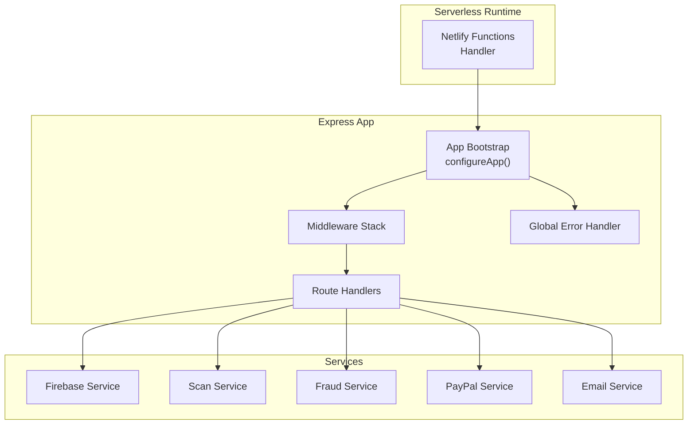
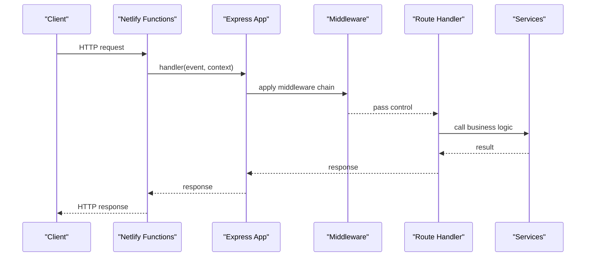
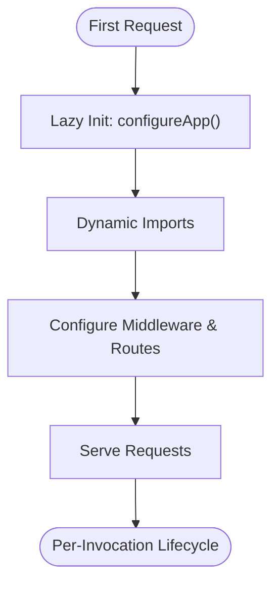
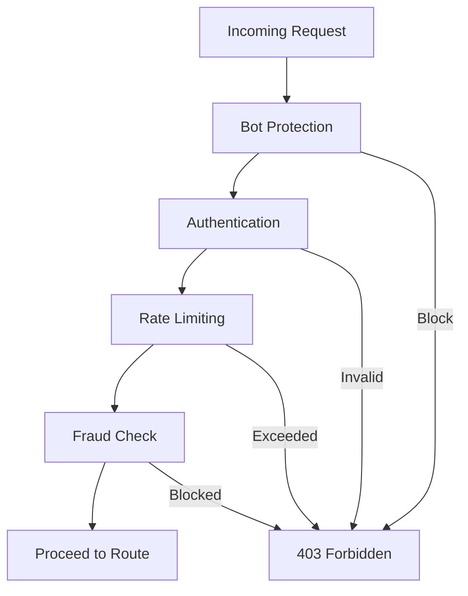
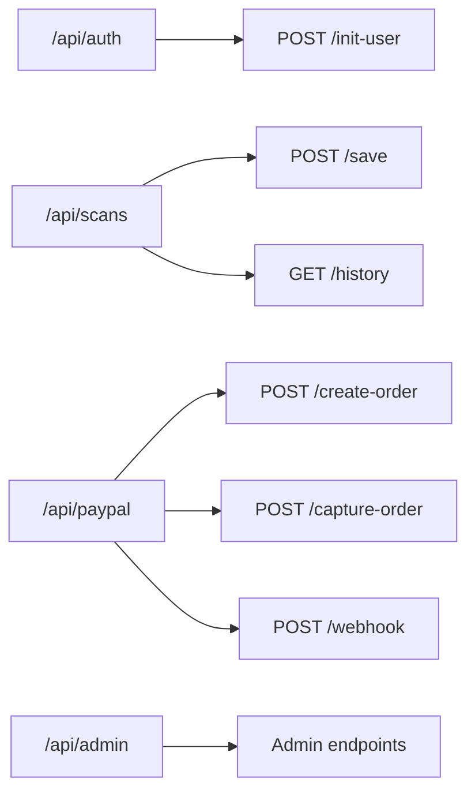
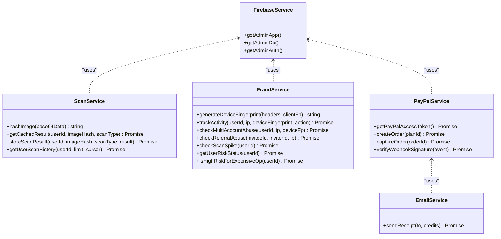
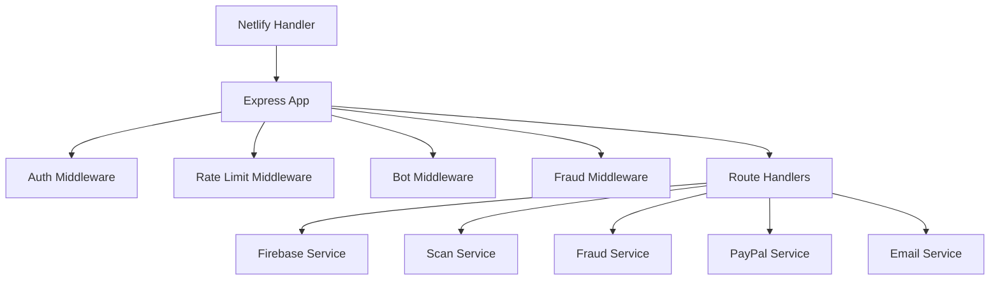

# Backend Architecture

<cite>
**Referenced Files in This Document**
- [backend/app.ts](file://backend/app.ts)
- [backend/index.ts](file://backend/index.ts)
- [netlify/functions/api.ts](file://netlify/functions/api.ts)
- [netlify.toml](file://netlify.toml)
- [backend/utils/config.ts](file://backend/utils/config.ts)
- [backend/middleware/auth.middleware.ts](file://backend/middleware/auth.middleware.ts)
- [backend/middleware/ratelimit.middleware.ts](file://backend/middleware/ratelimit.middleware.ts)
- [backend/middleware/bot.middleware.ts](file://backend/middleware/bot.middleware.ts)
- [backend/middleware/fraud.middleware.ts](file://backend/middleware/fraud.middleware.ts)
- [backend/services/firebase.service.ts](file://backend/services/firebase.service.ts)
- [backend/services/scan.service.ts](file://backend/services/scan.service.ts)
- [backend/services/fraud.service.ts](file://backend/services/fraud.service.ts)
- [backend/routes/auth.routes.ts](file://backend/routes/auth.routes.ts)
- [backend/routes/scan.routes.ts](file://backend/routes/scan.routes.ts)
- [backend/routes/paypal.routes.ts](file://backend/routes/paypal.routes.ts)
</cite>

## Table of Contents
1. [Introduction](#introduction)
2. [Project Structure](#project-structure)
3. [Core Components](#core-components)
4. [Architecture Overview](#architecture-overview)
5. [Detailed Component Analysis](#detailed-component-analysis)
6. [Dependency Analysis](#dependency-analysis)
7. [Performance Considerations](#performance-considerations)
8. [Troubleshooting Guide](#troubleshooting-guide)
9. [Conclusion](#conclusion)

## Introduction
This document describes the backend architecture for FaceAnalytics Pro, focusing on the Express.js server, serverless deployment on Netlify Functions, middleware stack for security and rate limiting, route organization, service layer for business logic, and integrations with Firebase and external APIs. It also covers security configurations, logging strategies, health checks, and performance optimizations such as cold start mitigation and Firestore connectivity tuning.

## Project Structure
The backend is organized around a modular Express application with:
- A server bootstrap that defers heavy imports to reduce cold start latency
- Middleware for authentication, rate limiting, bot protection, and fraud detection
- Route groups for authentication, scanning, payments, and administrative functions
- Services for Firebase integration, scan storage, fraud monitoring, payment processing, and email delivery
- A Netlify serverless adapter that wraps the Express app for serverless execution

**Diagram sources**
- [netlify/functions/api.ts:12-27](file://netlify/functions/api.ts#L12-L27)
- [backend/app.ts:15-201](file://backend/app.ts#L15-L201)

**Section sources**
- [backend/app.ts:10-205](file://backend/app.ts#L10-L205)
- [backend/index.ts:1-29](file://backend/index.ts#L1-L29)
- [netlify/functions/api.ts:1-28](file://netlify/functions/api.ts#L1-L28)
- [netlify.toml:1-42](file://netlify.toml#L1-L42)

## Core Components
- Express server bootstrap with lazy initialization to mitigate cold starts
- Netlify serverless adapter that initializes the app on first invocation
- Middleware for authentication, rate limiting, bot protection, and fraud detection
- Route groups for auth, scans, payments, and administrative functions
- Service layer for Firebase, scan persistence, fraud monitoring, payment orchestration, and email delivery
- Environment configuration validated at startup with strict enforcement in production

**Section sources**
- [backend/app.ts:15-201](file://backend/app.ts#L15-L201)
- [netlify/functions/api.ts:12-27](file://netlify/functions/api.ts#L12-L27)
- [backend/utils/config.ts:59-82](file://backend/utils/config.ts#L59-L82)

## Architecture Overview
The backend follows a layered architecture:
- Entry point: Netlify serverless handler initializes the Express app on first request
- Express app configures middleware, routes, and error handling
- Route handlers depend on services for business logic
- Services integrate with Firebase (Firestore/Auth), external APIs (PayPal, Resend), and caching (Upstash Redis)

**Diagram sources**
- [netlify/functions/api.ts:24-27](file://netlify/functions/api.ts#L24-L27)
- [backend/app.ts:15-201](file://backend/app.ts#L15-L201)

## Detailed Component Analysis

### Express Server and Serverless Adapter
- The Express app is bootstrapped lazily to keep cold start initialization minimal. Heavy modules (e.g., Firebase Admin, Sharp, Helmet, route handlers) are dynamically imported inside configureApp().
- The Netlify serverless adapter caches the serverless wrapper after first initialization to avoid repeated setup overhead.
- The app sets up request logging, security headers, CORS, health check, and mounts route groups.

**Diagram sources**
- [backend/app.ts:15-201](file://backend/app.ts#L15-L201)
- [netlify/functions/api.ts:12-27](file://netlify/functions/api.ts#L12-L27)

**Section sources**
- [backend/app.ts:3-201](file://backend/app.ts#L3-L201)
- [netlify/functions/api.ts:12-27](file://netlify/functions/api.ts#L12-L27)

### Middleware Layer
- Authentication: Verifies Firebase ID tokens and attaches user info to the request
- Rate limiting: Sliding window with Upstash Redis; supports per-user and per-IP limits; includes daily cap and graceful fallbacks
- Bot protection: Blocks known bot user agents, headless browsers, and suspicious behavioral signals
- Fraud detection: Enforces risk-aware policies, verifies Cloudflare Turnstile when required, tracks activity, and raises signals

**Diagram sources**
- [backend/middleware/bot.middleware.ts:102-133](file://backend/middleware/bot.middleware.ts#L102-L133)
- [backend/middleware/auth.middleware.ts:18-39](file://backend/middleware/auth.middleware.ts#L18-L39)
- [backend/middleware/ratelimit.middleware.ts:38-91](file://backend/middleware/ratelimit.middleware.ts#L38-L91)
- [backend/middleware/fraud.middleware.ts:30-104](file://backend/middleware/fraud.middleware.ts#L30-L104)

**Section sources**
- [backend/middleware/auth.middleware.ts:18-39](file://backend/middleware/auth.middleware.ts#L18-L39)
- [backend/middleware/ratelimit.middleware.ts:19-133](file://backend/middleware/ratelimit.middleware.ts#L19-L133)
- [backend/middleware/bot.middleware.ts:102-133](file://backend/middleware/bot.middleware.ts#L102-L133)
- [backend/middleware/fraud.middleware.ts:30-104](file://backend/middleware/fraud.middleware.ts#L30-L104)

### Route Organization
- Authentication: Initializes user profiles and enforces auth
- Scanning: Saves scans and retrieves paginated history
- Payments: PayPal checkout, capture, and webhook handling with replay protection and signature verification
- Administrative: Placeholder for admin-only endpoints

**Diagram sources**
- [backend/routes/auth.routes.ts:23-88](file://backend/routes/auth.routes.ts#L23-L88)
- [backend/routes/scan.routes.ts:22-60](file://backend/routes/scan.routes.ts#L22-L60)
- [backend/routes/paypal.routes.ts:25-159](file://backend/routes/paypal.routes.ts#L25-L159)
- [backend/app.ts:171-179](file://backend/app.ts#L171-L179)

**Section sources**
- [backend/routes/auth.routes.ts:1-91](file://backend/routes/auth.routes.ts#L1-L91)
- [backend/routes/scan.routes.ts:1-63](file://backend/routes/scan.routes.ts#L1-L63)
- [backend/routes/paypal.routes.ts:1-302](file://backend/routes/paypal.routes.ts#L1-L302)
- [backend/app.ts:171-179](file://backend/app.ts#L171-L179)

### Service Layer Architecture
- Firebase service: Initializes Firebase Admin SDK, selects Firestore database, and switches to HTTP/1.1 to avoid gRPC cold start delays in serverless
- Scan service: Stores and retrieves scan results, computes image hashes for deduplication, and manages pagination
- Fraud service: Maintains risk profiles, detects multi-account abuse, referral loops, and scan spikes, and enforces risk-aware policies
- PayPal service: Manages access tokens, creates and captures orders, and processes webhooks with replay protection and signature verification
- Email service: Sends receipts via Resend

**Diagram sources**
- [backend/services/firebase.service.ts:10-119](file://backend/services/firebase.service.ts#L10-L119)
- [backend/services/scan.service.ts:23-133](file://backend/services/scan.service.ts#L23-L133)
- [backend/services/fraud.service.ts:99-529](file://backend/services/fraud.service.ts#L99-L529)
- [backend/routes/paypal.routes.ts:30-159](file://backend/routes/paypal.routes.ts#L30-L159)

**Section sources**
- [backend/services/firebase.service.ts:10-119](file://backend/services/firebase.service.ts#L10-L119)
- [backend/services/scan.service.ts:23-133](file://backend/services/scan.service.ts#L23-L133)
- [backend/services/fraud.service.ts:99-529](file://backend/services/fraud.service.ts#L99-L529)
- [backend/routes/paypal.routes.ts:30-159](file://backend/routes/paypal.routes.ts#L30-L159)

### Security Configurations
- Content Security Policy (CSP) and other security headers via Helmet
- CORS allowlist validated against environment configuration
- Health check endpoint returns minimal information
- Strict environment validation with early failure in production
- Firebase Admin initialization with strict error handling in production/Netlify

**Section sources**
- [backend/app.ts:90-140](file://backend/app.ts#L90-L140)
- [backend/app.ts:145-164](file://backend/app.ts#L145-L164)
- [backend/app.ts:166-169](file://backend/app.ts#L166-L169)
- [backend/utils/config.ts:59-82](file://backend/utils/config.ts#L59-L82)
- [backend/services/firebase.service.ts:35-49](file://backend/services/firebase.service.ts#L35-L49)

### Logging Strategies
- Request logging with unique request IDs and response status reporting
- Centralized error handling with structured logging
- Fraud service activity logs buffered and flushed periodically to reduce Firestore writes

**Section sources**
- [backend/app.ts:68-88](file://backend/app.ts#L68-L88)
- [backend/app.ts:181-191](file://backend/app.ts#L181-L191)
- [backend/services/fraud.service.ts:548-588](file://backend/services/fraud.service.ts#L548-L588)

### Health Check Implementation
- A simple GET endpoint returns a basic status payload without exposing environment details

**Section sources**
- [backend/app.ts:166-169](file://backend/app.ts#L166-L169)

### Integration Patterns
- Firebase: Firestore and Auth accessed via a single Admin SDK instance with HTTP/1.1 enabled for serverless stability
- PayPal: Access token retrieval, order creation/capture, webhook verification, and replay protection
- Resend: Receipt emails sent after successful purchases
- PostHog: Reverse proxy for ingestion endpoint

**Section sources**
- [backend/services/firebase.service.ts:97-108](file://backend/services/firebase.service.ts#L97-L108)
- [backend/routes/paypal.routes.ts:40-159](file://backend/routes/paypal.routes.ts#L40-L159)
- [backend/routes/paypal.routes.ts:263-287](file://backend/routes/paypal.routes.ts#L263-L287)
- [backend/app.ts:49-59](file://backend/app.ts#L49-L59)

## Dependency Analysis
The backend exhibits clear separation of concerns:
- Entry point depends on the Express app
- Express app depends on middleware and routes
- Routes depend on services
- Services depend on Firebase and external APIs

**Diagram sources**
- [netlify/functions/api.ts:16-19](file://netlify/functions/api.ts#L16-L19)
- [backend/app.ts:19-47](file://backend/app.ts#L19-L47)
- [backend/routes/scan.routes.ts:22-60](file://backend/routes/scan.routes.ts#L22-L60)
- [backend/routes/paypal.routes.ts:25-159](file://backend/routes/paypal.routes.ts#L25-L159)

**Section sources**
- [backend/app.ts:19-47](file://backend/app.ts#L19-L47)
- [backend/routes/scan.routes.ts:22-60](file://backend/routes/scan.routes.ts#L22-L60)
- [backend/routes/paypal.routes.ts:25-159](file://backend/routes/paypal.routes.ts#L25-L159)

## Performance Considerations
- Cold start mitigation: Dynamic imports and lazy initialization of heavy modules
- Firestore connectivity: Prefer HTTP/1.1 (REST) over gRPC to avoid long handshakes in serverless
- Redis-backed rate limiting: Sliding window with timeouts and graceful fallbacks
- Batched fraud activity logging: Reduces Firestore write volume under load
- Upstash Redis configuration: Environment-driven initialization with safe fallbacks
- Netlify function timeout alignment: Function timeout tuned to accommodate longest-running operations (e.g., AI inference)

**Section sources**
- [backend/app.ts:3-8](file://backend/app.ts#L3-L8)
- [backend/app.ts:19-47](file://backend/app.ts#L19-L47)
- [backend/services/firebase.service.ts:97-108](file://backend/services/firebase.service.ts#L97-L108)
- [backend/middleware/ratelimit.middleware.ts:53-91](file://backend/middleware/ratelimit.middleware.ts#L53-L91)
- [backend/services/fraud.service.ts:548-588](file://backend/services/fraud.service.ts#L548-L588)
- [netlify.toml:19-26](file://netlify.toml#L19-L26)

## Troubleshooting Guide
- Environment validation failures in production cause immediate termination; review required variables and ensure proper configuration
- Firebase Admin initialization errors in production/Netlify halt requests; verify service account configuration and environment variables
- Rate limiting errors or timeouts are handled gracefully with fallbacks; monitor Redis availability and latency
- Fraud middleware errors do not block requests; inspect logs for risk status evaluation outcomes
- PayPal webhook signature verification requires a webhook ID; ensure it is configured in production
- Health check endpoint returns minimal status; use it to validate routing and basic server readiness

**Section sources**
- [backend/utils/config.ts:64-82](file://backend/utils/config.ts#L64-L82)
- [backend/services/firebase.service.ts:35-49](file://backend/services/firebase.service.ts#L35-L49)
- [backend/middleware/ratelimit.middleware.ts:86-91](file://backend/middleware/ratelimit.middleware.ts#L86-L91)
- [backend/middleware/fraud.middleware.ts:98-103](file://backend/middleware/fraud.middleware.ts#L98-L103)
- [backend/routes/paypal.routes.ts:215-221](file://backend/routes/paypal.routes.ts#L215-L221)
- [backend/app.ts:166-169](file://backend/app.ts#L166-L169)

## Conclusion
FaceAnalytics Pro’s backend leverages a modular, serverless-first architecture with robust middleware for security and reliability. The Express app defers heavy initialization to minimize cold starts, while services encapsulate business logic and integrations. Strong security controls, rate limiting, fraud detection, and careful performance tuning enable scalable operation on Netlify Functions.