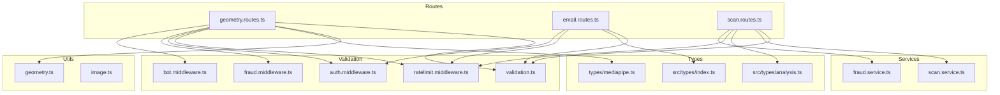
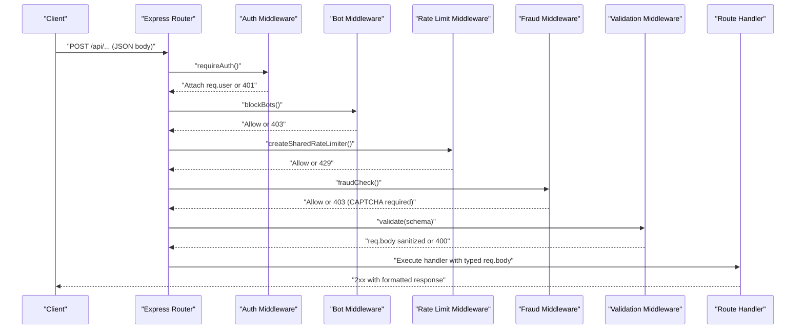
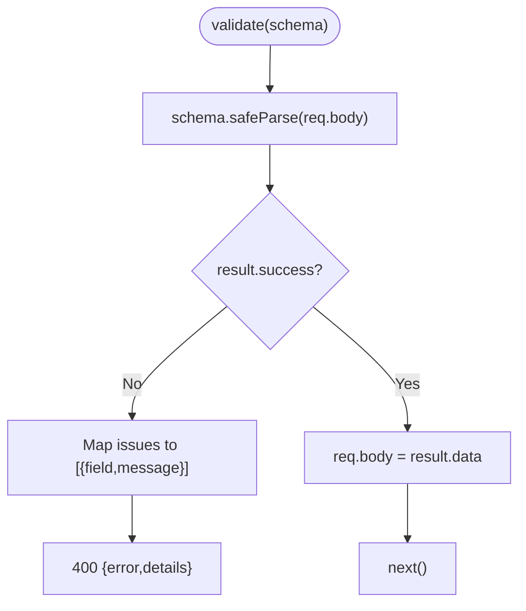
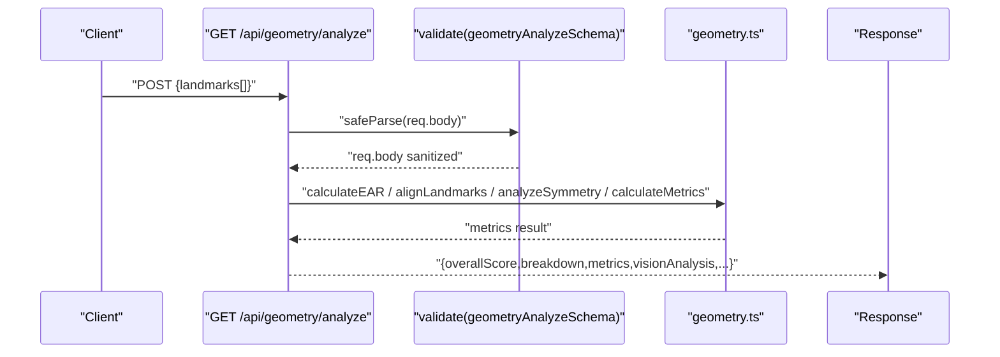
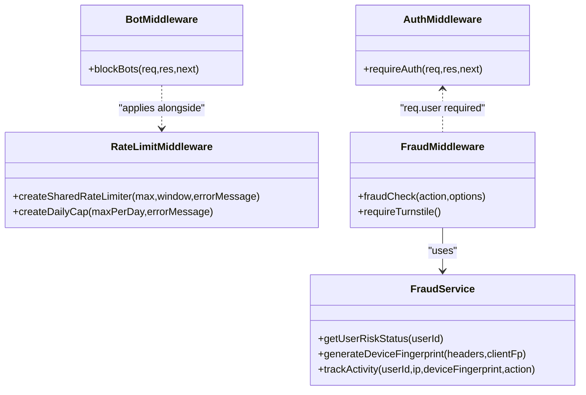
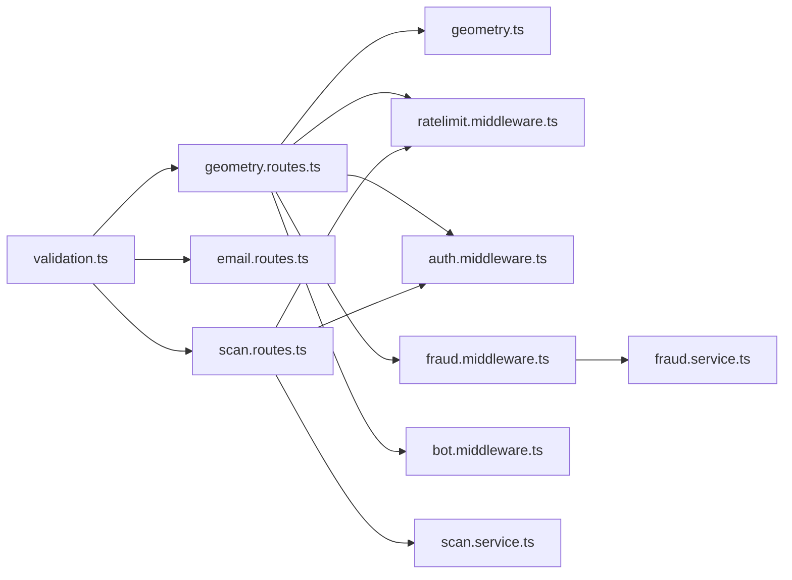

# Data Validation and Schemas

<cite>
**Referenced Files in This Document**
- [validation.ts](file://backend/utils/validation.ts)
- [mediapipe.ts](file://backend/types/mediapipe.ts)
- [index.ts](file://src/types/index.ts)
- [analysis.ts](file://src/types/analysis.ts)
- [geometry.routes.ts](file://backend/routes/geometry.routes.ts)
- [email.routes.ts](file://backend/routes/email.routes.ts)
- [scan.routes.ts](file://backend/routes/scan.routes.ts)
- [geometry.ts](file://backend/utils/geometry.ts)
- [geometry.test.ts](file://backend/utils/geometry.test.ts)
- [geometry.routes.test.ts](file://backend/routes/geometry.routes.test.ts)
- [image.ts](file://backend/utils/image.ts)
- [auth.middleware.ts](file://backend/middleware/auth.middleware.ts)
- [bot.middleware.ts](file://backend/middleware/bot.middleware.ts)
- [fraud.middleware.ts](file://backend/middleware/fraud.middleware.ts)
- [ratelimit.middleware.ts](file://backend/middleware/ratelimit.middleware.ts)
- [fraud.service.ts](file://backend/services/fraud.service.ts)
- [scan.service.ts](file://backend/services/scan.service.ts)
- [logger.ts](file://backend/utils/logger.ts)
</cite>

## Table of Contents
1. [Introduction](#introduction)
2. [Project Structure](#project-structure)
3. [Core Components](#core-components)
4. [Architecture Overview](#architecture-overview)
5. [Detailed Component Analysis](#detailed-component-analysis)
6. [Dependency Analysis](#dependency-analysis)
7. [Performance Considerations](#performance-considerations)
8. [Troubleshooting Guide](#troubleshooting-guide)
9. [Conclusion](#conclusion)
10. [Appendices](#appendices)

## Introduction
This document explains the data validation and schema management in FaceAnalytics Pro. It covers the validation library built with Zod, reusable endpoint schemas, middleware integration, runtime validation patterns, and type safety enforcement across the backend. It also documents response formatting, data transformation, error handling, performance characteristics, caching strategies, and testing approaches.

## Project Structure
The validation and schema system spans several layers:
- Validation library and middleware factory for request schemas
- Route handlers that apply validation and rate-limiting/fraud middleware
- Utility modules for geometry analysis and image compression
- Services for fraud detection and scan storage
- Frontend TypeScript types for API responses and database models

**Diagram sources**
- [geometry.routes.ts:1-77](file://backend/routes/geometry.routes.ts#L1-L77)
- [email.routes.ts:1-63](file://backend/routes/email.routes.ts#L1-L63)
- [scan.routes.ts:1-63](file://backend/routes/scan.routes.ts#L1-L63)
- [validation.ts:1-103](file://backend/utils/validation.ts#L1-L103)
- [auth.middleware.ts:1-40](file://backend/middleware/auth.middleware.ts#L1-L40)
- [ratelimit.middleware.ts:1-134](file://backend/middleware/ratelimit.middleware.ts#L1-L134)
- [fraud.middleware.ts:1-133](file://backend/middleware/fraud.middleware.ts#L1-L133)
- [bot.middleware.ts:1-134](file://backend/middleware/bot.middleware.ts#L1-L134)
- [geometry.ts:1-453](file://backend/utils/geometry.ts#L1-L453)
- [image.ts:1-42](file://backend/utils/image.ts#L1-L42)
- [fraud.service.ts:1-634](file://backend/services/fraud.service.ts#L1-L634)
- [scan.service.ts:1-134](file://backend/services/scan.service.ts#L1-L134)
- [mediapipe.ts:1-45](file://backend/types/mediapipe.ts#L1-L45)
- [index.ts:1-58](file://src/types/index.ts#L1-L58)
- [analysis.ts:1-143](file://src/types/analysis.ts#L1-L143)

**Section sources**
- [validation.ts:1-103](file://backend/utils/validation.ts#L1-L103)
- [geometry.routes.ts:1-77](file://backend/routes/geometry.routes.ts#L1-L77)
- [email.routes.ts:1-63](file://backend/routes/email.routes.ts#L1-L63)
- [scan.routes.ts:1-63](file://backend/routes/scan.routes.ts#L1-L63)

## Core Components
- Validation library: Zod-based schemas and a generic validation middleware factory that parses and sanitizes request bodies, returning structured error responses on failure.
- Endpoint schemas: Reusable Zod schemas for each endpoint payload, including image validation, geometry landmarks, PayPal operations, referral redemption, email welcome, and scan save.
- Middleware integration: Authentication, bot detection, rate limiting, and fraud checks wrap route handlers to enforce security and usage policies.
- Runtime validation: Routes receive sanitized req.body validated against Zod schemas; downstream logic operates on strongly typed data.
- Type safety: Backend TypeScript types define MediaPipe landmarks and analysis results; frontend types define user and analysis models.

**Section sources**
- [validation.ts:89-102](file://backend/utils/validation.ts#L89-L102)
- [mediapipe.ts:1-45](file://backend/types/mediapipe.ts#L1-L45)
- [index.ts:1-58](file://src/types/index.ts#L1-L58)
- [analysis.ts:1-143](file://src/types/analysis.ts#L1-L143)

## Architecture Overview
The validation architecture enforces correctness early in the request lifecycle:
- Requests pass through authentication and bot detection middleware.
- Rate limiting middleware controls throughput.
- Fraud middleware optionally verifies CAPTCHAs and blocks risky users.
- Validation middleware parses and validates req.body against Zod schemas.
- Route handlers operate on sanitized, typed data and produce structured responses.

**Diagram sources**
- [auth.middleware.ts:18-39](file://backend/middleware/auth.middleware.ts#L18-L39)
- [bot.middleware.ts:102-133](file://backend/middleware/bot.middleware.ts#L102-L133)
- [ratelimit.middleware.ts:38-91](file://backend/middleware/ratelimit.middleware.ts#L38-L91)
- [fraud.middleware.ts:30-104](file://backend/middleware/fraud.middleware.ts#L30-L104)
- [validation.ts:89-102](file://backend/utils/validation.ts#L89-L102)
- [geometry.routes.ts:19-74](file://backend/routes/geometry.routes.ts#L19-L74)

## Detailed Component Analysis

### Validation Library and Middleware Factory
- Purpose: Provide a reusable Zod-based validator that transforms req.body into a sanitized object or returns structured 400 errors with field-level details.
- Behavior:
  - safeParse(req.body) returns success/failure.
  - On failure, constructs an array of { field, message } and responds with 400.
  - On success, replaces req.body with parsed data and calls next().
- Extensibility: New endpoint schemas are defined centrally and reused across routes.

**Diagram sources**
- [validation.ts:89-102](file://backend/utils/validation.ts#L89-L102)

**Section sources**
- [validation.ts:89-102](file://backend/utils/validation.ts#L89-L102)

### Endpoint Schemas
- Reusable primitives:
  - Base64 image string with min/max constraints.
- Endpoint-specific schemas:
  - Gemini analysis, celebrity lookalike, hair analysis: image payload validation.
  - Geometry analysis: array of 3D landmarks with minimum/maximum count.
  - PayPal create/capture order: plan identifiers.
  - Referral redeem: code and optional fingerprint.
  - Email welcome: email address, optional name and userId.
  - Scan save: numeric score bounds, JSON payload size limits, optional image URL.

These schemas are imported by routes and passed to the validation middleware.

**Section sources**
- [validation.ts:6-15](file://backend/utils/validation.ts#L6-L15)
- [validation.ts:17-23](file://backend/utils/validation.ts#L17-L23)
- [validation.ts:25-45](file://backend/utils/validation.ts#L25-L45)
- [validation.ts:53-55](file://backend/utils/validation.ts#L53-L55)
- [validation.ts:57-64](file://backend/utils/validation.ts#L57-L64)
- [validation.ts:66-69](file://backend/utils/validation.ts#L66-L69)
- [validation.ts:71-75](file://backend/utils/validation.ts#L71-L75)
- [validation.ts:77-81](file://backend/utils/validation.ts#L77-L81)

### Route Handlers and Validation Integration
- Geometry analysis:
  - Applies rate limiting, validation, and handler logic.
  - Performs photo quality checks (EAR thresholds) and computes metrics.
  - Returns structured response with scores, metrics, and insights.
- Email welcome:
  - Validates email payload, updates user IP, and sends email.
- Scan save:
  - Validates saved scan payload, stores to Firestore, and returns document ID.

**Diagram sources**
- [geometry.routes.ts:19-74](file://backend/routes/geometry.routes.ts#L19-L74)
- [geometry.ts:14-452](file://backend/utils/geometry.ts#L14-L452)
- [validation.ts:53-55](file://backend/utils/validation.ts#L53-L55)

**Section sources**
- [geometry.routes.ts:1-77](file://backend/routes/geometry.routes.ts#L1-L77)
- [email.routes.ts:1-63](file://backend/routes/email.routes.ts#L1-L63)
- [scan.routes.ts:1-63](file://backend/routes/scan.routes.ts#L1-L63)

### Data Transformation and Response Formatting
- Image compression:
  - Resizes and re-encodes base64 images to reduce payload sizes for AI APIs.
  - Falls back to original data on failure.
- Geometry analysis:
  - Computes EAR, aligns landmarks, calculates symmetry, and derives metrics.
  - Formats response with rounded scores and human-readable metrics.
- Scan storage:
  - Hashes image data for deduplication and caches results.
  - Stores structured results and returns document IDs.

**Section sources**
- [image.ts:11-41](file://backend/utils/image.ts#L11-L41)
- [geometry.ts:14-452](file://backend/utils/geometry.ts#L14-L452)
- [scan.service.ts:23-94](file://backend/services/scan.service.ts#L23-L94)

### Middleware Patterns
- Authentication middleware:
  - Extends Express Request with user claim and verifies Firebase ID tokens.
- Bot detection middleware:
  - Blocks known bot user agents, headless browsers, and suspicious requests using behavioral signals.
- Rate limiting middleware:
  - Sliding window with Upstash Redis; per-user and per-IP checks; graceful fallbacks on timeouts.
- Fraud middleware:
  - Enforces CAPTCHA when required, tracks activity, and integrates with fraud service.

**Diagram sources**
- [auth.middleware.ts:18-39](file://backend/middleware/auth.middleware.ts#L18-L39)
- [bot.middleware.ts:102-133](file://backend/middleware/bot.middleware.ts#L102-L133)
- [ratelimit.middleware.ts:25-91](file://backend/middleware/ratelimit.middleware.ts#L25-L91)
- [fraud.middleware.ts:30-104](file://backend/middleware/fraud.middleware.ts#L30-L104)
- [fraud.service.ts:429-472](file://backend/services/fraud.service.ts#L429-L472)

**Section sources**
- [auth.middleware.ts:1-40](file://backend/middleware/auth.middleware.ts#L1-L40)
- [bot.middleware.ts:1-134](file://backend/middleware/bot.middleware.ts#L1-L134)
- [ratelimit.middleware.ts:1-134](file://backend/middleware/ratelimit.middleware.ts#L1-L134)
- [fraud.middleware.ts:1-133](file://backend/middleware/fraud.middleware.ts#L1-L133)
- [fraud.service.ts:1-634](file://backend/services/fraud.service.ts#L1-L634)

### TypeScript Type Definitions
- Backend types:
  - Landmark and arrays for MediaPipe FaceMesh.
  - Symmetry and metrics results for geometry analysis.
- Frontend types:
  - AnalysisResult and UserData interfaces for client-side consumption.
  - Additional analysis-related interfaces for breakdown scores, insights, and radar data.

These types ensure compile-time safety and consistent contracts between backend and frontend.

**Section sources**
- [mediapipe.ts:1-45](file://backend/types/mediapipe.ts#L1-L45)
- [index.ts:1-58](file://src/types/index.ts#L1-L58)
- [analysis.ts:1-143](file://src/types/analysis.ts#L1-L143)

### Error Handling Patterns
- Validation failures:
  - Structured 400 responses with details array containing field and message.
- Route-level errors:
  - Try/catch blocks return 500 with logged errors.
- Middleware errors:
  - Graceful fallbacks (e.g., rate limit timeouts, Redis unavailability) allow requests to proceed.
- Logging:
  - Console-based logger with redaction for sensitive fields; dev upgrades to pino.

**Section sources**
- [validation.ts:90-98](file://backend/utils/validation.ts#L90-L98)
- [geometry.routes.ts:67-73](file://backend/routes/geometry.routes.ts#L67-L73)
- [ratelimit.middleware.ts:86-90](file://backend/middleware/ratelimit.middleware.ts#L86-L90)
- [logger.ts:21-70](file://backend/utils/logger.ts#L21-L70)

### Validation Testing Approaches
- Unit tests for geometry utilities validate mathematical correctness and edge cases.
- Integration tests for routes assert validation behavior and business logic:
  - Missing landmarks trigger 400 validation errors.
  - Closed eyes (low EAR) trigger a 400 with a specific message.
  - Valid landmarks yield 200 with computed results.

**Section sources**
- [geometry.test.ts:1-106](file://backend/utils/geometry.test.ts#L1-L106)
- [geometry.routes.test.ts:1-60](file://backend/routes/geometry.routes.test.ts#L1-L60)

## Dependency Analysis
The validation system exhibits clear separation of concerns:
- Routes depend on validation schemas and middleware.
- Validation middleware depends on Zod schemas.
- Handlers depend on utility modules and services.
- Middleware depends on external systems (Redis, Firebase) with graceful fallbacks.

**Diagram sources**
- [validation.ts:1-103](file://backend/utils/validation.ts#L1-L103)
- [geometry.routes.ts:1-77](file://backend/routes/geometry.routes.ts#L1-L77)
- [email.routes.ts:1-63](file://backend/routes/email.routes.ts#L1-L63)
- [scan.routes.ts:1-63](file://backend/routes/scan.routes.ts#L1-L63)
- [geometry.ts:1-453](file://backend/utils/geometry.ts#L1-L453)
- [ratelimit.middleware.ts:1-134](file://backend/middleware/ratelimit.middleware.ts#L1-L134)
- [auth.middleware.ts:1-40](file://backend/middleware/auth.middleware.ts#L1-L40)
- [fraud.middleware.ts:1-133](file://backend/middleware/fraud.middleware.ts#L1-L133)
- [bot.middleware.ts:1-134](file://backend/middleware/bot.middleware.ts#L1-L134)
- [scan.service.ts:1-134](file://backend/services/scan.service.ts#L1-L134)
- [fraud.service.ts:1-634](file://backend/services/fraud.service.ts#L1-L634)

**Section sources**
- [validation.ts:1-103](file://backend/utils/validation.ts#L1-L103)
- [geometry.routes.ts:1-77](file://backend/routes/geometry.routes.ts#L1-L77)
- [scan.routes.ts:1-63](file://backend/routes/scan.routes.ts#L1-L63)

## Performance Considerations
- Validation overhead:
  - Zod parsing is efficient; keep schemas minimal and avoid unnecessary transformations.
- Image compression:
  - Reduces payload sizes for AI APIs; includes fallback on failure.
- Rate limiting:
  - Sliding window with Redis; timeouts are handled gracefully to avoid blocking legitimate users.
- Fraud detection:
  - In-memory cache for risk profiles reduces Firestore reads; batching activity logs minimizes write amplification.
- Logging:
  - Console logger avoids worker-thread issues in serverless environments; redacts sensitive fields.

[No sources needed since this section provides general guidance]

## Troubleshooting Guide
- Validation 400 errors:
  - Inspect the details array for field-level messages; adjust client payloads to match schema constraints.
- Rate limit 429:
  - Review per-user and per-IP limits; consider increasing quotas or adjusting windows.
- CAPTCHA 403:
  - Ensure x-captcha-token is provided; verify Turnstile configuration and trusted user IDs.
- Suspicious request 403:
  - Check user agent and behavioral headers; review bot blocklist and suspicion scoring logic.
- Fraud risk:
  - Investigate risk score thresholds and cached profiles; confirm device fingerprint generation and activity tracking.

**Section sources**
- [validation.ts:90-98](file://backend/utils/validation.ts#L90-L98)
- [ratelimit.middleware.ts:62-90](file://backend/middleware/ratelimit.middleware.ts#L62-L90)
- [fraud.middleware.ts:71-92](file://backend/middleware/fraud.middleware.ts#L71-L92)
- [bot.middleware.ts:102-133](file://backend/middleware/bot.middleware.ts#L102-L133)
- [fraud.service.ts:429-472](file://backend/services/fraud.service.ts#L429-L472)

## Conclusion
FaceAnalytics Pro employs a robust validation and schema management system centered on Zod schemas and middleware. Early validation, structured error responses, and typed contracts across backend and frontend ensure correctness and maintainability. Middleware layers enforce security and usage policies, while caching and batching optimize performance. Comprehensive unit and integration tests validate both utility logic and route behavior.

[No sources needed since this section summarizes without analyzing specific files]

## Appendices

### Validation Rule Definitions and Examples
- Image payload constraints:
  - Min/max length for base64 image strings.
- Geometry landmarks:
  - Minimum/maximum count for landmark arrays.
- Message length limits:
  - Max length for chat messages.
- Numeric ranges:
  - Score bounds for analysis results.
- Optional fields:
  - Optional context and history for chat payloads.

**Section sources**
- [validation.ts:6-9](file://backend/utils/validation.ts#L6-L9)
- [validation.ts:53-55](file://backend/utils/validation.ts#L53-L55)
- [validation.ts:25-45](file://backend/utils/validation.ts#L25-L45)
- [validation.ts:77-81](file://backend/utils/validation.ts#L77-L81)

### Error Message Localization
- Current implementation returns English messages from Zod issues.
- To localize messages, replace Zod messages with localized keys and map to translated strings in the validation middleware.

**Section sources**
- [validation.ts:93-96](file://backend/utils/validation.ts#L93-L96)

### Custom Validation Logic
- Geometry EAR threshold:
  - Detects closed or squinting eyes and returns a 400 with a descriptive message.
- Device fingerprinting:
  - Combines request headers and optional client fingerprint for stronger device anchoring.
- Suspicion scoring:
  - Behavioral signals on API requests help identify automation attempts.

**Section sources**
- [geometry.routes.ts:24-29](file://backend/routes/geometry.routes.ts#L24-L29)
- [fraud.service.ts:99-121](file://backend/services/fraud.service.ts#L99-L121)
- [bot.middleware.ts:62-95](file://backend/middleware/bot.middleware.ts#L62-L95)

### Type Safety Enforcement
- Compile-time checks:
  - Strict interfaces for MediaPipe landmarks and analysis results.
  - Frontend types for user data and analysis outcomes.
- Runtime validation:
  - Zod schemas ensure request payloads conform to expected shapes before handlers execute.

**Section sources**
- [mediapipe.ts:1-45](file://backend/types/mediapipe.ts#L1-L45)
- [index.ts:1-58](file://src/types/index.ts#L1-L58)
- [analysis.ts:1-143](file://src/types/analysis.ts#L1-L143)
- [validation.ts:89-102](file://backend/utils/validation.ts#L89-L102)

### Validation Performance and Caching Strategies
- Validation:
  - Centralized middleware reduces duplication and ensures consistent error handling.
- Caching:
  - Risk profiles cached in memory with TTL to minimize Firestore reads.
  - Activity logs batched to reduce write volume.
- Rate limiting:
  - Redis-backed sliding window with timeouts and fallbacks.

**Section sources**
- [fraud.service.ts:49-76](file://backend/services/fraud.service.ts#L49-L76)
- [fraud.service.ts:548-588](file://backend/services/fraud.service.ts#L548-L588)
- [ratelimit.middleware.ts:30-91](file://backend/middleware/ratelimit.middleware.ts#L30-L91)

### Validation Testing Approaches
- Unit tests:
  - Validate math functions and symmetry calculations.
- Integration tests:
  - Assert validation behavior and business logic for route handlers.

**Section sources**
- [geometry.test.ts:1-106](file://backend/utils/geometry.test.ts#L1-L106)
- [geometry.routes.test.ts:1-60](file://backend/routes/geometry.routes.test.ts#L1-L60)