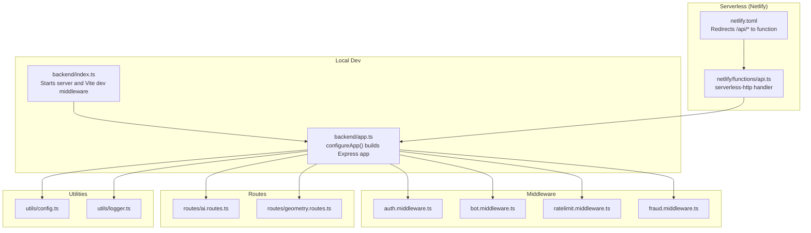
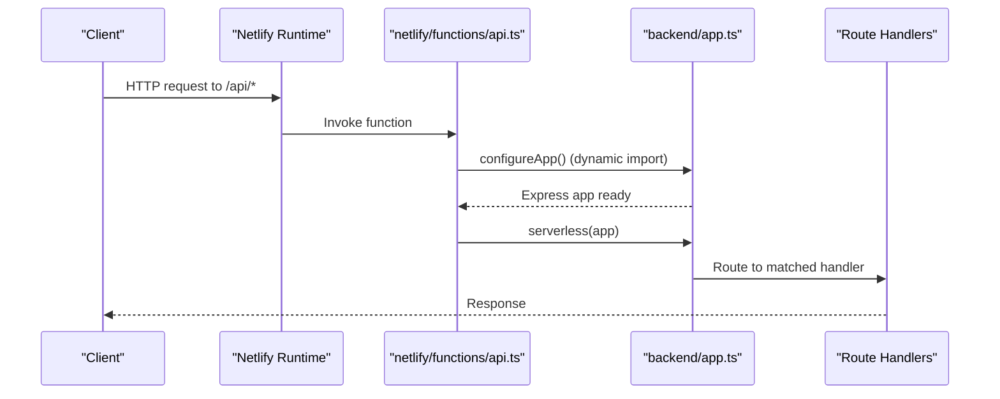
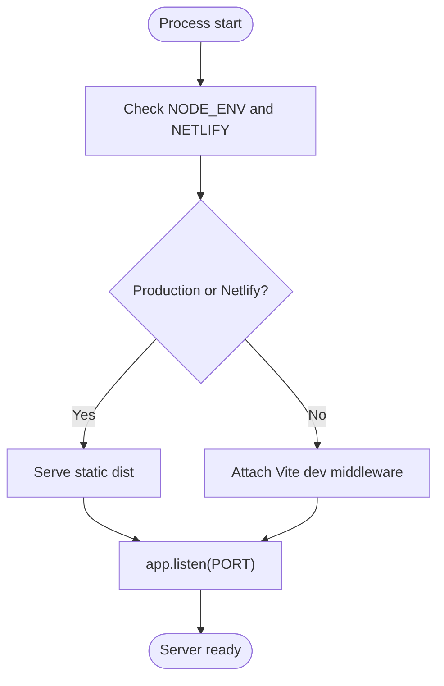
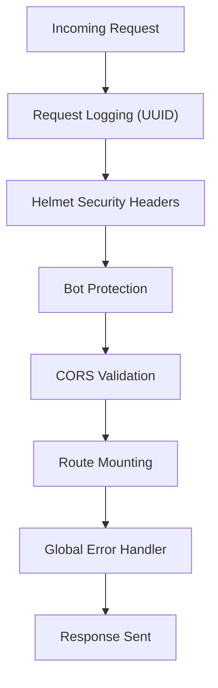
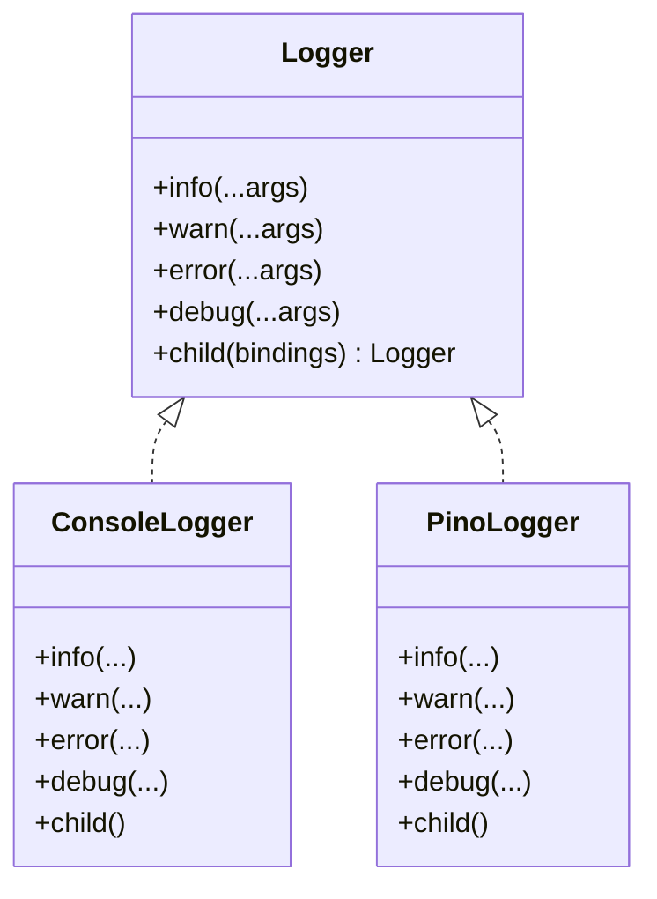
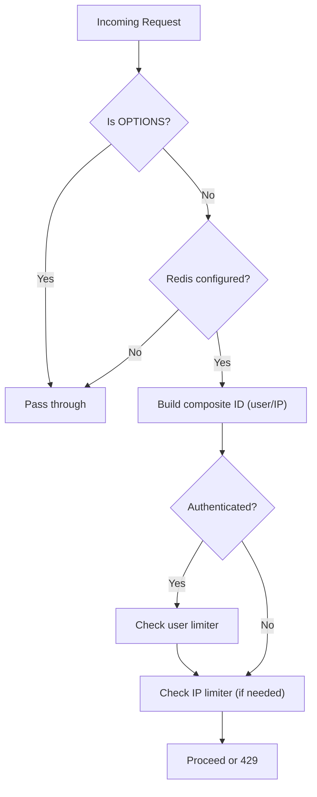
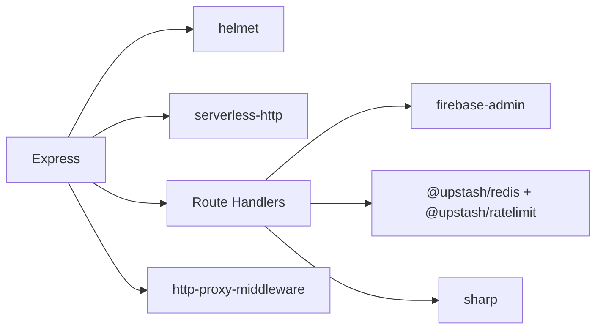

# Express Server Configuration

<cite>
**Referenced Files in This Document**
- [backend/index.ts](file://backend/index.ts)
- [backend/app.ts](file://backend/app.ts)
- [netlify/functions/api.ts](file://netlify/functions/api.ts)
- [backend/utils/logger.ts](file://backend/utils/logger.ts)
- [backend/utils/config.ts](file://backend/utils/config.ts)
- [backend/middleware/ratelimit.middleware.ts](file://backend/middleware/ratelimit.middleware.ts)
- [backend/middleware/bot.middleware.ts](file://backend/middleware/bot.middleware.ts)
- [backend/middleware/auth.middleware.ts](file://backend/middleware/auth.middleware.ts)
- [backend/middleware/fraud.middleware.ts](file://backend/middleware/fraud.middleware.ts)
- [backend/routes/ai.routes.ts](file://backend/routes/ai.routes.ts)
- [backend/routes/geometry.routes.ts](file://backend/routes/geometry.routes.ts)
- [netlify.toml](file://netlify.toml)
- [package.json](file://package.json)
</cite>

## Table of Contents
1. [Introduction](#introduction)
2. [Project Structure](#project-structure)
3. [Core Components](#core-components)
4. [Architecture Overview](#architecture-overview)
5. [Detailed Component Analysis](#detailed-component-analysis)
6. [Dependency Analysis](#dependency-analysis)
7. [Performance Considerations](#performance-considerations)
8. [Troubleshooting Guide](#troubleshooting-guide)
9. [Conclusion](#conclusion)

## Introduction
This document explains the Express.js server configuration powering FaceAnalytics Pro, focusing on server initialization, middleware registration order, environment-specific behavior, and serverless adaptation for Netlify Functions. It covers logging, security headers, CORS, rate limiting, health checks, error handling, and performance tuning tailored for serverless environments.

## Project Structure
The server is organized around a modular Express application with dynamic imports to optimize cold start performance in serverless environments. The backend exposes API routes grouped by domain, with dedicated middleware for authentication, bot protection, fraud detection, and rate limiting.

**Diagram sources**
- [backend/index.ts:1-29](file://backend/index.ts#L1-L29)
- [backend/app.ts:15-201](file://backend/app.ts#L15-L201)
- [netlify/functions/api.ts:1-28](file://netlify/functions/api.ts#L1-L28)
- [netlify.toml:1-42](file://netlify.toml#L1-L42)
- [backend/middleware/auth.middleware.ts:1-40](file://backend/middleware/auth.middleware.ts#L1-L40)
- [backend/middleware/bot.middleware.ts:1-134](file://backend/middleware/bot.middleware.ts#L1-L134)
- [backend/middleware/ratelimit.middleware.ts:1-134](file://backend/middleware/ratelimit.middleware.ts#L1-L134)
- [backend/middleware/fraud.middleware.ts:1-133](file://backend/middleware/fraud.middleware.ts#L1-L133)
- [backend/routes/ai.routes.ts:1-1146](file://backend/routes/ai.routes.ts#L1-L1146)
- [backend/routes/geometry.routes.ts:1-77](file://backend/routes/geometry.routes.ts#L1-L77)
- [backend/utils/config.ts:1-110](file://backend/utils/config.ts#L1-L110)
- [backend/utils/logger.ts:1-71](file://backend/utils/logger.ts#L1-L71)

**Section sources**
- [backend/index.ts:1-29](file://backend/index.ts#L1-L29)
- [backend/app.ts:15-201](file://backend/app.ts#L15-L201)
- [netlify/functions/api.ts:1-28](file://netlify/functions/api.ts#L1-L28)
- [netlify.toml:1-42](file://netlify.toml#L1-L42)

## Core Components
- Express app builder with dynamic imports to defer heavy modules until first request, optimizing cold start in serverless.
- Request lifecycle middleware: request logging with unique IDs, security headers, bot protection, CORS, and route mounting.
- Health check endpoint for readiness monitoring.
- Global error handler integrating structured logging.
- Environment configuration validated at startup with graceful degradation in development.
- Logging abstraction switching between console and pino depending on environment.

**Section sources**
- [backend/app.ts:15-201](file://backend/app.ts#L15-L201)
- [backend/utils/logger.ts:1-71](file://backend/utils/logger.ts#L1-L71)
- [backend/utils/config.ts:59-82](file://backend/utils/config.ts#L59-L82)

## Architecture Overview
The server initializes Express, registers middleware in a specific order, mounts routes, and serves static assets in production. In serverless mode, the same app is wrapped with serverless-http and invoked per request.

**Diagram sources**
- [netlify/functions/api.ts:12-27](file://netlify/functions/api.ts#L12-L27)
- [backend/app.ts:15-47](file://backend/app.ts#L15-L47)

**Section sources**
- [backend/app.ts:15-201](file://backend/app.ts#L15-L201)
- [netlify/functions/api.ts:1-28](file://netlify/functions/api.ts#L1-L28)

## Detailed Component Analysis

### Server Initialization and Startup Sequence
- Local development: Vite dev middleware is injected when not in production or Netlify mode. The server listens on the configured port and logs environment details.
- Serverless: The function defers app creation to the first invocation, ensuring cold start budgets are respected.

**Diagram sources**
- [backend/index.ts:7-26](file://backend/index.ts#L7-L26)
- [backend/app.ts:193-195](file://backend/app.ts#L193-L195)

**Section sources**
- [backend/index.ts:1-29](file://backend/index.ts#L1-L29)
- [backend/app.ts:193-195](file://backend/app.ts#L193-L195)

### Middleware Registration Order and Responsibilities
The middleware stack is registered in a deliberate order to ensure proper request handling and security:

1. Request logging with unique request IDs and conditional logging in development.
2. Security headers via Helmet, including CSP, COOP, and COEP overrides.
3. Bot protection middleware blocking known scrapers and headless browsers, plus behavioral suspicion scoring.
4. CORS middleware validating origin against an allowlist and handling preflight.
5. Route mounting for API groups (/api, /api/paypal, /api/referral, etc.).
6. Global error handler integrating structured logging.

**Diagram sources**
- [backend/app.ts:68-191](file://backend/app.ts#L68-L191)

**Section sources**
- [backend/app.ts:68-191](file://backend/app.ts#L68-L191)

### Security Headers and CORS
- Helmet is applied with a strict CSP allowing external resources for PayPal, Posthog, Cloudflare, and JSDelivr.
- Cross-Origin policies are tuned to permit popups for Firebase OAuth while maintaining isolation.
- CORS validates the Origin header against a configurable allowlist and sets vary headers appropriately.

**Section sources**
- [backend/app.ts:90-164](file://backend/app.ts#L90-L164)

### Health Check Endpoint
- A simple GET endpoint at /api/health returns a minimal JSON payload indicating service availability. It is excluded from request logging to reduce noise.

**Section sources**
- [backend/app.ts:166-169](file://backend/app.ts#L166-L169)

### Logging System and Structured Logging
- In serverless, a console-based logger is used synchronously to avoid worker-thread issues with pino.
- In development, pino is conditionally upgraded asynchronously for richer output and redaction of sensitive fields.
- The global error handler integrates logging with request IDs for traceability.

**Diagram sources**
- [backend/utils/logger.ts:13-71](file://backend/utils/logger.ts#L13-L71)

**Section sources**
- [backend/utils/logger.ts:1-71](file://backend/utils/logger.ts#L1-71)

### Environment Configuration and Validation
- A centralized Zod schema validates all required and optional environment variables at startup.
- In production or Netlify, invalid configuration causes immediate termination; in development, a degraded mode is used with defaults.

**Section sources**
- [backend/utils/config.ts:1-110](file://backend/utils/config.ts#L1-L110)

### Rate Limiting and Abuse Prevention
- Upstash Redis-backed sliding window rate limiting with composite identifiers (user ID or IP).
- Per-endpoint rate limiters and daily usage caps for authenticated users.
- Graceful fallbacks when Redis is unavailable and timeouts for rate limit checks.

**Diagram sources**
- [backend/middleware/ratelimit.middleware.ts:38-92](file://backend/middleware/ratelimit.middleware.ts#L38-L92)

**Section sources**
- [backend/middleware/ratelimit.middleware.ts:1-134](file://backend/middleware/ratelimit.middleware.ts#L1-L134)

### Bot Protection and Fraud Detection
- Known bot user agents and headless browser indicators are blocked.
- Behavioral suspicion scoring evaluates missing browser signals on API routes.
- Fraud middleware integrates with Firestore-backed risk profiles, CAPTCHA verification, and activity tracking.

**Section sources**
- [backend/middleware/bot.middleware.ts:1-134](file://backend/middleware/bot.middleware.ts#L1-L134)
- [backend/middleware/fraud.middleware.ts:1-133](file://backend/middleware/fraud.middleware.ts#L1-L133)

### Authentication Middleware
- Validates Authorization bearer tokens against Firebase Admin Auth and attaches user metadata to the request.

**Section sources**
- [backend/middleware/auth.middleware.ts:1-40](file://backend/middleware/auth.middleware.ts#L1-L40)

### Route Modules and Credit-Safe Workflows
- AI analysis endpoints implement a credit-safe flow: soft credit checks, image compression, cache lookup, AI call, and post-success credit deduction with best-effort reconciliation.
- Geometry endpoint performs quality checks and alignment before computing symmetry and metrics.

**Section sources**
- [backend/routes/ai.routes.ts:256-516](file://backend/routes/ai.routes.ts#L256-L516)
- [backend/routes/geometry.routes.ts:19-74](file://backend/routes/geometry.routes.ts#L19-L74)

### Serverless Adaptation for Netlify Functions
- Dynamic imports in configureApp() defer heavy modules to first invocation.
- serverless-http wraps the Express app for Netlify Functions.
- netlify.toml redirects /api/* to the function and sets a 26-second timeout to accommodate long-running AI calls.

**Section sources**
- [backend/app.ts:3-8](file://backend/app.ts#L3-L8)
- [netlify/functions/api.ts:12-27](file://netlify/functions/api.ts#L12-L27)
- [netlify.toml:19-26](file://netlify.toml#L19-L26)

## Dependency Analysis
The server relies on several key libraries and integrations:

- Express for routing and middleware.
- Helmet for security headers.
- serverless-http for Netlify Functions adapter.
- Upstash Redis and Ratelimit for rate limiting.
- Firebase Admin for auth and Firestore.
- Sharp for image processing.
- Posthog reverse proxy for analytics ingestion.

**Diagram sources**
- [package.json:19-52](file://package.json#L19-L52)
- [backend/app.ts:33-47](file://backend/app.ts#L33-L47)

**Section sources**
- [package.json:19-52](file://package.json#L19-L52)
- [backend/app.ts:33-47](file://backend/app.ts#L33-L47)

## Performance Considerations
- Cold start optimization: dynamic imports in configureApp() defer heavy modules until first request.
- Request timeouts: AI endpoints use AbortController with platform-aware timeouts (24s in serverless, 60s in local).
- Redis rate limiting timeouts: 2-second race timeout to prevent blocking.
- Static asset serving only in production to avoid unnecessary overhead.
- Batched activity logging to reduce Firestore write volume.

**Section sources**
- [backend/app.ts:3-8](file://backend/app.ts#L3-L8)
- [backend/routes/ai.routes.ts:165-216](file://backend/routes/ai.routes.ts#L165-L216)
- [backend/middleware/ratelimit.middleware.ts:54-65](file://backend/middleware/ratelimit.middleware.ts#L54-L65)
- [backend/services/fraud.service.ts:544-588](file://backend/services/fraud.service.ts#L544-L588)

## Troubleshooting Guide
- Environment validation failures in production cause immediate termination; review the printed validation errors and ensure all required variables are set.
- Rate limiting disabled: verify UPSTASH_REDIS_REST_URL and UPSTASH_REDIS_REST_TOKEN are configured; the limiter falls back open when Redis is unavailable.
- Health check: use GET /api/health for readiness; it excludes noisy logging to keep logs readable.
- Logging: in development, pino upgrades asynchronously; if unavailable, console logger remains active. In serverless, console logger is used synchronously to avoid worker-thread crashes.
- Netlify function timeouts: the platform enforces a 26-second limit; ensure AbortController timeouts are set appropriately for long-running operations.

**Section sources**
- [backend/utils/config.ts:64-82](file://backend/utils/config.ts#L64-L82)
- [backend/middleware/ratelimit.middleware.ts:8-13](file://backend/middleware/ratelimit.middleware.ts#L8-L13)
- [backend/app.ts:166-169](file://backend/app.ts#L166-L169)
- [backend/utils/logger.ts:54-68](file://backend/utils/logger.ts#L54-L68)
- [netlify.toml:20-26](file://netlify.toml#L20-L26)

## Conclusion
FaceAnalytics Pro’s Express server is designed for reliability and scalability across local and serverless environments. Its middleware stack prioritizes security, abuse prevention, and observability, while dynamic imports and careful resource management ensure efficient cold starts in Netlify Functions. The configuration supports structured logging, robust error handling, and environment-aware behavior for smooth operations in production.