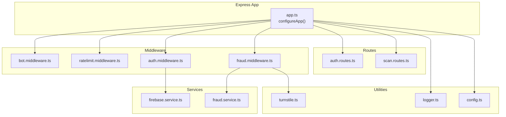
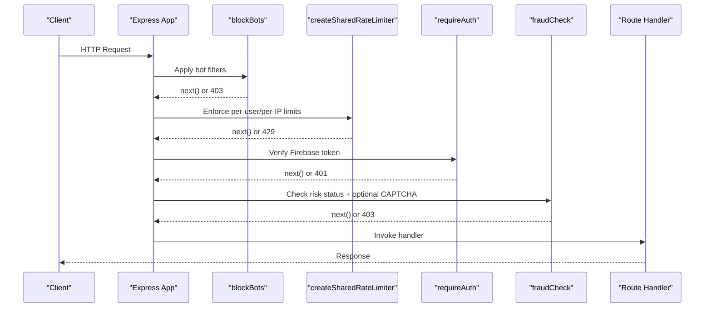
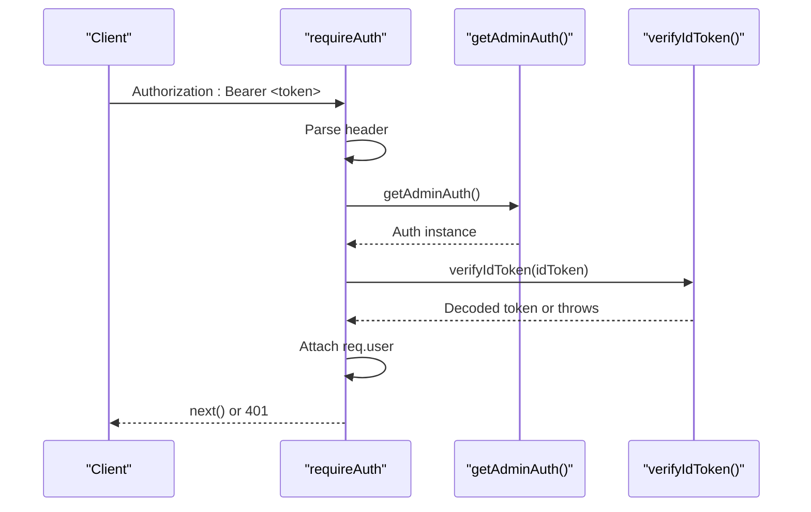
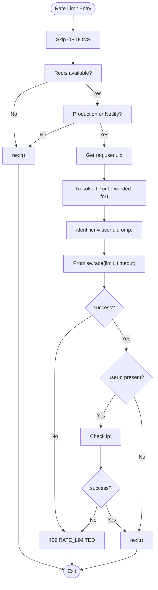
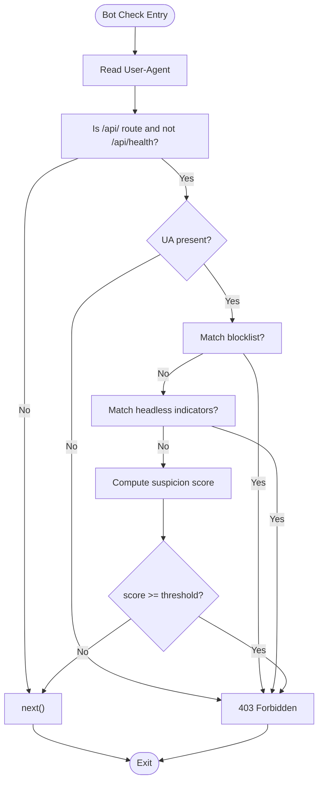
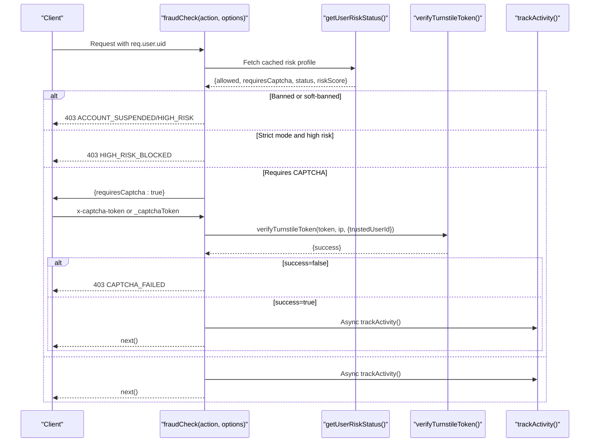
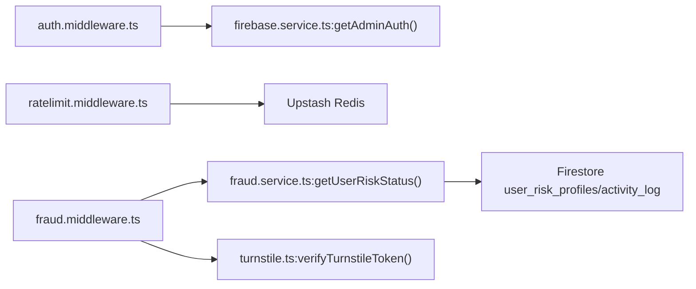

# Middleware Layer

<cite>
**Referenced Files in This Document**
- [auth.middleware.ts](file://backend/middleware/auth.middleware.ts)
- [ratelimit.middleware.ts](file://backend/middleware/ratelimit.middleware.ts)
- [bot.middleware.ts](file://backend/middleware/bot.middleware.ts)
- [fraud.middleware.ts](file://backend/middleware/fraud.middleware.ts)
- [firebase.service.ts](file://backend/services/firebase.service.ts)
- [fraud.service.ts](file://backend/services/fraud.service.ts)
- [turnstile.ts](file://backend/utils/turnstile.ts)
- [logger.ts](file://backend/utils/logger.ts)
- [app.ts](file://backend/app.ts)
- [auth.routes.ts](file://backend/routes/auth.routes.ts)
- [scan.routes.ts](file://backend/routes/scan.routes.ts)
- [config.ts](file://backend/utils/config.ts)
- [index.ts](file://backend/index.ts)
</cite>

## Table of Contents
1. [Introduction](#introduction)
2. [Project Structure](#project-structure)
3. [Core Components](#core-components)
4. [Architecture Overview](#architecture-overview)
5. [Detailed Component Analysis](#detailed-component-analysis)
6. [Dependency Analysis](#dependency-analysis)
7. [Performance Considerations](#performance-considerations)
8. [Troubleshooting Guide](#troubleshooting-guide)
9. [Conclusion](#conclusion)
10. [Appendices](#appendices)

## Introduction
This document explains the middleware layer of FaceAnalytics Pro, focusing on authentication, rate limiting, bot detection, and fraud detection. It covers implementation details, execution order, error propagation, security configurations, logging integration, performance characteristics, and testing strategies. The goal is to help developers understand how middleware components collaborate to secure and scale the backend while maintaining a good developer experience.

## Project Structure
The middleware layer resides under backend/middleware and integrates with services, utilities, and routes. The Express application initializes middleware and routes in a lazy manner to optimize cold start performance in serverless environments.

**Diagram sources**
- [app.ts:15-201](file://backend/app.ts#L15-L201)
- [auth.middleware.ts:18-39](file://backend/middleware/auth.middleware.ts#L18-L39)
- [ratelimit.middleware.ts:38-92](file://backend/middleware/ratelimit.middleware.ts#L38-L92)
- [bot.middleware.ts:102-133](file://backend/middleware/bot.middleware.ts#L102-L133)
- [fraud.middleware.ts:30-104](file://backend/middleware/fraud.middleware.ts#L30-L104)
- [firebase.service.ts:103-119](file://backend/services/firebase.service.ts#L103-L119)
- [fraud.service.ts:429-472](file://backend/services/fraud.service.ts#L429-L472)
- [turnstile.ts:71-145](file://backend/utils/turnstile.ts#L71-L145)
- [auth.routes.ts:23-88](file://backend/routes/auth.routes.ts#L23-L88)
- [scan.routes.ts:22-60](file://backend/routes/scan.routes.ts#L22-L60)

**Section sources**
- [app.ts:15-201](file://backend/app.ts#L15-L201)
- [index.ts:7-26](file://backend/index.ts#L7-L26)

## Core Components
- Authentication middleware: validates Firebase ID tokens and attaches user identity to the request.
- Rate limiting middleware: sliding window and daily caps with Redis-backed counters and per-user/per-IP enforcement.
- Bot detection middleware: multi-layered detection using UA blocklists, headless indicators, and behavioral scoring.
- Fraud detection middleware: risk scoring, CAPTCHA gating, and activity tracking with device fingerprinting.

**Section sources**
- [auth.middleware.ts:18-39](file://backend/middleware/auth.middleware.ts#L18-L39)
- [ratelimit.middleware.ts:25-92](file://backend/middleware/ratelimit.middleware.ts#L25-L92)
- [bot.middleware.ts:102-133](file://backend/middleware/bot.middleware.ts#L102-L133)
- [fraud.middleware.ts:30-104](file://backend/middleware/fraud.middleware.ts#L30-L104)

## Architecture Overview
The middleware layer is mounted globally and around specific routes. The execution order ensures bot filtering precedes authentication and rate limiting, while fraud checks occur after authentication and rate limiting.

**Diagram sources**
- [app.ts:142-143](file://backend/app.ts#L142-L143)
- [ratelimit.middleware.ts:38-92](file://backend/middleware/ratelimit.middleware.ts#L38-L92)
- [auth.middleware.ts:18-39](file://backend/middleware/auth.middleware.ts#L18-L39)
- [fraud.middleware.ts:30-104](file://backend/middleware/fraud.middleware.ts#L30-L104)

## Detailed Component Analysis

### Authentication Middleware
Purpose:
- Extracts Bearer token from Authorization header.
- Verifies token via Firebase Admin Auth.
- Attaches decoded user identity to req.user.

Key behaviors:
- Extends Express Request interface to include user property.
- Returns 401 on missing/invalid token with error payload.
- Logs verification errors for diagnostics.

**Diagram sources**
- [auth.middleware.ts:18-39](file://backend/middleware/auth.middleware.ts#L18-L39)
- [firebase.service.ts:103-119](file://backend/services/firebase.service.ts#L103-L119)

**Section sources**
- [auth.middleware.ts:4-16](file://backend/middleware/auth.middleware.ts#L4-L16)
- [auth.middleware.ts:18-39](file://backend/middleware/auth.middleware.ts#L18-L39)
- [firebase.service.ts:103-119](file://backend/services/firebase.service.ts#L103-L119)

### Rate Limiting Middleware
Purpose:
- Enforce sliding-window rate limits per user or IP.
- Enforce daily usage caps for authenticated users.
- Provide X-RateLimit headers and graceful fallbacks.

Key behaviors:
- Composite identifier: user:userId or ip:<ip>.
- Per-user enforcement plus per-IP check to prevent rotation abuse.
- 2-second timeout on Redis checks; timeouts fail open.
- Daily cap stored with TTL expiring at day boundary.
- Disabled in development unless explicitly enabled.

**Diagram sources**
- [ratelimit.middleware.ts:38-92](file://backend/middleware/ratelimit.middleware.ts#L38-L92)
- [ratelimit.middleware.ts:98-133](file://backend/middleware/ratelimit.middleware.ts#L98-L133)

**Section sources**
- [ratelimit.middleware.ts:25-92](file://backend/middleware/ratelimit.middleware.ts#L25-L92)
- [ratelimit.middleware.ts:98-133](file://backend/middleware/ratelimit.middleware.ts#L98-L133)

### Bot Detection Middleware
Purpose:
- Block known bot user agents and headless automation tools.
- Detect suspicious behavior via missing browser headers.
- Prevent scraping and automated abuse on API routes.

Key behaviors:
- Blocklist of known AI crawlers and scraping tools.
- Headless browser detection via UA patterns.
- Behavioral scoring for missing headers on API POST requests.
- Strict threshold to avoid false positives for unusual but legitimate configs.

**Diagram sources**
- [bot.middleware.ts:102-133](file://backend/middleware/bot.middleware.ts#L102-L133)

**Section sources**
- [bot.middleware.ts:3-39](file://backend/middleware/bot.middleware.ts#L3-L39)
- [bot.middleware.ts:41-57](file://backend/middleware/bot.middleware.ts#L41-L57)
- [bot.middleware.ts:62-95](file://backend/middleware/bot.middleware.ts#L62-L95)
- [bot.middleware.ts:102-133](file://backend/middleware/bot.middleware.ts#L102-L133)

### Fraud Detection Middleware
Purpose:
- Enforce risk-aware policies for protected endpoints.
- Require CAPTCHA when risk status demands it.
- Preemptively block high-risk users from expensive operations.

Key behaviors:
- Requires authentication (req.user.uid).
- Computes device fingerprint from headers and optional client-provided fingerprint.
- Attaches risk metadata to req for downstream use.
- Checks risk status from cache/profile; blocks if banned or soft-banned.
- Optional strict mode to block at configurable risk threshold before full ban.
- Verifies Cloudflare Turnstile token when required; uses circuit breaker and trusted user degrading.

**Diagram sources**
- [fraud.middleware.ts:30-104](file://backend/middleware/fraud.middleware.ts#L30-L104)
- [fraud.service.ts:429-472](file://backend/services/fraud.service.ts#L429-L472)
- [turnstile.ts:71-145](file://backend/utils/turnstile.ts#L71-L145)

**Section sources**
- [fraud.middleware.ts:14-17](file://backend/middleware/fraud.middleware.ts#L14-L17)
- [fraud.middleware.ts:30-104](file://backend/middleware/fraud.middleware.ts#L30-L104)
- [fraud.service.ts:99-121](file://backend/services/fraud.service.ts#L99-L121)
- [turnstile.ts:71-145](file://backend/utils/turnstile.ts#L71-L145)

## Dependency Analysis
- Authentication depends on Firebase Admin Auth initialization and token verification.
- Rate limiting depends on Upstash Redis availability; falls back gracefully when unavailable.
- Fraud detection depends on Firestore for risk profiles and activity logs; uses in-memory cache and batching to reduce load.
- Turnstile verification depends on Cloudflare’s siteverify endpoint and environment configuration.

**Diagram sources**
- [auth.middleware.ts:26-27](file://backend/middleware/auth.middleware.ts#L26-L27)
- [firebase.service.ts:103-119](file://backend/services/firebase.service.ts#L103-L119)
- [ratelimit.middleware.ts:30-36](file://backend/middleware/ratelimit.middleware.ts#L30-L36)
- [fraud.middleware.ts:49-95](file://backend/middleware/fraud.middleware.ts#L49-L95)
- [fraud.service.ts:429-472](file://backend/services/fraud.service.ts#L429-L472)
- [turnstile.ts:71-145](file://backend/utils/turnstile.ts#L71-L145)

**Section sources**
- [auth.middleware.ts:26-27](file://backend/middleware/auth.middleware.ts#L26-L27)
- [firebase.service.ts:103-119](file://backend/services/firebase.service.ts#L103-L119)
- [ratelimit.middleware.ts:30-36](file://backend/middleware/ratelimit.middleware.ts#L30-L36)
- [fraud.middleware.ts:49-95](file://backend/middleware/fraud.middleware.ts#L49-L95)
- [fraud.service.ts:429-472](file://backend/services/fraud.service.ts#L429-L472)
- [turnstile.ts:71-145](file://backend/utils/turnstile.ts#L71-L145)

## Performance Considerations
- Lazy initialization: Heavy modules are imported on first request to minimize cold start latency in serverless environments.
- In-memory caches:
  - Firebase Admin instances are reused.
  - Risk profile cache reduces Firestore reads with TTL and eviction.
  - Activity logs are buffered and flushed periodically to reduce write amplification.
- Redis timeouts: Rate limit checks use a 2-second timeout to prevent slow Redis from blocking requests; failures are handled gracefully.
- Dev bypass: Rate limiting is disabled in development to ease local testing.
- Logging overhead: Console-based logger is synchronous and avoids worker-thread issues in serverless; dev upgrades to pino asynchronously.

[No sources needed since this section provides general guidance]

## Troubleshooting Guide
Common issues and resolutions:
- Authentication failures:
  - Ensure Authorization header contains a valid Bearer token.
  - Verify Firebase Admin credentials and environment variables.
  - Check token expiration and audience restrictions.
- Rate limiting:
  - Confirm Upstash Redis environment variables are set.
  - Review X-RateLimit headers to diagnose limits and resets.
  - Understand that dev disables rate limits by design.
- Bot detection:
  - Known bot UAs and headless indicators are strictly enforced; adjust UA or emulate browser headers if legitimate.
  - Behavioral scoring may trigger for unusual configurations; ensure Accept, Accept-Language, and sec-fetch headers are present on API requests.
- Fraud detection:
  - If blocked for high risk, resolve CAPTCHA or wait for risk decay.
  - Verify Turnstile secret key and network connectivity.
  - Check risk thresholds and environment configuration.

**Section sources**
- [auth.middleware.ts:35-38](file://backend/middleware/auth.middleware.ts#L35-L38)
- [ratelimit.middleware.ts:86-90](file://backend/middleware/ratelimit.middleware.ts#L86-L90)
- [bot.middleware.ts:107-129](file://backend/middleware/bot.middleware.ts#L107-L129)
- [turnstile.ts:80-87](file://backend/utils/turnstile.ts#L80-L87)
- [turnstile.ts:124-144](file://backend/utils/turnstile.ts#L124-L144)

## Conclusion
The middleware layer in FaceAnalytics Pro provides robust security and scalability through layered protections:
- Bot detection prevents automated abuse.
- Authentication ensures only verified users can access protected resources.
- Rate limiting controls usage and protects infrastructure.
- Fraud detection monitors risk and enforces policy with configurable thresholds and CAPTCHA gating.

Execution order and careful error propagation ensure reliability and a smooth user experience, while environment-driven configuration and caching strategies keep performance optimal.

[No sources needed since this section summarizes without analyzing specific files]

## Appendices

### Middleware Execution Order
- Mounted globally in this order:
  1) Bot detection middleware
  2) CORS and health checks
  3) Authentication middleware
  4) Rate limiting middleware
  5) Fraud detection middleware
- Route-specific middleware is applied around individual routes as needed.

**Section sources**
- [app.ts:142-143](file://backend/app.ts#L142-L143)
- [auth.routes.ts:10-15](file://backend/routes/auth.routes.ts#L10-L15)
- [scan.routes.ts:11-20](file://backend/routes/scan.routes.ts#L11-L20)

### Security Configurations
- Firebase Admin initialization validates environment variables and fails fast in production if misconfigured.
- Helmet sets strict security headers including CSP, COOP, and COEP.
- CORS validates origin against an allowlist and supports preflight handling.
- Turnstile verification includes circuit breaker logic and trusted user degrading.

**Section sources**
- [firebase.service.ts:10-73](file://backend/services/firebase.service.ts#L10-L73)
- [app.ts:90-140](file://backend/app.ts#L90-L140)
- [turnstile.ts:22-50](file://backend/utils/turnstile.ts#L22-L50)

### Logging Integration
- Request logging attaches a unique request ID and logs method, URL, and status.
- Logger is synchronous in production and upgrades to pino in development for richer output.
- Error handling centralizes logging with request IDs for traceability.

**Section sources**
- [app.ts:68-88](file://backend/app.ts#L68-L88)
- [logger.ts:21-68](file://backend/utils/logger.ts#L21-L68)
- [app.ts:182-191](file://backend/app.ts#L182-L191)

### Testing Strategies and Debugging Approaches
- Unit tests for middleware:
  - Mock Firebase Admin Auth for authentication tests.
  - Mock Upstash Redis for rate limiting tests.
  - Use controlled headers and UA strings for bot detection tests.
  - Simulate risk profiles and Turnstile responses for fraud tests.
- Integration tests:
  - End-to-end flows with real environment variables for rate limiting and fraud checks.
  - Load tests to validate Redis timeout behavior and cache effectiveness.
- Debugging tips:
  - Enable debug logging in development.
  - Inspect X-RateLimit headers and request IDs.
  - Monitor Turnstile circuit breaker state and risk profile updates.

[No sources needed since this section provides general guidance]