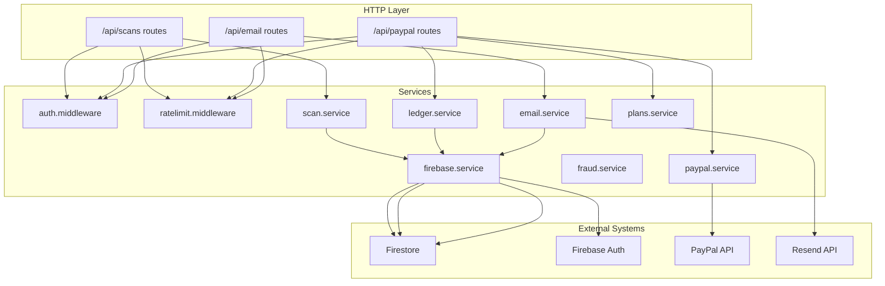
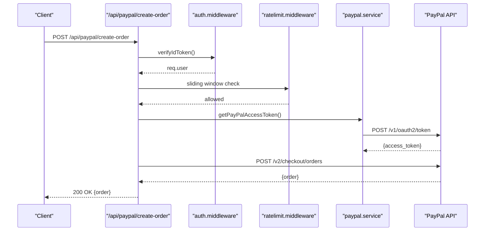
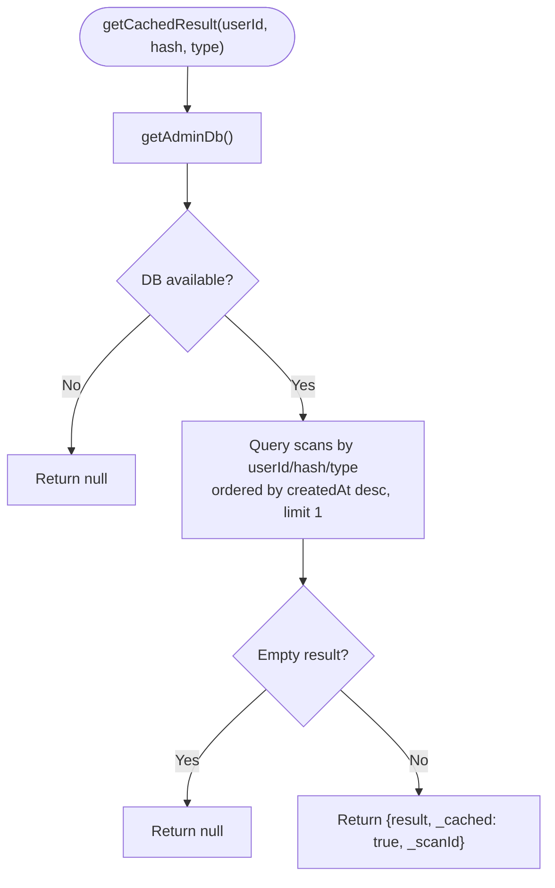
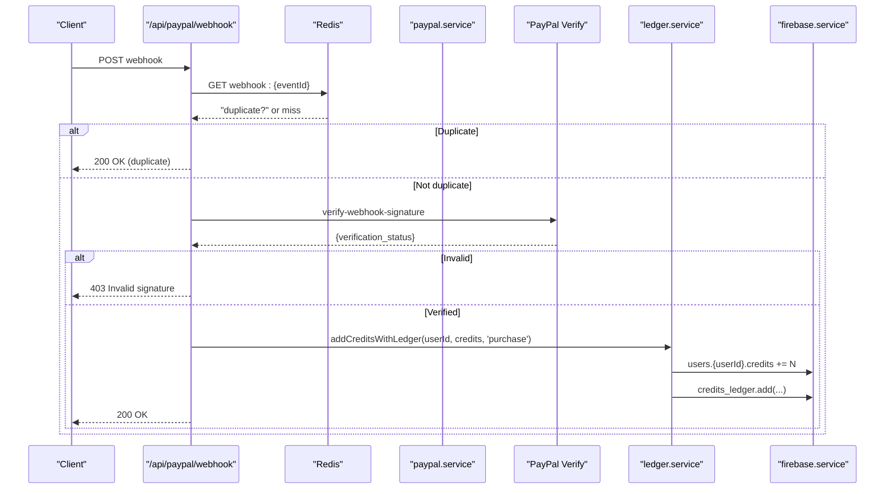
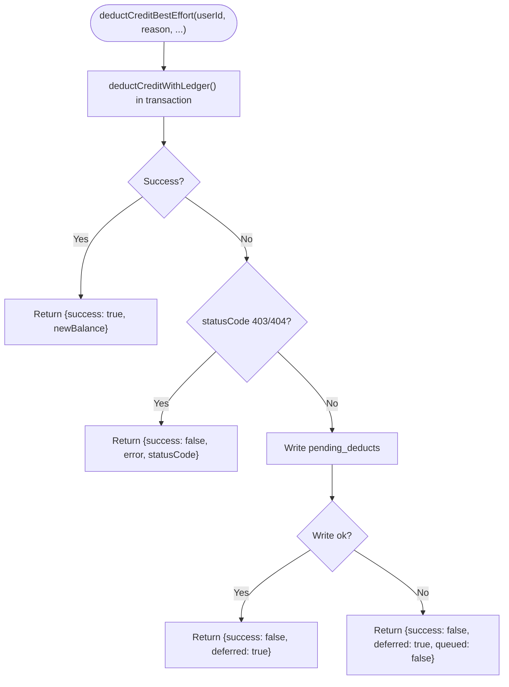
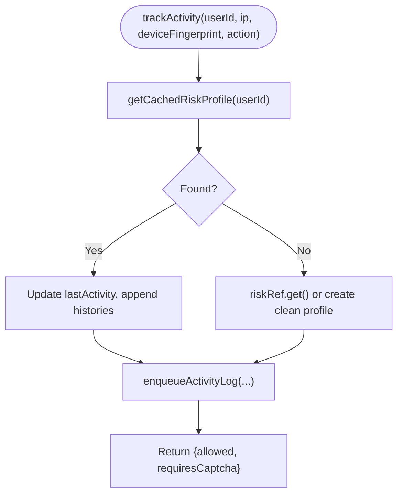
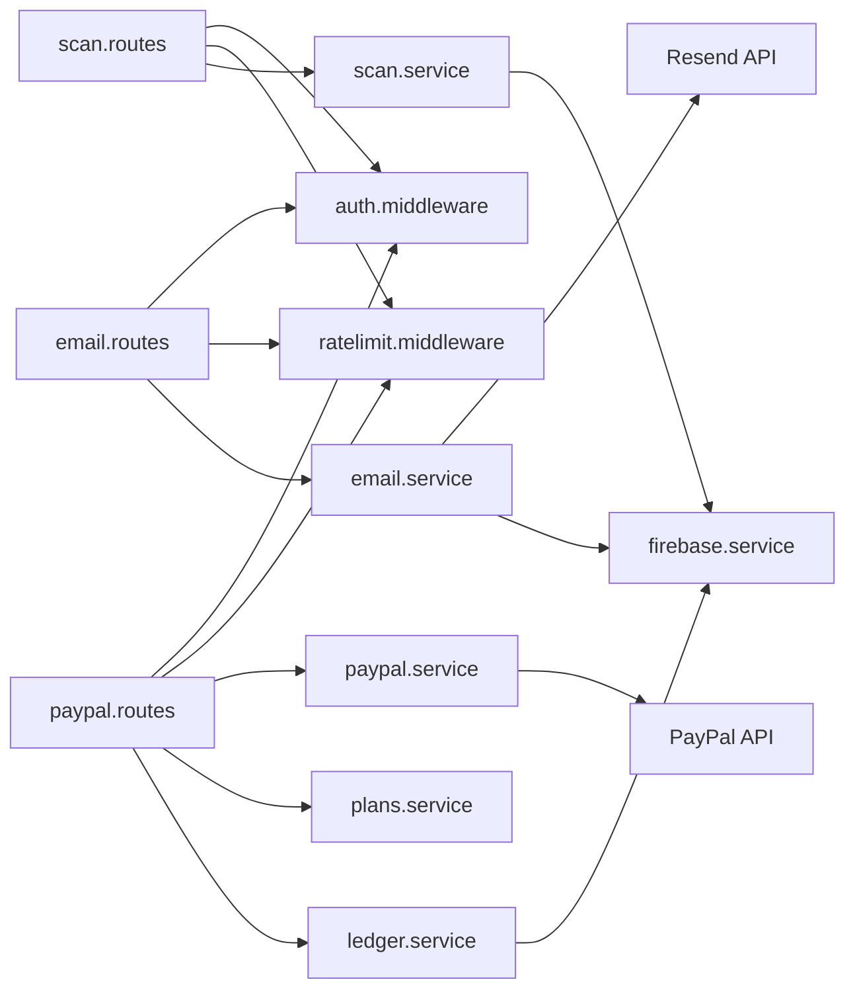

# Service Layer

<cite>
**Referenced Files in This Document**
- [scan.service.ts](file://backend/services/scan.service.ts)
- [paypal.service.ts](file://backend/services/paypal.service.ts)
- [email.service.ts](file://backend/services/email.service.ts)
- [ledger.service.ts](file://backend/services/ledger.service.ts)
- [firebase.service.ts](file://backend/services/firebase.service.ts)
- [fraud.service.ts](file://backend/services/fraud.service.ts)
- [plans.service.ts](file://backend/services/plans.service.ts)
- [scan.routes.ts](file://backend/routes/scan.routes.ts)
- [paypal.routes.ts](file://backend/routes/paypal.routes.ts)
- [email.routes.ts](file://backend/routes/email.routes.ts)
- [auth.middleware.ts](file://backend/middleware/auth.middleware.ts)
- [ratelimit.middleware.ts](file://backend/middleware/ratelimit.middleware.ts)
- [logger.ts](file://backend/utils/logger.ts)
- [app.ts](file://backend/app.ts)
- [index.ts](file://backend/index.ts)
</cite>

## Table of Contents
1. [Introduction](#introduction)
2. [Project Structure](#project-structure)
3. [Core Components](#core-components)
4. [Architecture Overview](#architecture-overview)
5. [Detailed Component Analysis](#detailed-component-analysis)
6. [Dependency Analysis](#dependency-analysis)
7. [Performance Considerations](#performance-considerations)
8. [Troubleshooting Guide](#troubleshooting-guide)
9. [Conclusion](#conclusion)
10. [Appendices](#appendices)

## Introduction
This document describes the service layer of FaceAnalytics Pro, focusing on business logic across core services: facial scan result storage and retrieval, payment processing via PayPal, email notifications, credit ledger management, and user data handling via Firebase. It explains service interfaces, dependency injection patterns, transaction management, error handling, retry and fallback strategies, orchestration patterns, data transformations, external API integrations, testing methodologies, performance optimizations, monitoring/logging, and distributed tracing.

## Project Structure
The backend is organized around modular services and route handlers. Services encapsulate business logic and integrate with Firebase Admin, PayPal APIs, and Resend. Route handlers coordinate authentication, rate limiting, validation, and service orchestration. Middleware enforces auth and rate limits. Logging utilities provide structured logs compatible with serverless environments.

**Diagram sources**
- [scan.routes.ts:1-63](file://backend/routes/scan.routes.ts#L1-L63)
- [paypal.routes.ts:1-302](file://backend/routes/paypal.routes.ts#L1-L302)
- [email.routes.ts:1-63](file://backend/routes/email.routes.ts#L1-L63)
- [auth.middleware.ts:1-40](file://backend/middleware/auth.middleware.ts#L1-L40)
- [ratelimit.middleware.ts:1-134](file://backend/middleware/ratelimit.middleware.ts#L1-L134)
- [scan.service.ts:1-134](file://backend/services/scan.service.ts#L1-L134)
- [paypal.service.ts:1-41](file://backend/services/paypal.service.ts#L1-L41)
- [email.service.ts:1-17](file://backend/services/email.service.ts#L1-L17)
- [ledger.service.ts:1-269](file://backend/services/ledger.service.ts#L1-L269)
- [firebase.service.ts:1-120](file://backend/services/firebase.service.ts#L1-L120)

**Section sources**
- [app.ts:1-205](file://backend/app.ts#L1-L205)
- [index.ts:1-29](file://backend/index.ts#L1-L29)

## Core Components
- Scan Management: Stores and retrieves facial analysis results, deduplicates by image hash, caches results, and provides paginated history.
- Payment Processing: Manages PayPal OAuth token caching, creates and captures orders, and processes webhooks with replay protection and signature verification.
- Email Notification: Sends receipts and onboarding emails via Resend with graceful fallback when API key is missing.
- Credit Ledger: Atomic credit deductions and additions with immutable ledger entries; best-effort reconciliation for transient failures.
- Fraud Detection: Device fingerprinting, risk profiles, activity logging, and preemptive blocking of high-risk expensive operations.
- Firebase Integration: Admin SDK initialization, Firestore/Auth accessors, and HTTP/1.1 settings for serverless stability.
- Plans Configuration: Centralized plan metadata used by payment flows.

**Section sources**
- [scan.service.ts:1-134](file://backend/services/scan.service.ts#L1-L134)
- [paypal.service.ts:1-41](file://backend/services/paypal.service.ts#L1-L41)
- [email.service.ts:1-17](file://backend/services/email.service.ts#L1-L17)
- [ledger.service.ts:1-269](file://backend/services/ledger.service.ts#L1-L269)
- [fraud.service.ts:1-634](file://backend/services/fraud.service.ts#L1-L634)
- [firebase.service.ts:1-120](file://backend/services/firebase.service.ts#L1-L120)
- [plans.service.ts:1-34](file://backend/services/plans.service.ts#L1-L34)

## Architecture Overview
The service layer follows a layered architecture:
- HTTP routes define endpoints and apply middleware.
- Services encapsulate business logic and manage external integrations.
- Firebase Admin SDK provides Firestore and Auth access.
- PayPal and Resend are integrated via service modules.
- Transactions and immutability are enforced for financial operations.

**Diagram sources**
- [paypal.routes.ts:25-76](file://backend/routes/paypal.routes.ts#L25-L76)
- [auth.middleware.ts:18-39](file://backend/middleware/auth.middleware.ts#L18-L39)
- [ratelimit.middleware.ts:25-92](file://backend/middleware/ratelimit.middleware.ts#L25-L92)
- [paypal.service.ts:12-40](file://backend/services/paypal.service.ts#L12-L40)

## Detailed Component Analysis

### Scan Management Service
Responsibilities:
- Hash images deterministically for deduplication.
- Cache results by user + image hash + scan type.
- Persist scan results with timestamps and derived scores.
- Retrieve paginated scan history with cursor pagination.

Interfaces and patterns:
- Pure functions for hashing and caching.
- Firestore access via Firebase Admin service.
- Server-side timestamps using FieldValue.

Error handling and fallback:
- Cache misses are logged and treated as non-fatal.
- Store and history fetch failures are caught and logged; callers receive null or empty arrays.

Data transformation:
- Extracts overall score from result payload for indexing.
- Normalizes createdAt to ISO string for clients.

**Diagram sources**
- [scan.service.ts:31-62](file://backend/services/scan.service.ts#L31-L62)

**Section sources**
- [scan.service.ts:1-134](file://backend/services/scan.service.ts#L1-L134)

### Payment Processing Service (PayPal)
Responsibilities:
- Manage PayPal OAuth token caching with expiry buffer.
- Create and capture PayPal orders.
- Verify webhook signatures and protect against replays.
- Enforce plan metadata parsing and validation.

Integration patterns:
- Fetch access token with Basic auth and form-encoded grant type.
- Use server-side order processing to guarantee credit updates.
- Replay protection via Redis keys with TTL.
- Signature verification endpoint call with provided headers.

Error handling and retries:
- Route handlers return sanitized errors; upstream failures are logged.
- Webhook verification failures return 403 in production.

**Diagram sources**
- [paypal.routes.ts:161-299](file://backend/routes/paypal.routes.ts#L161-L299)
- [paypal.service.ts:12-40](file://backend/services/paypal.service.ts#L12-L40)
- [ledger.service.ts:244-268](file://backend/services/ledger.service.ts#L244-L268)
- [firebase.service.ts:75-111](file://backend/services/firebase.service.ts#L75-L111)

**Section sources**
- [paypal.routes.ts:1-302](file://backend/routes/paypal.routes.ts#L1-L302)
- [paypal.service.ts:1-41](file://backend/services/paypal.service.ts#L1-L41)
- [plans.service.ts:1-34](file://backend/services/plans.service.ts#L1-L34)

### Email Notification Service (Resend)
Responsibilities:
- Provide a lazily initialized Resend client.
- Graceful fallback to a mock sender when API key is missing.

Patterns:
- Singleton-like lazy initialization guarded by environment checks.
- Mock behavior logs instead of sending.

**Section sources**
- [email.service.ts:1-17](file://backend/services/email.service.ts#L1-L17)
- [email.routes.ts:1-63](file://backend/routes/email.routes.ts#L1-L63)

### Credit Ledger Service
Responsibilities:
- Immutable audit trail for all credit changes.
- Atomic credit deduction with ledger entry in a Firestore transaction.
- Best-effort credit addition and refund recording.
- Deferred deduction queue for transient failures and dev-mode bypass.

Interfaces:
- Deduction outcomes include success, new balance, deferred, queued, and error details.
- Ledger reasons enumerate business events.

Transaction management:
- runTransaction ensures atomicity of balance update and ledger write.
- Non-transactional writes for ledger entries and refunds to avoid blocking.

Retry and fallback:
- Deduction attempts first perform a transactional deduction.
- On business errors (insufficient funds/user not found), propagate errors.
- On transient errors, write a pending_deducts document for later reconciliation.
- Dev mode allows free operation when Firestore quota is exceeded for specific dev emails.

**Diagram sources**
- [ledger.service.ts:189-240](file://backend/services/ledger.service.ts#L189-L240)

**Section sources**
- [ledger.service.ts:1-269](file://backend/services/ledger.service.ts#L1-L269)

### Fraud Detection Service
Responsibilities:
- Device fingerprint generation from headers and optional client-provided fingerprint.
- Risk profile caching with TTL and eviction.
- Activity tracking with batched logging to reduce Firestore writes.
- Signals raising and risk status computation.
- Preemptive blocking of expensive operations for high-risk users.

Patterns:
- In-memory cache for user_risk_profiles with TTL.
- Buffered batched writes for activity_log.
- Configurable thresholds via environment variables.

**Diagram sources**
- [fraud.service.ts:127-204](file://backend/services/fraud.service.ts#L127-L204)

**Section sources**
- [fraud.service.ts:1-634](file://backend/services/fraud.service.ts#L1-L634)

### Firebase Integration Service
Responsibilities:
- Initialize Firebase Admin App from environment variables or local files.
- Provide Firestore and Auth singletons with HTTP/1.1 settings for serverless.
- Fail fast in strict environments to avoid hanging Lambda timeouts.

Patterns:
- Prefer environment-based service account JSON with newline normalization.
- Fallback to local config files in development.
- Switch Firestore to REST to avoid gRPC cold start delays.

**Section sources**
- [firebase.service.ts:1-120](file://backend/services/firebase.service.ts#L1-L120)

### Authentication and Rate Limiting Middleware
- Authentication: Verifies Firebase ID tokens and attaches user info to the request.
- Rate Limiting: Sliding window with composite identifiers (userId or IP), with per-IP check for authenticated users; includes timeouts and failsafe open behavior.

**Section sources**
- [auth.middleware.ts:1-40](file://backend/middleware/auth.middleware.ts#L1-L40)
- [ratelimit.middleware.ts:1-134](file://backend/middleware/ratelimit.middleware.ts#L1-L134)

## Dependency Analysis
Service dependencies and coupling:
- Routes depend on middleware and services.
- Services depend on firebase.service for Firestore/Auth.
- PayPal and Resend services encapsulate external API concerns.
- Ledger service depends on Firestore transactions and immutable audit trails.
- Fraud service depends on Firestore and maintains in-memory caches and buffered writes.

**Diagram sources**
- [scan.routes.ts:1-63](file://backend/routes/scan.routes.ts#L1-L63)
- [paypal.routes.ts:1-302](file://backend/routes/paypal.routes.ts#L1-L302)
- [email.routes.ts:1-63](file://backend/routes/email.routes.ts#L1-L63)
- [auth.middleware.ts:1-40](file://backend/middleware/auth.middleware.ts#L1-L40)
- [ratelimit.middleware.ts:1-134](file://backend/middleware/ratelimit.middleware.ts#L1-L134)
- [scan.service.ts:1-134](file://backend/services/scan.service.ts#L1-L134)
- [paypal.service.ts:1-41](file://backend/services/paypal.service.ts#L1-L41)
- [email.service.ts:1-17](file://backend/services/email.service.ts#L1-L17)
- [ledger.service.ts:1-269](file://backend/services/ledger.service.ts#L1-L269)
- [firebase.service.ts:1-120](file://backend/services/firebase.service.ts#L1-L120)

**Section sources**
- [app.ts:15-201](file://backend/app.ts#L15-L201)

## Performance Considerations
- Firestore HTTP/1.1 preference for serverless cold starts.
- In-memory risk profile cache with TTL to reduce Firestore reads.
- Buffered batched writes for activity logs to minimize write volume.
- Lazy initialization of heavy modules to keep Lambda init fast.
- Sliding window rate limiting with timeouts and failsafe open behavior.
- Image hashing for deduplication reduces repeated AI work and storage.

[No sources needed since this section provides general guidance]

## Troubleshooting Guide
Common issues and remedies:
- Firebase Admin initialization failures in production due to malformed service account JSON or missing environment variables.
- PayPal webhook signature verification failing in production due to missing webhook ID or network errors.
- Ledger transaction failures leading to deferred deductions; monitor pending_deducts queue.
- Rate limit checks timing out; middleware allows request to proceed as failsafe.
- Email sending disabled due to missing API key; verify environment configuration.

**Section sources**
- [firebase.service.ts:31-48](file://backend/services/firebase.service.ts#L31-L48)
- [paypal.routes.ts:182-221](file://backend/routes/paypal.routes.ts#L182-L221)
- [ledger.service.ts:211-238](file://backend/services/ledger.service.ts#L211-L238)
- [ratelimit.middleware.ts:86-90](file://backend/middleware/ratelimit.middleware.ts#L86-L90)
- [email.service.ts:7-12](file://backend/services/email.service.ts#L7-L12)

## Conclusion
The service layer of FaceAnalytics Pro is designed for reliability and scalability in a serverless environment. It leverages Firestore transactions for financial integrity, PayPal’s official APIs with signature verification and replay protection, and Resend for email delivery. Fraud detection and rate limiting guard resources, while caching and batching optimize performance. Clear separation of concerns and robust error handling enable maintainable operations.

[No sources needed since this section summarizes without analyzing specific files]

## Appendices

### Service Orchestration Patterns
- PayPal order creation and capture: server-side verification and credit updates ensure correctness.
- Webhook processing: signature verification, replay protection, and idempotent credit updates.
- Scan persistence: hashing, caching, and paginated history retrieval.
- Email delivery: authenticated sender with graceful fallback.

**Section sources**
- [paypal.routes.ts:25-159](file://backend/routes/paypal.routes.ts#L25-L159)
- [scan.routes.ts:22-60](file://backend/routes/scan.routes.ts#L22-L60)
- [email.routes.ts:18-60](file://backend/routes/email.routes.ts#L18-L60)

### Monitoring, Logging, and Distributed Tracing
- Console-based logging in serverless; optional pino upgrade in development.
- Request IDs attached to requests and responses for correlation.
- Structured logs for errors and warnings; sensitive fields redacted in development.
- Recommendations: attach request IDs to external API calls, instrument PayPal and Resend calls, and add spans for Firestore transactions.

**Section sources**
- [logger.ts:1-71](file://backend/utils/logger.ts#L1-L71)
- [app.ts:68-88](file://backend/app.ts#L68-L88)