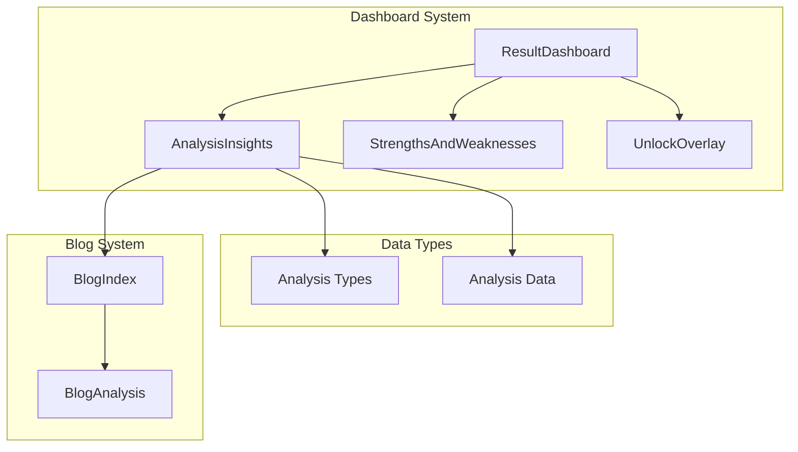
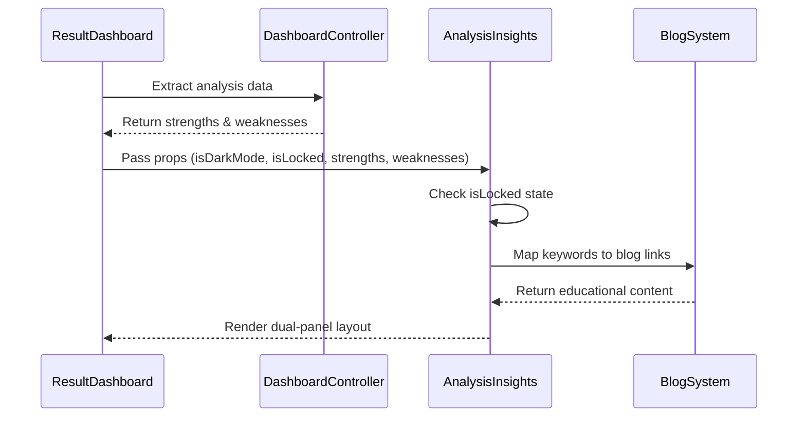
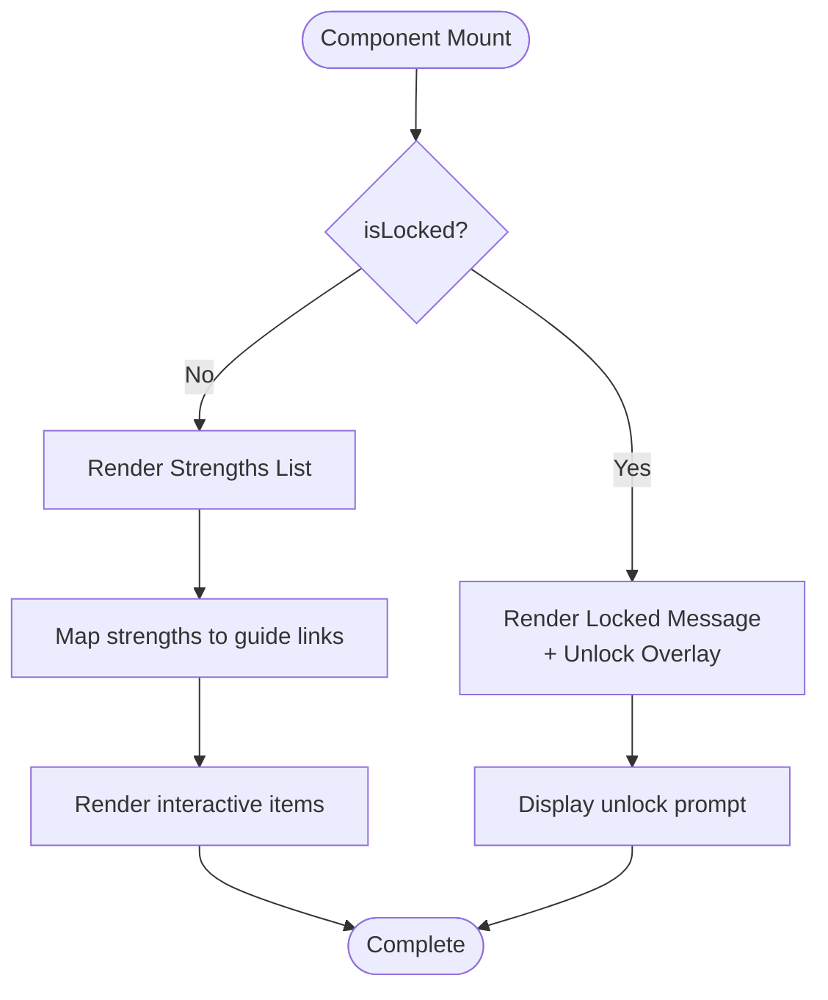
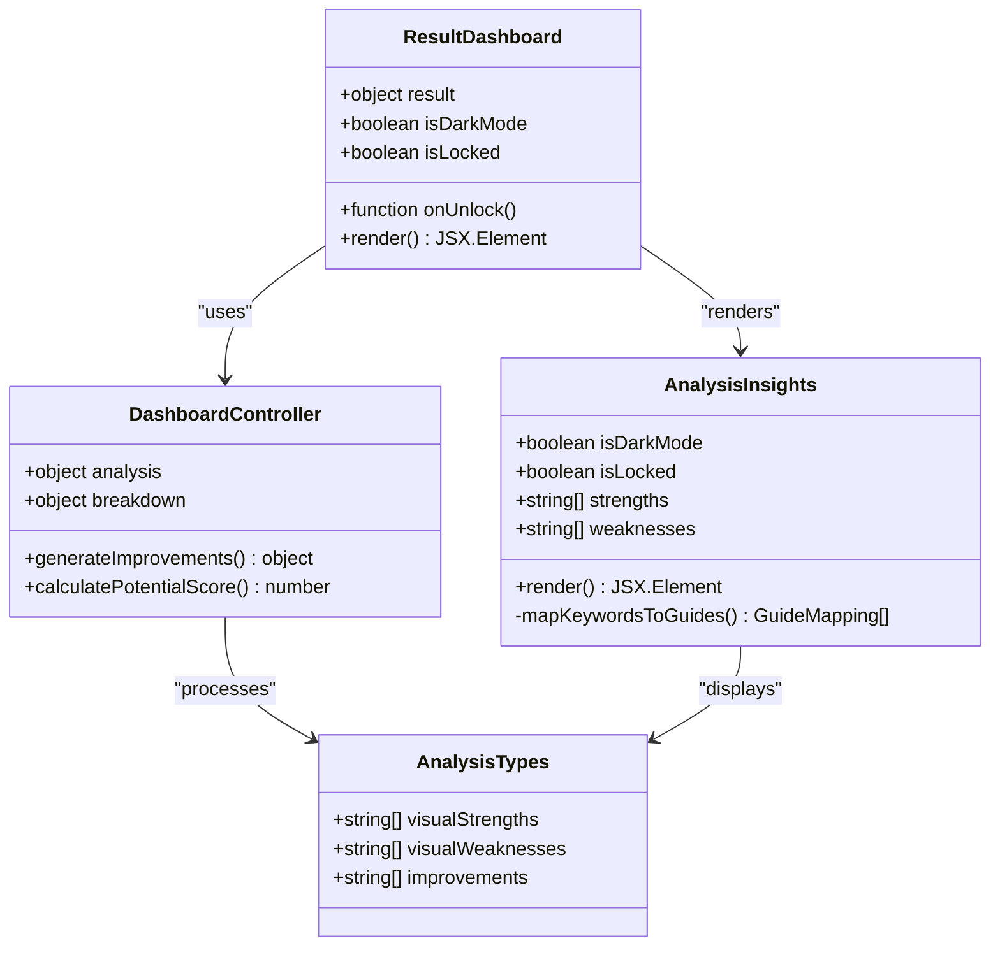
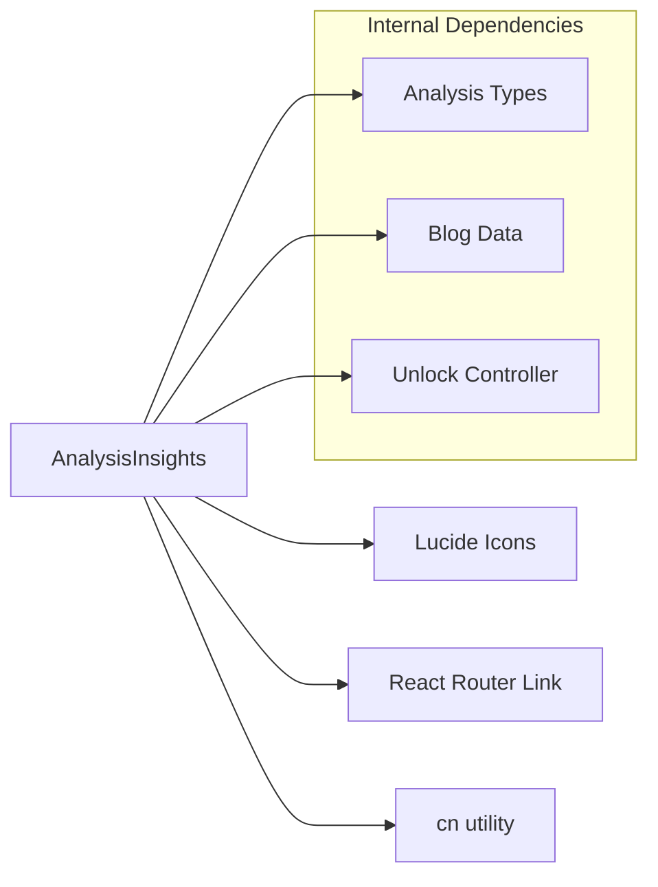

# Analysis Insights Component

<cite>
**Referenced Files in This Document**
- [AnalysisInsights.tsx](file://src/components/dashboard/AnalysisInsights.tsx)
- [analysis.ts](file://src/types/analysis.ts)
- [ResultDashboard.tsx](file://src/components/ResultDashboard.tsx)
- [UnlockOverlay.tsx](file://src/components/dashboard/UnlockOverlay.tsx)
- [useDashboardController.ts](file://src/features/dashboard/useDashboardController.ts)
- [BlogIndexPage.tsx](file://src/pages/BlogIndexPage.tsx)
- [BlogAnalysisPage.tsx](file://src/pages/BlogAnalysisPage.tsx)
- [index.css](file://src/index.css)
</cite>

## Table of Contents
1. [Introduction](#introduction)
2. [Project Structure](#project-structure)
3. [Core Components](#core-components)
4. [Architecture Overview](#architecture-overview)
5. [Detailed Component Analysis](#detailed-component-analysis)
6. [Dependency Analysis](#dependency-analysis)
7. [Performance Considerations](#performance-considerations)
8. [Troubleshooting Guide](#troubleshooting-guide)
9. [Conclusion](#conclusion)

## Introduction
AnalysisInsights is a dashboard component that presents key findings from facial analysis in a dual-panel layout. It displays strengths and weaknesses with gradient backgrounds, interactive elements, and conditional rendering for locked/unlocked states. The component integrates with the broader dashboard system and provides educational resources through keyword-based guide mapping to blog content.

## Project Structure
The AnalysisInsights component is part of the dashboard system and works alongside related components:

**Diagram sources**
- [ResultDashboard.tsx:315-327](file://src/components/ResultDashboard.tsx#L315-L327)
- [AnalysisInsights.tsx:6-11](file://src/components/dashboard/AnalysisInsights.tsx#L6-L11)
- [analysis.ts:89-92](file://src/types/analysis.ts#L89-L92)

**Section sources**
- [AnalysisInsights.tsx:1-239](file://src/components/dashboard/AnalysisInsights.tsx#L1-L239)
- [ResultDashboard.tsx:315-327](file://src/components/ResultDashboard.tsx#L315-L327)

## Core Components
AnalysisInsights is a React functional component with the following props interface:

### Props Interface
- `isDarkMode: boolean` - Controls theme-based styling
- `isLocked: boolean` - Determines content visibility state
- `strengths: string[]` - Array of positive attributes
- `weaknesses: string[]` - Array of improvement areas

### Data Structure
The component expects arrays of strings representing analysis insights. Each string corresponds to a specific finding from the facial analysis pipeline.

**Section sources**
- [AnalysisInsights.tsx:6-11](file://src/components/dashboard/AnalysisInsights.tsx#L6-L11)
- [analysis.ts:89-92](file://src/types/analysis.ts#L89-L92)

## Architecture Overview
The AnalysisInsights component integrates with the dashboard ecosystem through a structured data flow:

**Diagram sources**
- [ResultDashboard.tsx:347-357](file://src/components/ResultDashboard.tsx#L347-L357)
- [useDashboardController.ts:4-13](file://src/features/dashboard/useDashboardController.ts#L4-L13)
- [AnalysisInsights.tsx:13-19](file://src/components/dashboard/AnalysisInsights.tsx#L13-L19)

## Detailed Component Analysis

### Dual-Panel Layout Structure
The component renders two distinct panels side-by-side with gradient backgrounds:

#### Strengths Panel (Left)
- **Visual Design**: Emerald gradient background with green accents
- **Header Elements**: CheckCircle2 icon, "Key Strengths" title, count display
- **Interactive Features**: Hover animations with subtle lift effect
- **Content Format**: List items with animated indicators

#### Weaknesses Panel (Right)
- **Visual Design**: Rose gradient background with rose accents  
- **Header Elements**: AlertCircle icon, "Areas for Improvement" title, count display
- **Interactive Features**: Hover animations with upward movement
- **Content Format**: List items with solid indicators

### Conditional Rendering Logic
The component implements sophisticated conditional rendering based on the `isLocked` prop:

**Diagram sources**
- [AnalysisInsights.tsx:87-98](file://src/components/dashboard/AnalysisInsights.tsx#L87-L98)
- [AnalysisInsights.tsx:177-188](file://src/components/dashboard/AnalysisInsights.tsx#L177-L188)

### Keyword-Based Guide Mapping System
The component includes a keyword-to-blog mapping system that connects insights to educational content:

| Keyword | Blog Path | Purpose |
|---------|-----------|---------|
| Canthal Tilt | `/blog/what-is-canthal-tilt` | Eye angle education |
| Jawline | `/blog/how-to-fix-recessed-jawline` | Jawline improvement guide |
| Symmetry | `/blog/how-to-improve-face-symmetry` | Facial balance tips |
| Skin | `/blog/does-gua-sha-work` | Skincare and massage |
| Mewing | `/blog/complete-mewing-guide` | Tongue posture guide |

### Animation Effects
The component implements several animation patterns:

#### Hover Effects
- **Duration**: 300ms transition timing
- **Transform**: Subtle upward movement (-0.5px)
- **Shadow Enhancement**: Increased shadow depth on hover
- **Background Intensification**: Light background brightening

#### Pulse Animations
- **Indicator Dots**: Continuous pulse animation for visual emphasis
- **Gradient Backgrounds**: Subtle gradient shifting for dynamic feel

#### Responsive Design Patterns
- **Mobile First**: Single column layout on small screens
- **Tablet Adaptation**: Two-column layout on medium screens
- **Desktop Optimization**: Equal-width panels with enhanced spacing
- **Flexible Typography**: Responsive font sizing (sm → base → lg)

**Section sources**
- [AnalysisInsights.tsx:108-112](file://src/components/dashboard/AnalysisInsights.tsx#L108-L112)
- [AnalysisInsights.tsx:198-202](file://src/components/dashboard/AnalysisInsights.tsx#L198-L202)
- [index.css:434-468](file://src/index.css#L434-L468)

### Integration with Dashboard System
The component participates in the broader dashboard architecture:

**Diagram sources**
- [ResultDashboard.tsx:315-327](file://src/components/ResultDashboard.tsx#L315-L327)
- [useDashboardController.ts:4-13](file://src/features/dashboard/useDashboardController.ts#L4-L13)
- [analysis.ts:43-45](file://src/types/analysis.ts#L43-L45)

**Section sources**
- [ResultDashboard.tsx:347-357](file://src/components/ResultDashboard.tsx#L347-L357)
- [useDashboardController.ts:37-40](file://src/features/dashboard/useDashboardController.ts#L37-L40)

## Dependency Analysis
The component has minimal external dependencies and maintains clean separation of concerns:

**Diagram sources**
- [AnalysisInsights.tsx:1-5](file://src/components/dashboard/AnalysisInsights.tsx#L1-L5)

### External Dependencies
- **Lucide Icons**: CheckCircle2 and AlertCircle for visual indicators
- **React Router**: Link component for navigation
- **cn Utility**: Conditional class name concatenation

### Internal Dependencies
- **Analysis Types**: Strongly typed data structures
- **Blog Mapping**: Keyword-to-content relationship
- **Theme Provider**: Dark/light mode support

**Section sources**
- [AnalysisInsights.tsx:1-5](file://src/components/dashboard/AnalysisInsights.tsx#L1-L5)
- [analysis.ts:89-92](file://src/types/analysis.ts#L89-L92)

## Performance Considerations
The component is optimized for performance through several mechanisms:

### Rendering Efficiency
- **Conditional Rendering**: Only renders unlock prompts when locked
- **Minimal DOM**: Uses efficient grid layouts with proper semantic markup
- **CSS Animations**: Leverages hardware-accelerated CSS transforms

### Memory Management
- **No Local State**: Stateless component reduces memory footprint
- **Pure Functions**: Predictable rendering without side effects
- **Efficient Lists**: Simple array mapping without complex state updates

### Accessibility
- **Semantic HTML**: Proper heading hierarchy and list structures
- **Color Contrast**: Sufficient contrast ratios for readability
- **Keyboard Navigation**: Interactive elements support keyboard access

## Troubleshooting Guide

### Common Issues and Solutions

#### Locked State Not Working
**Problem**: Content doesn't lock properly
**Solution**: Verify `isLocked` prop is passed correctly from parent component

#### Missing Educational Links
**Problem**: Guide buttons don't appear
**Solution**: Ensure keyword matches in strength/weakness strings align with KEYWORD_GUIDE_MAP entries

#### Styling Issues
**Problem**: Incorrect theming or layout
**Solution**: Check `isDarkMode` prop and ensure proper CSS class application

#### Responsive Behavior
**Problem**: Panels don't stack on mobile
**Solution**: Verify grid classes and responsive breakpoints are correctly applied

**Section sources**
- [AnalysisInsights.tsx:87-98](file://src/components/dashboard/AnalysisInsights.tsx#L87-L98)
- [AnalysisInsights.tsx:177-188](file://src/components/dashboard/AnalysisInsights.tsx#L177-L188)

## Conclusion
AnalysisInsights provides an elegant solution for presenting facial analysis findings through a dual-panel design that effectively communicates both positive attributes and improvement opportunities. The component's thoughtful integration of conditional rendering, interactive elements, and educational content creates a comprehensive user experience that enhances the overall dashboard functionality.

The component demonstrates strong architectural principles through its clean separation of concerns, efficient rendering patterns, and seamless integration with the broader system. Its keyword-based guide mapping system provides valuable educational resources while maintaining visual consistency and performance standards.