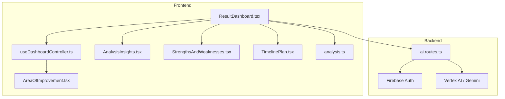
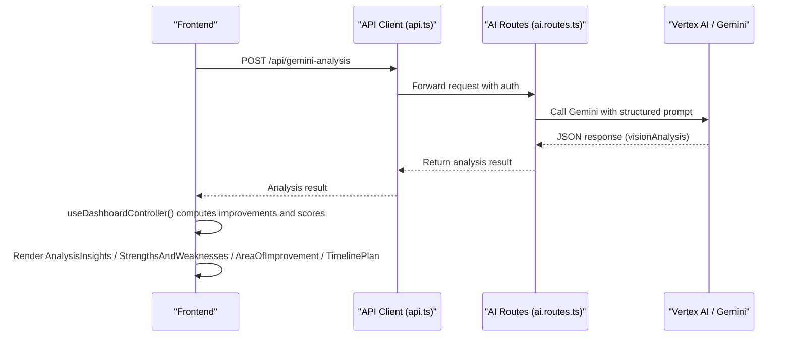
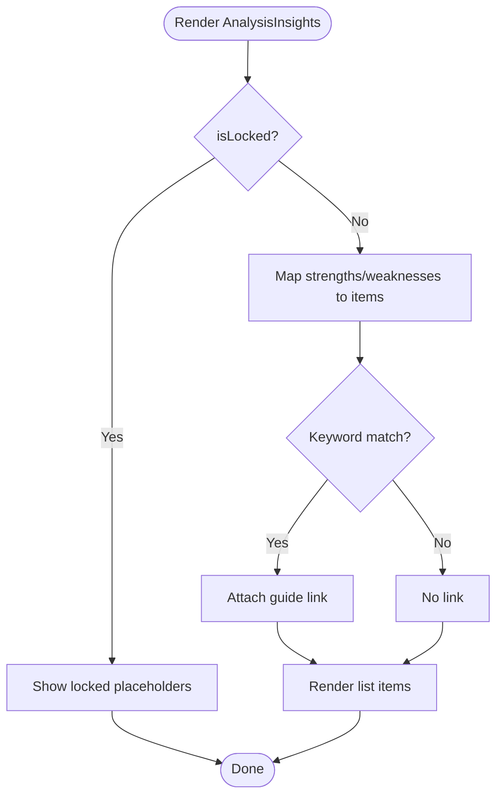
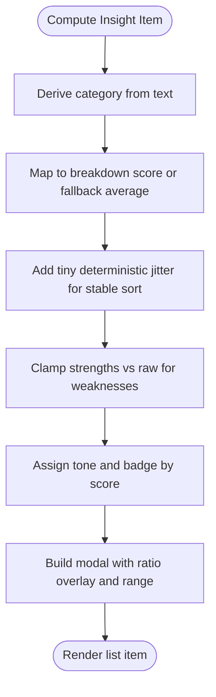
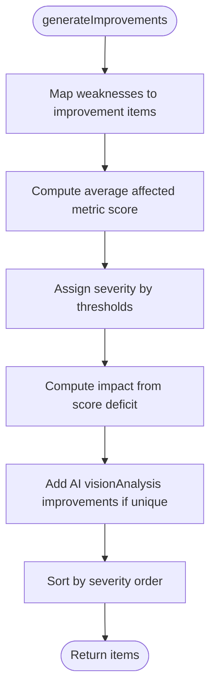
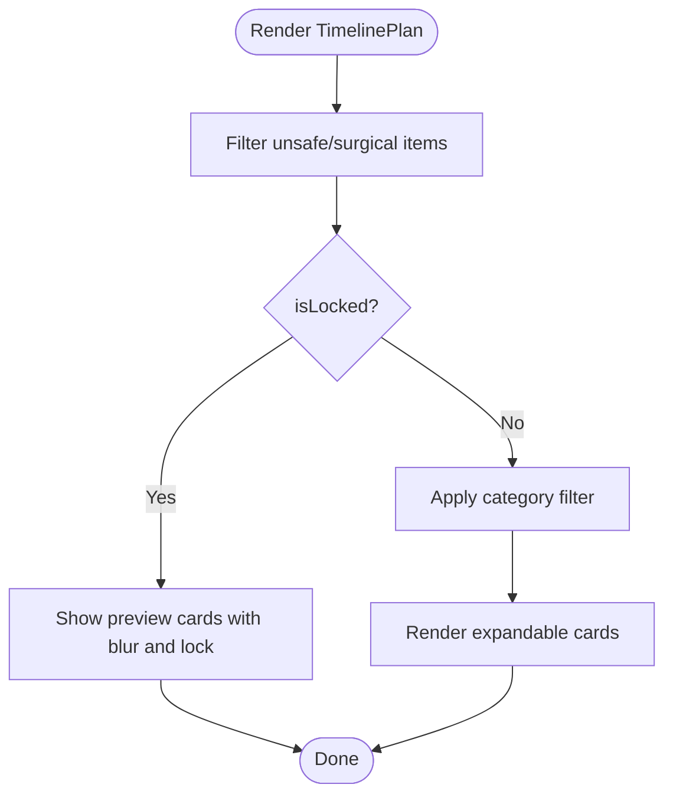
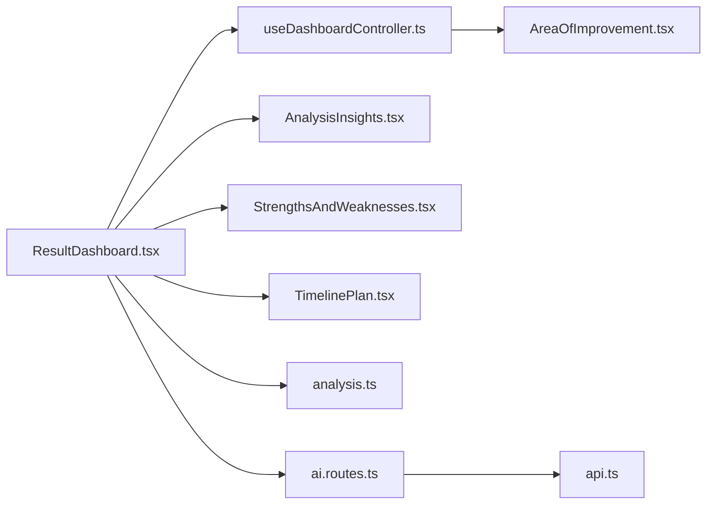

# Analytics and Insights

<cite>
**Referenced Files in This Document**
- [AnalysisInsights.tsx](file://src/components/dashboard/AnalysisInsights.tsx)
- [StrengthsAndWeaknesses.tsx](file://src/components/dashboard/StrengthsAndWeaknesses.tsx)
- [AreaOfImprovement.tsx](file://src/components/AreaOfImprovement.tsx)
- [TimelinePlan.tsx](file://src/components/dashboard/TimelinePlan.tsx)
- [analysis.ts](file://src/types/analysis.ts)
- [useDashboardController.ts](file://src/features/dashboard/useDashboardController.ts)
- [ResultDashboard.tsx](file://src/components/ResultDashboard.tsx)
- [ai.routes.ts](file://backend/routes/ai.routes.ts)
- [api.ts](file://src/lib/api.ts)
</cite>

## Table of Contents
1. [Introduction](#introduction)
2. [Project Structure](#project-structure)
3. [Core Components](#core-components)
4. [Architecture Overview](#architecture-overview)
5. [Detailed Component Analysis](#detailed-component-analysis)
6. [Dependency Analysis](#dependency-analysis)
7. [Performance Considerations](#performance-considerations)
8. [Troubleshooting Guide](#troubleshooting-guide)
9. [Conclusion](#conclusion)

## Introduction
This document explains the analytics and insights generation system that transforms raw facial analysis results into actionable insights and personalized improvement plans. It documents:
- AnalysisInsights: presents a high-level summary of strengths and weaknesses with contextual links.
- StrengthsAndWeaknesses: provides categorized, scored insights with animated ratio overlays and detailed modals.
- AreaOfImprovement: generates structured, severity-ranked improvement suggestions with impact estimates.
- TimelinePlan: builds a practical, tiered action plan with difficulty, timeframe, and cost guidance.
It also describes the data transformation pipeline from AI analysis results to UI-ready insights, the integration with backend AI services, and how user preferences and unlock states influence presentation.

## Project Structure
The analytics and insights system spans frontend components and backend AI services:
- Frontend dashboard orchestrates components and state via a controller hook.
- AI services in the backend produce structured analysis results consumed by the frontend.
- Types define contracts for analysis data, breakdown scores, and AI outputs.

**Diagram sources**
- [ResultDashboard.tsx:315-1306](file://src/components/ResultDashboard.tsx#L315-L1306)
- [useDashboardController.ts:1-101](file://src/features/dashboard/useDashboardController.ts#L1-L101)
- [AnalysisInsights.tsx:1-239](file://src/components/dashboard/AnalysisInsights.tsx#L1-L239)
- [StrengthsAndWeaknesses.tsx:1-1135](file://src/components/dashboard/StrengthsAndWeaknesses.tsx#L1-L1135)
- [AreaOfImprovement.tsx:1-629](file://src/components/AreaOfImprovement.tsx#L1-L629)
- [TimelinePlan.tsx:1-698](file://src/components/dashboard/TimelinePlan.tsx#L1-L698)
- [analysis.ts:1-143](file://src/types/analysis.ts#L1-L143)
- [ai.routes.ts:271-516](file://backend/routes/ai.routes.ts#L271-L516)
- [api.ts:1-36](file://src/lib/api.ts#L1-L36)

**Section sources**
- [ResultDashboard.tsx:315-1306](file://src/components/ResultDashboard.tsx#L315-L1306)
- [useDashboardController.ts:1-101](file://src/features/dashboard/useDashboardController.ts#L1-L101)
- [analysis.ts:1-143](file://src/types/analysis.ts#L1-L143)

## Core Components
- AnalysisInsights: renders a two-column summary of “Key Strengths” and “Areas for Improvement,” linking keywords to educational resources.
- StrengthsAndWeaknesses: displays categorized insights with scores, tones, and detailed modals that overlay animated ratio lines on the face image.
- AreaOfImprovement: converts weaknesses into structured improvement items with severity, impact, affected metrics, and recommended actions.
- TimelinePlan: presents a prioritized, filterable action plan with category badges, difficulty indicators, and safety filtering to avoid unsafe or invasive suggestions.

**Section sources**
- [AnalysisInsights.tsx:21-239](file://src/components/dashboard/AnalysisInsights.tsx#L21-L239)
- [StrengthsAndWeaknesses.tsx:1-1135](file://src/components/dashboard/StrengthsAndWeaknesses.tsx#L1-L1135)
- [AreaOfImprovement.tsx:1-629](file://src/components/AreaOfImprovement.tsx#L1-L629)
- [TimelinePlan.tsx:1-698](file://src/components/dashboard/TimelinePlan.tsx#L1-L698)

## Architecture Overview
The system follows a data-driven pipeline:
- Backend AI endpoints produce structured analysis results (vision analysis, strengths/weaknesses, improvement plan).
- Frontend composes these results into UI components.
- A controller memoizes derived insights and computed scores.
- Components render locked/unlocked views based on user state.

**Diagram sources**
- [api.ts:1-36](file://src/lib/api.ts#L1-L36)
- [ai.routes.ts:271-516](file://backend/routes/ai.routes.ts#L271-L516)
- [useDashboardController.ts:37-40](file://src/features/dashboard/useDashboardController.ts#L37-L40)
- [ResultDashboard.tsx:347-358](file://src/components/ResultDashboard.tsx#L347-L358)

## Detailed Component Analysis

### AnalysisInsights Component
Purpose:
- Present a concise, high-level summary of key findings from facial analysis.
- Provide quick navigation to related educational content.

Key behaviors:
- Accepts strengths and weaknesses arrays and dark mode/lock state.
- Uses a keyword-to-guide mapping to attach contextual links for topics like symmetry, jawline, skin, and canthal tilt.
- Shows placeholder content when locked.

**Diagram sources**
- [AnalysisInsights.tsx:13-19](file://src/components/dashboard/AnalysisInsights.tsx#L13-L19)
- [AnalysisInsights.tsx:87-141](file://src/components/dashboard/AnalysisInsights.tsx#L87-L141)
- [AnalysisInsights.tsx:177-231](file://src/components/dashboard/AnalysisInsights.tsx#L177-L231)

**Section sources**
- [AnalysisInsights.tsx:21-239](file://src/components/dashboard/AnalysisInsights.tsx#L21-L239)

### StrengthsAndWeaknesses Component
Purpose:
- Deliver detailed, categorized insights with quantified scores and animated ratio overlays.

Key behaviors:
- Computes category from insight text and derives a score from breakdown metrics.
- Assigns a tone (KEY STRENGTH, MINOR NOTE, NEEDS REFINEMENT, HIGH PRIORITY) based on score.
- Generates detailed modals with animated ratio lines and ideal-range markers.
- Supports filtering by category and expanding items for details.

**Diagram sources**
- [StrengthsAndWeaknesses.tsx:39-95](file://src/components/dashboard/StrengthsAndWeaknesses.tsx#L39-L95)
- [StrengthsAndWeaknesses.tsx:365-401](file://src/components/dashboard/StrengthsAndWeaknesses.tsx#L365-L401)
- [StrengthsAndWeaknesses.tsx:403-716](file://src/components/dashboard/StrengthsAndWeaknesses.tsx#L403-L716)

**Section sources**
- [StrengthsAndWeaknesses.tsx:1-1135](file://src/components/dashboard/StrengthsAndWeaknesses.tsx#L1-L1135)

### AreaOfImprovement System
Purpose:
- Convert weaknesses into structured, severity-ranked improvement suggestions with impact estimates.

Key behaviors:
- Maps weaknesses to predefined categories and actions.
- Determines severity based on average affected metric scores.
- Computes impact as a numeric delta derived from score deficits.
- Adds AI-generated improvements when not already covered.
- Sorts by severity order.

**Diagram sources**
- [AreaOfImprovement.tsx:492-628](file://src/components/AreaOfImprovement.tsx#L492-L628)
- [AreaOfImprovement.tsx:500-600](file://src/components/AreaOfImprovement.tsx#L500-L600)

**Section sources**
- [AreaOfImprovement.tsx:1-629](file://src/components/AreaOfImprovement.tsx#L1-L629)

### TimelinePlan Component
Purpose:
- Present a practical, tiered action plan with difficulty, timeframe, and cost.

Key behaviors:
- Filters out surgical or unsafe items using a clinical overreach pattern.
- Provides category summaries and filter tabs.
- Renders expandable cards with stats and target areas.
- Shows a preview when locked and an unlock affordance.

**Diagram sources**
- [TimelinePlan.tsx:41-53](file://src/components/dashboard/TimelinePlan.tsx#L41-L53)
- [TimelinePlan.tsx:418-698](file://src/components/dashboard/TimelinePlan.tsx#L418-L698)

**Section sources**
- [TimelinePlan.tsx:1-698](file://src/components/dashboard/TimelinePlan.tsx#L1-L698)

## Dependency Analysis
- Controller dependency: The dashboard controller memoizes improvement data and computed scores from analysis and breakdown inputs.
- Component orchestration: ResultDashboard composes AnalysisInsights, StrengthsAndWeaknesses, AreaOfImprovement, and TimelinePlan, passing props and state.
- Backend integration: AI routes produce structured results consumed by the frontend; the API client attaches auth and CAPTCHA tokens.

**Diagram sources**
- [useDashboardController.ts:37-40](file://src/features/dashboard/useDashboardController.ts#L37-L40)
- [ResultDashboard.tsx:1144-1298](file://src/components/ResultDashboard.tsx#L1144-L1298)
- [AreaOfImprovement.tsx:492-628](file://src/components/AreaOfImprovement.tsx#L492-L628)
- [AnalysisInsights.tsx:21-239](file://src/components/dashboard/AnalysisInsights.tsx#L21-L239)
- [StrengthsAndWeaknesses.tsx:1-1135](file://src/components/dashboard/StrengthsAndWeaknesses.tsx#L1-L1135)
- [TimelinePlan.tsx:1-698](file://src/components/dashboard/TimelinePlan.tsx#L1-L698)
- [analysis.ts:1-143](file://src/types/analysis.ts#L1-L143)
- [ai.routes.ts:271-516](file://backend/routes/ai.routes.ts#L271-L516)
- [api.ts:1-36](file://src/lib/api.ts#L1-L36)

**Section sources**
- [useDashboardController.ts:1-101](file://src/features/dashboard/useDashboardController.ts#L1-L101)
- [ResultDashboard.tsx:315-1306](file://src/components/ResultDashboard.tsx#L315-L1306)
- [analysis.ts:1-143](file://src/types/analysis.ts#L1-L143)

## Performance Considerations
- Memoization: The controller memoizes improvement data and computed scores to avoid recomputation on re-renders.
- Conditional rendering: Components adapt to locked state and viewport visibility to minimize heavy animations.
- Backend timeouts: AI requests are bounded to prevent long-running operations; retries are applied for transient failures.
- Image compression: Backend compresses images before AI analysis to reduce latency and cost.

[No sources needed since this section provides general guidance]

## Troubleshooting Guide
Common issues and remedies:
- AI parsing failures: Backend strips markdown and extracts JSON; if parsing fails, the response includes a preview for debugging.
- Insufficient credits: Endpoints enforce a soft credit check and rate limits; failures surface clear error messages.
- Safety filtering: TimelinePlan excludes potentially unsafe or invasive items; verify that desired items are not marked as surgical.
- Locked state: Components render placeholders and blurred content; ensure unlock flow is triggered.

**Section sources**
- [ai.routes.ts:444-472](file://backend/routes/ai.routes.ts#L444-L472)
- [ai.routes.ts:508-515](file://backend/routes/ai.routes.ts#L508-L515)
- [TimelinePlan.tsx:41-53](file://src/components/dashboard/TimelinePlan.tsx#L41-L53)

## Conclusion
The analytics and insights system integrates backend AI analysis with frontend components to deliver a layered, actionable user experience. By transforming raw analysis results into categorized insights, severity-ranked improvements, and a practical timeline, it empowers users to understand their results and pursue meaningful enhancements. The design emphasizes safety, clarity, and personalization, with robust backend safeguards and frontend memoization for performance.