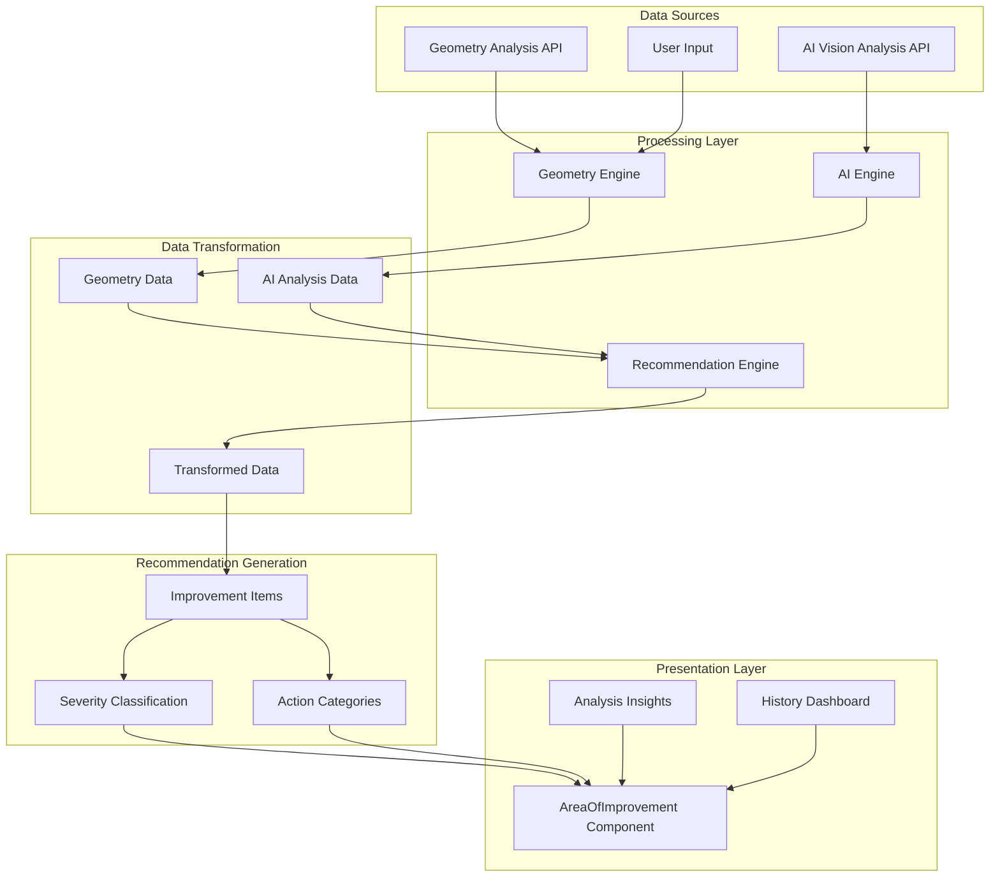
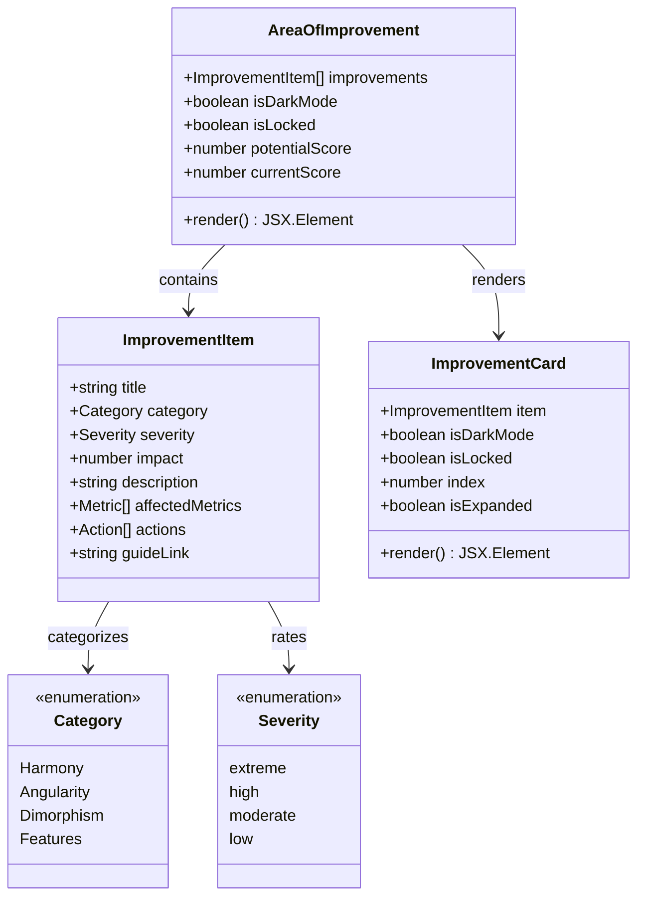
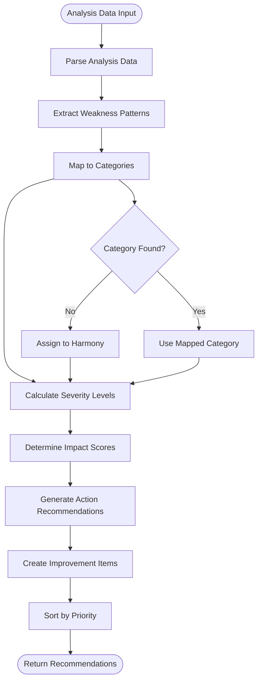
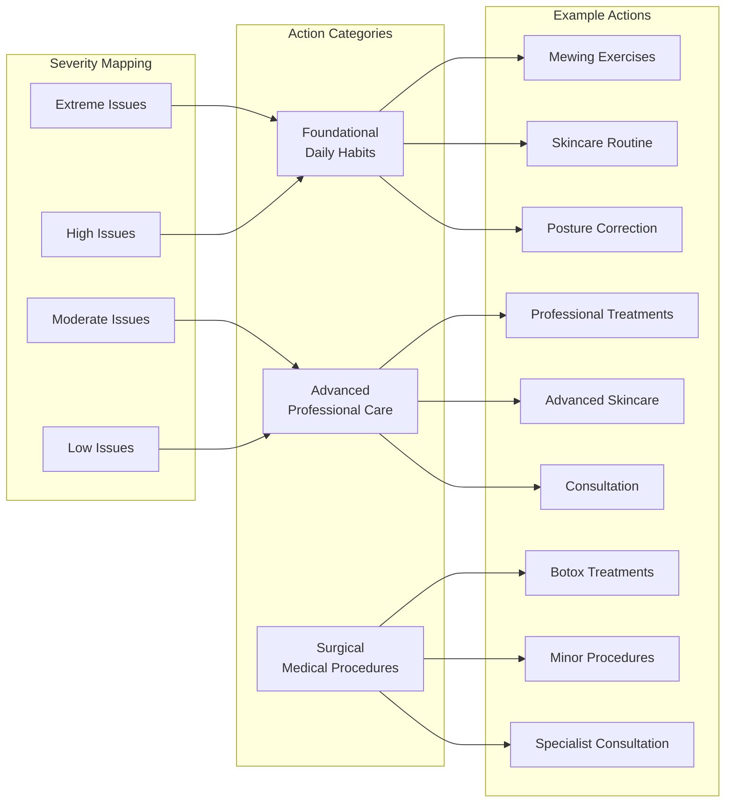
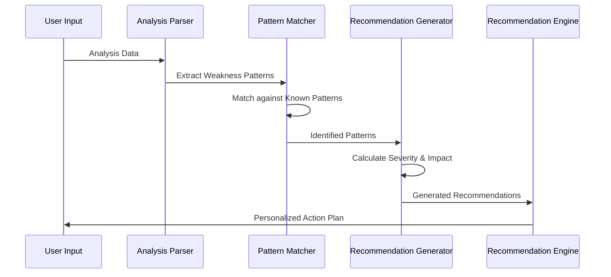
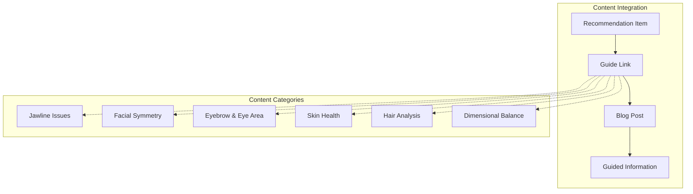
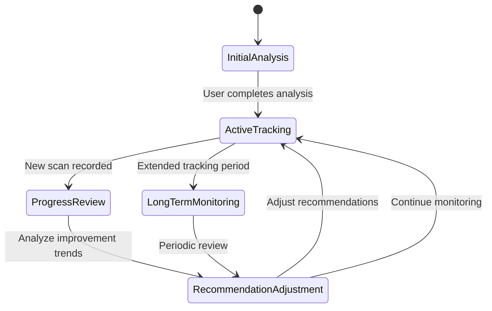

# Area of Improvement System

<cite>
**Referenced Files in This Document**
- [AreaOfImprovement.tsx](file://src/components/AreaOfImprovement.tsx)
- [useDashboardController.ts](file://src/features/dashboard/useDashboardController.ts)
- [AnalysisInsights.tsx](file://src/components/dashboard/AnalysisInsights.tsx)
- [geometry.routes.ts](file://backend/routes/geometry.routes.ts)
- [ai.routes.ts](file://backend/routes/ai.routes.ts)
- [analysis.ts](file://src/types/analysis.ts)
- [ResultDashboard.tsx](file://src/components/ResultDashboard.tsx)
- [History.tsx](file://src/components/History.tsx)
- [scan.service.ts](file://backend/services/scan.service.ts)
</cite>

## Table of Contents
1. [Introduction](#introduction)
2. [System Architecture](#system-architecture)
3. [Core Components](#core-components)
4. [Recommendation Engine](#recommendation-engine)
5. [Algorithmic Approach](#algorithmic-approach)
6. [Integration with External Resources](#integration-with-external-resources)
7. [Adaptive Behavior](#adaptive-behavior)
8. [Content Linking Strategy](#content-linking-strategy)
9. [Performance Considerations](#performance-considerations)
10. [Troubleshooting Guide](#troubleshooting-guide)
11. [Conclusion](#conclusion)

## Introduction

The Area of Improvement system is a sophisticated recommendation engine that generates personalized facial analysis recommendations based on comprehensive facial geometry and AI vision analysis. This system transforms raw facial analysis data into actionable insights, creating tailored intervention plans that help users improve their facial harmony and aesthetic appeal.

The system operates on a multi-layered approach that combines geometric analysis with AI-powered visual assessment, creating a comprehensive understanding of individual facial characteristics and their improvement potential. It serves as the central hub for translating complex facial analysis results into practical, personalized action plans.

## System Architecture

The Area of Improvement system follows a modular architecture that separates concerns between data processing, recommendation generation, and user interface presentation:

**Diagram sources**
- [AreaOfImprovement.tsx:304-487](file://src/components/AreaOfImprovement.tsx#L304-L487)
- [useDashboardController.ts:36-40](file://src/features/dashboard/useDashboardController.ts#L36-L40)
- [geometry.routes.ts:19-66](file://backend/routes/geometry.routes.ts#L19-L66)
- [ai.routes.ts:271-516](file://backend/routes/ai.routes.ts#L271-L516)

## Core Components

### AreaOfImprovement Component

The primary UI component that presents improvement recommendations in an interactive, categorized format. It supports four distinct categories: Harmony, Angularity, Dimorphism, and Features, each representing different aspects of facial aesthetics.

**Diagram sources**
- [AreaOfImprovement.tsx:18-35](file://src/components/AreaOfImprovement.tsx#L18-L35)
- [AreaOfImprovement.tsx:69-299](file://src/components/AreaOfImprovement.tsx#L69-L299)

**Section sources**
- [AreaOfImprovement.tsx:304-487](file://src/components/AreaOfImprovement.tsx#L304-L487)
- [AreaOfImprovement.tsx:18-35](file://src/components/AreaOfImprovement.tsx#L18-L35)

### Recommendation Generation Engine

The system employs a sophisticated recommendation engine that processes facial analysis data through multiple stages to generate actionable insights. The engine analyzes weakness patterns, severity classification, and impact calculations to create personalized improvement plans.

**Section sources**
- [AreaOfImprovement.tsx:492-628](file://src/components/AreaOfImprovement.tsx#L492-L628)
- [useDashboardController.ts:36-40](file://src/features/dashboard/useDashboardController.ts#L36-L40)

## Recommendation Engine

### Data Processing Pipeline

The recommendation engine follows a structured pipeline that transforms raw analysis data into meaningful recommendations:

**Diagram sources**
- [AreaOfImprovement.tsx:492-628](file://src/components/AreaOfImprovement.tsx#L492-L628)

### Severity Classification System

The system implements a four-tier severity classification system that determines the urgency and importance of each improvement opportunity:

| Severity Level | Score Range | Visual Indicator | Description |
|---|---|---|---|
| Extreme | < 4.0 | Rose-400 border | Critical issues requiring immediate attention |
| High | 4.0-5.9 | Amber-400 border | Significant problems affecting overall appearance |
| Moderate | 6.0-7.4 | Blue-400 border | Noticeable issues with moderate impact |
| Low | ≥ 7.5 | Emerald-400 border | Minor improvements with minimal impact |

**Section sources**
- [AreaOfImprovement.tsx:39-67](file://src/components/AreaOfImprovement.tsx#L39-L67)
- [AreaOfImprovement.tsx:579-598](file://src/components/AreaOfImprovement.tsx#L579-L598)

### Action Recommendation Categories

The system categorizes recommended actions into three levels of intervention complexity:

**Diagram sources**
- [AreaOfImprovement.tsx:246-273](file://src/components/AreaOfImprovement.tsx#L246-L273)
- [AreaOfImprovement.tsx:500-556](file://src/components/AreaOfImprovement.tsx#L500-L556)

**Section sources**
- [AreaOfImprovement.tsx:246-273](file://src/components/AreaOfImprovement.tsx#L246-L273)
- [AreaOfImprovement.tsx:500-556](file://src/components/AreaOfImprovement.tsx#L500-L556)

## Algorithmic Approach

### Weakness Pattern Analysis

The system employs pattern recognition algorithms to identify recurring themes in facial analysis data. The analysis examines multiple weakness indicators and groups them into meaningful categories based on their underlying causes and solutions.

**Diagram sources**
- [AreaOfImprovement.tsx:558-600](file://src/components/AreaOfImprovement.tsx#L558-L600)

### Impact Calculation Algorithm

The system calculates the potential impact of each improvement opportunity using a sophisticated scoring algorithm that considers multiple factors:

1. **Base Score Analysis**: Evaluates the average score of affected metrics
2. **Severity Determination**: Maps scores to appropriate severity levels
3. **Impact Weighting**: Calculates potential improvement points
4. **Priority Ranking**: Orders recommendations by impact potential

**Section sources**
- [AreaOfImprovement.tsx:579-598](file://src/components/AreaOfImprovement.tsx#L579-L598)

### Adaptive Recommendation Generation

The system continuously adapts recommendations based on user progress and analysis history, ensuring that recommendations remain relevant and actionable over time.

**Section sources**
- [useDashboardController.ts:36-40](file://src/features/dashboard/useDashboardController.ts#L36-L40)
- [History.tsx:392-460](file://src/components/History.tsx#L392-L460)

## Integration with External Resources

### Educational Content Integration

The system seamlessly integrates with external educational resources through strategic content linking mechanisms. Each recommendation includes direct links to relevant blog posts and guides that provide detailed information about specific improvement areas.

**Diagram sources**
- [AreaOfImprovement.tsx:277-292](file://src/components/AreaOfImprovement.tsx#L277-L292)
- [AnalysisInsights.tsx:13-19](file://src/components/dashboard/AnalysisInsights.tsx#L13-L19)

### AI Vision Analysis Integration

The system integrates with AI vision analysis capabilities to provide comprehensive facial assessments. The AI analysis complements geometric analysis by offering visual insights and improvement suggestions based on machine learning models trained on facial aesthetics.

**Section sources**
- [ai.routes.ts:271-516](file://backend/routes/ai.routes.ts#L271-L516)
- [analysis.ts:26-63](file://src/types/analysis.ts#L26-L63)

### Content Linking Strategy

The system employs a keyword-based content linking strategy that matches analysis keywords with relevant educational content:

| Analysis Keyword | Content Type | Link Target |
|---|---|---|
| Jawline | Jawline Guides | `/blog/how-to-fix-recessed-jawline` |
| Symmetry | Symmetry Guides | `/blog/how-to-improve-face-symmetry` |
| Eyes | Canthal Tilt | `/blog/what-is-canthal-tilt` |
| Skin | Skincare Guides | `/blog/does-gua-sha-work` |
| Mewing | Mewing Guide | `/blog/complete-mewing-guide` |

**Section sources**
- [AnalysisInsights.tsx:13-19](file://src/components/dashboard/AnalysisInsights.tsx#L13-L19)
- [AreaOfImprovement.tsx:500-556](file://src/components/AreaOfImprovement.tsx#L500-L556)

## Adaptive Behavior

### Progress Tracking Integration

The system maintains adaptive behavior through comprehensive progress tracking that monitors user improvements over time. The History component provides detailed analysis of user progress, enabling the recommendation engine to adjust future recommendations based on demonstrated improvement patterns.

**Diagram sources**
- [History.tsx:392-460](file://src/components/History.tsx#L392-L460)
- [ResultDashboard.tsx:450-484](file://src/components/ResultDashboard.tsx#L450-L484)

### Dynamic Recommendation Updates

The system dynamically updates recommendations based on:
- **Recent Performance**: Analysis of recent scan results and improvement trends
- **Learning Patterns**: Identification of effective interventions from user history
- **Adaptation Cycles**: Regular re-evaluation of recommendation relevance and effectiveness

**Section sources**
- [History.tsx:101-109](file://src/components/History.tsx#L101-L109)
- [useDashboardController.ts:42-44](file://src/features/dashboard/useDashboardController.ts#L42-L44)

### Personalized Improvement Planning

The system creates personalized improvement plans that evolve with user progress, incorporating learned preferences and demonstrated effectiveness of previous interventions.

**Section sources**
- [ResultDashboard.tsx:473-480](file://src/components/ResultDashboard.tsx#L473-L480)
- [AreaOfImprovement.tsx:623-627](file://src/components/AreaOfImprovement.tsx#L623-L627)

## Performance Considerations

### Optimization Strategies

The recommendation system implements several performance optimization strategies:

1. **Memoization**: Uses React's `useMemo` to prevent unnecessary recomputation of recommendations
2. **Lazy Loading**: Implements virtual scrolling for large recommendation lists
3. **Debounced Updates**: Uses debouncing for real-time recommendation updates
4. **Efficient Filtering**: Optimizes category filtering and sorting operations

### Scalability Considerations

The system is designed to handle increasing user loads through:
- **Database Optimization**: Efficient query patterns for scan history retrieval
- **Caching Strategies**: Strategic caching of frequently accessed recommendation data
- **Load Balancing**: Distributed processing of AI analysis requests

## Troubleshooting Guide

### Common Issues and Solutions

**Recommendation Generation Failures**
- **Symptom**: Improperly categorized recommendations
- **Cause**: Missing weakness pattern mappings
- **Solution**: Verify weakness keyword matching and category assignments

**Performance Issues**
- **Symptom**: Slow recommendation loading
- **Cause**: Large analysis datasets or inefficient filtering
- **Solution**: Implement pagination and optimize data structures

**Content Linking Problems**
- **Symptom**: Broken links to educational resources
- **Cause**: Outdated content URLs or missing keyword mappings
- **Solution**: Update content mapping and verify URL accessibility

**Section sources**
- [AreaOfImprovement.tsx:563-577](file://src/components/AreaOfImprovement.tsx#L563-L577)
- [History.tsx:47-73](file://src/components/History.tsx#L47-L73)

## Conclusion

The Area of Improvement system represents a comprehensive solution for transforming facial analysis data into actionable, personalized recommendations. Through its sophisticated recommendation engine, multi-category approach, and adaptive behavior, the system provides users with clear pathways for facial improvement while maintaining high performance and scalability.

The system's integration with external educational resources ensures that users receive comprehensive guidance beyond basic recommendations, supporting their journey toward improved facial harmony and aesthetic appeal. The adaptive nature of the system ensures that recommendations remain relevant and effective as users progress through their improvement journey.