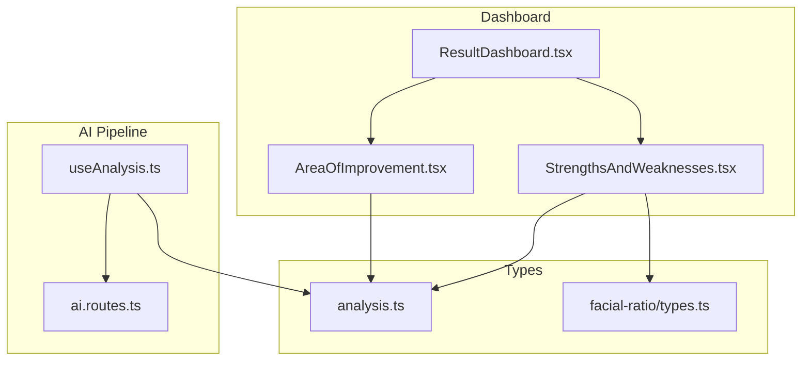
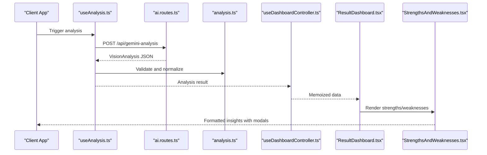
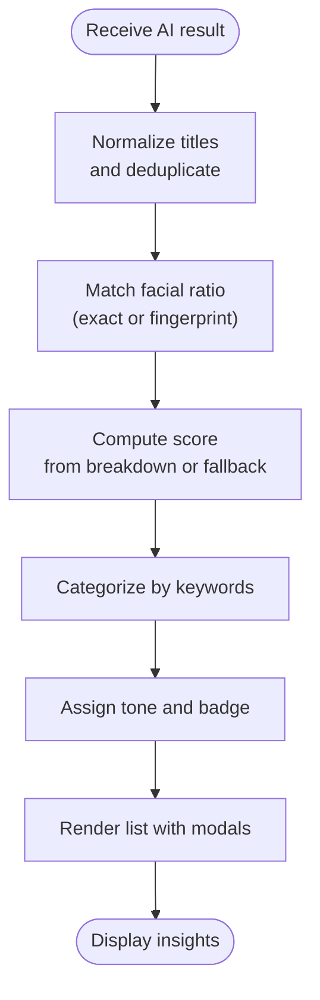
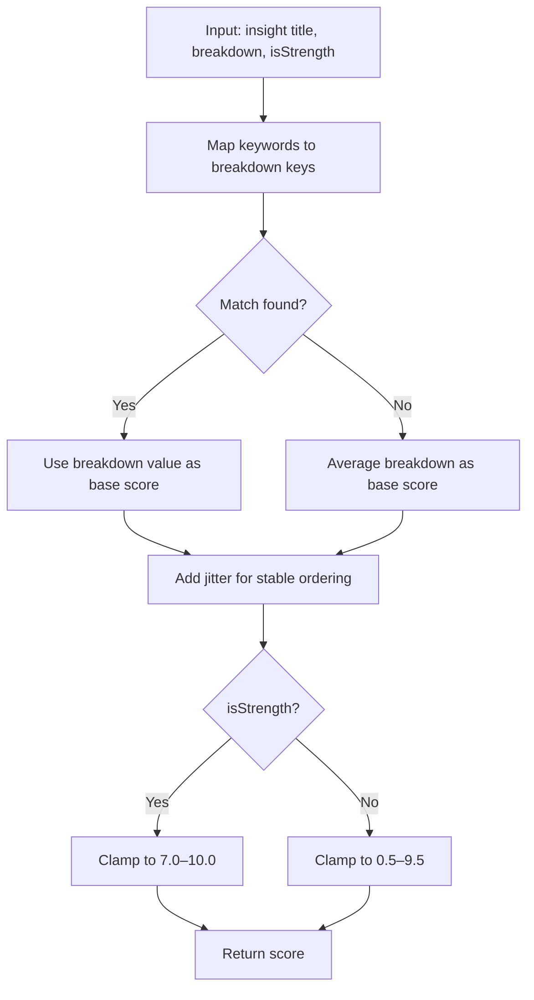
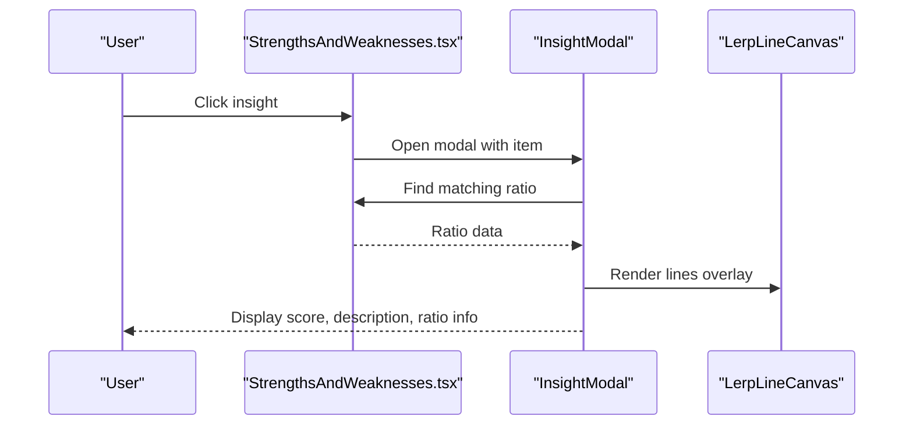
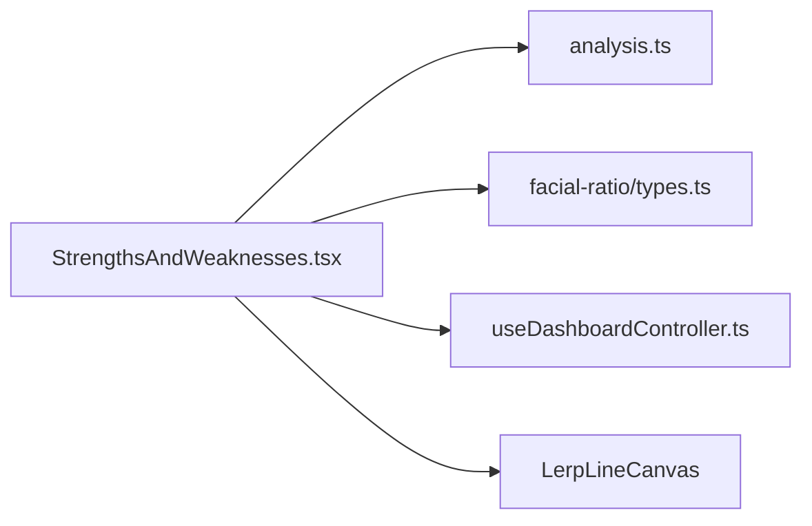

# Strengths and Weaknesses Analysis

<cite>
**Referenced Files in This Document**
- [StrengthsAndWeaknesses.tsx](file://src/components/dashboard/StrengthsAndWeaknesses.tsx)
- [analysis.ts](file://src/types/analysis.ts)
- [useDashboardController.ts](file://src/features/dashboard/useDashboardController.ts)
- [ResultDashboard.tsx](file://src/components/ResultDashboard.tsx)
- [AreaOfImprovement.tsx](file://src/components/AreaOfImprovement.tsx)
- [types.ts](file://src/components/facial-ratio/types.ts)
- [ai.routes.ts](file://backend/routes/ai.routes.ts)
- [useAnalysis.ts](file://src/components/FaceAnalyzer/hooks/useAnalysis.ts)
</cite>

## Table of Contents
1. [Introduction](#introduction)
2. [Project Structure](#project-structure)
3. [Core Components](#core-components)
4. [Architecture Overview](#architecture-overview)
5. [Detailed Component Analysis](#detailed-component-analysis)
6. [Dependency Analysis](#dependency-analysis)
7. [Performance Considerations](#performance-considerations)
8. [Troubleshooting Guide](#troubleshooting-guide)
9. [Conclusion](#conclusion)

## Introduction
This document provides comprehensive technical documentation for the StrengthsAndWeaknesses component, which processes and displays facial attributes and improvement areas derived from AI-powered facial analysis. It explains the data transformation pipeline from raw AI results to formatted strength/weakness lists, details the categorization and scoring algorithms, describes integration with AI analysis results and ratio visualization, and outlines the component's role within the overall dashboard architecture.

## Project Structure
The StrengthsAndWeaknesses component is part of the dashboard module and works alongside related analytics components:
- Dashboard orchestration and data preparation
- AI analysis pipeline and result types
- Ratio visualization types and integration
- Area of Improvement component for complementary insights

**Diagram sources**
- [ResultDashboard.tsx:1144-1176](file://src/components/ResultDashboard.tsx#L1144-L1176)
- [StrengthsAndWeaknesses.tsx:1024-1134](file://src/components/dashboard/StrengthsAndWeaknesses.tsx#L1024-L1134)
- [AreaOfImprovement.tsx:304-487](file://src/components/AreaOfImprovement.tsx#L304-L487)
- [analysis.ts:6-107](file://src/types/analysis.ts#L6-L107)
- [types.ts:5-18](file://src/components/facial-ratio/types.ts#L5-L18)
- [ai.routes.ts:271-516](file://backend/routes/ai.routes.ts#L271-L516)
- [useAnalysis.ts:62-97](file://src/components/FaceAnalyzer/hooks/useAnalysis.ts#L62-L97)

**Section sources**
- [ResultDashboard.tsx:1144-1176](file://src/components/ResultDashboard.tsx#L1144-L1176)
- [StrengthsAndWeaknesses.tsx:1024-1134](file://src/components/dashboard/StrengthsAndWeaknesses.tsx#L1024-L1134)
- [AreaOfImprovement.tsx:304-487](file://src/components/AreaOfImprovement.tsx#L304-L487)
- [analysis.ts:6-107](file://src/types/analysis.ts#L6-L107)
- [types.ts:5-18](file://src/components/facial-ratio/types.ts#L5-L18)
- [ai.routes.ts:271-516](file://backend/routes/ai.routes.ts#L271-L516)
- [useAnalysis.ts:62-97](file://src/components/FaceAnalyzer/hooks/useAnalysis.ts#L62-L97)

## Core Components
- StrengthsAndWeaknesses: Transforms AI-provided strengths/weaknesses into categorized, scored insights with ratio-aware prioritization and modal detail views.
- AreaOfImprovement: Generates structured improvement items from weaknesses with severity, impact, and recommended actions.
- Dashboard controller: Orchestrates data preparation and memoization for the dashboard, including generating improvement data.
- AI analysis types: Define the structure of AI vision analysis results, including strengths, weaknesses, breakdown scores, and insight descriptions.
- Ratio visualization types: Define the structure of facial ratio measurements used for linking insights to geometric measurements.

**Section sources**
- [StrengthsAndWeaknesses.tsx:1024-1134](file://src/components/dashboard/StrengthsAndWeaknesses.tsx#L1024-L1134)
- [AreaOfImprovement.tsx:304-487](file://src/components/AreaOfImprovement.tsx#L304-L487)
- [useDashboardController.ts:37-40](file://src/features/dashboard/useDashboardController.ts#L37-L40)
- [analysis.ts:26-63](file://src/types/analysis.ts#L26-L63)
- [types.ts:5-18](file://src/components/facial-ratio/types.ts#L5-L18)

## Architecture Overview
The component participates in a multi-stage pipeline:
1. Backend AI analysis produces structured results with strengths, weaknesses, breakdown scores, and insight descriptions.
2. Frontend hooks integrate AI results with geometry-based analysis to compute blended scores.
3. The dashboard controller prepares memoized data for the entire dashboard.
4. StrengthsAndWeaknesses renders categorized insights with ratio-aware scoring and modal detail views.
5. AreaOfImprovement complements insights with structured improvement recommendations.

**Diagram sources**
- [useAnalysis.ts:62-97](file://src/components/FaceAnalyzer/hooks/useAnalysis.ts#L62-L97)
- [ai.routes.ts:271-516](file://backend/routes/ai.routes.ts#L271-L516)
- [analysis.ts:26-63](file://src/types/analysis.ts#L26-L63)
- [useDashboardController.ts:37-40](file://src/features/dashboard/useDashboardController.ts#L37-L40)
- [ResultDashboard.tsx:1144-1176](file://src/components/ResultDashboard.tsx#L1144-L1176)
- [StrengthsAndWeaknesses.tsx:1024-1134](file://src/components/dashboard/StrengthsAndWeaknesses.tsx#L1024-L1134)

## Detailed Component Analysis

### Data Transformation Pipeline
The pipeline transforms raw AI results into formatted insights:
- Input: AI VisionAnalysis with strengths, weaknesses, breakdown scores, and insight descriptions.
- Deduplication: Titles are normalized and deduplicated to avoid repeated entries.
- Ratio Matching: Each insight attempts to match a facial ratio measurement for precise scoring and visualization.
- Scoring: Base score derived from breakdown metrics; fallback to average breakdown; jitter applied for stable ordering.
- Categorization: Insights are categorized into Harmony, Angularity, Dimorphism, Features based on keyword matching.
- Tone Assignment: Scores map to tone categories (KEY STRENGTH, MINOR NOTE, NEEDS REFINEMENT, HIGH PRIORITY) with appropriate badges and accents.

**Diagram sources**
- [StrengthsAndWeaknesses.tsx:1038-1096](file://src/components/dashboard/StrengthsAndWeaknesses.tsx#L1038-L1096)
- [StrengthsAndWeaknesses.tsx:39-54](file://src/components/dashboard/StrengthsAndWeaknesses.tsx#L39-L54)
- [StrengthsAndWeaknesses.tsx:63-95](file://src/components/dashboard/StrengthsAndWeaknesses.tsx#L63-L95)
- [StrengthsAndWeaknesses.tsx:97-128](file://src/components/dashboard/StrengthsAndWeaknesses.tsx#L97-L128)

**Section sources**
- [StrengthsAndWeaknesses.tsx:1038-1096](file://src/components/dashboard/StrengthsAndWeaknesses.tsx#L1038-L1096)
- [StrengthsAndWeaknesses.tsx:39-54](file://src/components/dashboard/StrengthsAndWeaknesses.tsx#L39-L54)
- [StrengthsAndWeaknesses.tsx:63-95](file://src/components/dashboard/StrengthsAndWeaknesses.tsx#L63-L95)
- [StrengthsAndWeaknesses.tsx:97-128](file://src/components/dashboard/StrengthsAndWeaknesses.tsx#L97-L128)

### Categorization and Scoring Algorithms
- getCategory: Assigns categories based on keyword inclusion in insight titles.
- getScore: Computes a base score using breakdown metrics mapped by regex; falls back to average breakdown; adds jitter for stable ordering; clamps strengths to a higher range and keeps weaknesses raw for severity differentiation.
- getInsightTone: Maps scores to tone categories with labels and color accents for visual priority.

**Diagram sources**
- [StrengthsAndWeaknesses.tsx:63-95](file://src/components/dashboard/StrengthsAndWeaknesses.tsx#L63-L95)
- [StrengthsAndWeaknesses.tsx:97-128](file://src/components/dashboard/StrengthsAndWeaknesses.tsx#L97-L128)

**Section sources**
- [StrengthsAndWeaknesses.tsx:63-95](file://src/components/dashboard/StrengthsAndWeaknesses.tsx#L63-L95)
- [StrengthsAndWeaknesses.tsx:97-128](file://src/components/dashboard/StrengthsAndWeaknesses.tsx#L97-L128)

### Integration with AI Analysis Results
- Insight descriptions: Optional API-supplied descriptions override fallback library text.
- Ratio-aware scoring: When a matching ratio exists, its score takes precedence over breakdown-derived scores.
- Modal detail view: Clicking an insight opens a modal showing the estimated score, category, and contributing ratio with visual lines overlay.

**Diagram sources**
- [StrengthsAndWeaknesses.tsx:403-716](file://src/components/dashboard/StrengthsAndWeaknesses.tsx#L403-L716)
- [StrengthsAndWeaknesses.tsx:252-363](file://src/components/dashboard/StrengthsAndWeaknesses.tsx#L252-L363)

**Section sources**
- [StrengthsAndWeaknesses.tsx:403-716](file://src/components/dashboard/StrengthsAndWeaknesses.tsx#L403-L716)
- [StrengthsAndWeaknesses.tsx:252-363](file://src/components/dashboard/StrengthsAndWeaknesses.tsx#L252-L363)

### Filtering and Prioritization
- Locked state: Limits visible items and replaces remaining items with placeholders.
- Category filtering: Tabs allow filtering by Harmony, Angularity, Dimorphism, Features.
- Expand/collapse: Users can expand to see all items or collapse to initial count.
- Sorting: Strengths sorted descending by score; weaknesses sorted ascending by score.

**Section sources**
- [StrengthsAndWeaknesses.tsx:763-771](file://src/components/dashboard/StrengthsAndWeaknesses.tsx#L763-L771)
- [StrengthsAndWeaknesses.tsx:1072-1095](file://src/components/dashboard/StrengthsAndWeaknesses.tsx#L1072-L1095)

### Dashboard Integration
- The component is rendered twice in the dashboard: once for strengths and once for weaknesses, sharing the same props including breakdown scores, ratio data, and insight descriptions.
- It integrates with the dashboard controller for memoized data preparation and with the facial ratio explorer for ratio visualization.

**Section sources**
- [ResultDashboard.tsx:1144-1176](file://src/components/ResultDashboard.tsx#L1144-L1176)
- [StrengthsAndWeaknesses.tsx:1024-1134](file://src/components/dashboard/StrengthsAndWeaknesses.tsx#L1024-L1134)

### Example Workflows
- Strengths rendering: Deduplicates strengths, matches ratios, computes scores, sorts descending, and renders with unlock gating.
- Weaknesses rendering: Filters weaknesses by ratio score threshold, computes scores, sorts ascending, and renders with unlock gating.
- Modal interaction: Opens detailed modal with ratio visualization overlay and description.

**Section sources**
- [StrengthsAndWeaknesses.tsx:1038-1096](file://src/components/dashboard/StrengthsAndWeaknesses.tsx#L1038-L1096)
- [StrengthsAndWeaknesses.tsx:403-716](file://src/components/dashboard/StrengthsAndWeaknesses.tsx#L403-L716)

## Dependency Analysis
The component depends on:
- AI analysis types for result structure and breakdown scores.
- Ratio visualization types for linking insights to geometric measurements.
- Dashboard controller for memoized data preparation.
- Ratio visualization components for rendering lines overlay.

**Diagram sources**
- [StrengthsAndWeaknesses.tsx:1-8](file://src/components/dashboard/StrengthsAndWeaknesses.tsx#L1-L8)
- [analysis.ts:6-107](file://src/types/analysis.ts#L6-L107)
- [types.ts:5-18](file://src/components/facial-ratio/types.ts#L5-L18)
- [useDashboardController.ts:37-40](file://src/features/dashboard/useDashboardController.ts#L37-L40)

**Section sources**
- [StrengthsAndWeaknesses.tsx:1-8](file://src/components/dashboard/StrengthsAndWeaknesses.tsx#L1-L8)
- [analysis.ts:6-107](file://src/types/analysis.ts#L6-L107)
- [types.ts:5-18](file://src/components/facial-ratio/types.ts#L5-L18)
- [useDashboardController.ts:37-40](file://src/features/dashboard/useDashboardController.ts#L37-L40)

## Performance Considerations
- Memoization: Uses useMemo for derived items and filtered lists to minimize re-computation.
- Conditional rendering: Modal rendering is deferred and portal-based to avoid blocking the main list.
- Threshold-based ratio scoring: Strengths are only promoted when ratio score meets a threshold, preventing noisy positives.
- Infinite scrolling: Lists support controlled expansion to manage DOM size.

[No sources needed since this section provides general guidance]

## Troubleshooting Guide
- Missing insight descriptions: When API does not supply descriptions, the Analysis block is hidden.
- Ratio mismatch: If no confident ratio match is found, fallback scoring is used; ensure insight titles contain expected keywords for fingerprint matching.
- Locked state behavior: Items beyond the first are blurred and placeholders replace remaining counts; unlock to reveal full content.
- Score anomalies: If scores appear inconsistent, verify breakdown keys and ensure proper keyword mapping.

**Section sources**
- [StrengthsAndWeaknesses.tsx:1050-1051](file://src/components/dashboard/StrengthsAndWeaknesses.tsx#L1050-L1051)
- [StrengthsAndWeaknesses.tsx:252-363](file://src/components/dashboard/StrengthsAndWeaknesses.tsx#L252-L363)
- [StrengthsAndWeaknesses.tsx:911-912](file://src/components/dashboard/StrengthsAndWeaknesses.tsx#L911-L912)

## Conclusion
The StrengthsAndWeaknesses component provides a robust, ratio-aware presentation of facial analysis insights. By combining AI-generated strengths/weaknesses with geometric breakdown scores and ratio visualization, it delivers prioritized, actionable feedback. Its integration with the dashboard controller and ratio explorer ensures a cohesive analytics experience, while careful filtering and scoring maintain clarity and relevance for users.