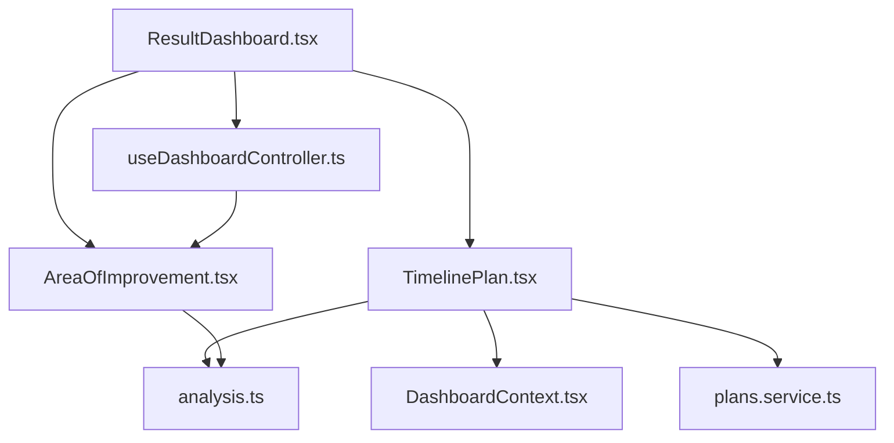
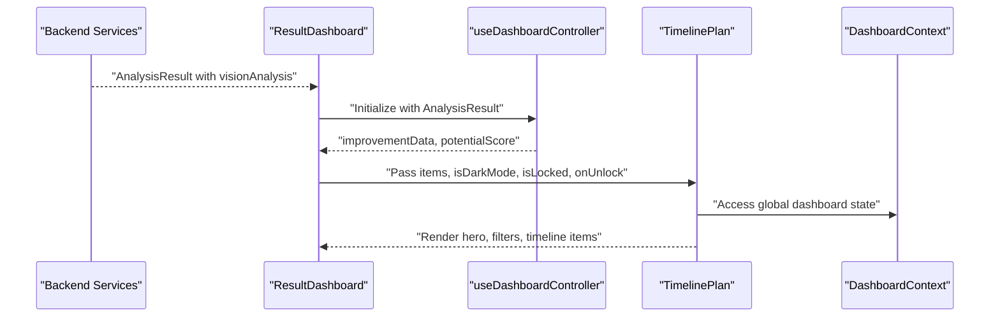
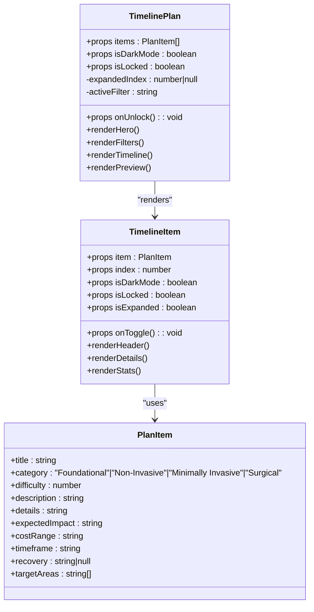
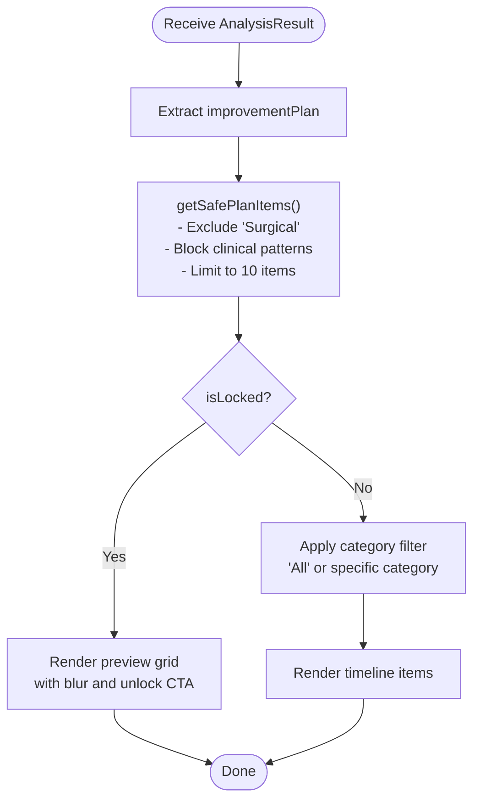
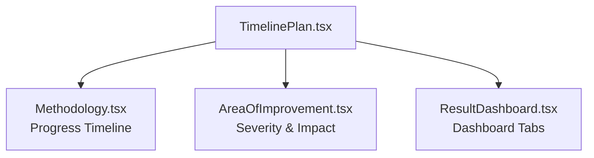
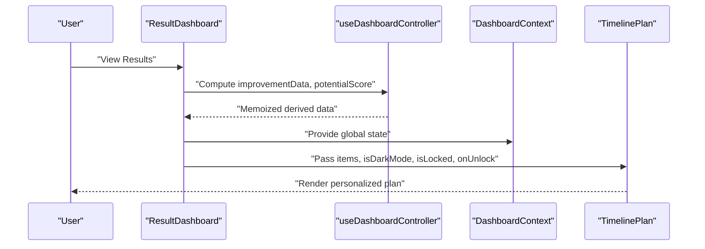
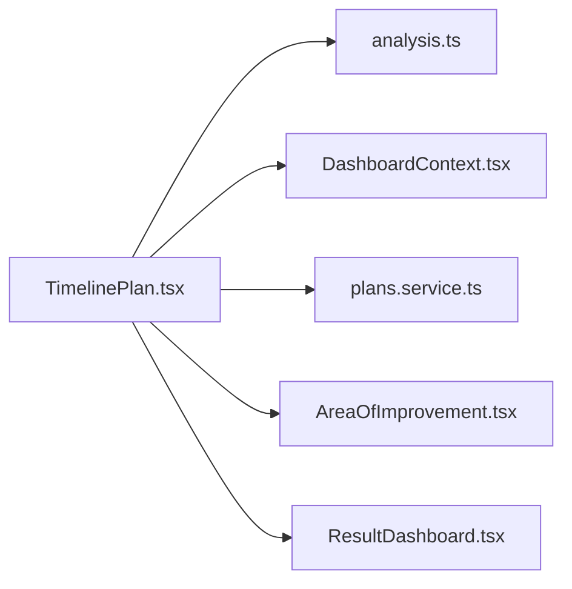

# Timeline Plan Generator

<cite>
**Referenced Files in This Document**
- [TimelinePlan.tsx](file://src/components/dashboard/TimelinePlan.tsx)
- [analysis.ts](file://src/types/analysis.ts)
- [useDashboardController.ts](file://src/features/dashboard/useDashboardController.ts)
- [ResultDashboard.tsx](file://src/components/ResultDashboard.tsx)
- [AreaOfImprovement.tsx](file://src/components/AreaOfImprovement.tsx)
- [DashboardContext.tsx](file://src/context/DashboardContext.tsx)
- [plans.service.ts](file://backend/services/plans.service.ts)
- [Methodology.tsx](file://src/components/Methodology.tsx)
</cite>

## Table of Contents
1. [Introduction](#introduction)
2. [Project Structure](#project-structure)
3. [Core Components](#core-components)
4. [Architecture Overview](#architecture-overview)
5. [Detailed Component Analysis](#detailed-component-analysis)
6. [Dependency Analysis](#dependency-analysis)
7. [Performance Considerations](#performance-considerations)
8. [Troubleshooting Guide](#troubleshooting-guide)
9. [Conclusion](#conclusion)

## Introduction
The Timeline Plan Generator is a React-based component that transforms analysis results into structured, step-by-step improvement plans. It presents actionable steps categorized by difficulty and risk level, with timeline estimates, cost ranges, and recovery considerations. The component supports both preview and full-plan modes, integrates with user preferences and unlock mechanics, and aligns with long-term engagement and habit formation goals.

## Project Structure
The Timeline Plan Generator lives within the dashboard ecosystem and collaborates with analysis types, controllers, and context providers. It renders a hero section, category filters, and a responsive grid of timeline items. When locked, it displays a preview with blurred content and a prominent unlock call-to-action.

**Diagram sources**
- [ResultDashboard.tsx:315-358](file://src/components/ResultDashboard.tsx#L315-L358)
- [useDashboardController.ts:4-40](file://src/features/dashboard/useDashboardController.ts#L4-L40)
- [TimelinePlan.tsx:418-497](file://src/components/dashboard/TimelinePlan.tsx#L418-L497)
- [AreaOfImprovement.tsx:304-358](file://src/components/AreaOfImprovement.tsx#L304-L358)
- [analysis.ts:49-62](file://src/types/analysis.ts#L49-L62)
- [DashboardContext.tsx:1-33](file://src/context/DashboardContext.tsx#L1-L33)
- [plans.service.ts:13-33](file://backend/services/plans.service.ts#L13-L33)

**Section sources**
- [TimelinePlan.tsx:418-697](file://src/components/dashboard/TimelinePlan.tsx#L418-L697)
- [ResultDashboard.tsx:315-358](file://src/components/ResultDashboard.tsx#L315-L358)

## Core Components
- TimelinePlan: Renders the hero header, category filters, and timeline items. Implements safe filtering to exclude clinical procedures and applies preview logic for locked states.
- PlanItem interface: Defines the shape of each improvement step, including category, difficulty, timeframe, cost range, and target areas.
- CATEGORY_CONFIG: Provides visual and semantic mappings for categories (Foundational, Non-Invasive, Minimally Invasive, Surgical) with icons, colors, and labels.
- getSafePlanItems: Filters out surgical items and patterns indicating clinical overreach, limiting results to a safe subset.

**Section sources**
- [TimelinePlan.tsx:21-100](file://src/components/dashboard/TimelinePlan.tsx#L21-L100)
- [TimelinePlan.tsx:418-497](file://src/components/dashboard/TimelinePlan.tsx#L418-L497)
- [TimelinePlan.tsx:44-53](file://src/components/dashboard/TimelinePlan.tsx#L44-L53)

## Architecture Overview
The Timeline Plan Generator participates in a data-driven dashboard. Analysis results flow from the backend into the frontend, where controllers compute derived data and pass it to components. The TimelinePlan consumes analysis data to render a curated set of improvement steps, respecting user preferences and unlock states.

**Diagram sources**
- [ResultDashboard.tsx:346-358](file://src/components/ResultDashboard.tsx#L346-L358)
- [useDashboardController.ts:37-40](file://src/features/dashboard/useDashboardController.ts#L37-L40)
- [TimelinePlan.tsx:418-497](file://src/components/dashboard/TimelinePlan.tsx#L418-L497)
- [DashboardContext.tsx:1-33](file://src/context/DashboardContext.tsx#L1-L33)

## Detailed Component Analysis

### TimelinePlan Component
The TimelinePlan component orchestrates the presentation of improvement steps:
- Hero section: Summarizes the personalized action plan and displays category counts.
- Category filters: Allows users to view Foundational, Non-Invasive, Minimally Invasive, or All items.
- Timeline items: Rendered as cards with expandable details, difficulty indicators, and category badges.
- Locked preview: Shows a limited set of items with blur and an unlock prompt.

**Diagram sources**
- [TimelinePlan.tsx:118-416](file://src/components/dashboard/TimelinePlan.tsx#L118-L416)
- [TimelinePlan.tsx:21-32](file://src/components/dashboard/TimelinePlan.tsx#L21-L32)

**Section sources**
- [TimelinePlan.tsx:418-697](file://src/components/dashboard/TimelinePlan.tsx#L418-L697)

### Planning Algorithms and Data Flow
The component consumes items shaped by the analysis pipeline:
- Items originate from AnalysisResult.visionAnalysis.improvementPlan.
- getSafePlanItems ensures safety by excluding surgical items and patterns suggesting clinical procedures.
- Filtering and preview logic adapt the dataset for locked vs. unlocked states.

**Diagram sources**
- [TimelinePlan.tsx:44-53](file://src/components/dashboard/TimelinePlan.tsx#L44-L53)
- [TimelinePlan.tsx:479-486](file://src/components/dashboard/TimelinePlan.tsx#L479-L486)
- [analysis.ts:49-62](file://src/types/analysis.ts#L49-L62)

**Section sources**
- [TimelinePlan.tsx:418-497](file://src/components/dashboard/TimelinePlan.tsx#L418-L497)
- [analysis.ts:49-62](file://src/types/analysis.ts#L49-L62)

### Timeline Visualization and Progress Tracking
The TimelinePlan component focuses on presenting improvement steps in a scrollable, expandable format. While it does not implement a dedicated progress tracker, it integrates with the broader dashboard:
- The Methodology page provides a progress timeline showing projected gains at key milestones.
- The AreaOfImprovement component offers a complementary view of improvement areas with severity and impact metrics.

**Diagram sources**
- [TimelinePlan.tsx:418-697](file://src/components/dashboard/TimelinePlan.tsx#L418-L697)
- [Methodology.tsx:487-516](file://src/components/Methodology.tsx#L487-L516)
- [AreaOfImprovement.tsx:304-358](file://src/components/AreaOfImprovement.tsx#L304-L358)

**Section sources**
- [Methodology.tsx:487-516](file://src/components/Methodology.tsx#L487-L516)
- [AreaOfImprovement.tsx:304-358](file://src/components/AreaOfImprovement.tsx#L304-L358)

### Integration with User Preferences and Historical Data
- DashboardContext provides global state (dark mode, lock state, pricing navigation) consumed by TimelinePlan.
- useDashboardController computes derived data (e.g., potentialScore) and passes it to dashboard components.
- Historical analysis data influences the generation of improvement items and potential score predictions.

**Diagram sources**
- [ResultDashboard.tsx:346-358](file://src/components/ResultDashboard.tsx#L346-L358)
- [useDashboardController.ts:37-40](file://src/features/dashboard/useDashboardController.ts#L37-L40)
- [DashboardContext.tsx:1-33](file://src/context/DashboardContext.tsx#L1-L33)
- [TimelinePlan.tsx:418-497](file://src/components/dashboard/TimelinePlan.tsx#L418-L497)

**Section sources**
- [DashboardContext.tsx:1-33](file://src/context/DashboardContext.tsx#L1-L33)
- [useDashboardController.ts:37-40](file://src/features/dashboard/useDashboardController.ts#L37-L40)

### Long-Term Engagement and Habit Formation Support
- Preview mode encourages unlocking the full plan, supporting continued engagement.
- Expandable details provide actionable insights (impact, cost, timeframe, recovery), aiding decision-making and commitment.
- Category-based filtering helps users focus on manageable steps aligned with their comfort level.

**Section sources**
- [TimelinePlan.tsx:578-697](file://src/components/dashboard/TimelinePlan.tsx#L578-L697)

## Dependency Analysis
The TimelinePlan component depends on:
- Analysis types for item structure.
- Dashboard context for theme and lock state.
- Backend plans service for pricing and credit information (indirect integration via dashboard).

**Diagram sources**
- [TimelinePlan.tsx:1-20](file://src/components/dashboard/TimelinePlan.tsx#L1-L20)
- [analysis.ts:49-62](file://src/types/analysis.ts#L49-L62)
- [DashboardContext.tsx:1-33](file://src/context/DashboardContext.tsx#L1-L33)
- [plans.service.ts:13-33](file://backend/services/plans.service.ts#L13-L33)
- [AreaOfImprovement.tsx:304-358](file://src/components/AreaOfImprovement.tsx#L304-L358)
- [ResultDashboard.tsx:315-358](file://src/components/ResultDashboard.tsx#L315-L358)

**Section sources**
- [TimelinePlan.tsx:1-20](file://src/components/dashboard/TimelinePlan.tsx#L1-L20)
- [analysis.ts:49-62](file://src/types/analysis.ts#L49-L62)
- [DashboardContext.tsx:1-33](file://src/context/DashboardContext.tsx#L1-L33)
- [plans.service.ts:13-33](file://backend/services/plans.service.ts#L13-L33)

## Performance Considerations
- Rendering optimization: Timeline items use staggered animations and conditional rendering to minimize layout thrash.
- Safe filtering: getSafePlanItems limits the dataset early to reduce DOM overhead.
- Preview mode: Locked state reduces visual complexity and improves perceived performance.

[No sources needed since this section provides general guidance]

## Troubleshooting Guide
- Empty or missing items: Verify that AnalysisResult.visionAnalysis.improvementPlan is populated before passing items to TimelinePlan.
- Safety filtering: If no items appear, confirm that getSafePlanItems is not excluding all entries due to category or pattern matching.
- Locked preview: Ensure isLocked prop is correctly managed by the parent dashboard to display preview content and unlock CTA.

**Section sources**
- [TimelinePlan.tsx:44-53](file://src/components/dashboard/TimelinePlan.tsx#L44-L53)
- [TimelinePlan.tsx:418-497](file://src/components/dashboard/TimelinePlan.tsx#L418-L497)

## Conclusion
The Timeline Plan Generator transforms analysis results into a structured, visual roadmap of improvement steps. By categorizing actions, controlling visibility through preview modes, and integrating with broader dashboard components, it supports long-term engagement and habit formation. Its modular design and clear data contracts enable easy customization and extension.