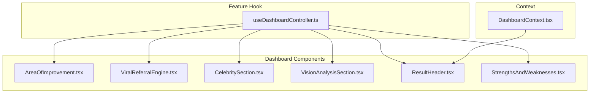
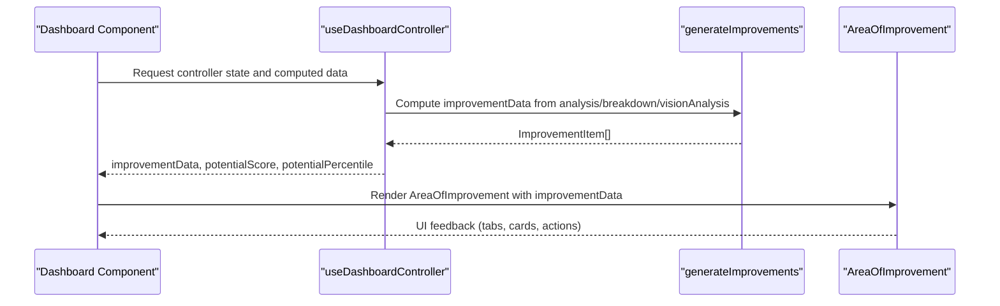
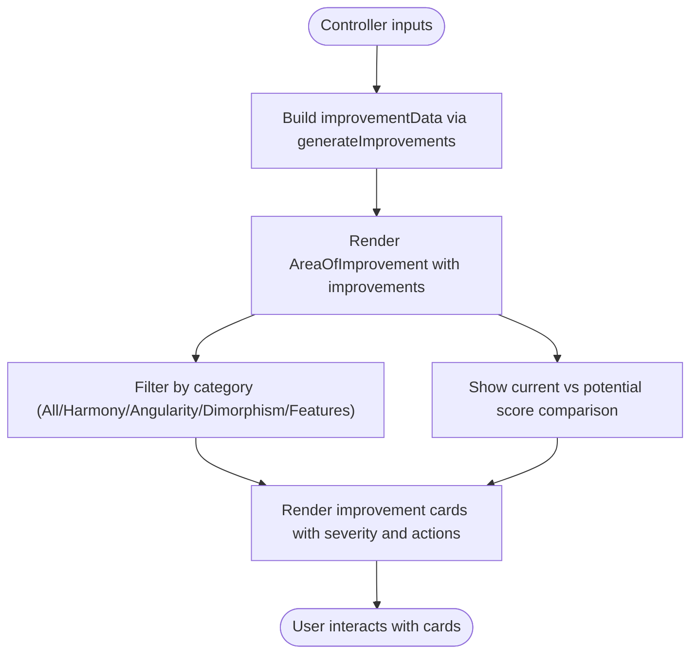
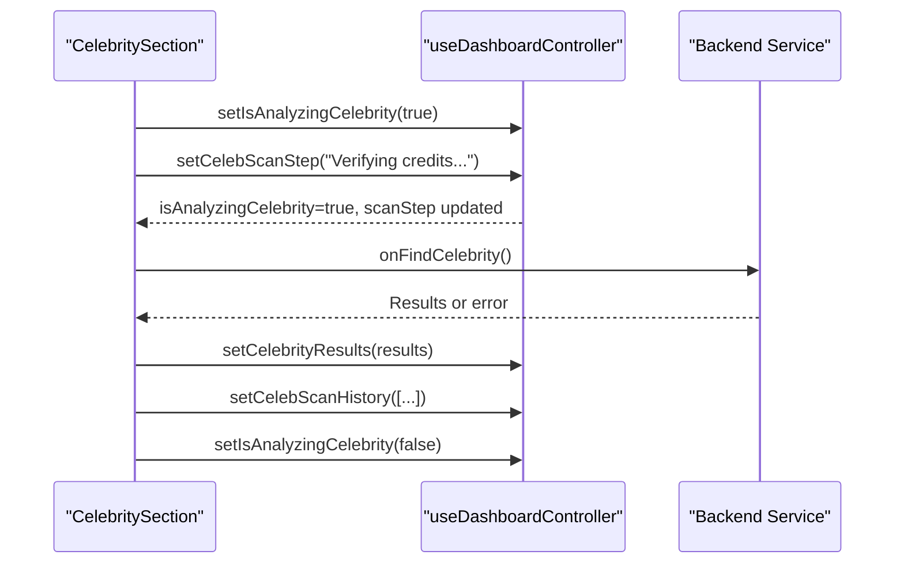
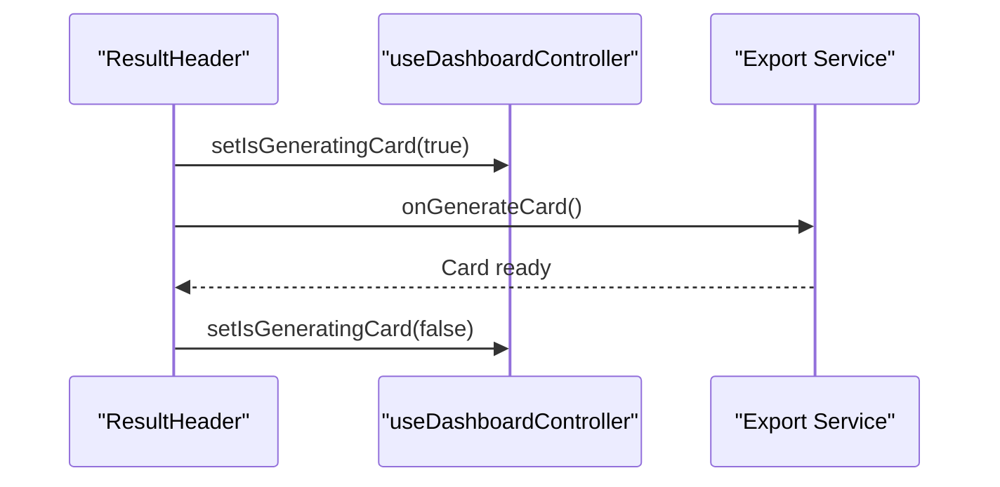
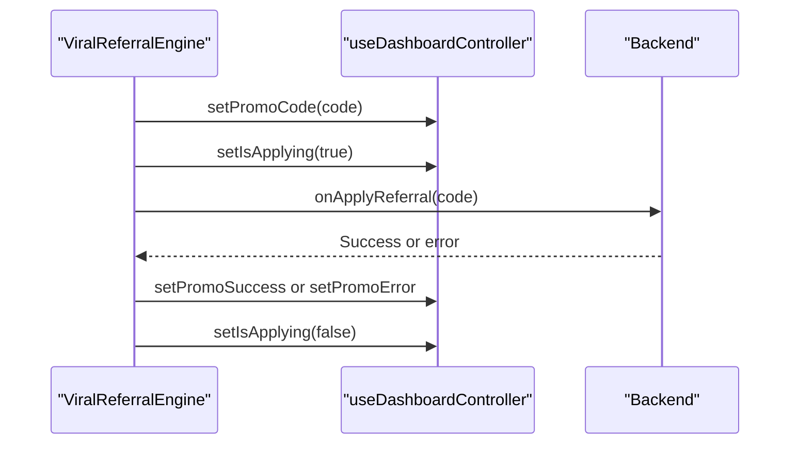
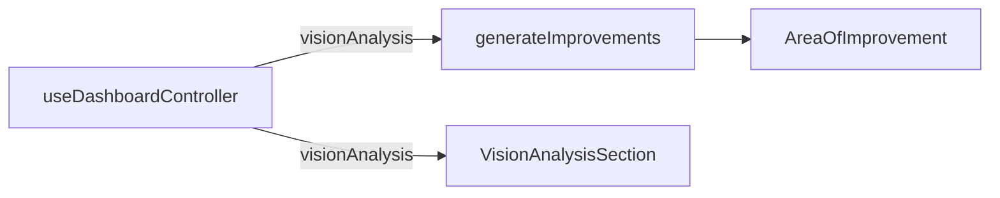
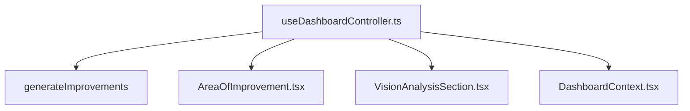

# Dashboard Controller

<cite>
**Referenced Files in This Document**
- [useDashboardController.ts](file://src/features/dashboard/useDashboardController.ts)
- [AreaOfImprovement.tsx](file://src/components/AreaOfImprovement.tsx)
- [DashboardContext.tsx](file://src/context/DashboardContext.tsx)
- [ResultHeader.tsx](file://src/components/dashboard/ResultHeader.tsx)
- [ViralReferralEngine.tsx](file://src/components/dashboard/ViralReferralEngine.tsx)
- [CelebritySection.tsx](file://src/components/dashboard/CelebritySection.tsx)
- [VisionAnalysisSection.tsx](file://src/components/dashboard/VisionAnalysisSection.tsx)
- [StrengthsAndWeaknesses.tsx](file://src/components/dashboard/StrengthsAndWeaknesses.tsx)
</cite>

## Table of Contents
1. [Introduction](#introduction)
2. [Project Structure](#project-structure)
3. [Core Components](#core-components)
4. [Architecture Overview](#architecture-overview)
5. [Detailed Component Analysis](#detailed-component-analysis)
6. [Dependency Analysis](#dependency-analysis)
7. [Performance Considerations](#performance-considerations)
8. [Troubleshooting Guide](#troubleshooting-guide)
9. [Conclusion](#conclusion)

## Introduction
This document explains the dashboard controller implementation centered on the useDashboardController hook. It covers how the controller coordinates analytics, manages state for promotional codes, celebrity analysis workflows, and card generation, and computes derived metrics such as potential scores and percentile rankings. It also documents the integration with Area of Improvement generation and Vision Analysis components, along with UI state management for overlays, referral systems, and interactive elements.

## Project Structure
The dashboard controller lives in a dedicated feature hook and integrates with multiple dashboard components that render insights, manage user interactions, and orchestrate workflows such as celebrity lookalike matching and export card generation.

**Diagram sources**
- [useDashboardController.ts:1-101](file://src/features/dashboard/useDashboardController.ts#L1-L101)
- [AreaOfImprovement.tsx:1-629](file://src/components/AreaOfImprovement.tsx#L1-L629)
- [ViralReferralEngine.tsx:1-348](file://src/components/dashboard/ViralReferralEngine.tsx#L1-L348)
- [CelebritySection.tsx:1-369](file://src/components/dashboard/CelebritySection.tsx#L1-L369)
- [VisionAnalysisSection.tsx:1-368](file://src/components/dashboard/VisionAnalysisSection.tsx#L1-L368)
- [ResultHeader.tsx:1-135](file://src/components/dashboard/ResultHeader.tsx#L1-L135)
- [StrengthsAndWeaknesses.tsx:1-1135](file://src/components/dashboard/StrengthsAndWeaknesses.tsx#L1-L1135)
- [DashboardContext.tsx:1-33](file://src/context/DashboardContext.tsx#L1-L33)

**Section sources**
- [useDashboardController.ts:1-101](file://src/features/dashboard/useDashboardController.ts#L1-L101)
- [AreaOfImprovement.tsx:1-629](file://src/components/AreaOfImprovement.tsx#L1-L629)
- [ViralReferralEngine.tsx:1-348](file://src/components/dashboard/ViralReferralEngine.tsx#L1-L348)
- [CelebritySection.tsx:1-369](file://src/components/dashboard/CelebritySection.tsx#L1-L369)
- [VisionAnalysisSection.tsx:1-368](file://src/components/dashboard/VisionAnalysisSection.tsx#L1-L368)
- [ResultHeader.tsx:1-135](file://src/components/dashboard/ResultHeader.tsx#L1-L135)
- [StrengthsAndWeaknesses.tsx:1-1135](file://src/components/dashboard/StrengthsAndWeaknesses.tsx#L1-L1135)
- [DashboardContext.tsx:1-33](file://src/context/DashboardContext.tsx#L1-L33)

## Core Components
- useDashboardController: Central orchestrator that exposes:
  - Props: overallScore, structuralScore, visualScore, breakdown, metrics, analysis, detailedSymmetry
  - Computed data: improvementData (memoized), potentialScore, potentialPercentile
  - State groups:
    - Promo state: promoCode, setPromoCode, isApplying, setIsApplying, promoError, setPromoError, promoSuccess, setPromoSuccess
    - UI/action state: copied, setCopied, leaderboard, setLeaderboard, pricingOfferTimeLeft, setPricingOfferTimeLeft, isGeneratingCard, setIsGeneratingCard
    - Celebrity state: isAnalyzingCelebrity, setIsAnalyzingCelebrity, celebScanStep, setCelebScanStep, celebScanHistory, setCelebScanHistory, celebrityResults, setCelebrityResults, celebError, setCelebError

- AreaOfImprovement: Renders improvement recommendations and integrates with the controller’s computed improvementData.

- DashboardContext: Provides shared dashboard-level UI actions (e.g., scroll to pricing, open pricing) to child components.

**Section sources**
- [useDashboardController.ts:4-101](file://src/features/dashboard/useDashboardController.ts#L4-L101)
- [AreaOfImprovement.tsx:304-487](file://src/components/AreaOfImprovement.tsx#L304-L487)
- [DashboardContext.tsx:1-33](file://src/context/DashboardContext.tsx#L1-L33)

## Architecture Overview
The controller encapsulates analytics coordination and state management, exposing a normalized interface to dashboard components. Components consume controller-provided props, computed data, and state setters to drive user interactions and rendering.

**Diagram sources**
- [useDashboardController.ts:36-40](file://src/features/dashboard/useDashboardController.ts#L36-L40)
- [AreaOfImprovement.tsx:492-628](file://src/components/AreaOfImprovement.tsx#L492-L628)

**Section sources**
- [useDashboardController.ts:36-61](file://src/features/dashboard/useDashboardController.ts#L36-L61)
- [AreaOfImprovement.tsx:492-628](file://src/components/AreaOfImprovement.tsx#L492-L628)

## Detailed Component Analysis

### useDashboardController Hook
- Purpose: Centralize analytics coordination, memoized data processing, and state management for the dashboard.
- Inputs: result object containing analysis, breakdown, metrics, and optional visionAnalysis.
- Outputs: normalized props, computed data, and state groups for promo, UI/action, and celebrity workflows.

Memoized data processing:
- improvementData: Generated via generateImprovements using analysis.weaknesses, breakdown metrics, and optional visionAnalysis improvements. The computation is memoized to avoid recomputation when inputs remain unchanged.

Potential score and percentile:
- potentialScore: Derived from visionAnalysis.potentialScore if present; otherwise computed from overallScore with a bounded adjustment.
- potentialPercentile: Computed from potentialScore to reflect a percentile ranking.

State management patterns:
- Promo state: Encapsulated under promoState for code redemption and sharing flows.
- UI/action state: Encapsulated under uiState for exporting cards, copying links, and leaderboard updates.
- Celebrity state: Encapsulated under celebState for scanning workflows, history tracking, and error handling.

Integration touchpoints:
- Area of Improvement: Consumes improvementData and potentialScore/currentScore for predictive UI.
- Vision Analysis: Contributes to improvementData via AI vision analysis improvements.
- Export card: Uses isGeneratingCard to gate UI interactions in ResultHeader.

**Section sources**
- [useDashboardController.ts:4-101](file://src/features/dashboard/useDashboardController.ts#L4-L101)
- [AreaOfImprovement.tsx:492-628](file://src/components/AreaOfImprovement.tsx#L492-L628)

### Area of Improvement Integration
- The controller’s improvementData drives the AreaOfImprovement component, which:
  - Filters and categorizes improvements by severity and category.
  - Computes total impact across filtered items.
  - Displays actionable recommendations and affected metrics.

**Diagram sources**
- [AreaOfImprovement.tsx:304-487](file://src/components/AreaOfImprovement.tsx#L304-L487)
- [AreaOfImprovement.tsx:492-628](file://src/components/AreaOfImprovement.tsx#L492-L628)

**Section sources**
- [AreaOfImprovement.tsx:304-487](file://src/components/AreaOfImprovement.tsx#L304-L487)
- [AreaOfImprovement.tsx:492-628](file://src/components/AreaOfImprovement.tsx#L492-L628)

### Celebrity Analysis Workflow
- The controller exposes celebrity state to coordinate scanning:
  - isAnalyzingCelebrity toggles scanning state.
  - celebScanStep tracks current step.
  - celebScanHistory maintains recent steps.
  - celebrityResults holds similarity matches.
  - celebError captures errors during scanning.

**Diagram sources**
- [CelebritySection.tsx:57-78](file://src/components/dashboard/CelebritySection.tsx#L57-L78)
- [useDashboardController.ts:24-32](file://src/features/dashboard/useDashboardController.ts#L24-L32)

**Section sources**
- [CelebritySection.tsx:39-78](file://src/components/dashboard/CelebritySection.tsx#L39-L78)
- [useDashboardController.ts:24-32](file://src/features/dashboard/useDashboardController.ts#L24-L32)

### Card Generation Process
- The controller exposes isGeneratingCard and setIsGeneratingCard to coordinate export flows.
- ResultHeader integrates with the controller to trigger card generation and reflects loading states.

**Diagram sources**
- [ResultHeader.tsx:83-88](file://src/components/dashboard/ResultHeader.tsx#L83-L88)
- [useDashboardController.ts:82-84](file://src/features/dashboard/useDashboardController.ts#L82-L84)

**Section sources**
- [ResultHeader.tsx:14-19](file://src/components/dashboard/ResultHeader.tsx#L14-L19)
- [useDashboardController.ts:82-84](file://src/features/dashboard/useDashboardController.ts#L82-L84)

### Promotional Codes and Referral System
- The controller’s promoState enables:
  - Capturing promoCode input.
  - Applying codes with isApplying flag and error/success messaging.
  - Sharing and copying referral links with copied state.
- The ViralReferralEngine component consumes these states and triggers apply/referral actions.

**Diagram sources**
- [ViralReferralEngine.tsx:45-65](file://src/components/dashboard/ViralReferralEngine.tsx#L45-L65)
- [useDashboardController.ts:63-72](file://src/features/dashboard/useDashboardController.ts#L63-L72)

**Section sources**
- [ViralReferralEngine.tsx:27-65](file://src/components/dashboard/ViralReferralEngine.tsx#L27-L65)
- [useDashboardController.ts:63-72](file://src/features/dashboard/useDashboardController.ts#L63-L72)

### Vision Analysis Integration
- The controller leverages visionAnalysis to enrich improvementData with AI-generated suggestions.
- VisionAnalysisSection renders qualitative observations and hair recommendations, gated by lock state.

**Diagram sources**
- [useDashboardController.ts:37-40](file://src/features/dashboard/useDashboardController.ts#L37-L40)
- [AreaOfImprovement.tsx:602-621](file://src/components/AreaOfImprovement.tsx#L602-L621)
- [VisionAnalysisSection.tsx:43-49](file://src/components/dashboard/VisionAnalysisSection.tsx#L43-L49)

**Section sources**
- [useDashboardController.ts:37-40](file://src/features/dashboard/useDashboardController.ts#L37-L40)
- [AreaOfImprovement.tsx:602-621](file://src/components/AreaOfImprovement.tsx#L602-L621)
- [VisionAnalysisSection.tsx:43-49](file://src/components/dashboard/VisionAnalysisSection.tsx#L43-L49)

### UI State Management for Overlays and Interactive Elements
- DashboardContext provides shared actions such as scrollToPricing and onOpenPricing, enabling components to trigger global UI behaviors.
- ResultHeader uses isGeneratingCard to disable interactions during export and to reflect loading states.

**Section sources**
- [DashboardContext.tsx:16-32](file://src/context/DashboardContext.tsx#L16-L32)
- [ResultHeader.tsx:14-19](file://src/components/dashboard/ResultHeader.tsx#L14-L19)

## Dependency Analysis
The controller depends on:
- generateImprovements for memoized recommendation computation.
- visionAnalysis data for enriched insights.
- DashboardContext for shared UI actions.

**Diagram sources**
- [useDashboardController.ts:1-4](file://src/features/dashboard/useDashboardController.ts#L1-L4)
- [AreaOfImprovement.tsx:492-628](file://src/components/AreaOfImprovement.tsx#L492-L628)
- [VisionAnalysisSection.tsx:1-11](file://src/components/dashboard/VisionAnalysisSection.tsx#L1-L11)
- [DashboardContext.tsx:1-12](file://src/context/DashboardContext.tsx#L1-L12)

**Section sources**
- [useDashboardController.ts:1-4](file://src/features/dashboard/useDashboardController.ts#L1-L4)
- [AreaOfImprovement.tsx:492-628](file://src/components/AreaOfImprovement.tsx#L492-L628)
- [VisionAnalysisSection.tsx:1-11](file://src/components/dashboard/VisionAnalysisSection.tsx#L1-L11)
- [DashboardContext.tsx:1-12](file://src/context/DashboardContext.tsx#L1-L12)

## Performance Considerations
- Memoization: improvementData is computed via useMemo to prevent unnecessary recomputation when analysis, breakdown, and visionAnalysis remain stable.
- Conditional rendering: Components like AreaOfImprovement and VisionAnalysisSection conditionally render content based on lock state and available data to minimize DOM overhead.
- Debounced or throttled UI updates: Where applicable, components update state in batches (e.g., scan history) to avoid frequent re-renders.

## Troubleshooting Guide
Common issues and resolutions:
- Improper state initialization: Ensure celebrityResults defaults to the visionAnalysis-provided array to avoid undefined errors.
- Potential score out-of-range: The controller clamps potentialScore to a reasonable range; verify inputs to prevent unexpected percentile computations.
- Referral code errors: Validate promoCode input and handle backend errors gracefully with promoError; reset isApplying after completion.
- Export card stuck: Confirm isGeneratingCard transitions to false on success or error to re-enable UI interactions.

**Section sources**
- [useDashboardController.ts:28-30](file://src/features/dashboard/useDashboardController.ts#L28-L30)
- [useDashboardController.ts:42-44](file://src/features/dashboard/useDashboardController.ts#L42-L44)
- [ViralReferralEngine.tsx:56-64](file://src/components/dashboard/ViralReferralEngine.tsx#L56-L64)
- [ResultHeader.tsx:83-88](file://src/components/dashboard/ResultHeader.tsx#L83-L88)

## Conclusion
The useDashboardController hook centralizes analytics coordination, memoized data processing, and state management for promotional codes, celebrity workflows, and card generation. It integrates tightly with Area of Improvement and Vision Analysis components to deliver a cohesive, responsive dashboard experience. By structuring state into focused groups and leveraging memoization, the controller ensures predictable performance and maintainable UI interactions.