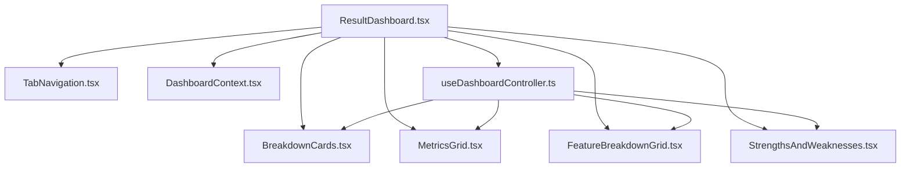
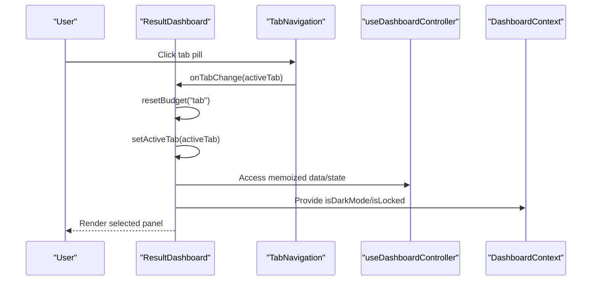
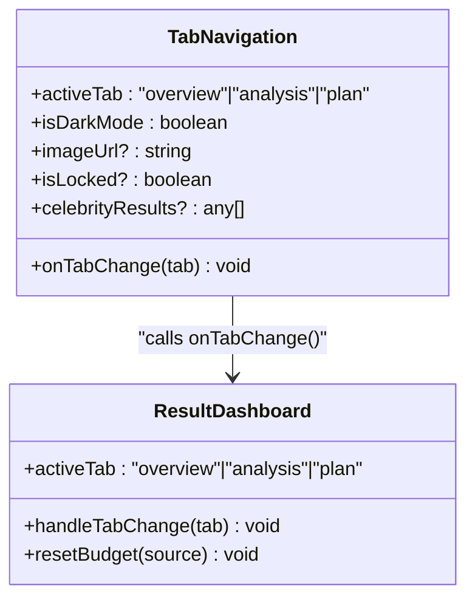
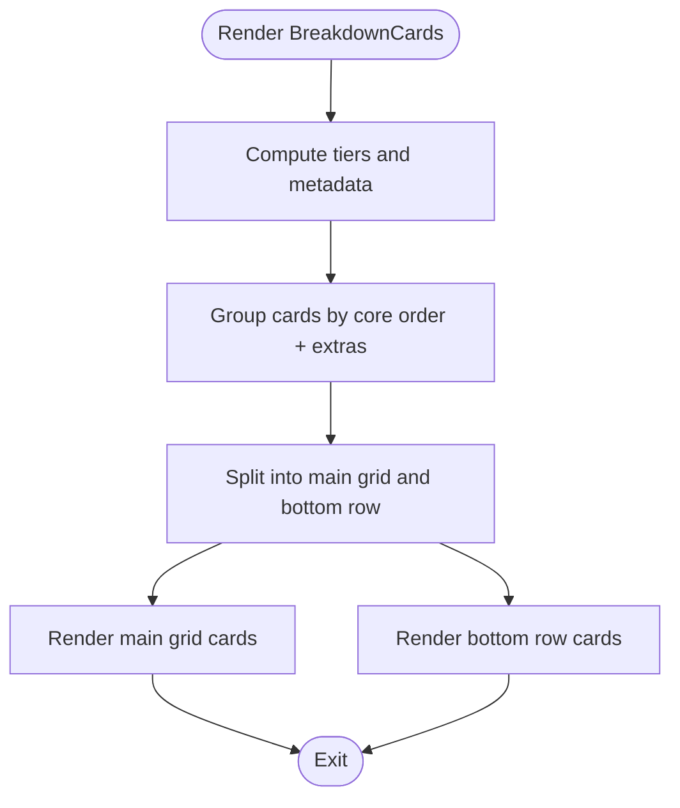
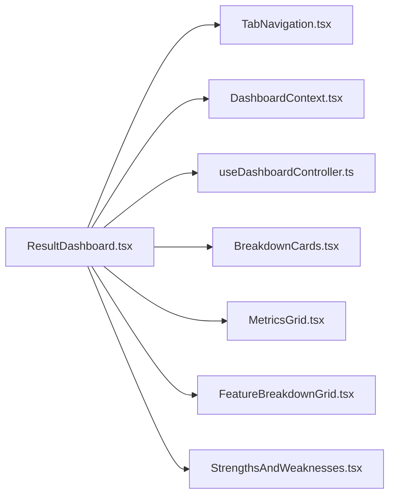
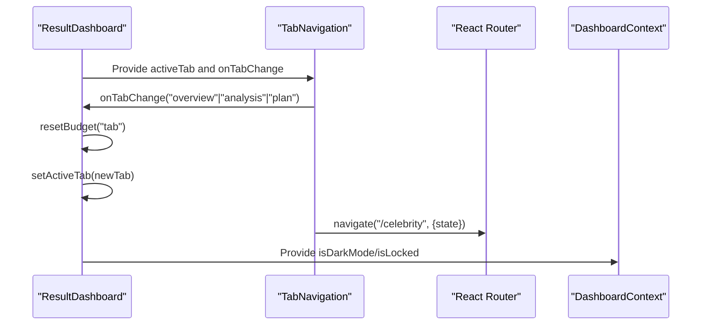

# Dashboard Navigation and Layout

<cite>
**Referenced Files in This Document**
- [TabNavigation.tsx](file://src/components/dashboard/TabNavigation.tsx)
- [BreakdownCards.tsx](file://src/components/dashboard/BreakdownCards.tsx)
- [ResultDashboard.tsx](file://src/components/ResultDashboard.tsx)
- [useDashboardController.ts](file://src/features/dashboard/useDashboardController.ts)
- [DashboardContext.tsx](file://src/context/DashboardContext.tsx)
- [MetricsGrid.tsx](file://src/components/dashboard/MetricsGrid.tsx)
- [FeatureBreakdownGrid.tsx](file://src/components/dashboard/FeatureBreakdownGrid.tsx)
- [StrengthsAndWeaknesses.tsx](file://src/components/dashboard/StrengthsAndWeaknesses.tsx)
- [index.css](file://src/index.css)
</cite>

## Table of Contents
1. [Introduction](#introduction)
2. [Project Structure](#project-structure)
3. [Core Components](#core-components)
4. [Architecture Overview](#architecture-overview)
5. [Detailed Component Analysis](#detailed-component-analysis)
6. [Dependency Analysis](#dependency-analysis)
7. [Performance Considerations](#performance-considerations)
8. [Accessibility Considerations](#accessibility-considerations)
9. [Responsive Design Patterns](#responsive-design-patterns)
10. [Integration with Routing and State Preservation](#integration-with-routing-and-state-preservation)
11. [Customization Examples](#customization-examples)
12. [Troubleshooting Guide](#troubleshooting-guide)
13. [Conclusion](#conclusion)

## Introduction
This document explains the dashboard navigation and layout system, focusing on:
- TabNavigation: a segmented control for switching between overview, analysis, and plan sections, plus quick-access navigation to related features.
- BreakdownCards: a card-based system for presenting categorized feature scores and insights.
- Layout composition patterns and responsive behavior across screen sizes and device orientations.
- Accessibility considerations for navigation and keyboard interaction.
- Integration with routing and state preservation across navigation.

## Project Structure
The dashboard is composed of modular components orchestrated by a central dashboard controller and provider context. The navigation component coordinates with the main dashboard layout to switch panels while preserving motion budgets and state.

**Diagram sources**
- [ResultDashboard.tsx:793-800](file://src/components/ResultDashboard.tsx#L793-L800)
- [TabNavigation.tsx:18-25](file://src/components/dashboard/TabNavigation.tsx#L18-L25)
- [BreakdownCards.tsx:100-110](file://src/components/dashboard/BreakdownCards.tsx#L100-L110)
- [MetricsGrid.tsx:23-29](file://src/components/dashboard/MetricsGrid.tsx#L23-L29)
- [FeatureBreakdownGrid.tsx:17-24](file://src/components/dashboard/FeatureBreakdownGrid.tsx#L17-L24)
- [StrengthsAndWeaknesses.tsx:1024-1037](file://src/components/dashboard/StrengthsAndWeaknesses.tsx#L1024-L1037)
- [DashboardContext.tsx:16-24](file://src/context/DashboardContext.tsx#L16-L24)
- [useDashboardController.ts:4-13](file://src/features/dashboard/useDashboardController.ts#L4-L13)

**Section sources**
- [ResultDashboard.tsx:315-344](file://src/components/ResultDashboard.tsx#L315-L344)
- [TabNavigation.tsx:18-25](file://src/components/dashboard/TabNavigation.tsx#L18-L25)
- [BreakdownCards.tsx:100-110](file://src/components/dashboard/BreakdownCards.tsx#L100-L110)

## Core Components
- TabNavigation: Provides a sticky, segmented control with animated active indicators, optional badges, and contextual navigation to related features (Celebrity and Hair).
- BreakdownCards: Renders a responsive grid of feature cards with tiered scoring, icons, descriptions, and lock states.
- ResultDashboard: Orchestrates the dashboard layout, manages active tab state, integrates motion budgets, and wires the navigation and data components.

**Section sources**
- [TabNavigation.tsx:18-167](file://src/components/dashboard/TabNavigation.tsx#L18-L167)
- [BreakdownCards.tsx:100-379](file://src/components/dashboard/BreakdownCards.tsx#L100-L379)
- [ResultDashboard.tsx:315-344](file://src/components/ResultDashboard.tsx#L315-L344)

## Architecture Overview
The dashboard uses a controller hook to centralize derived data and state, a provider to expose global dashboard flags and actions, and a navigation component to switch between major sections. Motion budgets are reset on tab changes to maintain smoothness.

**Diagram sources**
- [ResultDashboard.tsx:341-344](file://src/components/ResultDashboard.tsx#L341-L344)
- [TabNavigation.tsx:18-25](file://src/components/dashboard/TabNavigation.tsx#L18-L25)
- [useDashboardController.ts:4-13](file://src/features/dashboard/useDashboardController.ts#L4-L13)
- [DashboardContext.tsx:16-24](file://src/context/DashboardContext.tsx#L16-L24)

## Detailed Component Analysis

### TabNavigation Component
- Purpose: Sticky segmented control for switching between overview, analysis, and plan. Includes quick-access buttons for related features.
- Behavior:
  - Uses motion presets to animate the active indicator.
  - Supports dark/light mode styling and optional badges.
  - Integrates with routing to navigate to related views with state.
- Accessibility:
  - Uses semantic button elements and outlines for focus.
  - Responsive labels (short vs full) depending on viewport.

**Diagram sources**
- [TabNavigation.tsx:9-25](file://src/components/dashboard/TabNavigation.tsx#L9-L25)
- [ResultDashboard.tsx:341-344](file://src/components/ResultDashboard.tsx#L341-L344)

**Section sources**
- [TabNavigation.tsx:18-167](file://src/components/dashboard/TabNavigation.tsx#L18-L167)
- [ResultDashboard.tsx:341-344](file://src/components/ResultDashboard.tsx#L341-L344)

### BreakdownCards Component
- Purpose: Presents categorized feature scores in a responsive grid of cards.
- Features:
  - Tier classification and color coding.
  - Lock state handling with blurred overlays and reduced opacity.
  - Horizontal and vertical card variants.
  - Animated score bars and staggered entrance.
- Composition:
  - Computes columns and bottom row grouping to avoid misalignment.
  - Uses motion primitives for entrance and hover effects.

**Diagram sources**
- [BreakdownCards.tsx:100-110](file://src/components/dashboard/BreakdownCards.tsx#L100-L110)
- [BreakdownCards.tsx:140-145](file://src/components/dashboard/BreakdownCards.tsx#L140-L145)
- [BreakdownCards.tsx:355-375](file://src/components/dashboard/BreakdownCards.tsx#L355-L375)

**Section sources**
- [BreakdownCards.tsx:100-379](file://src/components/dashboard/BreakdownCards.tsx#L100-L379)

### Supporting Layout Components
- MetricsGrid: Displays radar and measurement grids with dark/light mode styling.
- FeatureBreakdownGrid: Renders a radar chart visualization with lock overlays and animated data polygons.
- StrengthsAndWeaknesses: Lists insights grouped by categories, with modals and scroll behavior.

**Section sources**
- [MetricsGrid.tsx:23-29](file://src/components/dashboard/MetricsGrid.tsx#L23-L29)
- [FeatureBreakdownGrid.tsx:17-24](file://src/components/dashboard/FeatureBreakdownGrid.tsx#L17-L24)
- [StrengthsAndWeaknesses.tsx:1024-1037](file://src/components/dashboard/StrengthsAndWeaknesses.tsx#L1024-L1037)

## Dependency Analysis
- ResultDashboard orchestrates navigation and data:
  - Manages activeTab state and resets motion budgets on tab change.
  - Wires DashboardContext for global flags and actions.
- useDashboardController centralizes derived data and UI state.
- TabNavigation depends on routing and motion presets.
- BreakdownCards consumes isDarkMode and isLocked from context.

**Diagram sources**
- [ResultDashboard.tsx:793-800](file://src/components/ResultDashboard.tsx#L793-L800)
- [TabNavigation.tsx:18-25](file://src/components/dashboard/TabNavigation.tsx#L18-L25)
- [DashboardContext.tsx:16-24](file://src/context/DashboardContext.tsx#L16-L24)
- [useDashboardController.ts:4-13](file://src/features/dashboard/useDashboardController.ts#L4-L13)
- [BreakdownCards.tsx:100-110](file://src/components/dashboard/BreakdownCards.tsx#L100-L110)

**Section sources**
- [ResultDashboard.tsx:315-344](file://src/components/ResultDashboard.tsx#L315-L344)
- [DashboardContext.tsx:16-24](file://src/context/DashboardContext.tsx#L16-L24)

## Performance Considerations
- Motion budgets: Reset on tab change to prevent animation starvation.
- Reduced motion: Media queries disable heavy animations for reduced-motion preferences.
- Mobile performance: Blur filters are disabled on small screens to preserve performance.
- Scroll behavior: Smooth scroll is tuned per motion tier and disabled on modals.

**Section sources**
- [ResultDashboard.tsx:341-344](file://src/components/ResultDashboard.tsx#L341-L344)
- [index.css:594-643](file://src/index.css#L594-L643)
- [index.css:624-643](file://src/index.css#L624-L643)

## Accessibility Considerations
- Keyboard interaction:
  - Focus styles are applied to navigation buttons.
  - Modal lists support keyboard-driven expansion/collapse.
- Screen reader and reduced motion:
  - Animations adapt to reduced motion preferences.
- Contrast and readability:
  - Dark/light mode variants ensure sufficient contrast.
- Touch targets:
  - Buttons and controls use appropriate sizing and spacing.

**Section sources**
- [TabNavigation.tsx:60-72](file://src/components/dashboard/TabNavigation.tsx#L60-L72)
- [StrengthsAndWeaknesses.tsx:994-1018](file://src/components/dashboard/StrengthsAndWeaknesses.tsx#L994-L1018)
- [index.css:624-643](file://src/index.css#L624-L643)

## Responsive Design Patterns
- Grid layouts:
  - Cards stack vertically on small screens and form 2–3 columns on larger screens.
  - Bottom row adjusts to 1 or 2 columns based on remaining items.
- Typography and spacing:
  - Responsive font sizes and gutters adapt to breakpoints.
- Navigation:
  - Labels shorten on narrow screens; icons remain present.
- Motion:
  - Long-running ambient animations are disabled on low tiers; blur filters are disabled on mobile.

**Section sources**
- [BreakdownCards.tsx:355-375](file://src/components/dashboard/BreakdownCards.tsx#L355-L375)
- [TabNavigation.tsx:96-98](file://src/components/dashboard/TabNavigation.tsx#L96-L98)
- [index.css:594-643](file://src/index.css#L594-L643)

## Integration with Routing and State Preservation
- Tab switching:
  - Active tab state is managed locally in ResultDashboard.
  - Motion budget is reset to maintain smoothness when switching panels.
- Navigation to related features:
  - TabNavigation triggers navigation with state payloads for images and results.
- Context propagation:
  - DashboardContext exposes isDarkMode, isLocked, and scrolling helpers to child components.

**Diagram sources**
- [ResultDashboard.tsx:341-344](file://src/components/ResultDashboard.tsx#L341-L344)
- [TabNavigation.tsx:130-132](file://src/components/dashboard/TabNavigation.tsx#L130-L132)
- [DashboardContext.tsx:16-24](file://src/context/DashboardContext.tsx#L16-L24)

**Section sources**
- [ResultDashboard.tsx:341-344](file://src/components/ResultDashboard.tsx#L341-L344)
- [TabNavigation.tsx:130-132](file://src/components/dashboard/TabNavigation.tsx#L130-L132)
- [DashboardContext.tsx:16-24](file://src/context/DashboardContext.tsx#L16-L24)

## Customization Examples
- Custom navigation:
  - Extend TabNavigation props to add new tabs and integrate with router state.
  - Use motion presets to tune active indicator animation.
- Layout customization:
  - Adjust grid column counts and bottom-row grouping in BreakdownCards.
  - Swap icons and descriptions in the metadata map.
- Theming:
  - Toggle isDarkMode to switch color schemes and glow effects.
  - Use DashboardContext to propagate theme-aware flags to child components.

**Section sources**
- [TabNavigation.tsx:9-25](file://src/components/dashboard/TabNavigation.tsx#L9-L25)
- [BreakdownCards.tsx:52-89](file://src/components/dashboard/BreakdownCards.tsx#L52-L89)
- [DashboardContext.tsx:3-12](file://src/context/DashboardContext.tsx#L3-L12)

## Troubleshooting Guide
- Tabs not animating:
  - Verify motion tier flags and durations are configured.
- Cards misaligned:
  - Ensure the card grouping logic accounts for remainder rows.
- Navigation not preserving state:
  - Confirm state is passed to navigate() and consumed by target route.
- Excessive motion on low-tier devices:
  - Check reduced-motion media queries and low-tier motion overrides.

**Section sources**
- [index.css:624-643](file://src/index.css#L624-L643)
- [BreakdownCards.tsx:140-145](file://src/components/dashboard/BreakdownCards.tsx#L140-L145)
- [TabNavigation.tsx:130-132](file://src/components/dashboard/TabNavigation.tsx#L130-L132)

## Conclusion
The dashboard navigation and layout system combines a sticky segmented control, a responsive card grid, and a centralized controller/provider model to deliver a smooth, accessible, and customizable user experience. Motion budgets, responsive patterns, and context propagation ensure consistent performance and behavior across devices and interaction modes.