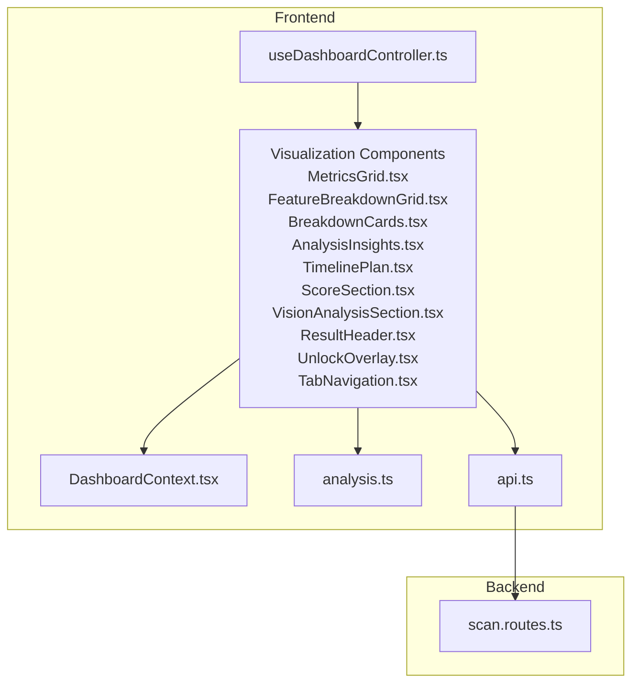
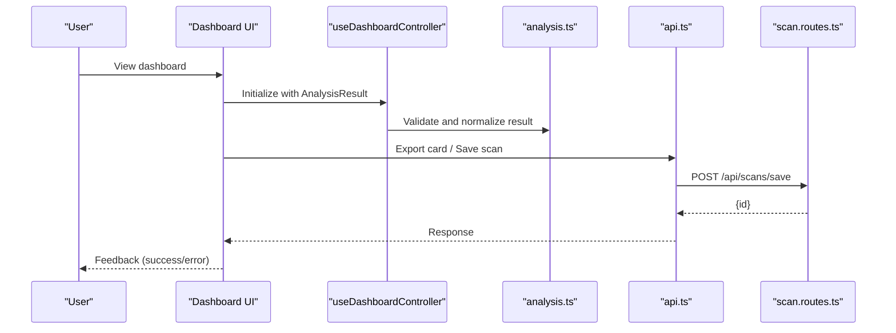
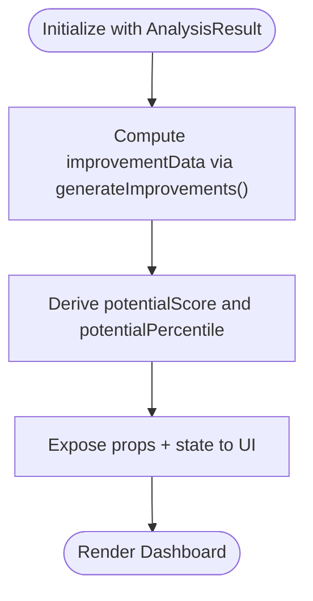
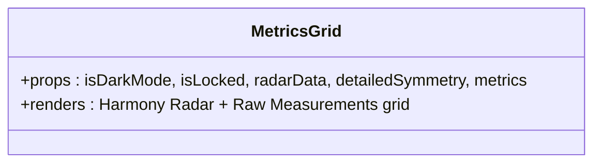
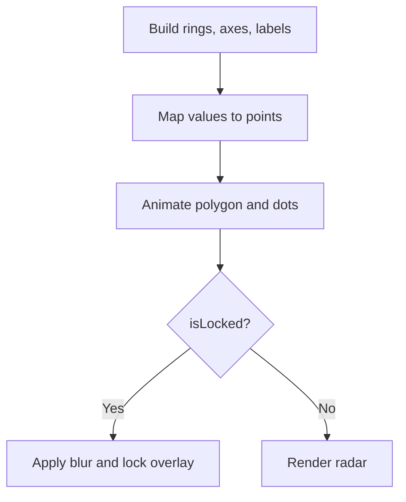
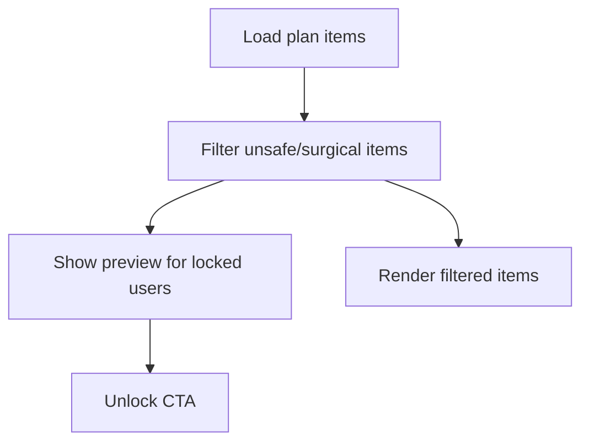
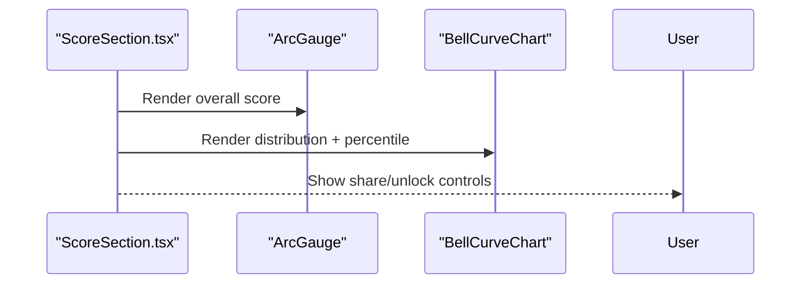
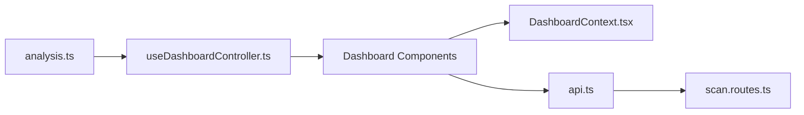

# Dashboard and Analytics

<cite>
**Referenced Files in This Document**
- [useDashboardController.ts](file://src/features/dashboard/useDashboardController.ts)
- [MetricsGrid.tsx](file://src/components/dashboard/MetricsGrid.tsx)
- [FeatureBreakdownGrid.tsx](file://src/components/dashboard/FeatureBreakdownGrid.tsx)
- [TimelinePlan.tsx](file://src/components/dashboard/TimelinePlan.tsx)
- [AnalysisInsights.tsx](file://src/components/dashboard/AnalysisInsights.tsx)
- [BreakdownCards.tsx](file://src/components/dashboard/BreakdownCards.tsx)
- [AreaOfImprovement.tsx](file://src/components/AreaOfImprovement.tsx)
- [analysis.ts](file://src/types/analysis.ts)
- [DashboardContext.tsx](file://src/context/DashboardContext.tsx)
- [ResultHeader.tsx](file://src/components/dashboard/ResultHeader.tsx)
- [ScoreSection.tsx](file://src/components/dashboard/ScoreSection.tsx)
- [VisionAnalysisSection.tsx](file://src/components/dashboard/VisionAnalysisSection.tsx)
- [UnlockOverlay.tsx](file://src/components/dashboard/UnlockOverlay.tsx)
- [TabNavigation.tsx](file://src/components/dashboard/TabNavigation.tsx)
- [scan.routes.ts](file://backend/routes/scan.routes.ts)
- [api.ts](file://src/lib/api.ts)
</cite>

## Table of Contents
1. [Introduction](#introduction)
2. [Project Structure](#project-structure)
3. [Core Components](#core-components)
4. [Architecture Overview](#architecture-overview)
5. [Detailed Component Analysis](#detailed-component-analysis)
6. [Dependency Analysis](#dependency-analysis)
7. [Performance Considerations](#performance-considerations)
8. [Troubleshooting Guide](#troubleshooting-guide)
9. [Conclusion](#conclusion)
10. [Appendices](#appendices)

## Introduction
This document describes the dashboard and analytics system for transforming raw facial analysis results into rich, interactive visualizations and actionable insights. It covers the dashboard controller that orchestrates data aggregation and insights generation, the visualization components for metrics, feature breakdowns, and timeline planning, the data transformation pipeline, responsive design and accessibility patterns, export capabilities, performance optimizations, backend integration, and customization options for personalization.

## Project Structure
The dashboard is implemented as a collection of React components organized by feature and domain:
- Dashboard controller hook coordinates state and computed analytics data.
- Visualization components render metrics grids, feature breakdowns, insights summaries, and personalized action plans.
- Backend routes persist and retrieve scan history and results.
- Shared types define the shape of analysis results and metrics.
- Context providers supply theme and lock-state to components.

**Diagram sources**
- [useDashboardController.ts:1-101](file://src/features/dashboard/useDashboardController.ts#L1-L101)
- [DashboardContext.tsx:1-33](file://src/context/DashboardContext.tsx#L1-L33)
- [MetricsGrid.tsx:1-267](file://src/components/dashboard/MetricsGrid.tsx#L1-L267)
- [FeatureBreakdownGrid.tsx:1-281](file://src/components/dashboard/FeatureBreakdownGrid.tsx#L1-L281)
- [BreakdownCards.tsx:1-379](file://src/components/dashboard/BreakdownCards.tsx#L1-L379)
- [AnalysisInsights.tsx:1-239](file://src/components/dashboard/AnalysisInsights.tsx#L1-L239)
- [TimelinePlan.tsx:1-698](file://src/components/dashboard/TimelinePlan.tsx#L1-L698)
- [ScoreSection.tsx:1-1204](file://src/components/dashboard/ScoreSection.tsx#L1-L1204)
- [VisionAnalysisSection.tsx:1-368](file://src/components/dashboard/VisionAnalysisSection.tsx#L1-L368)
- [ResultHeader.tsx:1-135](file://src/components/dashboard/ResultHeader.tsx#L1-L135)
- [UnlockOverlay.tsx:1-129](file://src/components/dashboard/UnlockOverlay.tsx#L1-L129)
- [TabNavigation.tsx:1-167](file://src/components/dashboard/TabNavigation.tsx#L1-L167)
- [analysis.ts:1-143](file://src/types/analysis.ts#L1-L143)
- [api.ts:1-36](file://src/lib/api.ts#L1-L36)
- [scan.routes.ts:1-63](file://backend/routes/scan.routes.ts#L1-L63)

**Section sources**
- [useDashboardController.ts:1-101](file://src/features/dashboard/useDashboardController.ts#L1-L101)
- [DashboardContext.tsx:1-33](file://src/context/DashboardContext.tsx#L1-L33)
- [analysis.ts:1-143](file://src/types/analysis.ts#L1-L143)

## Core Components
- Dashboard controller: Aggregates analysis results, computes derived insights, and exposes state for UI actions (promos, leaderboard, celebrity analysis, card generation).
- Visualization components: Render metrics, feature breakdowns, insights summaries, and personalized action plans.
- Backend integration: Persist and retrieve scan history with rate limits and authentication.
- Shared types: Define the structure of analysis results, breakdown scores, and radar data.

**Section sources**
- [useDashboardController.ts:4-101](file://src/features/dashboard/useDashboardController.ts#L4-L101)
- [analysis.ts:96-116](file://src/types/analysis.ts#L96-L116)

## Architecture Overview
The dashboard integrates frontend visualization with backend services through typed APIs and shared data contracts. The controller orchestrates state and computed analytics, while components render visuals and drive user interactions.

**Diagram sources**
- [useDashboardController.ts:4-101](file://src/features/dashboard/useDashboardController.ts#L4-L101)
- [analysis.ts:96-116](file://src/types/analysis.ts#L96-L116)
- [api.ts:1-36](file://src/lib/api.ts#L1-L36)
- [scan.routes.ts:22-44](file://backend/routes/scan.routes.ts#L22-L44)

## Detailed Component Analysis

### Dashboard Controller
The controller encapsulates:
- State for promotions, leaderboard, pricing offer timer, and celebrity analysis.
- Memoized computation of improvement data from analysis, breakdown, and vision analysis.
- Derived metrics such as potential score and percentile.

**Diagram sources**
- [useDashboardController.ts:37-60](file://src/features/dashboard/useDashboardController.ts#L37-L60)
- [AreaOfImprovement.tsx:492-628](file://src/components/AreaOfImprovement.tsx#L492-L628)

**Section sources**
- [useDashboardController.ts:4-101](file://src/features/dashboard/useDashboardController.ts#L4-L101)
- [AreaOfImprovement.tsx:492-628](file://src/components/AreaOfImprovement.tsx#L492-L628)

### Metrics Grid
Visualizes measurements and symmetry with:
- Harmony Radar chart (Recharts) for multi-dimensional feature comparison.
- Raw measurements grid (symmetry, canthal tilt, fWHR, golden ratio) with tooltips and lock-aware rendering.

**Diagram sources**
- [MetricsGrid.tsx:15-29](file://src/components/dashboard/MetricsGrid.tsx#L15-L29)

**Section sources**
- [MetricsGrid.tsx:1-267](file://src/components/dashboard/MetricsGrid.tsx#L1-L267)

### Feature Breakdown Grid
Renders a custom SVG-based Harmony Radar with:
- Dynamic rings, axes, labels, and animated polygon.
- Lock-aware overlays and blur effects for free users.
- Motion animations for engagement.

**Diagram sources**
- [FeatureBreakdownGrid.tsx:46-97](file://src/components/dashboard/FeatureBreakdownGrid.tsx#L46-L97)

**Section sources**
- [FeatureBreakdownGrid.tsx:1-281](file://src/components/dashboard/FeatureBreakdownGrid.tsx#L1-L281)

### Breakdown Cards
Displays feature scores with:
- Tiered color coding and glow effects.
- Progress bars and lock-aware blurs.
- Responsive grid layout.

**Section sources**
- [BreakdownCards.tsx:1-379](file://src/components/dashboard/BreakdownCards.tsx#L1-L379)

### Analysis Insights
Summarizes strengths and weaknesses with:
- Key strengths and areas for improvement lists.
- Keyword-driven links to educational resources.
- Lock-aware placeholders.

**Section sources**
- [AnalysisInsights.tsx:1-239](file://src/components/dashboard/AnalysisInsights.tsx#L1-L239)

### Timeline Plan
Provides a personalized improvement plan with:
- Category filtering (Foundational, Non-Invasive, Minimally Invasive).
- Expandable cards with difficulty indicators, stats, and target areas.
- Lock-aware preview and unlock CTA.
- Safety filtering to avoid clinical recommendations.

**Diagram sources**
- [TimelinePlan.tsx:41-53](file://src/components/dashboard/TimelinePlan.tsx#L41-L53)
- [TimelinePlan.tsx:418-476](file://src/components/dashboard/TimelinePlan.tsx#L418-L476)

**Section sources**
- [TimelinePlan.tsx:1-698](file://src/components/dashboard/TimelinePlan.tsx#L1-L698)

### Score Section
Renders the overall score with:
- Arc gauge visualization and dual score breakdown (geometry + AI visual).
- Bell curve distribution with percentile and ranking.
- Share and unlock actions.

**Diagram sources**
- [ScoreSection.tsx:22-93](file://src/components/dashboard/ScoreSection.tsx#L22-L93)
- [ScoreSection.tsx:234-679](file://src/components/dashboard/ScoreSection.tsx#L234-L679)

**Section sources**
- [ScoreSection.tsx:681-1204](file://src/components/dashboard/ScoreSection.tsx#L681-L1204)

### Vision Analysis Section
Highlights AI vision insights:
- Skin health and texture analysis.
- Overall aesthetics and grooming commentary.
- Face shape and barber recommendations with lock-aware rendering.

**Section sources**
- [VisionAnalysisSection.tsx:1-368](file://src/components/dashboard/VisionAnalysisSection.tsx#L1-L368)

### Area of Improvement
Generates structured improvement items from analysis weaknesses and vision analysis:
- Severity classification and impact calculation.
- Affected metrics and recommended actions.
- Categorized tabs and lock-aware preview.

**Section sources**
- [AreaOfImprovement.tsx:1-487](file://src/components/AreaOfImprovement.tsx#L1-L487)

### Result Header and Tab Navigation
- Result header with export and reset actions.
- Tab navigation for Overview, Analysis, and Plan with badges and celebrity/hair navigation.

**Section sources**
- [ResultHeader.tsx:1-135](file://src/components/dashboard/ResultHeader.tsx#L1-L135)
- [TabNavigation.tsx:1-167](file://src/components/dashboard/TabNavigation.tsx#L1-L167)

### Unlock Overlay
Promotes full access with benefits and a secure payment option.

**Section sources**
- [UnlockOverlay.tsx:1-129](file://src/components/dashboard/UnlockOverlay.tsx#L1-L129)

## Dependency Analysis
- Controller depends on the analysis types and the improvement generator.
- Components depend on shared types and context for theme and lock state.
- Frontend API attaches auth and CAPTCHA tokens to requests.
- Backend routes enforce rate limits and require authentication.

**Diagram sources**
- [analysis.ts:96-116](file://src/types/analysis.ts#L96-L116)
- [useDashboardController.ts:4-101](file://src/features/dashboard/useDashboardController.ts#L4-L101)
- [DashboardContext.tsx:1-33](file://src/context/DashboardContext.tsx#L1-L33)
- [api.ts:1-36](file://src/lib/api.ts#L1-L36)
- [scan.routes.ts:1-63](file://backend/routes/scan.routes.ts#L1-L63)

**Section sources**
- [analysis.ts:1-143](file://src/types/analysis.ts#L1-L143)
- [api.ts:1-36](file://src/lib/api.ts#L1-L36)
- [scan.routes.ts:1-63](file://backend/routes/scan.routes.ts#L1-L63)

## Performance Considerations
- Memoization: The controller memoizes improvement data to prevent recomputation on renders.
- Lazy rendering: Components use viewport intersection and motion triggers to defer heavy animations until in-view.
- SVG optimization: The Harmony Radar uses precomputed points and minimal DOM updates.
- Lock-aware rendering: Blur and placeholder overlays reduce visual overhead for locked content.
- Backend rate limiting: Protects server resources and ensures predictable performance under load.

[No sources needed since this section provides general guidance]

## Troubleshooting Guide
- Authentication errors: Verify Firebase ID token injection in the API client and ensure the user is signed in.
- Rate limit errors: The backend enforces limits for history and save endpoints; throttle requests accordingly.
- Missing data: Confirm AnalysisResult shape matches the types contract and that vision analysis fields are present.
- Export failures: Check network connectivity and CAPTCHA token availability.

**Section sources**
- [api.ts:9-33](file://src/lib/api.ts#L9-L33)
- [scan.routes.ts:11-20](file://backend/routes/scan.routes.ts#L11-L20)

## Conclusion
The dashboard and analytics system combines a robust controller, rich visualizations, and secure backend integration to deliver a comprehensive, personalized face analysis experience. With lock-aware rendering, categorized insights, and export capabilities, it balances user engagement with performance and accessibility.

[No sources needed since this section summarizes without analyzing specific files]

## Appendices

### Data Transformation Pipeline
- From raw analysis results to visual representations:
  - Normalize AnalysisResult and breakdown scores.
  - Generate improvement items with severity and impact.
  - Build radar data arrays for charts.
  - Compute derived metrics (potential score, percentile).

**Section sources**
- [analysis.ts:96-116](file://src/types/analysis.ts#L96-L116)
- [AreaOfImprovement.tsx:492-628](file://src/components/AreaOfImprovement.tsx#L492-L628)
- [useDashboardController.ts:37-60](file://src/features/dashboard/useDashboardController.ts#L37-L60)

### Responsive Design Patterns
- Grid layouts adapt across breakpoints (columns, gaps).
- Typography scales with fluid sizing and appropriate weights.
- Motion animations are gated by viewport intersection and device capability tiers.

**Section sources**
- [MetricsGrid.tsx:51-107](file://src/components/dashboard/MetricsGrid.tsx#L51-L107)
- [BreakdownCards.tsx:140-375](file://src/components/dashboard/BreakdownCards.tsx#L140-L375)
- [TabNavigation.tsx:43-47](file://src/components/dashboard/TabNavigation.tsx#L43-L47)

### Accessibility Implementations
- Semantic headings and labels for screen readers.
- Focus management and keyboard navigation support in interactive cards.
- Sufficient color contrast and reduced motion options via context.

**Section sources**
- [DashboardContext.tsx:1-33](file://src/context/DashboardContext.tsx#L1-L33)
- [AnalysisInsights.tsx:28-46](file://src/components/dashboard/AnalysisInsights.tsx#L28-L46)

### Export Capabilities
- Export card action triggers generation and download flow.
- Backend supports saving scans with image URLs and analysis data.

**Section sources**
- [ResultHeader.tsx:82-131](file://src/components/dashboard/ResultHeader.tsx#L82-L131)
- [scan.routes.ts:22-44](file://backend/routes/scan.routes.ts#L22-L44)

### Backend Integration
- Authenticated endpoints for saving and retrieving scan history.
- Rate-limit middleware prevents abuse.

**Section sources**
- [scan.routes.ts:1-63](file://backend/routes/scan.routes.ts#L1-L63)