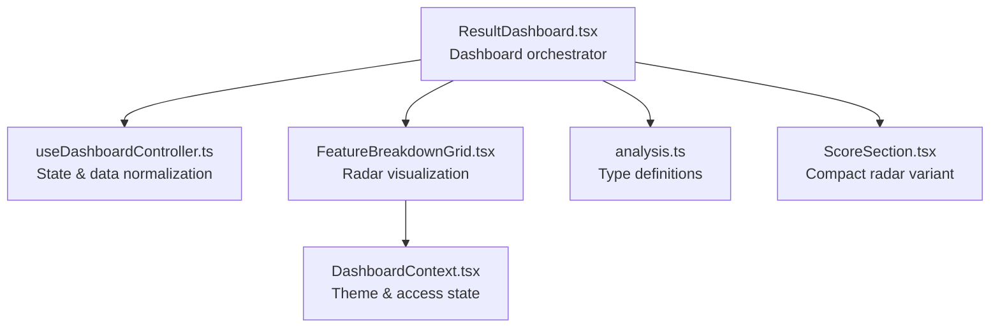
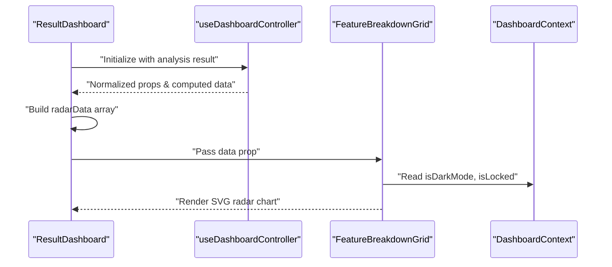
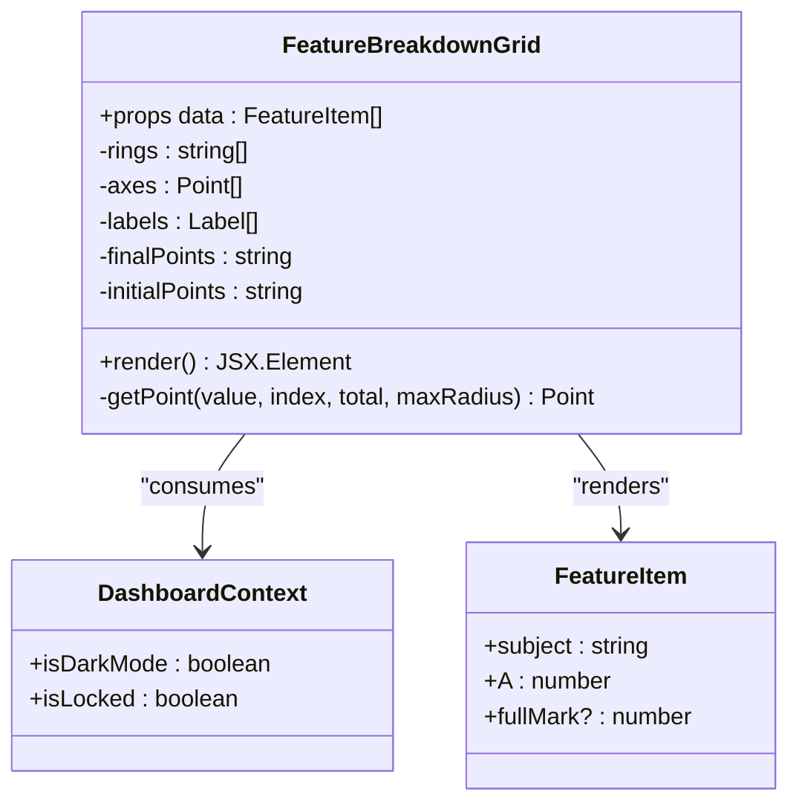
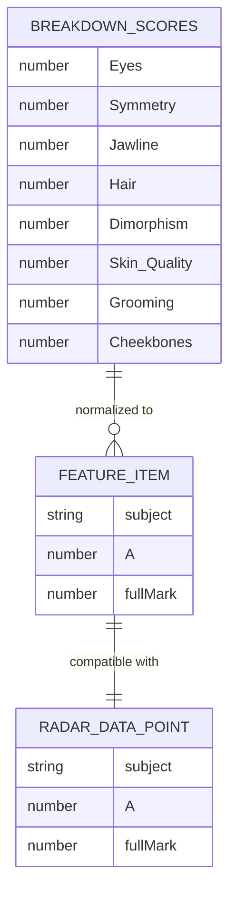
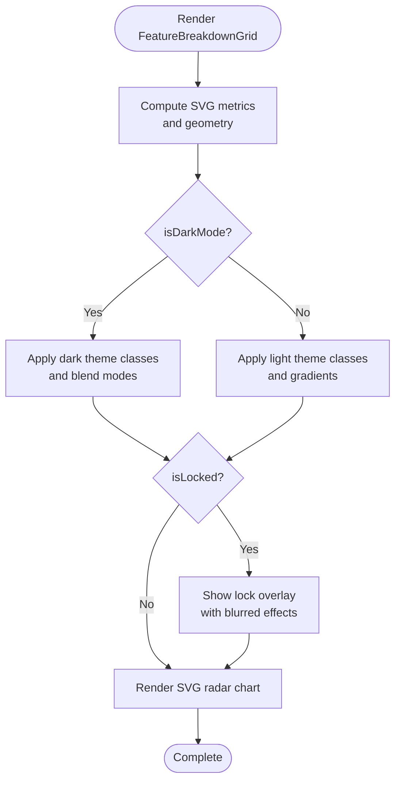
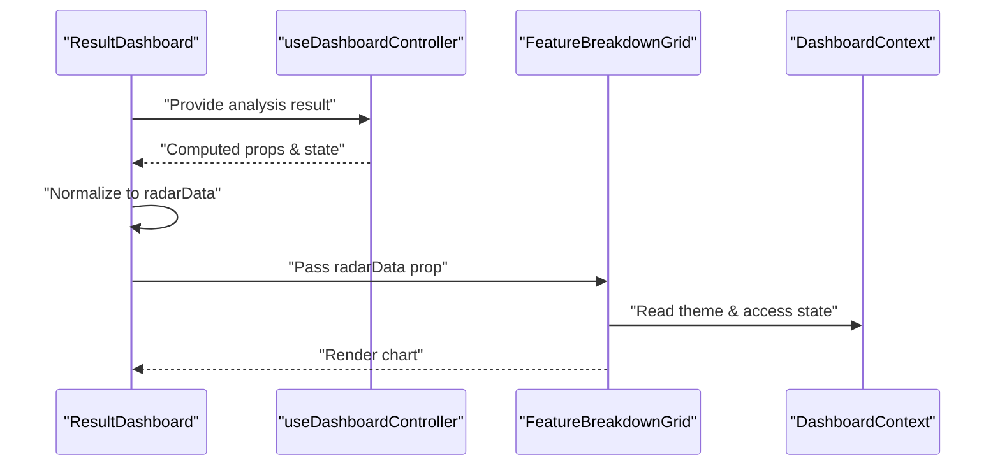
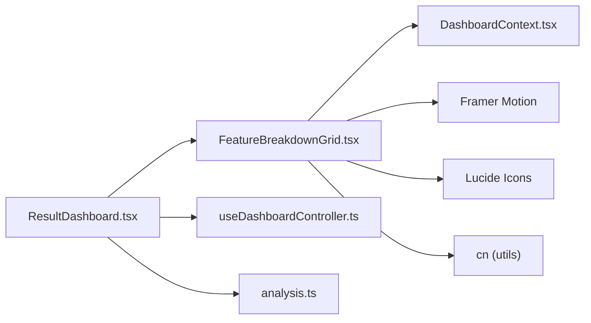

# Feature Breakdown Grid Component

<cite>
**Referenced Files in This Document**
- [FeatureBreakdownGrid.tsx](file://src/components/dashboard/FeatureBreakdownGrid.tsx)
- [ResultDashboard.tsx](file://src/components/ResultDashboard.tsx)
- [useDashboardController.ts](file://src/features/dashboard/useDashboardController.ts)
- [DashboardContext.tsx](file://src/context/DashboardContext.tsx)
- [analysis.ts](file://src/types/analysis.ts)
- [ScoreSection.tsx](file://src/components/dashboard/ScoreSection.tsx)
</cite>

## Table of Contents
1. [Introduction](#introduction)
2. [Project Structure](#project-structure)
3. [Core Components](#core-components)
4. [Architecture Overview](#architecture-overview)
5. [Detailed Component Analysis](#detailed-component-analysis)
6. [Dependency Analysis](#dependency-analysis)
7. [Performance Considerations](#performance-considerations)
8. [Troubleshooting Guide](#troubleshooting-guide)
9. [Conclusion](#conclusion)

## Introduction
The Feature Breakdown Grid component presents a comprehensive, radar-style visualization of facial feature scores derived from AI-powered analysis. It renders a dynamic SVG-based polygon chart that displays multi-dimensional facial metrics, with smooth animations and adaptive theming for light/dark modes. The component integrates tightly with the dashboard's state management and supports a lock/unlock mechanism for premium feature access.

## Project Structure
The Feature Breakdown Grid resides within the dashboard components and is orchestrated by the ResultDashboard. It consumes normalized radar data and leverages shared context for theme and access control.

**Diagram sources**
- [ResultDashboard.tsx:450-471](file://src/components/ResultDashboard.tsx#L450-L471)
- [FeatureBreakdownGrid.tsx:17-280](file://src/components/dashboard/FeatureBreakdownGrid.tsx#L17-L280)
- [DashboardContext.tsx:1-33](file://src/context/DashboardContext.tsx#L1-L33)
- [analysis.ts:67-124](file://src/types/analysis.ts#L67-L124)
- [ScoreSection.tsx:96-232](file://src/components/dashboard/ScoreSection.tsx#L96-L232)

**Section sources**
- [ResultDashboard.tsx:450-471](file://src/components/ResultDashboard.tsx#L450-L471)
- [FeatureBreakdownGrid.tsx:17-280](file://src/components/dashboard/FeatureBreakdownGrid.tsx#L17-L280)
- [DashboardContext.tsx:1-33](file://src/context/DashboardContext.tsx#L1-L33)
- [analysis.ts:67-124](file://src/types/analysis.ts#L67-L124)
- [ScoreSection.tsx:96-232](file://src/components/dashboard/ScoreSection.tsx#L96-L232)

## Core Components
- FeatureBreakdownGrid: Renders a responsive radar chart with animated polygon fill, concentric rings, axis lines, and labeled points. Supports lock mode with blurred overlays and placeholder shapes for restricted metrics.
- DashboardContext: Provides theme-aware rendering and access control state to all dashboard components.
- ResultDashboard: Normalizes analysis data into radar-friendly format and passes it to child components.
- useDashboardController: Centralizes computed data and UI state for the dashboard.
- analysis.ts: Defines strict TypeScript interfaces for breakdown scores and radar data points.

Key capabilities:
- Dynamic SVG generation for rings, axes, labels, and polygon fill
- Smooth entrance animations via Framer Motion
- Lock mode with blurred overlays and randomized placeholder shapes
- Responsive sizing with aspect-ratio constraints
- Gradient fills, glow effects, and blend-mode adjustments for theme adaptation

**Section sources**
- [FeatureBreakdownGrid.tsx:17-280](file://src/components/dashboard/FeatureBreakdownGrid.tsx#L17-L280)
- [DashboardContext.tsx:1-33](file://src/context/DashboardContext.tsx#L1-L33)
- [ResultDashboard.tsx:450-471](file://src/components/ResultDashboard.tsx#L450-L471)
- [useDashboardController.ts:4-101](file://src/features/dashboard/useDashboardController.ts#L4-L101)
- [analysis.ts:67-124](file://src/types/analysis.ts#L67-L124)

## Architecture Overview
The Feature Breakdown Grid participates in a data-driven dashboard architecture. ResultDashboard computes radar data from raw analysis results, then passes it to the grid component. The grid reads theme and access state from DashboardContext to adapt visuals and behavior.

**Diagram sources**
- [ResultDashboard.tsx:450-471](file://src/components/ResultDashboard.tsx#L450-L471)
- [useDashboardController.ts:4-101](file://src/features/dashboard/useDashboardController.ts#L4-L101)
- [FeatureBreakdownGrid.tsx:17-280](file://src/components/dashboard/FeatureBreakdownGrid.tsx#L17-L280)
- [DashboardContext.tsx:26-32](file://src/context/DashboardContext.tsx#L26-L32)

## Detailed Component Analysis

### FeatureBreakdownGrid Implementation
The grid component encapsulates:
- Data model: FeatureItem with subject, score (A), and optional fullMark
- SVG constants: fixed canvas size, center, max radius, and concentric ring count
- Geometry helpers: polar-to-Cartesian conversion for points
- Memoized computations: rings, axes, labels, polygon points, and initial animation points
- Conditional rendering: lock overlay, blurred effects, and randomized placeholder shapes for locked metrics
- Theming: dynamic colors, gradients, and blend modes based on dark/light mode

**Diagram sources**
- [FeatureBreakdownGrid.tsx:7-15](file://src/components/dashboard/FeatureBreakdownGrid.tsx#L7-L15)
- [FeatureBreakdownGrid.tsx:17-280](file://src/components/dashboard/FeatureBreakdownGrid.tsx#L17-L280)
- [DashboardContext.tsx:3-12](file://src/context/DashboardContext.tsx#L3-L12)

**Section sources**
- [FeatureBreakdownGrid.tsx:7-15](file://src/components/dashboard/FeatureBreakdownGrid.tsx#L7-L15)
- [FeatureBreakdownGrid.tsx:17-280](file://src/components/dashboard/FeatureBreakdownGrid.tsx#L17-L280)
- [DashboardContext.tsx:3-12](file://src/context/DashboardContext.tsx#L3-L12)

### Data Model and Scoring System
The component expects an array of FeatureItem objects. The underlying analysis types define:
- BreakdownScores: named feature categories with numeric scores
- RadarDataPoint: standardized radar input with subject, score (A), and fullMark

**Diagram sources**
- [FeatureBreakdownGrid.tsx:7-15](file://src/components/dashboard/FeatureBreakdownGrid.tsx#L7-L15)
- [analysis.ts:67-77](file://src/types/analysis.ts#L67-L77)
- [analysis.ts:120-124](file://src/types/analysis.ts#L120-L124)

**Section sources**
- [analysis.ts:67-77](file://src/types/analysis.ts#L67-L77)
- [analysis.ts:120-124](file://src/types/analysis.ts#L120-L124)

### Responsive Layout and Styling
- The grid uses a fixed SVG canvas with aspect-square layout and a max-width constraint for optimal scaling across devices
- Tailwind classes manage padding, rounded corners, borders, shadows, and theme-specific backgrounds
- Motion animations provide staggered entrance for polygon fill and vertex dots
- Lock mode applies blur filters and reduced opacity for non-privileged metrics

**Diagram sources**
- [FeatureBreakdownGrid.tsx:110-124](file://src/components/dashboard/FeatureBreakdownGrid.tsx#L110-L124)
- [FeatureBreakdownGrid.tsx:150-169](file://src/components/dashboard/FeatureBreakdownGrid.tsx#L150-L169)
- [FeatureBreakdownGrid.tsx:234-244](file://src/components/dashboard/FeatureBreakdownGrid.tsx#L234-L244)

**Section sources**
- [FeatureBreakdownGrid.tsx:110-124](file://src/components/dashboard/FeatureBreakdownGrid.tsx#L110-L124)
- [FeatureBreakdownGrid.tsx:150-169](file://src/components/dashboard/FeatureBreakdownGrid.tsx#L150-L169)
- [FeatureBreakdownGrid.tsx:234-244](file://src/components/dashboard/FeatureBreakdownGrid.tsx#L234-L244)

### Integration with Dashboard Controller and Data Flow
ResultDashboard constructs radarData from analysis results and passes it to child components. The dashboard controller normalizes analysis insights and computed metrics. FeatureBreakdownGrid consumes this data and DashboardContext for theme and access state.

**Diagram sources**
- [ResultDashboard.tsx:450-471](file://src/components/ResultDashboard.tsx#L450-L471)
- [useDashboardController.ts:4-101](file://src/features/dashboard/useDashboardController.ts#L4-L101)
- [FeatureBreakdownGrid.tsx:17-280](file://src/components/dashboard/FeatureBreakdownGrid.tsx#L17-L280)
- [DashboardContext.tsx:26-32](file://src/context/DashboardContext.tsx#L26-L32)

**Section sources**
- [ResultDashboard.tsx:450-471](file://src/components/ResultDashboard.tsx#L450-L471)
- [useDashboardController.ts:4-101](file://src/features/dashboard/useDashboardController.ts#L4-L101)

### Feature Categorization and Score Visualization Patterns
- Categories: Eyes, Symmetry, Jawline, Hair, Dimorphism, plus optional Skin Quality, Grooming, Cheekbones
- Visualization pattern: Concentric rings represent score thresholds; axes connect center to outer points; polygon fill encodes the composite profile
- Label placement: Positioned outside the chart with automatic text-anchor alignment based on X-coordinate
- Lock behavior: Certain metrics remain hidden or blurred; others show randomized placeholder shapes

**Section sources**
- [ResultDashboard.tsx:450-471](file://src/components/ResultDashboard.tsx#L450-L471)
- [FeatureBreakdownGrid.tsx:66-83](file://src/components/dashboard/FeatureBreakdownGrid.tsx#L66-L83)
- [FeatureBreakdownGrid.tsx:250-272](file://src/components/dashboard/FeatureBreakdownGrid.tsx#L250-L272)

### Interactive States and Animations
- Entrance animations: Polygon fill and vertex dots animate in with spring easing after viewport intersection
- Hover states: While the grid itself is static, surrounding dashboard cards and buttons demonstrate hover interactions
- Lock overlay: Semi-transparent modal with blur effect and call-to-action to unlock premium features

**Section sources**
- [FeatureBreakdownGrid.tsx:234-244](file://src/components/dashboard/FeatureBreakdownGrid.tsx#L234-L244)
- [FeatureBreakdownGrid.tsx:260-271](file://src/components/dashboard/FeatureBreakdownGrid.tsx#L260-L271)
- [FeatureBreakdownGrid.tsx:153-163](file://src/components/dashboard/FeatureBreakdownGrid.tsx#L153-L163)

### Styling Customization and Theme Adaptation
- Theme-aware colors: Backgrounds, borders, gradients, and text colors adapt to dark/light mode
- Blend modes: Mix-blend-mode adjusts for dark theme to achieve desired visual effects
- Gradients and glows: Linear gradients and SVG filters provide depth and vibrancy
- Lock styling: Blur filters and reduced opacity communicate restricted access

**Section sources**
- [FeatureBreakdownGrid.tsx:118-123](file://src/components/dashboard/FeatureBreakdownGrid.tsx#L118-L123)
- [FeatureBreakdownGrid.tsx:171-180](file://src/components/dashboard/FeatureBreakdownGrid.tsx#L171-L180)
- [FeatureBreakdownGrid.tsx:243](file://src/components/dashboard/FeatureBreakdownGrid.tsx#L243)

## Dependency Analysis
The Feature Breakdown Grid depends on:
- DashboardContext for theme and access state
- Framer Motion for animations
- Lucide icons for lock and target indicators
- Tailwind utility classes for responsive layout and theming

**Diagram sources**
- [FeatureBreakdownGrid.tsx:1-5](file://src/components/dashboard/FeatureBreakdownGrid.tsx#L1-L5)
- [DashboardContext.tsx:1-33](file://src/context/DashboardContext.tsx#L1-L33)
- [ResultDashboard.tsx:17-34](file://src/components/ResultDashboard.tsx#L17-L34)
- [useDashboardController.ts:1-101](file://src/features/dashboard/useDashboardController.ts#L1-L101)
- [analysis.ts:1-143](file://src/types/analysis.ts#L1-L143)

**Section sources**
- [FeatureBreakdownGrid.tsx:1-5](file://src/components/dashboard/FeatureBreakdownGrid.tsx#L1-L5)
- [DashboardContext.tsx:1-33](file://src/context/DashboardContext.tsx#L1-L33)
- [ResultDashboard.tsx:17-34](file://src/components/ResultDashboard.tsx#L17-L34)
- [useDashboardController.ts:1-101](file://src/features/dashboard/useDashboardController.ts#L1-L101)
- [analysis.ts:1-143](file://src/types/analysis.ts#L1-L143)

## Performance Considerations
- Memoization: Uses useMemo for expensive SVG geometry computations to avoid re-renders
- Conditional rendering: Lock mode short-circuits heavy DOM updates with overlays and placeholders
- Animation budget: Motion animations are scoped to viewport intersections to minimize layout thrash
- SVG optimization: Static gradients and filters are defined once in defs for reuse

[No sources needed since this section provides general guidance]

## Troubleshooting Guide
Common issues and resolutions:
- Missing theme context: Ensure DashboardProvider wraps the grid with proper isDarkMode and isLocked values
- Empty or invalid data: Verify radarData array contains at least three points and numeric scores
- Lock overlay not appearing: Confirm isLocked flag is passed from DashboardContext and matches expected keys
- Animation not triggering: Check viewport intersection settings and ensure elements are within view during initial load

**Section sources**
- [DashboardContext.tsx:26-32](file://src/context/DashboardContext.tsx#L26-L32)
- [FeatureBreakdownGrid.tsx:20-25](file://src/components/dashboard/FeatureBreakdownGrid.tsx#L20-L25)
- [FeatureBreakdownGrid.tsx:153-163](file://src/components/dashboard/FeatureBreakdownGrid.tsx#L153-L163)

## Conclusion
The Feature Breakdown Grid delivers a polished, theme-adaptive radar visualization for facial feature analysis. Its modular design, robust data model, and tight integration with dashboard state management enable seamless presentation of complex multi-dimensional scores. The component balances performance with rich visual feedback, supporting both free and premium user experiences through lock-aware rendering.