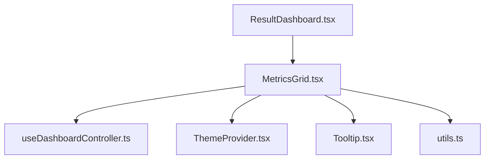
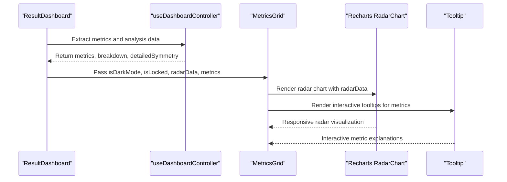
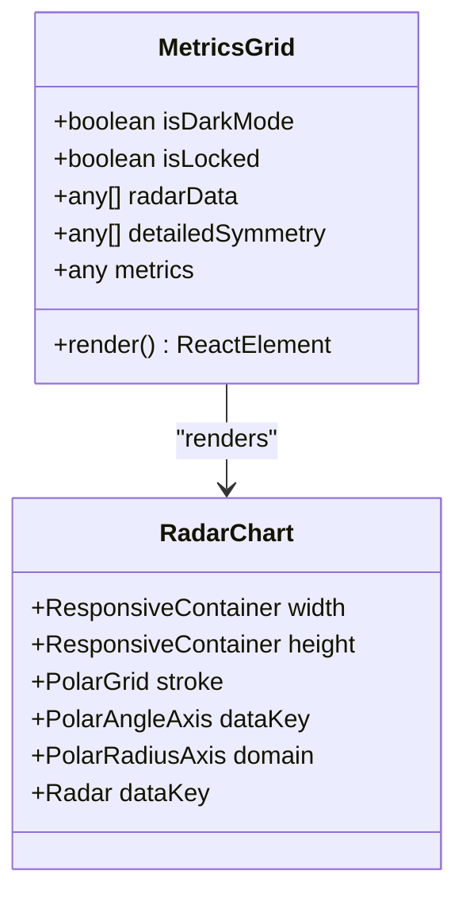
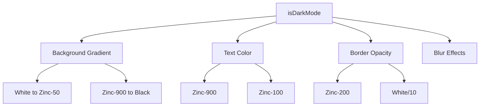
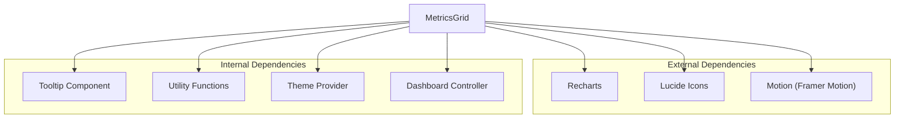

# Metrics Grid Component

<cite>
**Referenced Files in This Document**
- [MetricsGrid.tsx](file://src/components/dashboard/MetricsGrid.tsx)
- [Tooltip.tsx](file://src/components/Tooltip.tsx)
- [ResultDashboard.tsx](file://src/components/ResultDashboard.tsx)
- [useDashboardController.ts](file://src/features/dashboard/useDashboardController.ts)
- [ThemeProvider.tsx](file://src/context/ThemeProvider.tsx)
- [utils.ts](file://src/lib/utils.ts)
</cite>

## Table of Contents
1. [Introduction](#introduction)
2. [Project Structure](#project-structure)
3. [Core Components](#core-components)
4. [Architecture Overview](#architecture-overview)
5. [Detailed Component Analysis](#detailed-component-analysis)
6. [Dependency Analysis](#dependency-analysis)
7. [Performance Considerations](#performance-considerations)
8. [Troubleshooting Guide](#troubleshooting-guide)
9. [Conclusion](#conclusion)

## Introduction
The Metrics Grid component presents facial analysis results through a dual-panel interface: a radar chart visualization for multi-dimensional facial measurements and a grid of raw measurement cards. It integrates Recharts for responsive radar charts, implements dark mode theming with gradient backgrounds, and provides interactive tooltips for metric explanations. The component supports lock/unlock states for premium features and includes hover animations for enhanced user experience.

## Project Structure
The Metrics Grid resides in the dashboard components and works alongside the dashboard controller and theme provider to deliver a cohesive results presentation.

**Diagram sources**
- [ResultDashboard.tsx:315-358](file://src/components/ResultDashboard.tsx#L315-L358)
- [MetricsGrid.tsx:23-29](file://src/components/dashboard/MetricsGrid.tsx#L23-L29)
- [useDashboardController.ts:4-13](file://src/features/dashboard/useDashboardController.ts#L4-L13)
- [ThemeProvider.tsx:12-38](file://src/context/ThemeProvider.tsx#L12-L38)
- [Tooltip.tsx:10-35](file://src/components/Tooltip.tsx#L10-L35)
- [utils.ts:4-6](file://src/lib/utils.ts#L4-L6)

**Section sources**
- [MetricsGrid.tsx:1-267](file://src/components/dashboard/MetricsGrid.tsx#L1-L267)
- [ResultDashboard.tsx:315-358](file://src/components/ResultDashboard.tsx#L315-L358)

## Core Components
The Metrics Grid component consists of two primary sections:
- Harmony Radar: A Recharts-based radar chart displaying multi-dimensional facial metrics with responsive sizing and dark/light theme support.
- Raw Measurements: A grid of measurement cards showing symmetry, canthal tilt, fWHR, and golden ratio with interactive tooltips and hover animations.

Key props interface:
- isDarkMode: boolean - Controls dark/light theme application
- isLocked: boolean - Enables/disables premium feature access
- radarData: any[] - Data array for radar chart rendering
- detailedSymmetry: any[] - Additional symmetry analysis data
- metrics: any - Object containing raw measurement values

**Section sources**
- [MetricsGrid.tsx:15-21](file://src/components/dashboard/MetricsGrid.tsx#L15-L21)
- [MetricsGrid.tsx:23-29](file://src/components/dashboard/MetricsGrid.tsx#L23-L29)

## Architecture Overview
The Metrics Grid integrates with the dashboard controller to receive processed analysis data and with the theme provider to adapt visuals to user preferences. The radar chart leverages Recharts for responsive rendering, while measurement cards utilize Tailwind CSS classes for styling and hover effects.

**Diagram sources**
- [ResultDashboard.tsx:347-358](file://src/components/ResultDashboard.tsx#L347-L358)
- [useDashboardController.ts:42-60](file://src/features/dashboard/useDashboardController.ts#L42-L60)
- [MetricsGrid.tsx:82-103](file://src/components/dashboard/MetricsGrid.tsx#L82-L103)
- [Tooltip.tsx:10-35](file://src/components/Tooltip.tsx#L10-L35)

## Detailed Component Analysis

### Radar Chart Visualization
The radar chart displays multi-dimensional facial measurements using Recharts. It includes:
- Responsive container ensuring proper scaling across devices
- Polar grid with configurable stroke opacity for dark/light modes
- Polar angle axis with theme-aware tick styling
- Polar radius axis customized for the 0-10 scoring range
- Radar series with theme-specific colors and transparency

**Diagram sources**
- [MetricsGrid.tsx:82-103](file://src/components/dashboard/MetricsGrid.tsx#L82-L103)

**Section sources**
- [MetricsGrid.tsx:82-103](file://src/components/dashboard/MetricsGrid.tsx#L82-L103)

### Grid Layout System
The component uses a responsive grid system:
- Single column on mobile (lg breakpoint)
- Two-column layout on larger screens
- Consistent spacing and padding across breakpoints
- Card containers with rounded corners, shadows, and borders

Measurement cards implement:
- Hover animations with translateY transitions
- Theme-aware borders and backgrounds
- Typography hierarchy with uppercase labels and bold values
- Lock state handling for premium metrics

**Section sources**
- [MetricsGrid.tsx:142-261](file://src/components/dashboard/MetricsGrid.tsx#L142-L261)

### Dark Mode Theming Implementation
The component applies dark mode through:
- Gradient backgrounds transitioning from white to light gray (light mode) or black to dark gray (dark mode)
- Theme-aware text colors for headings, labels, and values
- Border styling with alpha transparency for depth perception
- Blur effects and translucent overlays for visual enhancement

**Diagram sources**
- [MetricsGrid.tsx:54-58](file://src/components/dashboard/MetricsGrid.tsx#L54-L58)
- [MetricsGrid.tsx:34-37](file://src/components/dashboard/MetricsGrid.tsx#L34-L37)
- [MetricsGrid.tsx:111-115](file://src/components/dashboard/MetricsGrid.tsx#L111-L115)

**Section sources**
- [MetricsGrid.tsx:34-58](file://src/components/dashboard/MetricsGrid.tsx#L34-L58)
- [MetricsGrid.tsx:111-115](file://src/components/dashboard/MetricsGrid.tsx#L111-L115)

### Tooltip Integration
Interactive tooltips provide metric explanations:
- Lucide Info icon triggers tooltip visibility
- Motion library animations for smooth enter/exit transitions
- Theme-aware styling with contrasting backgrounds and borders
- Absolute positioning with translation transforms
- Content-driven tooltip text for each metric

**Section sources**
- [MetricsGrid.tsx:185-188](file://src/components/dashboard/MetricsGrid.tsx#L185-L188)
- [MetricsGrid.tsx:216-219](file://src/components/dashboard/MetricsGrid.tsx#L216-L219)
- [MetricsGrid.tsx:247-250](file://src/components/dashboard/MetricsGrid.tsx#L247-L250)
- [Tooltip.tsx:10-35](file://src/components/Tooltip.tsx#L10-L35)

### Hover Animation Effects
Measurement cards feature sophisticated hover interactions:
- Transition-all duration for smooth animations
- Negative translateY for lift effect on hover
- Enhanced shadow or increased background opacity in light mode
- Subtle elevation in dark mode with increased translucency

**Section sources**
- [MetricsGrid.tsx:145-149](file://src/components/dashboard/MetricsGrid.tsx#L145-L149)
- [MetricsGrid.tsx:170-174](file://src/components/dashboard/MetricsGrid.tsx#L170-L174)
- [MetricsGrid.tsx:201-205](file://src/components/dashboard/MetricsGrid.tsx#L201-L205)
- [MetricsGrid.tsx:232-236](file://src/components/dashboard/MetricsGrid.tsx#L232-L236)

### Data Binding Patterns
The component binds to external data through:
- Dashboard controller extraction of metrics and analysis
- Radar data construction from breakdown scores
- Conditional rendering based on lock state
- Dynamic value formatting and unit handling

**Section sources**
- [ResultDashboard.tsx:347-358](file://src/components/ResultDashboard.tsx#L347-L358)
- [ResultDashboard.tsx:450-471](file://src/components/ResultDashboard.tsx#L450-L471)
- [MetricsGrid.tsx:165-166](file://src/components/dashboard/MetricsGrid.tsx#L165-L166)
- [MetricsGrid.tsx:196-197](file://src/components/dashboard/MetricsGrid.tsx#L196-L197)
- [MetricsGrid.tsx:227-228](file://src/components/dashboard/MetricsGrid.tsx#L227-L228)
- [MetricsGrid.tsx:258-259](file://src/components/dashboard/MetricsGrid.tsx#L258-L259)

## Dependency Analysis
The Metrics Grid component depends on several supporting systems:

**Diagram sources**
- [MetricsGrid.tsx:1-13](file://src/components/dashboard/MetricsGrid.tsx#L1-L13)
- [Tooltip.tsx:1-3](file://src/components/Tooltip.tsx#L1-L3)
- [ThemeProvider.tsx:1-48](file://src/context/ThemeProvider.tsx#L1-L48)
- [useDashboardController.ts:1-101](file://src/features/dashboard/useDashboardController.ts#L1-L101)

**Section sources**
- [MetricsGrid.tsx:1-13](file://src/components/dashboard/MetricsGrid.tsx#L1-L13)
- [Tooltip.tsx:1-3](file://src/components/Tooltip.tsx#L1-L3)
- [ThemeProvider.tsx:1-48](file://src/context/ThemeProvider.tsx#L1-L48)
- [useDashboardController.ts:1-101](file://src/features/dashboard/useDashboardController.ts#L1-L101)

## Performance Considerations
- ResponsiveContainer ensures optimal chart rendering across device sizes
- Memoized radar data construction prevents unnecessary re-renders
- Conditional rendering for lock state reduces DOM complexity
- CSS transitions leverage GPU acceleration for smooth animations
- Theme switching uses CSS classes for efficient updates

## Troubleshooting Guide
Common issues and solutions:
- Chart not rendering: Verify radarData contains valid numeric values and proper structure
- Tooltip not appearing: Check mouse event handlers and theme context propagation
- Dark mode inconsistencies: Ensure ThemeProvider is properly wrapping the component tree
- Lock state not working: Confirm isLocked prop is correctly passed from dashboard context
- Measurement values showing as locked: Verify metrics object contains expected properties

**Section sources**
- [MetricsGrid.tsx:165-166](file://src/components/dashboard/MetricsGrid.tsx#L165-L166)
- [MetricsGrid.tsx:196-197](file://src/components/dashboard/MetricsGrid.tsx#L196-L197)
- [MetricsGrid.tsx:227-228](file://src/components/dashboard/MetricsGrid.tsx#L227-L228)
- [MetricsGrid.tsx:258-259](file://src/components/dashboard/MetricsGrid.tsx#L258-L259)

## Conclusion
The Metrics Grid component provides a comprehensive solution for presenting facial analysis results through an intuitive dual-panel design. Its integration with Recharts enables dynamic radar visualization, while the responsive grid layout ensures accessibility across devices. The dark mode theming system delivers a premium aesthetic, and the interactive tooltip system enhances user understanding of complex metrics. The component's modular architecture and clear data binding patterns make it maintainable and extensible for future enhancements.