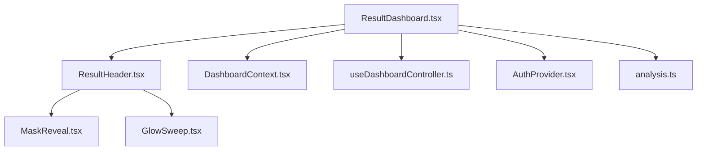
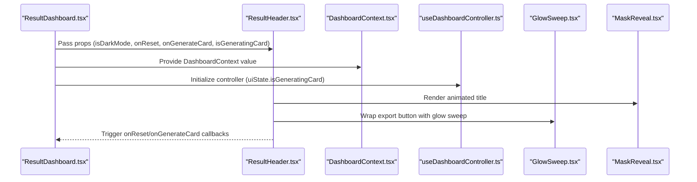
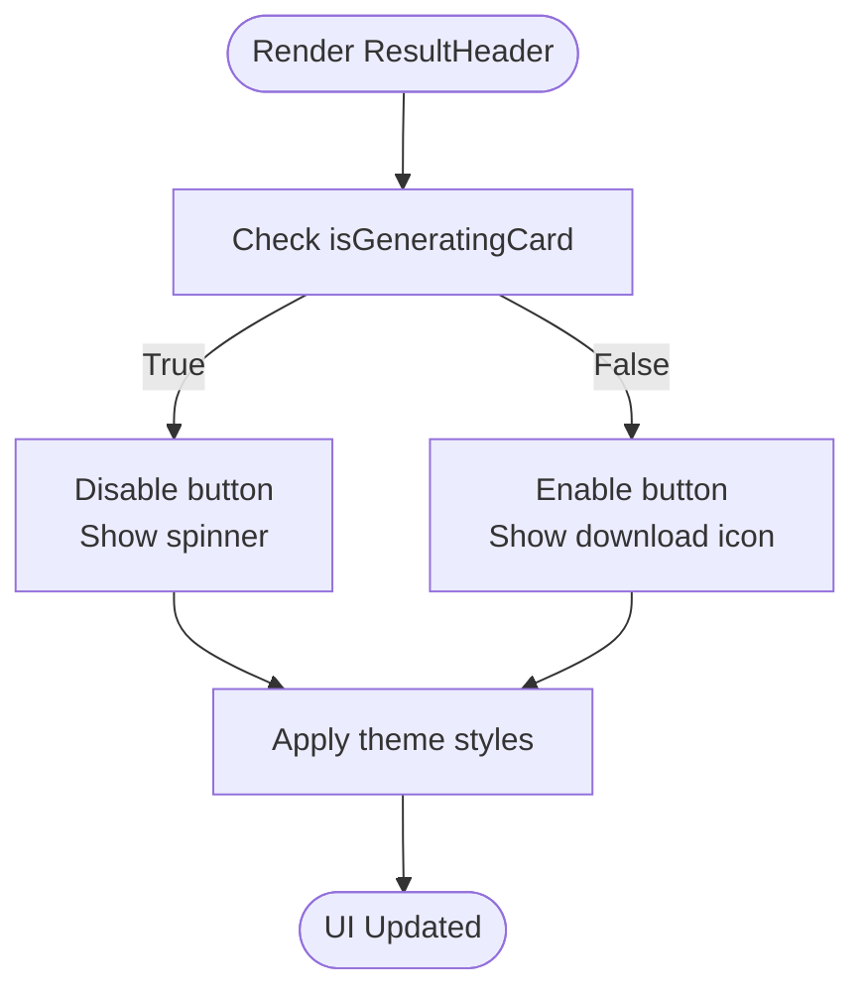
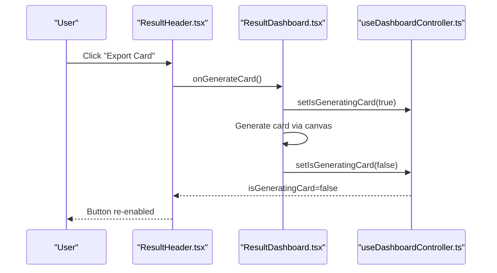
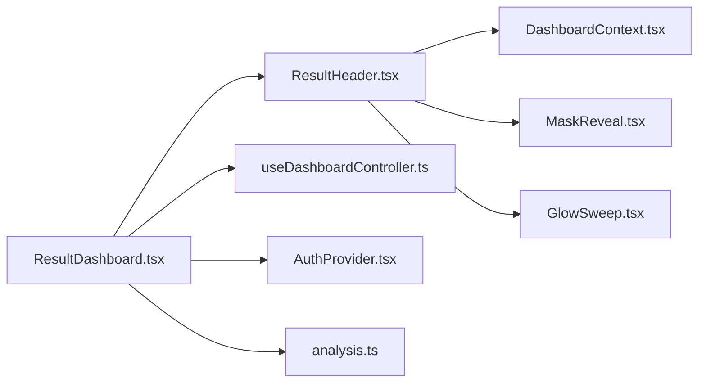

# Result Header Component

<cite>
**Referenced Files in This Document**
- [ResultHeader.tsx](file://src/components/dashboard/ResultHeader.tsx)
- [ResultDashboard.tsx](file://src/components/ResultDashboard.tsx)
- [DashboardContext.tsx](file://src/context/DashboardContext.tsx)
- [AuthProvider.tsx](file://src/context/AuthProvider.tsx)
- [useDashboardController.ts](file://src/features/dashboard/useDashboardController.ts)
- [GlowSweep.tsx](file://src/components/motion/GlowSweep.tsx)
- [MaskReveal.tsx](file://src/components/motion/MaskReveal.tsx)
- [analysis.ts](file://src/types/analysis.ts)
</cite>

## Table of Contents
1. [Introduction](#introduction)
2. [Project Structure](#project-structure)
3. [Core Components](#core-components)
4. [Architecture Overview](#architecture-overview)
5. [Detailed Component Analysis](#detailed-component-analysis)
6. [Dependency Analysis](#dependency-analysis)
7. [Performance Considerations](#performance-considerations)
8. [Troubleshooting Guide](#troubleshooting-guide)
9. [Conclusion](#conclusion)

## Introduction
This document provides a comprehensive guide to the ResultHeader component, which presents the analysis summary and user-facing controls at the top of the ResultDashboard. It explains the layout structure, typography and visual hierarchy, integration with authentication and analysis contexts, conditional rendering patterns, responsive design, and accessibility considerations.

## Project Structure
ResultHeader is part of the dashboard feature set and is embedded within the ResultDashboard page. It receives props for theme, actions, and state related to card generation. The dashboard wires up the component via a shared controller and context provider.

**Diagram sources**
- [ResultDashboard.tsx:785-791](file://src/components/ResultDashboard.tsx#L785-L791)
- [ResultHeader.tsx:14-19](file://src/components/dashboard/ResultHeader.tsx#L14-L19)
- [DashboardContext.tsx:1-33](file://src/context/DashboardContext.tsx#L1-L33)
- [useDashboardController.ts:1-101](file://src/features/dashboard/useDashboardController.ts#L1-L101)
- [MaskReveal.tsx:1-96](file://src/components/motion/MaskReveal.tsx#L1-L96)
- [GlowSweep.tsx:1-63](file://src/components/motion/GlowSweep.tsx#L1-L63)
- [AuthProvider.tsx:1-75](file://src/context/AuthProvider.tsx#L1-L75)
- [analysis.ts:96-107](file://src/types/analysis.ts#L96-L107)

**Section sources**
- [ResultDashboard.tsx:785-791](file://src/components/ResultDashboard.tsx#L785-L791)
- [ResultHeader.tsx:14-19](file://src/components/dashboard/ResultHeader.tsx#L14-L19)

## Core Components
- ResultHeader: Renders the header section with animated title, subtitle, and export action.
- DashboardContext: Provides shared UI state (including card generation state) and theme to child components.
- useDashboardController: Centralizes analysis-derived state and UI actions for the dashboard.
- Motion primitives: MaskReveal and GlowSweep provide layered animations for text and CTA emphasis.

Key responsibilities:
- Present analysis branding and completion state.
- Offer quick actions: “New Scan” navigation and “Export Card” generation.
- Respect theme and motion preferences.
- Integrate with the broader dashboard state machine.

**Section sources**
- [ResultHeader.tsx:7-19](file://src/components/dashboard/ResultHeader.tsx#L7-L19)
- [DashboardContext.tsx:3-12](file://src/context/DashboardContext.tsx#L3-L12)
- [useDashboardController.ts:34-84](file://src/features/dashboard/useDashboardController.ts#L34-L84)

## Architecture Overview
ResultHeader participates in a unidirectional data flow:
- ResultDashboard composes the header and passes props for theme, actions, and state.
- DashboardContext exposes isDarkMode and isGeneratingCard to the header.
- useDashboardController supplies isGeneratingCard and related UI state.
- Motion components encapsulate animation behavior and respect motion tiers.

**Diagram sources**
- [ResultDashboard.tsx:785-791](file://src/components/ResultDashboard.tsx#L785-L791)
- [ResultHeader.tsx:14-19](file://src/components/dashboard/ResultHeader.tsx#L14-L19)
- [DashboardContext.tsx:733-743](file://src/context/DashboardContext.tsx#L733-L743)
- [useDashboardController.ts:34-84](file://src/features/dashboard/useDashboardController.ts#L34-L84)
- [GlowSweep.tsx:18-62](file://src/components/motion/GlowSweep.tsx#L18-L62)
- [MaskReveal.tsx:20-95](file://src/components/motion/MaskReveal.tsx#L20-L95)

## Detailed Component Analysis

### Layout Structure
ResultHeader organizes content into two main areas:
- Left column: Branding and navigation affordance.
- Right column: Export action with animated feedback.

Responsive behavior:
- On small screens, the layout stacks vertically.
- On large screens, the layout becomes a horizontal row with aligned items.

Accessibility:
- Buttons use semantic roles and appropriate focus styles via Tailwind utilities.
- Animated elements are visually enhanced but do not replace textual labels.

**Section sources**
- [ResultHeader.tsx:21-21](file://src/components/dashboard/ResultHeader.tsx#L21-L21)

### Typography and Visual Hierarchy
Typography hierarchy emphasizes:
- Primary headline: Large, bold, italicized with gradient accent for emphasis.
- Subheadline: Light, readable text below the headline.
- Action labels: Caps, bold weights, and tracking for clarity.

Visual emphasis:
- Gradient text for the “Complete.” portion of the headline.
- Animated reveal for text elements using MaskReveal.
- Subtle glow sweep behind the export button for prominence.

**Section sources**
- [ResultHeader.tsx:40-74](file://src/components/dashboard/ResultHeader.tsx#L40-L74)
- [MaskReveal.tsx:20-95](file://src/components/motion/MaskReveal.tsx#L20-L95)
- [GlowSweep.tsx:18-62](file://src/components/motion/GlowSweep.tsx#L18-L62)

### Integration with Authentication and Analysis Contexts
- Authentication context (AuthProvider) provides user identity and loading state to the dashboard. While ResultHeader itself does not render user avatars, the dashboard can pass user data to higher-level components for profile-related displays.
- Analysis context (useDashboardController) manages isGeneratingCard and related UI state. ResultHeader reads this state to disable the export button and adjust visuals accordingly.
- DashboardContext exposes isDarkMode and isGeneratingCard to ResultHeader, enabling theme-aware styling and state-driven UI.

Conditional rendering examples:
- Export button text and icon change based on isGeneratingCard.
- Button appearance and interactivity adapt to the current state.
- Motion effects are gated by motion tier and reduced-motion preferences.

**Section sources**
- [AuthProvider.tsx:68-74](file://src/context/AuthProvider.tsx#L68-L74)
- [useDashboardController.ts:34-84](file://src/features/dashboard/useDashboardController.ts#L34-L84)
- [DashboardContext.tsx:26-32](file://src/context/DashboardContext.tsx#L26-L32)
- [ResultHeader.tsx:88-129](file://src/components/dashboard/ResultHeader.tsx#L88-L129)

### Responsive Design and Mobile-First Approach
- Base layout stacks vertically for narrow screens.
- On large screens, the layout switches to a horizontal arrangement with centered alignment.
- Typography scales progressively across breakpoints to maintain readability.
- Motion effects are tiered to preserve performance on lower-tier devices.

**Section sources**
- [ResultHeader.tsx:21-21](file://src/components/dashboard/ResultHeader.tsx#L21-L21)

### Accessibility Considerations
- Focus management: Buttons receive visible focus states through Tailwind utilities.
- Reduced motion: Motion primitives automatically fall back to simpler animations when reduced motion is preferred or motion is disabled.
- Screen reader support: Animated overlays are marked as decorative (aria-hidden) to avoid redundant announcements.
- Keyboard navigation: Interactive elements are focusable and operable via keyboard.

**Section sources**
- [GlowSweep.tsx:42-61](file://src/components/motion/GlowSweep.tsx#L42-L61)
- [MaskReveal.tsx:43-55](file://src/components/motion/MaskReveal.tsx#L43-L55)

### Conditional Rendering Patterns
- Export button state: When generating a card, the button is disabled and displays a spinner; otherwise, it shows a download icon and label.
- Theme-aware styling: Button and text colors invert depending on dark mode.
- Motion gating: Animations are suppressed or simplified based on motion tier and user preferences.

**Diagram sources**
- [ResultHeader.tsx:88-129](file://src/components/dashboard/ResultHeader.tsx#L88-L129)

**Section sources**
- [ResultHeader.tsx:88-129](file://src/components/dashboard/ResultHeader.tsx#L88-L129)

### Example Workflows

#### Export Card Generation

**Diagram sources**
- [ResultHeader.tsx:84-87](file://src/components/dashboard/ResultHeader.tsx#L84-L87)
- [ResultDashboard.tsx:482-689](file://src/components/ResultDashboard.tsx#L482-L689)
- [useDashboardController.ts:34-84](file://src/features/dashboard/useDashboardController.ts#L34-L84)

## Dependency Analysis
ResultHeader depends on:
- DashboardContext for theme and state.
- Motion components for animations.
- ResultDashboard for prop injection and action wiring.

**Diagram sources**
- [ResultHeader.tsx:1-6](file://src/components/dashboard/ResultHeader.tsx#L1-L6)
- [DashboardContext.tsx:1-33](file://src/context/DashboardContext.tsx#L1-L33)
- [MaskReveal.tsx:1-96](file://src/components/motion/MaskReveal.tsx#L1-L96)
- [GlowSweep.tsx:1-63](file://src/components/motion/GlowSweep.tsx#L1-L63)
- [ResultDashboard.tsx:785-791](file://src/components/ResultDashboard.tsx#L785-L791)
- [useDashboardController.ts:1-101](file://src/features/dashboard/useDashboardController.ts#L1-L101)
- [AuthProvider.tsx:1-75](file://src/context/AuthProvider.tsx#L1-L75)
- [analysis.ts:96-107](file://src/types/analysis.ts#L96-L107)

**Section sources**
- [ResultHeader.tsx:1-6](file://src/components/dashboard/ResultHeader.tsx#L1-L6)
- [ResultDashboard.tsx:785-791](file://src/components/ResultDashboard.tsx#L785-L791)

## Performance Considerations
- Motion tiering: Animations are disabled or simplified on lower tiers to preserve performance.
- Minimal re-renders: Props are passed directly to ResultHeader to avoid unnecessary recomputation.
- Canvas offloading: Card generation occurs in ResultDashboard’s dedicated handler, keeping the header lightweight.

## Troubleshooting Guide
Common issues and resolutions:
- Export button remains disabled: Verify isGeneratingCard transitions to false after the operation completes.
- Animations appear janky: Confirm motion tier is set appropriately and reduced-motion preferences are respected.
- Theme mismatch: Ensure isDarkMode is correctly propagated from the dashboard context.

**Section sources**
- [ResultHeader.tsx:88-129](file://src/components/dashboard/ResultHeader.tsx#L88-L129)
- [GlowSweep.tsx:32-37](file://src/components/motion/GlowSweep.tsx#L32-L37)
- [MaskReveal.tsx:40-41](file://src/components/motion/MaskReveal.tsx#L40-L41)

## Conclusion
ResultHeader delivers a concise, theme-aware header for the analysis dashboard with strong accessibility and responsive design. Its integration with DashboardContext and useDashboardController enables robust state handling and motion-friendly UI updates. The component’s layout, typography, and conditional rendering patterns align with a mobile-first approach and inclusive UX.