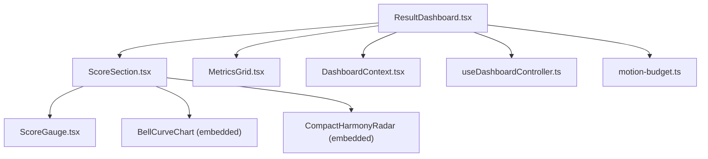
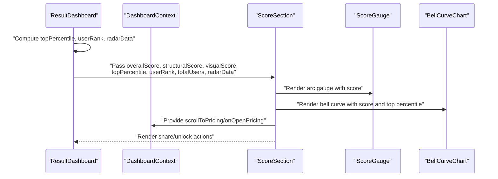
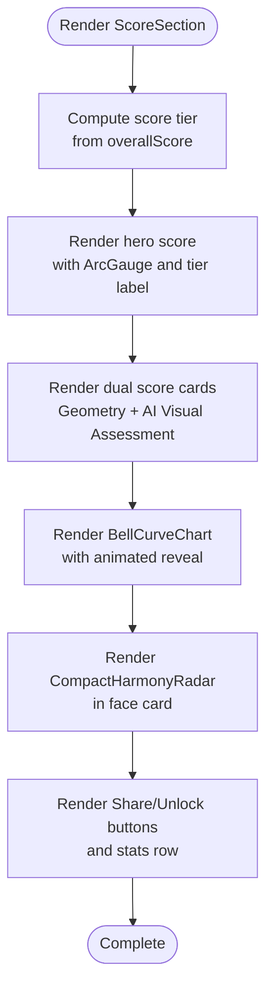
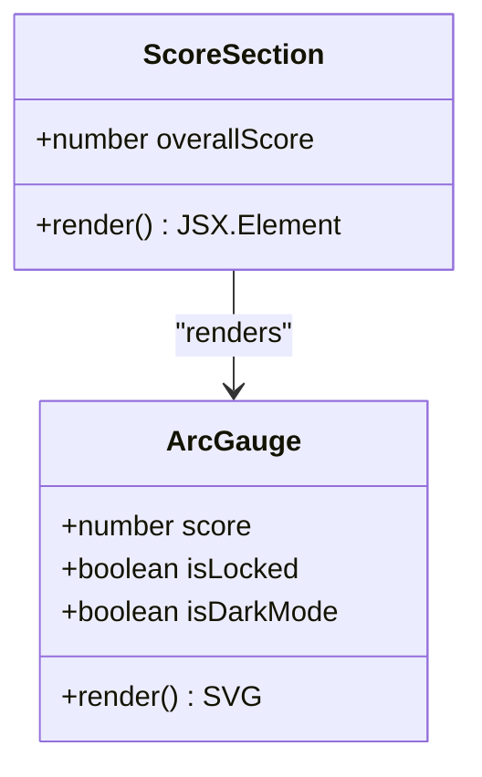
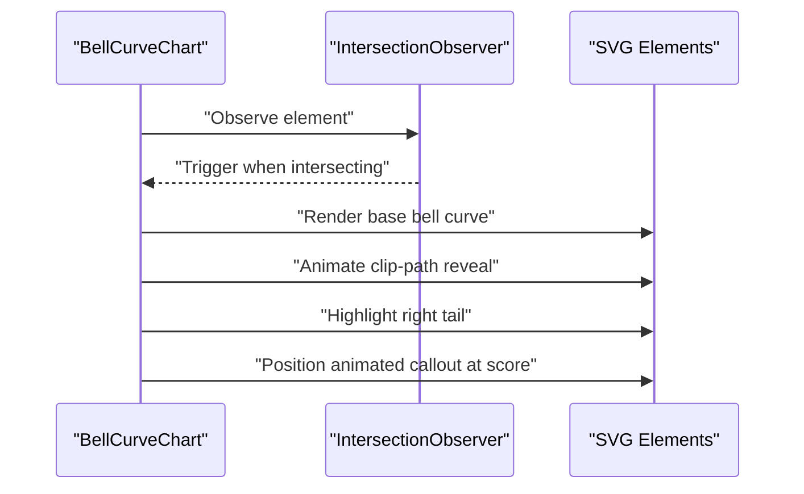
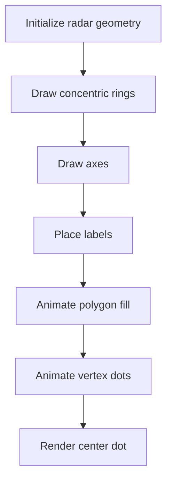
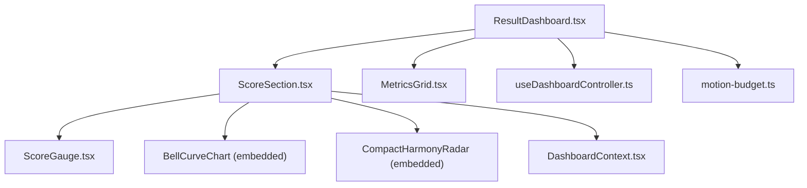

# Score Section Component

<cite>
**Referenced Files in This Document**
- [ScoreSection.tsx](file://src/components/dashboard/ScoreSection.tsx)
- [ScoreGauge.tsx](file://src/components/ScoreGauge.tsx)
- [ResultDashboard.tsx](file://src/components/ResultDashboard.tsx)
- [motion-budget.ts](file://src/lib/motion-budget.ts)
- [useDashboardController.ts](file://src/features/dashboard/useDashboardController.ts)
- [DashboardContext.tsx](file://src/context/DashboardContext.tsx)
- [MetricsGrid.tsx](file://src/components/dashboard/MetricsGrid.tsx)
</cite>

## Table of Contents
1. [Introduction](#introduction)
2. [Project Structure](#project-structure)
3. [Core Components](#core-components)
4. [Architecture Overview](#architecture-overview)
5. [Detailed Component Analysis](#detailed-component-analysis)
6. [Dependency Analysis](#dependency-analysis)
7. [Performance Considerations](#performance-considerations)
8. [Troubleshooting Guide](#troubleshooting-guide)
9. [Conclusion](#conclusion)

## Introduction
The Score Section component is the centerpiece of the dashboard, presenting the user's facial harmony score alongside supporting visualizations and contextual insights. It combines an animated arc gauge, a dual-score breakdown (geometry and AI visual assessment), a bell curve distribution chart, and a compact Harmony Radar for multi-dimensional feature comparison. The component emphasizes smooth animations, responsive design, and a dark/light mode–aware aesthetic, while integrating with the broader dashboard ecosystem for navigation, sharing, and monetization flows.

## Project Structure
The Score Section lives within the dashboard module and collaborates with several supporting components and utilities:
- Dashboard orchestration and data preparation in ResultDashboard and useDashboardController
- Motion budget and tier management for performance optimization
- Standalone ScoreGauge component for premium presentation
- MetricsGrid for complementary radar charts
- DashboardContext for shared UI actions

**Diagram sources**
- [ResultDashboard.tsx:315-800](file://src/components/ResultDashboard.tsx#L315-L800)
- [ScoreSection.tsx:681-1204](file://src/components/dashboard/ScoreSection.tsx#L681-L1204)
- [ScoreGauge.tsx:1-252](file://src/components/ScoreGauge.tsx#L1-L252)
- [MetricsGrid.tsx:1-267](file://src/components/dashboard/MetricsGrid.tsx#L1-L267)
- [DashboardContext.tsx:1-33](file://src/context/DashboardContext.tsx#L1-L33)
- [useDashboardController.ts:1-101](file://src/features/dashboard/useDashboardController.ts#L1-L101)
- [motion-budget.ts:1-89](file://src/lib/motion-budget.ts#L1-L89)

**Section sources**
- [ResultDashboard.tsx:315-800](file://src/components/ResultDashboard.tsx#L315-L800)
- [ScoreSection.tsx:681-1204](file://src/components/dashboard/ScoreSection.tsx#L681-L1204)

## Core Components
- ScoreSection: Orchestrates the hero score presentation, dual score breakdown, distribution visualization, and action buttons. It computes score tiers, handles share actions, and coordinates animations.
- ScoreGauge: A premium standalone gauge with animated arc fill, gradient tip, and counter with motion budget awareness.
- BellCurveChart: Renders a bell curve distribution with animated reveal, percentile highlighting, and a floating callout for the user’s score.
- CompactHarmonyRadar: A lightweight radar visualization embedded in the face card, showing multi-dimensional feature comparisons with animated polygon and vertex dots.

Key responsibilities:
- Visualization: Arc gauge, bell curve, radar, and dual score cards
- Interaction: Share button, unlock/pricing CTA, and stats display
- Data integration: Overall score, structural/visual scores, top percentile, and radar data
- Accessibility/performance: Reduced-motion support, intersection observers, and motion budget gating

**Section sources**
- [ScoreSection.tsx:8-93](file://src/components/dashboard/ScoreSection.tsx#L8-L93)
- [ScoreSection.tsx:234-679](file://src/components/dashboard/ScoreSection.tsx#L234-L679)
- [ScoreSection.tsx:681-1204](file://src/components/dashboard/ScoreSection.tsx#L681-L1204)
- [ScoreGauge.tsx:7-252](file://src/components/ScoreGauge.tsx#L7-L252)

## Architecture Overview
The Score Section participates in a larger dashboard flow:
- ResultDashboard prepares data, calculates percentiles/rank, and constructs radar data
- ScoreSection consumes props to render the hero score, distribution, and CTAs
- DashboardContext provides shared actions (scroll to pricing, open pricing)
- motion-budget ensures animations run according to device capability and user preferences

**Diagram sources**
- [ResultDashboard.tsx:430-471](file://src/components/ResultDashboard.tsx#L430-L471)
- [ScoreSection.tsx:702-1204](file://src/components/dashboard/ScoreSection.tsx#L702-L1204)
- [DashboardContext.tsx:16-32](file://src/context/DashboardContext.tsx#L16-L32)

## Detailed Component Analysis

### ScoreSection Implementation
ScoreSection renders:
- Hero score with animated arc gauge and tier label
- Dual score breakdown (Geometry and AI Visual Assessment)
- Bell curve distribution with animated reveal and percentile badge
- Compact Harmony Radar in the face card
- Action buttons (Share or Unlock), stats row, and ambient glows

**Diagram sources**
- [ScoreSection.tsx:721-1204](file://src/components/dashboard/ScoreSection.tsx#L721-L1204)

**Section sources**
- [ScoreSection.tsx:721-1204](file://src/components/dashboard/ScoreSection.tsx#L721-L1204)

### Arc Gauge Visualization
The Arc Gauge component draws a 270-degree arc with gradient stroke, animated dash offset, and a glowing tip. It supports dark mode and lock states with blurs and reduced opacity.

**Diagram sources**
- [ScoreSection.tsx:22-93](file://src/components/dashboard/ScoreSection.tsx#L22-L93)

**Section sources**
- [ScoreSection.tsx:22-93](file://src/components/dashboard/ScoreSection.tsx#L22-L93)

### Bell Curve Distribution
The BellCurveChart computes a Gaussian curve, animates a clipping reveal, highlights the right tail, and places a floating callout at the user’s score position. It uses intersection observation to trigger animations and respects lock state.

**Diagram sources**
- [ScoreSection.tsx:234-679](file://src/components/dashboard/ScoreSection.tsx#L234-L679)

**Section sources**
- [ScoreSection.tsx:234-679](file://src/components/dashboard/ScoreSection.tsx#L234-L679)

### Compact Harmony Radar
The CompactHarmonyRadar renders a multi-axis radar with concentric rings, axes, labels, and an animated polygon filled area. It supports lock state with blur effects and staggered vertex animations.

**Diagram sources**
- [ScoreSection.tsx:95-232](file://src/components/dashboard/ScoreSection.tsx#L95-L232)

**Section sources**
- [ScoreSection.tsx:95-232](file://src/components/dashboard/ScoreSection.tsx#L95-L232)

### Score Calculation and Display Patterns
- Overall score: Central numerical value with animated gradient text and tier label
- Dual scores: Geometry score (structural measurement) and AI visual assessment (vision model interpretation)
- Formula line: Overall = (Geometry + AI) / 2 when both scores are available
- Disagreement hint: Appears when structural and visual scores differ by 2.0 or more
- Percentage indicator: Top percentile badge aligned with score tier color

**Section sources**
- [ScoreSection.tsx:916-1048](file://src/components/dashboard/ScoreSection.tsx#L916-L1048)

### Progress Indicators and Gauges
- Arc gauge: 270-degree arc with gradient stroke and animated dash offset
- Animated counter: One-shot counter tween with reduced-motion fallback
- Bell curve: Animated clipping reveal and highlighted region
- Radar: Staggered polygon and vertex animations

**Section sources**
- [ScoreSection.tsx:22-93](file://src/components/dashboard/ScoreSection.tsx#L22-L93)
- [ScoreSection.tsx:234-679](file://src/components/dashboard/ScoreSection.tsx#L234-L679)
- [ScoreSection.tsx:95-232](file://src/components/dashboard/ScoreSection.tsx#L95-L232)
- [ScoreGauge.tsx:77-114](file://src/components/ScoreGauge.tsx#L77-L114)

### Integration with Scoring Algorithms and Data Normalization
- Percentile calculation: topPercentile derived from overallScore
- Rank calculation: userRank computed from totalUsers and topPercentile
- Radar data: Constructed from breakdown metrics with optional fields and balanced subjects
- Normalization: Scores are normalized to 0–10 scale; arcs and curves reflect this range

**Section sources**
- [ResultDashboard.tsx:430-471](file://src/components/ResultDashboard.tsx#L430-L471)
- [ResultDashboard.tsx:450-471](file://src/components/ResultDashboard.tsx#L450-L471)

### Examples of Score Threshold Visualization and Color Coding
- Tier thresholds: Exceptional, Outstanding, Above Average, Average, Below Average, Low
- Tier colors and glows: Used for ambient background, gradient text, and percentile badges
- Bell curve callout: Uses tier color for visual consistency

**Section sources**
- [ScoreSection.tsx:8-19](file://src/components/dashboard/ScoreSection.tsx#L8-L19)
- [ScoreSection.tsx:1080-1086](file://src/components/dashboard/ScoreSection.tsx#L1080-L1086)

### Comparative Score Displays
- Dual score cards: Side-by-side Geometry and AI Visual Assessment
- Bell curve: Highlights the user’s score versus the average population distribution
- Stats row: Rank, total users, and scans for social context

**Section sources**
- [ScoreSection.tsx:934-1021](file://src/components/dashboard/ScoreSection.tsx#L934-L1021)
- [ScoreSection.tsx:1088-1094](file://src/components/dashboard/ScoreSection.tsx#L1088-L1094)
- [ScoreSection.tsx:1151-1198](file://src/components/dashboard/ScoreSection.tsx#L1151-L1198)

### Role in Dashboard Layout and Relationships
- Positioned as the primary focus in the dashboard header section
- Works alongside MetricsGrid for deeper measurements
- Shares context with DashboardContext for unified actions (pricing scroll/open)
- Integrates with ResultDashboard for data preparation and motion budget coordination

**Section sources**
- [ResultDashboard.tsx:745-800](file://src/components/ResultDashboard.tsx#L745-L800)
- [ScoreSection.tsx:681-1204](file://src/components/dashboard/ScoreSection.tsx#L681-L1204)
- [DashboardContext.tsx:16-32](file://src/context/DashboardContext.tsx#L16-L32)

## Dependency Analysis

**Diagram sources**
- [ScoreSection.tsx:681-1204](file://src/components/dashboard/ScoreSection.tsx#L681-L1204)
- [ScoreGauge.tsx:1-252](file://src/components/ScoreGauge.tsx#L1-L252)
- [ResultDashboard.tsx:315-800](file://src/components/ResultDashboard.tsx#L315-L800)
- [MetricsGrid.tsx:1-267](file://src/components/dashboard/MetricsGrid.tsx#L1-L267)
- [DashboardContext.tsx:1-33](file://src/context/DashboardContext.tsx#L1-L33)
- [useDashboardController.ts:1-101](file://src/features/dashboard/useDashboardController.ts#L1-L101)
- [motion-budget.ts:1-89](file://src/lib/motion-budget.ts#L1-L89)

**Section sources**
- [ScoreSection.tsx:681-1204](file://src/components/dashboard/ScoreSection.tsx#L681-L1204)
- [ResultDashboard.tsx:315-800](file://src/components/ResultDashboard.tsx#L315-L800)

## Performance Considerations
- Motion budget and concurrency: Animations are gated by motion tier and per-screen limits to prevent overload
- Intersection observers: Trigger animations only when components enter the viewport
- Reduced-motion support: Snap counters and skip tweens when reduced motion is enabled
- Lock state optimizations: Blur and reduced opacity for locked visuals to minimize rendering cost
- Staggered animations: Vertex dots and polygon fills use staggered delays to distribute load

Recommendations:
- Prefer reduced-motion tiers on low-power devices
- Use lazy initialization for heavy SVG computations
- Limit concurrent animated charts to avoid frame drops
- Cache computed gradients and clip paths where possible

**Section sources**
- [motion-budget.ts:44-79](file://src/lib/motion-budget.ts#L44-L79)
- [ScoreSection.tsx:246-262](file://src/components/dashboard/ScoreSection.tsx#L246-L262)
- [ScoreGauge.tsx:81-114](file://src/components/ScoreGauge.tsx#L81-L114)

## Troubleshooting Guide
Common issues and resolutions:
- Animations not triggering: Verify intersection observer thresholds and ensure elements are visible in viewport
- Excessive CPU usage: Switch to a lower motion tier or enable reduced-motion mode
- Incorrect percentile/rank: Confirm score normalization and percentile calculation logic
- Locked state visuals: Ensure blur and opacity styles are applied consistently across components
- Sharing failures: Check navigator.share availability and clipboard permissions

**Section sources**
- [motion-budget.ts:34-39](file://src/lib/motion-budget.ts#L34-L39)
- [ScoreSection.tsx:724-741](file://src/components/dashboard/ScoreSection.tsx#L724-L741)

## Conclusion
The Score Section component delivers a polished, data-driven presentation of facial harmony scores with rich visualizations and smooth animations. Its modular design integrates tightly with the dashboard’s data pipeline, motion budget, and shared context, ensuring a responsive and accessible user experience across devices and motion preferences. By combining arc gauges, bell curves, and radar visualizations, it provides both immediate impact and deeper comparative insights, anchoring the user’s journey within the broader dashboard narrative.