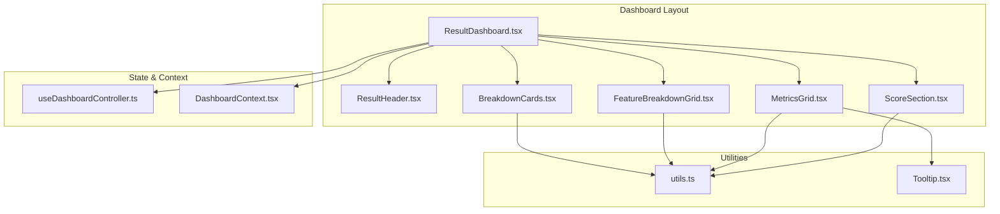
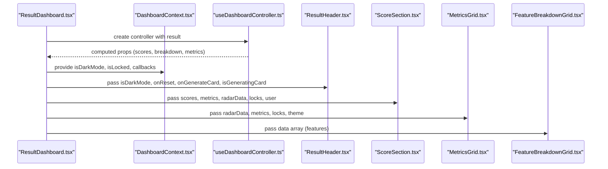
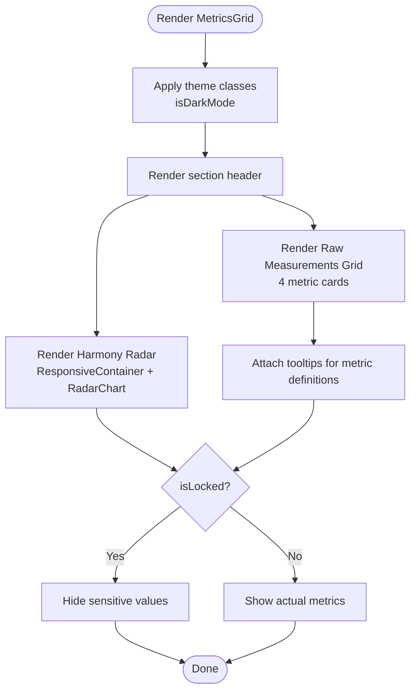
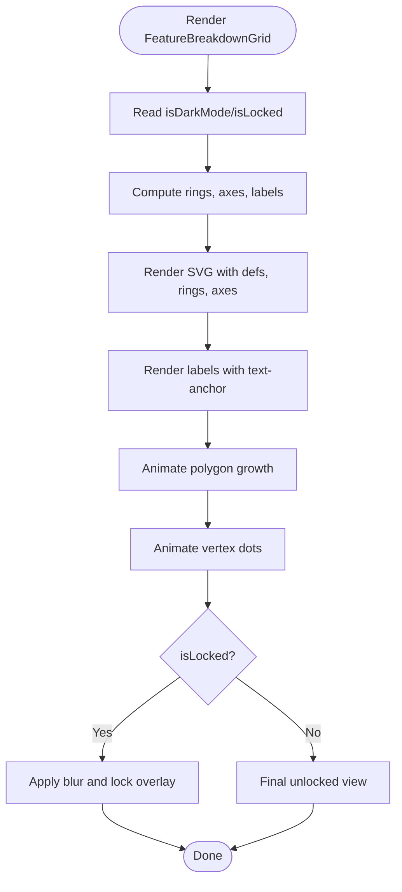
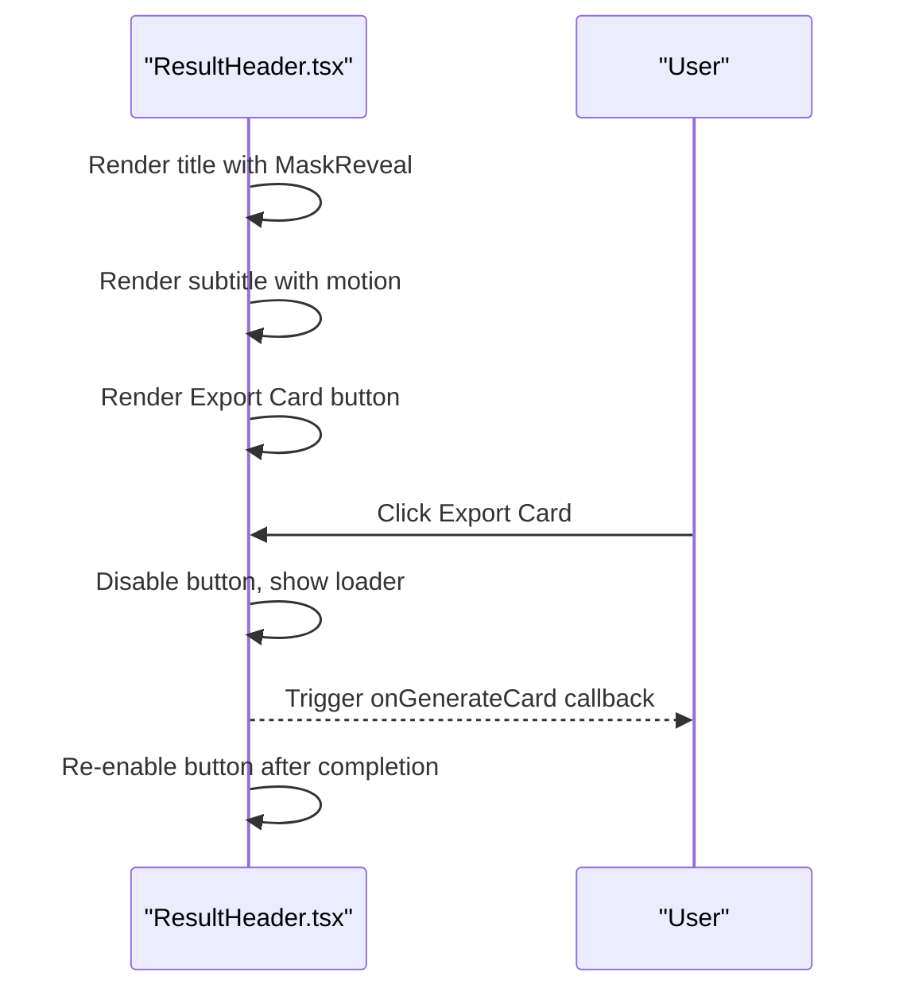
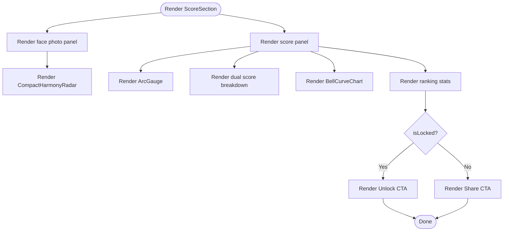
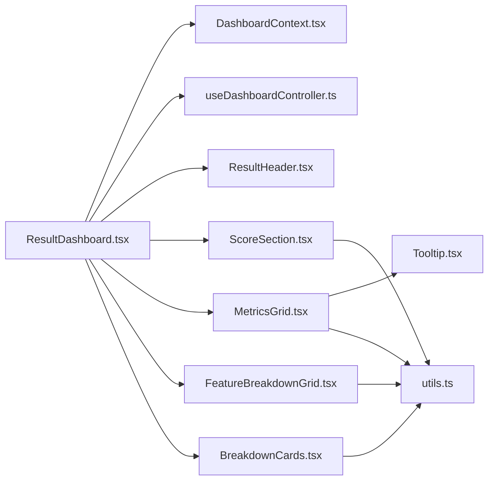

# Visualization Components

<cite>
**Referenced Files in This Document**
- [MetricsGrid.tsx](file://src/components/dashboard/MetricsGrid.tsx)
- [FeatureBreakdownGrid.tsx](file://src/components/dashboard/FeatureBreakdownGrid.tsx)
- [ResultHeader.tsx](file://src/components/dashboard/ResultHeader.tsx)
- [ScoreSection.tsx](file://src/components/dashboard/ScoreSection.tsx)
- [useDashboardController.ts](file://src/features/dashboard/useDashboardController.ts)
- [DashboardContext.tsx](file://src/context/DashboardContext.tsx)
- [ResultDashboard.tsx](file://src/components/ResultDashboard.tsx)
- [BreakdownCards.tsx](file://src/components/dashboard/BreakdownCards.tsx)
- [utils.ts](file://src/lib/utils.ts)
- [Tooltip.tsx](file://src/components/Tooltip.tsx)
</cite>

## Table of Contents
1. [Introduction](#introduction)
2. [Project Structure](#project-structure)
3. [Core Components](#core-components)
4. [Architecture Overview](#architecture-overview)
5. [Detailed Component Analysis](#detailed-component-analysis)
6. [Dependency Analysis](#dependency-analysis)
7. [Performance Considerations](#performance-considerations)
8. [Troubleshooting Guide](#troubleshooting-guide)
9. [Conclusion](#conclusion)
10. [Appendices](#appendices)

## Introduction
This document provides comprehensive documentation for the dashboard visualization components focused on delivering key performance indicators and analysis results. It covers:
- MetricsGrid for displaying measurements and symmetry analysis in grid format
- FeatureBreakdownGrid for presenting detailed feature analysis and scoring breakdowns
- ResultHeader for displaying analysis summaries and user actions
- ScoreSection for visualizing overall and component scores with progress indicators and interactive charts
It also explains responsive design patterns, accessibility implementations, data binding approaches, component composition, integration with the dashboard controller, and customization options.

## Project Structure
The visualization components live under the dashboard folder and integrate with the dashboard controller and context providers. They are composed within the ResultDashboard layout and rendered conditionally based on tab navigation.

**Diagram sources**
- [ResultDashboard.tsx:745-1304](file://src/components/ResultDashboard.tsx#L745-L1304)
- [ResultHeader.tsx:1-135](file://src/components/dashboard/ResultHeader.tsx#L1-L135)
- [ScoreSection.tsx:681-1204](file://src/components/dashboard/ScoreSection.tsx#L681-L1204)
- [MetricsGrid.tsx:15-267](file://src/components/dashboard/MetricsGrid.tsx#L15-L267)
- [FeatureBreakdownGrid.tsx:13-281](file://src/components/dashboard/FeatureBreakdownGrid.tsx#L13-L281)
- [BreakdownCards.tsx:94-379](file://src/components/dashboard/BreakdownCards.tsx#L94-L379)
- [useDashboardController.ts:1-101](file://src/features/dashboard/useDashboardController.ts#L1-L101)
- [DashboardContext.tsx:1-33](file://src/context/DashboardContext.tsx#L1-L33)
- [utils.ts:1-7](file://src/lib/utils.ts#L1-L7)
- [Tooltip.tsx:1-36](file://src/components/Tooltip.tsx#L1-L36)

**Section sources**
- [ResultDashboard.tsx:745-1304](file://src/components/ResultDashboard.tsx#L745-L1304)
- [useDashboardController.ts:1-101](file://src/features/dashboard/useDashboardController.ts#L1-L101)

## Core Components
- MetricsGrid: Presents a Harmony Radar chart and raw measurements grid with tooltips and lock-aware rendering.
- FeatureBreakdownGrid: Renders a custom SVG-based Harmony Radar with animated polygon and labels, including lock overlays.
- ResultHeader: Provides analysis title, action buttons, and export controls with motion effects.
- ScoreSection: Displays the overall score with an arc gauge, dual score breakdown, bell curve distribution, and ranking stats.

**Section sources**
- [MetricsGrid.tsx:15-267](file://src/components/dashboard/MetricsGrid.tsx#L15-L267)
- [FeatureBreakdownGrid.tsx:13-281](file://src/components/dashboard/FeatureBreakdownGrid.tsx#L13-L281)
- [ResultHeader.tsx:7-135](file://src/components/dashboard/ResultHeader.tsx#L7-L135)
- [ScoreSection.tsx:681-1204](file://src/components/dashboard/ScoreSection.tsx#L681-L1204)

## Architecture Overview
The dashboard composes these components within a provider context that exposes theme and lock state. The dashboard controller computes derived data and manages UI state, feeding props to visualization components.

**Diagram sources**
- [ResultDashboard.tsx:315-832](file://src/components/ResultDashboard.tsx#L315-L832)
- [DashboardContext.tsx:16-32](file://src/context/DashboardContext.tsx#L16-L32)
- [useDashboardController.ts:4-101](file://src/features/dashboard/useDashboardController.ts#L4-L101)
- [ResultHeader.tsx:14-19](file://src/components/dashboard/ResultHeader.tsx#L14-L19)
- [ScoreSection.tsx:702-721](file://src/components/dashboard/ScoreSection.tsx#L702-L721)
- [MetricsGrid.tsx:23-29](file://src/components/dashboard/MetricsGrid.tsx#L23-L29)
- [FeatureBreakdownGrid.tsx:17-19](file://src/components/dashboard/FeatureBreakdownGrid.tsx#L17-L19)

## Detailed Component Analysis

### MetricsGrid
Purpose:
- Display facial measurements and symmetry analysis in a responsive grid.
- Render a Harmony Radar chart and a grid of raw metrics with tooltips and lock-aware values.

Key behaviors:
- Uses Recharts RadarChart with ResponsiveContainer for adaptive sizing.
- Applies theme-aware colors and gradients.
- Shows tooltips for metric definitions.
- Hides sensitive metrics when locked.

Responsive design:
- Two-column layout on large screens, single column on smaller screens.
- Grid of four metric cards with hover effects and elevation.

Accessibility:
- Uses semantic headings and labels.
- Tooltip toggled via mouse events.

Data binding:
- Receives radarData, metrics, and lock state via props.
- Uses metrics.facialSymmetry, metrics.canthalTilt, metrics.fWHR, metrics.goldenRatio.

Customization:
- Theme colors adapt via isDarkMode prop.
- Lock overlay replaces values with placeholders.

**Section sources**
- [MetricsGrid.tsx:15-267](file://src/components/dashboard/MetricsGrid.tsx#L15-L267)
- [Tooltip.tsx:10-35](file://src/components/Tooltip.tsx#L10-L35)

**Diagram sources**
- [MetricsGrid.tsx:30-267](file://src/components/dashboard/MetricsGrid.tsx#L30-L267)

### FeatureBreakdownGrid
Purpose:
- Present a custom SVG-based Harmony Radar with animated polygon and labels.
- Provide lock-aware rendering with overlay and dummy shapes.

Key behaviors:
- Generates concentric polygons (rings), axis lines, and labels via polar coordinates.
- Animates polygon growth and vertex dots on viewport intersection.
- Applies lock overlay with blur and placeholder labels.

Responsive design:
- Aspect-ratio maintained via viewBox and max-width constraints.
- Centered layout with proportional sizing.

Accessibility:
- Labels positioned with text-anchor logic to avoid overlap.
- Lock overlay communicates unlock action.

Data binding:
- Expects an array of feature items with subject and A (score).
- Uses DashboardContext for isDarkMode and isLocked.

Customization:
- Adjust SVG_SIZE, CENTER, MAX_RADIUS, NUM_RINGS to change visual density.
- Modify gradients and filters for different visual themes.

**Section sources**
- [FeatureBreakdownGrid.tsx:13-281](file://src/components/dashboard/FeatureBreakdownGrid.tsx#L13-L281)
- [DashboardContext.tsx:26-32](file://src/context/DashboardContext.tsx#L26-L32)

**Diagram sources**
- [FeatureBreakdownGrid.tsx:46-277](file://src/components/dashboard/FeatureBreakdownGrid.tsx#L46-L277)

### ResultHeader
Purpose:
- Display analysis title, subtitle, and action buttons (New Scan, Export Card).
- Integrate motion effects and theme-aware styling.

Key behaviors:
- Uses MaskReveal and GlowSweep for typographic effects.
- Handles export button state with loader and click handler.
- Provides reset navigation.

Responsive design:
- Flex layout adapts from stacked on small to side-by-side on larger screens.

Accessibility:
- Clear button semantics and hover/focus affordances.
- Disabled state during export.

Data binding:
- Receives isDarkMode, onReset, onGenerateCard, isGeneratingCard.

Customization:
- Adjust typography sizes and gradients via inline styles.
- Modify motion timing and easing.

**Section sources**
- [ResultHeader.tsx:7-135](file://src/components/dashboard/ResultHeader.tsx#L7-L135)

**Diagram sources**
- [ResultHeader.tsx:20-134](file://src/components/dashboard/ResultHeader.tsx#L20-L134)

### ScoreSection
Purpose:
- Visualize overall and component scores with an arc gauge, dual score breakdown, bell curve distribution, and ranking stats.
- Provide unlock and share actions.

Key behaviors:
- ArcGauge renders a themed arc with animated stroke dashoffset.
- CompactHarmonyRadar draws a smaller SVG radar for the face card bottom panel.
- BellCurveChart renders a distribution chart with animated highlights and callouts.
- Tier classification determines label and glow color.
- Rank and percentile calculations are derived from overall score.

Responsive design:
- Flex layout stacks vertically on small screens, aligns horizontally on larger screens.
- Inner panels adapt widths and padding.

Accessibility:
- Animated elements use motion primitives with controlled delays.
- Disabled states for locked content.

Data binding:
- Receives imageUrl, landmarks, cropInfo, metrics, scores, user, and lock state.
- Uses radarData for compact radar.

Customization:
- Modify gradients, glow colors, and stroke styles.
- Adjust percentile/rank computations and share text.

**Section sources**
- [ScoreSection.tsx:681-1204](file://src/components/dashboard/ScoreSection.tsx#L681-L1204)

**Diagram sources**
- [ScoreSection.tsx:743-1204](file://src/components/dashboard/ScoreSection.tsx#L743-L1204)

### Related: BreakdownCards
Purpose:
- Display feature breakdown cards with icons, descriptions, and progress bars.
- Provide tiered visual feedback and lock-aware rendering.

Key behaviors:
- Computes tiers based on score thresholds.
- Renders cards in a responsive grid with wide and compact variants.
- Applies blur and grayscale for locked items.

Responsive design:
- 2–3 column grid depending on screen size and remainder.

Accessibility:
- Clear typography hierarchy and labels.
- Hover and focus states for interactivity.

Data binding:
- Receives breakdown, isDarkMode, isLocked.

**Section sources**
- [BreakdownCards.tsx:94-379](file://src/components/dashboard/BreakdownCards.tsx#L94-L379)

## Dependency Analysis
- ResultDashboard composes all visualization components and wires them with controller-provided props and context.
- DashboardContext supplies isDarkMode and isLocked to child components.
- useDashboardController computes derived data (e.g., radarData, percentile/rank) and manages UI state (e.g., isGeneratingCard).
- MetricsGrid depends on Tooltip for metric definitions.
- FeatureBreakdownGrid depends on DashboardContext for theme and lock state.
- ScoreSection depends on several internal helpers (ArcGauge, CompactHarmonyRadar, BellCurveChart) and motion primitives.

**Diagram sources**
- [ResultDashboard.tsx:745-1304](file://src/components/ResultDashboard.tsx#L745-L1304)
- [DashboardContext.tsx:1-33](file://src/context/DashboardContext.tsx#L1-L33)
- [useDashboardController.ts:1-101](file://src/features/dashboard/useDashboardController.ts#L1-L101)
- [ResultHeader.tsx:1-135](file://src/components/dashboard/ResultHeader.tsx#L1-L135)
- [ScoreSection.tsx:1-1204](file://src/components/dashboard/ScoreSection.tsx#L1-L1204)
- [MetricsGrid.tsx:1-267](file://src/components/dashboard/MetricsGrid.tsx#L1-L267)
- [FeatureBreakdownGrid.tsx:1-281](file://src/components/dashboard/FeatureBreakdownGrid.tsx#L1-L281)
- [BreakdownCards.tsx:1-379](file://src/components/dashboard/BreakdownCards.tsx#L1-L379)
- [utils.ts:1-7](file://src/lib/utils.ts#L1-L7)
- [Tooltip.tsx:1-36](file://src/components/Tooltip.tsx#L1-L36)

**Section sources**
- [ResultDashboard.tsx:745-1304](file://src/components/ResultDashboard.tsx#L745-L1304)
- [DashboardContext.tsx:1-33](file://src/context/DashboardContext.tsx#L1-L33)
- [useDashboardController.ts:1-101](file://src/features/dashboard/useDashboardController.ts#L1-L101)

## Performance Considerations
- UseMemo in FeatureBreakdownGrid prevents recomputation of SVG geometry arrays.
- IntersectionObserver in BellCurveChart defers heavy SVG rendering until in-view.
- Motion animations are scoped to viewport intersections to reduce layout thrash.
- ResponsiveContainer in MetricsGrid ensures lightweight chart rendering on small screens.
- Lock overlays blur and disable interactions to minimize unnecessary DOM updates.

[No sources needed since this section provides general guidance]

## Troubleshooting Guide
- If charts do not render:
  - Verify data arrays are non-empty and contain expected keys (subject, A).
  - Ensure ResponsiveContainer has explicit width/height.
- If lock overlays appear unexpectedly:
  - Confirm isLocked prop is correctly passed from DashboardContext.
- If tooltips do not show:
  - Check Tooltip component visibility state and event handlers.
- If animations stutter:
  - Reduce motion budget via MotionProvider or limit concurrent animations.

**Section sources**
- [FeatureBreakdownGrid.tsx:46-107](file://src/components/dashboard/FeatureBreakdownGrid.tsx#L46-L107)
- [ScoreSection.tsx:250-262](file://src/components/dashboard/ScoreSection.tsx#L250-L262)
- [Tooltip.tsx:10-35](file://src/components/Tooltip.tsx#L10-L35)

## Conclusion
These visualization components form a cohesive dashboard that presents facial analysis results with rich visuals and responsive behavior. MetricsGrid and FeatureBreakdownGrid offer complementary views of feature scores, while ResultHeader and ScoreSection deliver a compelling hero section with actionable CTAs. The integration with the dashboard controller and context ensures consistent theming, locking behavior, and derived data.

[No sources needed since this section summarizes without analyzing specific files]

## Appendices

### Responsive Design Patterns
- Flexbox and grid layouts adapt to screen sizes.
- ResponsiveContainer in MetricsGrid ensures chart scalability.
- Aspect-ratio constrained SVGs maintain visual fidelity.

**Section sources**
- [MetricsGrid.tsx:82-103](file://src/components/dashboard/MetricsGrid.tsx#L82-L103)
- [FeatureBreakdownGrid.tsx:151-169](file://src/components/dashboard/FeatureBreakdownGrid.tsx#L151-L169)

### Accessibility Implementations
- Semantic headings and labels.
- Hover/focus states for interactive elements.
- Disabled states for locked UI areas.
- Motion primitives with controlled easing and delays.

**Section sources**
- [ResultHeader.tsx:27-38](file://src/components/dashboard/ResultHeader.tsx#L27-L38)
- [ScoreSection.tsx:1096-1123](file://src/components/dashboard/ScoreSection.tsx#L1096-L1123)

### Data Binding Approaches
- Props-driven rendering with theme and lock state.
- Memoized computations in controller and components.
- Context for global state (dark mode, lock, scroll callbacks).

**Section sources**
- [useDashboardController.ts:4-101](file://src/features/dashboard/useDashboardController.ts#L4-L101)
- [DashboardContext.tsx:26-32](file://src/context/DashboardContext.tsx#L26-L32)

### Component Composition and Integration
- ResultDashboard orchestrates tabbed navigation and mounts components conditionally.
- DashboardContext provides shared state to child components.
- Controller-derived props unify data flow across components.

**Section sources**
- [ResultDashboard.tsx:802-1301](file://src/components/ResultDashboard.tsx#L802-L1301)
- [DashboardContext.tsx:16-32](file://src/context/DashboardContext.tsx#L16-L32)

### Customization Options and Styling Variations
- Theme-aware gradients and borders via isDarkMode.
- Lock overlays with blur and placeholder content.
- Internal helpers (getScoreTier, getTier) centralize color and label logic.
- Tailwind utilities combined via cn for safe class merging.

**Section sources**
- [ScoreSection.tsx:9-19](file://src/components/dashboard/ScoreSection.tsx#L9-L19)
- [BreakdownCards.tsx:14-49](file://src/components/dashboard/BreakdownCards.tsx#L14-L49)
- [utils.ts:4-6](file://src/lib/utils.ts#L4-L6)