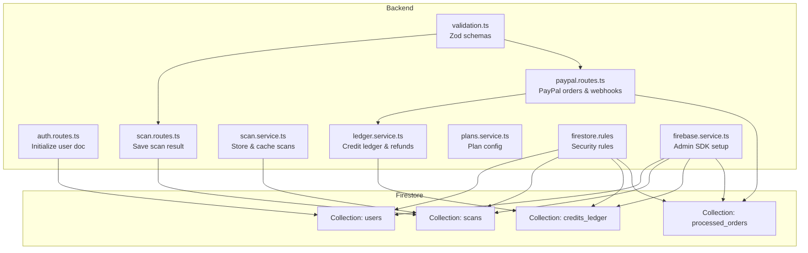
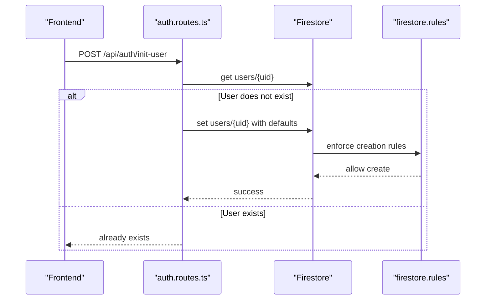
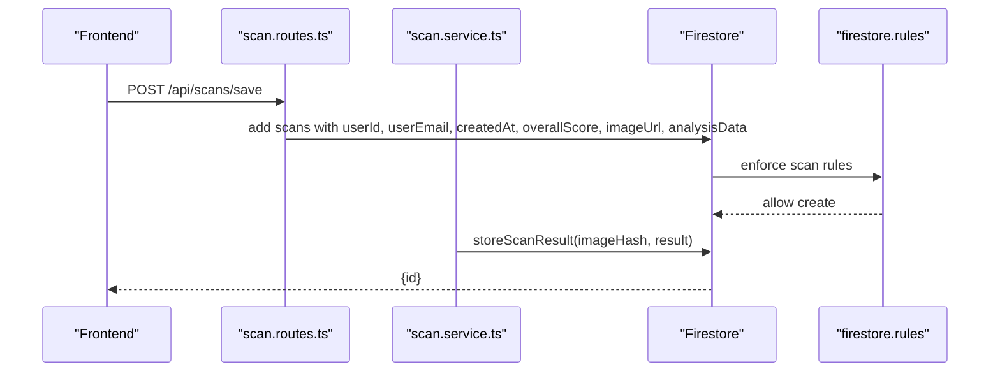
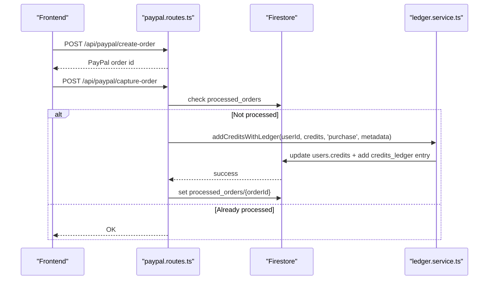
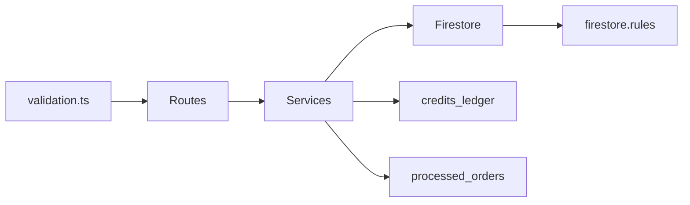

# Data Models and Schema

<cite>
**Referenced Files in This Document**
- [firestore.rules](file://firestore.rules)
- [firebase.service.ts](file://backend/services/firebase.service.ts)
- [auth.routes.ts](file://backend/routes/auth.routes.ts)
- [scan.routes.ts](file://backend/routes/scan.routes.ts)
- [scan.service.ts](file://backend/services/scan.service.ts)
- [paypal.routes.ts](file://backend/routes/paypal.routes.ts)
- [ledger.service.ts](file://backend/services/ledger.service.ts)
- [plans.service.ts](file://backend/services/plans.service.ts)
- [validation.ts](file://backend/utils/validation.ts)
- [mediapipe.ts](file://backend/types/mediapipe.ts)
- [analysis.ts](file://src/types/analysis.ts)
</cite>

## Table of Contents
1. [Introduction](#introduction)
2. [Project Structure](#project-structure)
3. [Core Components](#core-components)
4. [Architecture Overview](#architecture-overview)
5. [Detailed Component Analysis](#detailed-component-analysis)
6. [Dependency Analysis](#dependency-analysis)
7. [Performance Considerations](#performance-considerations)
8. [Troubleshooting Guide](#troubleshooting-guide)
9. [Conclusion](#conclusion)
10. [Appendices](#appendices)

## Introduction
This document defines the Firestore schema and data models for FaceAnalytics Pro. It covers:
- User profiles and authentication-related metadata
- Analysis results and geometric measurements
- Credit transactions and audit trail
- Subscription plan configuration and purchase flow
- Field definitions, data types, validation rules, and indexing strategies
- Sample data structures and query patterns
- Denormalization strategies and performance optimizations

## Project Structure
The schema spans backend services, Firestore security rules, and frontend types. Collections and documents are defined by backend routes and services, enforced by Firestore rules, and validated by Zod schemas.

**Diagram sources**
- [auth.routes.ts:23-88](file://backend/routes/auth.routes.ts#L23-L88)
- [scan.routes.ts:22-60](file://backend/routes/scan.routes.ts#L22-L60)
- [scan.service.ts:68-94](file://backend/services/scan.service.ts#L68-L94)
- [paypal.routes.ts:25-159](file://backend/routes/paypal.routes.ts#L25-L159)
- [ledger.service.ts:60-91](file://backend/services/ledger.service.ts#L60-L91)
- [plans.service.ts:13-33](file://backend/services/plans.service.ts#L13-L33)
- [validation.ts:77-81](file://backend/utils/validation.ts#L77-L81)
- [firestore.rules:89-116](file://firestore.rules#L89-L116)
- [firebase.service.ts:75-111](file://backend/services/firebase.service.ts#L75-L111)

**Section sources**
- [firestore.rules:1-118](file://firestore.rules#L1-L118)
- [firebase.service.ts:1-120](file://backend/services/firebase.service.ts#L1-L120)

## Core Components
This section defines the primary collections, their documents, and fields.

- users
  - Purpose: Store user identity, roles, credits, and referral metadata.
  - Key fields:
    - uid: string (required)
    - email: string (required, email format)
    - displayName: string (optional)
    - photoURL: string (optional)
    - createdAt: timestamp (required)
    - role: string (enum: user, admin)
    - credits: integer (required)
    - referralCode: string (optional)
    - invitedCount: number (optional)
    - referredBy: string (optional)
    - lastIp: string (optional)
    - lastFingerprint: string (optional)
    - referralRewardTriggered: boolean (optional)
  - Validation rules:
    - Creation requires uid, email, createdAt, role, credits, referralCode, invitedCount.
    - Updates restrict changing role and credits unless admin.
    - Email must match standard format.
  - Indexing strategies:
    - Compound index recommended: (email), (role), (referredBy), (createdAt desc) for analytics and lookup.

- scans
  - Purpose: Persist analysis results, images, and metadata for user history and caching.
  - Key fields:
    - userId: string (required)
    - userEmail: string (required)
    - createdAt: timestamp (required)
    - overallScore: number (optional)
    - imageHash: string (optional)
    - scanType: 'analysis' | 'celebrity' | 'hair' (optional)
    - result: object (optional)
    - imageUrl: string (optional)
  - Notes:
    - Legacy fields include imageUrl and analysisData; new storage uses result with imageHash.
    - Caching uses imageHash and scanType for deduplication.
  - Validation rules:
    - Save endpoint enforces overallScore range and analysisData length limits.
  - Indexing strategies:
    - Compound index: (userId, createdAt desc), (userId, scanType, createdAt desc), (imageHash, userId) for cache hit.

- credits_ledger
  - Purpose: Immutable audit trail of credit changes with reasons and metadata.
  - Key fields:
    - userId: string (required)
    - change: number (positive or negative)
    - reason: enum of LedgerReason
    - balance_after: number (snapshot)
    - metadata: object (e.g., orderId, scanId)
    - ip: string (optional)
    - timestamp: timestamp (serverTimestamp)
  - Indexing strategies:
    - Compound index: (userId, timestamp), (reason, timestamp), (metadata.orderId) for refund and reporting.

- processed_orders
  - Purpose: Prevent duplicate credit grants for the same PayPal order.
  - Key fields:
    - processedAt: ISO timestamp
    - planId: string
    - userId: string
    - source: 'capture' | 'webhook'

**Section sources**
- [firestore.rules:10-31](file://firestore.rules#L10-L31)
- [firestore.rules:58-83](file://firestore.rules#L58-L83)
- [scan.routes.ts:22-44](file://backend/routes/scan.routes.ts#L22-L44)
- [scan.service.ts:11-18](file://backend/services/scan.service.ts#L11-L18)
- [validation.ts:77-81](file://backend/utils/validation.ts#L77-L81)
- [ledger.service.ts:45-53](file://backend/services/ledger.service.ts#L45-L53)
- [paypal.routes.ts:134-144](file://backend/routes/paypal.routes.ts#L134-L144)

## Architecture Overview
The system integrates user initialization, scan persistence, credit management, and PayPal purchases with Firestore security rules and admin SDK.

**Diagram sources**
- [auth.routes.ts:23-88](file://backend/routes/auth.routes.ts#L23-L88)
- [firestore.rules:89-105](file://firestore.rules#L89-L105)

**Diagram sources**
- [scan.routes.ts:22-44](file://backend/routes/scan.routes.ts#L22-L44)
- [scan.service.ts:68-94](file://backend/services/scan.service.ts#L68-L94)
- [firestore.rules:107-111](file://firestore.rules#L107-L111)

**Diagram sources**
- [paypal.routes.ts:25-159](file://backend/routes/paypal.routes.ts#L25-L159)
- [ledger.service.ts:245-268](file://backend/services/ledger.service.ts#L245-L268)

## Detailed Component Analysis

### User Profile Schema
- Identity and authentication
  - uid: string, required, must match authenticated user
  - email: string, required, validated by regex
  - displayName, photoURL: optional
- Access control and metadata
  - role: enum 'user' | 'admin'
  - createdAt: timestamp
  - lastIp, lastFingerprint: optional for fraud monitoring
- Credits and referrals
  - credits: integer, required
  - referralCode: unique uppercase hex string
  - referredBy: string (uid of referrer)
  - invitedCount: number
  - referralRewardTriggered: boolean

Validation and indexing
- Creation: requires uid, email, createdAt, role, credits, referralCode, invitedCount.
- Updates: disallow changing role or credits without admin privileges.
- Indexing recommendations:
  - (email) for login and lookup
  - (role) for admin queries
  - (referredBy) for referral analytics
  - (createdAt desc) for user lists

**Section sources**
- [firestore.rules:58-72](file://firestore.rules#L58-L72)
- [firestore.rules:98-102](file://firestore.rules#L98-L102)
- [auth.routes.ts:50-66](file://backend/routes/auth.routes.ts#L50-L66)

### Analysis Result Structure
- Legacy scan storage (scans)
  - Fields: userId, userEmail, createdAt, overallScore, imageUrl, analysisData, scanType
  - Notes: analysisData stored as string; imageUrl may be embedded
- New scan storage (scans)
  - Fields: userId, userEmail, createdAt, overallScore, imageHash, scanType, result
  - result: object containing metrics, insights, and optional landmarks
  - Caching: imageHash enables reuse detection; scanType distinguishes analysis types

Validation
- Save endpoint enforces:
  - overallScore min/max
  - analysisData length cap
  - imageUrl max length

Caching and retrieval
- getCachedResult: finds latest matching (userId, imageHash, scanType)
- storeScanResult: writes with serverTimestamp and computed overallScore

**Section sources**
- [firestore.rules:21-31](file://firestore.rules#L21-L31)
- [scan.routes.ts:22-44](file://backend/routes/scan.routes.ts#L22-L44)
- [scan.service.ts:11-18](file://backend/services/scan.service.ts#L11-L18)
- [scan.service.ts:31-62](file://backend/services/scan.service.ts#L31-L62)
- [scan.service.ts:68-94](file://backend/services/scan.service.ts#L68-L94)
- [validation.ts:77-81](file://backend/utils/validation.ts#L77-L81)

### Credit Transaction Model
- Ledger entries
  - Fields: userId, change (+ or -), reason, balance_after, metadata, ip, timestamp
  - Reasons include: analyze, celebrity_scan, hair_scan, refund_ai_fail, refund_manual, purchase, referral_invitee, referral_inviter, dev_boost, admin_grant, fraud_freeze
- Operations
  - deductCreditWithLedger: atomic decrement and ledger write
  - refundCreditWithLedger: increment and ledger entry
  - addCreditsWithLedger: increment and ledger entry
  - deductCreditBestEffort: best-effort with pending_deducts queue for outages

Audit and reconciliation
- credits_ledger provides immutable audit trail
- pending_deducts allows later reconciliation during outages

**Section sources**
- [ledger.service.ts:22-53](file://backend/services/ledger.service.ts#L22-L53)
- [ledger.service.ts:97-141](file://backend/services/ledger.service.ts#L97-L141)
- [ledger.service.ts:147-169](file://backend/services/ledger.service.ts#L147-L169)
- [ledger.service.ts:245-268](file://backend/services/ledger.service.ts#L245-L268)
- [ledger.service.ts:189-240](file://backend/services/ledger.service.ts#L189-L240)

### Subscription Management Schema
- Plans
  - PlanConfig: id, name, price, credits
  - PLANS: price_single, price_basic, price_pro, price_elite
- Purchase flow
  - Create order: sends planId, attaches custom_id with {userId, planId}
  - Capture order: verifies planId, grants credits via addCreditsWithLedger, marks processed_orders
  - Webhook: signature verification, replay protection, grants credits and marks processed_orders

Denormalization
- processed_orders prevents duplicate credits for the same order
- metadata in ledger entries links purchases to order and plan

**Section sources**
- [plans.service.ts:6-18](file://backend/services/plans.service.ts#L6-L18)
- [paypal.routes.ts:25-76](file://backend/routes/paypal.routes.ts#L25-L76)
- [paypal.routes.ts:79-159](file://backend/routes/paypal.routes.ts#L79-L159)
- [paypal.routes.ts:161-299](file://backend/routes/paypal.routes.ts#L161-L299)

### Geometric Measurements and Facial Ratios
- Landmarks
  - Landmark: x, y, z (number)
  - LandmarkArray: array of 468–478 points
- Symmetry analysis
  - SymmetryDetail: feature, score, observation
  - SymmetryResult: symmetryScore, detailedSymmetry, avgSymmetryScore
- Metrics
  - MetricsResult: overallScore, finalEyeScore, finalJawScore, proportionsScore, fwhrScore, avgCanthalTilt, fWHR, heightToWidthRatio, midfaceRatio, lowerFaceRatio, eyeSpacingRatio, noseWidthRatio, mouthWidthRatio, faceShape, faceShapeConfidence, strengths, weaknesses

These types inform how geometric data is represented and stored in result objects.

**Section sources**
- [mediapipe.ts:2-6](file://backend/types/mediapipe.ts#L2-L6)
- [mediapipe.ts:11-23](file://backend/types/mediapipe.ts#L11-L23)
- [mediapipe.ts:25-44](file://backend/types/mediapipe.ts#L25-L44)

## Dependency Analysis
- Backend routes depend on:
  - Security rules for access control
  - Validation schemas for request payloads
  - Firebase Admin SDK for Firestore operations
- Services encapsulate:
  - Firestore operations and transactions
  - Credit ledger and reconciliation logic
  - Plan configuration and PayPal integration
- Frontend types align with backend result structures for type safety

**Diagram sources**
- [validation.ts:89-102](file://backend/utils/validation.ts#L89-L102)
- [scan.routes.ts:22-44](file://backend/routes/scan.routes.ts#L22-L44)
- [paypal.routes.ts:25-159](file://backend/routes/paypal.routes.ts#L25-L159)
- [ledger.service.ts:60-91](file://backend/services/ledger.service.ts#L60-L91)
- [firestore.rules:89-116](file://firestore.rules#L89-L116)

**Section sources**
- [validation.ts:1-103](file://backend/utils/validation.ts#L1-L103)
- [firestore.rules:1-118](file://firestore.rules#L1-L118)

## Performance Considerations
- Prefer compound indexes for frequent queries:
  - users: (email), (role), (referredBy), (createdAt desc)
  - scans: (userId, createdAt desc), (userId, scanType, createdAt desc), (imageHash, userId)
  - credits_ledger: (userId, timestamp), (reason, timestamp), (metadata.orderId)
  - processed_orders: (processedAt)
- Use serverTimestamp for accurate ordering and analytics.
- Cache scan results via imageHash to avoid recomputation and reduce storage costs.
- Limit payload sizes (e.g., analysisData) to keep reads/writes efficient.
- Batch operations where possible and avoid N+1 reads.

[No sources needed since this section provides general guidance]

## Troubleshooting Guide
- Authentication and user initialization
  - Ensure uid matches request.auth.uid and email format is valid.
  - If user doc does not exist, initialization creates defaults; verify Firestore availability.
- Scan persistence
  - Validate overallScore range and analysisData length before saving.
  - Use imageHash to detect duplicates; adjust scanType accordingly.
- Credit operations
  - Insufficient credits: expect 403 with INSUFFICIENT_CREDITS.
  - User not found: expect 404.
  - Outages: best-effort flow queues pending_deducts; reconcile later.
- PayPal purchases
  - Signature verification failures: check PAYPAL_WEBHOOK_ID and environment.
  - Duplicate events: replay protection uses Redis keys with TTL.
  - Order already processed: processed_orders prevents double credits.

**Section sources**
- [firestore.rules:58-83](file://firestore.rules#L58-L83)
- [auth.routes.ts:23-88](file://backend/routes/auth.routes.ts#L23-L88)
- [scan.routes.ts:22-44](file://backend/routes/scan.routes.ts#L22-L44)
- [validation.ts:77-81](file://backend/utils/validation.ts#L77-L81)
- [ledger.service.ts:115-120](file://backend/services/ledger.service.ts#L115-L120)
- [paypal.routes.ts:161-299](file://backend/routes/paypal.routes.ts#L161-L299)

## Conclusion
The schema balances strong typing, immutability of audit trails, and operational resilience. By leveraging Firestore security rules, validation schemas, and service-layer transactions, the system ensures data integrity, supports scalable analytics, and maintains a robust credit and subscription model.

[No sources needed since this section summarizes without analyzing specific files]

## Appendices

### Field Definitions and Types
- users
  - uid: string
  - email: string
  - displayName: string
  - photoURL: string
  - createdAt: timestamp
  - role: enum
  - credits: integer
  - referralCode: string
  - invitedCount: integer
  - referredBy: string
  - lastIp: string
  - lastFingerprint: string
  - referralRewardTriggered: boolean
- scans
  - userId: string
  - userEmail: string
  - createdAt: timestamp
  - overallScore: number
  - imageHash: string
  - scanType: enum
  - result: object
  - imageUrl: string
- credits_ledger
  - userId: string
  - change: number
  - reason: enum
  - balance_after: number
  - metadata: object
  - ip: string
  - timestamp: timestamp
- processed_orders
  - processedAt: timestamp
  - planId: string
  - userId: string
  - source: enum

**Section sources**
- [firestore.rules:10-31](file://firestore.rules#L10-L31)
- [scan.service.ts:11-18](file://backend/services/scan.service.ts#L11-L18)
- [ledger.service.ts:45-53](file://backend/services/ledger.service.ts#L45-L53)
- [paypal.routes.ts:134-144](file://backend/routes/paypal.routes.ts#L134-L144)

### Sample Data Structures
- User document
  - uid: "google-oauth2|10882734659873246"
  - email: "user@example.com"
  - role: "user"
  - credits: 12
  - referralCode: "AB12CD"
  - invitedCount: 2
  - createdAt: <serverTimestamp>
- Scan document
  - userId: "google-oauth2|10882734659873246"
  - userEmail: "user@example.com"
  - overallScore: 8.5
  - imageHash: "a1b2c3...z"
  - scanType: "analysis"
  - result: { /* metrics, insights */ }
  - createdAt: <serverTimestamp>
- Ledger entry
  - userId: "google-oauth2|10882734659873246"
  - change: 15
  - reason: "purchase"
  - metadata: { orderId: "EC-XXXX", planId: "price_pro" }
  - timestamp: <serverTimestamp>
- Processed order
  - processedAt: "2025-01-01T00:00:00Z"
  - planId: "price_pro"
  - userId: "google-oauth2|10882734659873246"
  - source: "webhook"

**Section sources**
- [auth.routes.ts:50-66](file://backend/routes/auth.routes.ts#L50-L66)
- [scan.routes.ts:22-44](file://backend/routes/scan.routes.ts#L22-L44)
- [scan.service.ts:78-85](file://backend/services/scan.service.ts#L78-L85)
- [ledger.service.ts:60-91](file://backend/services/ledger.service.ts#L60-L91)
- [paypal.routes.ts:134-144](file://backend/routes/paypal.routes.ts#L134-L144)

### Query Patterns
- Get user scan history (paginated)
  - orderBy("createdAt", "desc"), limit(N), optionally startAfter(cursor)
- Find cached result for image
  - where("userId","==",uid).where("imageHash","==",hash).where("scanType","==","analysis").orderBy("createdAt","desc").limit(1)
- List recent ledger entries for user
  - where("userId","==",uid).orderBy("timestamp","desc").limit(N)
- Check processed order
  - get("processed_orders/{orderId}")

**Section sources**
- [scan.service.ts:99-133](file://backend/services/scan.service.ts#L99-L133)
- [scan.service.ts:31-62](file://backend/services/scan.service.ts#L31-L62)
- [ledger.service.ts:60-91](file://backend/services/ledger.service.ts#L60-L91)
- [paypal.routes.ts:130-151](file://backend/routes/paypal.routes.ts#L130-L151)