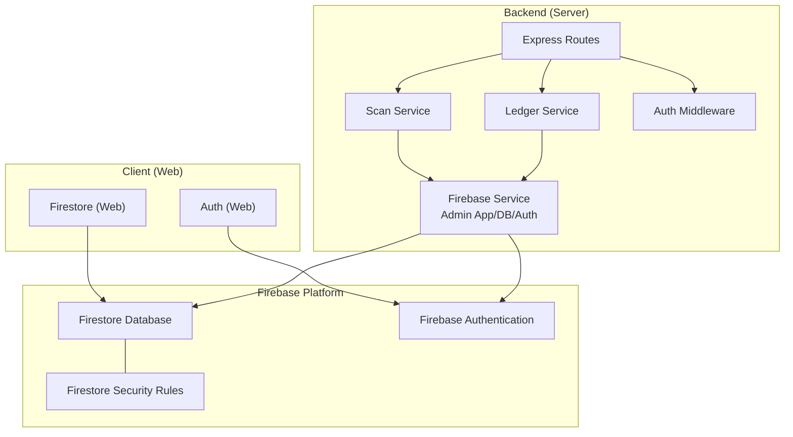
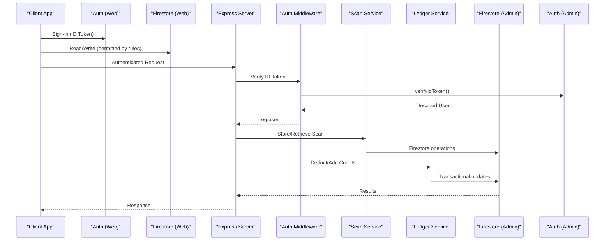
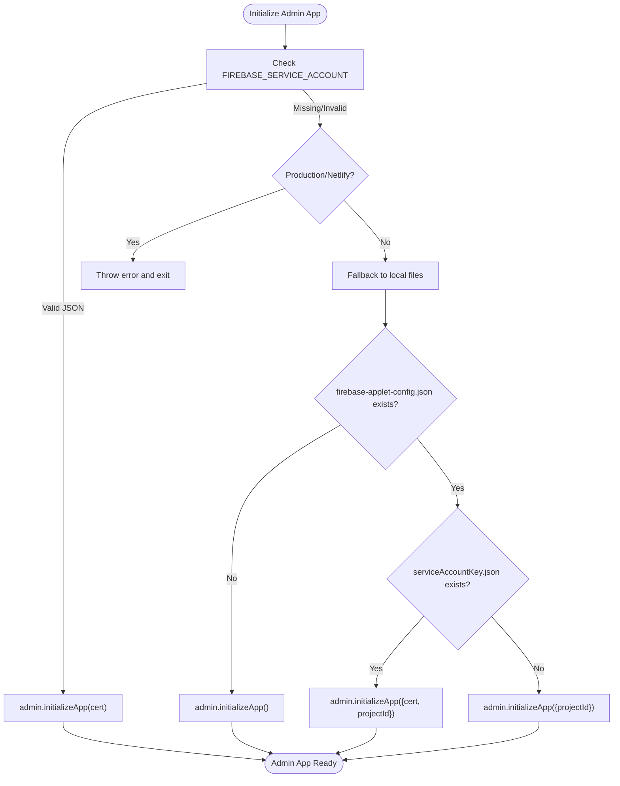
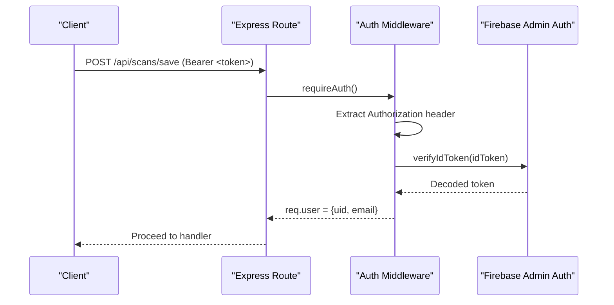
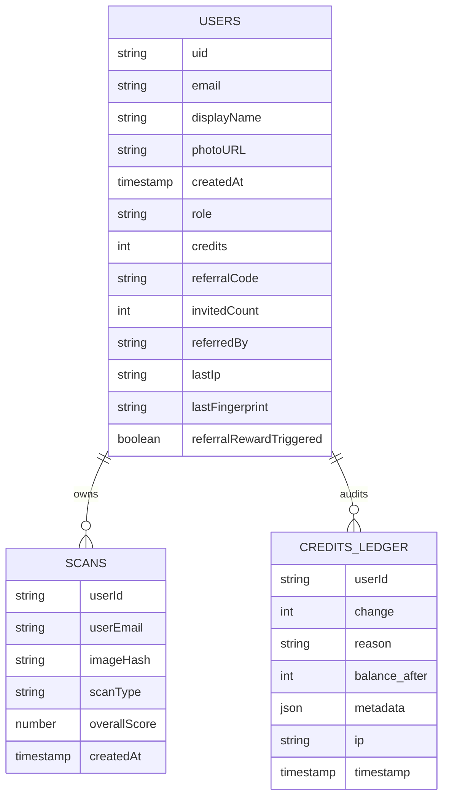
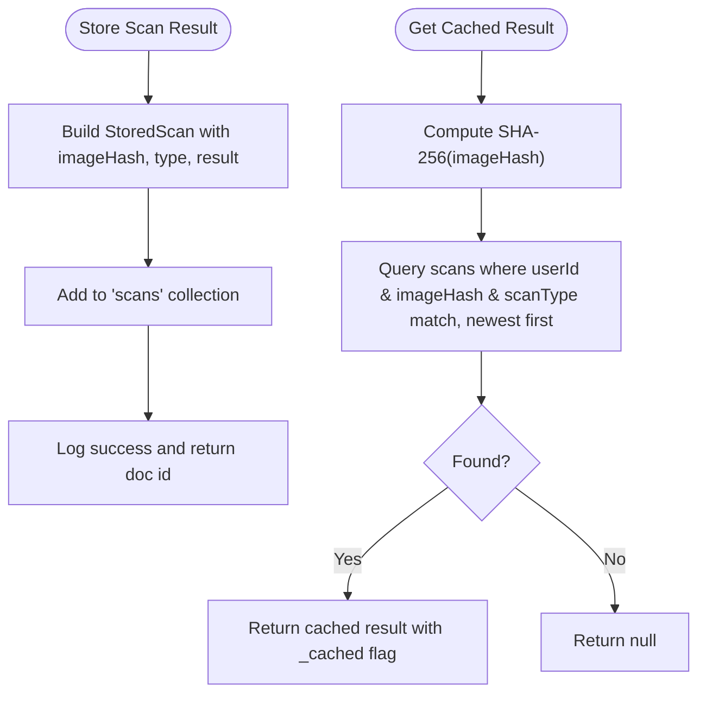
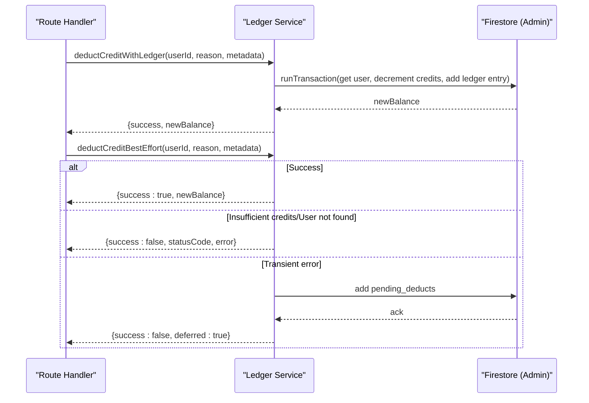
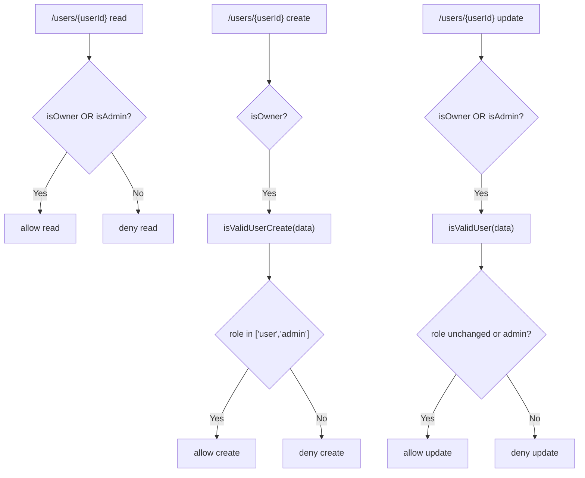
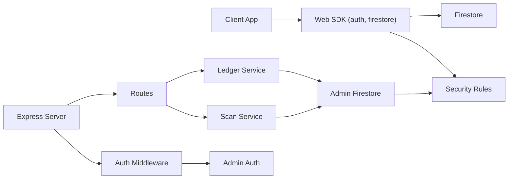

# Database Integration

<cite>
**Referenced Files in This Document**
- [firebase.service.ts](file://backend/services/firebase.service.ts)
- [firebase.ts](file://src/firebase.ts)
- [config.ts](file://backend/utils/config.ts)
- [firestore.rules](file://firestore.rules)
- [scan.service.ts](file://backend/services/scan.service.ts)
- [ledger.service.ts](file://backend/services/ledger.service.ts)
- [auth.middleware.ts](file://backend/middleware/auth.middleware.ts)
- [scan.routes.ts](file://backend/routes/scan.routes.ts)
- [auth.routes.ts](file://backend/routes/auth.routes.ts)
- [restore-credit.ts](file://backend/scripts/restore-credit.ts)
- [firebase-applet-config.json](file://firebase-applet-config.json)
- [analysis.ts](file://src/types/analysis.ts)
- [validation.ts](file://backend/utils/validation.ts)
</cite>

## Table of Contents
1. [Introduction](#introduction)
2. [Project Structure](#project-structure)
3. [Core Components](#core-components)
4. [Architecture Overview](#architecture-overview)
5. [Detailed Component Analysis](#detailed-component-analysis)
6. [Dependency Analysis](#dependency-analysis)
7. [Performance Considerations](#performance-considerations)
8. [Security Considerations](#security-considerations)
9. [Backup, Retention, and Compliance](#backup-retention-and-compliance)
10. [Troubleshooting Guide](#troubleshooting-guide)
11. [Conclusion](#conclusion)

## Introduction
This document describes the database integration for FaceAnalytics Pro with Firebase. It covers Firestore initialization and Admin SDK usage, client-side Web SDK configuration, authentication integration, security rules, and data models. It documents the scan service for persisting and retrieving analysis results, the ledger service for credit management and transaction logging, and operational patterns for reliability and performance. It also outlines security controls, backup and retention strategies, and compliance considerations.

## Project Structure
The database integration spans three layers:
- Client-side Web SDK: Initializes Firestore and Auth for the browser.
- Backend services: Admin SDK for Firestore/Auth, shared by routes and services.
- Security and configuration: Firestore security rules, environment validation, and Firebase project configuration.

**Diagram sources**
- [firebase.ts:1-21](file://src/firebase.ts#L1-L21)
- [firebase.service.ts:1-120](file://backend/services/firebase.service.ts#L1-L120)
- [scan.service.ts:1-134](file://backend/services/scan.service.ts#L1-L134)
- [ledger.service.ts:1-269](file://backend/services/ledger.service.ts#L1-L269)
- [auth.middleware.ts:1-40](file://backend/middleware/auth.middleware.ts#L1-L40)
- [scan.routes.ts:1-63](file://backend/routes/scan.routes.ts#L1-L63)
- [firestore.rules:1-118](file://firestore.rules#L1-L118)

**Section sources**
- [firebase.ts:1-21](file://src/firebase.ts#L1-L21)
- [firebase.service.ts:1-120](file://backend/services/firebase.service.ts#L1-L120)
- [firestore.rules:1-118](file://firestore.rules#L1-L118)

## Core Components
- Firebase Admin SDK initialization and configuration for Firestore and Auth.
- Client-side Firebase Web SDK initialization for Firestore and Auth.
- Authentication middleware verifying ID tokens and attaching user context.
- Scan service for storing/retrieving analysis results with caching and pagination.
- Ledger service for atomic credit deductions, refunds, and immutable audit logging.
- Environment configuration and validation for secure deployment.
- Firestore security rules enforcing ownership, admin access, and data shape validation.

**Section sources**
- [firebase.service.ts:1-120](file://backend/services/firebase.service.ts#L1-L120)
- [firebase.ts:1-21](file://src/firebase.ts#L1-L21)
- [auth.middleware.ts:1-40](file://backend/middleware/auth.middleware.ts#L1-L40)
- [scan.service.ts:1-134](file://backend/services/scan.service.ts#L1-L134)
- [ledger.service.ts:1-269](file://backend/services/ledger.service.ts#L1-L269)
- [config.ts:1-110](file://backend/utils/config.ts#L1-L110)
- [firestore.rules:1-118](file://firestore.rules#L1-L118)

## Architecture Overview
The system uses a clear separation of concerns:
- Client initializes the Web SDK and interacts with Firestore/Auth.
- Server routes enforce authentication and delegate data operations to services.
- Services use the Admin SDK to perform privileged operations and maintain audit trails.
- Security rules govern who can read/write and validate data shapes.

**Diagram sources**
- [auth.middleware.ts:18-39](file://backend/middleware/auth.middleware.ts#L18-L39)
- [scan.service.ts:68-94](file://backend/services/scan.service.ts#L68-L94)
- [ledger.service.ts:97-141](file://backend/services/ledger.service.ts#L97-L141)
- [firebase.service.ts:10-119](file://backend/services/firebase.service.ts#L10-L119)
- [firebase.ts:1-21](file://src/firebase.ts#L1-L21)

## Detailed Component Analysis

### Firebase Initialization and Configuration
- Admin SDK initialization supports environment variable-based service account credentials, with strict behavior in production/Netlify to avoid silent failures.
- Firestore settings switch to HTTP/1.1 (REST) to prevent cold-start timeouts in serverless environments.
- Client-side Web SDK initializes Firestore with the same database identifier and disables long polling by default.

**Diagram sources**
- [firebase.service.ts:10-73](file://backend/services/firebase.service.ts#L10-L73)

**Section sources**
- [firebase.service.ts:1-120](file://backend/services/firebase.service.ts#L1-L120)
- [firebase-applet-config.json:1-10](file://firebase-applet-config.json#L1-L10)
- [firebase.ts:1-21](file://src/firebase.ts#L1-L21)
- [config.ts:1-110](file://backend/utils/config.ts#L1-L110)

### Authentication Integration
- Authentication middleware verifies Authorization: Bearer tokens using the Admin Auth service.
- On success, attaches user identity (uid, email) to the request for downstream services.

**Diagram sources**
- [auth.middleware.ts:18-39](file://backend/middleware/auth.middleware.ts#L18-L39)
- [firebase.service.ts:113-119](file://backend/services/firebase.service.ts#L113-L119)

**Section sources**
- [auth.middleware.ts:1-40](file://backend/middleware/auth.middleware.ts#L1-L40)
- [firebase.service.ts:113-119](file://backend/services/firebase.service.ts#L113-L119)

### Data Models
- Users: user profile document with identity, role, credits, timestamps, and referral metadata.
- Scans: analysis result document with user identity, image hash, type, scores, and timestamps.
- Credits Ledger: immutable audit entries for every credit change with reason and metadata.
- Additional collections referenced by rules: processed_orders (backend-only).

**Diagram sources**
- [firestore.rules:10-31](file://firestore.rules#L10-L31)
- [analysis.ts:128-142](file://src/types/analysis.ts#L128-L142)

**Section sources**
- [firestore.rules:10-31](file://firestore.rules#L10-L31)
- [analysis.ts:128-142](file://src/types/analysis.ts#L128-L142)

### Scan Service Implementation
- Caching: Computes SHA-256 of base64 image data and queries recent scans by user, hash, and type to return cached results.
- Persistence: Stores analysis results with server timestamp and computed overall score.
- Retrieval: Paginates scan history with limit and optional cursor support.

**Diagram sources**
- [scan.service.ts:23-94](file://backend/services/scan.service.ts#L23-L94)

**Section sources**
- [scan.service.ts:1-134](file://backend/services/scan.service.ts#L1-L134)
- [scan.routes.ts:22-60](file://backend/routes/scan.routes.ts#L22-L60)

### Ledger Service for Credit Management
- Atomic operations: Deduct credits and record ledger entries in a Firestore transaction.
- Best-effort deduction: On transient failures, queues pending deductions for later reconciliation; dev-mode bypass for quota exhaustion.
- Refunds: Adds credits and logs refund entries.
- Audit trail: Every credit change is logged with reason, metadata, IP, and timestamp.

**Diagram sources**
- [ledger.service.ts:97-141](file://backend/services/ledger.service.ts#L97-L141)
- [ledger.service.ts:189-240](file://backend/services/ledger.service.ts#L189-L240)

**Section sources**
- [ledger.service.ts:1-269](file://backend/services/ledger.service.ts#L1-L269)
- [restore-credit.ts:65-120](file://backend/scripts/restore-credit.ts#L65-L120)

### Security Rule Implementation
- Ownership and admin checks: Users can read/update only their own profiles; admins can manage all resources.
- Data validation: Enforces required fields and types for users and scans; limits analysisData size.
- Backend-only collections: processed_orders are write-protected to backend-only.

**Diagram sources**
- [firestore.rules:89-105](file://firestore.rules#L89-L105)

**Section sources**
- [firestore.rules:1-118](file://firestore.rules#L1-L118)

## Dependency Analysis
- Client-to-Firestore: Uses Web channel transport; relies on security rules for access control.
- Server-to-Firestore: Admin SDK with REST transport for serverless stability.
- Routes depend on middleware for auth and on services for data operations.
- Services depend on the Firebase service for Admin App/DB/Auth instances.

**Diagram sources**
- [firebase.ts:1-21](file://src/firebase.ts#L1-L21)
- [auth.middleware.ts:1-40](file://backend/middleware/auth.middleware.ts#L1-L40)
- [scan.routes.ts:1-63](file://backend/routes/scan.routes.ts#L1-L63)
- [scan.service.ts:1-134](file://backend/services/scan.service.ts#L1-L134)
- [ledger.service.ts:1-269](file://backend/services/ledger.service.ts#L1-L269)
- [firestore.rules:1-118](file://firestore.rules#L1-L118)

**Section sources**
- [firebase.ts:1-21](file://src/firebase.ts#L1-L21)
- [firebase.service.ts:1-120](file://backend/services/firebase.service.ts#L1-L120)
- [auth.middleware.ts:1-40](file://backend/middleware/auth.middleware.ts#L1-L40)
- [scan.routes.ts:1-63](file://backend/routes/scan.routes.ts#L1-L63)
- [scan.service.ts:1-134](file://backend/services/scan.service.ts#L1-L134)
- [ledger.service.ts:1-269](file://backend/services/ledger.service.ts#L1-L269)
- [firestore.rules:1-118](file://firestore.rules#L1-L118)

## Performance Considerations
- Transport selection: Admin Firestore uses HTTP/1.1 (REST) to avoid gRPC cold-start delays in serverless.
- Query patterns: Scan service uses compound filters (userId, imageHash, scanType) and server timestamp ordering for efficient caching and pagination.
- Rate limiting: Routes apply shared rate limiters to protect backend resources.
- Validation: Body validation prevents oversized payloads and malformed requests.
- Caching: Image hashing enables reuse of prior results, reducing writes and read costs.

[No sources needed since this section provides general guidance]

## Security Considerations
- Role-based access control: Rules enforce ownership and admin privileges; user updates restrict sensitive fields.
- Data validation: Rules validate required fields and types; analysisData size is capped.
- Authentication: Middleware verifies ID tokens; routes attach user context for authorization.
- Admin credentials: Service account is loaded from environment variable with strict validation in production.
- Encryption: TLS enforced by Firebase; client-side hashing is for deduplication, not encryption.

**Section sources**
- [firestore.rules:37-83](file://firestore.rules#L37-L83)
- [auth.middleware.ts:18-39](file://backend/middleware/auth.middleware.ts#L18-L39)
- [firebase.service.ts:14-49](file://backend/services/firebase.service.ts#L14-L49)

## Backup, Retention, and Compliance
- Backups: Enable Firestore backups via Google Cloud Console or CLI to export snapshots for disaster recovery.
- Data retention: Define retention policies for scans and user data per jurisdiction; configure lifecycle rules where applicable.
- Compliance: Apply data minimization, pseudonymization, and user consent mechanisms; ensure audit logs (credits ledger) are retained per policy.
- Deletion: Implement user-controlled data deletion flows and admin-initiated purges with audit trails.

[No sources needed since this section provides general guidance]

## Troubleshooting Guide
- Admin SDK initialization failures:
  - Verify FIREBASE_SERVICE_ACCOUNT JSON validity and newline handling.
  - Confirm environment variables in production; fallback behavior in development.
- Serverless timeouts:
  - Ensure REST transport is enabled for Admin Firestore.
- Authentication verification errors:
  - Confirm Authorization header format and token freshness.
- Scan operations:
  - Validate payload sizes and shapes; check caching collisions.
- Ledger failures:
  - Inspect pending_deducts queue and reconcile manually if needed.
  - Use restore-credit script for targeted adjustments with ledger entries.

**Section sources**
- [firebase.service.ts:14-49](file://backend/services/firebase.service.ts#L14-L49)
- [firebase.service.ts:97-108](file://backend/services/firebase.service.ts#L97-L108)
- [auth.middleware.ts:18-39](file://backend/middleware/auth.middleware.ts#L18-L39)
- [scan.routes.ts:22-44](file://backend/routes/scan.routes.ts#L22-L44)
- [validation.ts:77-81](file://backend/utils/validation.ts#L77-L81)
- [ledger.service.ts:211-239](file://backend/services/ledger.service.ts#L211-L239)
- [restore-credit.ts:1-161](file://backend/scripts/restore-credit.ts#L1-L161)

## Conclusion
FaceAnalytics Pro integrates Firebase across client and server with a robust Admin SDK layer, strict security rules, and validated environment configuration. The scan and ledger services implement reliable persistence, caching, and audit logging. Adhering to the outlined patterns ensures scalability, security, and operability in production.