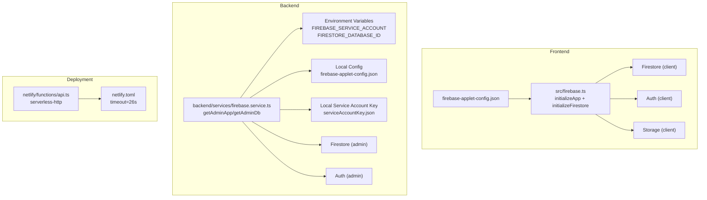
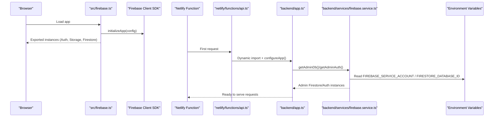
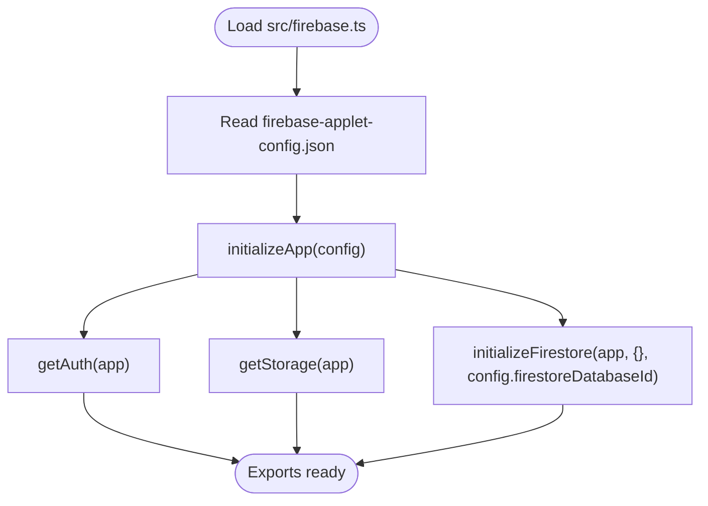
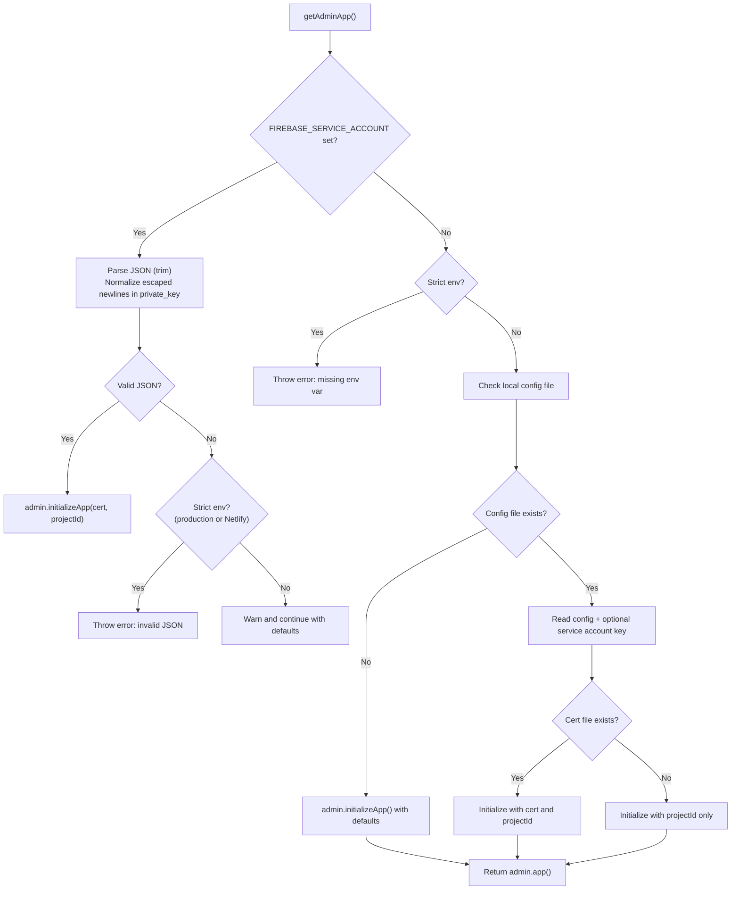
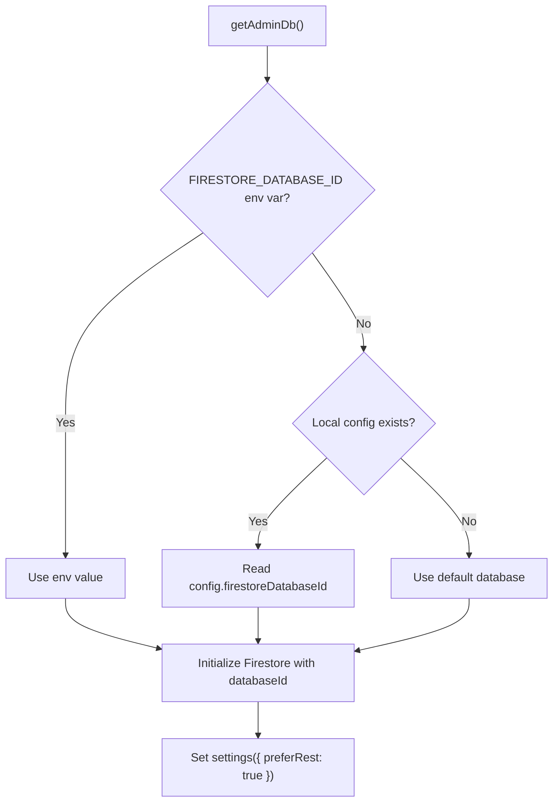
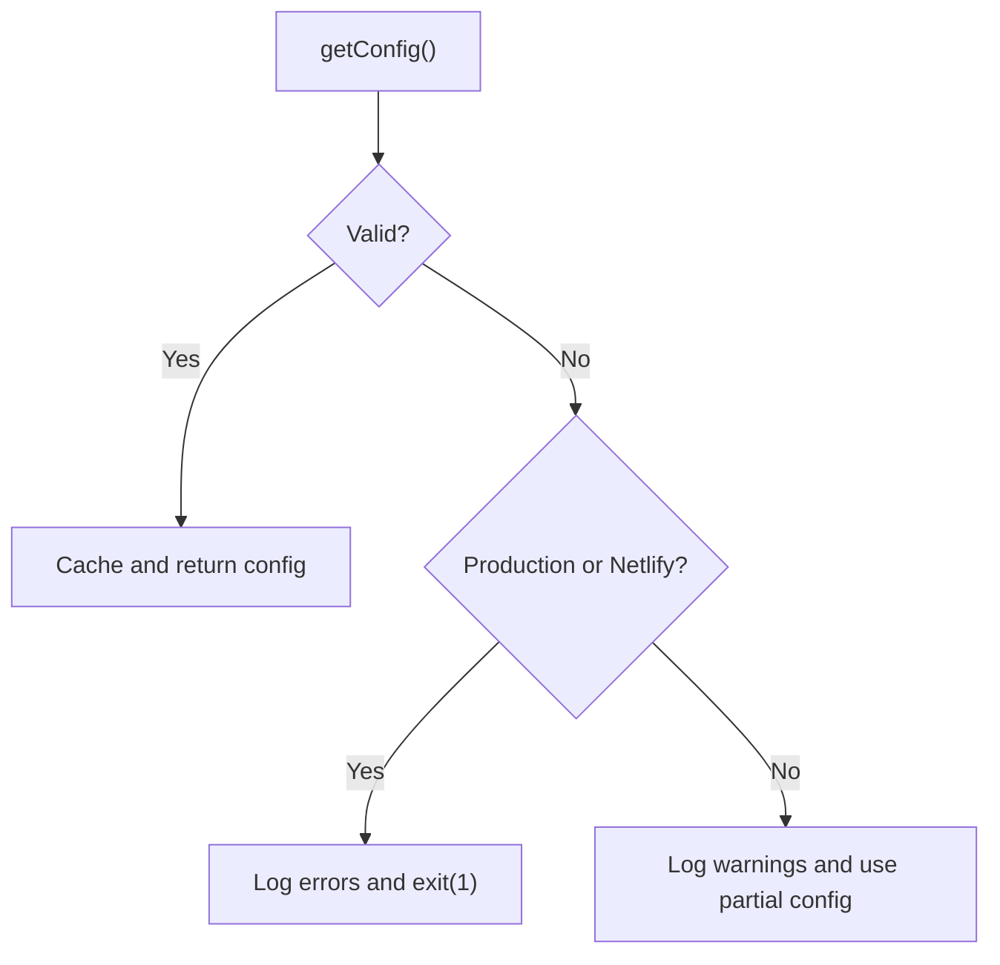
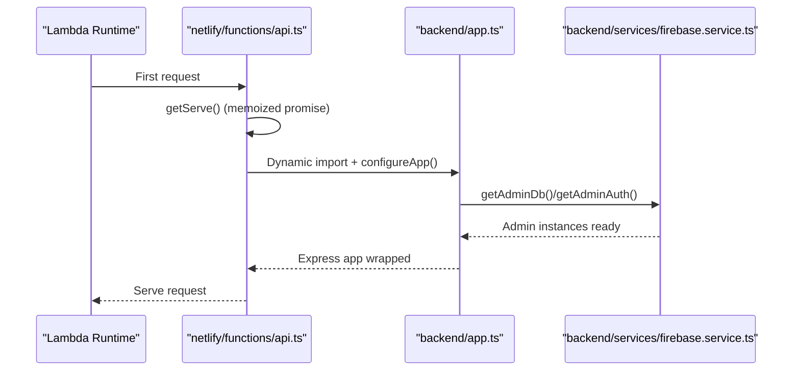
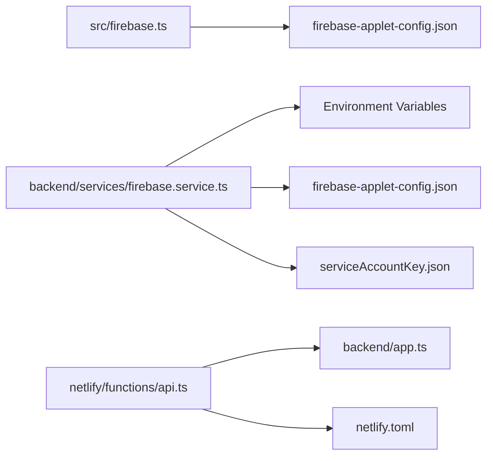

# Firebase Configuration

<cite>
**Referenced Files in This Document**
- [src/firebase.ts](file://src/firebase.ts)
- [firebase-applet-config.json](file://firebase-applet-config.json)
- [backend/services/firebase.service.ts](file://backend/services/firebase.service.ts)
- [backend/utils/config.ts](file://backend/utils/config.ts)
- [netlify/functions/api.ts](file://netlify/functions/api.ts)
- [netlify.toml](file://netlify.toml)
- [backend/app.ts](file://backend/app.ts)
- [backend/index.ts](file://backend/index.ts)
- [serviceAccountKey.json](file://serviceAccountKey.json)
- [README.md](file://README.md)
</cite>

## Table of Contents
1. [Introduction](#introduction)
2. [Project Structure](#project-structure)
3. [Core Components](#core-components)
4. [Architecture Overview](#architecture-overview)
5. [Detailed Component Analysis](#detailed-component-analysis)
6. [Dependency Analysis](#dependency-analysis)
7. [Performance Considerations](#performance-considerations)
8. [Troubleshooting Guide](#troubleshooting-guide)
9. [Conclusion](#conclusion)
10. [Appendices](#appendices)

## Introduction
This document explains the Firebase configuration for FaceAnalytics Pro with a focus on the dual initialization approach: client-side using a local configuration file and server-side using either environment variables or local files. It covers service account setup, credential parsing, security considerations for production versus development, Firestore database ID selection, preferRest settings for serverless optimization, and connection pooling strategies. It also documents environment variable requirements, configuration file formats, fallback mechanisms, initialization sequencing, error handling for malformed credentials, and deployment-specific configurations for Netlify Functions.

## Project Structure
The Firebase configuration spans both frontend and backend:

- Frontend client SDK initialization uses a local JSON configuration file and exports initialized instances for Auth and Storage, and Firestore with a database ID override.
- Backend Admin SDK initialization supports two modes:
  - Environment variable mode (preferred for production and serverless)
  - Local file fallback (development only)
- Netlify Functions defers heavy initialization to reduce cold-start latency and aligns timeouts with serverless constraints.

**Diagram sources**
- [src/firebase.ts:1-21](file://src/firebase.ts#L1-L21)
- [firebase-applet-config.json:1-10](file://firebase-applet-config.json#L1-L10)
- [backend/services/firebase.service.ts:1-120](file://backend/services/firebase.service.ts#L1-L120)
- [netlify/functions/api.ts:1-28](file://netlify/functions/api.ts#L1-L28)
- [netlify.toml:1-42](file://netlify.toml#L1-L42)

**Section sources**
- [src/firebase.ts:1-21](file://src/firebase.ts#L1-L21)
- [backend/services/firebase.service.ts:1-120](file://backend/services/firebase.service.ts#L1-L120)
- [netlify/functions/api.ts:1-28](file://netlify/functions/api.ts#L1-L28)
- [netlify.toml:1-42](file://netlify.toml#L1-L42)

## Core Components
- Frontend client SDK initialization:
  - Uses a local configuration file to initialize the Firebase app and export Auth, Storage, and Firestore instances.
  - Firestore is initialized with an explicit database ID from the configuration file.
- Backend Admin SDK initialization:
  - Supports environment-variable-driven service account initialization for production and serverless.
  - Includes robust error handling for malformed credentials and strict behavior in production/Netlify environments.
  - Provides a local-file fallback for development, including optional local service account key parsing.
  - Selects Firestore database ID from environment variables or local configuration.
  - Enables preferRest for serverless optimization to avoid long gRPC handshakes.
- Environment validation:
  - Zod-based schema validates environment variables at startup, crashing in production if critical variables are missing.
- Netlify Functions:
  - Defers heavy imports and initialization to the first request to stay within cold-start budgets.
  - Aligns with a 26-second function timeout.

**Section sources**
- [src/firebase.ts:1-21](file://src/firebase.ts#L1-L21)
- [firebase-applet-config.json:1-10](file://firebase-applet-config.json#L1-L10)
- [backend/services/firebase.service.ts:1-120](file://backend/services/firebase.service.ts#L1-L120)
- [backend/utils/config.ts:1-110](file://backend/utils/config.ts#L1-L110)
- [netlify/functions/api.ts:1-28](file://netlify/functions/api.ts#L1-L28)
- [netlify.toml:19-26](file://netlify.toml#L19-L26)

## Architecture Overview
The system initializes Firebase in two contexts:

- Client (frontend): Reads a local configuration file and initializes Auth, Storage, and Firestore with a database ID override.
- Server (backend): Initializes Admin SDK using either:
  - Environment variables (recommended for production and serverless)
  - Local configuration and optional service account key (development only)

**Diagram sources**
- [src/firebase.ts:1-21](file://src/firebase.ts#L1-L21)
- [netlify/functions/api.ts:12-27](file://netlify/functions/api.ts#L12-L27)
- [backend/app.ts:15-201](file://backend/app.ts#L15-L201)
- [backend/services/firebase.service.ts:10-119](file://backend/services/firebase.service.ts#L10-L119)

## Detailed Component Analysis

### Frontend Client Initialization
- Loads a local configuration file and initializes the Firebase app.
- Exports Auth, Storage, and Firestore instances.
- Firestore is initialized with an explicit database ID from the configuration file.

**Diagram sources**
- [src/firebase.ts:1-21](file://src/firebase.ts#L1-L21)
- [firebase-applet-config.json:6](file://firebase-applet-config.json#L6)

**Section sources**
- [src/firebase.ts:1-21](file://src/firebase.ts#L1-L21)
- [firebase-applet-config.json:1-10](file://firebase-applet-config.json#L1-L10)

### Backend Admin Initialization and Credential Parsing
- Two-phase initialization:
  1) Environment variable mode (JSON string of service account)
  2) Local file fallback (development only)
- Strict behavior in production and Netlify environments:
  - Malformed environment variables cause immediate failure to prevent silent misconfiguration.
  - Unset environment variables in strict environments trigger explicit errors.
- Local fallback:
  - If the configuration file is absent, initializes with defaults.
  - If present, reads the configuration and optionally the service account key file.
- Database ID resolution:
  - Prefer environment variable for serverless compatibility.
  - Fallback to local configuration when applicable.
- Serverless optimization:
  - Enables preferRest on Firestore to avoid long gRPC handshakes in cold starts.

**Diagram sources**
- [backend/services/firebase.service.ts:10-73](file://backend/services/firebase.service.ts#L10-L73)

**Section sources**
- [backend/services/firebase.service.ts:10-73](file://backend/services/firebase.service.ts#L10-L73)

### Firestore Database ID Resolution and preferRest Settings
- Database ID precedence:
  - Environment variable for serverless compatibility.
  - Local configuration file fallback for development.
- preferRest:
  - Applied to Firestore admin instance to optimize serverless cold starts.
  - Safely ignored if settings were already applied (e.g., hot reload).

**Diagram sources**
- [backend/services/firebase.service.ts:75-111](file://backend/services/firebase.service.ts#L75-L111)

**Section sources**
- [backend/services/firebase.service.ts:75-111](file://backend/services/firebase.service.ts#L75-L111)

### Environment Validation and Strict Mode
- Zod schema enforces environment variables at startup.
- Production and Netlify environments:
  - Crash on validation failure.
  - Prevents partially configured deployments.
- Development environments:
  - Log warnings and continue with defaults.

**Diagram sources**
- [backend/utils/config.ts:59-82](file://backend/utils/config.ts#L59-L82)

**Section sources**
- [backend/utils/config.ts:1-110](file://backend/utils/config.ts#L1-L110)

### Netlify Functions Initialization and Cold-Start Optimization
- Defer heavy imports and initialization to the first invocation.
- Use serverless-http to wrap the Express app.
- Netlify function timeout is set to 26 seconds to accommodate long-running operations.

**Diagram sources**
- [netlify/functions/api.ts:12-27](file://netlify/functions/api.ts#L12-L27)
- [netlify.toml:19-26](file://netlify.toml#L19-L26)
- [backend/app.ts:15-201](file://backend/app.ts#L15-L201)
- [backend/services/firebase.service.ts:10-119](file://backend/services/firebase.service.ts#L10-L119)

**Section sources**
- [netlify/functions/api.ts:1-28](file://netlify/functions/api.ts#L1-L28)
- [netlify.toml:19-26](file://netlify.toml#L19-L26)
- [backend/app.ts:15-201](file://backend/app.ts#L15-L201)

## Dependency Analysis
- Frontend depends on a local configuration file for client SDK initialization.
- Backend Admin SDK depends on:
  - Environment variables for production/serverless
  - Local configuration and optional service account key for development
- Netlify Functions depend on:
  - serverless-http for wrapping the Express app
  - netlify.toml for function timeout and bundler configuration

**Diagram sources**
- [src/firebase.ts:1-21](file://src/firebase.ts#L1-L21)
- [firebase-applet-config.json:1-10](file://firebase-applet-config.json#L1-L10)
- [backend/services/firebase.service.ts:1-120](file://backend/services/firebase.service.ts#L1-L120)
- [serviceAccountKey.json:1-14](file://serviceAccountKey.json#L1-L14)
- [netlify/functions/api.ts:1-28](file://netlify/functions/api.ts#L1-L28)
- [netlify.toml:1-42](file://netlify.toml#L1-L42)

**Section sources**
- [src/firebase.ts:1-21](file://src/firebase.ts#L1-L21)
- [backend/services/firebase.service.ts:1-120](file://backend/services/firebase.service.ts#L1-L120)
- [netlify/functions/api.ts:1-28](file://netlify/functions/api.ts#L1-L28)
- [netlify.toml:1-42](file://netlify.toml#L1-L42)

## Performance Considerations
- preferRest for Firestore:
  - Enabled on the admin Firestore instance to avoid long gRPC handshakes during cold starts in serverless environments.
  - Handshake delays can exceed Netlify’s 26-second function timeout, causing 502 responses.
- Serverless initialization:
  - Heavy imports are deferred to the first request to keep the Lambda initialization phase small.
  - Function timeout is tuned to 26 seconds to accommodate long-running AI operations.
- Connection pooling:
  - Firestore admin instances reuse the same app and are scoped per database ID.
  - No explicit pooling configuration is applied; preferRest reduces connection overhead in cold starts.

**Section sources**
- [backend/services/firebase.service.ts:97-108](file://backend/services/firebase.service.ts#L97-L108)
- [netlify/functions/api.ts:3-7](file://netlify/functions/api.ts#L3-L7)
- [netlify.toml:19-26](file://netlify.toml#L19-L26)

## Troubleshooting Guide
- Malformed service account JSON in environment variables:
  - Symptom: Immediate failure in production/Netlify environments.
  - Cause: JSON.parse fails; private_key newline normalization is attempted but still invalid.
  - Action: Verify the JSON string is valid and properly escaped; remove extraneous whitespace.
- Missing environment variables in strict environments:
  - Symptom: Explicit error thrown indicating the variable is not set.
  - Action: Set FIREBASE_SERVICE_ACCOUNT and FIRESTORE_DATABASE_ID in production/Netlify.
- Local configuration file not found:
  - Symptom: Warning logged; Admin SDK initializes with defaults.
  - Action: Ensure firebase-applet-config.json exists in the working directory for development.
- Service account key file missing:
  - Symptom: Admin SDK initializes with projectId only.
  - Action: Provide serviceAccountKey.json or supply credentials via environment variables.
- 502 Bad Gateway on Netlify:
  - Symptom: Function timeout exceeded.
  - Cause: Long gRPC handshake in cold start.
  - Action: Ensure preferRest is enabled and function timeout is sufficient (already set to 26s).

**Section sources**
- [backend/services/firebase.service.ts:31-48](file://backend/services/firebase.service.ts#L31-L48)
- [backend/services/firebase.service.ts:53-57](file://backend/services/firebase.service.ts#L53-L57)
- [backend/services/firebase.service.ts:62-70](file://backend/services/firebase.service.ts#L62-L70)
- [netlify/functions/api.ts:3-7](file://netlify/functions/api.ts#L3-L7)
- [netlify.toml:19-26](file://netlify.toml#L19-L26)

## Conclusion
FaceAnalytics Pro employs a robust, dual-mode Firebase configuration:
- Frontend uses a local configuration file for client SDK initialization.
- Backend uses environment variables for production and serverless, with a safe local fallback for development.
- Strict validation and error handling prevent misconfiguration in production.
- Serverless optimization leverages preferRest and deferred initialization to mitigate cold-start costs and timeouts.
- Security best practices include environment-based credential management and controlled fallbacks.

## Appendices

### Environment Variables and Configuration Files
- Required for backend Admin SDK:
  - FIREBASE_SERVICE_ACCOUNT: JSON string of service account credentials (preferred for production/serverless).
  - FIRESTORE_DATABASE_ID: Firestore database ID (overrides local config in serverless).
- Optional:
  - NETLIFY: Presence indicates strict environment behavior.
  - NODE_ENV: Controls strictness and development behavior.
- Configuration files:
  - firebase-applet-config.json: Contains project and client configuration, including Firestore database ID.
  - serviceAccountKey.json: Optional service account key for development fallback.

**Section sources**
- [backend/utils/config.ts:7-48](file://backend/utils/config.ts#L7-L48)
- [firebase-applet-config.json:1-10](file://firebase-applet-config.json#L1-L10)
- [serviceAccountKey.json:1-14](file://serviceAccountKey.json#L1-L14)

### Deployment-Specific Notes
- Netlify Functions:
  - serverless-http wrapper ensures the Express app is served within Netlify’s runtime.
  - Timeout is set to 26 seconds to accommodate long-running AI operations.
  - External node modules are whitelisted for bundling.
- Local development:
  - dotenv is loaded to populate environment variables.
  - Vite middleware is used in non-production environments.

**Section sources**
- [netlify/functions/api.ts:1-28](file://netlify/functions/api.ts#L1-L28)
- [netlify.toml:1-42](file://netlify.toml#L1-L42)
- [backend/index.ts:1-29](file://backend/index.ts#L1-L29)

### Security Best Practices
- Service account management:
  - Store FIREBASE_SERVICE_ACCOUNT as an environment variable; avoid committing secrets to source control.
  - Rotate service accounts periodically and update environment variables accordingly.
- Credential rotation:
  - Update environment variables on deployment platforms (Netlify, CI/CD) after generating new keys.
- Development vs production:
  - Do not rely on local files for production; enforce strict environment checks.
  - Keep local configuration minimal and separate from sensitive credentials.

**Section sources**
- [backend/utils/config.ts:68-77](file://backend/utils/config.ts#L68-L77)
- [backend/services/firebase.service.ts:12-49](file://backend/services/firebase.service.ts#L12-L49)