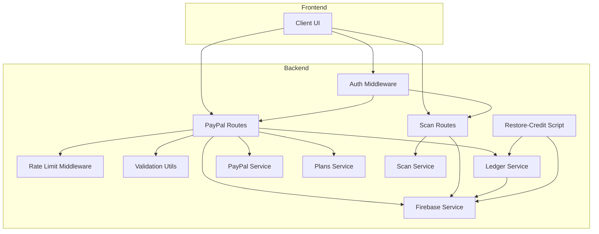
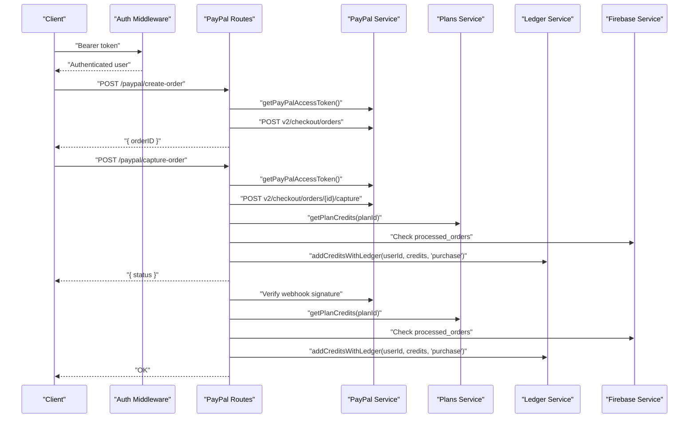
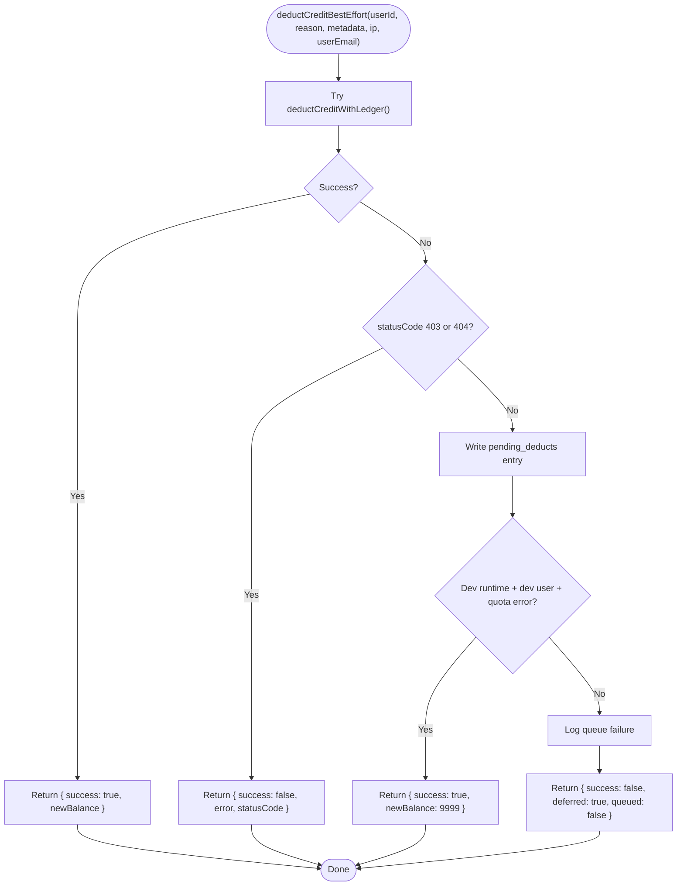
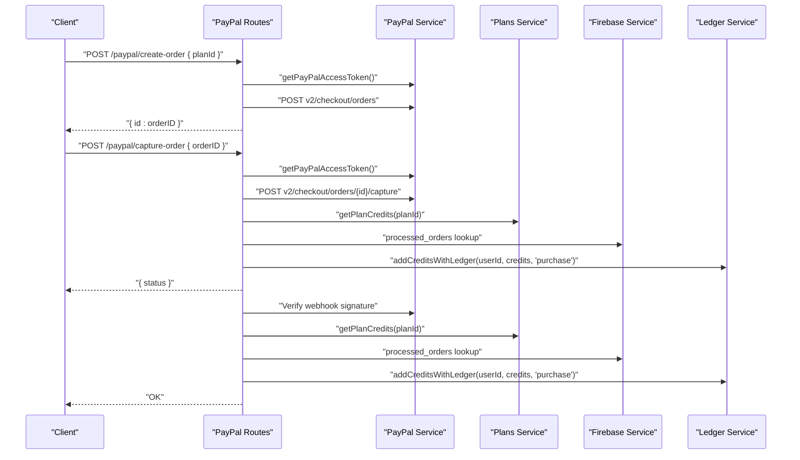
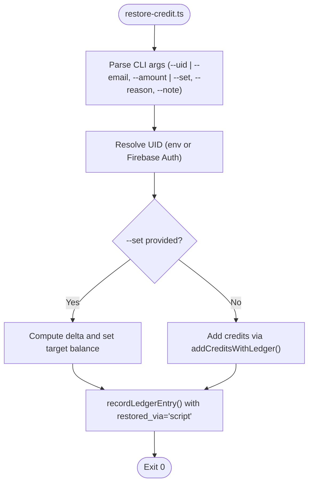
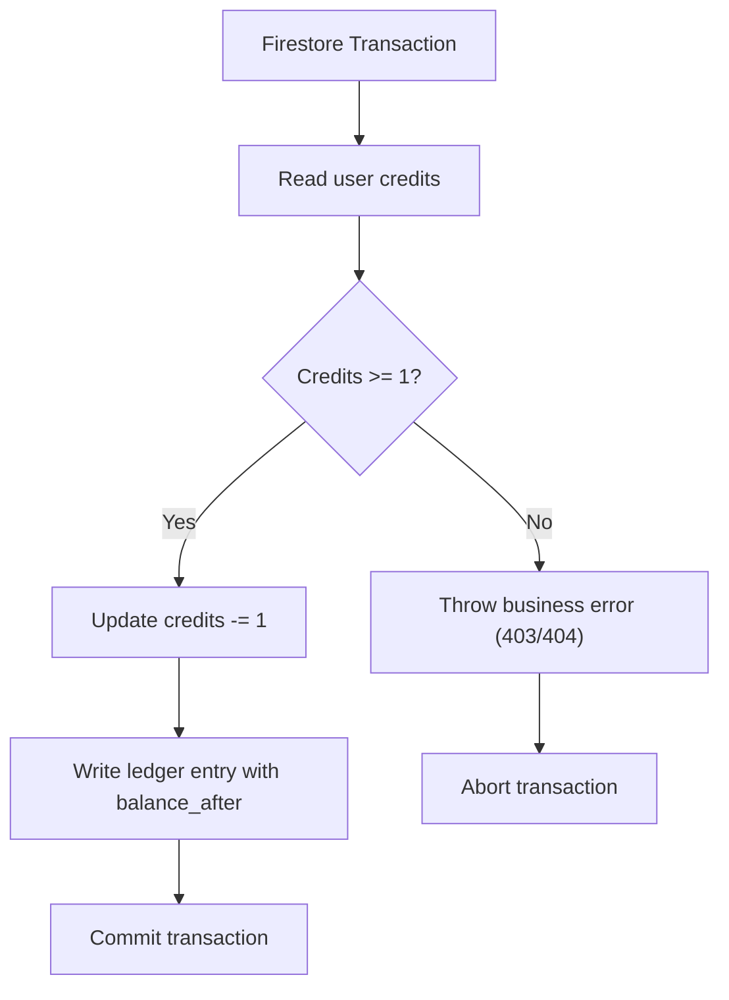
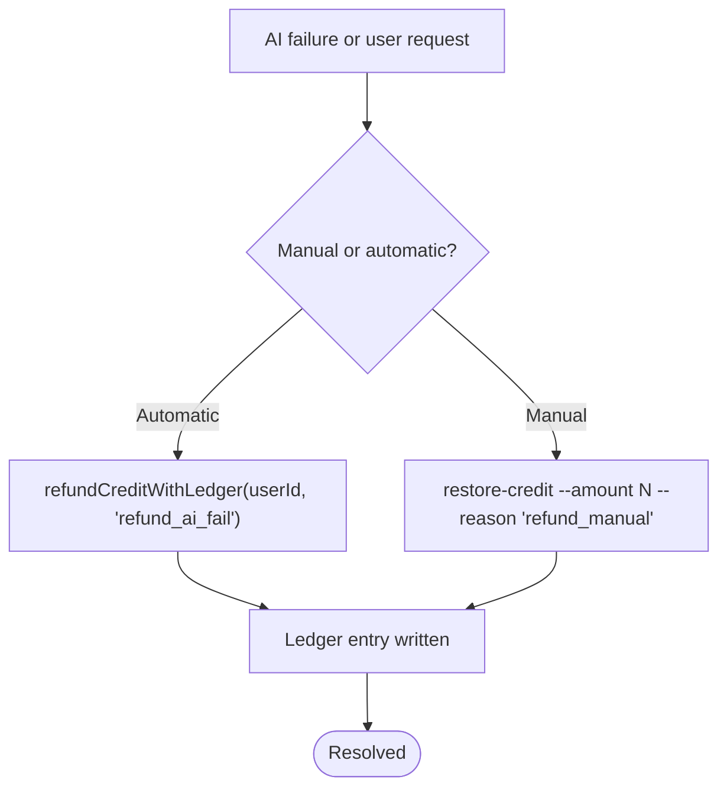
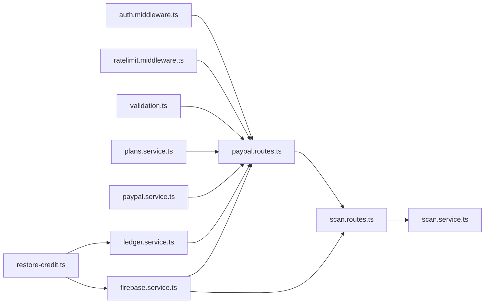

# Ledger Service and Credit Management

<cite>
**Referenced Files in This Document**
- [ledger.service.ts](file://backend/services/ledger.service.ts)
- [restore-credit.ts](file://backend/scripts/restore-credit.ts)
- [paypal.routes.ts](file://backend/routes/paypal.routes.ts)
- [paypal.service.ts](file://backend/services/paypal.service.ts)
- [plans.service.ts](file://backend/services/plans.service.ts)
- [auth.middleware.ts](file://backend/middleware/auth.middleware.ts)
- [firebase.service.ts](file://backend/services/firebase.service.ts)
- [validation.ts](file://backend/utils/validation.ts)
- [ratelimit.middleware.ts](file://backend/middleware/ratelimit.middleware.ts)
- [scan.routes.ts](file://backend/routes/scan.routes.ts)
- [scan.service.ts](file://backend/services/scan.service.ts)
</cite>

## Table of Contents
1. [Introduction](#introduction)
2. [Project Structure](#project-structure)
3. [Core Components](#core-components)
4. [Architecture Overview](#architecture-overview)
5. [Detailed Component Analysis](#detailed-component-analysis)
6. [Dependency Analysis](#dependency-analysis)
7. [Performance Considerations](#performance-considerations)
8. [Troubleshooting Guide](#troubleshooting-guide)
9. [Conclusion](#conclusion)

## Introduction
This document describes the ledger service and credit management system powering financial transactions and user credit movements. It covers the credit transaction model (purchase logging, refund processing, and balance adjustments), the immutable audit trail, PayPal integration for payments and subscriptions, reconciliation scripts for edge cases, transaction isolation and concurrency controls, and reporting capabilities for financial audits and revenue tracking.

## Project Structure
The credit and payment system spans backend services, routes, middleware, and scripts:
- Services: ledger accounting, PayPal token management, plan definitions, Firebase access, rate limiting, and scan storage
- Routes: PayPal checkout lifecycle and webhook handling
- Scripts: credit restoration utilities
- Middleware: authentication and rate limiting
- Utilities: request validation



**Diagram sources**
- [paypal.routes.ts:1-302](file://backend/routes/paypal.routes.ts#L1-L302)
- [ledger.service.ts:1-269](file://backend/services/ledger.service.ts#L1-L269)
- [paypal.service.ts:1-41](file://backend/services/paypal.service.ts#L1-L41)
- [plans.service.ts:1-34](file://backend/services/plans.service.ts#L1-L34)
- [auth.middleware.ts:1-40](file://backend/middleware/auth.middleware.ts#L1-L40)
- [firebase.service.ts:1-120](file://backend/services/firebase.service.ts#L1-L120)
- [ratelimit.middleware.ts:1-134](file://backend/middleware/ratelimit.middleware.ts#L1-L134)
- [validation.ts:1-103](file://backend/utils/validation.ts#L1-L103)
- [scan.routes.ts:1-63](file://backend/routes/scan.routes.ts#L1-L63)
- [scan.service.ts:1-134](file://backend/services/scan.service.ts#L1-L134)
- [restore-credit.ts:1-161](file://backend/scripts/restore-credit.ts#L1-L161)

**Section sources**
- [paypal.routes.ts:1-302](file://backend/routes/paypal.routes.ts#L1-L302)
- [ledger.service.ts:1-269](file://backend/services/ledger.service.ts#L1-L269)
- [paypal.service.ts:1-41](file://backend/services/paypal.service.ts#L1-L41)
- [plans.service.ts:1-34](file://backend/services/plans.service.ts#L1-L34)
- [auth.middleware.ts:1-40](file://backend/middleware/auth.middleware.ts#L1-L40)
- [firebase.service.ts:1-120](file://backend/services/firebase.service.ts#L1-L120)
- [ratelimit.middleware.ts:1-134](file://backend/middleware/ratelimit.middleware.ts#L1-L134)
- [validation.ts:1-103](file://backend/utils/validation.ts#L1-L103)
- [scan.routes.ts:1-63](file://backend/routes/scan.routes.ts#L1-L63)
- [scan.service.ts:1-134](file://backend/services/scan.service.ts#L1-L134)
- [restore-credit.ts:1-161](file://backend/scripts/restore-credit.ts#L1-L161)

## Core Components
- Ledger Service: Atomic credit deductions, additions, and immutable audit entries; best-effort deduction with reconciliation queue; dev-mode bypass for quota exhaustion
- PayPal Routes: Create order, capture order, and webhook handling; adds credits and marks orders processed
- Plans Service: Centralized plan configuration for credits and pricing
- PayPal Service: OAuth token caching and retrieval
- Firebase Service: Firestore/Auth initialization and settings for serverless reliability
- Rate Limit Middleware: Sliding window and daily caps with Redis
- Validation Utils: Zod schemas for PayPal endpoints
- Restore-Credit Script: One-shot credit top-ups and grants with explicit audit trail

**Section sources**
- [ledger.service.ts:1-269](file://backend/services/ledger.service.ts#L1-L269)
- [paypal.routes.ts:1-302](file://backend/routes/paypal.routes.ts#L1-L302)
- [paypal.service.ts:1-41](file://backend/services/paypal.service.ts#L1-L41)
- [plans.service.ts:1-34](file://backend/services/plans.service.ts#L1-L34)
- [firebase.service.ts:1-120](file://backend/services/firebase.service.ts#L1-L120)
- [ratelimit.middleware.ts:1-134](file://backend/middleware/ratelimit.middleware.ts#L1-L134)
- [validation.ts:1-103](file://backend/utils/validation.ts#L1-L103)
- [restore-credit.ts:1-161](file://backend/scripts/restore-credit.ts#L1-L161)

## Architecture Overview
The system enforces atomicity and immutability:
- Credit changes are recorded as ledger entries before or after balance updates depending on the operation
- Transactions wrap user balance updates and ledger writes to guarantee consistency
- PayPal capture and webhooks add credits and mark orders processed to avoid double counting
- Best-effort deduction queues failed charges for later reconciliation
- Dev-mode allows testing under Firestore quota exhaustion



**Diagram sources**
- [paypal.routes.ts:1-302](file://backend/routes/paypal.routes.ts#L1-L302)
- [paypal.service.ts:1-41](file://backend/services/paypal.service.ts#L1-L41)
- [plans.service.ts:1-34](file://backend/services/plans.service.ts#L1-L34)
- [ledger.service.ts:245-268](file://backend/services/ledger.service.ts#L245-L268)
- [firebase.service.ts:1-120](file://backend/services/firebase.service.ts#L1-L120)

## Detailed Component Analysis

### Ledger Service
Implements the credit transaction model with:
- Immutable audit entries for every credit change
- Atomic operations combining user balance updates and ledger writes
- Best-effort deduction with reconciliation queue for transient failures
- Dev-mode bypass for quota exhaustion during testing

Key workflows:
- Deduct credit with ledger: runs a Firestore transaction to check balance, decrement by one, and write a ledger entry
- Add credits with ledger: increments user credits and logs the change
- Refund credit with ledger: increments user credits and logs a refund entry
- Best-effort deduction: attempts atomic deduction; on business errors propagates; on transient errors writes to pending_deducts; dev-mode may bypass under quota



**Diagram sources**
- [ledger.service.ts:189-240](file://backend/services/ledger.service.ts#L189-L240)

**Section sources**
- [ledger.service.ts:1-269](file://backend/services/ledger.service.ts#L1-L269)

### PayPal Payment Processing and Subscription Management
Handles the complete PayPal lifecycle:
- Create order: validates planId, constructs purchase unit with custom_id containing userId and planId, returns order id
- Capture order: verifies order completion, extracts planId from custom_id, ensures idempotency via processed_orders, adds credits, records order
- Webhook: verifies signature, detects replay attacks, extracts planId from custom_id, ensures idempotency, adds credits, records order, sends receipt email



**Diagram sources**
- [paypal.routes.ts:1-302](file://backend/routes/paypal.routes.ts#L1-L302)
- [paypal.service.ts:1-41](file://backend/services/paypal.service.ts#L1-L41)
- [plans.service.ts:1-34](file://backend/services/plans.service.ts#L1-L34)
- [ledger.service.ts:245-268](file://backend/services/ledger.service.ts#L245-L268)
- [firebase.service.ts:1-120](file://backend/services/firebase.service.ts#L1-L120)

**Section sources**
- [paypal.routes.ts:1-302](file://backend/routes/paypal.routes.ts#L1-L302)
- [paypal.service.ts:1-41](file://backend/services/paypal.service.ts#L1-L41)
- [plans.service.ts:1-34](file://backend/services/plans.service.ts#L1-L34)

### Credit Restoration Scripts and Manual Interventions
The restore-credit script supports:
- Adding credits to a user by uid or email
- Setting a target balance with automatic delta calculation
- Writing explicit ledger entries with metadata for auditability
- Safe-to-re-run behavior with explicit markers



**Diagram sources**
- [restore-credit.ts:1-161](file://backend/scripts/restore-credit.ts#L1-L161)
- [ledger.service.ts:245-268](file://backend/services/ledger.service.ts#L245-L268)

**Section sources**
- [restore-credit.ts:1-161](file://backend/scripts/restore-credit.ts#L1-L161)
- [ledger.service.ts:245-268](file://backend/services/ledger.service.ts#L245-L268)

### Audit Trail Implementation
Every credit movement is recorded immutably:
- Deduction, addition, and refund operations write ledger entries
- Entries include userId, change (+/-), reason, optional balance snapshot, metadata, IP, and server timestamp
- Best-effort ledger writes do not block primary flows; failures are logged

```mermaid
classDiagram
class LedgerEntry {
+string userId
+number change
+LedgerReason reason
+number balance_after
+Record metadata
+string ip
+any timestamp
}
class LedgerReason {
<<enum>>
"analyze"
"celebrity_scan"
"hair_scan"
"refund_ai_fail"
"refund_manual"
"purchase"
"referral_invitee"
"referral_inviter"
"dev_boost"
"admin_grant"
"fraud_freeze"
}
LedgerEntry --> LedgerReason : "uses"
```

**Diagram sources**
- [ledger.service.ts:22-53](file://backend/services/ledger.service.ts#L22-L53)

**Section sources**
- [ledger.service.ts:1-269](file://backend/services/ledger.service.ts#L1-L269)

### Transaction Isolation, Concurrency Control, and Consistency
- Firestore transactions: atomic balance updates and ledger writes occur in a single transaction to maintain consistency
- Idempotency: processed_orders collection prevents duplicate credit additions for the same PayPal order
- Best-effort guarantees: transient failures during post-success deductions queue intents for later reconciliation
- Dev-mode bypass: during quota exhaustion, dev users may proceed without deduction to keep testing viable
- Serverless settings: Firestore configured for HTTP/1.1 to avoid cold-start timeouts in serverless environments



**Diagram sources**
- [ledger.service.ts:97-141](file://backend/services/ledger.service.ts#L97-L141)

**Section sources**
- [ledger.service.ts:97-141](file://backend/services/ledger.service.ts#L97-L141)
- [paypal.routes.ts:128-151](file://backend/routes/paypal.routes.ts#L128-L151)
- [firebase.service.ts:93-108](file://backend/services/firebase.service.ts#L93-L108)

### Refund Processing Workflows and Dispute Resolution
- Automatic refunds: refundCreditWithLedger increments credits and logs a refund entry
- Manual refunds: restore-credit script with reason 'refund_manual' and metadata for audit trail
- Disputes: use pending_deducts reconciliation queue; investigate and adjust balances accordingly
- Non-refundable cases: policies exclude consumed credits, promotional bonuses, suspended accounts, and late requests



**Diagram sources**
- [ledger.service.ts:147-169](file://backend/services/ledger.service.ts#L147-L169)
- [restore-credit.ts:1-161](file://backend/scripts/restore-credit.ts#L1-L161)

**Section sources**
- [ledger.service.ts:147-169](file://backend/services/ledger.service.ts#L147-L169)
- [restore-credit.ts:1-161](file://backend/scripts/restore-credit.ts#L1-L161)

### Reconciliation Procedures
- Pending deductions: when best-effort deduction fails, a pending_deducts entry is created with metadata and error details
- Reconciliation script: drains pending_deducts by retrying atomic deductions and writing ledger entries
- Idempotency: processed_orders ensures duplicate credits are not issued

**Section sources**
- [ledger.service.ts:189-240](file://backend/services/ledger.service.ts#L189-L240)
- [paypal.routes.ts:128-151](file://backend/routes/paypal.routes.ts#L128-L151)

### Reporting Capabilities for Financial Audits and Revenue Tracking
- Ledger entries: immutable records of all credit movements with timestamps and reasons
- Purchase tracking: 'purchase' entries include orderId, planId, and source (webhook vs capture)
- Email receipts: automated confirmation sent upon successful purchase
- Manual interventions: 'refund_manual' and 'admin_grant' entries with metadata for audit trail

**Section sources**
- [ledger.service.ts:60-91](file://backend/services/ledger.service.ts#L60-L91)
- [paypal.routes.ts:134-151](file://backend/routes/paypal.routes.ts#L134-L151)
- [paypal.routes.ts:250-291](file://backend/routes/paypal.routes.ts#L250-L291)

## Dependency Analysis
The system exhibits clear separation of concerns:
- Routes depend on middleware (auth, rate limit), validation, services (PayPal, plans, ledger, Firebase)
- Services encapsulate domain logic and external integrations
- Scripts depend on services for safe, auditable operations



**Diagram sources**
- [paypal.routes.ts:1-302](file://backend/routes/paypal.routes.ts#L1-L302)
- [auth.middleware.ts:1-40](file://backend/middleware/auth.middleware.ts#L1-L40)
- [ratelimit.middleware.ts:1-134](file://backend/middleware/ratelimit.middleware.ts#L1-L134)
- [validation.ts:1-103](file://backend/utils/validation.ts#L1-L103)
- [plans.service.ts:1-34](file://backend/services/plans.service.ts#L1-L34)
- [paypal.service.ts:1-41](file://backend/services/paypal.service.ts#L1-L41)
- [ledger.service.ts:1-269](file://backend/services/ledger.service.ts#L1-L269)
- [firebase.service.ts:1-120](file://backend/services/firebase.service.ts#L1-L120)
- [scan.routes.ts:1-63](file://backend/routes/scan.routes.ts#L1-L63)
- [scan.service.ts:1-134](file://backend/services/scan.service.ts#L1-L134)
- [restore-credit.ts:1-161](file://backend/scripts/restore-credit.ts#L1-L161)

**Section sources**
- [paypal.routes.ts:1-302](file://backend/routes/paypal.routes.ts#L1-L302)
- [auth.middleware.ts:1-40](file://backend/middleware/auth.middleware.ts#L1-L40)
- [ratelimit.middleware.ts:1-134](file://backend/middleware/ratelimit.middleware.ts#L1-L134)
- [validation.ts:1-103](file://backend/utils/validation.ts#L1-L103)
- [plans.service.ts:1-34](file://backend/services/plans.service.ts#L1-L34)
- [paypal.service.ts:1-41](file://backend/services/paypal.service.ts#L1-L41)
- [ledger.service.ts:1-269](file://backend/services/ledger.service.ts#L1-L269)
- [firebase.service.ts:1-120](file://backend/services/firebase.service.ts#L1-L120)
- [scan.routes.ts:1-63](file://backend/routes/scan.routes.ts#L1-L63)
- [scan.service.ts:1-134](file://backend/services/scan.service.ts#L1-L134)
- [restore-credit.ts:1-161](file://backend/scripts/restore-credit.ts#L1-L161)

## Performance Considerations
- Firestore HTTP/1.1 settings: configured for serverless reliability to avoid cold-start timeouts
- Token caching: PayPal access tokens cached with buffer to reduce API calls
- Idempotency: processed_orders prevents redundant credit additions
- Rate limiting: sliding window and daily caps protect resources and prevent abuse
- Best-effort operations: ledger writes do not block primary flows; failures are logged and queued for reconciliation

[No sources needed since this section provides general guidance]

## Troubleshooting Guide
Common scenarios and resolutions:
- Insufficient credits: business error propagated; ensure user has sufficient balance before initiating analysis
- User not found: business error propagated; verify user exists and is authenticated
- Transient failures: best-effort deduction queues pending_deducts; reconcile later using the reconciliation procedure
- Dev-mode quota exhaustion: dev users may proceed without deduction; monitor logs for quota warnings
- Duplicate webhook events: replay protection blocks duplicate event IDs; signature verification required in production
- Missing planId: validate planId in order metadata; ensure custom_id is correctly formatted

**Section sources**
- [ledger.service.ts:189-240](file://backend/services/ledger.service.ts#L189-L240)
- [paypal.routes.ts:162-299](file://backend/routes/paypal.routes.ts#L162-L299)
- [firebase.service.ts:93-108](file://backend/services/firebase.service.ts#L93-L108)

## Conclusion
The ledger service and credit management system provides robust, auditable financial operations with strong isolation and idempotency guarantees. PayPal integration is secure and resilient, with comprehensive reconciliation and manual intervention capabilities. The design balances reliability, performance, and compliance through immutable audit trails, transactional consistency, and operational safeguards.