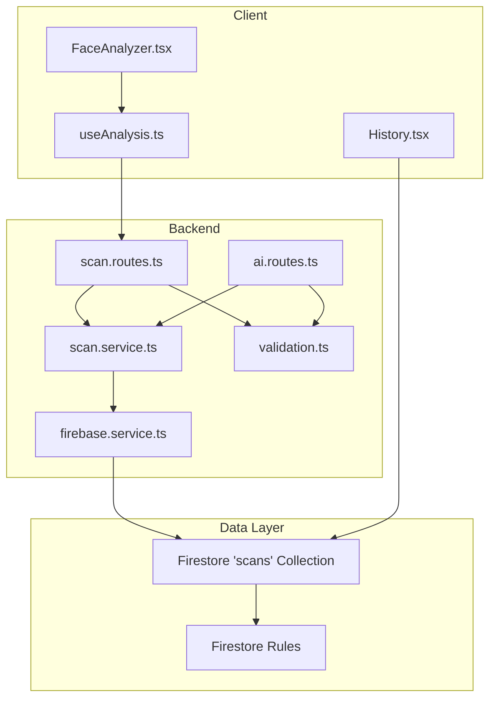
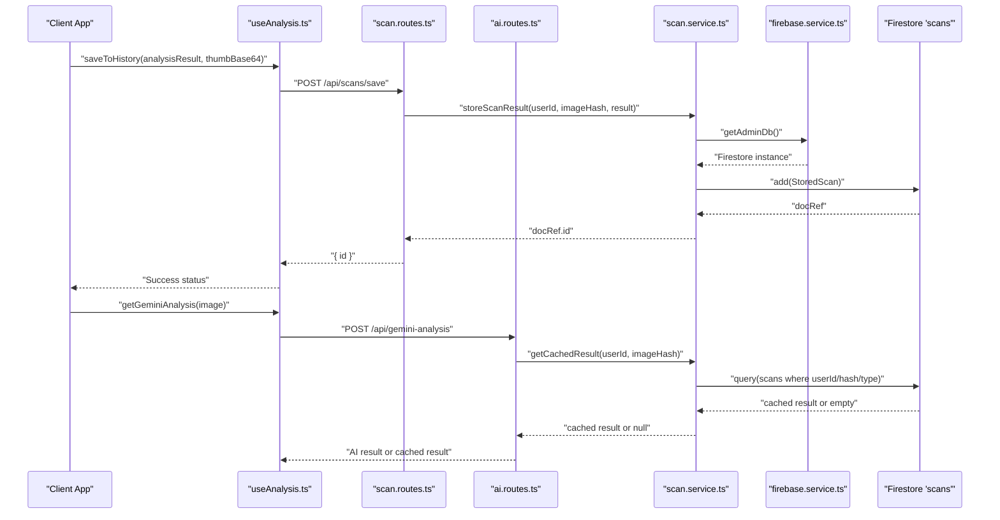
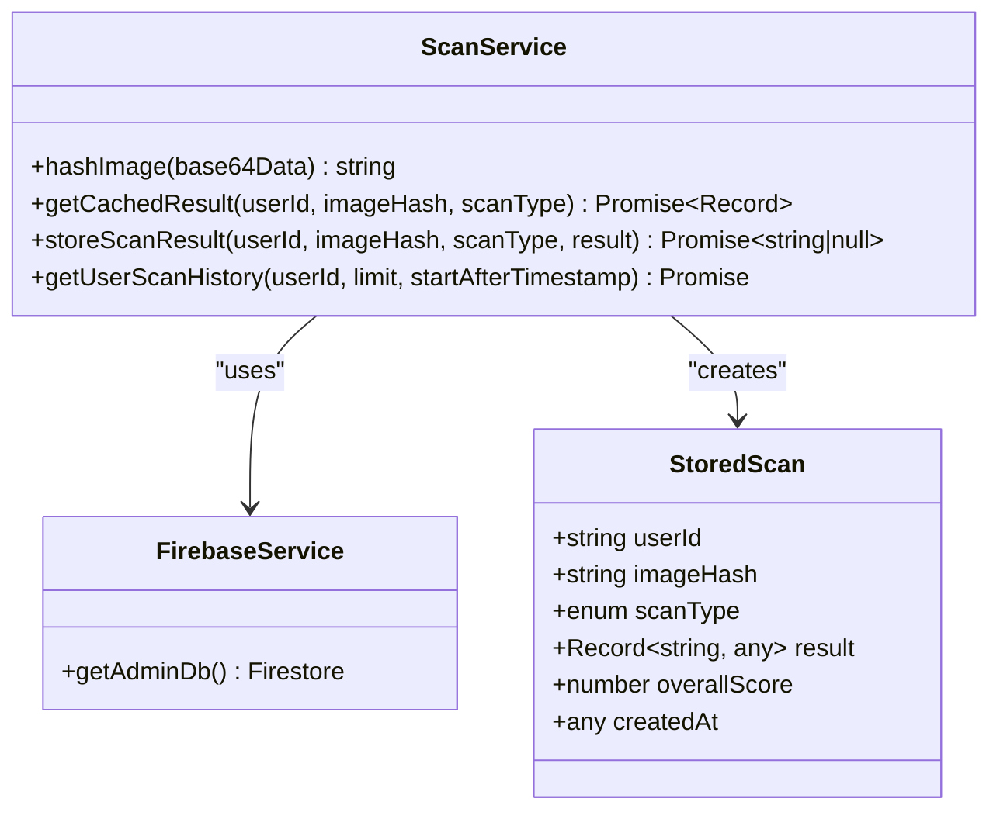
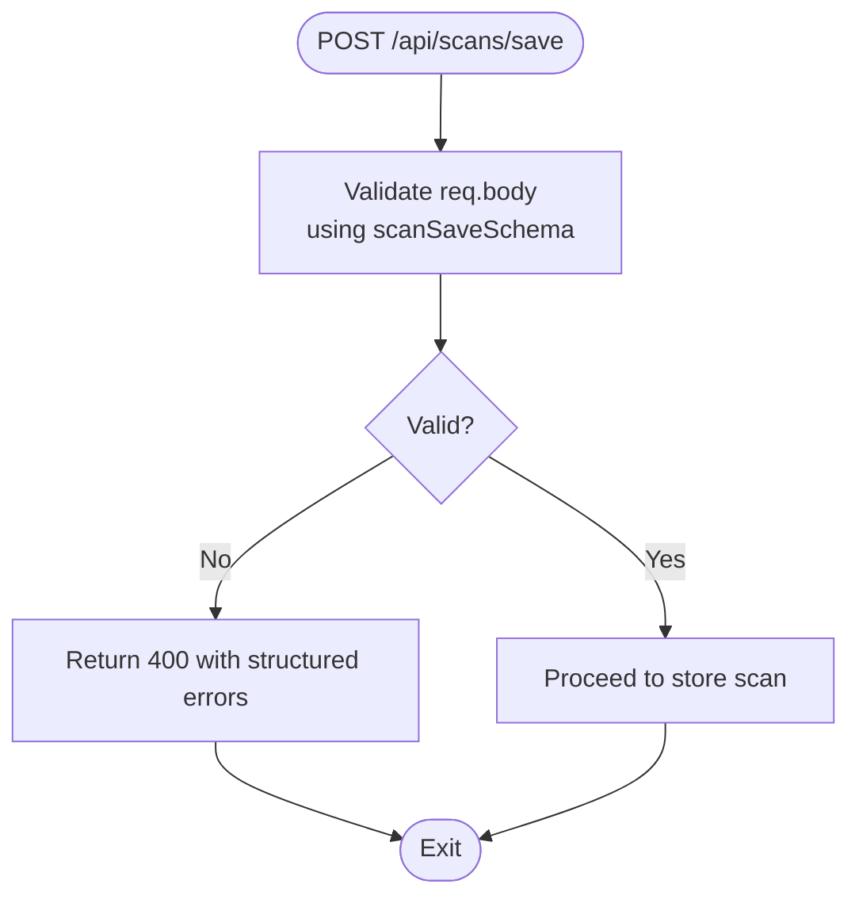
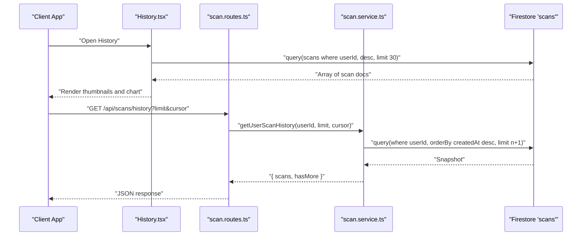
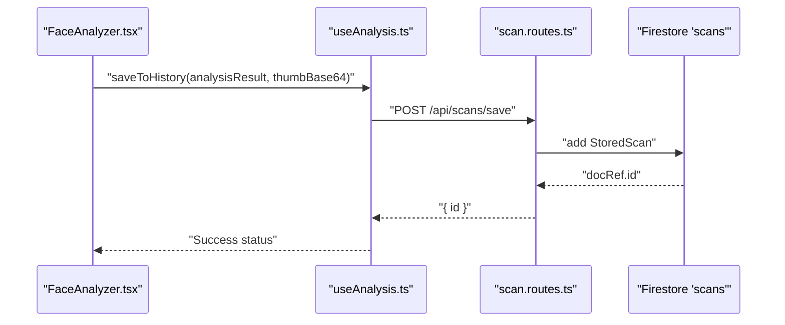
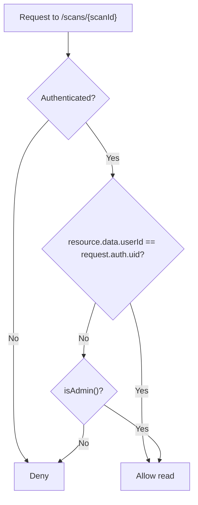
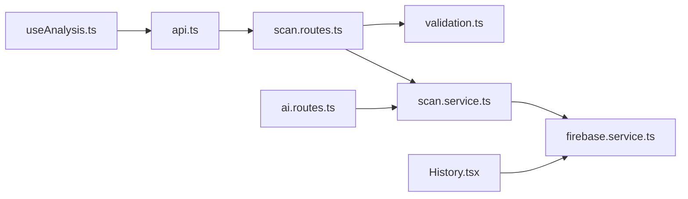
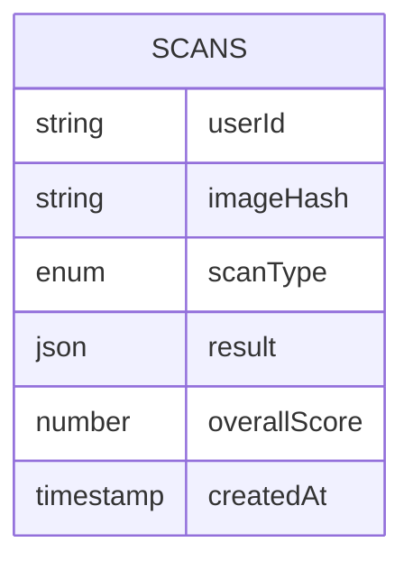

# Scan Service Implementation

<cite>
**Referenced Files in This Document**
- [scan.service.ts](file://backend/services/scan.service.ts)
- [scan.routes.ts](file://backend/routes/scan.routes.ts)
- [firebase.service.ts](file://backend/services/firebase.service.ts)
- [validation.ts](file://backend/utils/validation.ts)
- [ai.routes.ts](file://backend/routes/ai.routes.ts)
- [useAnalysis.ts](file://src/components/FaceAnalyzer/hooks/useAnalysis.ts)
- [FaceAnalyzer.tsx](file://src/components/FaceAnalyzer/FaceAnalyzer.tsx)
- [History.tsx](file://src/components/History.tsx)
- [HistoryPage.tsx](file://src/pages/HistoryPage.tsx)
- [api.ts](file://src/lib/api.ts)
- [analysis.ts](file://src/types/analysis.ts)
- [firestore.rules](file://firestore.rules)
- [restore-credit.ts](file://backend/scripts/restore-credit.ts)
</cite>

## Table of Contents
1. [Introduction](#introduction)
2. [Project Structure](#project-structure)
3. [Core Components](#core-components)
4. [Architecture Overview](#architecture-overview)
5. [Detailed Component Analysis](#detailed-component-analysis)
6. [Dependency Analysis](#dependency-analysis)
7. [Performance Considerations](#performance-considerations)
8. [Troubleshooting Guide](#troubleshooting-guide)
9. [Conclusion](#conclusion)
10. [Appendices](#appendices)

## Introduction
This document describes the scan service implementation in FaceAnalytics Pro, focusing on how analysis results are persisted, validated, transformed, and retrieved. It explains the integration between client-side analysis components and server-side storage, the caching and deduplication strategy, pagination for historical scans, and operational safeguards such as rate limiting and fraud detection. It also covers performance optimization techniques, error handling, and data lifecycle considerations.

## Project Structure
The scan service spans backend and frontend layers:
- Backend services manage Firestore persistence, caching, rate limiting, and fraud checks.
- Routes expose endpoints for saving scans and retrieving history.
- Client-side components orchestrate analysis, caching, and UI updates.
- Validation enforces input constraints.
- Security rules govern access to scan data.

**Diagram sources**
- [scan.routes.ts:1-63](file://backend/routes/scan.routes.ts#L1-L63)
- [ai.routes.ts:280-479](file://backend/routes/ai.routes.ts#L280-L479)
- [scan.service.ts:1-134](file://backend/services/scan.service.ts#L1-L134)
- [firebase.service.ts:1-120](file://backend/services/firebase.service.ts#L1-L120)
- [validation.ts:1-103](file://backend/utils/validation.ts#L1-L103)
- [History.tsx:1-467](file://src/components/History.tsx#L1-L467)
- [firestore.rules:89-117](file://firestore.rules#L89-L117)

**Section sources**
- [scan.routes.ts:1-63](file://backend/routes/scan.routes.ts#L1-L63)
- [scan.service.ts:1-134](file://backend/services/scan.service.ts#L1-L134)
- [firebase.service.ts:1-120](file://backend/services/firebase.service.ts#L1-L120)
- [validation.ts:1-103](file://backend/utils/validation.ts#L1-L103)
- [History.tsx:1-467](file://src/components/History.tsx#L1-L467)
- [firestore.rules:89-117](file://firestore.rules#L89-L117)

## Core Components
- Scan persistence and caching: stores analysis results, deduplicates by image hash, and caches results for reuse.
- History retrieval: paginates user scan history with cursor-based pagination.
- Client-side integration: orchestrates server-side analysis, merges AI results, and saves to history.
- Validation: enforces input constraints for scan save requests.
- Security: Firestore rules restrict access to user-owned documents.

Key responsibilities:
- Data persistence: [storeScanResult:68-94](file://backend/services/scan.service.ts#L68-L94), [getCachedResult:31-62](file://backend/services/scan.service.ts#L31-L62)
- History retrieval: [getUserScanHistory:99-133](file://backend/services/scan.service.ts#L99-L133)
- Client save flow: [saveToHistory:162-203](file://src/components/FaceAnalyzer/hooks/useAnalysis.ts#L162-L203)
- Validation: [scanSaveSchema:77-81](file://backend/utils/validation.ts#L77-L81)
- Access control: [firestore.rules:107-111](file://firestore.rules#L107-L111)

**Section sources**
- [scan.service.ts:1-134](file://backend/services/scan.service.ts#L1-L134)
- [useAnalysis.ts:162-203](file://src/components/FaceAnalyzer/hooks/useAnalysis.ts#L162-L203)
- [validation.ts:77-81](file://backend/utils/validation.ts#L77-L81)
- [firestore.rules:107-111](file://firestore.rules#L107-L111)

## Architecture Overview
The scan service follows a layered architecture:
- Client triggers analysis and optionally saves results.
- Backend validates inputs, performs fraud checks, and optionally serves cached results.
- Results are stored in Firestore for history and future cache hits.
- Clients can retrieve paginated history or view cached results.

**Diagram sources**
- [useAnalysis.ts:162-203](file://src/components/FaceAnalyzer/hooks/useAnalysis.ts#L162-L203)
- [scan.routes.ts:22-44](file://backend/routes/scan.routes.ts#L22-L44)
- [ai.routes.ts:283-479](file://backend/routes/ai.routes.ts#L283-L479)
- [scan.service.ts:31-94](file://backend/services/scan.service.ts#L31-L94)
- [firebase.service.ts:75-111](file://backend/services/firebase.service.ts#L75-L111)

## Detailed Component Analysis

### Data Persistence and Caching
The scan service persists analysis results and deduplicates identical images for the same user. It computes a SHA-256 hash of the compressed base64 image data and stores the result with a scan type and timestamp.

**Diagram sources**
- [scan.service.ts:11-18](file://backend/services/scan.service.ts#L11-L18)
- [scan.service.ts:23-94](file://backend/services/scan.service.ts#L23-L94)
- [firebase.service.ts:75-111](file://backend/services/firebase.service.ts#L75-L111)

Implementation highlights:
- Image hashing: [hashImage:23-25](file://backend/services/scan.service.ts#L23-L25)
- Cache lookup: [getCachedResult:31-62](file://backend/services/scan.service.ts#L31-L62)
- Storage: [storeScanResult:68-94](file://backend/services/scan.service.ts#L68-L94)
- Deduplication: same user + same image hash + same scan type.

**Section sources**
- [scan.service.ts:11-94](file://backend/services/scan.service.ts#L11-L94)
- [firebase.service.ts:75-111](file://backend/services/firebase.service.ts#L75-L111)

### Input Validation and Transformation
The backend validates incoming scan save requests using Zod schemas. The validation middleware ensures:
- overallScore is a number within [0, 10].
- analysisData is a non-empty string with a bounded maximum length.
- imageUrl is a non-empty string with a bounded maximum length.

**Diagram sources**
- [validation.ts:77-81](file://backend/utils/validation.ts#L77-L81)
- [validation.ts:89-102](file://backend/utils/validation.ts#L89-L102)
- [scan.routes.ts:22-44](file://backend/routes/scan.routes.ts#L22-L44)

**Section sources**
- [validation.ts:77-102](file://backend/utils/validation.ts#L77-L102)
- [scan.routes.ts:22-44](file://backend/routes/scan.routes.ts#L22-L44)

### Retrieval Mechanisms and Pagination
Two retrieval paths exist:
- Client-side history view: fetches up to 30 most recent scans for display.
- Server-side paginated history: supports cursor-based pagination for API consumers.

**Diagram sources**
- [History.tsx:40-73](file://src/components/History.tsx#L40-L73)
- [scan.routes.ts:47-60](file://backend/routes/scan.routes.ts#L47-L60)
- [scan.service.ts:99-133](file://backend/services/scan.service.ts#L99-L133)

**Section sources**
- [History.tsx:40-73](file://src/components/History.tsx#L40-L73)
- [scan.routes.ts:47-60](file://backend/routes/scan.routes.ts#L47-L60)
- [scan.service.ts:99-133](file://backend/services/scan.service.ts#L99-L133)

### Client-Side Integration and UI Flow
Client-side components coordinate analysis, caching, and saving:
- FaceAnalyzer orchestrates image processing and triggers analysis.
- useAnalysis manages server-side analysis, merges AI results, and saves to history.
- HistoryPage renders the history UI and delegates selection to the analyzer.

**Diagram sources**
- [FaceAnalyzer.tsx:1-512](file://src/components/FaceAnalyzer/FaceAnalyzer.tsx#L1-L512)
- [useAnalysis.ts:162-203](file://src/components/FaceAnalyzer/hooks/useAnalysis.ts#L162-L203)
- [scan.routes.ts:22-44](file://backend/routes/scan.routes.ts#L22-L44)

**Section sources**
- [FaceAnalyzer.tsx:1-512](file://src/components/FaceAnalyzer/FaceAnalyzer.tsx#L1-L512)
- [useAnalysis.ts:162-203](file://src/components/FaceAnalyzer/hooks/useAnalysis.ts#L162-L203)
- [HistoryPage.tsx:1-33](file://src/pages/HistoryPage.tsx#L1-L33)

### Transaction Handling and Consistency
- Firestore writes are performed individually; there is no explicit multi-document transaction in the scan service.
- Deduction of credits for cached results is handled with best-effort semantics and deferred logging.
- Dedication to consistency: the cache lookup occurs before AI calls, ensuring that even cached results consume credits.

Operational notes:
- Cache hit path deducts credits and returns cached result without storing again.
- Non-cache path stores the result after successful AI processing.

**Section sources**
- [ai.routes.ts:333-362](file://backend/routes/ai.routes.ts#L333-L362)
- [ai.routes.ts:476-479](file://backend/routes/ai.routes.ts#L476-L479)
- [scan.service.ts:31-94](file://backend/services/scan.service.ts#L31-L94)

### Security and Access Control
Firestore security rules enforce:
- Users can only read scans where the userId matches the requester.
- Writes to the scans collection are restricted to administrative access.
- Authentication is required for read access.

**Diagram sources**
- [firestore.rules:107-111](file://firestore.rules#L107-L111)

**Section sources**
- [firestore.rules:107-111](file://firestore.rules#L107-L111)

## Dependency Analysis
The scan service depends on:
- Firebase Admin SDK for Firestore access.
- Zod for request validation.
- Rate limiters for protecting endpoints.
- Client-side API interceptor for attaching auth tokens.

**Diagram sources**
- [useAnalysis.ts:1-207](file://src/components/FaceAnalyzer/hooks/useAnalysis.ts#L1-L207)
- [api.ts:1-36](file://src/lib/api.ts#L1-L36)
- [scan.routes.ts:1-63](file://backend/routes/scan.routes.ts#L1-L63)
- [validation.ts:1-103](file://backend/utils/validation.ts#L1-L103)
- [scan.service.ts:1-134](file://backend/services/scan.service.ts#L1-L134)
- [firebase.service.ts:1-120](file://backend/services/firebase.service.ts#L1-L120)
- [History.tsx:1-467](file://src/components/History.tsx#L1-L467)

**Section sources**
- [useAnalysis.ts:1-207](file://src/components/FaceAnalyzer/hooks/useAnalysis.ts#L1-L207)
- [api.ts:1-36](file://src/lib/api.ts#L1-L36)
- [scan.routes.ts:1-63](file://backend/routes/scan.routes.ts#L1-L63)
- [validation.ts:1-103](file://backend/utils/validation.ts#L1-L103)
- [scan.service.ts:1-134](file://backend/services/scan.service.ts#L1-L134)
- [firebase.service.ts:1-120](file://backend/services/firebase.service.ts#L1-L120)
- [History.tsx:1-467](file://src/components/History.tsx#L1-L467)

## Performance Considerations
- Caching and deduplication: Hashing base64 image data and reusing cached results reduces redundant AI calls and storage overhead.
- Efficient queries: Indexes on userId and createdAt enable fast chronological retrieval.
- Cursor-based pagination: Using startAfter with timestamps avoids deep pagination scans.
- Client-side limits: The frontend caps history fetches to reduce Firestore reads.
- Transport optimization: Firestore is configured to use HTTP/1.1 (REST) to minimize cold start latency in serverless environments.

Recommendations:
- Batch writes: While not currently used for scans, consider batching user credit adjustments or audit logs if needed.
- Compression: Continue compressing images before AI calls to reduce payload sizes.
- CDN: Serve thumbnails via CDN for faster history rendering.
- Monitoring: Track cache hit rates and query latencies to tune limits and indexes.

**Section sources**
- [scan.service.ts:23-25](file://backend/services/scan.service.ts#L23-L25)
- [scan.service.ts:99-133](file://backend/services/scan.service.ts#L99-L133)
- [firebase.service.ts:94-108](file://backend/services/firebase.service.ts#L94-L108)
- [History.tsx:48-54](file://src/components/History.tsx#L48-L54)

## Troubleshooting Guide
Common issues and resolutions:
- Database initialization failures: Verify FIRESTORE_DATABASE_ID and FIREBASE_SERVICE_ACCOUNT environment variables. See [getAdminDb:75-111](file://backend/services/firebase.service.ts#L75-L111).
- Validation errors on save: Ensure overallScore and analysisData meet schema bounds. See [scanSaveSchema:77-81](file://backend/utils/validation.ts#L77-L81).
- Cache misses: If getCachedResult returns null, expect a fresh AI call and subsequent storage. See [getCachedResult:31-62](file://backend/services/scan.service.ts#L31-L62).
- History fetch failures: The service returns empty results on error; check backend logs for query exceptions. See [getUserScanHistory:99-133](file://backend/services/scan.service.ts#L99-L133).
- Insufficient credits: Premium AI analysis requires credits; the route responds with 403 when credits are insufficient. See [ai.routes.ts:304-322](file://backend/routes/ai.routes.ts#L304-L322).
- Restore credits: Use the restore script to adjust user balances. See [restore-credit.ts:74-160](file://backend/scripts/restore-credit.ts#L74-L160).

**Section sources**
- [firebase.service.ts:75-111](file://backend/services/firebase.service.ts#L75-L111)
- [validation.ts:77-81](file://backend/utils/validation.ts#L77-L81)
- [scan.service.ts:31-133](file://backend/services/scan.service.ts#L31-L133)
- [ai.routes.ts:304-322](file://backend/routes/ai.routes.ts#L304-L322)
- [restore-credit.ts:74-160](file://backend/scripts/restore-credit.ts#L74-L160)

## Conclusion
The scan service in FaceAnalytics Pro provides robust persistence, intelligent caching, and efficient retrieval of analysis results. It integrates tightly with client-side components to deliver a seamless user experience while enforcing validation, rate limiting, and access controls. The design emphasizes performance through hashing-based deduplication, optimized queries, and REST-based Firestore transport. Operational safeguards such as fraud detection and credit management ensure reliability and fairness.

## Appendices

### Data Model Overview

**Diagram sources**
- [scan.service.ts:11-18](file://backend/services/scan.service.ts#L11-L18)

### API Definitions
- POST /api/scans/save
  - Authenticated user required.
  - Body: overallScore (0–10), analysisData (string), imageUrl (optional).
  - Response: { id } on success.
  - Validation: [scanSaveSchema:77-81](file://backend/utils/validation.ts#L77-L81).
  - Rate limiting: [saveLimiter:16-20](file://backend/routes/scan.routes.ts#L16-L20).

- GET /api/scans/history
  - Authenticated user required.
  - Query params: limit (≤50), cursor (timestamp).
  - Response: { scans, hasMore }.
  - Rate limiting: [historyLimiter:11-15](file://backend/routes/scan.routes.ts#L11-L15).

**Section sources**
- [scan.routes.ts:22-60](file://backend/routes/scan.routes.ts#L22-L60)
- [validation.ts:77-81](file://backend/utils/validation.ts#L77-L81)