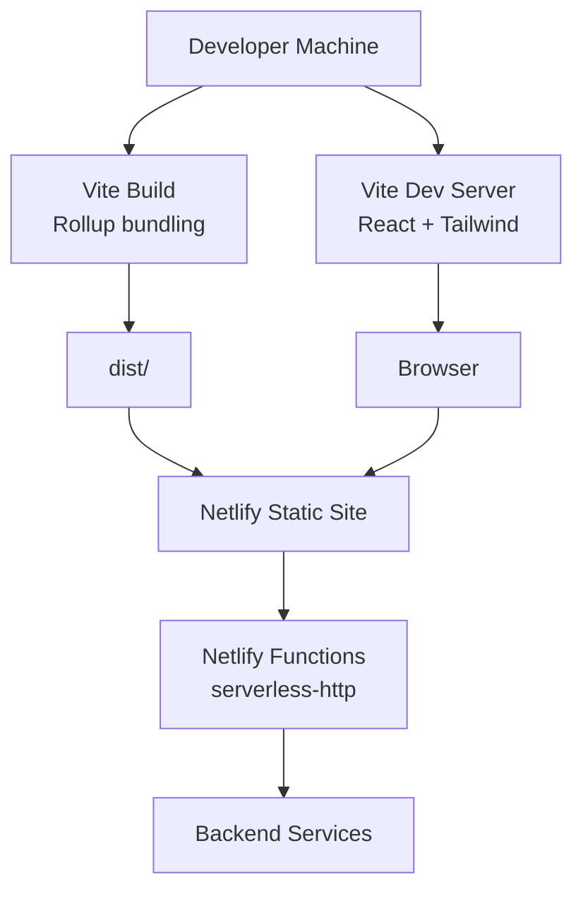
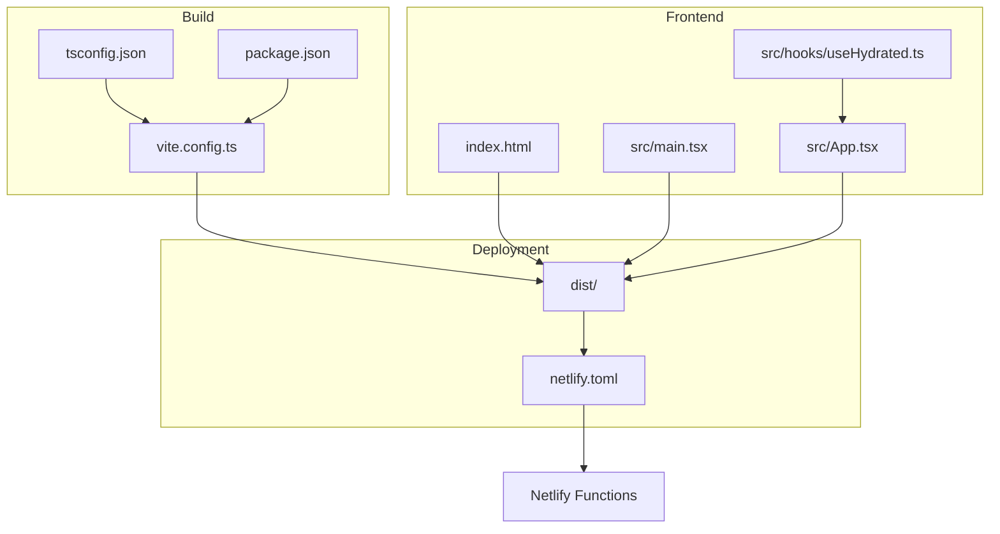
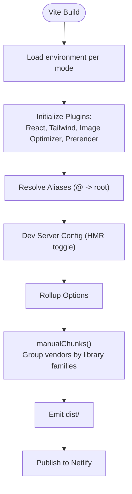
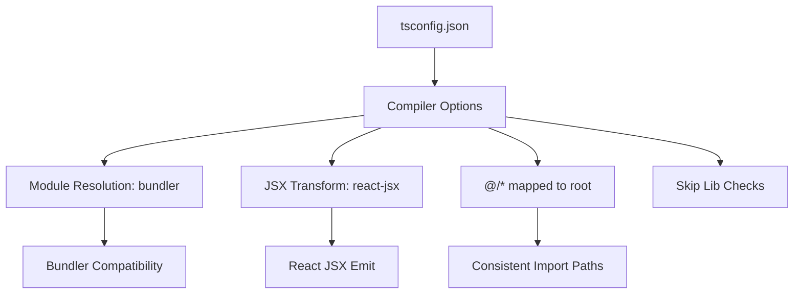
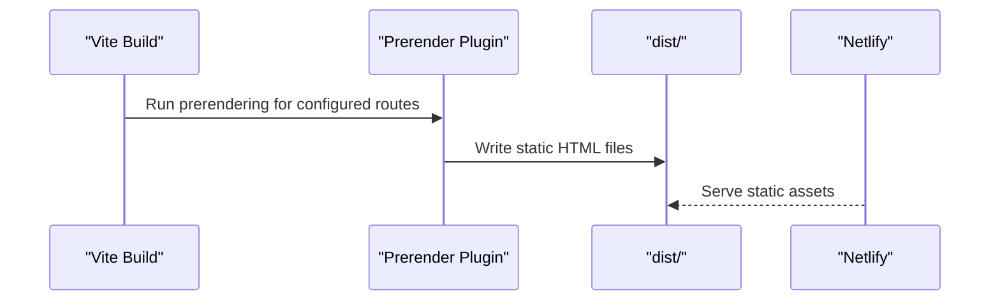
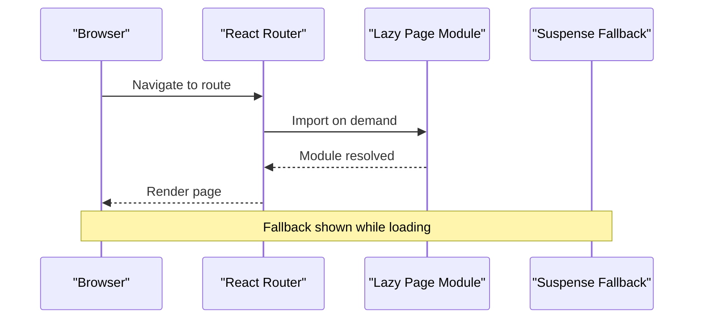
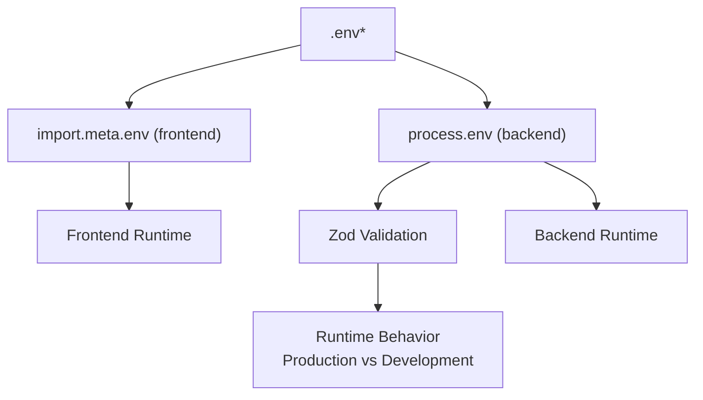
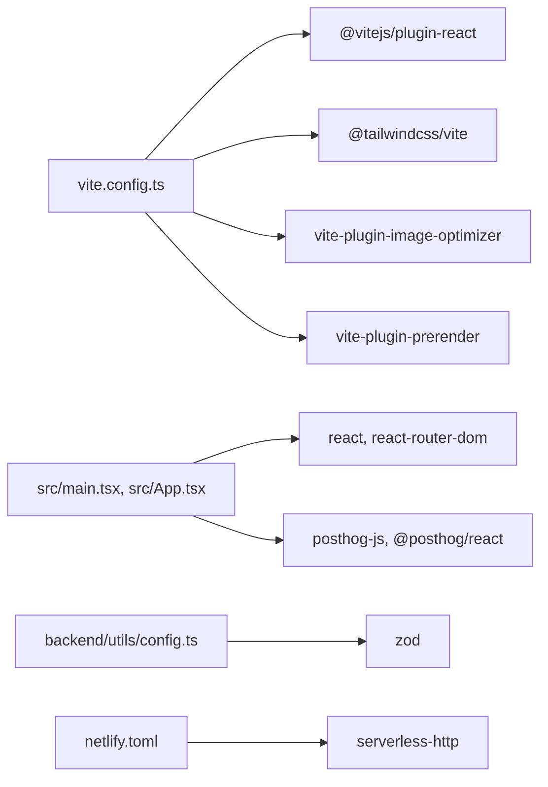

# Build Configuration

<cite>
**Referenced Files in This Document**
- [vite.config.ts](file://vite.config.ts)
- [tsconfig.json](file://tsconfig.json)
- [.prettierrc](file://.prettierrc)
- [package.json](file://package.json)
- [netlify.toml](file://netlify.toml)
- [eslint.config.js](file://eslint.config.js)
- [src/vite-env.d.ts](file://src/vite-env.d.ts)
- [index.html](file://index.html)
- [src/main.tsx](file://src/main.tsx)
- [src/App.tsx](file://src/App.tsx)
- [backend/utils/config.ts](file://backend/utils/config.ts)
- [src/hooks/useHydrated.ts](file://src/hooks/useHydrated.ts)
</cite>

## Table of Contents
1. [Introduction](#introduction)
2. [Project Structure](#project-structure)
3. [Core Components](#core-components)
4. [Architecture Overview](#architecture-overview)
5. [Detailed Component Analysis](#detailed-component-analysis)
6. [Dependency Analysis](#dependency-analysis)
7. [Performance Considerations](#performance-considerations)
8. [Troubleshooting Guide](#troubleshooting-guide)
9. [Conclusion](#conclusion)
10. [Appendices](#appendices)

## Introduction
This document explains the build configuration for FaceAnalytics Pro, focusing on Vite-based frontend builds, TypeScript compilation, Prettier formatting, and deployment via Netlify. It covers development and production builds, environment handling, asset optimization, prerendering for SEO, code-splitting and lazy loading, and performance strategies such as chunking and compression. It also provides troubleshooting guidance for common build issues.

## Project Structure
The build pipeline centers on Vite for the React frontend, with Netlify managing static hosting and serverless functions. TypeScript compiles the frontend, while ESLint and Prettier enforce code quality and formatting. Backend services are configured separately and integrated via environment variables.

**Diagram sources**
- [vite.config.ts:14-75](file://vite.config.ts#L14-L75)
- [package.json:10-18](file://package.json#L10-L18)
- [netlify.toml:1-42](file://netlify.toml#L1-L42)

**Section sources**
- [vite.config.ts:14-75](file://vite.config.ts#L14-L75)
- [package.json:10-18](file://package.json#L10-L18)
- [netlify.toml:1-42](file://netlify.toml#L1-L42)

## Core Components
- Vite configuration defines plugins, aliases, dev server behavior, and Rollup output chunking for vendor separation.
- TypeScript configuration enables modern JS features, JSX transform, bundler module resolution, and path mapping.
- Prettier enforces consistent formatting across source and backend files.
- Netlify configuration controls build commands, publish directory, and serverless function bundling and timeouts.
- ESLint integrates with TypeScript and Prettier to maintain code quality.

**Section sources**
- [vite.config.ts:14-75](file://vite.config.ts#L14-L75)
- [tsconfig.json:1-27](file://tsconfig.json#L1-L27)
- [.prettierrc:1-9](file://.prettierrc#L1-L9)
- [netlify.toml:1-42](file://netlify.toml#L1-L42)
- [eslint.config.js:1-41](file://eslint.config.js#L1-L41)

## Architecture Overview
The build and deployment architecture ties together Vite, Netlify, and backend services. Vite handles development and production bundling, prerendering, and image optimization. Netlify publishes the static site and routes API traffic to serverless functions.

**Diagram sources**
- [vite.config.ts:14-75](file://vite.config.ts#L14-L75)
- [tsconfig.json:1-27](file://tsconfig.json#L1-L27)
- [package.json:10-18](file://package.json#L10-L18)
- [index.html:1-24](file://index.html#L1-L24)
- [src/main.tsx:1-40](file://src/main.tsx#L1-L40)
- [src/App.tsx:1-473](file://src/App.tsx#L1-L473)
- [src/hooks/useHydrated.ts:1-33](file://src/hooks/useHydrated.ts#L1-L33)
- [netlify.toml:1-42](file://netlify.toml#L1-L42)

## Detailed Component Analysis

### Vite Build Configuration
- Plugins:
  - React Fast Refresh and JSX transform.
  - Tailwind integration.
  - Image optimization for PNG, JPEG, JPG, WebP, and AVIF.
  - Prerender plugin generating static HTML for specified routes.
- Aliasing: Path alias @ resolves to repository root for ergonomic imports.
- Dev server: HMR controlled by environment variable to avoid flickering during AI Studio edits.
- Build: Rollup manualChunks groups vendor libraries into named chunks for improved caching and load performance.

**Diagram sources**
- [vite.config.ts:14-75](file://vite.config.ts#L14-L75)

**Section sources**
- [vite.config.ts:14-75](file://vite.config.ts#L14-L75)

### TypeScript Configuration
- Targets modern JS and DOM APIs.
- Uses ESNext modules with bundler module resolution for compatibility with Vite and Rollup.
- Enables isolated modules and JSX transform for React.
- Path mapping via tsconfig.json supports @/* imports.
- Skips library checks and emits no JavaScript (Vite handles emit).

**Diagram sources**
- [tsconfig.json:1-27](file://tsconfig.json#L1-L27)

**Section sources**
- [tsconfig.json:1-27](file://tsconfig.json#L1-L27)

### Prettier Configuration
- Enforces semicolons, 2-space tabs, 100-character print width, single quotes, no trailing commas, and bracket spacing.
- Applied across TypeScript and TypeScript React files in both src and backend via npm script.

**Section sources**
- [.prettierrc:1-9](file://.prettierrc#L1-L9)
- [package.json:16](file://package.json#L16)

### Prerendering Setup and SEO
- Prerender plugin generates static HTML for homepage and blog routes, improving initial load and SEO.
- The hydration hook ensures animations replay after client takeover to avoid a “snap to initial” effect.

**Diagram sources**
- [vite.config.ts:27-46](file://vite.config.ts#L27-L46)
- [src/hooks/useHydrated.ts:1-33](file://src/hooks/useHydrated.ts#L1-L33)

**Section sources**
- [vite.config.ts:27-46](file://vite.config.ts#L27-L46)
- [src/hooks/useHydrated.ts:1-33](file://src/hooks/useHydrated.ts#L1-L33)

### Code-Splitting and Lazy Loading
- Dynamic imports with React.lazy split major pages into separate chunks.
- Suspense boundaries provide loading fallbacks during chunk fetch/execute.
- Route-level lazy loading reduces initial bundle size.

**Diagram sources**
- [src/App.tsx:23-43](file://src/App.tsx#L23-L43)

**Section sources**
- [src/App.tsx:23-43](file://src/App.tsx#L23-L43)

### Environment Variables and Runtime Behavior
- Frontend reads environment variables via import.meta.env (e.g., PostHog host and key).
- Backend validates environment variables at startup using Zod, crashing in production if critical variables are missing.
- Netlify configuration sets function bundler and external modules for serverless functions.

**Diagram sources**
- [src/main.tsx:8-12](file://src/main.tsx#L8-L12)
- [backend/utils/config.ts:59-82](file://backend/utils/config.ts#L59-L82)
- [netlify.toml:7-16](file://netlify.toml#L7-L16)

**Section sources**
- [src/main.tsx:8-12](file://src/main.tsx#L8-L12)
- [backend/utils/config.ts:59-82](file://backend/utils/config.ts#L59-L82)
- [netlify.toml:7-16](file://netlify.toml#L7-L16)

### Asset Optimization Strategies
- Image optimization plugin compresses PNG/JPEG/WebP/AVIF with configurable quality and lossless toggles.
- Prerendering reduces server load and improves perceived performance for static content.
- Manual chunking groups large vendor libraries into dedicated chunks for caching and parallel loading.

**Section sources**
- [vite.config.ts:20-26](file://vite.config.ts#L20-L26)
- [vite.config.ts:58-72](file://vite.config.ts#L58-L72)

### Deployment Pipeline (Netlify)
- Build command runs Vite build; publish directory is dist/.
- Serverless functions configured under netlify/functions with external Node modules and esbuild bundler.
- Redirects route API traffic to functions and social media ingestion to PostHog.

**Section sources**
- [netlify.toml:1-42](file://netlify.toml#L1-L42)
- [package.json:12](file://package.json#L12)

## Dependency Analysis
- Vite plugins depend on React and Tailwind integrations; image optimization relies on sharp-compatible formats.
- Frontend depends on React Router for routing and lazy loading; PostHog SDK for analytics.
- Backend depends on environment validation and serverless runtime for function execution.

**Diagram sources**
- [vite.config.ts:17-27](file://vite.config.ts#L17-L27)
- [src/main.tsx:5-6](file://src/main.tsx#L5-L6)
- [src/App.tsx:1-21](file://src/App.tsx#L1-L21)
- [backend/utils/config.ts:1-109](file://backend/utils/config.ts#L1-L109)
- [netlify.toml:1-42](file://netlify.toml#L1-L42)

**Section sources**
- [vite.config.ts:17-27](file://vite.config.ts#L17-L27)
- [src/main.tsx:5-6](file://src/main.tsx#L5-L6)
- [src/App.tsx:1-21](file://src/App.tsx#L1-L21)
- [backend/utils/config.ts:1-109](file://backend/utils/config.ts#L1-L109)
- [netlify.toml:1-42](file://netlify.toml#L1-L42)

## Performance Considerations
- Bundle splitting:
  - Use manualChunks to group vendor libraries (e.g., Firebase, motion, icons, charts, vision) into named chunks for better caching and parallel loading.
- Code splitting:
  - Lazy-load routes to reduce initial payload and improve First Contentful Paint.
- Asset optimization:
  - Enable image compression for PNG/JPEG/WebP/AVIF to reduce transfer sizes.
- Prerendering:
  - Pre-render static pages to improve initial load and SEO.
- Caching:
  - Vendor chunk naming improves long-term caching; consider adding cache-busting strategies at the CDN level if needed.
- Dev server:
  - Disable HMR selectively to prevent UI flicker during intensive editing sessions.

**Section sources**
- [vite.config.ts:58-72](file://vite.config.ts#L58-L72)
- [vite.config.ts:20-26](file://vite.config.ts#L20-L26)
- [src/App.tsx:23-43](file://src/App.tsx#L23-L43)

## Troubleshooting Guide
- Missing environment variables in production:
  - Backend validation will crash if required variables are absent; ensure all environment variables are set in production.
- Frontend analytics not working:
  - Verify PostHog key and host are present in environment; frontend reads them from import.meta.env.
- Serverless function timeouts:
  - Netlify function timeout is set to 26s; backend uses an AbortController with a 24s limit to align with platform constraints.
- HMR flickering during edits:
  - Set the environment variable to disable HMR in the dev server to stabilize the UI during AI Studio edits.
- Prerendered animations not playing:
  - Use the hydration hook to force remounting of motion components after client-side hydration.

**Section sources**
- [backend/utils/config.ts:64-82](file://backend/utils/config.ts#L64-L82)
- [src/main.tsx:8-12](file://src/main.tsx#L8-L12)
- [netlify.toml:20-26](file://netlify.toml#L20-L26)
- [vite.config.ts:53-57](file://vite.config.ts#L53-L57)
- [src/hooks/useHydrated.ts:1-33](file://src/hooks/useHydrated.ts#L1-L33)

## Conclusion
FaceAnalytics Pro’s build system leverages Vite for efficient development and production builds, with strategic code-splitting, prerendering, and vendor chunking to optimize performance. TypeScript and Prettier ensure type safety and consistent formatting, while Netlify’s configuration integrates static publishing and serverless functions. Robust environment validation and selective HMR control further stabilize the developer experience and runtime reliability.

## Appendices
- Development and Production Scripts:
  - Development server, build, preview, clean, lint, format, and test scripts are defined in package.json.
- Frontmatter and SEO Metadata:
  - index.html includes essential meta tags and Open Graph properties for SEO.

**Section sources**
- [package.json:10-18](file://package.json#L10-L18)
- [index.html:1-24](file://index.html#L1-L24)