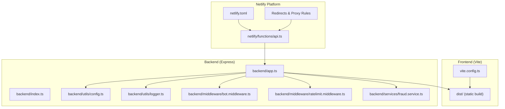
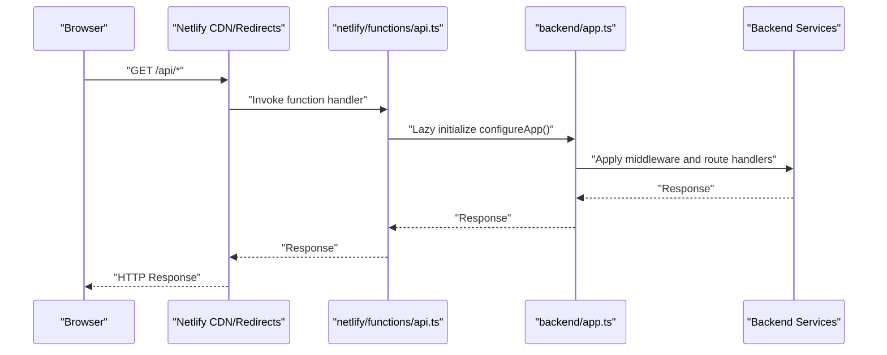
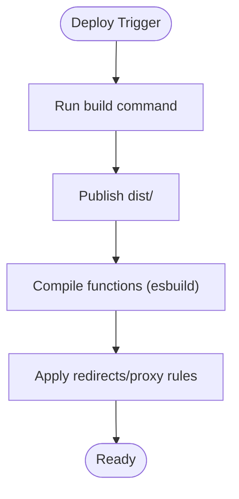
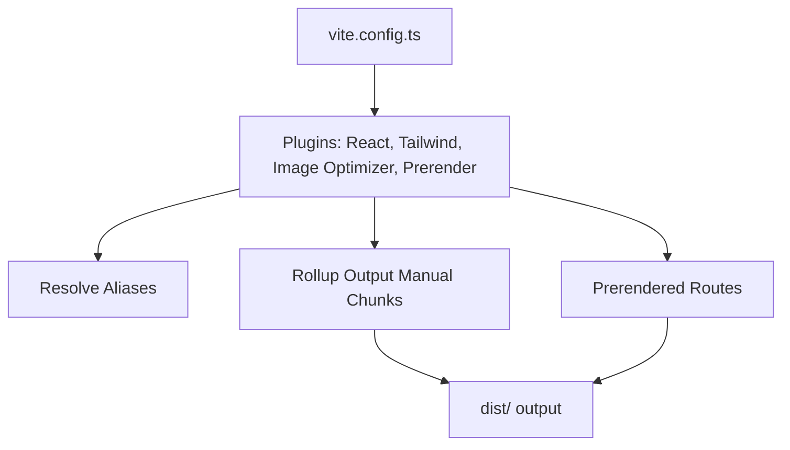
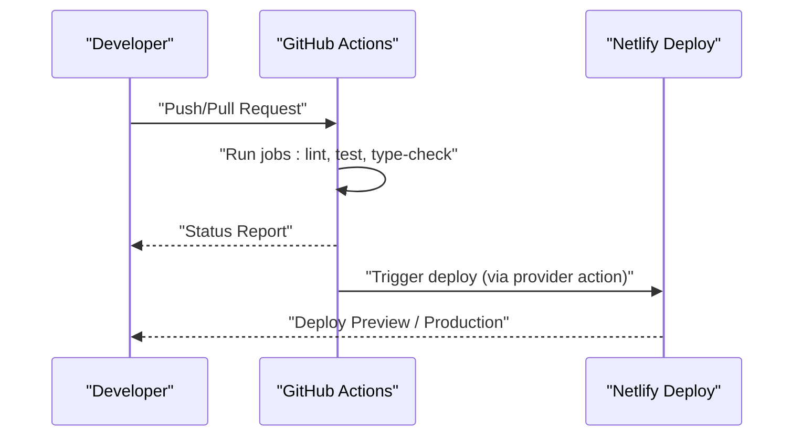
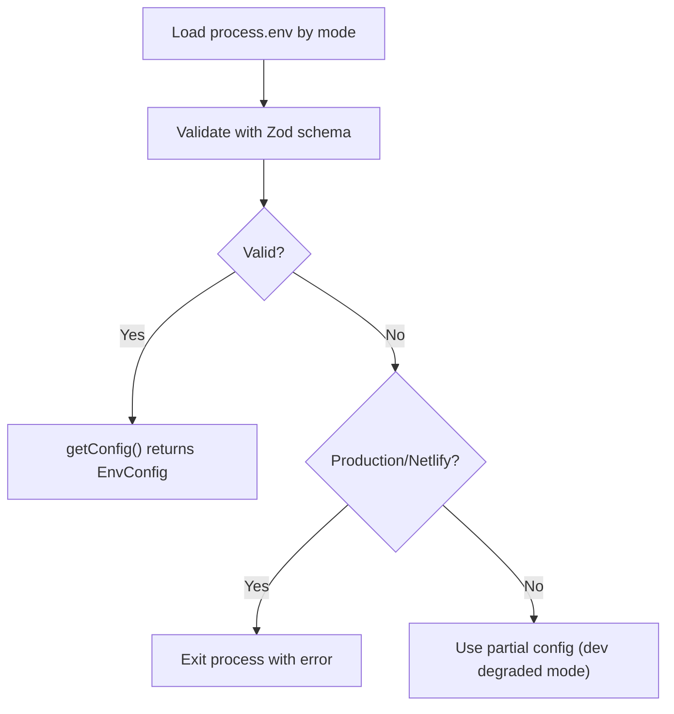
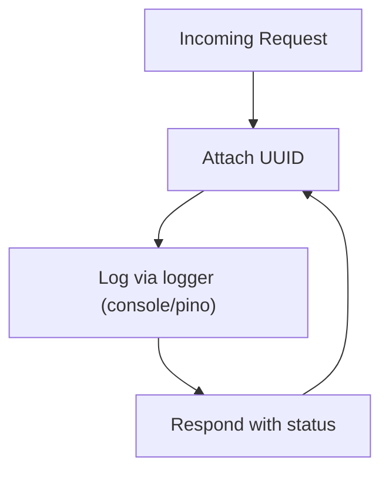
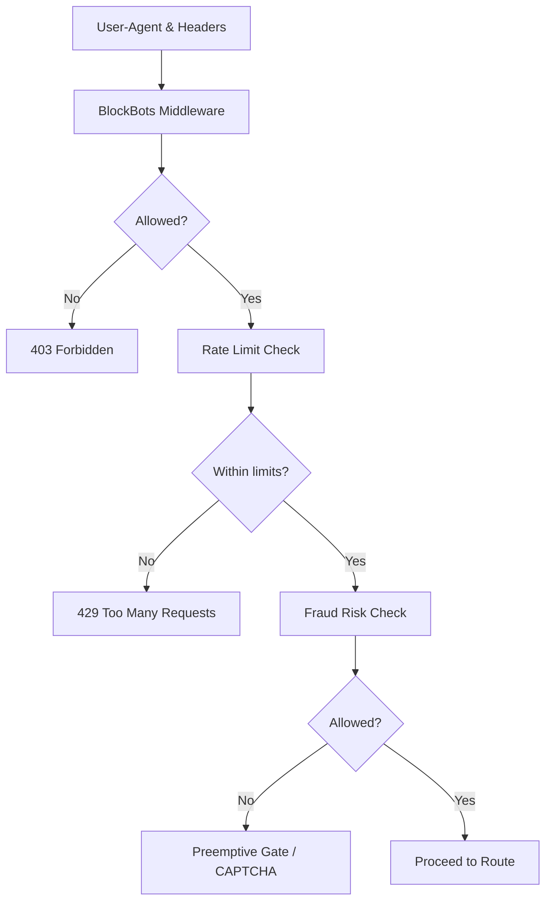
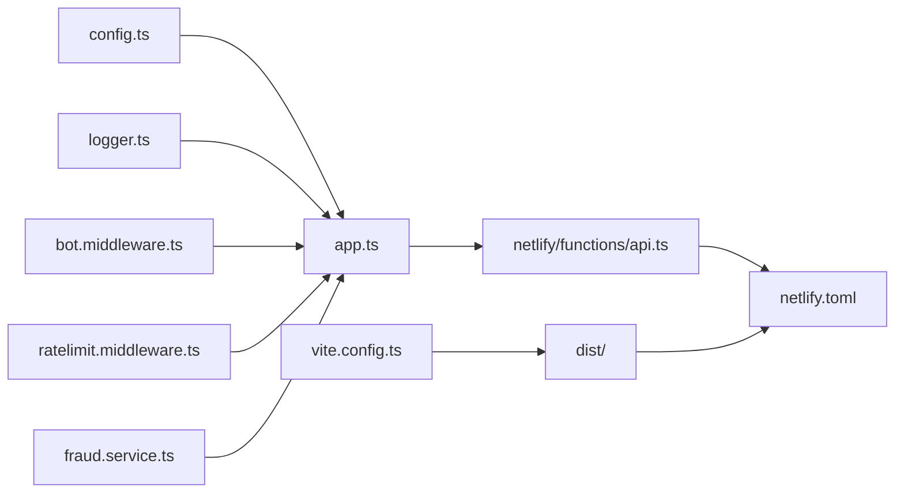

# Deployment and DevOps

<cite>
**Referenced Files in This Document**
- [netlify.toml](file://netlify.toml)
- [package.json](file://package.json)
- [vite.config.ts](file://vite.config.ts)
- [.github/workflows/ci.yml](file://.github/workflows/ci.yml)
- [backend/utils/config.ts](file://backend/utils/config.ts)
- [netlify/functions/api.ts](file://netlify/functions/api.ts)
- [backend/app.ts](file://backend/app.ts)
- [backend/index.ts](file://backend/index.ts)
- [backend/utils/logger.ts](file://backend/utils/logger.ts)
- [backend/middleware/bot.middleware.ts](file://backend/middleware/bot.middleware.ts)
- [backend/middleware/ratelimit.middleware.ts](file://backend/middleware/ratelimit.middleware.ts)
- [backend/services/fraud.service.ts](file://backend/services/fraud.service.ts)
</cite>

## Table of Contents
1. [Introduction](#introduction)
2. [Project Structure](#project-structure)
3. [Core Components](#core-components)
4. [Architecture Overview](#architecture-overview)
5. [Detailed Component Analysis](#detailed-component-analysis)
6. [Dependency Analysis](#dependency-analysis)
7. [Performance Considerations](#performance-considerations)
8. [Troubleshooting Guide](#troubleshooting-guide)
9. [Conclusion](#conclusion)
10. [Appendices](#appendices)

## Introduction
This document provides comprehensive deployment and DevOps guidance for FaceAnalytics Pro, focusing on serverless deployment with Netlify Functions and static site hosting, build configuration with Vite, CI/CD automation, environment variable management, monitoring and logging, rollback and disaster recovery, scaling and cost optimization, security and certificates, and operational maintenance procedures.

## Project Structure
The project follows a frontend-first architecture with a Node.js/Express backend packaged as a serverless function. The frontend is built with Vite and statically hosted on Netlify, while the backend is served via a Netlify Function that wraps the Express app. CI/CD is configured through GitHub Actions.

**Diagram sources**
- [netlify.toml:1-42](file://netlify.toml#L1-L42)
- [vite.config.ts:1-75](file://vite.config.ts#L1-L75)
- [netlify/functions/api.ts:1-28](file://netlify/functions/api.ts#L1-L28)
- [backend/app.ts:1-205](file://backend/app.ts#L1-L205)
- [backend/index.ts:1-29](file://backend/index.ts#L1-L29)
- [backend/utils/config.ts:1-110](file://backend/utils/config.ts#L1-L110)
- [backend/utils/logger.ts:1-71](file://backend/utils/logger.ts#L1-L71)
- [backend/middleware/bot.middleware.ts:1-134](file://backend/middleware/bot.middleware.ts#L1-L134)
- [backend/middleware/ratelimit.middleware.ts:1-134](file://backend/middleware/ratelimit.middleware.ts#L1-L134)
- [backend/services/fraud.service.ts:1-634](file://backend/services/fraud.service.ts#L1-L634)

**Section sources**
- [netlify.toml:1-42](file://netlify.toml#L1-L42)
- [package.json:1-79](file://package.json#L1-L79)
- [vite.config.ts:1-75](file://vite.config.ts#L1-L75)
- [.github/workflows/ci.yml:1-22](file://.github/workflows/ci.yml#L1-L22)
- [backend/app.ts:1-205](file://backend/app.ts#L1-L205)
- [backend/index.ts:1-29](file://backend/index.ts#L1-L29)

## Core Components
- Static site build and prerendering powered by Vite and the prerender plugin.
- Serverless Express backend wrapped via serverless-http and lazily initialized on first invocation to minimize cold start impact.
- Netlify configuration controlling build commands, publish directories, function bundler, redirects, and proxying.
- Environment validation and configuration loading with strict checks in production.
- Logging tailored for local development and serverless environments.
- Bot protection, rate limiting with Upstash Redis, and fraud detection services.

**Section sources**
- [vite.config.ts:1-75](file://vite.config.ts#L1-L75)
- [netlify/functions/api.ts:1-28](file://netlify/functions/api.ts#L1-L28)
- [netlify.toml:1-42](file://netlify.toml#L1-L42)
- [backend/utils/config.ts:1-110](file://backend/utils/config.ts#L1-L110)
- [backend/utils/logger.ts:1-71](file://backend/utils/logger.ts#L1-L71)
- [backend/middleware/bot.middleware.ts:1-134](file://backend/middleware/bot.middleware.ts#L1-L134)
- [backend/middleware/ratelimit.middleware.ts:1-134](file://backend/middleware/ratelimit.middleware.ts#L1-L134)
- [backend/services/fraud.service.ts:1-634](file://backend/services/fraud.service.ts#L1-L634)

## Architecture Overview
The deployment architecture centers on a static frontend served by Netlify and a serverless backend function that hosts the Express app. Requests to the API are routed through Netlify’s redirect rules to the function, which lazily initializes the backend on first invocation.

**Diagram sources**
- [netlify/functions/api.ts:1-28](file://netlify/functions/api.ts#L1-L28)
- [backend/app.ts:1-205](file://backend/app.ts#L1-L205)
- [netlify.toml:27-41](file://netlify.toml#L27-L41)

**Section sources**
- [netlify/functions/api.ts:1-28](file://netlify/functions/api.ts#L1-L28)
- [backend/app.ts:1-205](file://backend/app.ts#L1-L205)
- [netlify.toml:27-41](file://netlify.toml#L27-L41)

## Detailed Component Analysis

### Serverless Deployment with Netlify Functions
- Build and publish: The build command produces the static site into dist, and functions are compiled under netlify/functions.
- Function bundler: esbuild is used for Node bundling with specific external modules declared to optimize cold start and reduce bundle size.
- Timeout tuning: The API function timeout is set to align with upstream AI latency budgets.
- Redirects and proxy: API routes are proxied to the function; telemetry ingestion is reverse-proxied to PostHog.

**Diagram sources**
- [netlify.toml:1-42](file://netlify.toml#L1-L42)

**Section sources**
- [netlify.toml:1-42](file://netlify.toml#L1-L42)

### Build Configuration with Vite
- Plugins: React and Tailwind are enabled; image optimization and prerendering are configured.
- Prerendered routes: A curated list of routes is prerendered to improve initial load and SEO.
- Asset optimization: Image formats are optimized with quality settings.
- Chunking: Vendor libraries are split into dedicated chunks to improve caching and load performance.
- HMR behavior: Controlled via environment variable to prevent flickering during development.

**Diagram sources**
- [vite.config.ts:1-75](file://vite.config.ts#L1-L75)

**Section sources**
- [vite.config.ts:1-75](file://vite.config.ts#L1-L75)

### CI/CD Pipeline and Automated Deployment
- Trigger: Runs on pushes and pull requests to main/master branches.
- Steps: Checkout, setup Node.js, install dependencies, type-check, lint, and test.
- Recommendation: Extend the workflow to build and deploy to Netlify using CLI or provider-specific actions.

**Diagram sources**
- [.github/workflows/ci.yml:1-22](file://.github/workflows/ci.yml#L1-L22)

**Section sources**
- [.github/workflows/ci.yml:1-22](file://.github/workflows/ci.yml#L1-L22)

### Environment Variable Management
- Validation: A Zod schema validates required environment variables at startup. In production or Netlify, missing critical variables cause immediate failure; in development, the app degrades gracefully.
- Categories: Firebase, Vertex AI, Upstash Redis, PayPal, Email, App URLs, Netlify flag, admin emails, and fraud thresholds.
- Helpers: Accessors for admin emails, production/development detection, and environment-aware behavior.

**Diagram sources**
- [backend/utils/config.ts:1-110](file://backend/utils/config.ts#L1-L110)

**Section sources**
- [backend/utils/config.ts:1-110](file://backend/utils/config.ts#L1-L110)

### Monitoring and Logging
- Local development: Pino is used for colored, structured logs with redaction of sensitive fields.
- Serverless: Console-based logging is used to avoid worker-thread issues; Netlify captures stdout/stderr.
- Request tracing: Unique request IDs are attached to requests and responses for correlation.
- Telemetry proxy: PostHog ingestion is proxied through the backend to centralize analytics.

**Diagram sources**
- [backend/utils/logger.ts:1-71](file://backend/utils/logger.ts#L1-L71)
- [backend/app.ts:68-88](file://backend/app.ts#L68-L88)

**Section sources**
- [backend/utils/logger.ts:1-71](file://backend/utils/logger.ts#L1-L71)
- [backend/app.ts:68-88](file://backend/app.ts#L68-L88)

### Security and Certificates
- Security headers: Helmet is applied with CSP, COOP, and COEP policies suitable for the stack.
- CORS: Origin allowlist is configurable and enforced.
- Bot protection: Blocks known bot UAs, headless automation, and suspicious behavioral signals.
- Rate limiting: Sliding window with Upstash Redis; bypassed in development.
- Fraud detection: Device fingerprinting, risk profiles, and preemptive gating for expensive operations.

**Diagram sources**
- [backend/middleware/bot.middleware.ts:1-134](file://backend/middleware/bot.middleware.ts#L1-L134)
- [backend/middleware/ratelimit.middleware.ts:1-134](file://backend/middleware/ratelimit.middleware.ts#L1-L134)
- [backend/services/fraud.service.ts:1-634](file://backend/services/fraud.service.ts#L1-L634)
- [backend/app.ts:90-164](file://backend/app.ts#L90-L164)

**Section sources**
- [backend/app.ts:90-164](file://backend/app.ts#L90-L164)
- [backend/middleware/bot.middleware.ts:1-134](file://backend/middleware/bot.middleware.ts#L1-L134)
- [backend/middleware/ratelimit.middleware.ts:1-134](file://backend/middleware/ratelimit.middleware.ts#L1-L134)
- [backend/services/fraud.service.ts:1-634](file://backend/services/fraud.service.ts#L1-L634)

### Rollback and Disaster Recovery
- Rollback: Use Netlify’s deployment history to revert to a previous successful build.
- Canary: Promote a subset of traffic to a new deployment using Netlify’s preview deploys and A/B strategies.
- Data safety: Firestore backups and scheduled purges for audit logs; maintain offsite backups and immutable snapshots.
- Runbooks: Document steps to disable rate limits in emergencies, pause fraud gates, and switch analytics providers.

[No sources needed since this section provides general guidance]

### Scaling Considerations and Cost Optimization
- Cold starts: Lazy initialization of heavy modules reduces initialization overhead.
- Bundler choice: esbuild minimizes function size and improves cold start times.
- Chunk splitting: Vendor chunking reduces repeated downloads and improves caching.
- Asset optimization: Image optimizer reduces payload sizes.
- Redis: Use Upstash Redis for rate limiting and caching; monitor usage to right-size tier.
- CDN: Leverage Netlify’s global CDN for static assets and function responses.

**Section sources**
- [netlify/functions/api.ts:1-28](file://netlify/functions/api.ts#L1-L28)
- [netlify.toml:6-17](file://netlify.toml#L6-L17)
- [vite.config.ts:58-72](file://vite.config.ts#L58-L72)

### Maintenance Procedures
- Updates: Keep dependencies current; validate with CI before deploying.
- Health checks: Monitor /api/health for basic uptime.
- Logs: Review function logs in Netlify and local logs for errors and anomalies.
- Secrets rotation: Rotate API keys and service account credentials; update environment variables in Netlify.
- Backups: Regularly snapshot Firestore and review purge jobs for audit logs.

[No sources needed since this section provides general guidance]

## Dependency Analysis
The backend depends on environment configuration, logging, middleware, and services. The serverless function defers heavy imports to runtime to meet cold start constraints.

**Diagram sources**
- [backend/utils/config.ts:1-110](file://backend/utils/config.ts#L1-L110)
- [backend/utils/logger.ts:1-71](file://backend/utils/logger.ts#L1-L71)
- [backend/middleware/bot.middleware.ts:1-134](file://backend/middleware/bot.middleware.ts#L1-L134)
- [backend/middleware/ratelimit.middleware.ts:1-134](file://backend/middleware/ratelimit.middleware.ts#L1-L134)
- [backend/services/fraud.service.ts:1-634](file://backend/services/fraud.service.ts#L1-L634)
- [backend/app.ts:1-205](file://backend/app.ts#L1-L205)
- [netlify/functions/api.ts:1-28](file://netlify/functions/api.ts#L1-L28)
- [netlify.toml:1-42](file://netlify.toml#L1-L42)
- [vite.config.ts:1-75](file://vite.config.ts#L1-L75)

**Section sources**
- [backend/app.ts:1-205](file://backend/app.ts#L1-L205)
- [netlify/functions/api.ts:1-28](file://netlify/functions/api.ts#L1-L28)
- [netlify.toml:1-42](file://netlify.toml#L1-L42)
- [vite.config.ts:1-75](file://vite.config.ts#L1-L75)

## Performance Considerations
- Cold start mitigation: Dynamic imports and lazy initialization in the function handler.
- Asset delivery: Prerendered pages and optimized images reduce server load and latency.
- Chunking: Vendor chunking improves caching and reduces download sizes.
- Rate limiting and fraud checks: Prevent resource exhaustion and reduce unnecessary compute.

[No sources needed since this section provides general guidance]

## Troubleshooting Guide
- 502/504 errors: Often related to cold start timeouts; verify function timeout and external module declarations.
- Missing environment variables: Startup validation will fail in production; ensure all required variables are set.
- Excessive rate limiting: Confirm Upstash Redis configuration and adjust limits if needed.
- Bot blocked requests: Review bot middleware logs and adjust allowlists if necessary.
- Logging issues: In serverless, rely on Netlify logs; in development, verify Pino configuration.

**Section sources**
- [netlify/functions/api.ts:1-28](file://netlify/functions/api.ts#L1-L28)
- [backend/utils/config.ts:64-82](file://backend/utils/config.ts#L64-L82)
- [backend/middleware/ratelimit.middleware.ts:1-134](file://backend/middleware/ratelimit.middleware.ts#L1-L134)
- [backend/middleware/bot.middleware.ts:1-134](file://backend/middleware/bot.middleware.ts#L1-L134)
- [backend/utils/logger.ts:1-71](file://backend/utils/logger.ts#L1-L71)

## Conclusion
FaceAnalytics Pro is designed for efficient serverless deployment with Netlify, leveraging Vite for optimized static delivery and a lazily-initialized Express backend. Robust environment validation, logging, security middleware, and fraud controls ensure reliable operation. Extending CI/CD to automate deployments and adding monitoring dashboards will further strengthen operational excellence.

[No sources needed since this section summarizes without analyzing specific files]

## Appendices

### Appendix A: Environment Variables Reference
- Required for production:
  - Vertex AI: API key, project, region, model
  - Firebase: Service account and database ID
  - Upstash Redis: REST URL and token
  - PayPal: Client ID, client secret, webhook ID
  - Email: Resend API key
  - App: Base URL(s), PostHog host
  - Fraud thresholds: Max accounts per IP, referrals per hour, scan spike threshold, risk block threshold
- Optional:
  - Admin emails (comma-separated)
  - Netlify flag for serverless detection

**Section sources**
- [backend/utils/config.ts:7-48](file://backend/utils/config.ts#L7-L48)

### Appendix B: Build and Prerender Routes
- Build command: Produces dist/
- Prerendered routes: Home, Methodology, Privacy, Terms, and selected blog pages

**Section sources**
- [vite.config.ts:27-45](file://vite.config.ts#L27-L45)

### Appendix C: Redirects and Proxying
- API routes: Rewritten to the function
- Telemetry: Ingest proxy to PostHog
- SPA fallback: All unmatched routes serve index.html

**Section sources**
- [netlify.toml:27-41](file://netlify.toml#L27-L41)