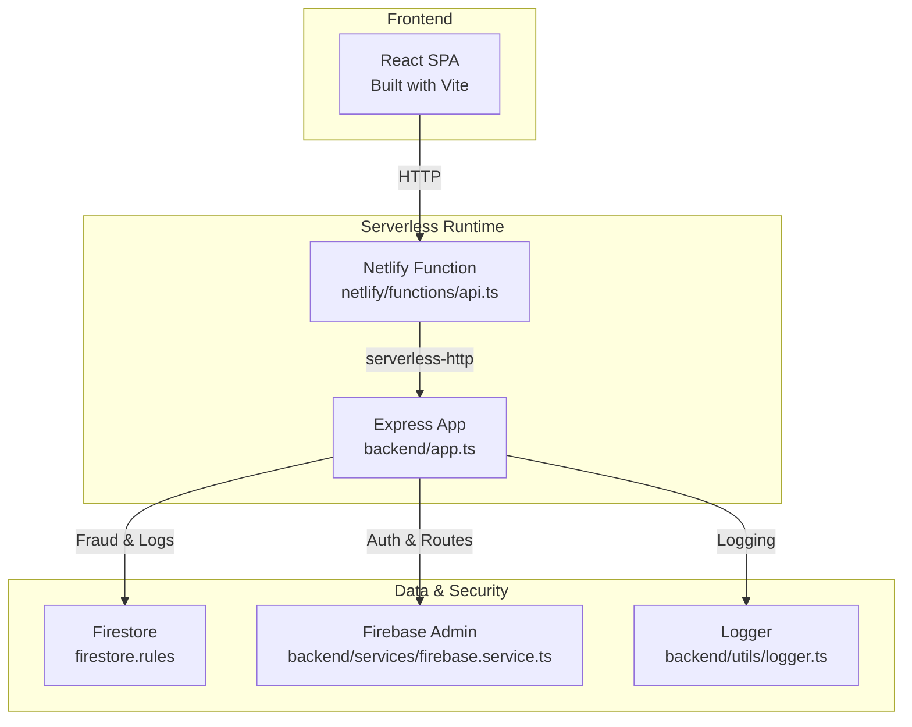
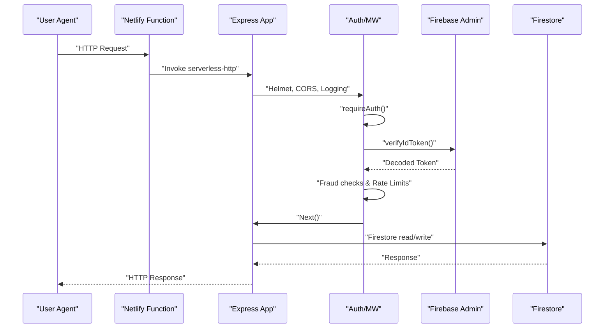
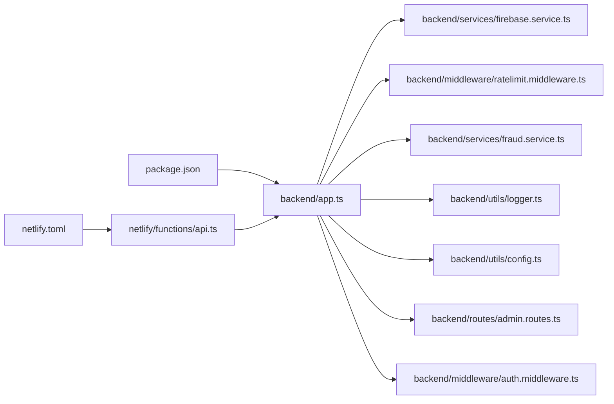

# Maintenance Procedures

<cite>
**Referenced Files in This Document**
- [package.json](file://package.json)
- [backend/app.ts](file://backend/app.ts)
- [backend/utils/logger.ts](file://backend/utils/logger.ts)
- [netlify/functions/api.ts](file://netlify/functions/api.ts)
- [backend/services/firebase.service.ts](file://backend/services/firebase.service.ts)
- [backend/routes/admin.routes.ts](file://backend/routes/admin.routes.ts)
- [backend/middleware/auth.middleware.ts](file://backend/middleware/auth.middleware.ts)
- [backend/utils/config.ts](file://backend/utils/config.ts)
- [netlify.toml](file://netlify.toml)
- [firestore.rules](file://firestore.rules)
- [backend/services/fraud.service.ts](file://backend/services/fraud.service.ts)
- [backend/middleware/ratelimit.middleware.ts](file://backend/middleware/ratelimit.middleware.ts)
- [backend/scripts/restore-credit.ts](file://backend/scripts/restore-credit.ts)
- [backend/utils/validation.ts](file://backend/utils/validation.ts)
</cite>

## Table of Contents
1. [Introduction](#introduction)
2. [Project Structure](#project-structure)
3. [Core Components](#core-components)
4. [Architecture Overview](#architecture-overview)
5. [Detailed Component Analysis](#detailed-component-analysis)
6. [Dependency Analysis](#dependency-analysis)
7. [Performance Considerations](#performance-considerations)
8. [Troubleshooting Guide](#troubleshooting-guide)
9. [Conclusion](#conclusion)
10. [Appendices](#appendices)

## Introduction
This document defines comprehensive maintenance procedures for FaceAnalytics Pro system administration. It covers routine tasks such as database cleanup, log rotation, and system health checks; update and rollback procedures for frontend and backend; backup and recovery strategies for critical data; security maintenance including certificates, dependency updates, and vulnerability assessments; capacity planning and resource optimization for serverless; incident response and escalation workflows; change management processes; optimization strategies; and decommissioning procedures for deprecated features.

## Project Structure
The system is a serverless web application composed of:
- Frontend built with React and Vite, served statically in production.
- Backend as an Express server wrapped for serverless execution via a Netlify function.
- Data stored in Google Cloud Firestore protected by security rules.
- Authentication via Firebase Admin.
- Operational services for fraud detection, rate limiting, logging, and payments.

**Diagram sources**
- [netlify/functions/api.ts:1-28](file://netlify/functions/api.ts#L1-L28)
- [backend/app.ts:1-205](file://backend/app.ts#L1-L205)
- [backend/services/firebase.service.ts:1-120](file://backend/services/firebase.service.ts#L1-L120)
- [firestore.rules:1-118](file://firestore.rules#L1-L118)
- [backend/utils/logger.ts:1-71](file://backend/utils/logger.ts#L1-L71)

**Section sources**
- [package.json:1-79](file://package.json#L1-L79)
- [netlify.toml:1-42](file://netlify.toml#L1-L42)
- [backend/app.ts:1-205](file://backend/app.ts#L1-L205)

## Core Components
- Express application with lazy initialization to meet serverless cold start budgets.
- Netlify function wrapper that defers heavy imports until first request.
- Firebase Admin integration for Firestore and Auth with HTTP/1.1 transport for serverless stability.
- Fraud detection and risk profiling with in-memory caching and batched activity logging.
- Rate limiting via Upstash Redis with per-user and daily caps.
- Centralized environment configuration validated at startup.
- Structured logging with console fallback in serverless and pino in development.
- Admin endpoints for analytics and log purging.

**Section sources**
- [backend/app.ts:15-201](file://backend/app.ts#L15-L201)
- [netlify/functions/api.ts:12-27](file://netlify/functions/api.ts#L12-L27)
- [backend/services/firebase.service.ts:10-119](file://backend/services/firebase.service.ts#L10-L119)
- [backend/services/fraud.service.ts:45-80](file://backend/services/fraud.service.ts#L45-L80)
- [backend/middleware/ratelimit.middleware.ts:19-133](file://backend/middleware/ratelimit.middleware.ts#L19-L133)
- [backend/utils/config.ts:59-82](file://backend/utils/config.ts#L59-L82)
- [backend/utils/logger.ts:11-68](file://backend/utils/logger.ts#L11-L68)
- [backend/routes/admin.routes.ts:44-131](file://backend/routes/admin.routes.ts#L44-L131)

## Architecture Overview
The backend is initialized lazily and mounted behind a Netlify function. Requests are secured with Helmet, validated via Firebase Auth, rate-limited, and logged. Firestore is accessed with HTTP/1.1 to avoid gRPC timeouts in serverless. Fraud detection and risk management operate independently of request flow to minimize latency.

**Diagram sources**
- [netlify/functions/api.ts:24-27](file://netlify/functions/api.ts#L24-L27)
- [backend/app.ts:68-191](file://backend/app.ts#L68-L191)
- [backend/middleware/auth.middleware.ts:18-39](file://backend/middleware/auth.middleware.ts#L18-L39)
- [backend/services/firebase.service.ts:10-73](file://backend/services/firebase.service.ts#L10-L73)
- [firestore.rules:37-116](file://firestore.rules#L37-L116)

## Detailed Component Analysis

### Database Cleanup and Log Rotation
- Purpose-built admin endpoint purges old activity logs based on retention days.
- Batch deletion in chunks to respect Firestore limits.
- In-memory activity log buffering reduces write volume and flushes periodically.

Maintenance steps:
- Schedule periodic cleanup via a scheduled function or run manually via admin endpoint.
- Adjust retention days based on compliance and storage costs.
- Monitor deletion counts and errors; ensure no impact on ongoing operations.

Operational references:
- Admin purge endpoint: [POST /api/admin/purge-logs:121-131](file://backend/routes/admin.routes.ts#L121-L131)
- Purge function implementation: [purgeOldActivityLogs:595-633](file://backend/services/fraud.service.ts#L595-L633)
- Batched activity logging: [enqueueActivityLog / flushActivityLogs:548-588](file://backend/services/fraud.service.ts#L548-L588)

**Section sources**
- [backend/routes/admin.routes.ts:121-131](file://backend/routes/admin.routes.ts#L121-L131)
- [backend/services/fraud.service.ts:595-633](file://backend/services/fraud.service.ts#L595-L633)
- [backend/services/fraud.service.ts:548-588](file://backend/services/fraud.service.ts#L548-L588)

### System Health Checks
- Dedicated health endpoint returns a simple status payload without exposing environment details.
- Request logging includes unique request IDs for traceability.

Maintenance steps:
- Monitor health endpoint availability as a basic uptime check.
- Correlate logs using request IDs for incident triage.

References:
- Health endpoint: [/api/health:166-169](file://backend/app.ts#L166-L169)
- Request logging: [/api/* logging:68-88](file://backend/app.ts#L68-L88)

**Section sources**
- [backend/app.ts:166-169](file://backend/app.ts#L166-L169)
- [backend/app.ts:68-88](file://backend/app.ts#L68-L88)

### Update and Rollback Procedures

#### Backend Updates (Serverless)
- Build and deploy via Netlify; redirects route all /api/* to the function.
- Cold start budget is respected by deferring heavy imports until first request.

Zero-downtime strategy:
- Deploy new function version; Netlify switches traffic after successful cold start.
- Validate health endpoint post-deploy.

Rollback strategy:
- Re-deploy previous function version if health checks fail.
- Use environment variables to disable risky features during rollback.

References:
- Function wrapper: [netlify/functions/api.ts:12-27](file://netlify/functions/api.ts#L12-L27)
- Redirects and function timeout: [netlify.toml:19-26](file://netlify.toml#L19-L26)

**Section sources**
- [netlify/functions/api.ts:12-27](file://netlify/functions/api.ts#L12-L27)
- [netlify.toml:19-26](file://netlify.toml#L19-L26)

#### Frontend Updates
- Build artifacts published to dist; Netlify serves static files in production.
- Use CI to build and deploy; maintain a release branch for staged rollouts.

Zero-downtime strategy:
- Deploy to a preview environment; promote to production after validation.
- Keep a canary deployment for gradual rollout.

References:
- Build and publish: [netlify.toml:1-4](file://netlify.toml#L1-L4)
- Static serving: [backend/app.ts:193-195](file://backend/app.ts#L193-L195)

**Section sources**
- [netlify.toml:1-4](file://netlify.toml#L1-L4)
- [backend/app.ts:193-195](file://backend/app.ts#L193-L195)

#### Rollback Checklist
- Confirm function cold start completes within timeout.
- Verify health endpoint responds.
- Validate key API endpoints (authentication, scanning).
- Revert if errors exceed threshold.

### Backup and Recovery Procedures

Critical data collections:
- users: user profiles, roles, credits.
- scans: analysis results and images.
- processed_orders: payment records.
- user_risk_profiles, fraud_signals, activity_log: operational data.

Backup strategy:
- Export Firestore collections using official tooling or third-party solutions.
- Store backups in secure, encrypted offsite storage.
- Automate periodic exports and retention policies.

Recovery procedure:
- Restore collection snapshots to a staging environment first.
- Validate data integrity and test critical workflows.
- Promote to production after successful validation.

References:
- Firestore rules model: [firestore.rules:10-31](file://firestore.rules#L10-L31)
- Admin analytics aggregates: [admin routes:44-119](file://backend/routes/admin.routes.ts#L44-L119)

**Section sources**
- [firestore.rules:10-31](file://firestore.rules#L10-L31)
- [backend/routes/admin.routes.ts:44-119](file://backend/routes/admin.routes.ts#L44-L119)

### Security Maintenance

Certificate renewal:
- Netlify-managed TLS termination; no server-side certificate management required.
- Ensure DNS and SSL are valid for domains and CDN paths.

Dependency updates:
- Review and update packages regularly; validate compatibility with Node 20+.
- Pay special attention to security patches for cryptography, HTTP libraries, and Firebase Admin.

Vulnerability assessments:
- Run automated dependency scanning and SCA tools.
- Review and tighten CSP and CORS policies as needed.
- Audit Firebase rules for unintended access.

References:
- Security headers (CSP/CORS): [backend/app.ts:90-164](file://backend/app.ts#L90-L164)
- Firebase Admin initialization: [backend/services/firebase.service.ts:10-73](file://backend/services/firebase.service.ts#L10-L73)
- Environment validation: [backend/utils/config.ts:59-82](file://backend/utils/config.ts#L59-L82)

**Section sources**
- [backend/app.ts:90-164](file://backend/app.ts#L90-L164)
- [backend/services/firebase.service.ts:10-73](file://backend/services/firebase.service.ts#L10-L73)
- [backend/utils/config.ts:59-82](file://backend/utils/config.ts#L59-L82)

### Capacity Planning and Resource Optimization (Serverless)

Serverless constraints:
- Function timeout is 26 seconds; optimize cold start and request latency.
- Firestore gRPC handshake can exceed timeouts; HTTP/1.1 is enabled for serverless.

Optimization strategies:
- Minimize initial imports; keep heavy modules lazy-loaded.
- Reduce payload sizes; compress images and limit JSON sizes.
- Use Upstash Redis for rate limiting and caching to reduce database load.
- Monitor and adjust rate limits and daily caps based on usage trends.

References:
- Timeout and bundler settings: [netlify.toml:19-26](file://netlify.toml#L19-L26)
- Firestore HTTP/1.1 preference: [backend/services/firebase.service.ts:97-108](file://backend/services/firebase.service.ts#L97-L108)
- Rate limiting middleware: [backend/middleware/ratelimit.middleware.ts:19-92](file://backend/middleware/ratelimit.middleware.ts#L19-L92)

**Section sources**
- [netlify.toml:19-26](file://netlify.toml#L19-L26)
- [backend/services/firebase.service.ts:97-108](file://backend/services/firebase.service.ts#L97-L108)
- [backend/middleware/ratelimit.middleware.ts:19-92](file://backend/middleware/ratelimit.middleware.ts#L19-L92)

### Incident Response and Escalation Workflows

Typical incidents:
- 5xx errors from serverless function.
- Authentication failures or token verification errors.
- Excessive rate limiting impacting users.
- Fraud detection blocking legitimate users.

Escalation workflow:
- Tier 1: Monitor health endpoint and logs; confirm request IDs.
- Tier 2: Inspect rate limiting and fraud gates; temporarily relax thresholds if necessary.
- Tier 3: Roll back recent changes; revert to known-good function version.

References:
- Health endpoint: [backend/app.ts:166-169](file://backend/app.ts#L166-L169)
- Global error handler: [backend/app.ts:182-191](file://backend/app.ts#L182-L191)
- Rate limiting fallback: [backend/middleware/ratelimit.middleware.ts:86-91](file://backend/middleware/ratelimit.middleware.ts#L86-L91)
- Fraud preemptive block: [backend/services/fraud.service.ts:486-529](file://backend/services/fraud.service.ts#L486-L529)

**Section sources**
- [backend/app.ts:166-169](file://backend/app.ts#L166-L169)
- [backend/app.ts:182-191](file://backend/app.ts#L182-L191)
- [backend/middleware/ratelimit.middleware.ts:86-91](file://backend/middleware/ratelimit.middleware.ts#L86-L91)
- [backend/services/fraud.service.ts:486-529](file://backend/services/fraud.service.ts#L486-L529)

### Change Management Processes

Approval workflow:
- Feature branches merged via pull requests with review.
- Automated tests and linting must pass.
- Approved deployments to staging; manual sign-off for production.

Deployment checklist:
- Build passes locally and in CI.
- Environment variables validated.
- Health checks and smoke tests pass.
- Rollback plan documented and tested.

References:
- Scripts and engines: [package.json:10-17](file://package.json#L10-L17)
- Environment validation: [backend/utils/config.ts:59-82](file://backend/utils/config.ts#L59-L82)

**Section sources**
- [package.json:10-17](file://package.json#L10-L17)
- [backend/utils/config.ts:59-82](file://backend/utils/config.ts#L59-L82)

### System Optimization Procedures

Performance tuning:
- Optimize image processing and AI calls; consider batching where possible.
- Tune rate limits and daily caps based on usage analytics.
- Monitor fraud gate thresholds and adjust sensitivity.

Cost optimization:
- Reduce unnecessary Firestore writes via batching and caching.
- Right-size rate limit windows and Redis usage.
- Archive or purge old logs according to retention policies.

References:
- Batched activity logging: [backend/services/fraud.service.ts:548-588](file://backend/services/fraud.service.ts#L548-L588)
- Fraud risk cache: [backend/services/fraud.service.ts:45-80](file://backend/services/fraud.service.ts#L45-L80)
- Rate limiting: [backend/middleware/ratelimit.middleware.ts:98-133](file://backend/middleware/ratelimit.middleware.ts#L98-L133)

**Section sources**
- [backend/services/fraud.service.ts:548-588](file://backend/services/fraud.service.ts#L548-L588)
- [backend/services/fraud.service.ts:45-80](file://backend/services/fraud.service.ts#L45-L80)
- [backend/middleware/ratelimit.middleware.ts:98-133](file://backend/middleware/ratelimit.middleware.ts#L98-L133)

### Decommissioning Procedures

Deprecated features and legacy systems:
- Remove unused routes and handlers from Express.
- Delete stale Firestore collections or documents if no longer needed.
- Update redirects and routes in netlify.toml accordingly.
- Announce deprecation timelines and provide migration paths.

References:
- Route mounting: [backend/app.ts:171-179](file://backend/app.ts#L171-L179)
- Redirects: [netlify.toml:27-42](file://netlify.toml#L27-L42)

**Section sources**
- [backend/app.ts:171-179](file://backend/app.ts#L171-L179)
- [netlify.toml:27-42](file://netlify.toml#L27-L42)

## Dependency Analysis

**Diagram sources**
- [package.json:1-79](file://package.json#L1-L79)
- [backend/app.ts:1-205](file://backend/app.ts#L1-L205)
- [backend/services/firebase.service.ts:1-120](file://backend/services/firebase.service.ts#L1-L120)
- [backend/middleware/ratelimit.middleware.ts:1-134](file://backend/middleware/ratelimit.middleware.ts#L1-L134)
- [backend/services/fraud.service.ts:1-634](file://backend/services/fraud.service.ts#L1-L634)
- [backend/utils/logger.ts:1-71](file://backend/utils/logger.ts#L1-L71)
- [backend/utils/config.ts:1-110](file://backend/utils/config.ts#L1-L110)
- [backend/routes/admin.routes.ts:1-134](file://backend/routes/admin.routes.ts#L1-L134)
- [backend/middleware/auth.middleware.ts:1-40](file://backend/middleware/auth.middleware.ts#L1-L40)
- [netlify/functions/api.ts:1-28](file://netlify/functions/api.ts#L1-L28)
- [netlify.toml:1-42](file://netlify.toml#L1-L42)

**Section sources**
- [package.json:1-79](file://package.json#L1-L79)
- [backend/app.ts:1-205](file://backend/app.ts#L1-L205)
- [netlify/functions/api.ts:1-28](file://netlify/functions/api.ts#L1-L28)
- [netlify.toml:1-42](file://netlify.toml#L1-L42)

## Performance Considerations
- Cold start optimization: defer heavy imports until first request.
- Firestore transport: HTTP/1.1 preferred in serverless to avoid gRPC timeouts.
- Logging: console-based in serverless; pino in development for structured logs.
- Rate limiting: sliding window with per-user and per-IP enforcement; daily cap for usage control.

[No sources needed since this section provides general guidance]

## Troubleshooting Guide
Common issues and resolutions:
- Function crashes on cold start: verify lazy initialization and environment variables.
- Authentication failures: check Firebase Admin initialization and token verification.
- Excessive rate limiting: inspect Redis connectivity and adjust limits.
- Fraud gates blocking users: review risk scores and thresholds; temporarily relax if needed.

References:
- Lazy initialization: [backend/app.ts:15-201](file://backend/app.ts#L15-L201)
- Firebase Admin init: [backend/services/firebase.service.ts:10-73](file://backend/services/firebase.service.ts#L10-L73)
- Auth middleware: [backend/middleware/auth.middleware.ts:18-39](file://backend/middleware/auth.middleware.ts#L18-L39)
- Rate limit fallback: [backend/middleware/ratelimit.middleware.ts:86-91](file://backend/middleware/ratelimit.middleware.ts#L86-L91)
- Fraud risk status: [backend/services/fraud.service.ts:429-472](file://backend/services/fraud.service.ts#L429-L472)

**Section sources**
- [backend/app.ts:15-201](file://backend/app.ts#L15-L201)
- [backend/services/firebase.service.ts:10-73](file://backend/services/firebase.service.ts#L10-L73)
- [backend/middleware/auth.middleware.ts:18-39](file://backend/middleware/auth.middleware.ts#L18-L39)
- [backend/middleware/ratelimit.middleware.ts:86-91](file://backend/middleware/ratelimit.middleware.ts#L86-L91)
- [backend/services/fraud.service.ts:429-472](file://backend/services/fraud.service.ts#L429-L472)

## Conclusion
These procedures provide a comprehensive framework for maintaining FaceAnalytics Pro in a serverless environment. By leveraging lazy initialization, robust security headers, centralized configuration validation, and efficient data access patterns, the system remains resilient and scalable. Regular maintenance, disciplined change management, and clear incident response processes ensure reliable operations and rapid recovery from issues.

[No sources needed since this section summarizes without analyzing specific files]

## Appendices

### Administrative Utilities
- Credit restoration utility supports adding or setting user credits with ledger entries for auditability.

References:
- Script usage and arguments: [backend/scripts/restore-credit.ts:1-29](file://backend/scripts/restore-credit.ts#L1-L29)
- Execution flow: [backend/scripts/restore-credit.ts:122-154](file://backend/scripts/restore-credit.ts#L122-L154)

**Section sources**
- [backend/scripts/restore-credit.ts:1-29](file://backend/scripts/restore-credit.ts#L1-L29)
- [backend/scripts/restore-credit.ts:122-154](file://backend/scripts/restore-credit.ts#L122-L154)