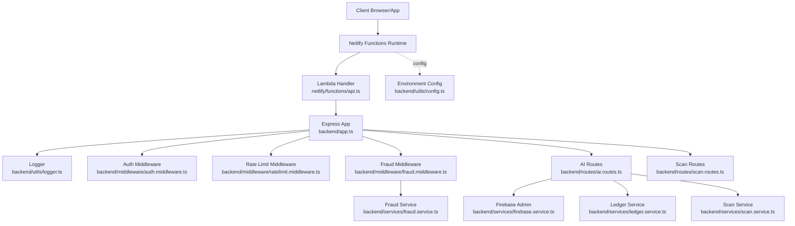
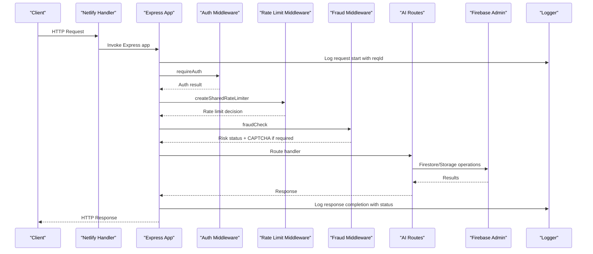
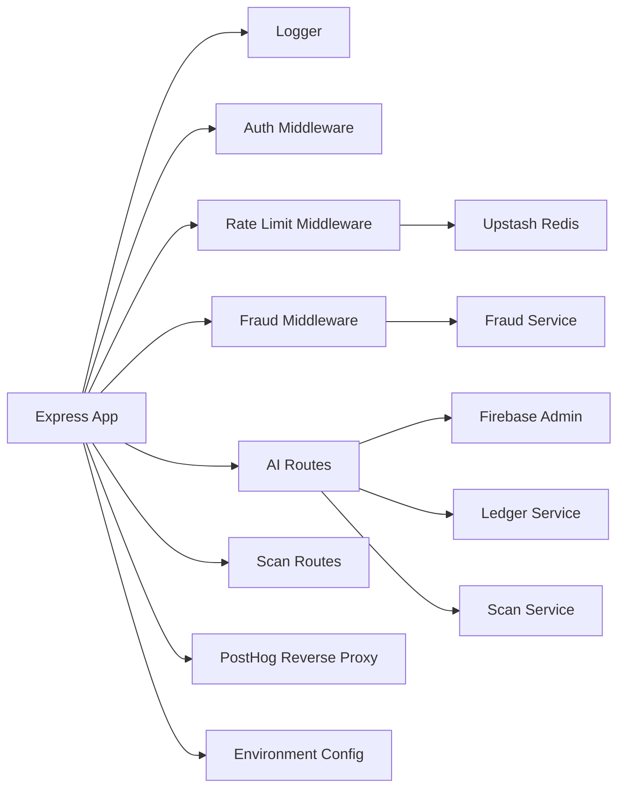

# Monitoring and Logging

<cite>
**Referenced Files in This Document**
- [logger.ts](file://backend/utils/logger.ts)
- [app.ts](file://backend/app.ts)
- [api.ts](file://netlify/functions/api.ts)
- [netlify.toml](file://netlify.toml)
- [config.ts](file://backend/utils/config.ts)
- [firebase.service.ts](file://backend/services/firebase.service.ts)
- [auth.middleware.ts](file://backend/middleware/auth.middleware.ts)
- [ratelimit.middleware.ts](file://backend/middleware/ratelimit.middleware.ts)
- [fraud.middleware.ts](file://backend/middleware/fraud.middleware.ts)
- [fraud.service.ts](file://backend/services/fraud.service.ts)
- [ledger.service.ts](file://backend/services/ledger.service.ts)
- [scan.service.ts](file://backend/services/scan.service.ts)
- [ai.routes.ts](file://backend/routes/ai.routes.ts)
- [scan.routes.ts](file://backend/routes/scan.routes.ts)
- [index.ts](file://backend/index.ts)
- [package.json](file://package.json)
</cite>

## Table of Contents
1. [Introduction](#introduction)
2. [Project Structure](#project-structure)
3. [Core Components](#core-components)
4. [Architecture Overview](#architecture-overview)
5. [Detailed Component Analysis](#detailed-component-analysis)
6. [Dependency Analysis](#dependency-analysis)
7. [Performance Considerations](#performance-considerations)
8. [Troubleshooting Guide](#troubleshooting-guide)
9. [Conclusion](#conclusion)
10. [Appendices](#appendices)

## Introduction
This document provides comprehensive monitoring and logging guidance for the FaceAnalytics Pro production environment. It covers logging infrastructure (structured logging, log levels, and aggregation strategies), error tracking and alerting, performance monitoring (application, database, and external service health), serverless function metrics (execution duration, memory, cold starts), user behavior analytics and usage tracking, alerting configuration, log retention and compliance, troubleshooting workflows, and dashboard setup for system health visualization.

## Project Structure
The monitoring and logging ecosystem spans:
- Backend server (Express) with request logging and centralized error handling
- Serverless function wrapper for Netlify
- Environment configuration and validation
- Firebase Admin initialization and Firestore settings for serverless
- Middleware for authentication, rate limiting, and fraud detection
- Services for fraud detection, credit ledger, and scan caching
- Route handlers for AI analysis and scan operations

**Diagram sources**
- [api.ts:1-28](file://netlify/functions/api.ts#L1-L28)
- [app.ts:1-205](file://backend/app.ts#L1-L205)
- [logger.ts:1-71](file://backend/utils/logger.ts#L1-L71)
- [auth.middleware.ts:1-40](file://backend/middleware/auth.middleware.ts#L1-L40)
- [ratelimit.middleware.ts:1-134](file://backend/middleware/ratelimit.middleware.ts#L1-L134)
- [fraud.middleware.ts:1-133](file://backend/middleware/fraud.middleware.ts#L1-L133)
- [fraud.service.ts:1-634](file://backend/services/fraud.service.ts#L1-L634)
- [ledger.service.ts:1-269](file://backend/services/ledger.service.ts#L1-L269)
- [scan.service.ts:1-134](file://backend/services/scan.service.ts#L1-L134)
- [ai.routes.ts:1-1146](file://backend/routes/ai.routes.ts#L1-L1146)
- [scan.routes.ts:1-63](file://backend/routes/scan.routes.ts#L1-L63)
- [config.ts:1-110](file://backend/utils/config.ts#L1-L110)
- [firebase.service.ts:1-120](file://backend/services/firebase.service.ts#L1-L120)

**Section sources**
- [api.ts:1-28](file://netlify/functions/api.ts#L1-L28)
- [app.ts:1-205](file://backend/app.ts#L1-L205)
- [netlify.toml:1-42](file://netlify.toml#L1-L42)

## Core Components
- Logging Infrastructure
  - Console-based logger in production with optional dev upgrade to pino
  - Request correlation via request IDs
  - Redaction of sensitive headers and bodies
- Error Tracking and Alerting
  - Centralized error handler logs unhandled errors with request IDs
  - Redis-backed rate limiting and daily caps for abuse containment
  - Fraud detection with risk profiles, signals, and batched activity logging
- Performance Monitoring
  - Serverless timeout budgets and AI call timeouts
  - Firestore HTTP/1.1 (REST) preference for cold start performance
  - Retry logic with exponential backoff for external AI service
- Infrastructure Monitoring
  - Netlify function timeout configuration
  - Health check endpoint
- User Behavior Analytics and Usage Tracking
  - Device fingerprinting and IP/device history tracking
  - Batched activity logs with configurable retention
- Alerting Configuration
  - Redis rate limiter timeouts and fallbacks
  - Fraud risk thresholds and preemptive blocking
- Log Retention and Compliance
  - Activity log purging with configurable retention
  - Redaction of sensitive fields in logs
- Troubleshooting Workflows
  - Request ID tracing across middleware and services
  - Fraud risk status inspection and mitigation
- Dashboards
  - Health endpoint for basic system status
  - PostHog reverse proxy for ingestion

**Section sources**
- [logger.ts:1-71](file://backend/utils/logger.ts#L1-L71)
- [app.ts:68-88](file://backend/app.ts#L68-L88)
- [app.ts:181-191](file://backend/app.ts#L181-L191)
- [ratelimit.middleware.ts:1-134](file://backend/middleware/ratelimit.middleware.ts#L1-L134)
- [fraud.service.ts:1-634](file://backend/services/fraud.service.ts#L1-L634)
- [firebase.service.ts:97-108](file://backend/services/firebase.service.ts#L97-L108)
- [ai.routes.ts:125-157](file://backend/routes/ai.routes.ts#L125-L157)
- [netlify.toml:19-26](file://netlify.toml#L19-L26)
- [scan.routes.ts:1-63](file://backend/routes/scan.routes.ts#L1-L63)
- [config.ts:1-110](file://backend/utils/config.ts#L1-L110)

## Architecture Overview
The monitoring and logging architecture integrates request lifecycle logging, centralized error handling, and robust middleware for security and abuse prevention. Serverless execution enforces strict timeouts, while Firebase Admin is configured for REST to reduce cold start latency.

**Diagram sources**
- [api.ts:24-27](file://netlify/functions/api.ts#L24-L27)
- [app.ts:68-88](file://backend/app.ts#L68-L88)
- [auth.middleware.ts:18-39](file://backend/middleware/auth.middleware.ts#L18-L39)
- [ratelimit.middleware.ts:38-91](file://backend/middleware/ratelimit.middleware.ts#L38-L91)
- [fraud.middleware.ts:30-104](file://backend/middleware/fraud.middleware.ts#L30-L104)
- [ai.routes.ts:271-516](file://backend/routes/ai.routes.ts#L271-L516)
- [firebase.service.ts:75-111](file://backend/services/firebase.service.ts#L75-L111)
- [logger.ts:21-32](file://backend/utils/logger.ts#L21-L32)

## Detailed Component Analysis

### Logging Infrastructure
- Production logger uses console with request IDs and optional debug filtering
- Dev environment upgrades to pino with file transport and redaction
- Request logging prints method, URL, and status upon response
- Centralized error handler logs unhandled errors with request IDs

Implementation highlights:
- Synchronous console logger exported for universal use
- Conditional pino upgrade in development for richer output
- Redaction of authorization, cookies, and image payloads
- Request correlation via UUID attached to request object

Operational guidance:
- Use request IDs to trace end-to-end requests across middleware and services
- Enable debug logs selectively via environment variable for targeted investigations
- Review redacted logs for sensitive fields prior to sharing

**Section sources**
- [logger.ts:1-71](file://backend/utils/logger.ts#L1-L71)
- [app.ts:68-88](file://backend/app.ts#L68-L88)
- [app.ts:181-191](file://backend/app.ts#L181-L191)

### Error Tracking and Alerting
- Centralized error handler logs errors with request IDs and returns standardized 500 responses
- Redis-backed rate limiting with timeouts and fallbacks to prevent cascading failures
- Daily usage caps for authenticated users to bound resource consumption
- Fraud middleware enforces risk-aware gating and CAPTCHA verification when required

Alerting recommendations:
- Monitor rate limiter timeouts and fallbacks as early warning signals
- Track CAPTCHA failure rates and fraud signal escalations
- Alert on sustained Redis connectivity issues affecting rate limiting

**Section sources**
- [app.ts:181-191](file://backend/app.ts#L181-L191)
- [ratelimit.middleware.ts:53-91](file://backend/middleware/ratelimit.middleware.ts#L53-L91)
- [fraud.middleware.ts:71-92](file://backend/middleware/fraud.middleware.ts#L71-L92)

### Performance Monitoring Setup
- Serverless timeout budget: 26 seconds; backend aborts AI calls after 24 seconds to flush responses
- Firestore configured to HTTP/1.1 (REST) to reduce cold start latency
- Retry logic with exponential backoff for external AI service calls
- AI call timeouts and structured error logging with status and body previews in development

Monitoring focus:
- Execution duration distribution and tail latencies
- AI service availability and retry counts
- Firestore connection establishment times

**Section sources**
- [netlify.toml:19-26](file://netlify.toml#L19-L26)
- [firebase.service.ts:97-108](file://backend/services/firebase.service.ts#L97-L108)
- [ai.routes.ts:125-157](file://backend/routes/ai.routes.ts#L125-L157)
- [ai.routes.ts:165-216](file://backend/routes/ai.routes.ts#L165-L216)

### Database Query Monitoring
- Firestore client switched to HTTP/1.1 (REST) for serverless cold start performance
- Batched writes for activity logs to reduce write volume
- Paginated scan history queries with cursor-based pagination

Observability tips:
- Track Firestore read/write latency and error rates
- Monitor batch flush intervals and buffer sizes
- Observe query patterns for scan history and activity logs

**Section sources**
- [firebase.service.ts:97-108](file://backend/services/firebase.service.ts#L97-L108)
- [fraud.service.ts:555-588](file://backend/services/fraud.service.ts#L555-L588)
- [scan.routes.ts:46-60](file://backend/routes/scan.routes.ts#L46-L60)

### External Service Health Checks
- Vertex AI calls with automatic endpoint selection and API key prefix detection
- Retry logic with suggested retry delays from 429 responses
- AbortController-based timeouts to respect platform budgets

Health monitoring:
- Track Vertex AI availability, latency, and retry counts
- Monitor 429 responses and suggested retry delays
- Validate endpoint selection and key format

**Section sources**
- [ai.routes.ts:41-49](file://backend/routes/ai.routes.ts#L41-L49)
- [ai.routes.ts:176-254](file://backend/routes/ai.routes.ts#L176-L254)
- [ai.routes.ts:125-157](file://backend/routes/ai.routes.ts#L125-L157)

### Infrastructure Monitoring for Serverless Functions
- Netlify function timeout configured to 26 seconds
- Dynamic imports defer heavy modules to first invocation to minimize cold start impact
- Request logging and response status capture for operational visibility

Metrics to track:
- Cold start frequency and duration
- Invocation latency distribution
- Timeout and 502 error rates

**Section sources**
- [netlify.toml:19-26](file://netlify.toml#L19-L26)
- [api.ts:12-22](file://netlify/functions/api.ts#L12-L22)
- [app.ts:15-47](file://backend/app.ts#L15-L47)

### User Behavior Analytics and Usage Tracking
- Device fingerprinting using multiple HTTP headers plus optional client-provided fingerprint
- IP and device history tracking per user risk profile
- Batched activity logging with periodic flushing and configurable buffer size
- Purge of old activity logs with retention policy

Compliance and privacy:
- Retain activity logs for configured retention period
- Apply redaction of sensitive fields in logs
- Respect user privacy by minimizing stored personal data

**Section sources**
- [fraud.middleware.ts:39-42](file://backend/middleware/fraud.middleware.ts#L39-L42)
- [fraud.service.ts:99-121](file://backend/services/fraud.service.ts#L99-L121)
- [fraud.service.ts:127-204](file://backend/services/fraud.service.ts#L127-L204)
- [fraud.service.ts:548-588](file://backend/services/fraud.service.ts#L548-L588)
- [fraud.service.ts:595-633](file://backend/services/fraud.service.ts#L595-L633)

### Alerting Configuration
- Redis rate limiter with 2-second timeout and failsafe open behavior
- Daily usage caps for authenticated users
- Fraud risk thresholds with preemptive blocking for expensive operations
- Environment validation to fail fast in production on missing critical variables

Alert triggers:
- Redis connectivity or performance degradation
- Excessive fraud signals or risk score escalations
- Environment misconfiguration in production

**Section sources**
- [ratelimit.middleware.ts:53-91](file://backend/middleware/ratelimit.middleware.ts#L53-L91)
- [ratelimit.middleware.ts:98-133](file://backend/middleware/ratelimit.middleware.ts#L98-L133)
- [fraud.middleware.ts:61-69](file://backend/middleware/fraud.middleware.ts#L61-L69)
- [config.ts:64-82](file://backend/utils/config.ts#L64-L82)

### Log Retention Policies and Compliance
- Activity logs purge older than configured retention days
- Redaction of sensitive headers and image payloads in logs
- Environment validation ensures critical variables are present in production

Retention and compliance:
- Configure retention days for activity logs
- Regularly review and audit logs for compliance requirements
- Ensure logs are retained only for the minimum necessary period

**Section sources**
- [fraud.service.ts:595-633](file://backend/services/fraud.service.ts#L595-L633)
- [logger.ts:41-44](file://backend/utils/logger.ts#L41-L44)
- [config.ts:64-82](file://backend/utils/config.ts#L64-L82)

### Troubleshooting Workflows
- Use request IDs to trace requests across middleware and services
- Inspect fraud risk status and device/IP history for suspicious activity
- Review rate limiter decisions and Redis connectivity issues
- Validate environment configuration and critical variables

Diagnostic steps:
- Correlate request logs with error logs using request IDs
- Check fraud middleware logs for CAPTCHA requirements and risk escalations
- Verify Redis availability and rate limiter performance
- Confirm environment variables and Firebase Admin initialization

**Section sources**
- [app.ts:68-88](file://backend/app.ts#L68-L88)
- [fraud.middleware.ts:48-104](file://backend/middleware/fraud.middleware.ts#L48-L104)
- [ratelimit.middleware.ts:53-91](file://backend/middleware/ratelimit.middleware.ts#L53-L91)
- [config.ts:59-82](file://backend/utils/config.ts#L59-L82)

### Dashboard Setup for System Health Visualization
- Health check endpoint for basic system status
- PostHog reverse proxy for analytics ingestion
- Request logging and response status capture for operational dashboards

Dashboard elements:
- Health endpoint status
- Request volume, latency, and error rates
- Rate limiter counters and Redis connectivity
- Fraud signal trends and risk score distributions
- AI service availability and retry metrics

**Section sources**
- [app.ts:166-169](file://backend/app.ts#L166-L169)
- [app.ts:49-59](file://backend/app.ts#L49-L59)
- [app.ts:68-88](file://backend/app.ts#L68-L88)

## Dependency Analysis
The monitoring and logging stack depends on:
- Express for request lifecycle and middleware composition
- Firebase Admin for Firestore and Auth with REST configuration for serverless
- Redis via Upstash for rate limiting and daily caps
- PostHog reverse proxy for analytics ingestion
- Environment configuration validation for production safety

**Diagram sources**
- [app.ts:1-205](file://backend/app.ts#L1-L205)
- [logger.ts:1-71](file://backend/utils/logger.ts#L1-L71)
- [auth.middleware.ts:1-40](file://backend/middleware/auth.middleware.ts#L1-L40)
- [ratelimit.middleware.ts:1-134](file://backend/middleware/ratelimit.middleware.ts#L1-L134)
- [fraud.middleware.ts:1-133](file://backend/middleware/fraud.middleware.ts#L1-L133)
- [fraud.service.ts:1-634](file://backend/services/fraud.service.ts#L1-L634)
- [ledger.service.ts:1-269](file://backend/services/ledger.service.ts#L1-L269)
- [scan.service.ts:1-134](file://backend/services/scan.service.ts#L1-L134)
- [ai.routes.ts:1-1146](file://backend/routes/ai.routes.ts#L1-L1146)
- [scan.routes.ts:1-63](file://backend/routes/scan.routes.ts#L1-L63)
- [firebase.service.ts:1-120](file://backend/services/firebase.service.ts#L1-L120)
- [config.ts:1-110](file://backend/utils/config.ts#L1-L110)

**Section sources**
- [package.json:19-52](file://package.json#L19-L52)

## Performance Considerations
- Cold start mitigation through dynamic imports and Firestore REST configuration
- Strict serverless timeouts with backend abort controller to ensure response flush
- Batched writes and periodic flushing for activity logs to reduce Firestore load
- Retry logic with exponential backoff for external AI service calls
- Redis-backed rate limiting with timeouts and failsafe open behavior

[No sources needed since this section provides general guidance]

## Troubleshooting Guide
- Request ID tracing: correlate request logs with response logs and error logs
- Redis diagnostics: monitor timeouts and fallback behavior
- Fraud investigation: inspect risk status, device/IP history, and fraud signals
- Environment validation: ensure critical variables are present in production
- AI service issues: review retry attempts, suggested delays, and endpoint selection

**Section sources**
- [app.ts:68-88](file://backend/app.ts#L68-L88)
- [ratelimit.middleware.ts:53-91](file://backend/middleware/ratelimit.middleware.ts#L53-L91)
- [fraud.middleware.ts:48-104](file://backend/middleware/fraud.middleware.ts#L48-L104)
- [config.ts:64-82](file://backend/utils/config.ts#L64-L82)

## Conclusion
The FaceAnalytics Pro monitoring and logging framework emphasizes production-grade observability through request correlation, centralized error handling, robust middleware for security and abuse prevention, and careful serverless performance tuning. By leveraging environment validation, Redis-backed rate limiting, fraud detection, and batched logging, the system provides strong operational insights and resilience. Implementing the recommended alerting and dashboard configurations will further enhance system health monitoring and incident response.

[No sources needed since this section summarizes without analyzing specific files]

## Appendices

### Appendix A: Environment Variables for Monitoring and Logging
- LOG_LEVEL: controls debug log visibility in development
- NODE_ENV: determines production vs. development behavior
- FIREBASE_SERVICE_ACCOUNT: enables secure Firebase Admin initialization
- VERTEX_API_KEY: required for AI analysis
- UPSTASH_REDIS_REST_URL and UPSTASH_REDIS_REST_TOKEN: enable rate limiting
- APP_URL: CORS allowlist for frontend origins
- ADMIN_EMAILS: comma-separated admin recipients
- FRAUD_* thresholds: configure fraud detection sensitivity
- NETLIFY: indicates deployment environment

**Section sources**
- [logger.ts:11-11](file://backend/utils/logger.ts#L11-L11)
- [config.ts:7-48](file://backend/utils/config.ts#L7-L48)
- [firebase.service.ts:14-49](file://backend/services/firebase.service.ts#L14-L49)
- [netlify.toml:1-42](file://netlify.toml#L1-L42)