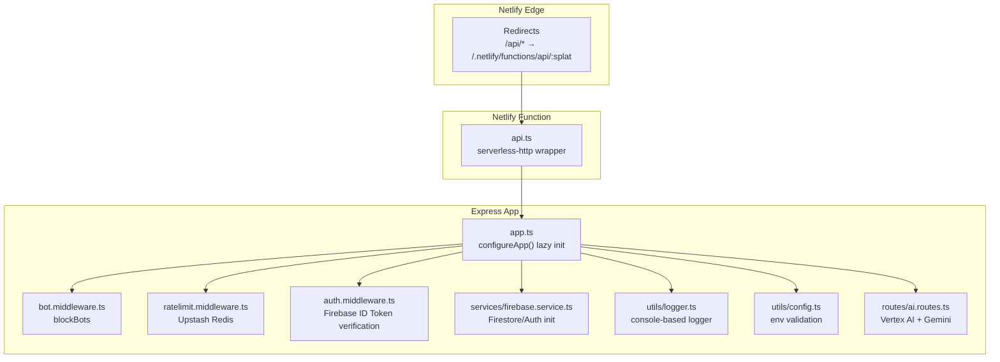
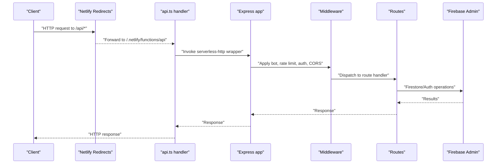
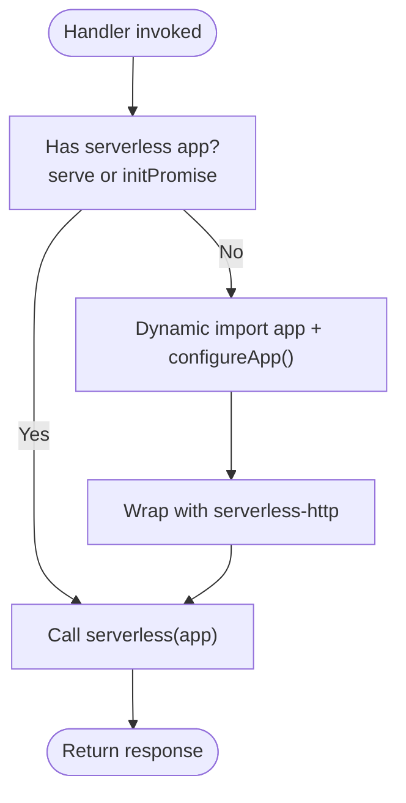
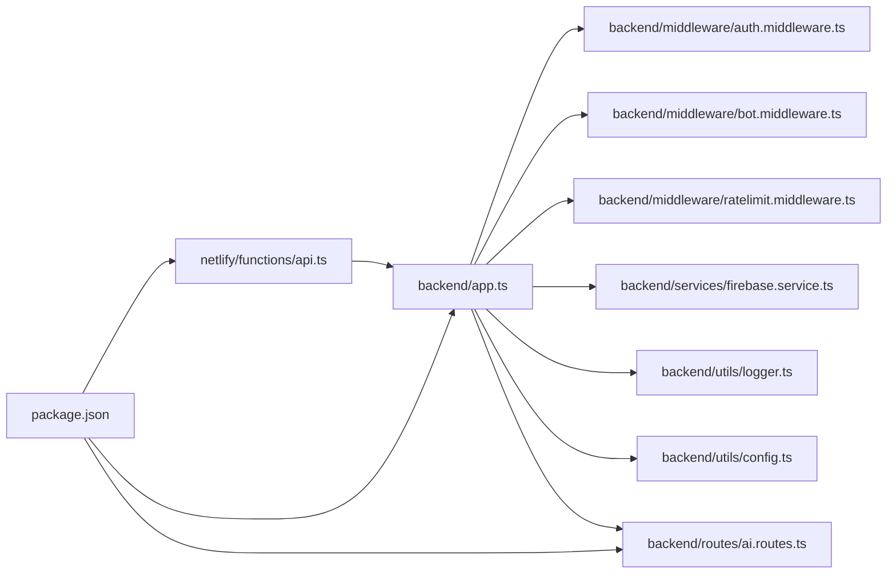

# Serverless Deployment

<cite>
**Referenced Files in This Document**
- [netlify.toml](file://netlify.toml)
- [api.ts](file://netlify/functions/api.ts)
- [app.ts](file://backend/app.ts)
- [index.ts](file://backend/index.ts)
- [auth.middleware.ts](file://backend/middleware/auth.middleware.ts)
- [bot.middleware.ts](file://backend/middleware/bot.middleware.ts)
- [ratelimit.middleware.ts](file://backend/middleware/ratelimit.middleware.ts)
- [firebase.service.ts](file://backend/services/firebase.service.ts)
- [config.ts](file://backend/utils/config.ts)
- [logger.ts](file://backend/utils/logger.ts)
- [ai.routes.ts](file://backend/routes/ai.routes.ts)
- [ci.yml](file://.github/workflows/ci.yml)
- [package.json](file://package.json)
- [README.md](file://README.md)
</cite>

## Table of Contents
1. [Introduction](#introduction)
2. [Project Structure](#project-structure)
3. [Core Components](#core-components)
4. [Architecture Overview](#architecture-overview)
5. [Detailed Component Analysis](#detailed-component-analysis)
6. [Dependency Analysis](#dependency-analysis)
7. [Performance Considerations](#performance-considerations)
8. [Troubleshooting Guide](#troubleshooting-guide)
9. [Conclusion](#conclusion)
10. [Appendices](#appendices)

## Introduction
This document provides comprehensive serverless deployment guidance for FaceAnalytics Pro using Netlify Functions. It covers Netlify Functions configuration, function routing, environment variables, cold start optimization, dynamic imports, API gateway setup, request/response handling, environment management across environments, CI/CD and testing, monitoring, scaling and cost optimization, rollback and safety mechanisms, and security configurations including CORS and authentication.

## Project Structure
The serverless runtime is implemented as a single Netlify Function that wraps an Express application. The Express app is lazily initialized on first invocation to minimize cold start overhead. Netlify’s redirect rules forward traffic to the function, and the Express app mounts route handlers and middleware for security, rate limiting, and API logic.

**Diagram sources**
- [netlify.toml:27-42](file://netlify.toml#L27-L42)
- [api.ts:1-28](file://netlify/functions/api.ts#L1-L28)
- [app.ts:1-205](file://backend/app.ts#L1-L205)
- [auth.middleware.ts:1-40](file://backend/middleware/auth.middleware.ts#L1-L40)
- [bot.middleware.ts:1-134](file://backend/middleware/bot.middleware.ts#L1-L134)
- [ratelimit.middleware.ts:1-134](file://backend/middleware/ratelimit.middleware.ts#L1-L134)
- [firebase.service.ts:1-120](file://backend/services/firebase.service.ts#L1-L120)
- [logger.ts:1-71](file://backend/utils/logger.ts#L1-L71)
- [config.ts:1-110](file://backend/utils/config.ts#L1-L110)
- [ai.routes.ts:1-1146](file://backend/routes/ai.routes.ts#L1-L1146)

**Section sources**
- [netlify.toml:1-42](file://netlify.toml#L1-L42)
- [api.ts:1-28](file://netlify/functions/api.ts#L1-L28)
- [app.ts:1-205](file://backend/app.ts#L1-L205)

## Core Components
- Netlify Functions configuration and redirects define routing and bundler behavior.
- The serverless function uses a lazy-initialized Express app to reduce cold start time.
- Express app configures middleware, security headers, CORS, logging, and routes.
- Authentication middleware verifies Firebase ID tokens.
- Rate limiting middleware integrates with Upstash Redis for sliding windows and daily caps.
- Firebase service initializes Firestore/Auth with HTTP/1.1 REST to avoid gRPC cold start delays.
- Environment validation ensures critical variables are present in production/Netlify.
- Logger avoids pino worker threads in serverless and falls back to console logging.

**Section sources**
- [netlify.toml:1-42](file://netlify.toml#L1-L42)
- [api.ts:1-28](file://netlify/functions/api.ts#L1-L28)
- [app.ts:1-205](file://backend/app.ts#L1-L205)
- [auth.middleware.ts:1-40](file://backend/middleware/auth.middleware.ts#L1-L40)
- [ratelimit.middleware.ts:1-134](file://backend/middleware/ratelimit.middleware.ts#L1-L134)
- [firebase.service.ts:1-120](file://backend/services/firebase.service.ts#L1-L120)
- [config.ts:1-110](file://backend/utils/config.ts#L1-L110)
- [logger.ts:1-71](file://backend/utils/logger.ts#L1-L71)

## Architecture Overview
The serverless architecture consists of:
- Netlify redirects mapping API paths to the serverless function.
- A single Express app wrapped by serverless-http and lazily initialized.
- Route handlers for AI analysis, payments, referrals, emails, auth, admin, and scans.
- Middleware for bot protection, rate limiting, and authentication.
- Security headers and CSP via Helmet, plus CORS enforcement.
- Logging with request IDs and environment-aware behavior.
- Firebase Admin SDK for Firestore/Auth with REST transport in serverless.

**Diagram sources**
- [netlify.toml:27-42](file://netlify.toml#L27-L42)
- [api.ts:24-27](file://netlify/functions/api.ts#L24-L27)
- [app.ts:166-191](file://backend/app.ts#L166-L191)
- [auth.middleware.ts:18-39](file://backend/middleware/auth.middleware.ts#L18-L39)
- [ratelimit.middleware.ts:38-91](file://backend/middleware/ratelimit.middleware.ts#L38-L91)
- [bot.middleware.ts:102-133](file://backend/middleware/bot.middleware.ts#L102-L133)
- [ai.routes.ts:271-516](file://backend/routes/ai.routes.ts#L271-L516)
- [firebase.service.ts:75-111](file://backend/services/firebase.service.ts#L75-L111)

## Detailed Component Analysis

### Netlify Functions Configuration
- Build settings publish dist and compile functions under netlify/functions.
- External Node modules explicitly listed to ensure esbuild bundling succeeds.
- Node bundler set to esbuild for fast builds.
- Per-function timeout tuned for AI-heavy endpoints.
- Redirects:
  - /api/* → /.netlify/functions/api/:splat
  - /ingest/* → PostHog ingestion host (proxy)
  - /* → /index.html for SPA fallback

**Section sources**
- [netlify.toml:1-42](file://netlify.toml#L1-L42)

### Serverless Function Wrapper (api.ts)
- Uses serverless-http to adapt Express app to Netlify runtime.
- Implements lazy initialization:
  - First invocation dynamically imports the Express app and configures it.
  - Subsequent invocations reuse the configured instance.
- Prevents cold start timeouts by deferring heavy imports to runtime.

**Diagram sources**
- [api.ts:12-27](file://netlify/functions/api.ts#L12-L27)

**Section sources**
- [api.ts:1-28](file://netlify/functions/api.ts#L1-L28)

### Express App Initialization (app.ts)
- Lazy configuration via configureApp() to defer heavy imports.
- Dynamic imports for helmet, crypto, proxy, bot middleware, logger, and route modules.
- PostHog reverse proxy for /ingest.
- JSON body parsing with size limits tailored to endpoints.
- Request logging with UUID request IDs and response status logging.
- Security headers via Helmet with extensive CSP and COOP overrides.
- CORS enforcement validated against an allowlist from APP_URL.
- Health check endpoint at /api/health.
- Route mounting for geometry, AI, PayPal, referral, email, auth, admin, and scans.
- Global error handler logs via pino-compatible logger and returns standardized error response.
- Static asset serving in production/Netlify.

**Section sources**
- [app.ts:1-205](file://backend/app.ts#L1-L205)

### Authentication Middleware (auth.middleware.ts)
- Expects Authorization: Bearer <id_token>.
- Verifies Firebase ID token and attaches user to request.
- Returns 401 for missing/invalid tokens.

**Section sources**
- [auth.middleware.ts:1-40](file://backend/middleware/auth.middleware.ts#L1-L40)

### Bot Protection Middleware (bot.middleware.ts)
- Blocks known bot user agents.
- Detects headless browsers and automation tools.
- Computes behavioral suspicion score for API POST requests and blocks above threshold.

**Section sources**
- [bot.middleware.ts:1-134](file://backend/middleware/bot.middleware.ts#L1-L134)

### Rate Limiting Middleware (ratelimit.middleware.ts)
- Integrates with Upstash Redis for sliding-window rate limits.
- Composite identifier: user:<uid> or ip:<ip> with per-IP check for authenticated users.
- Daily cap per user stored in Redis with TTL.
- Graceful degradation when Redis is unavailable.

**Section sources**
- [ratelimit.middleware.ts:1-134](file://backend/middleware/ratelimit.middleware.ts#L1-L134)

### Firebase Service (firebase.service.ts)
- Initializes Firebase Admin App from environment variable or local files.
- Retrieves Firestore/Auth instances with HTTP/1.1 REST enabled for serverless.
- Strict initialization in production/Netlify to avoid hanging calls.

**Section sources**
- [firebase.service.ts:1-120](file://backend/services/firebase.service.ts#L1-L120)

### Environment Validation (config.ts)
- Zod schema validates required environment variables.
- Crash behavior in production/Netlify if critical variables are missing.
- Development mode allows degraded operation with defaults.

**Section sources**
- [config.ts:1-110](file://backend/utils/config.ts#L1-L110)

### Logger (logger.ts)
- Console-based logger in serverless to avoid pino worker-thread crashes.
- Upgrades to pino in development for richer output.
- Redacts sensitive headers/body fields.

**Section sources**
- [logger.ts:1-71](file://backend/utils/logger.ts#L1-L71)

### AI Analysis Routes (ai.routes.ts)
- Vertex AI endpoint selection based on API key prefix and environment flags.
- Gemini Developer API vs Vertex regional OAuth endpoints.
- Configurable model and timeouts respecting Netlify function budget.
- Retry logic with exponential backoff and 429 handling.
- Credit-safe ordering: call Vertex AI first, then deduct credits.
- Image compression and caching to optimize performance and cost.
- Structured JSON parsing with robust extraction.

**Section sources**
- [ai.routes.ts:1-1146](file://backend/routes/ai.routes.ts#L1-L1146)

## Dependency Analysis
- The serverless function depends on the Express app and its lazy configuration.
- Express app depends on middleware, route handlers, Firebase service, logger, and environment config.
- AI routes depend on Vertex AI, Upstash Redis, and Firebase services.
- Package dependencies include serverless-http, express, helmet, firebase-admin, sharp, pino, and others.

**Diagram sources**
- [api.ts:1-28](file://netlify/functions/api.ts#L1-L28)
- [app.ts:1-205](file://backend/app.ts#L1-L205)
- [auth.middleware.ts:1-40](file://backend/middleware/auth.middleware.ts#L1-L40)
- [bot.middleware.ts:1-134](file://backend/middleware/bot.middleware.ts#L1-L134)
- [ratelimit.middleware.ts:1-134](file://backend/middleware/ratelimit.middleware.ts#L1-L134)
- [firebase.service.ts:1-120](file://backend/services/firebase.service.ts#L1-L120)
- [logger.ts:1-71](file://backend/utils/logger.ts#L1-L71)
- [config.ts:1-110](file://backend/utils/config.ts#L1-L110)
- [ai.routes.ts:1-1146](file://backend/routes/ai.routes.ts#L1-L1146)
- [package.json:1-79](file://package.json#L1-L79)

**Section sources**
- [package.json:1-79](file://package.json#L1-L79)

## Performance Considerations
- Cold start optimization:
  - Lazy initialization of the Express app and heavy modules.
  - serverless-http wrapper defers work to first invocation.
- Function timeout tuning:
  - Per-function timeout set to 26 seconds to accommodate Vertex AI latency.
- Transport optimization:
  - Firestore configured to use HTTP/1.1 REST to avoid gRPC cold start delays.
- Request/response handling:
  - JSON body size limits tailored to endpoint needs.
  - Request IDs for observability and correlation.
- AI-specific optimizations:
  - Image compression reduces payload size.
  - Caching avoids redundant Vertex AI calls.
  - Retry logic with backoff mitigates transient failures.
- Logging:
  - Minimal synchronous logging in serverless to avoid worker-thread issues.

**Section sources**
- [netlify.toml:19-26](file://netlify.toml#L19-L26)
- [app.ts:193-195](file://backend/app.ts#L193-L195)
- [firebase.service.ts:97-108](file://backend/services/firebase.service.ts#L97-L108)
- [ai.routes.ts:165-166](file://backend/routes/ai.routes.ts#L165-L166)

## Troubleshooting Guide
- Cold start failures:
  - Symptoms: 502 Bad Gateway with exit status 129.
  - Cause: Heavy imports in top-level module.
  - Resolution: Confirm lazy initialization via serverless-http and dynamic imports.
- Missing environment variables:
  - Symptoms: Immediate crash in production/Netlify.
  - Resolution: Validate with environment schema; ensure critical variables are present.
- Firebase initialization errors:
  - Symptoms: Firestore/Auth calls hang or fail.
  - Resolution: Verify FIREBASE_SERVICE_ACCOUNT JSON and prefer REST transport.
- Rate limit and Redis issues:
  - Symptoms: 429 responses or inconsistent limits.
  - Resolution: Check UPSTASH_REDIS configuration and fallback behavior.
- Authentication failures:
  - Symptoms: 401 Unauthorized.
  - Resolution: Verify Authorization header format and token validity.
- Logging and observability:
  - Use request IDs to trace requests; inspect Netlify logs for errors.

**Section sources**
- [api.ts:3-7](file://netlify/functions/api.ts#L3-L7)
- [config.ts:64-82](file://backend/utils/config.ts#L64-L82)
- [firebase.service.ts:36-49](file://backend/services/firebase.service.ts#L36-L49)
- [ratelimit.middleware.ts:86-91](file://backend/middleware/ratelimit.middleware.ts#L86-L91)
- [auth.middleware.ts:18-39](file://backend/middleware/auth.middleware.ts#L18-L39)
- [logger.ts:1-71](file://backend/utils/logger.ts#L1-L71)

## Conclusion
FaceAnalytics Pro leverages Netlify Functions with a lazily initialized Express app to achieve fast cold starts and reliable serverless performance. The configuration includes robust security, rate limiting, authentication, and environment validation. AI endpoints are optimized for Vertex AI latency and cost, with caching and retries. Monitoring and logging are designed for serverless environments, and the CI pipeline ensures quality across environments.

## Appendices

### Netlify Functions Configuration Reference
- Build command and publish directory.
- Functions directory and external Node modules.
- Node bundler and per-function timeout.
- Redirects for API, PostHog ingestion, and SPA fallback.

**Section sources**
- [netlify.toml:1-42](file://netlify.toml#L1-L42)

### Environment Variables Management
- Required variables include API keys, Firebase credentials, Upstash Redis, PayPal, PostHog host, and app URL.
- Validation enforces presence in production/Netlify; development allows degraded mode.

**Section sources**
- [config.ts:7-48](file://backend/utils/config.ts#L7-L48)
- [README.md:41-44](file://README.md#L41-L44)

### CI/CD and Automated Testing
- Workflow runs on push and pull_request to Ubuntu.
- Steps: checkout, setup Node.js, install dependencies, type-check, lint, and test.

**Section sources**
- [.github/workflows/ci.yml:1-22](file://.github/workflows/ci.yml#L1-L22)

### API Gateway and Request/Response Handling
- Redirects map /api/* to the serverless function.
- Express app sets security headers, CORS, JSON parsing, and routes.
- Standardized error handling and logging.

**Section sources**
- [netlify.toml:27-42](file://netlify.toml#L27-L42)
- [app.ts:68-191](file://backend/app.ts#L68-L191)

### Security Configuration
- Helmet CSP and COOP/Opp policies.
- CORS allowlist from APP_URL.
- Bot protection middleware and rate limiting.
- Authentication via Firebase ID tokens.

**Section sources**
- [app.ts:90-164](file://backend/app.ts#L90-L164)
- [bot.middleware.ts:1-134](file://backend/middleware/bot.middleware.ts#L1-L134)
- [ratelimit.middleware.ts:1-134](file://backend/middleware/ratelimit.middleware.ts#L1-L134)
- [auth.middleware.ts:1-40](file://backend/middleware/auth.middleware.ts#L1-L40)

### Monitoring Setup
- Console logging with request IDs.
- Netlify automatically captures stdout/stderr for function logs.
- Optional PostHog ingestion proxy for analytics events.

**Section sources**
- [app.ts:68-88](file://backend/app.ts#L68-L88)
- [netlify.toml:32-36](file://netlify.toml#L32-L36)

### Scaling and Cost Optimization
- Sliding window rate limits and daily caps bound usage.
- Image compression and caching reduce AI call frequency.
- REST transport for Firestore minimizes cold start overhead.
- Timeout tuning aligns with AI latency budgets.

**Section sources**
- [ratelimit.middleware.ts:98-133](file://backend/middleware/ratelimit.middleware.ts#L98-L133)
- [ai.routes.ts:330-362](file://backend/routes/ai.routes.ts#L330-L362)
- [firebase.service.ts:97-108](file://backend/services/firebase.service.ts#L97-L108)
- [netlify.toml:19-26](file://netlify.toml#L19-L26)

### Rollback and Deployment Safety
- CI pipeline ensures tests pass before deployment.
- Environment validation prevents misconfiguration in production/Netlify.
- Graceful fallbacks for Redis and optional features.

**Section sources**
- [.github/workflows/ci.yml:10-22](file://.github/workflows/ci.yml#L10-L22)
- [config.ts:64-82](file://backend/utils/config.ts#L64-L82)
- [ratelimit.middleware.ts:86-91](file://backend/middleware/ratelimit.middleware.ts#L86-L91)