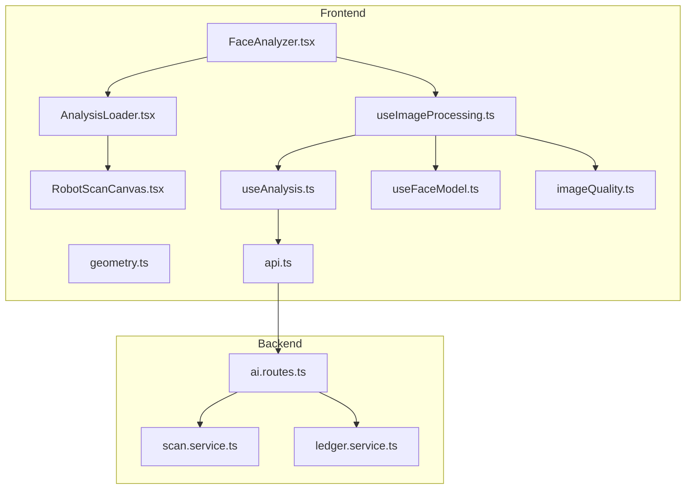
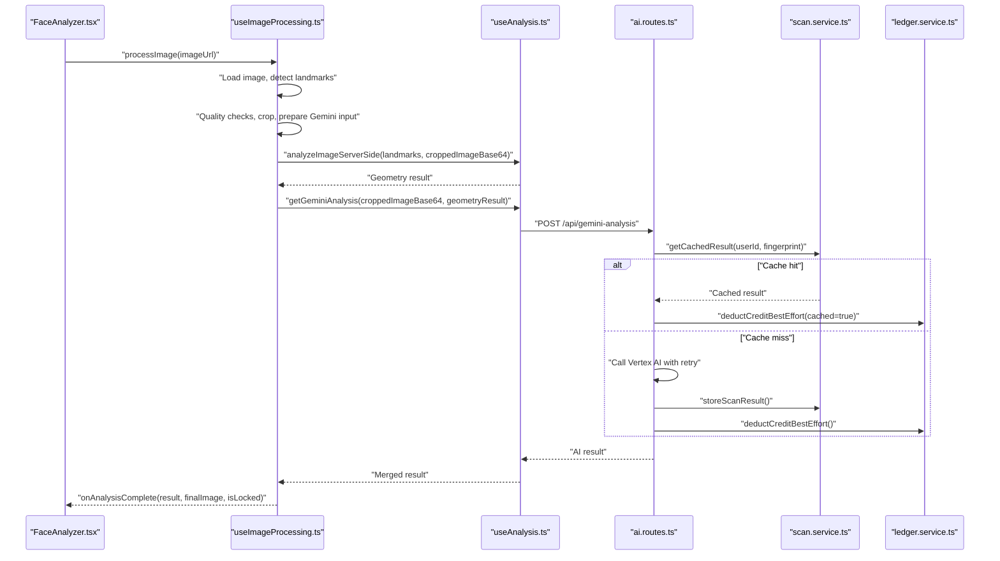
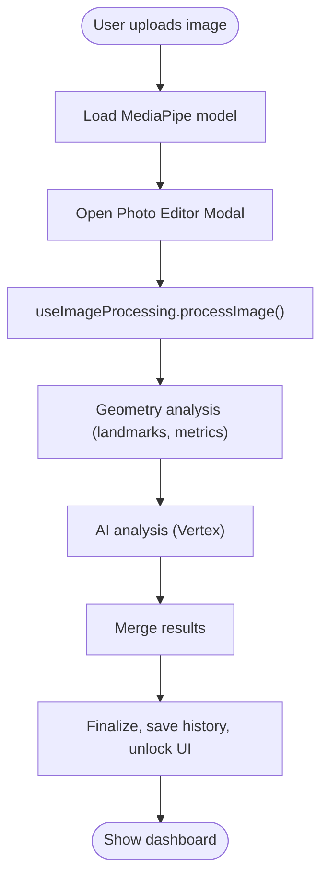
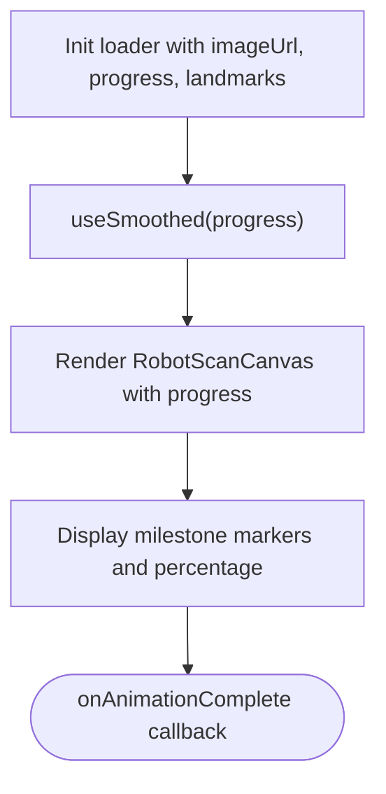
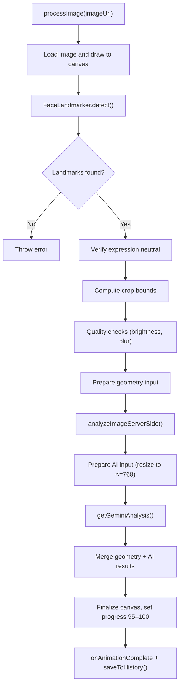
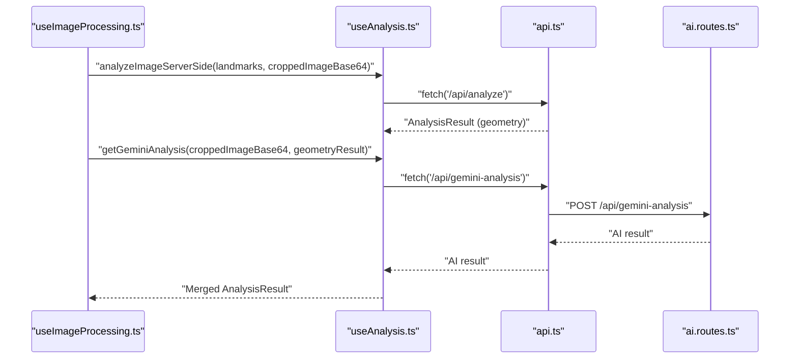
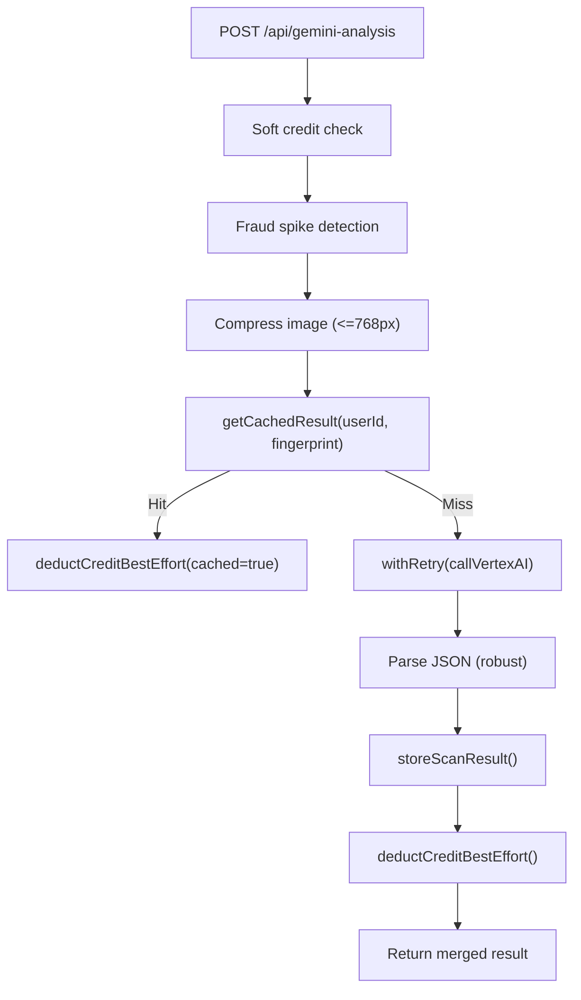
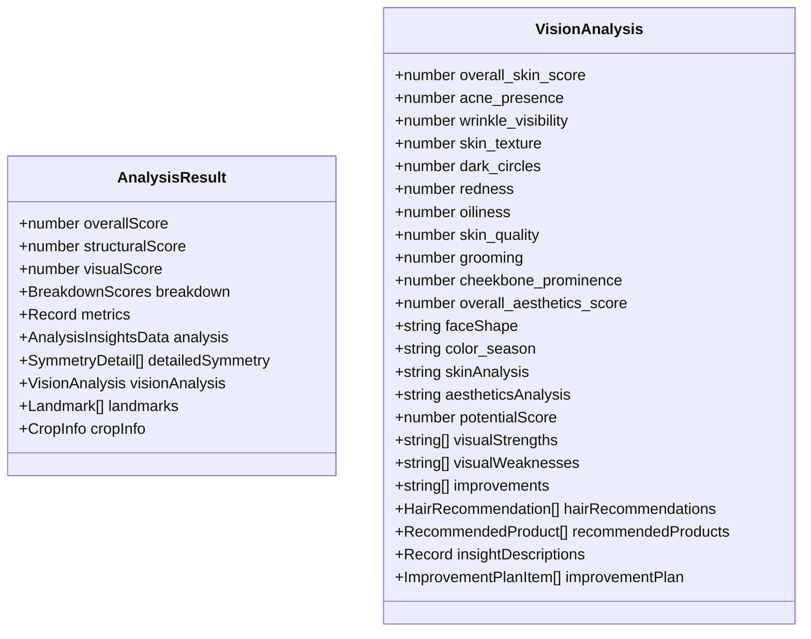
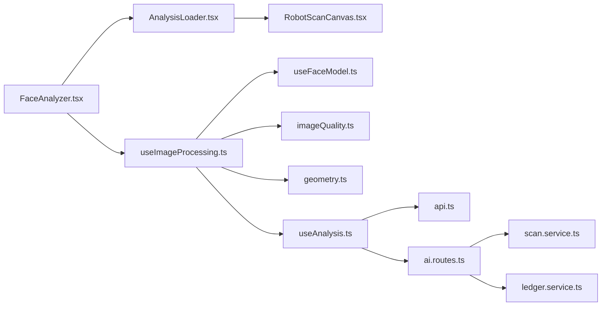

# Analysis Workflow Coordination

<cite>
**Referenced Files in This Document**
- [FaceAnalyzer.tsx](file://src/components/FaceAnalyzer/FaceAnalyzer.tsx)
- [AnalysisLoader.tsx](file://src/components/FaceAnalyzer/AnalysisLoader.tsx)
- [useImageProcessing.ts](file://src/components/FaceAnalyzer/hooks/useImageProcessing.ts)
- [useAnalysis.ts](file://src/components/FaceAnalyzer/hooks/useAnalysis.ts)
- [useFaceModel.ts](file://src/components/FaceAnalyzer/hooks/useFaceModel.ts)
- [RobotScanCanvas.tsx](file://src/components/FaceAnalyzer/canvas/RobotScanCanvas.tsx)
- [geometry.ts](file://src/components/FaceAnalyzer/utils/geometry.ts)
- [imageQuality.ts](file://src/components/FaceAnalyzer/utils/imageQuality.ts)
- [analysis.ts](file://src/types/analysis.ts)
- [ai.routes.ts](file://backend/routes/ai.routes.ts)
- [scan.service.ts](file://backend/services/scan.service.ts)
- [ledger.service.ts](file://backend/services/ledger.service.ts)
- [api.ts](file://src/lib/api.ts)
- [useDashboardController.ts](file://src/features/dashboard/useDashboardController.ts)
</cite>

## Table of Contents
1. [Introduction](#introduction)
2. [Project Structure](#project-structure)
3. [Core Components](#core-components)
4. [Architecture Overview](#architecture-overview)
5. [Detailed Component Analysis](#detailed-component-analysis)
6. [Dependency Analysis](#dependency-analysis)
7. [Performance Considerations](#performance-considerations)
8. [Troubleshooting Guide](#troubleshooting-guide)
9. [Conclusion](#conclusion)

## Introduction
This document explains the end-to-end analysis workflow coordination system that orchestrates image processing, AI analysis, and result visualization. It covers how the Face Analyzer component integrates with the AI backend, how progress is tracked and synchronized across UI and backend, and how multiple concurrent operations (model inference, data processing, UI updates) are coordinated. It also documents error handling, partial failure recovery, caching, and user experience considerations such as loading states and graceful degradation.

## Project Structure
The analysis workflow spans the frontend React components and hooks, the backend AI routes, and supporting services for caching and credit management. The frontend coordinates:
- Model loading and validation
- Image ingestion and preprocessing
- Progressive UI updates and visualization
- AI analysis orchestration and result merging
- History persistence

The backend coordinates:
- Secure, rate-limited AI calls
- Caching and deduplication
- Credit-safe ordering and best-effort deductions
- Fraud safeguards and retry logic

**Diagram sources**
- [FaceAnalyzer.tsx:11-512](file://src/components/FaceAnalyzer/FaceAnalyzer.tsx#L11-L512)
- [AnalysisLoader.tsx:60-286](file://src/components/FaceAnalyzer/AnalysisLoader.tsx#L60-L286)
- [RobotScanCanvas.tsx:313-800](file://src/components/FaceAnalyzer/canvas/RobotScanCanvas.tsx#L313-L800)
- [useImageProcessing.ts:9-234](file://src/components/FaceAnalyzer/hooks/useImageProcessing.ts#L9-L234)
- [useAnalysis.ts:6-207](file://src/components/FaceAnalyzer/hooks/useAnalysis.ts#L6-L207)
- [useFaceModel.ts:4-37](file://src/components/FaceAnalyzer/hooks/useFaceModel.ts#L4-L37)
- [imageQuality.ts:3-73](file://src/components/FaceAnalyzer/utils/imageQuality.ts#L3-L73)
- [geometry.ts:3-15](file://src/components/FaceAnalyzer/utils/geometry.ts#L3-L15)
- [api.ts:5-36](file://src/lib/api.ts#L5-L36)
- [ai.routes.ts:271-516](file://backend/routes/ai.routes.ts#L271-L516)
- [scan.service.ts:31-94](file://backend/services/scan.service.ts#L31-L94)
- [ledger.service.ts:189-240](file://backend/services/ledger.service.ts#L189-L240)

**Section sources**
- [FaceAnalyzer.tsx:11-512](file://src/components/FaceAnalyzer/FaceAnalyzer.tsx#L11-L512)
- [AnalysisLoader.tsx:60-286](file://src/components/FaceAnalyzer/AnalysisLoader.tsx#L60-L286)
- [useImageProcessing.ts:9-234](file://src/components/FaceAnalyzer/hooks/useImageProcessing.ts#L9-L234)
- [ai.routes.ts:271-516](file://backend/routes/ai.routes.ts#L271-L516)

## Core Components
- FaceAnalyzer: Orchestrates model loading, image ingestion, and triggers the processing pipeline. Manages progress smoothing, error propagation, and UI transitions.
- AnalysisLoader: Provides the full-screen analysis UI with animated progress, milestone markers, and live canvas visualization.
- useImageProcessing: Coordinates the entire pipeline: image loading, MediaPipe landmark detection, quality checks, cropping, geometry-based analysis, and AI analysis.
- useAnalysis: Handles server-side geometry-based analysis and AI enhancement, merges results, and persists history.
- useFaceModel: Loads the MediaPipe face landmarker with GPU acceleration and error handling.
- RobotScanCanvas: Renders the animated scanning visualization synchronized with progress and landmarks.
- Backend AI routes: Secure, rate-limited, and retry-enabled AI analysis with caching and credit-safe ordering.
- Supporting services: Caching and deduplication, credit ledger, and best-effort deductions.

**Section sources**
- [FaceAnalyzer.tsx:11-512](file://src/components/FaceAnalyzer/FaceAnalyzer.tsx#L11-L512)
- [AnalysisLoader.tsx:60-286](file://src/components/FaceAnalyzer/AnalysisLoader.tsx#L60-L286)
- [useImageProcessing.ts:9-234](file://src/components/FaceAnalyzer/hooks/useImageProcessing.ts#L9-L234)
- [useAnalysis.ts:6-207](file://src/components/FaceAnalyzer/hooks/useAnalysis.ts#L6-L207)
- [useFaceModel.ts:4-37](file://src/components/FaceAnalyzer/hooks/useFaceModel.ts#L4-L37)
- [RobotScanCanvas.tsx:313-800](file://src/components/FaceAnalyzer/canvas/RobotScanCanvas.tsx#L313-L800)
- [ai.routes.ts:271-516](file://backend/routes/ai.routes.ts#L271-L516)
- [scan.service.ts:31-94](file://backend/services/scan.service.ts#L31-L94)
- [ledger.service.ts:189-240](file://backend/services/ledger.service.ts#L189-L240)

## Architecture Overview
The workflow is a hybrid frontend/backend orchestration:
- Frontend loads the model, processes images, and streams progress to the UI.
- Geometry-based analysis runs locally on the frontend.
- Premium AI analysis runs on the backend with robust retry and error handling.
- Results are merged and persisted, with caching to avoid redundant AI calls.

**Diagram sources**
- [FaceAnalyzer.tsx:11-512](file://src/components/FaceAnalyzer/FaceAnalyzer.tsx#L11-L512)
- [useImageProcessing.ts:26-222](file://src/components/FaceAnalyzer/hooks/useImageProcessing.ts#L26-L222)
- [useAnalysis.ts:9-160](file://src/components/FaceAnalyzer/hooks/useAnalysis.ts#L9-L160)
- [ai.routes.ts:271-516](file://backend/routes/ai.routes.ts#L271-L516)
- [scan.service.ts:31-94](file://backend/services/scan.service.ts#L31-L94)
- [ledger.service.ts:189-240](file://backend/services/ledger.service.ts#L189-L240)

## Detailed Component Analysis

### FaceAnalyzer Orchestration
- Initializes model loading and error state.
- Manages upload, editing, and processing lifecycle.
- Coordinates progress smoothing and animation completion.
- Integrates with the AnalysisLoader for full-screen visualization and progress display.

**Diagram sources**
- [FaceAnalyzer.tsx:11-512](file://src/components/FaceAnalyzer/FaceAnalyzer.tsx#L11-L512)
- [useImageProcessing.ts:26-222](file://src/components/FaceAnalyzer/hooks/useImageProcessing.ts#L26-L222)

**Section sources**
- [FaceAnalyzer.tsx:11-512](file://src/components/FaceAnalyzer/FaceAnalyzer.tsx#L11-L512)

### AnalysisLoader and Progress Tracking
- Provides a full-screen canvas visualization synchronized with progress milestones.
- Uses a smoothed progress display to ensure perceptible motion even under variable latency.
- Animates a robot scanning scene and renders face landmarks when available.

**Diagram sources**
- [AnalysisLoader.tsx:60-286](file://src/components/FaceAnalyzer/AnalysisLoader.tsx#L60-L286)
- [RobotScanCanvas.tsx:313-800](file://src/components/FaceAnalyzer/canvas/RobotScanCanvas.tsx#L313-L800)

**Section sources**
- [AnalysisLoader.tsx:60-286](file://src/components/FaceAnalyzer/AnalysisLoader.tsx#L60-L286)
- [RobotScanCanvas.tsx:313-800](file://src/components/FaceAnalyzer/canvas/RobotScanCanvas.tsx#L313-L800)

### useImageProcessing Pipeline
- Validates image and landmarks, enforces neutral expression and proximity rules.
- Performs lighting and blur checks, crops face region, and prepares inputs for AI.
- Streams progress milestones and merges geometry and AI results.
- Saves history thumbnail and handles animation completion.

**Diagram sources**
- [useImageProcessing.ts:26-222](file://src/components/FaceAnalyzer/hooks/useImageProcessing.ts#L26-L222)

**Section sources**
- [useImageProcessing.ts:26-222](file://src/components/FaceAnalyzer/hooks/useImageProcessing.ts#L26-L222)
- [imageQuality.ts:3-73](file://src/components/FaceAnalyzer/utils/imageQuality.ts#L3-L73)
- [geometry.ts:3-15](file://src/components/FaceAnalyzer/utils/geometry.ts#L3-L15)

### useAnalysis: Server-Side Geometry and AI Enhancement
- Calls the geometry-based analysis endpoint.
- Calls the AI endpoint with retries and extended timeouts.
- Merges AI results into the geometry result (scores, breakdown, insights).
- Persists scan to history with a thumbnail.

**Diagram sources**
- [useAnalysis.ts:9-160](file://src/components/FaceAnalyzer/hooks/useAnalysis.ts#L9-L160)
- [api.ts:5-36](file://src/lib/api.ts#L5-L36)
- [ai.routes.ts:271-516](file://backend/routes/ai.routes.ts#L271-L516)

**Section sources**
- [useAnalysis.ts:9-160](file://src/components/FaceAnalyzer/hooks/useAnalysis.ts#L9-L160)
- [api.ts:5-36](file://src/lib/api.ts#L5-L36)

### Backend AI Routes: Security, Caching, and Reliability
- Enforces rate limits and daily caps.
- Performs soft credit checks before AI calls.
- Implements retry with exponential backoff and 429-aware delays.
- Caches results keyed by user and image fingerprint.
- Deducts credits after successful AI processing with best-effort guarantees.

**Diagram sources**
- [ai.routes.ts:271-516](file://backend/routes/ai.routes.ts#L271-L516)
- [scan.service.ts:31-94](file://backend/services/scan.service.ts#L31-L94)
- [ledger.service.ts:189-240](file://backend/services/ledger.service.ts#L189-L240)

**Section sources**
- [ai.routes.ts:271-516](file://backend/routes/ai.routes.ts#L271-L516)
- [scan.service.ts:31-94](file://backend/services/scan.service.ts#L31-L94)
- [ledger.service.ts:189-240](file://backend/services/ledger.service.ts#L189-L240)

### Data Models and Types
- AnalysisResult defines the unified result structure, including geometry scores, breakdown, AI enhancements, and optional landmarks and crop info.
- VisionAnalysis captures AI-derived insights such as skin quality, face shape, color season, and improvement plan.

**Diagram sources**
- [analysis.ts:96-116](file://src/types/analysis.ts#L96-L116)
- [analysis.ts:26-63](file://src/types/analysis.ts#L26-L63)

**Section sources**
- [analysis.ts:96-116](file://src/types/analysis.ts#L96-L116)
- [analysis.ts:26-63](file://src/types/analysis.ts#L26-L63)

### Dashboard Integration and UX
- The dashboard controller composes UI state and memoized data from the analysis result.
- It exposes promo, leaderboard, and celebrity analysis states for a cohesive user experience.

**Section sources**
- [useDashboardController.ts:4-101](file://src/features/dashboard/useDashboardController.ts#L4-L101)

## Dependency Analysis
- Frontend-to-backend dependencies:
  - useAnalysis.ts uses api.ts interceptors to attach Firebase auth and CAPTCHA tokens.
  - ai.routes.ts depends on scan.service.ts for caching and ledger.service.ts for credit management.
- Internal frontend dependencies:
  - FaceAnalyzer.tsx depends on useImageProcessing.ts, which depends on useFaceModel.ts, imageQuality.ts, and geometry.ts.
  - AnalysisLoader.tsx depends on RobotScanCanvas.tsx for visualization.

**Diagram sources**
- [FaceAnalyzer.tsx:11-512](file://src/components/FaceAnalyzer/FaceAnalyzer.tsx#L11-L512)
- [AnalysisLoader.tsx:60-286](file://src/components/FaceAnalyzer/AnalysisLoader.tsx#L60-L286)
- [RobotScanCanvas.tsx:313-800](file://src/components/FaceAnalyzer/canvas/RobotScanCanvas.tsx#L313-L800)
- [useImageProcessing.ts:9-234](file://src/components/FaceAnalyzer/hooks/useImageProcessing.ts#L9-L234)
- [useAnalysis.ts:6-207](file://src/components/FaceAnalyzer/hooks/useAnalysis.ts#L6-L207)
- [api.ts:5-36](file://src/lib/api.ts#L5-L36)
- [ai.routes.ts:271-516](file://backend/routes/ai.routes.ts#L271-L516)
- [scan.service.ts:31-94](file://backend/services/scan.service.ts#L31-L94)
- [ledger.service.ts:189-240](file://backend/services/ledger.service.ts#L189-L240)

**Section sources**
- [FaceAnalyzer.tsx:11-512](file://src/components/FaceAnalyzer/FaceAnalyzer.tsx#L11-L512)
- [useImageProcessing.ts:9-234](file://src/components/FaceAnalyzer/hooks/useImageProcessing.ts#L9-L234)
- [useAnalysis.ts:6-207](file://src/components/FaceAnalyzer/hooks/useAnalysis.ts#L6-L207)
- [ai.routes.ts:271-516](file://backend/routes/ai.routes.ts#L271-L516)

## Performance Considerations
- Model loading: GPU delegation and lazy initialization reduce cold-start latency.
- Image processing: Cropping and resizing minimize AI payload size; quality checks prevent wasted compute on poor images.
- Progress smoothing: Time-based interpolation ensures consistent motion across devices and frames.
- Backend timeouts: Extended timeouts and retries accommodate long-running AI calls.
- Caching: Image hashing and user-scoped caching avoids redundant AI calls.
- Animation pacing: Staggered wireframe groups and device-tier detection optimize rendering performance.

[No sources needed since this section provides general guidance]

## Troubleshooting Guide
- Model load failures: The model hook sets an error state if initialization fails; instruct users to refresh.
- Processing errors: useImageProcessing throws descriptive errors for lighting, blur, expression, and proximity issues.
- AI failures: useAnalysis retries once and logs detailed backend errors; insufficient credits are handled gracefully.
- Backend timeouts: Extended timeouts and retry logic mitigate transient Vertex AI issues.
- Credit handling: Best-effort deductions ensure results are delivered even if Firestore is temporarily unavailable; pending_deducts reconciles later.
- Cache misses: If caching fails, the system continues without blocking the user.

**Section sources**
- [useFaceModel.ts:4-37](file://src/components/FaceAnalyzer/hooks/useFaceModel.ts#L4-L37)
- [useImageProcessing.ts:216-222](file://src/components/FaceAnalyzer/hooks/useImageProcessing.ts#L216-L222)
- [useAnalysis.ts:149-160](file://src/components/FaceAnalyzer/hooks/useAnalysis.ts#L149-L160)
- [ai.routes.ts:125-157](file://backend/routes/ai.routes.ts#L125-L157)
- [ledger.service.ts:189-240](file://backend/services/ledger.service.ts#L189-L240)

## Conclusion
The analysis workflow coordination system integrates frontend orchestration with secure, resilient backend AI processing. It provides a smooth user experience through progressive visualization, robust error handling, and intelligent caching. The design balances reliability and responsiveness, ensuring users receive timely, accurate results while maintaining system stability under varying conditions.