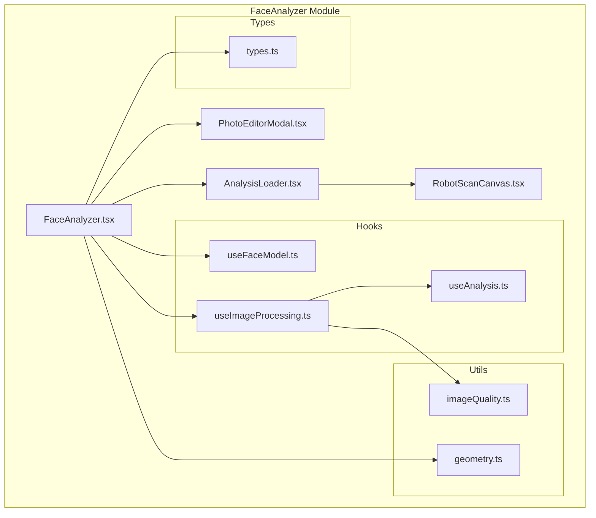
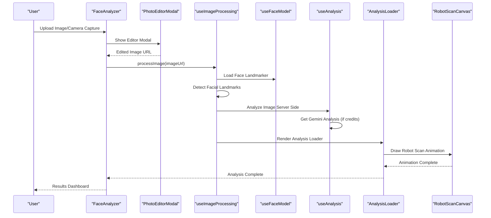
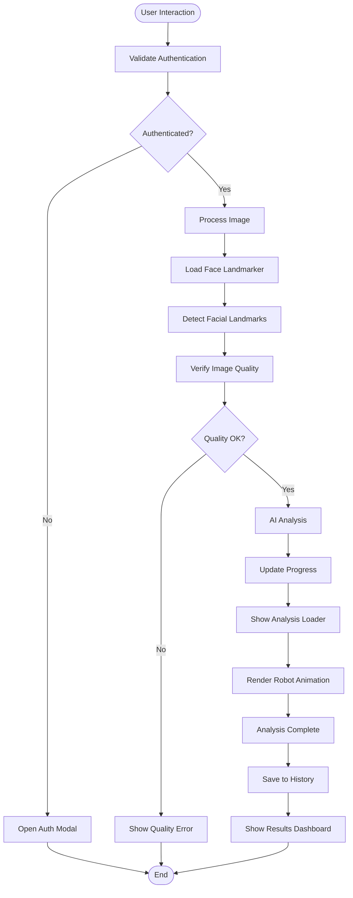
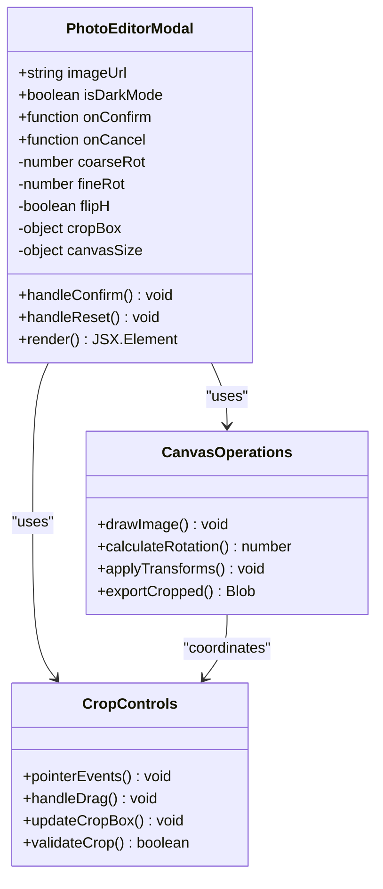
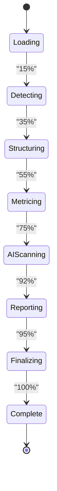
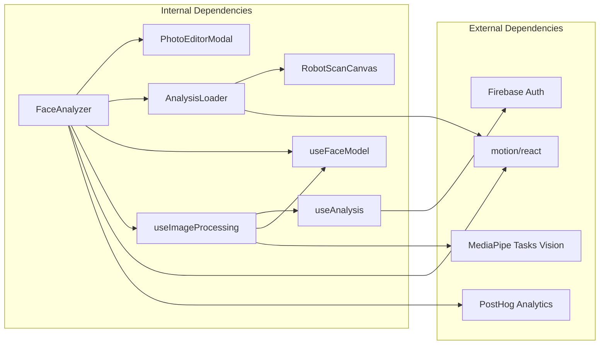

# Face Analyzer Component

<cite>
**Referenced Files in This Document**
- [FaceAnalyzer.tsx](file://src/components/FaceAnalyzer/FaceAnalyzer.tsx)
- [PhotoEditorModal.tsx](file://src/components/FaceAnalyzer/PhotoEditorModal.tsx)
- [AnalysisLoader.tsx](file://src/components/FaceAnalyzer/AnalysisLoader.tsx)
- [useFaceModel.ts](file://src/components/FaceAnalyzer/hooks/useFaceModel.ts)
- [useImageProcessing.ts](file://src/components/FaceAnalyzer/hooks/useImageProcessing.ts)
- [useAnalysis.ts](file://src/components/FaceAnalyzer/hooks/useAnalysis.ts)
- [types.ts](file://src/components/FaceAnalyzer/types.ts)
- [geometry.ts](file://src/components/FaceAnalyzer/utils/geometry.ts)
- [imageQuality.ts](file://src/components/FaceAnalyzer/utils/imageQuality.ts)
- [RobotScanCanvas.tsx](file://src/components/FaceAnalyzer/canvas/RobotScanCanvas.tsx)
- [Landing.tsx](file://src/pages/Landing.tsx)
- [App.tsx](file://src/App.tsx)
</cite>

## Table of Contents
1. [Introduction](#introduction)
2. [Project Structure](#project-structure)
3. [Core Components](#core-components)
4. [Architecture Overview](#architecture-overview)
5. [Detailed Component Analysis](#detailed-component-analysis)
6. [Dependency Analysis](#dependency-analysis)
7. [Performance Considerations](#performance-considerations)
8. [Troubleshooting Guide](#troubleshooting-guide)
9. [Conclusion](#conclusion)
10. [Appendices](#appendices)

## Introduction
The FaceAnalyzer component is the core UI module responsible for facial analysis workflows. It orchestrates image uploads, camera capture, photo editing, facial landmark detection, AI-powered analysis, and result presentation. The component integrates tightly with child components (PhotoEditorModal and AnalysisLoader), hooks for model loading and processing, and utility modules for image quality checks and geometry drawing. It implements a sophisticated progress tracking system with smooth animations, milestone-based updates, and responsive design patterns with dark mode support and accessibility features.

## Project Structure
The FaceAnalyzer module follows a feature-based organization with clear separation of concerns:
- Core component: FaceAnalyzer.tsx
- Child components: PhotoEditorModal.tsx, AnalysisLoader.tsx
- Hooks: useFaceModel.ts, useImageProcessing.ts, useAnalysis.ts
- Utilities: geometry.ts, imageQuality.ts
- Canvas renderer: RobotScanCanvas.tsx
- Types: types.ts



**Diagram sources**
- [FaceAnalyzer.tsx:1-512](file://src/components/FaceAnalyzer/FaceAnalyzer.tsx#L1-L512)
- [PhotoEditorModal.tsx:1-571](file://src/components/FaceAnalyzer/PhotoEditorModal.tsx#L1-L571)
- [AnalysisLoader.tsx:1-286](file://src/components/FaceAnalyzer/AnalysisLoader.tsx#L1-L286)
- [RobotScanCanvas.tsx:1-800](file://src/components/FaceAnalyzer/canvas/RobotScanCanvas.tsx#L1-L800)
- [useFaceModel.ts:1-37](file://src/components/FaceAnalyzer/hooks/useFaceModel.ts#L1-L37)
- [useImageProcessing.ts:1-234](file://src/components/FaceAnalyzer/hooks/useImageProcessing.ts#L1-L234)
- [useAnalysis.ts:1-207](file://src/components/FaceAnalyzer/hooks/useAnalysis.ts#L1-L207)
- [geometry.ts:1-15](file://src/components/FaceAnalyzer/utils/geometry.ts#L1-L15)
- [imageQuality.ts:1-73](file://src/components/FaceAnalyzer/utils/imageQuality.ts#L1-L73)
- [types.ts:1-74](file://src/components/FaceAnalyzer/types.ts#L1-L74)

**Section sources**
- [FaceAnalyzer.tsx:1-512](file://src/components/FaceAnalyzer/FaceAnalyzer.tsx#L1-L512)
- [types.ts:1-74](file://src/components/FaceAnalyzer/types.ts#L1-L74)

## Core Components
The FaceAnalyzer component serves as the central orchestrator with the following key responsibilities:

### State Management Architecture
The component maintains several critical state variables:
- **Image State**: uploadedImageUrl, pendingUrl for managing image lifecycle
- **Processing State**: isProcessing, scanStep, errorProcessing for workflow tracking
- **Progress State**: progressTarget, scanHistory for animation and milestone tracking
- **UI State**: isMobile, analyzedCount for responsive behavior and social proof
- **Model State**: faceLandmarker, isModelLoading, modelError for AI model management

### Authentication and Credit Validation
The component implements robust authentication gating:
- requireAuth() function validates user presence before allowing analysis
- Integrates with userCredits prop for premium feature access
- Triggers onOpenAuth callback for unauthenticated users
- Handles user credit validation for AI analysis features

### Progress Tracking System
The progress system features sophisticated animation and milestone management:
- Time-based progress simulation with configurable rates
- Milestone-based updates (5, 15, 25, 35, 45, 55, 65, 95, 100)
- Smooth animation with minimum advancement thresholds
- Final dash animation ensuring completion visibility

**Section sources**
- [FaceAnalyzer.tsx:11-512](file://src/components/FaceAnalyzer/FaceAnalyzer.tsx#L11-L512)
- [useFaceModel.ts:1-37](file://src/components/FaceAnalyzer/hooks/useFaceModel.ts#L1-L37)
- [useImageProcessing.ts:1-234](file://src/components/FaceAnalyzer/hooks/useImageProcessing.ts#L1-L234)

## Architecture Overview
The FaceAnalyzer employs a layered architecture with clear separation between UI, business logic, and data processing:



**Diagram sources**
- [FaceAnalyzer.tsx:234-267](file://src/components/FaceAnalyzer/FaceAnalyzer.tsx#L234-L267)
- [useImageProcessing.ts:26-222](file://src/components/FaceAnalyzer/hooks/useImageProcessing.ts#L26-L222)
- [useAnalysis.ts:9-23](file://src/components/FaceAnalyzer/hooks/useAnalysis.ts#L9-L23)
- [AnalysisLoader.tsx:60-160](file://src/components/FaceAnalyzer/AnalysisLoader.tsx#L60-L160)
- [RobotScanCanvas.tsx:313-321](file://src/components/FaceAnalyzer/canvas/RobotScanCanvas.tsx#L313-L321)

## Detailed Component Analysis

### FaceAnalyzer Component
The main component coordinates the entire facial analysis workflow with sophisticated state management and animation systems.

#### State Management Patterns
The component implements several advanced state management patterns:
- **Ref-based State**: Uses useRef for performance-critical state (progress tracking, animation control)
- **Hook-based State**: Leverages useState and useEffect for React state management
- **Animation State**: Implements requestAnimationFrame loops for smooth progress updates
- **Error State**: Comprehensive error handling with user-friendly messages

#### Progress Animation System
The progress tracking system features:
- **Time-based Animation**: Uses performance.now() for FPS-independent updates
- **Milestone Management**: Configurable milestones matching backend progress steps
- **Smooth Transitions**: Minimum advancement thresholds prevent visual freezing
- **Final Dash**: Guarantees completion animation regardless of processing speed

#### Responsive Design Implementation
The component adapts to different screen sizes:
- **Mobile Detection**: Single-time detection on mount for performance
- **Dynamic Layout**: Grid-based responsive design (1 column on mobile, 2 columns on desktop)
- **Touch Optimization**: Touch-friendly controls and gestures
- **Aspect Ratio Management**: Maintains proper proportions across devices



**Diagram sources**
- [FaceAnalyzer.tsx:122-126](file://src/components/FaceAnalyzer/FaceAnalyzer.tsx#L122-L126)
- [useImageProcessing.ts:26-222](file://src/components/FaceAnalyzer/hooks/useImageProcessing.ts#L26-L222)
- [AnalysisLoader.tsx:60-160](file://src/components/FaceAnalyzer/AnalysisLoader.tsx#L60-L160)

**Section sources**
- [FaceAnalyzer.tsx:11-512](file://src/components/FaceAnalyzer/FaceAnalyzer.tsx#L11-L512)

### PhotoEditorModal Component
The PhotoEditorModal provides comprehensive image editing capabilities with professional-grade controls.

#### Editing Features
The modal supports:
- **Crop Operations**: Interactive cropping with corner handles and grid overlay
- **Rotation Controls**: Coarse 90-degree rotations and fine adjustment slider (-15° to +15°)
- **Flipping Operations**: Horizontal mirroring capability
- **Real-time Preview**: Live canvas rendering during edits

#### User Interface Design
The modal implements:
- **Spring-based Animations**: Smooth entrance and exit animations
- **Dark Mode Support**: Automatic theme adaptation
- **Keyboard Shortcuts**: Escape to cancel, Enter to confirm
- **Touch-friendly Controls**: Large touch targets for mobile devices



**Diagram sources**
- [PhotoEditorModal.tsx:18-571](file://src/components/FaceAnalyzer/PhotoEditorModal.tsx#L18-L571)

**Section sources**
- [PhotoEditorModal.tsx:1-571](file://src/components/FaceAnalyzer/PhotoEditorModal.tsx#L1-L571)

### AnalysisLoader Component
The AnalysisLoader provides an immersive visualization of the analysis process with sophisticated progress tracking.

#### Animation System
The loader features:
- **Smooth Progress Display**: Double-smoothing algorithm for consistent progress indication
- **Milestone Markers**: Visual indicators at key progress points (Detect, Structure, Metrics, AI Scan, Report)
- **Shimmer Effects**: Animated gradient overlays for visual interest
- **Auto-scroll Functionality**: Intelligent viewport positioning during analysis

#### Visual Design Elements
The component includes:
- **Gradient Borders**: Multi-color gradient borders with blur effects
- **Animated Percentage**: Real-time percentage display with micro-interactions
- **Status Indicators**: Live status updates with animated transitions
- **Responsive Layout**: Adaptive sizing for different screen dimensions



**Diagram sources**
- [AnalysisLoader.tsx:244-278](file://src/components/FaceAnalyzer/AnalysisLoader.tsx#L244-L278)

**Section sources**
- [AnalysisLoader.tsx:1-286](file://src/components/FaceAnalyzer/AnalysisLoader.tsx#L1-L286)

### Hook System Architecture
The component leverages a comprehensive hook system for specialized functionality.

#### Model Loading Hook
The useFaceModel hook manages:
- **AI Model Initialization**: FaceLandmarker creation with GPU acceleration
- **Error Handling**: Graceful degradation on model load failures
- **Performance Optimization**: WebAssembly-based model loading

#### Image Processing Hook
The useImageProcessing hook coordinates:
- **Landmark Detection**: MediaPipe-based facial landmark extraction
- **Quality Verification**: Lighting and blur assessment
- **AI Analysis Integration**: Server-side and Gemini analysis coordination
- **Result Processing**: Comprehensive analysis result generation

#### Analysis Hook
The useAnalysis hook handles:
- **Server Communication**: Secure API calls with authentication
- **Gemini Integration**: Optional premium AI analysis with credit validation
- **Result Storage**: Firebase integration for user history
- **Error Recovery**: Retry mechanisms and graceful error handling

**Section sources**
- [useFaceModel.ts:1-37](file://src/components/FaceAnalyzer/hooks/useFaceModel.ts#L1-L37)
- [useImageProcessing.ts:1-234](file://src/components/FaceAnalyzer/hooks/useImageProcessing.ts#L1-L234)
- [useAnalysis.ts:1-207](file://src/components/FaceAnalyzer/hooks/useAnalysis.ts#L1-L207)

### Utility Modules
The component includes specialized utility modules for image processing and geometry.

#### Image Quality Assessment
The imageQuality module performs:
- **Brightness Analysis**: Average luminance calculation with threshold validation
- **Blur Detection**: Laplacian variance analysis for motion blur assessment
- **Performance Optimization**: Downscaling for efficient processing
- **Real-time Validation**: Immediate feedback on image quality issues

#### Geometry Utilities
The geometry module provides:
- **Canvas Drawing**: Pure drawing functions without image modification
- **Coordinate Transformations**: Landmark coordinate mapping
- **Analysis Integration**: Support for external analysis result visualization

**Section sources**
- [imageQuality.ts:1-73](file://src/components/FaceAnalyzer/utils/imageQuality.ts#L1-L73)
- [geometry.ts:1-15](file://src/components/FaceAnalyzer/utils/geometry.ts#L1-L15)

## Dependency Analysis
The FaceAnalyzer component has well-defined dependencies that support maintainability and scalability.



**Diagram sources**
- [FaceAnalyzer.tsx:1-10](file://src/components/FaceAnalyzer/FaceAnalyzer.tsx#L1-L10)
- [useImageProcessing.ts:1-7](file://src/components/FaceAnalyzer/hooks/useImageProcessing.ts#L1-L7)
- [useAnalysis.ts:1-4](file://src/components/FaceAnalyzer/hooks/useAnalysis.ts#L1-L4)

### Component Coupling
The component demonstrates appropriate coupling patterns:
- **High Cohesion**: Related functionality grouped within component boundaries
- **Low Coupling**: Clear separation between UI, logic, and data layers
- **Interface Contracts**: Well-defined prop interfaces and event handlers
- **Dependency Injection**: Flexible configuration through props and hooks

**Section sources**
- [types.ts:67-74](file://src/components/FaceAnalyzer/types.ts#L67-L74)
- [Landing.tsx:232-241](file://src/pages/Landing.tsx#L232-L241)

## Performance Considerations
The FaceAnalyzer component implements several performance optimization strategies:

### Animation Performance
- **requestAnimationFrame**: Optimized animation loops for smooth 60fps performance
- **Time-based Updates**: FPS-independent calculations using performance.now()
- **Minimum Advancement**: Prevents visual freezing during processing delays
- **Final Dash Guarantee**: Ensures completion animations regardless of processing speed

### Memory Management
- **Object URL Cleanup**: Proper URL.revokeObjectURL() calls for uploaded images
- **Canvas Resource Management**: Efficient canvas reuse and cleanup
- **Memory Leak Prevention**: Comprehensive cleanup in useEffect return functions

### Model Loading Optimization
- **WebAssembly Loading**: Efficient model loading with CDN caching
- **GPU Acceleration**: Hardware-accelerated processing where available
- **Fallback Mechanisms**: Graceful degradation on unsupported devices

### Network Optimization
- **Retry Logic**: Intelligent retry mechanisms for AI analysis requests
- **Timeout Management**: Controlled request timeouts with user feedback
- **Credit Validation**: Early validation to prevent unnecessary API calls

## Troubleshooting Guide
Common issues and their solutions:

### Authentication Issues
**Problem**: Users cannot access premium features
**Solution**: Verify user authentication and credit balance
- Check user prop presence and authentication state
- Validate userCredits prop value
- Implement onOpenAuth callback for unauthenticated users

### Model Loading Failures
**Problem**: Face landmarker fails to load
**Solution**: Implement fallback mechanisms and error handling
- Monitor isModelLoading state
- Provide user-friendly error messages
- Implement retry logic for transient failures

### Processing Errors
**Problem**: Analysis fails during processing
**Solution**: Comprehensive error handling and user feedback
- Validate image quality before processing
- Check facial landmark detection results
- Implement graceful degradation for edge cases

### Performance Issues
**Problem**: Slow analysis or animation performance
**Solution**: Optimize resource usage and animation timing
- Monitor progress animation performance
- Implement device-specific optimizations
- Consider motion budget constraints

**Section sources**
- [FaceAnalyzer.tsx:121-126](file://src/components/FaceAnalyzer/FaceAnalyzer.tsx#L121-L126)
- [useImageProcessing.ts:216-222](file://src/components/FaceAnalyzer/hooks/useImageProcessing.ts#L216-L222)
- [useFaceModel.ts:26-30](file://src/components/FaceAnalyzer/hooks/useFaceModel.ts#L26-L30)

## Conclusion
The FaceAnalyzer component represents a sophisticated, production-ready solution for facial analysis workflows. Its architecture demonstrates excellent separation of concerns, comprehensive error handling, and performance optimization. The component successfully balances user experience with technical complexity, providing a seamless analysis workflow from image upload to result presentation. The implementation showcases modern React patterns, TypeScript best practices, and thoughtful user interface design.

## Appendices

### Component Usage Examples
Basic implementation in application:
```typescript
// In Landing.tsx
<FaceAnalyzer
  onAnalysisComplete={handleAnalysisComplete}
  isDarkMode={isDarkMode}
  userCredits={credits}
  user={user}
  onOpenAuth={() => setOpenAuth(true)}
/>
```

### Prop Configuration Reference
- **onAnalysisComplete**: Callback receiving analysis result and processed image
- **isDarkMode**: Theme preference for UI adaptation
- **userCredits**: Credit balance for premium features
- **user**: Authentication state object
- **onOpenAuth**: Callback for authentication modal activation

### Event Handling Patterns
- **Image Upload**: File input handling with validation
- **Camera Capture**: Device camera integration
- **Editor Confirmation**: Image processing pipeline initiation
- **Analysis Completion**: Result dashboard navigation

### Accessibility Features
- **Keyboard Navigation**: Full keyboard support for all interactive elements
- **Screen Reader Support**: ARIA labels and semantic markup
- **Focus Management**: Proper focus handling during modals and transitions
- **Color Contrast**: High contrast ratios for text and interactive elements

**Section sources**
- [Landing.tsx:232-241](file://src/pages/Landing.tsx#L232-L241)
- [App.tsx:65-69](file://src/App.tsx#L65-L69)