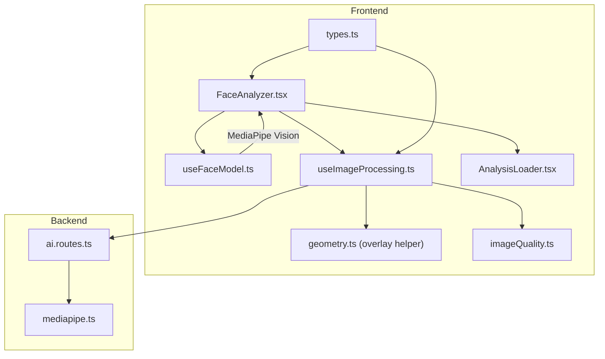
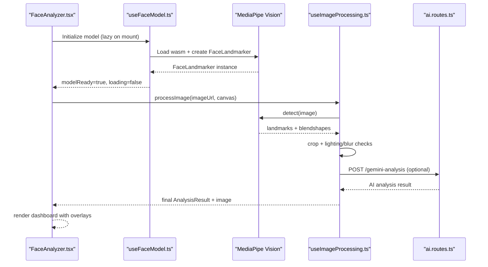
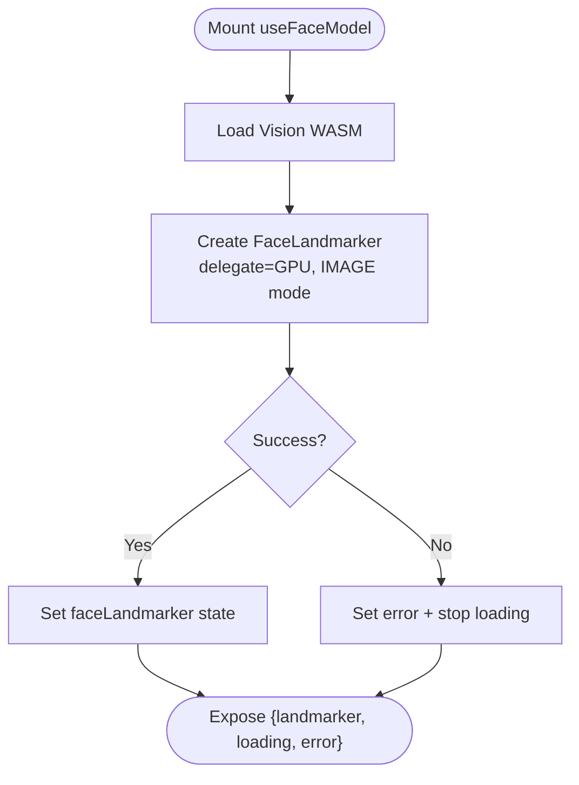
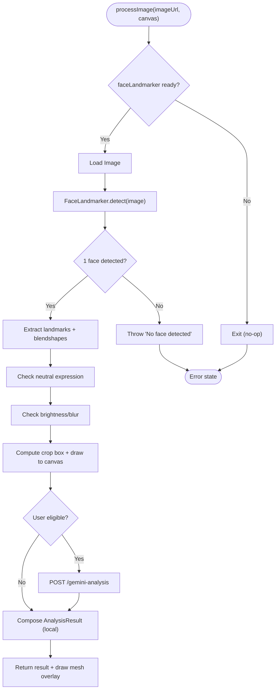
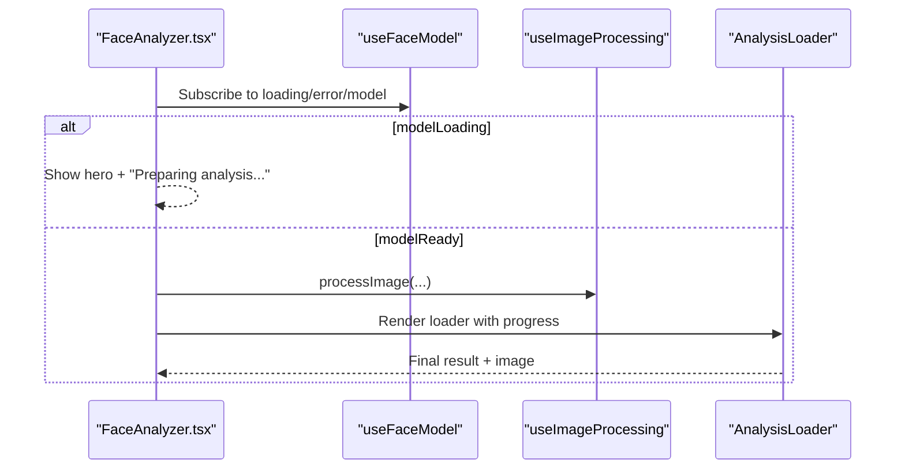
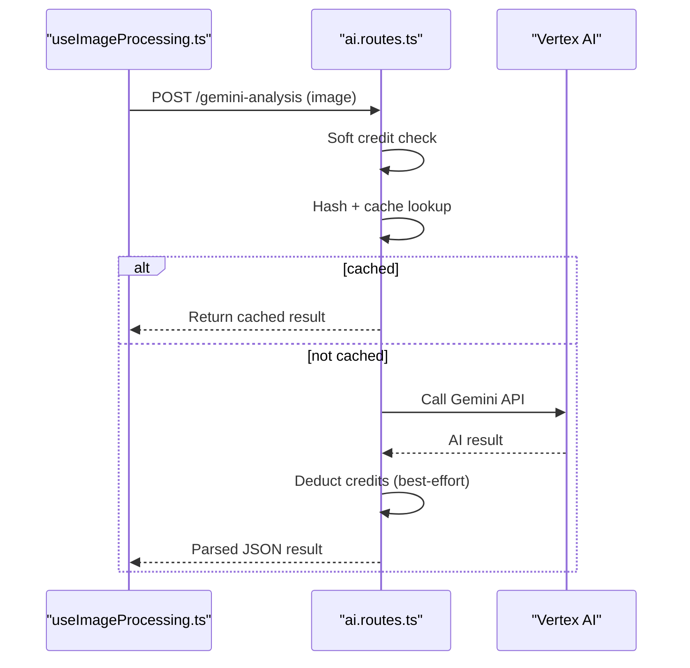
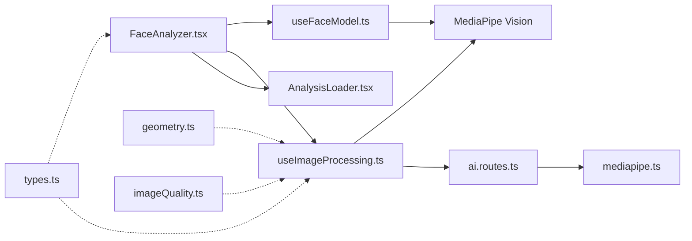

# Face Model Integration

<cite>
**Referenced Files in This Document**
- [useFaceModel.ts](file://src/components/FaceAnalyzer/hooks/useFaceModel.ts)
- [useImageProcessing.ts](file://src/components/FaceAnalyzer/hooks/useImageProcessing.ts)
- [FaceAnalyzer.tsx](file://src/components/FaceAnalyzer/FaceAnalyzer.tsx)
- [AnalysisLoader.tsx](file://src/components/FaceAnalyzer/AnalysisLoader.tsx)
- [geometry.ts](file://src/components/FaceAnalyzer/utils/geometry.ts)
- [imageQuality.ts](file://src/components/FaceAnalyzer/utils/imageQuality.ts)
- [types.ts](file://src/components/FaceAnalyzer/types.ts)
- [ai.routes.ts](file://backend/routes/ai.routes.ts)
- [mediapipe.ts](file://backend/types/mediapipe.ts)
</cite>

## Table of Contents
1. [Introduction](#introduction)
2. [Project Structure](#project-structure)
3. [Core Components](#core-components)
4. [Architecture Overview](#architecture-overview)
5. [Detailed Component Analysis](#detailed-component-analysis)
6. [Dependency Analysis](#dependency-analysis)
7. [Performance Considerations](#performance-considerations)
8. [Troubleshooting Guide](#troubleshooting-guide)
9. [Conclusion](#conclusion)

## Introduction
This document explains the face model integration system built on MediaPipe Tasks Vision. It covers initialization of the face landmarker, model loading strategies, hook-based lifecycle management, performance optimizations, and integration with backend AI analysis. It also documents error handling, fallbacks, and the relationship between model loading and component rendering to ensure a smooth user experience during cold starts and initialization.

## Project Structure
The face model integration spans frontend React components and hooks, backend AI endpoints, and shared types. The frontend initializes the MediaPipe model, processes images, and orchestrates the UI, while the backend performs advanced AI analysis and manages credits and rate limits.

**Diagram sources**
- [FaceAnalyzer.tsx:1-512](file://src/components/FaceAnalyzer/FaceAnalyzer.tsx#L1-L512)
- [useFaceModel.ts:1-36](file://src/components/FaceAnalyzer/hooks/useFaceModel.ts#L1-L36)
- [useImageProcessing.ts:1-234](file://src/components/FaceAnalyzer/hooks/useImageProcessing.ts#L1-L234)
- [AnalysisLoader.tsx:1-286](file://src/components/FaceAnalyzer/AnalysisLoader.tsx#L1-L286)
- [geometry.ts:1-15](file://src/components/FaceAnalyzer/utils/geometry.ts#L1-L15)
- [imageQuality.ts:1-73](file://src/components/FaceAnalyzer/utils/imageQuality.ts#L1-L73)
- [types.ts:1-74](file://src/components/FaceAnalyzer/types.ts#L1-L74)
- [ai.routes.ts:1-516](file://backend/routes/ai.routes.ts#L1-L516)
- [mediapipe.ts:1-45](file://backend/types/mediapipe.ts#L1-L45)

**Section sources**
- [FaceAnalyzer.tsx:1-512](file://src/components/FaceAnalyzer/FaceAnalyzer.tsx#L1-L512)
- [useFaceModel.ts:1-36](file://src/components/FaceAnalyzer/hooks/useFaceModel.ts#L1-L36)
- [useImageProcessing.ts:1-234](file://src/components/FaceAnalyzer/hooks/useImageProcessing.ts#L1-L234)
- [AnalysisLoader.tsx:1-286](file://src/components/FaceAnalyzer/AnalysisLoader.tsx#L1-L286)
- [geometry.ts:1-15](file://src/components/FaceAnalyzer/utils/geometry.ts#L1-L15)
- [imageQuality.ts:1-73](file://src/components/FaceAnalyzer/utils/imageQuality.ts#L1-L73)
- [types.ts:1-74](file://src/components/FaceAnalyzer/types.ts#L1-L74)
- [ai.routes.ts:1-516](file://backend/routes/ai.routes.ts#L1-L516)
- [mediapipe.ts:1-45](file://backend/types/mediapipe.ts#L1-L45)

## Core Components
- useFaceModel: Initializes the MediaPipe FaceLandmarker with GPU delegate, exposes loading state, error, and the initialized model instance.
- useImageProcessing: Orchestrates image loading, MediaPipe detection, cropping, lighting/blur checks, optional AI analysis, and rendering pipeline.
- FaceAnalyzer: Hosts the UI, coordinates model loading, image processing, progress visualization, and result delivery.
- AnalysisLoader: Provides a polished, animated progress UI during analysis.
- Backend AI routes: Performs premium AI analysis with retry, rate limiting, and credit management.

**Section sources**
- [useFaceModel.ts:1-36](file://src/components/FaceAnalyzer/hooks/useFaceModel.ts#L1-L36)
- [useImageProcessing.ts:1-234](file://src/components/FaceAnalyzer/hooks/useImageProcessing.ts#L1-L234)
- [FaceAnalyzer.tsx:1-512](file://src/components/FaceAnalyzer/FaceAnalyzer.tsx#L1-L512)
- [AnalysisLoader.tsx:1-286](file://src/components/FaceAnalyzer/AnalysisLoader.tsx#L1-L286)
- [ai.routes.ts:271-516](file://backend/routes/ai.routes.ts#L271-L516)

## Architecture Overview
The system follows a hook-based architecture:
- Initialization: useFaceModel loads the MediaPipe model once and stores it in state.
- Processing: useImageProcessing drives the full pipeline: image loading, MediaPipe detection, quality checks, cropping, optional AI analysis, and result composition.
- Rendering: FaceAnalyzer renders the hero/upload UI while the model is loading, then switches to AnalysisLoader during processing.
- Backend: ai.routes.ts handles premium AI analysis with robust retry, timeouts, and credit safety.

**Diagram sources**
- [useFaceModel.ts:9-33](file://src/components/FaceAnalyzer/hooks/useFaceModel.ts#L9-L33)
- [useImageProcessing.ts:26-222](file://src/components/FaceAnalyzer/hooks/useImageProcessing.ts#L26-L222)
- [FaceAnalyzer.tsx:104-119](file://src/components/FaceAnalyzer/FaceAnalyzer.tsx#L104-L119)
- [ai.routes.ts:271-516](file://backend/routes/ai.routes.ts#L271-L516)

## Detailed Component Analysis

### useFaceModel: MediaPipe Initialization and Lifecycle
- Loads the MediaPipe Vision WASM bundle and creates a FaceLandmarker with GPU delegate.
- Exposes loading state, error state, and the model instance.
- Uses a singleton-like lazy-loading pattern via a React effect that runs once on mount.

**Diagram sources**
- [useFaceModel.ts:9-33](file://src/components/FaceAnalyzer/hooks/useFaceModel.ts#L9-L33)

**Section sources**
- [useFaceModel.ts:1-36](file://src/components/FaceAnalyzer/hooks/useFaceModel.ts#L1-L36)

### useImageProcessing: Pipeline Orchestration
- Drives the full analysis pipeline: image loading, MediaPipe detection, quality checks, cropping, optional AI analysis, and result composition.
- Manages progress milestones and error propagation.
- Integrates with backend AI analysis endpoint for premium features.

**Diagram sources**
- [useImageProcessing.ts:26-222](file://src/components/FaceAnalyzer/hooks/useImageProcessing.ts#L26-L222)
- [imageQuality.ts:3-72](file://src/components/FaceAnalyzer/utils/imageQuality.ts#L3-L72)
- [geometry.ts:3-14](file://src/components/FaceAnalyzer/utils/geometry.ts#L3-L14)
- [ai.routes.ts:271-516](file://backend/routes/ai.routes.ts#L271-L516)

**Section sources**
- [useImageProcessing.ts:1-234](file://src/components/FaceAnalyzer/hooks/useImageProcessing.ts#L1-L234)
- [imageQuality.ts:1-73](file://src/components/FaceAnalyzer/utils/imageQuality.ts#L1-L73)
- [geometry.ts:1-15](file://src/components/FaceAnalyzer/utils/geometry.ts#L1-L15)

### FaceAnalyzer: Rendering and UX During Initialization
- Renders a hero/upload UI while the model is loading.
- Switches to AnalysisLoader during processing and displays progress milestones.
- Handles cleanup of object URLs and integrates with save status messaging.

**Diagram sources**
- [FaceAnalyzer.tsx:104-119](file://src/components/FaceAnalyzer/FaceAnalyzer.tsx#L104-L119)
- [AnalysisLoader.tsx:60-160](file://src/components/FaceAnalyzer/AnalysisLoader.tsx#L60-L160)
- [useFaceModel.ts:4-35](file://src/components/FaceAnalyzer/hooks/useFaceModel.ts#L4-L35)

**Section sources**
- [FaceAnalyzer.tsx:1-512](file://src/components/FaceAnalyzer/FaceAnalyzer.tsx#L1-L512)
- [AnalysisLoader.tsx:1-286](file://src/components/FaceAnalyzer/AnalysisLoader.tsx#L1-L286)

### Backend AI Integration: Premium Analysis
- Implements a credit-safe flow: verify credentials, optionally check cache, call Vertex AI, then deduct credits.
- Includes retry logic, timeouts, and robust parsing with detailed error surfacing.
- Enforces rate limits and daily caps to mitigate abuse.

**Diagram sources**
- [useImageProcessing.ts:145-155](file://src/components/FaceAnalyzer/hooks/useImageProcessing.ts#L145-L155)
- [ai.routes.ts:271-516](file://backend/routes/ai.routes.ts#L271-L516)

**Section sources**
- [ai.routes.ts:271-516](file://backend/routes/ai.routes.ts#L271-L516)

## Dependency Analysis
- Frontend hooks depend on MediaPipe Vision for inference and on backend endpoints for premium analysis.
- Backend depends on Vertex AI for model execution and on Firestore/Redis for rate limiting and credits.
- Shared types define the contract for landmarks and analysis results.

**Diagram sources**
- [useFaceModel.ts:1-36](file://src/components/FaceAnalyzer/hooks/useFaceModel.ts#L1-L36)
- [useImageProcessing.ts:1-234](file://src/components/FaceAnalyzer/hooks/useImageProcessing.ts#L1-L234)
- [FaceAnalyzer.tsx:1-512](file://src/components/FaceAnalyzer/FaceAnalyzer.tsx#L1-L512)
- [AnalysisLoader.tsx:1-286](file://src/components/FaceAnalyzer/AnalysisLoader.tsx#L1-L286)
- [geometry.ts:1-15](file://src/components/FaceAnalyzer/utils/geometry.ts#L1-L15)
- [imageQuality.ts:1-73](file://src/components/FaceAnalyzer/utils/imageQuality.ts#L1-L73)
- [types.ts:1-74](file://src/components/FaceAnalyzer/types.ts#L1-L74)
- [ai.routes.ts:1-516](file://backend/routes/ai.routes.ts#L1-L516)
- [mediapipe.ts:1-45](file://backend/types/mediapipe.ts#L1-L45)

**Section sources**
- [types.ts:1-74](file://src/components/FaceAnalyzer/types.ts#L1-L74)
- [mediapipe.ts:1-45](file://backend/types/mediapipe.ts#L1-L45)

## Performance Considerations
- Lazy loading: The model is loaded only when the component mounts, minimizing initial bundle overhead.
- GPU delegate: Configured for MediaPipe to accelerate inference in the browser.
- Progressive rendering: The UI shows a hero screen while the model loads, then transitions to a detailed loader with smooth progress animation.
- Image scaling: Downscaling for lighting/blur checks and for AI payloads reduces compute and bandwidth.
- Retry and timeout: Backend premium analysis uses retry with exponential backoff and generous timeouts to handle long-running tasks.
- Rate limiting and daily caps: Prevents abuse and ensures fair resource allocation.

[No sources needed since this section provides general guidance]

## Troubleshooting Guide
Common issues and remedies:
- Model fails to load
  - Symptoms: Persistent "Preparing analysis..." with an error banner.
  - Causes: Network issues, CDN unavailability, or unsupported device.
  - Actions: Refresh the page; ensure GPU delegate compatibility; verify CORS and ad blockers.
- No face detected or multiple faces
  - Symptoms: Immediate error after upload.
  - Causes: Poor image quality, non-frontal pose, or multiple people.
  - Actions: Follow on-screen tips; ensure a single front-facing face fills the frame.
- Neutral expression required
  - Symptoms: Error prompting to smile less.
  - Causes: Blendshape analysis detects smiling.
  - Actions: Keep face neutral during capture.
- Lighting or blur errors
  - Symptoms: Errors indicating too dark/bright or blurry.
  - Actions: Improve ambient lighting and reduce motion.
- Premium analysis failures
  - Symptoms: 5xx or parsing errors from backend.
  - Causes: Vertex AI quota, malformed response, or network issues.
  - Actions: Retry; check API key configuration; review backend logs.

**Section sources**
- [useFaceModel.ts:26-30](file://src/components/FaceAnalyzer/hooks/useFaceModel.ts#L26-L30)
- [useImageProcessing.ts:60-84](file://src/components/FaceAnalyzer/hooks/useImageProcessing.ts#L60-L84)
- [imageQuality.ts:33-72](file://src/components/FaceAnalyzer/utils/imageQuality.ts#L33-L72)
- [ai.routes.ts:125-157](file://backend/routes/ai.routes.ts#L125-L157)

## Conclusion
The face model integration leverages MediaPipe Tasks Vision for efficient, GPU-accelerated landmark detection, with a robust frontend hook-based architecture that ensures a smooth user experience. The backend provides scalable, credit-safe AI analysis with retries and timeouts. Together, these components deliver accurate, responsive facial analysis while maintaining reliability under varied conditions.