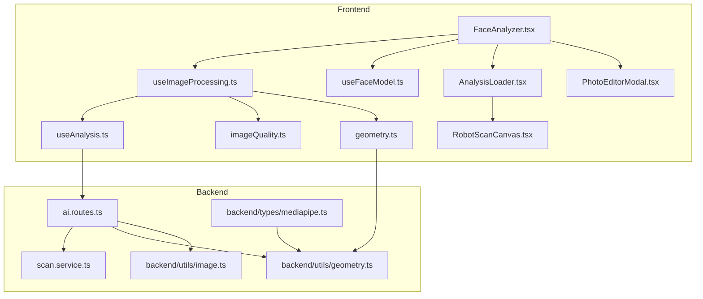
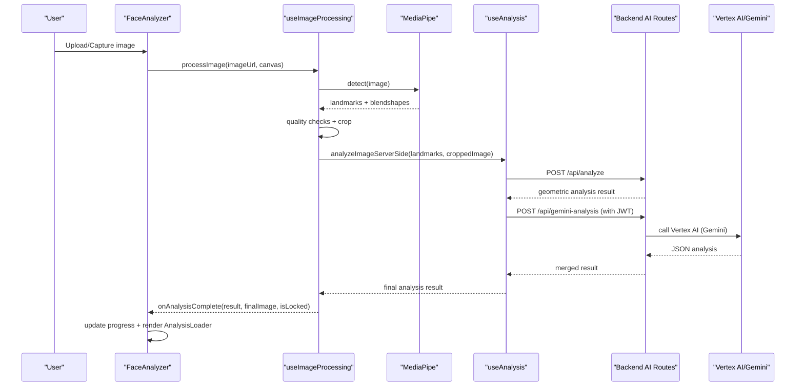
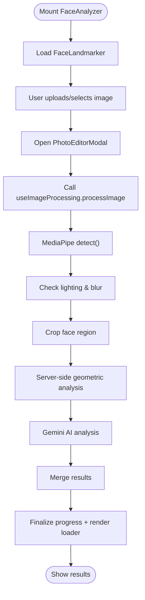
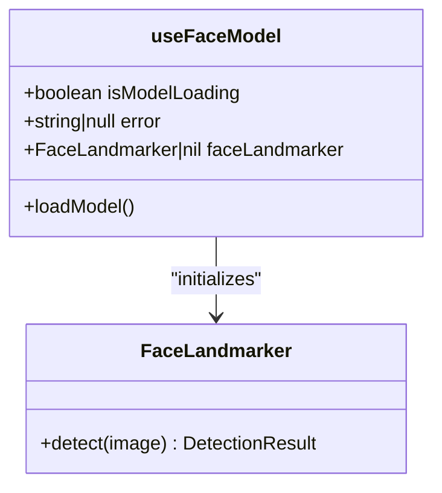
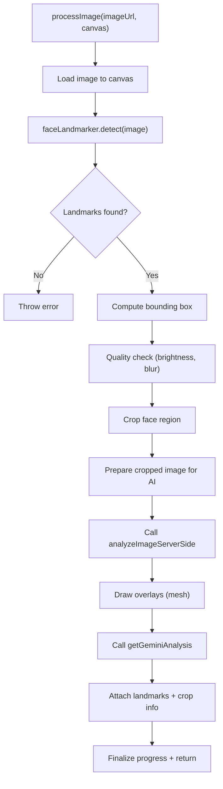
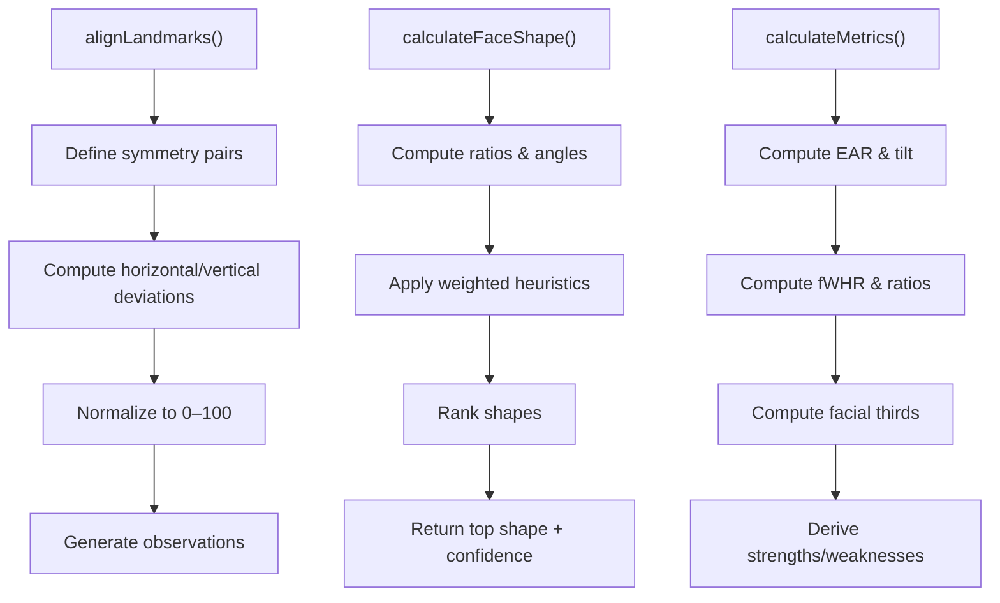
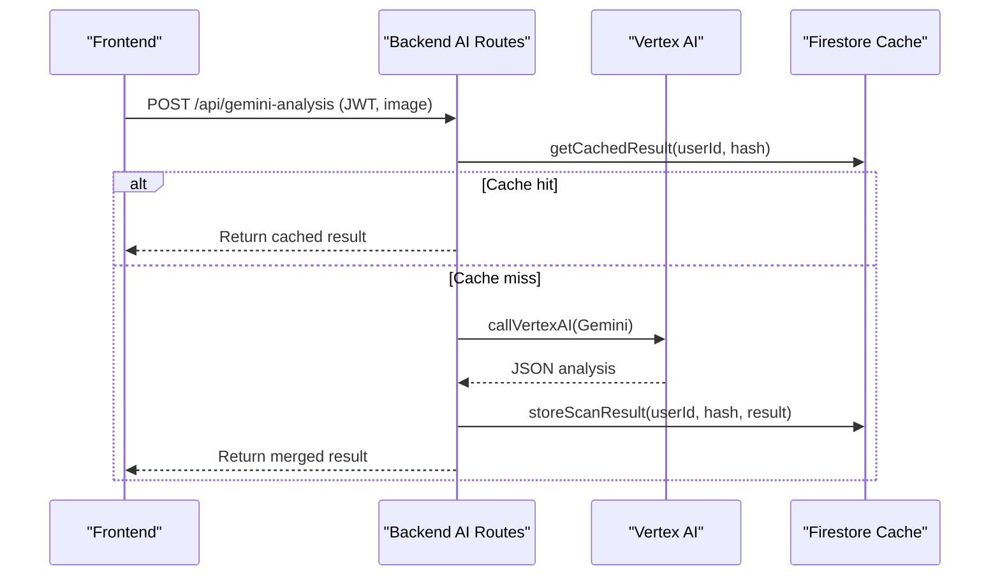
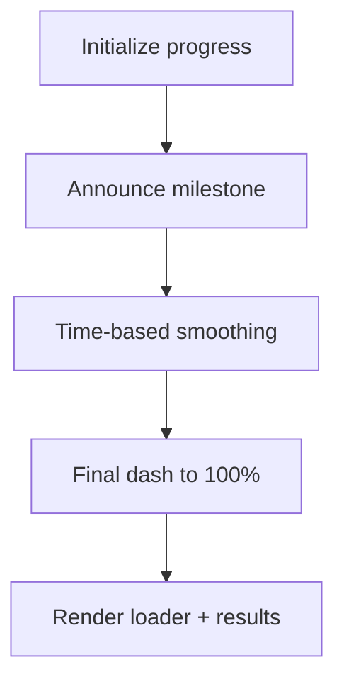
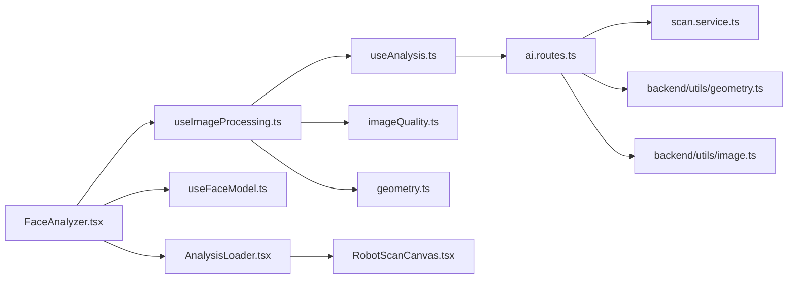

# Facial Analysis Engine

<cite>
**Referenced Files in This Document**
- [FaceAnalyzer.tsx](file://src/components/FaceAnalyzer/FaceAnalyzer.tsx)
- [useImageProcessing.ts](file://src/components/FaceAnalyzer/hooks/useImageProcessing.ts)
- [useFaceModel.ts](file://src/components/FaceAnalyzer/hooks/useFaceModel.ts)
- [useAnalysis.ts](file://src/components/FaceAnalyzer/hooks/useAnalysis.ts)
- [types.ts](file://src/components/FaceAnalyzer/types.ts)
- [geometry.ts](file://src/components/FaceAnalyzer/utils/geometry.ts)
- [imageQuality.ts](file://src/components/FaceAnalyzer/utils/imageQuality.ts)
- [AnalysisLoader.tsx](file://src/components/FaceAnalyzer/AnalysisLoader.tsx)
- [PhotoEditorModal.tsx](file://src/components/FaceAnalyzer/PhotoEditorModal.tsx)
- [RobotScanCanvas.tsx](file://src/components/FaceAnalyzer/canvas/RobotScanCanvas.tsx)
- [ai.routes.ts](file://backend/routes/ai.routes.ts)
- [scan.service.ts](file://backend/services/scan.service.ts)
- [geometry.ts](file://backend/utils/geometry.ts)
- [image.ts](file://backend/utils/image.ts)
- [mediapipe.ts](file://backend/types/mediapipe.ts)
- [analysis.ts](file://src/types/analysis.ts)
</cite>

## Table of Contents
1. [Introduction](#introduction)
2. [Project Structure](#project-structure)
3. [Core Components](#core-components)
4. [Architecture Overview](#architecture-overview)
5. [Detailed Component Analysis](#detailed-component-analysis)
6. [Dependency Analysis](#dependency-analysis)
7. [Performance Considerations](#performance-considerations)
8. [Troubleshooting Guide](#troubleshooting-guide)
9. [Conclusion](#conclusion)

## Introduction
This document describes the facial analysis engine that powers AI-driven face analysis from image upload to MediaPipe landmark detection and Google Generative AI (Gemini) analysis. It explains the FaceAnalyzer component architecture, the MediaPipe integration for facial landmark detection, the Google Generative AI pipeline for aesthetic analysis, the image processing pipeline including quality assessment and optimization, geometric analysis algorithms for symmetry scoring and facial feature measurement, progress tracking mechanisms, user feedback systems, performance optimization strategies, and error handling patterns.

## Project Structure
The facial analysis engine spans both frontend and backend components:
- Frontend: React components orchestrate the user experience, image editing, progress tracking, and visualization.
- Backend: Express routes implement secure AI analysis, rate limiting, fraud checks, and result caching.

**Diagram sources**
- [FaceAnalyzer.tsx:1-512](file://src/components/FaceAnalyzer/FaceAnalyzer.tsx#L1-L512)
- [useImageProcessing.ts:1-234](file://src/components/FaceAnalyzer/hooks/useImageProcessing.ts#L1-L234)
- [useFaceModel.ts:1-37](file://src/components/FaceAnalyzer/hooks/useFaceModel.ts#L1-L37)
- [useAnalysis.ts:1-207](file://src/components/FaceAnalyzer/hooks/useAnalysis.ts#L1-L207)
- [AnalysisLoader.tsx:1-286](file://src/components/FaceAnalyzer/AnalysisLoader.tsx#L1-L286)
- [PhotoEditorModal.tsx:1-571](file://src/components/FaceAnalyzer/PhotoEditorModal.tsx#L1-L571)
- [RobotScanCanvas.tsx:1-800](file://src/components/FaceAnalyzer/canvas/RobotScanCanvas.tsx#L1-L800)
- [ai.routes.ts:1-1146](file://backend/routes/ai.routes.ts#L1-L1146)
- [scan.service.ts:1-134](file://backend/services/scan.service.ts#L1-L134)
- [geometry.ts:1-453](file://backend/utils/geometry.ts#L1-L453)
- [image.ts:1-42](file://backend/utils/image.ts#L1-L42)
- [mediapipe.ts:1-45](file://backend/types/mediapipe.ts#L1-L45)

**Section sources**
- [FaceAnalyzer.tsx:1-512](file://src/components/FaceAnalyzer/FaceAnalyzer.tsx#L1-L512)
- [ai.routes.ts:1-1146](file://backend/routes/ai.routes.ts#L1-L1146)

## Core Components
- FaceAnalyzer: Orchestrates upload, editing, processing, and progress visualization. Manages model loading, progress smoothing, and error states.
- useImageProcessing: Implements the image processing pipeline, including MediaPipe detection, quality checks, cropping, canvas drawing, and AI analysis handoff.
- useFaceModel: Loads the MediaPipe FaceLandmarker with GPU acceleration and exposes loading/error states.
- useAnalysis: Handles server-side analysis and Gemini AI calls, including retries, timeouts, and result merging.
- AnalysisLoader: Renders the animated scanning experience with progress bars and milestone indicators.
- PhotoEditorModal: Provides in-browser cropping and orientation adjustments prior to analysis.
- RobotScanCanvas: Renders the cinematic scanning visualization synchronized with progress and landmarks.
- Backend AI Routes: Secure endpoints for Gemini analysis with rate limiting, fraud checks, caching, and credit-safe flow.
- Geometry Utilities: Compute symmetry, face shape, and facial metrics from landmarks.

**Section sources**
- [FaceAnalyzer.tsx:1-512](file://src/components/FaceAnalyzer/FaceAnalyzer.tsx#L1-L512)
- [useImageProcessing.ts:1-234](file://src/components/FaceAnalyzer/hooks/useImageProcessing.ts#L1-L234)
- [useFaceModel.ts:1-37](file://src/components/FaceAnalyzer/hooks/useFaceModel.ts#L1-L37)
- [useAnalysis.ts:1-207](file://src/components/FaceAnalyzer/hooks/useAnalysis.ts#L1-L207)
- [AnalysisLoader.tsx:1-286](file://src/components/FaceAnalyzer/AnalysisLoader.tsx#L1-L286)
- [PhotoEditorModal.tsx:1-571](file://src/components/FaceAnalyzer/PhotoEditorModal.tsx#L1-L571)
- [RobotScanCanvas.tsx:1-800](file://src/components/FaceAnalyzer/canvas/RobotScanCanvas.tsx#L1-L800)
- [ai.routes.ts:1-1146](file://backend/routes/ai.routes.ts#L1-L1146)
- [geometry.ts:1-453](file://backend/utils/geometry.ts#L1-L453)

## Architecture Overview
The system follows a client-initiated workflow:
1. User uploads or captures an image.
2. Frontend opens an editor modal for cropping and orientation adjustments.
3. The image is processed: MediaPipe detects facial landmarks, quality is assessed, and a cropped region is prepared.
4. A server-side analysis merges geometric insights with Gemini AI aesthetic analysis.
5. Results are visualized with a progress bar and animated scanning experience.

**Diagram sources**
- [FaceAnalyzer.tsx:1-512](file://src/components/FaceAnalyzer/FaceAnalyzer.tsx#L1-L512)
- [useImageProcessing.ts:1-234](file://src/components/FaceAnalyzer/hooks/useImageProcessing.ts#L1-L234)
- [useAnalysis.ts:1-207](file://src/components/FaceAnalyzer/hooks/useAnalysis.ts#L1-L207)
- [ai.routes.ts:271-516](file://backend/routes/ai.routes.ts#L271-L516)

## Detailed Component Analysis

### FaceAnalyzer Component
- Responsibilities:
  - Manage model loading state and errors.
  - Handle image upload and camera capture.
  - Drive progress updates and smooth animations.
  - Render the hero UI and AnalysisLoader during processing.
  - Save results to history when authenticated.
- Key behaviors:
  - Uses requestAnimationFrame to smoothly animate progress toward milestones.
  - Waits for a final dash to completion to ensure the UI reflects 100% even during long AI waits.
  - Tracks scan history for terminal-style display.
  - Revokes object URLs to prevent memory leaks.

**Diagram sources**
- [FaceAnalyzer.tsx:1-512](file://src/components/FaceAnalyzer/FaceAnalyzer.tsx#L1-L512)
- [useImageProcessing.ts:1-234](file://src/components/FaceAnalyzer/hooks/useImageProcessing.ts#L1-L234)

**Section sources**
- [FaceAnalyzer.tsx:1-512](file://src/components/FaceAnalyzer/FaceAnalyzer.tsx#L1-L512)

### MediaPipe Integration (useFaceModel)
- Loads the FaceLandmarker with GPU delegation and IMAGE mode.
- Exposes loading state, error state, and the initialized model.
- Uses CDN-hosted WASM assets for portability.

**Diagram sources**
- [useFaceModel.ts:1-37](file://src/components/FaceAnalyzer/hooks/useFaceModel.ts#L1-L37)

**Section sources**
- [useFaceModel.ts:1-37](file://src/components/FaceAnalyzer/hooks/useFaceModel.ts#L1-L37)

### Image Processing Pipeline (useImageProcessing)
- Responsibilities:
  - Load image, draw to canvas, and detect landmarks.
  - Validate expression neutrality and face presence.
  - Compute bounding box, crop, and quality checks.
  - Prepare images optimized for AI analysis.
  - Draw overlays and finalize results.
- Quality checks:
  - Brightness thresholds and Laplacian variance for blur detection.
- Optimization:
  - Resize to maximum 768px for AI input.
  - Use canvas for cropping and thumbnail generation.

**Diagram sources**
- [useImageProcessing.ts:1-234](file://src/components/FaceAnalyzer/hooks/useImageProcessing.ts#L1-L234)
- [imageQuality.ts:1-73](file://src/components/FaceAnalyzer/utils/imageQuality.ts#L1-L73)
- [geometry.ts:1-15](file://src/components/FaceAnalyzer/utils/geometry.ts#L1-L15)

**Section sources**
- [useImageProcessing.ts:1-234](file://src/components/FaceAnalyzer/hooks/useImageProcessing.ts#L1-L234)
- [imageQuality.ts:1-73](file://src/components/FaceAnalyzer/utils/imageQuality.ts#L1-L73)
- [geometry.ts:1-15](file://src/components/FaceAnalyzer/utils/geometry.ts#L1-L15)

### Geometric Analysis Algorithms
- Symmetry scoring:
  - Compares horizontal and vertical distances from midline for key pairs (eyes, eyebrows, cheekbones, jawline, mouth).
  - Produces a normalized score and observations.
- Face shape classification:
  - Computes ratios (height/cheek, jaw/cheek, forehead/cheek) and angles (chin, brow).
  - Scores candidate shapes against weighted heuristics and returns top shape with confidence.
- Facial metrics:
  - Calculates EAR, canthal tilt, fWHR, jaw ratios, facial thirds, eye spacing, nose width, mouth width, and chin projection.
  - Derives strengths/weaknesses based on ideal ranges.

**Diagram sources**
- [geometry.ts:1-453](file://backend/utils/geometry.ts#L1-L453)
- [mediapipe.ts:1-45](file://backend/types/mediapipe.ts#L1-L45)

**Section sources**
- [geometry.ts:1-453](file://backend/utils/geometry.ts#L1-L453)
- [mediapipe.ts:1-45](file://backend/types/mediapipe.ts#L1-L45)

### Google Generative AI Pipeline (Backend)
- Endpoint: POST /api/gemini-analysis
- Security and reliability:
  - Requires authentication, enforces rate limits and daily caps, performs fraud checks.
  - Uses Vertex AI with automatic endpoint selection (Developer API or OAuth/Vertex regional).
  - Implements retry with exponential backoff and respects 429 retry delays.
  - Credit-safe ordering: checks credits, caches results, then deducts credits post-success.
- Request/Response:
  - Accepts a base64 image and returns structured JSON with skin quality, aesthetics, face shape, color season, improvements, products, and more.
  - Robust parsing with markdown fence stripping and outer JSON extraction.

**Diagram sources**
- [ai.routes.ts:271-516](file://backend/routes/ai.routes.ts#L271-L516)
- [scan.service.ts:1-134](file://backend/services/scan.service.ts#L1-L134)

**Section sources**
- [ai.routes.ts:1-1146](file://backend/routes/ai.routes.ts#L1-L1146)
- [scan.service.ts:1-134](file://backend/services/scan.service.ts#L1-L134)

### Progress Tracking and User Feedback
- Frontend progress:
  - Milestone-based progress with time-based smoothing and a final dash to completion.
  - Animated loader with shimmer bar, milestone markers, and live step labels.
- Backend progress:
  - Frontend milestones mapped to server-side steps (detection, structure, metrics, AI scan, report).
- User feedback:
  - Real-time error messages, save status notifications, and privacy guarantees.

**Diagram sources**
- [FaceAnalyzer.tsx:135-223](file://src/components/FaceAnalyzer/FaceAnalyzer.tsx#L135-L223)
- [AnalysisLoader.tsx:1-286](file://src/components/FaceAnalyzer/AnalysisLoader.tsx#L1-L286)

**Section sources**
- [FaceAnalyzer.tsx:135-223](file://src/components/FaceAnalyzer/FaceAnalyzer.tsx#L135-L223)
- [AnalysisLoader.tsx:1-286](file://src/components/FaceAnalyzer/AnalysisLoader.tsx#L1-L286)

### Image Processing Optimizations and Memory Management
- Frontend:
  - Canvas-based cropping and resizing to reduce memory footprint.
  - Thumbnail generation for history storage.
  - URL.revokeObjectURL to release memory after use.
- Backend:
  - Sharp-based compression to 768px and JPEG 80% quality.
  - Caching by image hash to avoid redundant AI calls.

**Section sources**
- [useImageProcessing.ts:1-234](file://src/components/FaceAnalyzer/hooks/useImageProcessing.ts#L1-L234)
- [image.ts:1-42](file://backend/utils/image.ts#L1-L42)
- [scan.service.ts:1-134](file://backend/services/scan.service.ts#L1-L134)

## Dependency Analysis
- Frontend dependencies:
  - FaceAnalyzer depends on useFaceModel, useImageProcessing, and AnalysisLoader.
  - useImageProcessing depends on useAnalysis, imageQuality, and geometry utilities.
  - AnalysisLoader composes RobotScanCanvas for visualization.
- Backend dependencies:
  - AI routes depend on scan service, geometry utilities, and image compression.
  - Fraud middleware and rate limiters protect resources.

**Diagram sources**
- [FaceAnalyzer.tsx:1-512](file://src/components/FaceAnalyzer/FaceAnalyzer.tsx#L1-L512)
- [useImageProcessing.ts:1-234](file://src/components/FaceAnalyzer/hooks/useImageProcessing.ts#L1-L234)
- [useAnalysis.ts:1-207](file://src/components/FaceAnalyzer/hooks/useAnalysis.ts#L1-L207)
- [AnalysisLoader.tsx:1-286](file://src/components/FaceAnalyzer/AnalysisLoader.tsx#L1-L286)
- [RobotScanCanvas.tsx:1-800](file://src/components/FaceAnalyzer/canvas/RobotScanCanvas.tsx#L1-L800)
- [ai.routes.ts:1-1146](file://backend/routes/ai.routes.ts#L1-L1146)
- [scan.service.ts:1-134](file://backend/services/scan.service.ts#L1-L134)
- [geometry.ts:1-453](file://backend/utils/geometry.ts#L1-L453)
- [image.ts:1-42](file://backend/utils/image.ts#L1-L42)

**Section sources**
- [FaceAnalyzer.tsx:1-512](file://src/components/FaceAnalyzer/FaceAnalyzer.tsx#L1-L512)
- [ai.routes.ts:1-1146](file://backend/routes/ai.routes.ts#L1-L1146)

## Performance Considerations
- Model loading:
  - GPU delegation for FaceLandmarker improves inference speed.
- Rendering:
  - requestAnimationFrame-based progress smoothing ensures consistent updates across devices.
  - RobotScanCanvas uses device tier detection to adapt motion complexity.
- Network:
  - Backend uses retry with exponential backoff and respects 429 retry delays.
  - 70s timeout accommodates long-running Gemini Vision prompts.
- Image optimization:
  - Frontend crops and resizes efficiently; backend compresses images to 768px JPEG 80%.
- Caching:
  - Hash-based caching avoids repeated AI calls for identical images.

[No sources needed since this section provides general guidance]

## Troubleshooting Guide
- Model loading failures:
  - Check CDN availability and GPU delegate compatibility.
- No face detected or multiple faces:
  - Ensure a single front-facing face is visible; adjust lighting and distance.
- Blurry or overexposed images:
  - Improve lighting conditions; avoid backlighting and overexposure.
- AI analysis errors:
  - Inspect backend logs for Vertex AI status codes and retry delays.
  - Verify API key configuration and endpoint selection.
- Progress stalls:
  - Confirm the final dash mechanism is engaged; long AI waits are expected.

**Section sources**
- [useFaceModel.ts:1-37](file://src/components/FaceAnalyzer/hooks/useFaceModel.ts#L1-L37)
- [useImageProcessing.ts:1-234](file://src/components/FaceAnalyzer/hooks/useImageProcessing.ts#L1-L234)
- [ai.routes.ts:1-1146](file://backend/routes/ai.routes.ts#L1-L1146)

## Conclusion
The facial analysis engine integrates MediaPipe for robust landmark detection, a secure and resilient backend AI pipeline powered by Google Generative AI, and a polished frontend experience with progress tracking and animated visualization. The system emphasizes quality assessment, geometric analysis, and user feedback while maintaining performance and reliability through optimization and caching strategies.