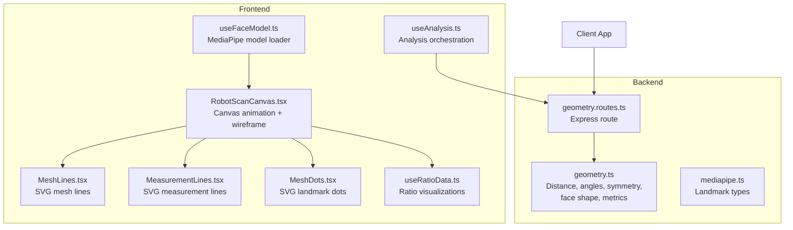
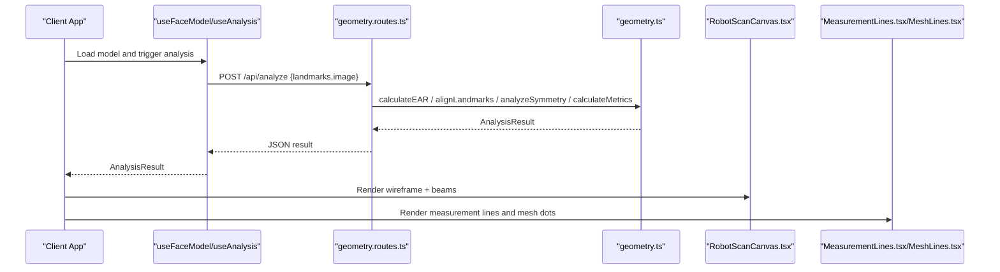
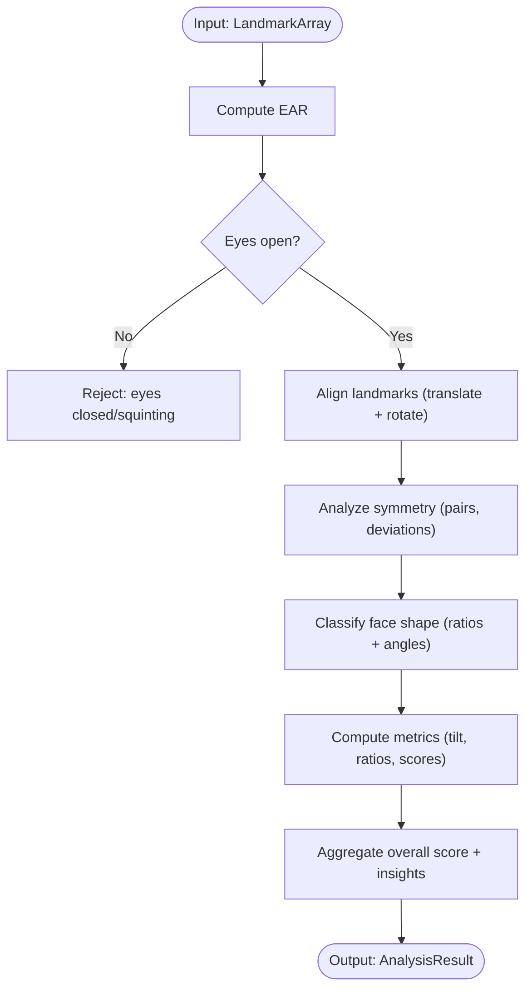
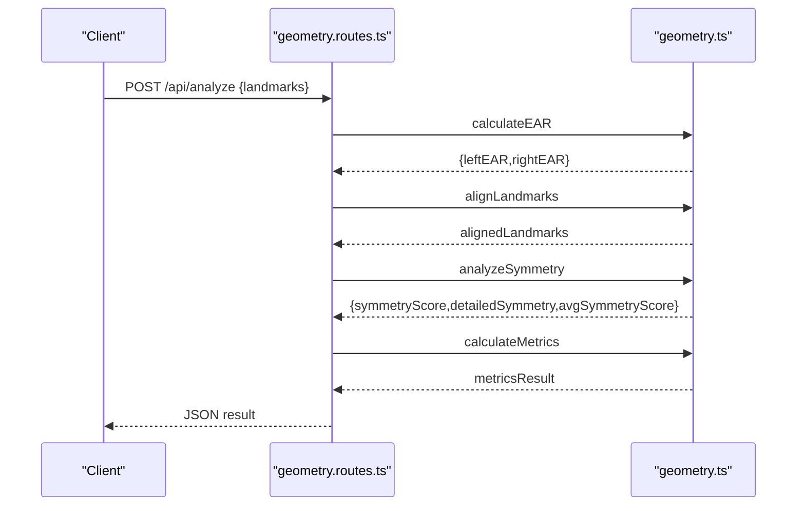
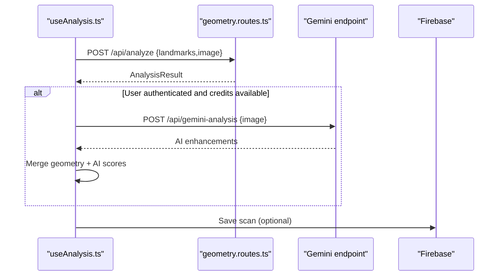
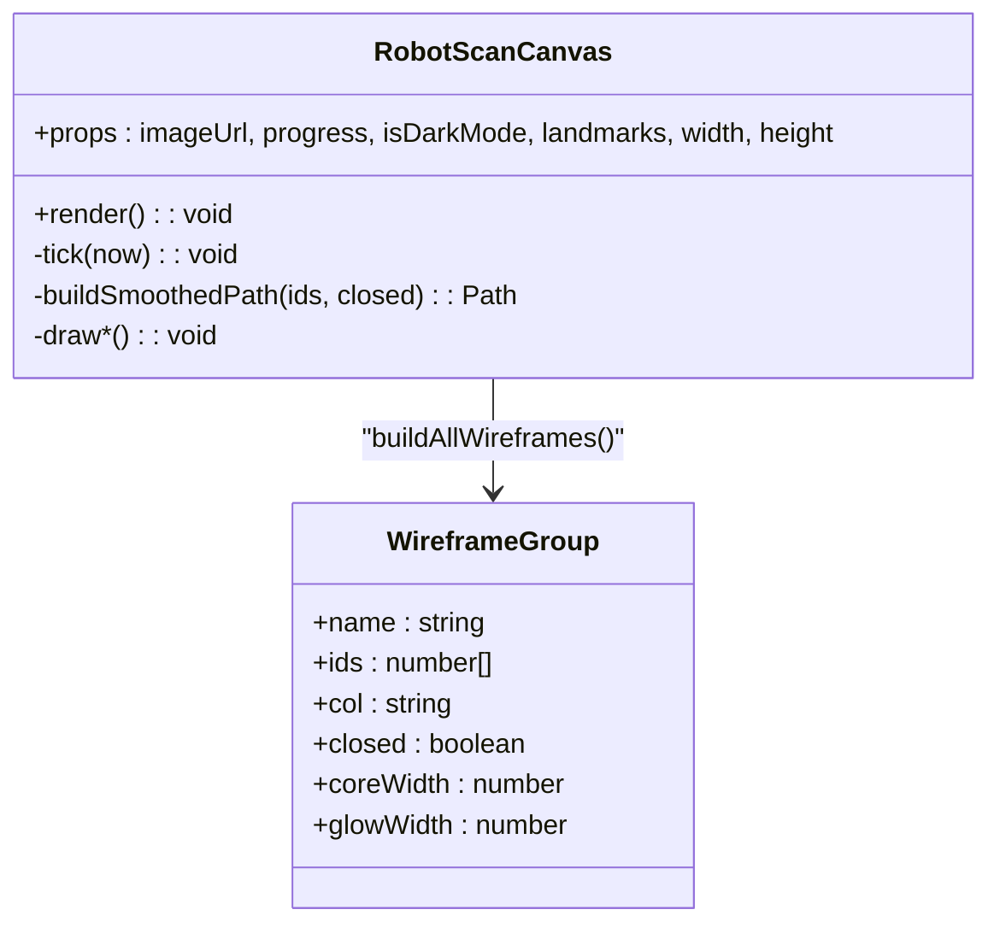
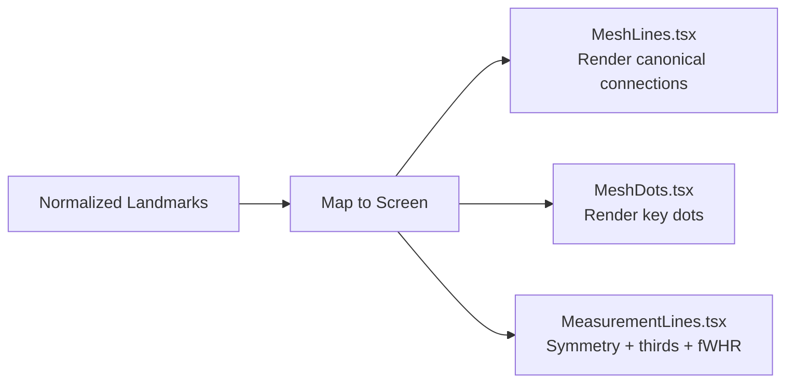
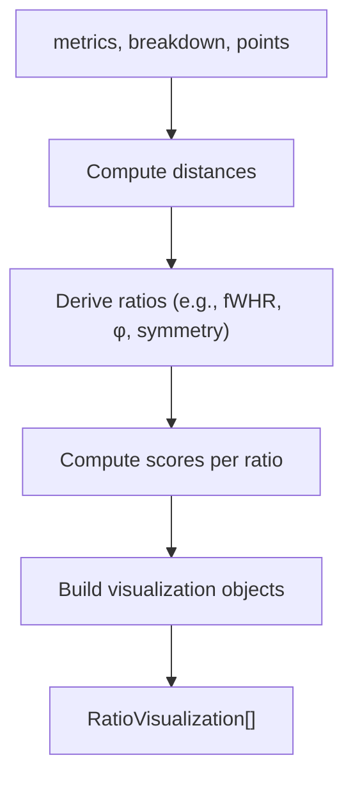
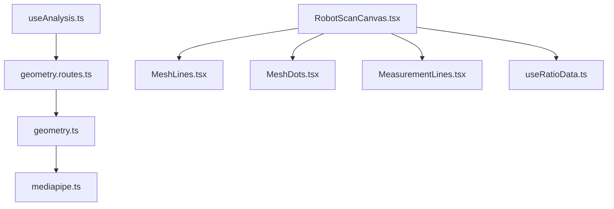

# Geometric Analysis System

<cite>
**Referenced Files in This Document**
- [geometry.ts](file://backend/utils/geometry.ts)
- [geometry.routes.ts](file://backend/routes/geometry.routes.ts)
- [geometry.test.ts](file://backend/utils/geometry.test.ts)
- [mediapipe.ts](file://backend/types/mediapipe.ts)
- [types.ts](file://src/components/FaceAnalyzer/types.ts)
- [useAnalysis.ts](file://src/components/FaceAnalyzer/hooks/useAnalysis.ts)
- [useFaceModel.ts](file://src/components/FaceAnalyzer/hooks/useFaceModel.ts)
- [RobotScanCanvas.tsx](file://src/components/FaceAnalyzer/canvas/RobotScanCanvas.tsx)
- [MeasurementLines.tsx](file://src/components/AnimatedFaceMesh/MeasurementLines.tsx)
- [MeshLines.tsx](file://src/components/AnimatedFaceMesh/MeshLines.tsx)
- [MeshDots.tsx](file://src/components/AnimatedFaceMesh/MeshDots.tsx)
- [useRatioData.ts](file://src/components/facial-ratio/useRatioData.ts)
</cite>

## Table of Contents
1. [Introduction](#introduction)
2. [Project Structure](#project-structure)
3. [Core Components](#core-components)
4. [Architecture Overview](#architecture-overview)
5. [Detailed Component Analysis](#detailed-component-analysis)
6. [Dependency Analysis](#dependency-analysis)
7. [Performance Considerations](#performance-considerations)
8. [Troubleshooting Guide](#troubleshooting-guide)
9. [Conclusion](#conclusion)

## Introduction
This document describes the geometric analysis system that performs facial measurements and symmetry calculations. It covers the geometric algorithms used for facial landmark analysis (distance calculations, angle measurements, symmetry scoring), coordinate system transformations and 3D-to-2D projection techniques, the measurement line rendering system with animated visual feedback, facial mesh visualization components (line drawing, dot placement, real-time updates), the mathematical foundations of facial analysis (anthropometric measurements and aesthetic scoring), and the integration between geometric calculations and the visual feedback system. It also includes performance considerations for real-time geometric computations and strategies for optimizing complex calculations, as well as edge cases in landmark detection and their impact on accuracy.

## Project Structure
The system is split between frontend React components and backend Node.js services:
- Backend:
  - Geometry utilities implementing distance, angle, symmetry, face shape classification, and metric computation
  - Express route handling geometric analysis requests
  - Type definitions for landmarks and analysis results
- Frontend:
  - React hooks for model loading and analysis orchestration
  - Canvas-based animated robot loader with wireframe mesh visualization
  - SVG-based measurement line and mesh visualization components
  - Ratio visualization builder that generates anthropometric measurements

**Diagram sources**
- [geometry.ts:1-453](file://backend/utils/geometry.ts#L1-L453)
- [geometry.routes.ts:1-77](file://backend/routes/geometry.routes.ts#L1-L77)
- [mediapipe.ts:1-45](file://backend/types/mediapipe.ts#L1-L45)
- [useFaceModel.ts:1-37](file://src/components/FaceAnalyzer/hooks/useFaceModel.ts#L1-L37)
- [useAnalysis.ts:1-207](file://src/components/FaceAnalyzer/hooks/useAnalysis.ts#L1-L207)
- [RobotScanCanvas.tsx:1-1738](file://src/components/FaceAnalyzer/canvas/RobotScanCanvas.tsx#L1-L1738)
- [MeshLines.tsx:1-192](file://src/components/AnimatedFaceMesh/MeshLines.tsx#L1-L192)
- [MeasurementLines.tsx:1-154](file://src/components/AnimatedFaceMesh/MeasurementLines.tsx#L1-L154)
- [MeshDots.tsx:1-60](file://src/components/AnimatedFaceMesh/MeshDots.tsx#L1-L60)
- [useRatioData.ts:1-649](file://src/components/facial-ratio/useRatioData.ts#L1-L649)

**Section sources**
- [geometry.ts:1-453](file://backend/utils/geometry.ts#L1-L453)
- [geometry.routes.ts:1-77](file://backend/routes/geometry.routes.ts#L1-L77)
- [mediapipe.ts:1-45](file://backend/types/mediapipe.ts#L1-L45)
- [useFaceModel.ts:1-37](file://src/components/FaceAnalyzer/hooks/useFaceModel.ts#L1-L37)
- [useAnalysis.ts:1-207](file://src/components/FaceAnalyzer/hooks/useAnalysis.ts#L1-L207)
- [RobotScanCanvas.tsx:1-1738](file://src/components/FaceAnalyzer/canvas/RobotScanCanvas.tsx#L1-L1738)
- [MeshLines.tsx:1-192](file://src/components/AnimatedFaceMesh/MeshLines.tsx#L1-L192)
- [MeasurementLines.tsx:1-154](file://src/components/AnimatedFaceMesh/MeasurementLines.tsx#L1-L154)
- [MeshDots.tsx:1-60](file://src/components/AnimatedFaceMesh/MeshDots.tsx#L1-L60)
- [useRatioData.ts:1-649](file://src/components/facial-ratio/useRatioData.ts#L1-L649)

## Core Components
- Backend geometry utilities:
  - Distance and angle helpers
  - Eye Aspect Ratio (EAR) calculation
  - Landmark alignment (translation and rotation)
  - Symmetry analysis across facial features
  - Face shape classification using ratios and angles
  - Comprehensive metrics and aesthetic scoring
- Backend route:
  - Validates input, checks photo quality, runs alignment and analysis, returns structured results
- Frontend hooks:
  - MediaPipe model loading and caching
  - Analysis orchestration, including optional AI enhancement
- Visualization:
  - Canvas robot loader with wireframe mesh, beams, and animated effects
  - SVG-based measurement lines and mesh dots
  - Ratio visualization builder generating anthropometric measurements

**Section sources**
- [geometry.ts:1-453](file://backend/utils/geometry.ts#L1-L453)
- [geometry.routes.ts:1-77](file://backend/routes/geometry.routes.ts#L1-L77)
- [useFaceModel.ts:1-37](file://src/components/FaceAnalyzer/hooks/useFaceModel.ts#L1-L37)
- [useAnalysis.ts:1-207](file://src/components/FaceAnalyzer/hooks/useAnalysis.ts#L1-L207)
- [RobotScanCanvas.tsx:1-1738](file://src/components/FaceAnalyzer/canvas/RobotScanCanvas.tsx#L1-L1738)
- [MeasurementLines.tsx:1-154](file://src/components/AnimatedFaceMesh/MeasurementLines.tsx#L1-L154)
- [MeshLines.tsx:1-192](file://src/components/AnimatedFaceMesh/MeshLines.tsx#L1-L192)
- [MeshDots.tsx:1-60](file://src/components/AnimatedFaceMesh/MeshDots.tsx#L1-L60)
- [useRatioData.ts:1-649](file://src/components/facial-ratio/useRatioData.ts#L1-L649)

## Architecture Overview
The system integrates MediaPipe-based landmark extraction with backend geometric analysis and rich frontend visualization. The flow:
- Frontend loads the MediaPipe model and captures landmarks
- Frontend sends landmarks to backend for geometric analysis
- Backend validates input, aligns landmarks, computes symmetry and metrics, and returns results
- Frontend composes visual feedback: canvas robot animation, SVG mesh overlays, and ratio visualizations

**Diagram sources**
- [useFaceModel.ts:1-37](file://src/components/FaceAnalyzer/hooks/useFaceModel.ts#L1-L37)
- [useAnalysis.ts:1-207](file://src/components/FaceAnalyzer/hooks/useAnalysis.ts#L1-L207)
- [geometry.routes.ts:1-77](file://backend/routes/geometry.routes.ts#L1-L77)
- [geometry.ts:1-453](file://backend/utils/geometry.ts#L1-L453)
- [RobotScanCanvas.tsx:1-1738](file://src/components/FaceAnalyzer/canvas/RobotScanCanvas.tsx#L1-L1738)
- [MeasurementLines.tsx:1-154](file://src/components/AnimatedFaceMesh/MeasurementLines.tsx#L1-L154)
- [MeshLines.tsx:1-192](file://src/components/AnimatedFaceMesh/MeshLines.tsx#L1-L192)

## Detailed Component Analysis

### Backend Geometry Utilities
- Distance and angle helpers:
  - Euclidean distance between 2D/3D points
  - Angle computation using atan2
- EAR calculation:
  - Computes left and right eye aspect ratios using predefined landmark indices
  - Used for photo quality checks (eyes open)
- Landmark alignment:
  - Centers landmarks at face midpoint
  - Applies roll (Z), yaw (Y), and pitch (X) rotations derived from key landmarks
  - Returns aligned landmarks suitable for symmetric analysis
- Symmetry analysis:
  - Defines symmetry pairs for eyes, eyebrows, cheekbones, jawline, and mouth
  - Computes horizontal and vertical deviations relative to face height
  - Produces per-feature scores and an average symmetry score
- Face shape classification:
  - Computes ratios (height/cheek, jaw/cheek, forehead/cheek, jaw/forehead, cheek dominance)
  - Computes chin angle and applies weighted scoring across multiple face shapes
  - Returns shape and confidence
- Metrics and aesthetic scoring:
  - Calculates canthal tilt, fWHR, jaw ratios, proportions score, midface/lower face ratios
  - Aggregates into overall score and strength/weakness insights

**Diagram sources**
- [geometry.ts:14-452](file://backend/utils/geometry.ts#L14-L452)

**Section sources**
- [geometry.ts:1-453](file://backend/utils/geometry.ts#L1-L453)

### Backend Route: Geometry Analysis
- Validates incoming request using schema
- Performs EAR check to ensure eyes are open
- Calls alignment and analysis functions
- Returns structured result including overall score, breakdown, metrics, and analysis insights

**Diagram sources**
- [geometry.routes.ts:19-66](file://backend/routes/geometry.routes.ts#L19-L66)
- [geometry.ts:14-452](file://backend/utils/geometry.ts#L14-L452)

**Section sources**
- [geometry.routes.ts:1-77](file://backend/routes/geometry.routes.ts#L1-L77)

### Frontend Hooks: Model Loading and Analysis Orchestration
- useFaceModel:
  - Loads MediaPipe FaceLandmarker with GPU delegation
  - Handles loading state and errors
- useAnalysis:
  - Sends landmarks to backend for geometric analysis
  - Optionally calls AI enhancement endpoint with retries and timeouts
  - Merges AI results with geometry-derived scores and insights
  - Saves analysis to history when authenticated

**Diagram sources**
- [useFaceModel.ts:1-37](file://src/components/FaceAnalyzer/hooks/useFaceModel.ts#L1-L37)
- [useAnalysis.ts:9-206](file://src/components/FaceAnalyzer/hooks/useAnalysis.ts#L9-L206)
- [geometry.routes.ts:19-66](file://backend/routes/geometry.routes.ts#L19-L66)

**Section sources**
- [useFaceModel.ts:1-37](file://src/components/FaceAnalyzer/hooks/useFaceModel.ts#L1-L37)
- [useAnalysis.ts:1-207](file://src/components/FaceAnalyzer/hooks/useAnalysis.ts#L1-L207)

### Canvas Robot Loader and Wireframe Mesh
- RobotScanCanvas renders an animated robot that:
  - Visits key facial landmarks in a staged sequence
  - Draws wireframe paths around face contours, eyes, brows, nose, and lips
  - Emits beams, rings, and particles during scanning phases
  - Provides a visual summary and finale
- Coordinate mapping:
  - Converts normalized landmarks to canvas coordinates using image fit and viewport
  - Supports dark/light modes and device-tier optimized rendering

**Diagram sources**
- [RobotScanCanvas.tsx:245-304](file://src/components/FaceAnalyzer/canvas/RobotScanCanvas.tsx#L245-L304)
- [RobotScanCanvas.tsx:756-783](file://src/components/FaceAnalyzer/canvas/RobotScanCanvas.tsx#L756-L783)

**Section sources**
- [RobotScanCanvas.tsx:1-1738](file://src/components/FaceAnalyzer/canvas/RobotScanCanvas.tsx#L1-L1738)

### SVG Measurement Lines and Mesh Dots
- MeasurementLines:
  - Renders vertical symmetry axis and facial thirds markers
  - Displays face width-to-height ratio line and label
  - Uses CSS animations for fade-in effects
- MeshLines:
  - Renders canonical face mesh connections (face oval, eyes, lips, brows, nose)
  - Maps normalized landmarks to screen coordinates
- MeshDots:
  - Renders key landmark dots (eyes, nose, chin, mouth corners, jaw angles, forehead, cheekbones, brows)

**Diagram sources**
- [MeasurementLines.tsx:21-48](file://src/components/AnimatedFaceMesh/MeasurementLines.tsx#L21-L48)
- [MeshLines.tsx:123-151](file://src/components/AnimatedFaceMesh/MeshLines.tsx#L123-L151)
- [MeshDots.tsx:29-41](file://src/components/AnimatedFaceMesh/MeshDots.tsx#L29-L41)

**Section sources**
- [MeasurementLines.tsx:1-154](file://src/components/AnimatedFaceMesh/MeasurementLines.tsx#L1-L154)
- [MeshLines.tsx:1-192](file://src/components/AnimatedFaceMesh/MeshLines.tsx#L1-L192)
- [MeshDots.tsx:1-60](file://src/components/AnimatedFaceMesh/MeshDots.tsx#L1-L60)

### Ratio Visualization Builder
- useRatioData:
  - Generates 16+ facial ratio visualizations from metrics, breakdown scores, and landmark points
  - Computes distances between landmark pairs and derives ratios
  - Produces visualization objects with lines, dots, scores, and descriptions
  - Integrates with SVG-based ratio canvases

**Diagram sources**
- [useRatioData.ts:15-647](file://src/components/facial-ratio/useRatioData.ts#L15-L647)

**Section sources**
- [useRatioData.ts:1-649](file://src/components/facial-ratio/useRatioData.ts#L1-L649)

## Dependency Analysis
- Backend dependencies:
  - geometry.ts depends on mediapipe.ts types
  - geometry.routes.ts depends on geometry.ts and validation utilities
- Frontend dependencies:
  - useAnalysis.ts depends on backend routes and Firebase
  - RobotScanCanvas.tsx depends on normalized landmarks and image fit
  - SVG components depend on normalized landmarks and viewport sizes
  - useRatioData.ts depends on metrics and breakdown scores

**Diagram sources**
- [geometry.ts:1-7](file://backend/utils/geometry.ts#L1-L7)
- [mediapipe.ts:1-45](file://backend/types/mediapipe.ts#L1-L45)
- [geometry.routes.ts:1-11](file://backend/routes/geometry.routes.ts#L1-L11)
- [useAnalysis.ts:1-6](file://src/components/FaceAnalyzer/hooks/useAnalysis.ts#L1-L6)
- [RobotScanCanvas.tsx:1-10](file://src/components/FaceAnalyzer/canvas/RobotScanCanvas.tsx#L1-L10)
- [MeshLines.tsx:1-5](file://src/components/AnimatedFaceMesh/MeshLines.tsx#L1-L5)
- [MeasurementLines.tsx:1-6](file://src/components/AnimatedFaceMesh/MeasurementLines.tsx#L1-L6)
- [MeshDots.tsx:1-4](file://src/components/AnimatedFaceMesh/MeshDots.tsx#L1-L4)
- [useRatioData.ts:1-8](file://src/components/facial-ratio/useRatioData.ts#L1-L8)

**Section sources**
- [geometry.ts:1-7](file://backend/utils/geometry.ts#L1-L7)
- [mediapipe.ts:1-45](file://backend/types/mediapipe.ts#L1-L45)
- [geometry.routes.ts:1-11](file://backend/routes/geometry.routes.ts#L1-L11)
- [useAnalysis.ts:1-6](file://src/components/FaceAnalyzer/hooks/useAnalysis.ts#L1-L6)
- [RobotScanCanvas.tsx:1-10](file://src/components/FaceAnalyzer/canvas/RobotScanCanvas.tsx#L1-L10)
- [MeshLines.tsx:1-5](file://src/components/AnimatedFaceMesh/MeshLines.tsx#L1-L5)
- [MeasurementLines.tsx:1-6](file://src/components/AnimatedFaceMesh/MeasurementLines.tsx#L1-L6)
- [MeshDots.tsx:1-4](file://src/components/AnimatedFaceMesh/MeshDots.tsx#L1-L4)
- [useRatioData.ts:1-8](file://src/components/facial-ratio/useRatioData.ts#L1-L8)

## Performance Considerations
- Real-time geometric computations:
  - Distance and angle calculations are O(1) per pair
  - Symmetry analysis iterates over fixed pairs (O(1) landmarks)
  - Face shape classification uses bounded ratios and angle scoring
- Backend optimization:
  - EAR check early rejects invalid inputs
  - Alignment uses vectorized transforms per landmark
  - Metrics aggregation is linear in the number of computed ratios
- Frontend optimization:
  - Canvas rendering uses device pixel ratio scaling and efficient transforms
  - Wireframe paths precomputed once per phase entry
  - SVG components memoized with useMemo to avoid unnecessary re-renders
  - Device-tier aware particle and animation rates reduce overhead on lower devices
- Edge case handling:
  - Missing or invalid landmarks are guarded in SVG mapping and ratio computations
  - Zero-length distances and degenerate triangles are handled with safe checks

[No sources needed since this section provides general guidance]

## Troubleshooting Guide
- Eyes appear closed or squinting:
  - EAR thresholds reject analysis; instruct user to open eyes normally
- Missing landmarks:
  - SVG components guard against missing points; ensure minimum 468 landmarks
  - Canvas mapping falls back to predefined positions when landmarks unavailable
- Backend errors:
  - Validation failures return structured messages
  - Retry logic and extended timeouts for AI enhancement requests
- Model loading failures:
  - useFaceModel sets error state and prevents analysis until resolved

**Section sources**
- [geometry.routes.ts:24-29](file://backend/routes/geometry.routes.ts#L24-L29)
- [MeasurementLines.tsx:21-48](file://src/components/AnimatedFaceMesh/MeasurementLines.tsx#L21-L48)
- [MeshLines.tsx:123-151](file://src/components/AnimatedFaceMesh/MeshLines.tsx#L123-L151)
- [useAnalysis.ts:34-60](file://src/components/FaceAnalyzer/hooks/useAnalysis.ts#L34-L60)
- [useFaceModel.ts:26-30](file://src/components/FaceAnalyzer/hooks/useFaceModel.ts#L26-L30)

## Conclusion
The geometric analysis system combines robust backend geometry utilities with rich frontend visualization to deliver accurate facial measurements, symmetry scoring, and aesthetic insights. The backend efficiently processes MediaPipe landmarks to compute anthropometric ratios and shape classification, while the frontend provides immersive, real-time visual feedback through canvas animations and SVG overlays. The modular architecture supports scalability, maintainability, and performance across devices.