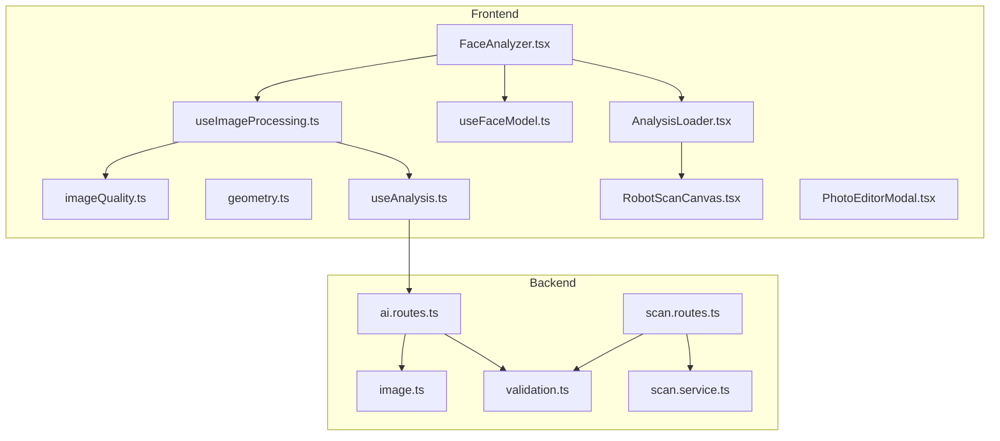
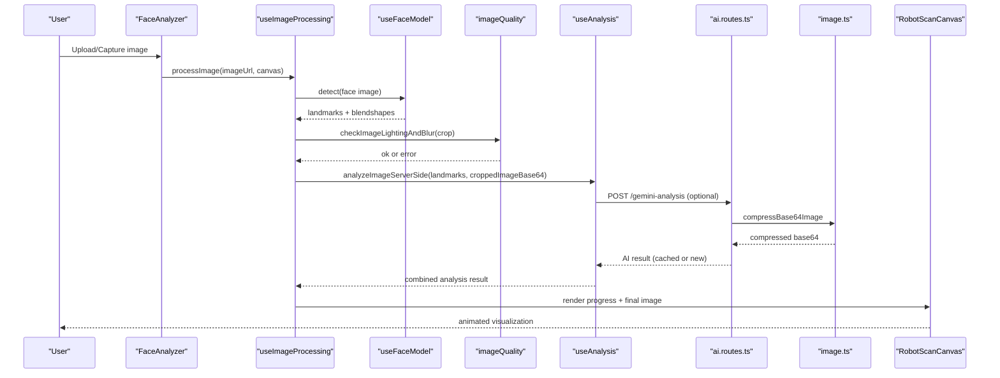
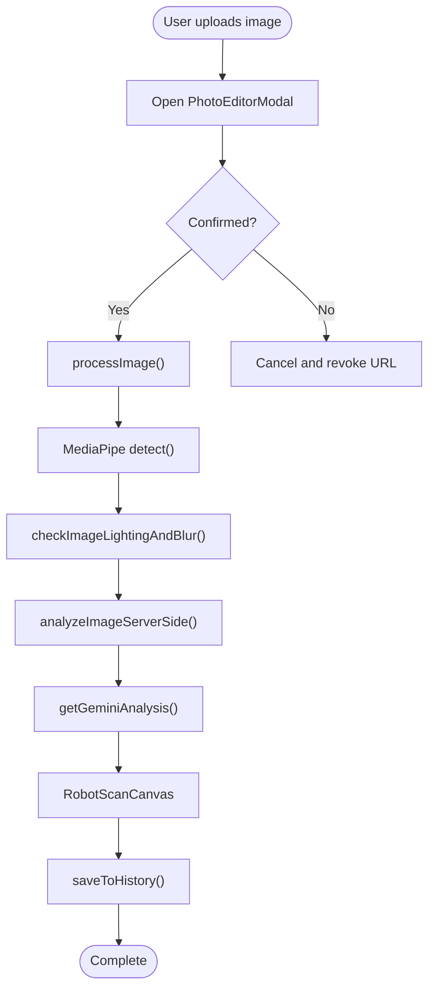
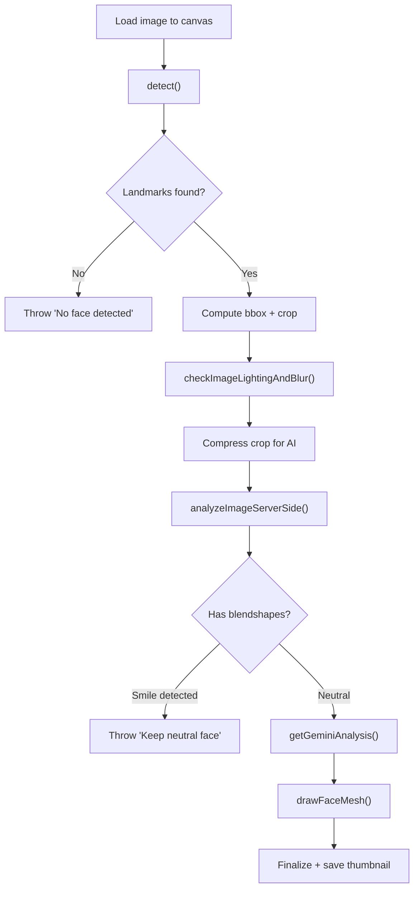
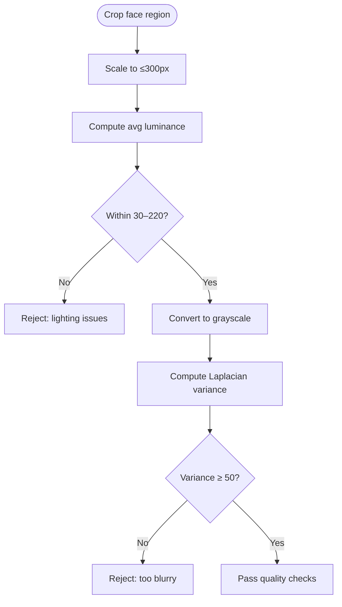
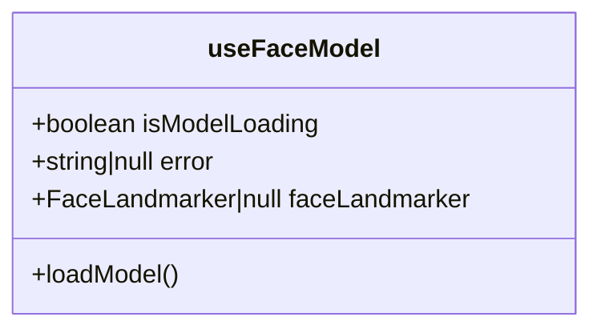
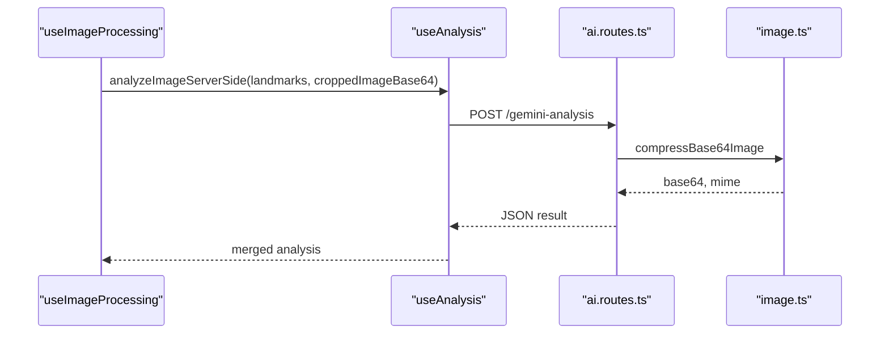
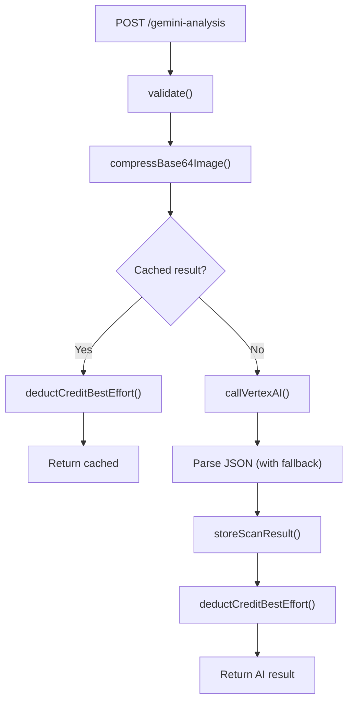
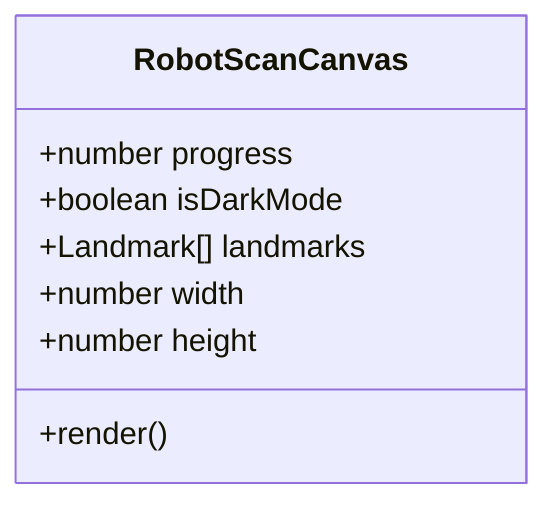
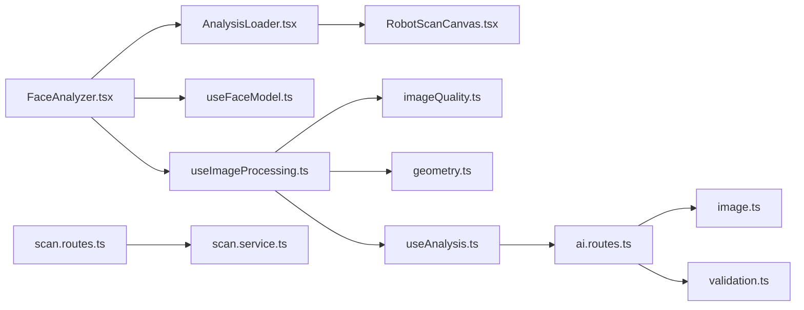

# Image Processing Pipeline

<cite>
**Referenced Files in This Document**
- [FaceAnalyzer.tsx](file://src/components/FaceAnalyzer/FaceAnalyzer.tsx)
- [useImageProcessing.ts](file://src/components/FaceAnalyzer/hooks/useImageProcessing.ts)
- [imageQuality.ts](file://src/components/FaceAnalyzer/utils/imageQuality.ts)
- [geometry.ts](file://src/components/FaceAnalyzer/utils/geometry.ts)
- [useAnalysis.ts](file://src/components/FaceAnalyzer/hooks/useAnalysis.ts)
- [useFaceModel.ts](file://src/components/FaceAnalyzer/hooks/useFaceModel.ts)
- [types.ts](file://src/components/FaceAnalyzer/types.ts)
- [AnalysisLoader.tsx](file://src/components/FaceAnalyzer/AnalysisLoader.tsx)
- [RobotScanCanvas.tsx](file://src/components/FaceAnalyzer/canvas/RobotScanCanvas.tsx)
- [PhotoEditorModal.tsx](file://src/components/FaceAnalyzer/PhotoEditorModal.tsx)
- [ai.routes.ts](file://backend/routes/ai.routes.ts)
- [scan.routes.ts](file://backend/routes/scan.routes.ts)
- [image.ts](file://backend/utils/image.ts)
- [validation.ts](file://backend/utils/validation.ts)
- [scan.service.ts](file://backend/services/scan.service.ts)
</cite>

## Table of Contents
1. [Introduction](#introduction)
2. [Project Structure](#project-structure)
3. [Core Components](#core-components)
4. [Architecture Overview](#architecture-overview)
5. [Detailed Component Analysis](#detailed-component-analysis)
6. [Dependency Analysis](#dependency-analysis)
7. [Performance Considerations](#performance-considerations)
8. [Troubleshooting Guide](#troubleshooting-guide)
9. [Conclusion](#conclusion)

## Introduction
This document describes the end-to-end image processing pipeline that transforms uploaded images into a comprehensive facial analysis. It covers preprocessing, quality assessment, face landmark detection, AI-powered analysis, canvas-based rendering, progressive enhancement with user feedback, error handling, and backend integration. The pipeline emphasizes robustness, user experience, and performance across devices.

## Project Structure
The pipeline spans frontend React components and backend services:
- Frontend: FaceAnalyzer orchestrates the UI, preprocessing, and rendering.
- Backend: AI analysis endpoints validate inputs, compress images, call Vertex AI, and manage credits and caching.

**Diagram sources**
- [FaceAnalyzer.tsx:11-512](file://src/components/FaceAnalyzer/FaceAnalyzer.tsx#L11-L512)
- [useImageProcessing.ts:9-234](file://src/components/FaceAnalyzer/hooks/useImageProcessing.ts#L9-L234)
- [imageQuality.ts:3-73](file://src/components/FaceAnalyzer/utils/imageQuality.ts#L3-L73)
- [geometry.ts:3-15](file://src/components/FaceAnalyzer/utils/geometry.ts#L3-L15)
- [useAnalysis.ts:6-207](file://src/components/FaceAnalyzer/hooks/useAnalysis.ts#L6-L207)
- [useFaceModel.ts:4-37](file://src/components/FaceAnalyzer/hooks/useFaceModel.ts#L4-L37)
- [AnalysisLoader.tsx:60-286](file://src/components/FaceAnalyzer/AnalysisLoader.tsx#L60-L286)
- [RobotScanCanvas.tsx:313-800](file://src/components/FaceAnalyzer/canvas/RobotScanCanvas.tsx#L313-L800)
- [PhotoEditorModal.tsx:18-571](file://src/components/FaceAnalyzer/PhotoEditorModal.tsx#L18-L571)
- [ai.routes.ts:271-516](file://backend/routes/ai.routes.ts#L271-L516)
- [scan.routes.ts:22-63](file://backend/routes/scan.routes.ts#L22-L63)
- [image.ts:11-42](file://backend/utils/image.ts#L11-L42)
- [validation.ts:89-103](file://backend/utils/validation.ts#L89-L103)
- [scan.service.ts:20-134](file://backend/services/scan.service.ts#L20-L134)

**Section sources**
- [FaceAnalyzer.tsx:11-512](file://src/components/FaceAnalyzer/FaceAnalyzer.tsx#L11-L512)
- [useImageProcessing.ts:9-234](file://src/components/FaceAnalyzer/hooks/useImageProcessing.ts#L9-L234)
- [ai.routes.ts:271-516](file://backend/routes/ai.routes.ts#L271-L516)

## Core Components
- FaceAnalyzer: Orchestrates upload, editing, progress tracking, and finalization.
- useImageProcessing: Implements the full processing pipeline with quality checks and AI integration.
- useFaceModel: Loads the MediaPipe face landmarker with GPU acceleration.
- useAnalysis: Coordinates server-side geometry and AI analysis, and saves results.
- imageQuality: Performs brightness and blur checks on cropped regions.
- geometry: Placeholder for mesh drawing logic (currently handled by UI).
- AnalysisLoader and RobotScanCanvas: Progressive rendering and visualization.
- PhotoEditorModal: Pre-processing editor for cropping and orientation adjustments.
- Backend routes and services: Validate inputs, compress images, call Vertex AI, cache results, and manage credits.

**Section sources**
- [FaceAnalyzer.tsx:11-512](file://src/components/FaceAnalyzer/FaceAnalyzer.tsx#L11-L512)
- [useImageProcessing.ts:9-234](file://src/components/FaceAnalyzer/hooks/useImageProcessing.ts#L9-L234)
- [useFaceModel.ts:4-37](file://src/components/FaceAnalyzer/hooks/useFaceModel.ts#L4-L37)
- [useAnalysis.ts:6-207](file://src/components/FaceAnalyzer/hooks/useAnalysis.ts#L6-L207)
- [imageQuality.ts:3-73](file://src/components/FaceAnalyzer/utils/imageQuality.ts#L3-L73)
- [geometry.ts:3-15](file://src/components/FaceAnalyzer/utils/geometry.ts#L3-L15)
- [AnalysisLoader.tsx:60-286](file://src/components/FaceAnalyzer/AnalysisLoader.tsx#L60-L286)
- [RobotScanCanvas.tsx:313-800](file://src/components/FaceAnalyzer/canvas/RobotScanCanvas.tsx#L313-L800)
- [PhotoEditorModal.tsx:18-571](file://src/components/FaceAnalyzer/PhotoEditorModal.tsx#L18-L571)

## Architecture Overview
The pipeline follows a staged progression:
1. Upload and edit: User uploads or captures an image; PhotoEditorModal allows cropping and rotation.
2. Preprocessing: Canvas draws the image, detects faces, verifies neutral expressions, and isolates the face region.
3. Quality assessment: Lighting and blur checks on a scaled-down cropped region.
4. Geometry analysis: Backend receives landmarks and a compressed image for geometric scoring.
5. AI analysis: Optional premium AI analysis via Vertex AI with retries and caching.
6. Rendering: RobotScanCanvas visualizes progress and final results; overlays handled by UI.
7. Persistence: Results saved to history with thumbnails.

**Diagram sources**
- [FaceAnalyzer.tsx:234-267](file://src/components/FaceAnalyzer/FaceAnalyzer.tsx#L234-L267)
- [useImageProcessing.ts:26-222](file://src/components/FaceAnalyzer/hooks/useImageProcessing.ts#L26-L222)
- [useFaceModel.ts:9-33](file://src/components/FaceAnalyzer/hooks/useFaceModel.ts#L9-L33)
- [imageQuality.ts:3-73](file://src/components/FaceAnalyzer/utils/imageQuality.ts#L3-L73)
- [useAnalysis.ts:9-23](file://src/components/FaceAnalyzer/hooks/useAnalysis.ts#L9-L23)
- [ai.routes.ts:271-516](file://backend/routes/ai.routes.ts#L271-L516)
- [image.ts:11-42](file://backend/utils/image.ts#L11-L42)
- [RobotScanCanvas.tsx:313-800](file://src/components/FaceAnalyzer/canvas/RobotScanCanvas.tsx#L313-L800)

## Detailed Component Analysis

### FaceAnalyzer: Orchestration and User Feedback
- Manages upload, camera capture, and the PhotoEditorModal.
- Controls progress animation with a time-based, FPS-independent loop and a final dash to completion.
- Handles model loading state, error propagation, and saving status.
- Provides privacy guarantees and social proof counters.

**Diagram sources**
- [FaceAnalyzer.tsx:234-267](file://src/components/FaceAnalyzer/FaceAnalyzer.tsx#L234-L267)
- [useImageProcessing.ts:26-222](file://src/components/FaceAnalyzer/hooks/useImageProcessing.ts#L26-L222)
- [useAnalysis.ts:162-203](file://src/components/FaceAnalyzer/hooks/useAnalysis.ts#L162-L203)

**Section sources**
- [FaceAnalyzer.tsx:11-512](file://src/components/FaceAnalyzer/FaceAnalyzer.tsx#L11-L512)

### useImageProcessing: Pipeline Implementation
- Loads the image into a canvas, runs MediaPipe detection, and validates face count and neutral expression.
- Computes bounding box from landmarks, crops the face, and scales for AI processing.
- Executes lighting and blur checks on a scaled-down region.
- Sends landmarks and cropped image to the backend for geometry analysis.
- Renders the face mesh overlay and finalizes the result with optional AI enhancement.
- Emits progress milestones and handles errors.

**Diagram sources**
- [useImageProcessing.ts:26-222](file://src/components/FaceAnalyzer/hooks/useImageProcessing.ts#L26-L222)
- [imageQuality.ts:3-73](file://src/components/FaceAnalyzer/utils/imageQuality.ts#L3-L73)
- [geometry.ts:3-15](file://src/components/FaceAnalyzer/utils/geometry.ts#L3-L15)

**Section sources**
- [useImageProcessing.ts:9-234](file://src/components/FaceAnalyzer/hooks/useImageProcessing.ts#L9-L234)

### imageQuality: Lighting and Blur Assessment
- Scales the cropped face to a small size for fast processing.
- Computes average luminance and validates within acceptable bounds.
- Applies Laplacian variance to estimate blur and rejects overly blurry images.
- Uses micro-task yields to avoid blocking the main thread.

**Diagram sources**
- [imageQuality.ts:3-73](file://src/components/FaceAnalyzer/utils/imageQuality.ts#L3-L73)

**Section sources**
- [imageQuality.ts:3-73](file://src/components/FaceAnalyzer/utils/imageQuality.ts#L3-L73)

### useFaceModel: Model Loading and Detection
- Dynamically loads the MediaPipe face landmarker with GPU delegation.
- Configures running mode to IMAGE and limits to one face.
- Exposes loading state and error handling.

**Diagram sources**
- [useFaceModel.ts:4-37](file://src/components/FaceAnalyzer/hooks/useFaceModel.ts#L4-L37)

**Section sources**
- [useFaceModel.ts:4-37](file://src/components/FaceAnalyzer/hooks/useFaceModel.ts#L4-L37)

### useAnalysis: Backend Coordination and AI Enhancement
- Calls the geometry endpoint with landmarks and cropped image.
- Optionally calls the Gemini AI endpoint with retries and timeouts.
- Integrates AI results into the analysis (scores, breakdowns, recommendations).
- Saves results to history with thumbnails and manages save status.

**Diagram sources**
- [useAnalysis.ts:9-23](file://src/components/FaceAnalyzer/hooks/useAnalysis.ts#L9-L23)
- [ai.routes.ts:271-516](file://backend/routes/ai.routes.ts#L271-L516)
- [image.ts:11-42](file://backend/utils/image.ts#L11-L42)

**Section sources**
- [useAnalysis.ts:6-207](file://src/components/FaceAnalyzer/hooks/useAnalysis.ts#L6-L207)

### Backend AI Routes: Validation, Compression, and Retry
- Validates request bodies and enforces rate limits and daily caps.
- Compresses images to a fixed dimension and JPEG quality for Vertex AI.
- Calls Vertex AI with retry logic and respects 429 retry-after headers.
- Parses and sanitizes JSON responses, stores results, and deducts credits safely.

**Diagram sources**
- [ai.routes.ts:271-516](file://backend/routes/ai.routes.ts#L271-L516)
- [image.ts:11-42](file://backend/utils/image.ts#L11-L42)
- [validation.ts:89-103](file://backend/utils/validation.ts#L89-L103)
- [scan.service.ts:68-94](file://backend/services/scan.service.ts#L68-L94)

**Section sources**
- [ai.routes.ts:271-516](file://backend/routes/ai.routes.ts#L271-L516)
- [image.ts:11-42](file://backend/utils/image.ts#L11-L42)
- [validation.ts:89-103](file://backend/utils/validation.ts#L89-L103)
- [scan.service.ts:68-94](file://backend/services/scan.service.ts#L68-L94)

### Canvas-Based Rendering: RobotScanCanvas
- Renders a cinematic scan visualization synchronized with progress.
- Manages device tier detection and adjusts motion complexity.
- Supports interactive controls (rotation, direction, easing) for debugging and experimentation.
- Handles image scaling, wireframe building, and HUD elements.

**Diagram sources**
- [RobotScanCanvas.tsx:313-800](file://src/components/FaceAnalyzer/canvas/RobotScanCanvas.tsx#L313-L800)

**Section sources**
- [RobotScanCanvas.tsx:313-800](file://src/components/FaceAnalyzer/canvas/RobotScanCanvas.tsx#L313-L800)

### PhotoEditorModal: Pre-Processing Editor
- Allows rotation in 90° increments, fine rotation, and horizontal flip.
- Provides draggable crop handles with rule-of-thirds overlay.
- Exports edited image as a Blob and converts to a URL for processing.

**Section sources**
- [PhotoEditorModal.tsx:18-571](file://src/components/FaceAnalyzer/PhotoEditorModal.tsx#L18-L571)

### AnalysisLoader and Progress Tracking
- Smooths progress updates and displays milestones.
- Animates the robot visualization and finalizes on completion.

**Section sources**
- [AnalysisLoader.tsx:60-286](file://src/components/FaceAnalyzer/AnalysisLoader.tsx#L60-L286)

## Dependency Analysis
- Frontend dependencies:
  - FaceAnalyzer depends on useImageProcessing, useFaceModel, and AnalysisLoader.
  - useImageProcessing depends on useAnalysis, imageQuality, geometry, and types.
  - Backend routes depend on validation, image compression, and scan service.
- Coupling:
  - useImageProcessing coordinates tightly with useAnalysis and useFaceModel.
  - Backend endpoints encapsulate Vertex AI integration and caching.
- Cohesion:
  - Each hook/service focuses on a single responsibility (model loading, processing, analysis, rendering).

**Diagram sources**
- [FaceAnalyzer.tsx:11-512](file://src/components/FaceAnalyzer/FaceAnalyzer.tsx#L11-L512)
- [useImageProcessing.ts:9-234](file://src/components/FaceAnalyzer/hooks/useImageProcessing.ts#L9-L234)
- [useFaceModel.ts:4-37](file://src/components/FaceAnalyzer/hooks/useFaceModel.ts#L4-L37)
- [AnalysisLoader.tsx:60-286](file://src/components/FaceAnalyzer/AnalysisLoader.tsx#L60-L286)
- [RobotScanCanvas.tsx:313-800](file://src/components/FaceAnalyzer/canvas/RobotScanCanvas.tsx#L313-L800)
- [imageQuality.ts:3-73](file://src/components/FaceAnalyzer/utils/imageQuality.ts#L3-L73)
- [geometry.ts:3-15](file://src/components/FaceAnalyzer/utils/geometry.ts#L3-L15)
- [useAnalysis.ts:6-207](file://src/components/FaceAnalyzer/hooks/useAnalysis.ts#L6-L207)
- [ai.routes.ts:271-516](file://backend/routes/ai.routes.ts#L271-L516)
- [image.ts:11-42](file://backend/utils/image.ts#L11-L42)
- [validation.ts:89-103](file://backend/utils/validation.ts#L89-L103)
- [scan.routes.ts:22-63](file://backend/routes/scan.routes.ts#L22-L63)
- [scan.service.ts:20-134](file://backend/services/scan.service.ts#L20-L134)

**Section sources**
- [types.ts:12-74](file://src/components/FaceAnalyzer/types.ts#L12-L74)

## Performance Considerations
- Image compression:
  - Frontend crops and resizes for AI; backend further compresses to a fixed dimension and quality.
- Scaling:
  - Lighting and blur checks operate on scaled-down regions to reduce CPU/GPU load.
- Rendering:
  - RobotScanCanvas adapts complexity based on device tier; motion is time-based to remain smooth across framerates.
- Memory management:
  - Object URLs are revoked after use; canvases are resized appropriately; temporary buffers are reused where possible.
- Network:
  - Backend enforces timeouts and retries; caches frequent results; rate limits prevent abuse.

[No sources needed since this section provides general guidance]

## Troubleshooting Guide
- Invalid image formats:
  - Frontend rejects non-image uploads early; backend validates base64 sizes and formats.
- No face or multiple faces:
  - The pipeline throws explicit errors if no face or more than one face is detected.
- Neutral expression:
  - Smile thresholds trigger a warning to keep a neutral face.
- Lighting and blur:
  - Low/high brightness or variance below threshold cause rejection with actionable messages.
- Model loading failures:
  - Errors are surfaced with guidance to refresh.
- AI analysis failures:
  - Backend logs detailed Vertex errors; retries are attempted; users receive structured error messages.
- Resource limitations:
  - Backend enforces timeouts and rate limits; frontend animations adapt to tab throttling.

**Section sources**
- [FaceAnalyzer.tsx:234-267](file://src/components/FaceAnalyzer/FaceAnalyzer.tsx#L234-L267)
- [useImageProcessing.ts:60-84](file://src/components/FaceAnalyzer/hooks/useImageProcessing.ts#L60-L84)
- [imageQuality.ts:33-71](file://src/components/FaceAnalyzer/utils/imageQuality.ts#L33-L71)
- [useFaceModel.ts:26-30](file://src/components/FaceAnalyzer/hooks/useFaceModel.ts#L26-L30)
- [ai.routes.ts:433-442](file://backend/routes/ai.routes.ts#L433-L442)

## Conclusion
The pipeline delivers a robust, user-friendly facial analysis experience by combining efficient preprocessing, quality checks, GPU-accelerated landmark detection, and optional AI enhancement. Its progressive rendering and resilient backend ensure a smooth, reliable user journey while maintaining performance and scalability.