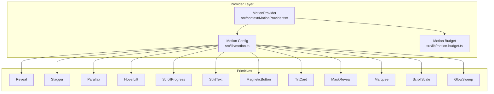
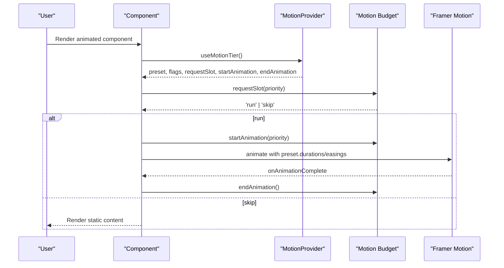
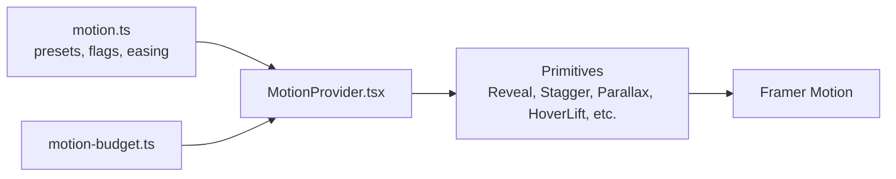

# Animation Components

<cite>
**Referenced Files in This Document**
- [MotionProvider.tsx](file://src/context/MotionProvider.tsx)
- [motion.ts](file://src/lib/motion.ts)
- [motion-budget.ts](file://src/lib/motion-budget.ts)
- [index.ts](file://src/components/motion/index.ts)
- [MOTION.md](file://docs/MOTION.md)
- [GlowSweep.tsx](file://src/components/motion/GlowSweep.tsx)
- [HoverLift.tsx](file://src/components/motion/HoverLift.tsx)
- [MagneticButton.tsx](file://src/components/motion/MagneticButton.tsx)
- [Marquee.tsx](file://src/components/motion/Marquee.tsx)
- [MaskReveal.tsx](file://src/components/motion/MaskReveal.tsx)
- [Parallax.tsx](file://src/components/motion/Parallax.tsx)
- [Reveal.tsx](file://src/components/motion/Reveal.tsx)
- [ScrollProgress.tsx](file://src/components/motion/ScrollProgress.tsx)
- [ScrollScale.tsx](file://src/components/motion/ScrollScale.tsx)
- [SplitText.tsx](file://src/components/motion/SplitText.tsx)
- [Stagger.tsx](file://src/components/motion/Stagger.tsx)
- [TiltCard.tsx](file://src/components/motion/TiltCard.tsx)
</cite>

## Table of Contents
1. [Introduction](#introduction)
2. [Project Structure](#project-structure)
3. [Core Components](#core-components)
4. [Architecture Overview](#architecture-overview)
5. [Detailed Component Analysis](#detailed-component-analysis)
6. [Dependency Analysis](#dependency-analysis)
7. [Performance Considerations](#performance-considerations)
8. [Troubleshooting Guide](#troubleshooting-guide)
9. [Conclusion](#conclusion)
10. [Appendices](#appendices)

## Introduction
This document describes the animation component library used in FaceAnalytics Pro. It explains the device-tiered motion system powered by Framer Motion, the MotionProvider for runtime optimization, and the motion budget system that manages performance across tiers. It documents each animation primitive, including props, animation parameters, and integration patterns with the MotionProvider. Practical composition examples and optimization strategies for different device capabilities are included.

## Project Structure
The motion system is organized around:
- A central provider that detects device tier, exposes presets, and enforces a motion budget.
- A set of animation primitives that honor tier flags, reduced-motion preferences, and budget decisions.
- A shared motion configuration module that defines tiers, priorities, easing, and budgets.

**Diagram sources**
- [MotionProvider.tsx:45-132](file://src/context/MotionProvider.tsx#L45-L132)
- [motion.ts:123-134](file://src/lib/motion.ts#L123-L134)
- [motion-budget.ts:30-79](file://src/lib/motion-budget.ts#L30-L79)
- [index.ts:1-13](file://src/components/motion/index.ts#L1-L13)

**Section sources**
- [MotionProvider.tsx:45-132](file://src/context/MotionProvider.tsx#L45-L132)
- [motion.ts:123-134](file://src/lib/motion.ts#L123-L134)
- [motion-budget.ts:30-79](file://src/lib/motion-budget.ts#L30-L79)
- [index.ts:1-13](file://src/components/motion/index.ts#L1-L13)

## Core Components
- MotionProvider: Detects device tier, reflects it on the document root, wires reduced-motion awareness, and exposes requestSlot/startAnimation/endAnimation/resetBudget to consumers. It also syncs the budget singleton with the current tier and resets the screen budget on route changes.
- Motion configuration: Defines tiers (low/mid/high), priorities (critical/secondary/decorative), easing presets, duration tokens, stagger defaults, and feature flags per tier. Also includes a FORCE_TIER override for debugging and rollback.
- Motion budget: A singleton that tracks per-screen usage and in-flight concurrency, enforcing per-tier limits and returning slot decisions for animations.

Key integration patterns:
- Every animation component calls useMotionTier() to read preset, flags, and budget APIs.
- Animations declare a priority and either render static or request a slot.
- On acceptance, animations call startAnimation() and endAnimation() around lifecycle to maintain concurrency.

**Section sources**
- [MotionProvider.tsx:45-132](file://src/context/MotionProvider.tsx#L45-L132)
- [motion.ts:15-77](file://src/lib/motion.ts#L15-L77)
- [motion.ts:123-134](file://src/lib/motion.ts#L123-L134)
- [motion.ts:40-51](file://src/lib/motion.ts#L40-L51)
- [motion-budget.ts:30-79](file://src/lib/motion-budget.ts#L30-L79)

## Architecture Overview
The motion system is tier-driven and budget-aware. Providers compute tier and flags, and primitives gate their behavior accordingly. Budget decisions are made per-view and per-animation, ensuring the UI remains responsive across devices.

**Diagram sources**
- [MotionProvider.tsx:94-108](file://src/context/MotionProvider.tsx#L94-L108)
- [motion-budget.ts:44-79](file://src/lib/motion-budget.ts#L44-L79)
- [Reveal.tsx:70-91](file://src/components/motion/Reveal.tsx#L70-L91)
- [Stagger.tsx:54-75](file://src/components/motion/Stagger.tsx#L54-L75)

## Detailed Component Analysis

### GlowSweep
Purpose: Diagonal light sweep for dark CTAs/cards. High-tier only by default.
- Props: duration, delay, loop, color, className, children.
- Behavior: Renders a gradient span with transform-based translation and optional repeat. Falls back to passthrough on reduced-motion or low tier.
- Performance: Blend-mode and transform; only on high tier.

**Section sources**
- [GlowSweep.tsx:5-31](file://src/components/motion/GlowSweep.tsx#L5-L31)
- [GlowSweep.tsx:32-62](file://src/components/motion/GlowSweep.tsx#L32-L62)

### HoverLift
Purpose: Pointer-fine hover lift with optional scale and press-scale.
- Props: lift, scale, pressScale, className, style, onClick, children.
- Behavior: Uses whileHover/whileTap with preset.durations.fast and premium easing. Gate by enableHoverMicro and reduced-motion.
- Performance: Transform-only micro-interaction.

**Section sources**
- [HoverLift.tsx:6-33](file://src/components/motion/HoverLift.tsx#L6-L33)
- [HoverLift.tsx:34-57](file://src/components/motion/HoverLift.tsx#L34-L57)

### MagneticButton
Purpose: Cursor-follow micro-interaction with spring smoothing.
- Props: strength, className, style, onClick, type, ariaLabel, children.
- Behavior: Tracks pointer delta, clamps to bounds, applies spring-transform to inner content. Passthrough on touch or reduced-motion.
- Performance: Motion values + springs; overflow hidden to contain movement.

**Section sources**
- [MagneticButton.tsx:5-33](file://src/components/motion/MagneticButton.tsx#L5-L33)
- [MagneticButton.tsx:34-97](file://src/components/motion/MagneticButton.tsx#L34-L97)

### Marquee
Purpose: Infinite horizontal ticker with variable speed and pause-on-hover.
- Props: speed, reverse, pauseOnHover, className, itemClassName, children.
- Behavior: High tier runs at requested speed; mid tier halves speed and disables hover pause. Low tier renders static.
- Performance: Masked container with duplicated items for seamless loop.

**Section sources**
- [Marquee.tsx:5-33](file://src/components/motion/Marquee.tsx#L5-L33)
- [Marquee.tsx:34-77](file://src/components/motion/Marquee.tsx#L34-L77)

### MaskReveal
Purpose: Clip-path wipe reveal with directional variants.
- Props: direction, delay, duration, as, className, style, children.
- Behavior: Low tier/fallback uses fade only. Mid tier adds clip-path with shorter duration. High tier adds subtle skew companion.
- Performance: clip-path + transform; will-change for smoothness.

**Section sources**
- [MaskReveal.tsx:6-37](file://src/components/motion/MaskReveal.tsx#L6-L37)
- [MaskReveal.tsx:38-95](file://src/components/motion/MaskReveal.tsx#L38-L95)

### Parallax
Purpose: Scroll-driven transform: translateY via useScroll/useTransform.
- Props: maxPx, direction, className, style, children.
- Behavior: Enabled by flags.enableScrollHooks and flags.enableParallax. Range scaled by tier and viewport height.
- Performance: Transform-only; no filters.

**Section sources**
- [Parallax.tsx:5-22](file://src/components/motion/Parallax.tsx#L5-L22)
- [Parallax.tsx:23-56](file://src/components/motion/Parallax.tsx#L23-L56)

### Reveal
Purpose: Scroll-triggered entrance with budget gating and reduced-motion handling.
- Props: priority, y, delay, as, onMount, once, className, style, id, children.
- Behavior: Requests slot on view, runs fade+translate, and cleans up concurrency on completion. Reduced-motion replaces transform with fade.
- Performance: Uses useInView and variants; respects preset durations.

**Section sources**
- [Reveal.tsx:20-53](file://src/components/motion/Reveal.tsx#L20-L53)
- [Reveal.tsx:54-137](file://src/components/motion/Reveal.tsx#L54-L137)

### ScrollProgress
Purpose: Fixed gradient progress bar at the top of the viewport.
- Props: none.
- Behavior: Spring-smoothed scaleX based on scrollYProgress. Disabled on low tier or reduced-motion.
- Performance: Compositor-friendly transform.

**Section sources**
- [ScrollProgress.tsx:11-37](file://src/components/motion/ScrollProgress.tsx#L11-L37)

### ScrollScale
Purpose: Scroll-linked container applying scale, rotateX/Y, y, and opacity.
- Props: scale, rotateX, rotateY, y, opacity, className, style, children.
- Behavior: High tier full effect; mid tier damps ranges toward identity. Disabled on low tier or reduced-motion.
- Performance: Uses useScroll + useTransform; transformPerspective and will-change.

**Section sources**
- [ScrollScale.tsx:5-38](file://src/components/motion/ScrollScale.tsx#L5-L38)
- [ScrollScale.tsx:39-98](file://src/components/motion/ScrollScale.tsx#L39-L98)

### SplitText
Purpose: Word-level staggered fade+blur reveal.
- Props: text, className, delay, stagger, y, as.
- Behavior: Preserves whitespace; wraps words in inline-block spans. Disabled on low tier/reduced-motion.
- Performance: Staggered children with blur transition.

**Section sources**
- [SplitText.tsx:6-33](file://src/components/motion/SplitText.tsx#L6-L33)
- [SplitText.tsx:34-89](file://src/components/motion/SplitText.tsx#L34-L89)

### Stagger
Purpose: Staggered entrance for direct children with budget gating.
- Props: priority, stagger, delayChildren, y, className, style, id, children.
- Behavior: Requests slot on view, applies staggered variants. Reduced-motion omits transform for critical items.
- Performance: Uses variants with staggerChildren.

**Section sources**
- [Stagger.tsx:7-35](file://src/components/motion/Stagger.tsx#L7-L35)
- [Stagger.tsx:36-131](file://src/components/motion/Stagger.tsx#L36-L131)

### TiltCard
Purpose: 3D mouse-tracking tilt with spring smoothing.
- Props: max, perspective, glare, className, style, children.
- Behavior: High-tier only; passthrough on lower tiers. Resets on mouse leave. Glare layer removed to avoid repaint.
- Performance: Single spring subscription; preserve-3d.

**Section sources**
- [TiltCard.tsx:6-32](file://src/components/motion/TiltCard.tsx#L6-L32)
- [TiltCard.tsx:33-105](file://src/components/motion/TiltCard.tsx#L33-L105)

## Dependency Analysis
The motion primitives depend on:
- useMotionTier() for preset, flags, and budget APIs.
- Framer Motion primitives (motion, useInView, useScroll, useTransform, useMotionValue, useSpring).
- Shared easing and duration tokens from motion.ts.

**Diagram sources**
- [motion.ts:123-134](file://src/lib/motion.ts#L123-L134)
- [MotionProvider.tsx:45-132](file://src/context/MotionProvider.tsx#L45-L132)
- [motion-budget.ts:30-79](file://src/lib/motion-budget.ts#L30-L79)

**Section sources**
- [motion.ts:123-134](file://src/lib/motion.ts#L123-L134)
- [MotionProvider.tsx:45-132](file://src/context/MotionProvider.tsx#L45-L132)
- [motion-budget.ts:30-79](file://src/lib/motion-budget.ts#L30-L79)

## Performance Considerations
- Tier-driven feature flags: Many primitives gate advanced features (parallax, lenis, ambient glow) behind flags per tier.
- Budget enforcement: requestSlot() decides whether to run secondary/decorative animations; startAnimation()/endAnimation() track concurrency.
- Reduced-motion handling: Some animations switch to fade-only or passthrough when the user prefers reduced motion.
- Transform-only animations: Prefer translate/rotate/scale and avoid expensive filters or frequent repaints.
- Stagger tuning: Use preset.stagger and clamp child delays to avoid overwhelming budgets.
- Route budget resets: MotionProvider resets per-screen budget on route changes; manually reset for tabs/modals.

**Section sources**
- [motion.ts:90-121](file://src/lib/motion.ts#L90-L121)
- [motion-budget.ts:44-79](file://src/lib/motion-budget.ts#L44-L79)
- [MotionProvider.tsx:74-80](file://src/context/MotionProvider.tsx#L74-L80)
- [MOTION.md:67-74](file://docs/MOTION.md#L67-L74)

## Troubleshooting Guide
- Debug budget state: In development, call window.__motionDebug() to inspect current tier, per-screen usage, and concurrency.
- Force tier for testing: Set FORCE_TIER in motion.ts to 'high' | 'mid' | 'low' | 'off' to simulate environments.
- Verify tier detection: Use ?motion=high|mid|low query param; it persists in sessionStorage for convenience.
- Route budget not resetting: Ensure MotionProvider is mounted at the root and that route changes occur; call resetBudget('route') if needed.
- Animations not firing: Confirm requestSlot() returns 'run' and that startAnimation()/endAnimation() are paired; check reduced-motion and tier flags.

**Section sources**
- [MotionProvider.tsx:82-88](file://src/context/MotionProvider.tsx#L82-L88)
- [motion.ts:24](file://src/lib/motion.ts#L24)
- [motion.ts:171-184](file://src/lib/motion.ts#L171-L184)
- [MotionProvider.tsx:74-80](file://src/context/MotionProvider.tsx#L74-L80)
- [MOTION.md:100-106](file://docs/MOTION.md#L100-L106)

## Conclusion
The FaceAnalytics Pro animation system balances polish and performance through a tiered approach and strict budgeting. Components integrate seamlessly with MotionProvider and the shared motion configuration, enabling rich experiences on capable devices while preserving usability and responsiveness on constrained ones.

## Appendices

### Component Prop Reference Summary
- GlowSweep: duration, delay, loop, color, className, children
- HoverLift: lift, scale, pressScale, className, style, onClick, children
- MagneticButton: strength, className, style, onClick, type, ariaLabel, children
- Marquee: speed, reverse, pauseOnHover, className, itemClassName, children
- MaskReveal: direction, delay, duration, as, className, style, children
- Parallax: maxPx, direction, className, style, children
- Reveal: priority, y, delay, as, onMount, once, className, style, id, children
- ScrollProgress: none
- ScrollScale: scale, rotateX, rotateY, y, opacity, className, style, children
- SplitText: text, className, delay, stagger, y, as
- Stagger: priority, stagger, delayChildren, y, className, style, id, children
- TiltCard: max, perspective, glare, className, style, children

**Section sources**
- [GlowSweep.tsx:5-31](file://src/components/motion/GlowSweep.tsx#L5-L31)
- [HoverLift.tsx:6-33](file://src/components/motion/HoverLift.tsx#L6-L33)
- [MagneticButton.tsx:5-33](file://src/components/motion/MagneticButton.tsx#L5-L33)
- [Marquee.tsx:5-33](file://src/components/motion/Marquee.tsx#L5-L33)
- [MaskReveal.tsx:6-37](file://src/components/motion/MaskReveal.tsx#L6-L37)
- [Parallax.tsx:5-22](file://src/components/motion/Parallax.tsx#L5-L22)
- [Reveal.tsx:20-53](file://src/components/motion/Reveal.tsx#L20-L53)
- [ScrollProgress.tsx:11-37](file://src/components/motion/ScrollProgress.tsx#L11-L37)
- [ScrollScale.tsx:5-38](file://src/components/motion/ScrollScale.tsx#L5-L38)
- [SplitText.tsx:6-33](file://src/components/motion/SplitText.tsx#L6-L33)
- [Stagger.tsx:7-35](file://src/components/motion/Stagger.tsx#L7-L35)
- [TiltCard.tsx:6-32](file://src/components/motion/TiltCard.tsx#L6-L32)

### Practical Composition Examples
- Hero entrance: Use Reveal with priority="critical" for the headline; pair with SplitText for word-level drama.
- Card grid: Wrap a list of cards in Stagger with priority="secondary" to emphasize attention without oversaturating budget.
- Interactive CTA: Place HoverLift on buttons; for a playful effect, pair with MagneticButton for cursor follow.
- Background depth: Add Parallax to hero backgrounds; use ScrollScale for a section that scales/rotates as it enters the viewport.
- Continuous accents: Use Marquee for testimonials or badges; on low tier, it renders static for clarity.
- Decorative highlight: Apply GlowSweep to dark CTAs for a premium shimmer; reserve for high tier.

**Section sources**
- [MOTION.md:39-60](file://docs/MOTION.md#L39-L60)
- [Reveal.tsx:54-137](file://src/components/motion/Reveal.tsx#L54-L137)
- [Stagger.tsx:36-131](file://src/components/motion/Stagger.tsx#L36-L131)
- [HoverLift.tsx:34-57](file://src/components/motion/HoverLift.tsx#L34-L57)
- [MagneticButton.tsx:34-97](file://src/components/motion/MagneticButton.tsx#L34-L97)
- [Parallax.tsx:23-56](file://src/components/motion/Parallax.tsx#L23-L56)
- [ScrollScale.tsx:39-98](file://src/components/motion/ScrollScale.tsx#L39-L98)
- [Marquee.tsx:34-77](file://src/components/motion/Marquee.tsx#L34-L77)
- [GlowSweep.tsx:32-62](file://src/components/motion/GlowSweep.tsx#L32-L62)