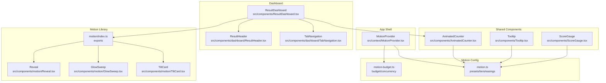
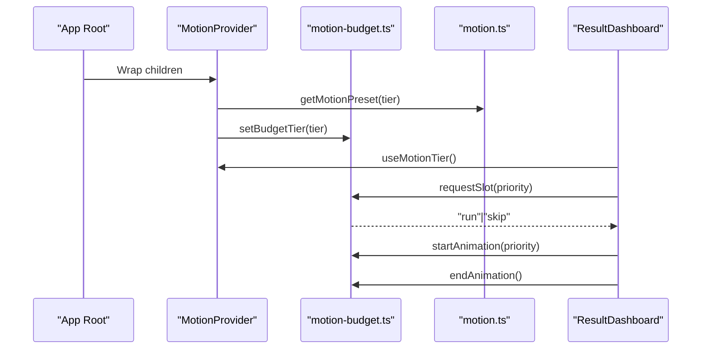
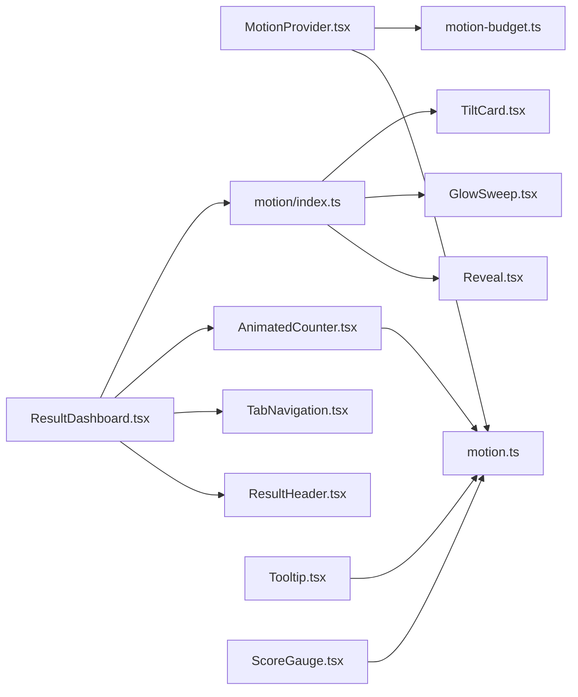

# Component Library

<cite>
**Referenced Files in This Document**
- [AnimatedCounter.tsx](file://src/components/AnimatedCounter.tsx)
- [Tooltip.tsx](file://src/components/Tooltip.tsx)
- [GlobalHeader.tsx](file://src/components/GlobalHeader.tsx)
- [ResultDashboard.tsx](file://src/components/ResultDashboard.tsx)
- [MotionProvider.tsx](file://src/context/MotionProvider.tsx)
- [motion-budget.ts](file://src/lib/motion-budget.ts)
- [motion.ts](file://src/lib/motion.ts)
- [motion/index.ts](file://src/components/motion/index.ts)
- [Reveal.tsx](file://src/components/motion/Reveal.tsx)
- [GlowSweep.tsx](file://src/components/motion/GlowSweep.tsx)
- [TiltCard.tsx](file://src/components/motion/TiltCard.tsx)
- [ResultHeader.tsx](file://src/components/dashboard/ResultHeader.tsx)
- [TabNavigation.tsx](file://src/components/dashboard/TabNavigation.tsx)
- [ScoreGauge.tsx](file://src/components/ScoreGauge.tsx)
- [FacialRatioCard.tsx](file://src/components/FacialRatioCard.tsx)
</cite>

## Table of Contents
1. [Introduction](#introduction)
2. [Project Structure](#project-structure)
3. [Core Components](#core-components)
4. [Architecture Overview](#architecture-overview)
5. [Detailed Component Analysis](#detailed-component-analysis)
6. [Dependency Analysis](#dependency-analysis)
7. [Performance Considerations](#performance-considerations)
8. [Troubleshooting Guide](#troubleshooting-guide)
9. [Conclusion](#conclusion)
10. [Appendices](#appendices)

## Introduction
This document describes the reusable component library of FaceAnalytics Pro, focusing on component organization, naming conventions, the animation system powered by Framer Motion, and the motion budget/performance tier management. It explains how key components like AnimatedCounter, Tooltip, GlobalHeader, and ResultDashboard are structured, how they expose props and customization options, and how they integrate with the MotionProvider and motion budget system. It also documents the motion components library, responsive design patterns, accessibility, styling with Tailwind CSS, and composition patterns that enhance functionality.

## Project Structure
The component library is organized by feature and domain:
- Shared UI building blocks live under src/components (e.g., AnimatedCounter, Tooltip, ScoreGauge).
- Dashboard-specific sections and subcomponents live under src/components/dashboard (e.g., ResultHeader, TabNavigation).
- Motion primitives and effects live under src/components/motion and are exported via src/components/motion/index.ts.
- Motion configuration and budgeting live under src/lib (motion.ts and motion-budget.ts).
- The MotionProvider wraps the app to supply device-tiered motion presets and budget controls via src/context/MotionProvider.tsx.

**Diagram sources**
- [MotionProvider.tsx:45-132](file://src/context/MotionProvider.tsx#L45-L132)
- [motion/index.ts:1-13](file://src/components/motion/index.ts#L1-L13)
- [motion.ts:123-134](file://src/lib/motion.ts#L123-L134)
- [motion-budget.ts:34-79](file://src/lib/motion-budget.ts#L34-L79)
- [ResultDashboard.tsx:1-35](file://src/components/ResultDashboard.tsx#L1-L35)
- [ResultHeader.tsx:1-135](file://src/components/dashboard/ResultHeader.tsx#L1-L135)
- [TabNavigation.tsx:1-167](file://src/components/dashboard/TabNavigation.tsx#L1-L167)
- [AnimatedCounter.tsx:1-66](file://src/components/AnimatedCounter.tsx#L1-L66)
- [Tooltip.tsx:1-36](file://src/components/Tooltip.tsx#L1-L36)
- [ScoreGauge.tsx:1-252](file://src/components/ScoreGauge.tsx#L1-L252)

**Section sources**
- [MotionProvider.tsx:45-132](file://src/context/MotionProvider.tsx#L45-L132)
- [motion/index.ts:1-13](file://src/components/motion/index.ts#L1-L13)

## Core Components
This section outlines the primary reusable components and their roles.

- AnimatedCounter: A tier-aware animated number counter that respects reduced motion and motion budget. It supports configurable duration, delay, and decimal precision.
- Tooltip: A lightweight tooltip with enter/exit animations and theme-aware styling.
- GlobalHeader: A responsive navigation header with theme switching, user account actions, and mobile-friendly bottom navigation. Integrates motion primitives and hides on scroll.
- ResultDashboard: A feature-rich analytics dashboard that composes multiple dashboard panels, motion components, and ratio cards. It manages tab transitions, motion budget resets, and deferred rendering.

Key props and customization options:
- AnimatedCounter
  - value: number
  - duration?: number (optional override; clamped)
  - delay?: number
  - maxDecimals?: number
- Tooltip
  - content: string
  - isDarkMode: boolean
- GlobalHeader
  - onOpenAuth(mode): callback for sign-in/sign-up
  - onOpenPricing(): callback for pricing modal
- ResultDashboard
  - result: any
  - imageUrl: string
  - onReset(): callback
  - isDarkMode: boolean
  - userCredits: number
  - onUnlock(): callback
  - isLocked?: boolean
  - user: any
  - userData?: any
  - onOpenAuth(mode): callback
  - onOpenPricing(): callback

Integration patterns:
- Use MotionProvider at the app root to inject tiered motion presets and budget controls.
- Compose motion components from the motion library (e.g., Reveal, GlowSweep, TiltCard) inside ResultDashboard and ResultHeader.
- Use AnimatedCounter within ResultDashboard to animate metric values.

**Section sources**
- [AnimatedCounter.tsx:6-31](file://src/components/AnimatedCounter.tsx#L6-L31)
- [Tooltip.tsx:5-8](file://src/components/Tooltip.tsx#L5-L8)
- [GlobalHeader.tsx:24-34](file://src/components/GlobalHeader.tsx#L24-L34)
- [ResultDashboard.tsx:238-250](file://src/components/ResultDashboard.tsx#L238-L250)

## Architecture Overview
The motion system is device-tiered and budget-aware:
- MotionProvider detects device tier, exposes a preset with durations and flags, and syncs a global motion budget.
- Components request animation slots and increment concurrency counters when animations start.
- Reduced-motion preferences and explicit flags disable or simplify animations.
- The dashboard resets the motion budget when switching tabs to prevent starvation.

**Diagram sources**
- [MotionProvider.tsx:45-132](file://src/context/MotionProvider.tsx#L45-L132)
- [motion-budget.ts:44-79](file://src/lib/motion-budget.ts#L44-L79)
- [motion.ts:123-134](file://src/lib/motion.ts#L123-L134)
- [ResultDashboard.tsx:330-344](file://src/components/ResultDashboard.tsx#L330-L344)

**Section sources**
- [MotionProvider.tsx:45-132](file://src/context/MotionProvider.tsx#L45-L132)
- [motion-budget.ts:34-79](file://src/lib/motion-budget.ts#L34-L79)
- [motion.ts:123-134](file://src/lib/motion.ts#L123-L134)

## Detailed Component Analysis

### AnimatedCounter
Purpose:
- Provides a smooth, tier-aware number animation for metrics and scores. Falls back to static text when motion is disabled or reduced motion is preferred.

Behavior:
- Respects motion tier flags and reduced motion preference.
- Clamps durations to a premium-feeling range and runs a single animation per target value change.
- Uses a tween engine to update text content during animation.

Props and customization:
- value: number
- duration?: number (overrides preset duration; clamped)
- delay?: number
- maxDecimals?: number

Accessibility and responsiveness:
- No keyboard interaction required; relies on text updates.
- Works in both light and dark modes via parent theming.

Integration:
- Used inside ResultDashboard’s Ratio Analysis Teaser to animate stats.

**Section sources**
- [AnimatedCounter.tsx:6-66](file://src/components/AnimatedCounter.tsx#L6-L66)

### Tooltip
Purpose:
- Displays contextual help text on hover with a smooth enter/exit animation.

Behavior:
- Uses AnimatePresence and motion.div for fade/translate transitions.
- Applies theme-aware styles for light/dark modes.

Props and customization:
- content: string
- isDarkMode: boolean

Accessibility:
- Uses hover-triggered visibility; consider adding focus-visible support for keyboard accessibility.

**Section sources**
- [Tooltip.tsx:5-36](file://src/components/Tooltip.tsx#L5-L36)

### GlobalHeader
Purpose:
- Navigation shell with logo, theme toggle, credits display, user account dropdown, and mobile bottom navigation.

Behavior:
- Hides on scroll down and reveals on scroll up using compositor-safe transforms.
- Integrates with ThemeProvider, AuthProvider, CreditsProvider, and MotionProvider.
- Uses motion primitives for entrance and dropdown animations.

Props and customization:
- onOpenAuth(mode: 'signin' | 'signup'): callback
- onOpenPricing(): callback

Responsive design:
- Desktop: full navigation bar with theme toggle and account actions.
- Mobile: compact bottom navigation bar with icons and user credit display.

Accessibility:
- Uses aria-labels for theme toggle.
- Dropdown menu uses semantic buttons and links.

**Section sources**
- [GlobalHeader.tsx:24-342](file://src/components/GlobalHeader.tsx#L24-L342)

### ResultDashboard
Purpose:
- Analytics visualization hub composed of ResultHeader, TabNavigation, and multiple dashboard panels.

Behavior:
- Manages active tab and resets motion budget on tab changes.
- Defers rendering of certain panels to improve initial load performance.
- Uses motion components (e.g., MaskReveal, GlowSweep) and AnimatedCounter for animated metrics.
- Integrates with DashboardProvider for shared context.

Props and customization:
- result: any
- imageUrl: string
- onReset(): callback
- isDarkMode: boolean
- userCredits: number
- onUnlock(): callback
- isLocked?: boolean
- user: any
- userData?: any
- onOpenAuth(mode): callback
- onOpenPricing(): callback

Composition patterns:
- Composes dashboard subcomponents (ResultHeader, TabNavigation).
- Uses motion components from the motion library.
- Uses AnimatedCounter for animated metrics.

**Section sources**
- [ResultDashboard.tsx:238-250](file://src/components/ResultDashboard.tsx#L238-L250)
- [ResultHeader.tsx:1-135](file://src/components/dashboard/ResultHeader.tsx#L1-L135)
- [TabNavigation.tsx:1-167](file://src/components/dashboard/TabNavigation.tsx#L1-L167)

### Motion Components Library
The motion library exports reusable motion primitives that honor device tiers and budgets.

Exports:
- Reveal, Stagger, Parallax, HoverLift, ScrollProgress, SplitText, MagneticButton, TiltCard, MaskReveal, Marquee, ScrollScale, GlowSweep.

Usage patterns:
- Reveal: scroll-triggered fade/translate with budget gating.
- GlowSweep: high-tier only animated glow sweep effect.
- TiltCard: 3D mouse-tracking tilt with spring smoothing.

**Section sources**
- [motion/index.ts:1-13](file://src/components/motion/index.ts#L1-L13)
- [Reveal.tsx:20-138](file://src/components/motion/Reveal.tsx#L20-L138)
- [GlowSweep.tsx:5-63](file://src/components/motion/GlowSweep.tsx#L5-L63)
- [TiltCard.tsx:6-106](file://src/components/motion/TiltCard.tsx#L6-L106)

### MotionProvider and Motion Budget
MotionProvider:
- Detects device tier, reflects it on HTML dataset, and syncs the budget tier.
- Exposes requestSlot, startAnimation, endAnimation, and resetBudget to consumers.
- Integrates with reduced-motion preferences and route-change budget resets.

Motion budget:
- Tracks per-screen animations and concurrent animations per tier.
- Enforces hard caps and prevents queueing for decorative animations.

**Section sources**
- [MotionProvider.tsx:45-132](file://src/context/MotionProvider.tsx#L45-L132)
- [motion-budget.ts:34-79](file://src/lib/motion-budget.ts#L34-L79)

### Supporting Components
- ScoreGauge: Animated arc gauge with gradient stroke, glowing tip, and animated counter. Honors tier flags and reduced motion.
- FacialRatioCard: Expandable card for ratio analysis with ideal range visualization, score badges, and detailed metrics.

**Section sources**
- [ScoreGauge.tsx:7-114](file://src/components/ScoreGauge.tsx#L7-L114)
- [FacialRatioCard.tsx:18-36](file://src/components/FacialRatioCard.tsx#L18-L36)

## Dependency Analysis
The following diagram shows key dependencies among major components and the motion system.

**Diagram sources**
- [MotionProvider.tsx:45-132](file://src/context/MotionProvider.tsx#L45-L132)
- [motion.ts:123-134](file://src/lib/motion.ts#L123-L134)
- [motion-budget.ts:34-79](file://src/lib/motion-budget.ts#L34-L79)
- [ResultDashboard.tsx:1-35](file://src/components/ResultDashboard.tsx#L1-L35)
- [motion/index.ts:1-13](file://src/components/motion/index.ts#L1-L13)
- [AnimatedCounter.tsx:1-66](file://src/components/AnimatedCounter.tsx#L1-L66)
- [Tooltip.tsx:1-36](file://src/components/Tooltip.tsx#L1-L36)
- [ScoreGauge.tsx:1-252](file://src/components/ScoreGauge.tsx#L1-L252)

**Section sources**
- [MotionProvider.tsx:45-132](file://src/context/MotionProvider.tsx#L45-L132)
- [motion.ts:123-134](file://src/lib/motion.ts#L123-L134)
- [motion-budget.ts:34-79](file://src/lib/motion-budget.ts#L34-L79)
- [ResultDashboard.tsx:1-35](file://src/components/ResultDashboard.tsx#L1-L35)

## Performance Considerations
- Device-tiered motion:
  - Low tier reduces concurrent animations and disables expensive effects.
  - Mid tier enables essential interactions; high tier adds ambient glows and parallax.
- Motion budget:
  - Per-screen cap prevents animation overload; concurrency cap limits simultaneous animations.
  - Budget resets on route/tab/modal changes to avoid starvation.
- Reduced-motion compatibility:
  - Decorative animations skip when reduced motion is preferred; critical animations still run (fade-only).
- Composition strategies:
  - Defer rendering of heavy panels until after initial paint.
  - Use Reveal for scroll-triggered animations with budget gating.
  - Prefer transform-only animations for compositor safety.

[No sources needed since this section provides general guidance]

## Troubleshooting Guide
Common issues and resolutions:
- Animations not playing:
  - Verify MotionProvider is wrapping the app and tier is detected.
  - Check reduced-motion preference and tier flags; ensure flags.enableCounterTween is true when needed.
- Budget starvation:
  - Reset the budget on tab changes using resetBudget('tab').
  - Reduce decorative animations or defer non-critical renders.
- Tooltip not visible:
  - Ensure mouse events are not blocked by parent containers.
  - Confirm isDarkMode toggles appropriate styles.
- Header not hiding on scroll:
  - Confirm prefersReducedMotion is not forcing hidden to false.
  - Ensure useScroll and useMotionValueEvent are active.

**Section sources**
- [MotionProvider.tsx:56-80](file://src/context/MotionProvider.tsx#L56-L80)
- [motion.ts:137-144](file://src/lib/motion.ts#L137-L144)
- [motion-budget.ts:34-79](file://src/lib/motion-budget.ts#L34-L79)
- [GlobalHeader.tsx:56-70](file://src/components/GlobalHeader.tsx#L56-L70)
- [Tooltip.tsx:14-34](file://src/components/Tooltip.tsx#L14-L34)

## Conclusion
FaceAnalytics Pro’s component library emphasizes a tiered, budget-aware motion system that scales gracefully across devices. Components like AnimatedCounter, Tooltip, GlobalHeader, and ResultDashboard demonstrate consistent patterns for props, customization, and integration with the MotionProvider. The motion library offers composable primitives that respect performance constraints, while Tailwind CSS and theme-aware logic ensure responsive, accessible UIs.

[No sources needed since this section summarizes without analyzing specific files]

## Appendices

### Naming Conventions and Organization
- Component files: PascalCase (e.g., AnimatedCounter.tsx, GlobalHeader.tsx).
- Props interfaces: PascalCase with suffix Props (e.g., AnimatedCounterProps).
- Exported components: Named exports for clarity.
- Motion components: Grouped under src/components/motion with barrel export via motion/index.ts.
- Dashboard sections: Feature-scoped under src/components/dashboard.

[No sources needed since this section provides general guidance]

### Accessibility and Styling Notes
- Accessibility:
  - Use aria-labels for icon-only controls (e.g., theme toggle).
  - Consider focus-visible states for interactive elements.
  - Ensure tooltips and dropdowns are keyboard navigable.
- Styling:
  - Tailwind classes dominate; theme-aware variants switch between light/dark palettes.
  - CSS variables for durations enforce consistent timing across components.

[No sources needed since this section provides general guidance]