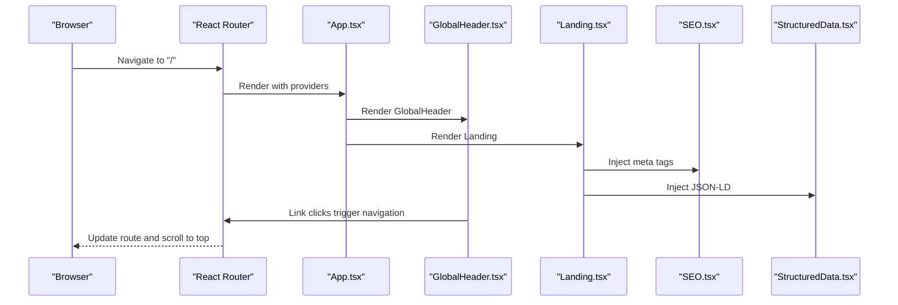
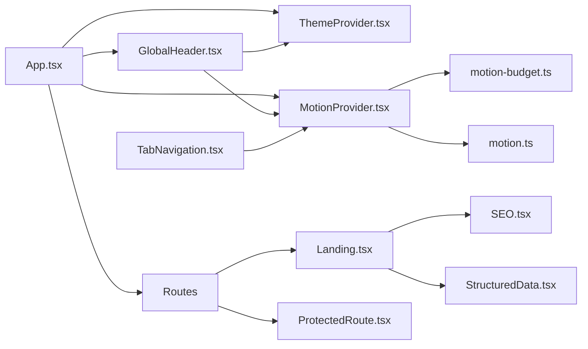

# Layout and Navigation

<cite>
**Referenced Files in This Document**
- [GlobalHeader.tsx](file://src/components/GlobalHeader.tsx)
- [LandingSections.tsx](file://src/components/LandingSections.tsx)
- [TabNavigation.tsx](file://src/components/dashboard/TabNavigation.tsx)
- [SEO.tsx](file://src/components/SEO.tsx)
- [StructuredData.tsx](file://src/components/StructuredData.tsx)
- [App.tsx](file://src/App.tsx)
- [Landing.tsx](file://src/pages/Landing.tsx)
- [ProtectedRoute.tsx](file://src/routes/ProtectedRoute.tsx)
- [ThemeProvider.tsx](file://src/context/ThemeProvider.tsx)
- [MotionProvider.tsx](file://src/context/MotionProvider.tsx)
- [motion.ts](file://src/lib/motion.ts)
- [motion-budget.ts](file://src/lib/motion-budget.ts)
- [utils.ts](file://src/lib/utils.ts)
- [ProfilePage.tsx](file://src/pages/ProfilePage.tsx)
</cite>

## Table of Contents
1. [Introduction](#introduction)
2. [Project Structure](#project-structure)
3. [Core Components](#core-components)
4. [Architecture Overview](#architecture-overview)
5. [Detailed Component Analysis](#detailed-component-analysis)
6. [Dependency Analysis](#dependency-analysis)
7. [Performance Considerations](#performance-considerations)
8. [Troubleshooting Guide](#troubleshooting-guide)
9. [Conclusion](#conclusion)

## Introduction
This document explains the layout and navigation system in FaceAnalytics Pro with a focus on:
- GlobalHeader: primary navigation and branding, responsive behavior, and user actions
- LandingSections: hero content and feature showcases
- TabNavigation: dashboard content organization
- SEO and StructuredData: search engine optimization and rich snippet support
- Integration with routing, responsive design patterns, and accessibility compliance
- Customization options across page contexts and performance best practices for critical rendering

## Project Structure
The layout and navigation system spans several layers:
- Application shell and routing in App.tsx
- Page-level composition in Landing.tsx
- Global header and footer sections
- Dashboard-specific navigation
- SEO and structured data helpers
- Motion and theme providers for responsive behavior and performance

```mermaid
graph TB
subgraph "Routing Layer"
App["App.tsx"]
Routes["React Router Routes"]
Protected["ProtectedRoute.tsx"]
end
subgraph "Layout"
Header["GlobalHeader.tsx"]
Landing["Landing.tsx"]
Footer["LandingSections.tsx (Footer)"]
Tabs["TabNavigation.tsx"]
end
subgraph "Providers"
Theme["ThemeProvider.tsx"]
Motion["MotionProvider.tsx"]
end
subgraph "SEO"
SEO["SEO.tsx"]
SD["StructuredData.tsx"]
end
App --> Routes
Routes --> Landing
Routes --> Protected
Landing --> Header
Landing --> Footer
Landing --> SEO
Landing --> SD
Header --> Theme
Header --> Motion
Tabs --> Motion
App --> Theme
App --> Motion
```

**Diagram sources**
- [App.tsx:1-473](file://src/App.tsx#L1-L473)
- [Landing.tsx:1-279](file://src/pages/Landing.tsx#L1-L279)
- [GlobalHeader.tsx:1-342](file://src/components/GlobalHeader.tsx#L1-L342)
- [LandingSections.tsx:1-800](file://src/components/LandingSections.tsx#L1-L800)
- [TabNavigation.tsx:1-167](file://src/components/dashboard/TabNavigation.tsx#L1-L167)
- [SEO.tsx:1-98](file://src/components/SEO.tsx#L1-L98)
- [StructuredData.tsx:1-34](file://src/components/StructuredData.tsx#L1-L34)
- [ThemeProvider.tsx:1-48](file://src/context/ThemeProvider.tsx#L1-L48)
- [MotionProvider.tsx:1-153](file://src/context/MotionProvider.tsx#L1-L153)

**Section sources**
- [App.tsx:1-473](file://src/App.tsx#L1-L473)
- [Landing.tsx:1-279](file://src/pages/Landing.tsx#L1-L279)

## Core Components
- GlobalHeader: Fixed header with logo, primary links, theme toggle, credits display, and user account menu. Includes mobile bottom navigation and scroll-aware hiding behavior.
- LandingSections: Hero, example results, features, testimonials, and FAQ sections with motion-driven animations and responsive layouts.
- TabNavigation: Sticky segmented control for dashboard tabs with animated active indicator and contextual navigation to related tools.
- SEO and StructuredData: Helmet-based meta tags and JSON-LD generation for search visibility and rich snippets.

**Section sources**
- [GlobalHeader.tsx:24-342](file://src/components/GlobalHeader.tsx#L24-L342)
- [LandingSections.tsx:36-800](file://src/components/LandingSections.tsx#L36-L800)
- [TabNavigation.tsx:9-167](file://src/components/dashboard/TabNavigation.tsx#L9-L167)
- [SEO.tsx:4-98](file://src/components/SEO.tsx#L4-L98)
- [StructuredData.tsx:4-34](file://src/components/StructuredData.tsx#L4-L34)

## Architecture Overview
The layout and navigation architecture integrates routing, providers, and page-level composition to deliver a cohesive user experience:
- App.tsx orchestrates providers, routing, modals, and global header/footer.
- Landing.tsx composes SEO, structured data, hero, analyzer, and feature sections.
- GlobalHeader participates in routing via Link and navigation callbacks.
- TabNavigation is used within dashboard contexts to switch views.



**Diagram sources**
- [App.tsx:45-61](file://src/App.tsx#L45-L61)
- [App.tsx:218-228](file://src/App.tsx#L218-L228)
- [Landing.tsx:143-214](file://src/pages/Landing.tsx#L143-L214)
- [SEO.tsx:50-94](file://src/components/SEO.tsx#L50-L94)
- [StructuredData.tsx:26-30](file://src/components/StructuredData.tsx#L26-L30)

## Detailed Component Analysis

### GlobalHeader
Responsibilities:
- Branding and navigation: logo, primary links, methodology, blog
- Theme toggle and credits display
- User account menu with profile/history/sign out
- Mobile bottom navigation and scroll-aware hiding
- Integration with routing and auth modal triggers

Responsive design patterns:
- Desktop: horizontal nav with theme toggle and account menu
- Mobile: compact account chips and a modern bottom navigation bar
- Scroll-aware behavior: hides on scroll down, reveals on scroll up

Accessibility:
- Proper aria-labels for theme toggle and account menu
- Semantic markup with buttons and links
- Focus-friendly interactions

Integration with routing:
- Uses react-router Link for navigation
- Handles logo click to scroll to top using Lenis or native smooth scroll
- Exposes callbacks for auth and pricing modals

Customization options:
- Accepts onOpenAuth and onOpenPricing props to integrate with app-wide modals
- Theme-aware styling and icons adapt to dark/light modes

**Section sources**
- [GlobalHeader.tsx:24-342](file://src/components/GlobalHeader.tsx#L24-L342)
- [App.tsx:218-228](file://src/App.tsx#L218-L228)

### LandingSections
Responsibilities:
- Hero section with animated typography, CTAs, and floating stats
- Example result showcase with before/after slider and metrics
- Features grid with statistics and marquee ticker
- Footer-like section composition (used as footer in App.tsx)

Motion and performance:
- Uses motion primitives with tier-aware durations and easing
- Hydration guard to replay animations on client
- Optional ambient blobs and noise textures controlled by motion tier

Responsive design patterns:
- Grid layouts with column stacking on smaller screens
- Fluid typography and spacing scales
- Parallax and tilt effects gated by motion tier

**Section sources**
- [LandingSections.tsx:36-800](file://src/components/LandingSections.tsx#L36-L800)
- [motion.ts:123-134](file://src/lib/motion.ts#L123-L134)

### TabNavigation
Responsibilities:
- Segmented control for dashboard tabs: Overview, Analysis, Plan
- Animated active indicator using layoutId
- Contextual actions to navigate to related tools (Celebrity, Hair)
- Sticky positioning with backdrop blur and border

Customization options:
- Accepts activeTab and onTabChange props
- Supports optional image, lock state, and celebrity results for downstream navigation
- Theme-aware styling and badges

Integration with routing:
- Navigates to external pages with state carrying context data

**Section sources**
- [TabNavigation.tsx:9-167](file://src/components/dashboard/TabNavigation.tsx#L9-L167)

### SEO and StructuredData
Responsibilities:
- SEO.tsx: Generates meta tags, Open Graph, Twitter, hreflang, canonical, and JSON-LD
- StructuredData.tsx: Provides default SoftwareApplication schema or accepts custom data

Integration with pages:
- Landing.tsx injects SEO and StructuredData for the landing route
- Other pages can import and configure SEO accordingly

Best practices:
- Canonical URLs and hreflang for internationalization
- Rich snippet support via JSON-LD
- Keywords and article timestamps for content pages

**Section sources**
- [SEO.tsx:4-98](file://src/components/SEO.tsx#L4-L98)
- [StructuredData.tsx:4-34](file://src/components/StructuredData.tsx#L4-L34)
- [Landing.tsx:143-214](file://src/pages/Landing.tsx#L143-L214)

### Routing Integration and Protected Routes
- App.tsx sets up BrowserRouter, routes, and protected routes
- ProtectedRoute enforces authentication for profile/history/celebrity/hair pages
- ScrollToTop ensures smooth navigation and resets scroll position on route changes

**Section sources**
- [App.tsx:281-349](file://src/App.tsx#L281-L349)
- [ProtectedRoute.tsx:1-22](file://src/routes/ProtectedRoute.tsx#L1-L22)
- [App.tsx:45-61](file://src/App.tsx#L45-L61)

### Responsive Design Patterns
- Breakpoints and grid layouts adapt content across screen sizes
- Mobile-first navigation: bottom navigation bar replaces desktop menu
- Typography scales with fluid units and clamp-like patterns
- Motion tier controls feature availability (parallax, blur, Lenis)

**Section sources**
- [GlobalHeader.tsx:286-338](file://src/components/GlobalHeader.tsx#L286-L338)
- [LandingSections.tsx:147-436](file://src/components/LandingSections.tsx#L147-L436)
- [motion.ts:90-121](file://src/lib/motion.ts#L90-L121)

### Accessibility Compliance
- Semantic HTML and proper roles for interactive elements
- ARIA labels for icons and buttons
- Focus management and keyboard-friendly interactions
- Reduced motion support via prefers-reduced-motion and motion budget gating

**Section sources**
- [GlobalHeader.tsx:131-133](file://src/components/GlobalHeader.tsx#L131-L133)
- [MotionProvider.tsx:56-63](file://src/context/MotionProvider.tsx#L56-L63)
- [motion.ts:136-144](file://src/lib/motion.ts#L136-L144)

## Dependency Analysis
Key dependencies and relationships:
- App.tsx depends on ThemeProvider, MotionProvider, ProtectedRoute, and GlobalHeader
- Landing.tsx composes SEO, StructuredData, and LandingSections
- GlobalHeader depends on ThemeProvider, MotionProvider, AuthProvider, CreditsProvider
- TabNavigation depends on MotionProvider and router navigation
- MotionProvider coordinates device tier detection and animation budget



**Diagram sources**
- [App.tsx:1-473](file://src/App.tsx#L1-L473)
- [GlobalHeader.tsx:1-342](file://src/components/GlobalHeader.tsx#L1-L342)
- [Landing.tsx:1-279](file://src/pages/Landing.tsx#L1-L279)
- [SEO.tsx:1-98](file://src/components/SEO.tsx#L1-L98)
- [StructuredData.tsx:1-34](file://src/components/StructuredData.tsx#L1-L34)
- [MotionProvider.tsx:1-153](file://src/context/MotionProvider.tsx#L1-L153)
- [motion-budget.ts:1-89](file://src/lib/motion-budget.ts#L1-L89)
- [motion.ts:1-226](file://src/lib/motion.ts#L1-L226)

**Section sources**
- [App.tsx:1-473](file://src/App.tsx#L1-L473)
- [motion-budget.ts:1-89](file://src/lib/motion-budget.ts#L1-L89)
- [motion.ts:1-226](file://src/lib/motion.ts#L1-L226)

## Performance Considerations
Critical rendering and motion budget:
- Device tier detection influences feature availability and animation durations
- Animation budget limits concurrent and per-screen animations
- Reduced motion preference gates decorative animations
- Hydration guards prevent motion replay on SSR prerendered content

Optimization opportunities:
- Gate heavy animations behind motion tier flags
- Use requestAnimationFrame for scroll operations
- Defer non-critical animations until viewport-visible
- Minimize layout thrashing by batching DOM reads/writes

**Section sources**
- [motion.ts:167-220](file://src/lib/motion.ts#L167-L220)
- [motion-budget.ts:44-79](file://src/lib/motion-budget.ts#L44-L79)
- [Landing.tsx:49-49](file://src/pages/Landing.tsx#L49-L49)

## Troubleshooting Guide
Common issues and resolutions:
- Header not responding to scroll: verify useScroll hook and prefersReducedMotion logic
- Mobile bottom nav missing: ensure motion tier enables Lenis and mobile flags
- Animations stuttering: check motion budget thresholds and tier settings
- SEO meta tags missing: confirm SEO.tsx is rendered within the page component
- Protected route redirect loops: verify AuthProvider state and ProtectedRoute logic

**Section sources**
- [GlobalHeader.tsx:56-70](file://src/components/GlobalHeader.tsx#L56-L70)
- [motion.ts:90-121](file://src/lib/motion.ts#L90-L121)
- [motion-budget.ts:34-79](file://src/lib/motion-budget.ts#L34-L79)
- [SEO.tsx:50-94](file://src/components/SEO.tsx#L50-L94)
- [ProtectedRoute.tsx:5-21](file://src/routes/ProtectedRoute.tsx#L5-L21)

## Conclusion
The layout and navigation system in FaceAnalytics Pro combines a responsive GlobalHeader, motion-rich LandingSections, and dashboard-focused TabNavigation. SEO and StructuredData components ensure strong discoverability and rich snippets. Through device-tiered motion, reduced motion support, and strict animation budgets, the system balances visual richness with performance. Integration with routing and protected routes guarantees coherent navigation across contexts, while customization hooks enable flexible adaptation to different pages and user states.