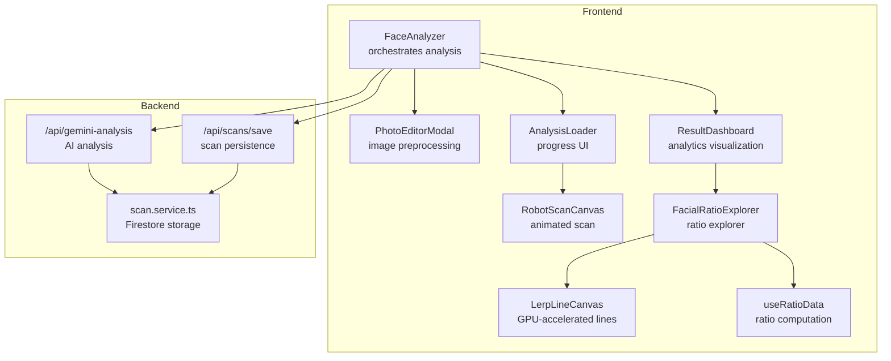
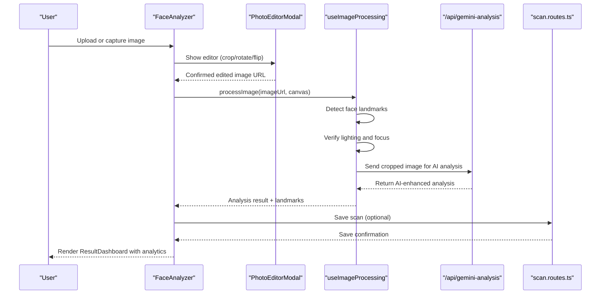
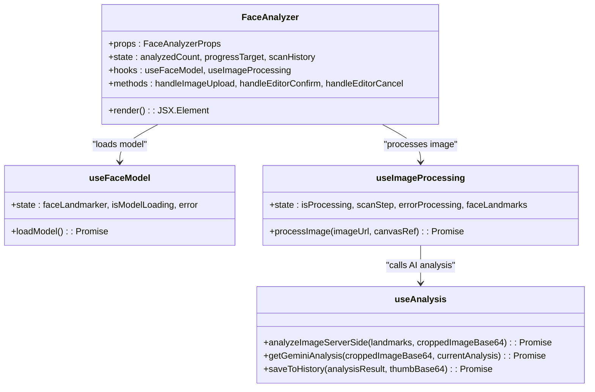
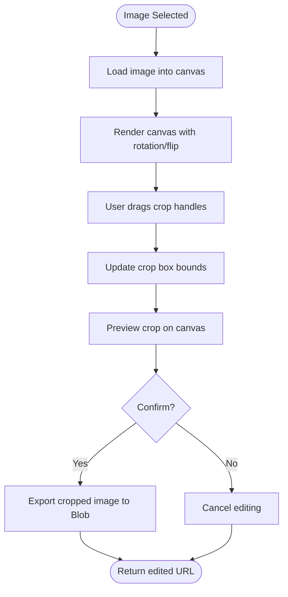
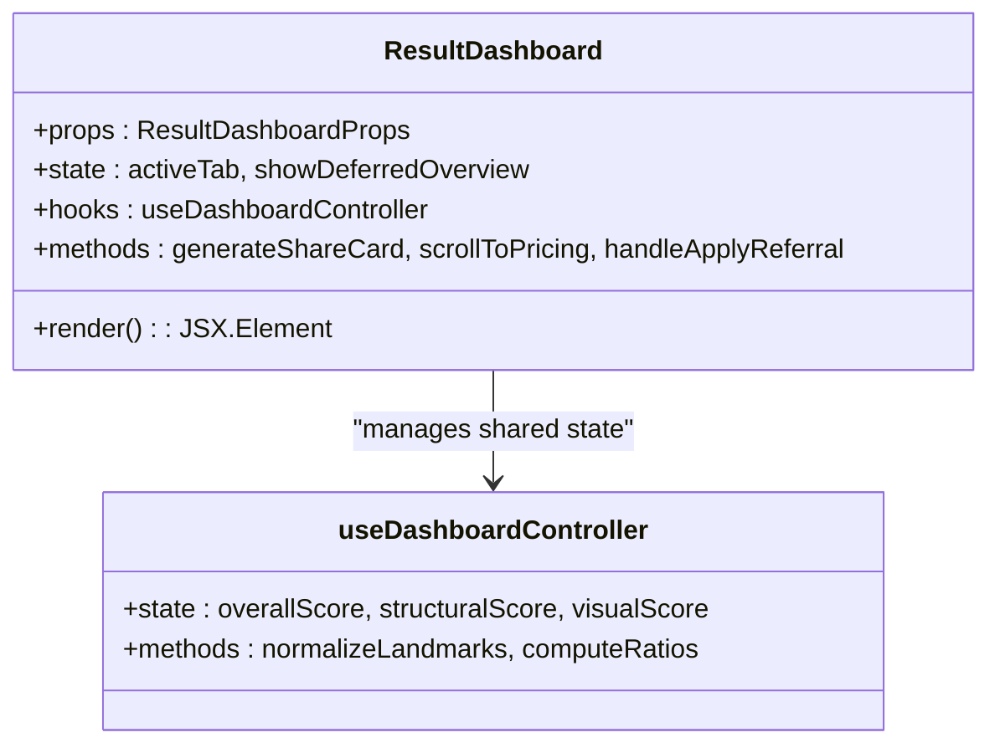
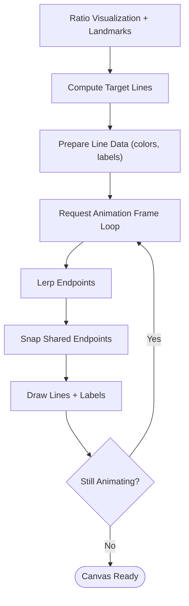
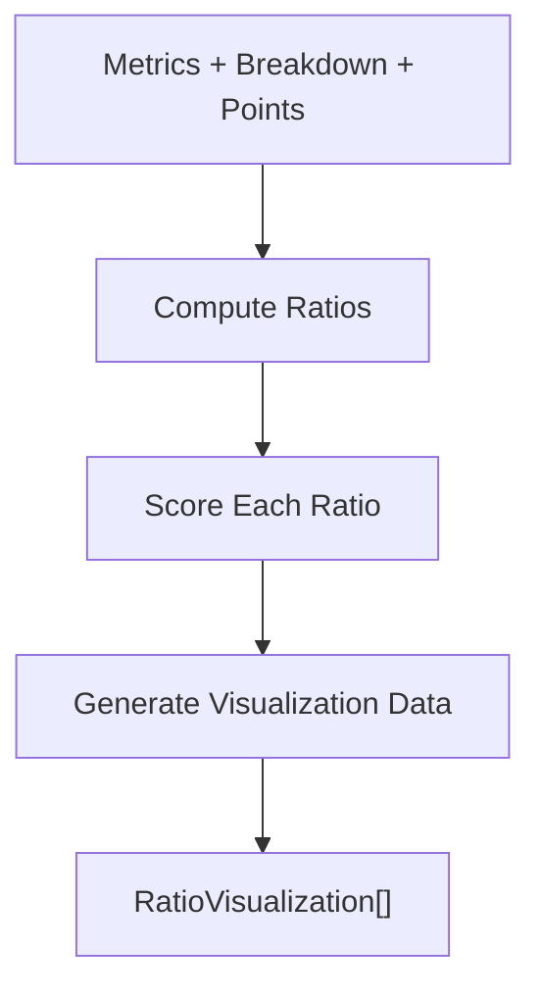
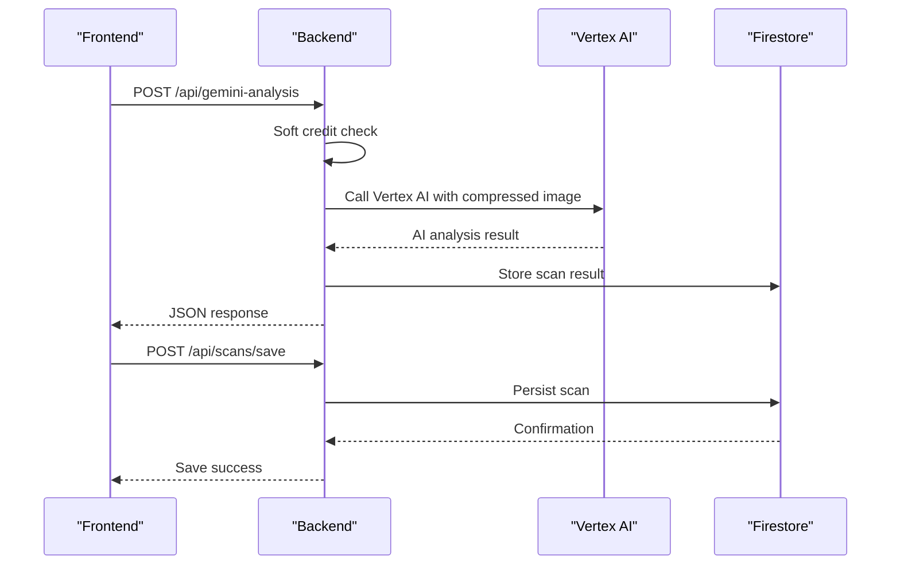
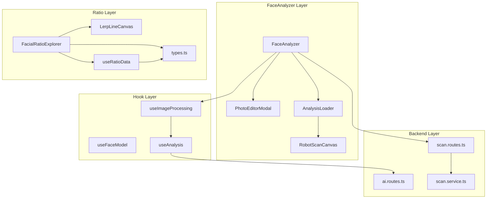

# Specialized Feature Components

<cite>
**Referenced Files in This Document**
- [FaceAnalyzer.tsx](file://src/components/FaceAnalyzer/FaceAnalyzer.tsx)
- [PhotoEditorModal.tsx](file://src/components/FaceAnalyzer/PhotoEditorModal.tsx)
- [ResultDashboard.tsx](file://src/components/ResultDashboard.tsx)
- [LerpLineCanvas.tsx](file://src/components/facial-ratio/LerpLineCanvas.tsx)
- [useRatioData.ts](file://src/components/facial-ratio/useRatioData.ts)
- [types.ts](file://src/components/facial-ratio/types.ts)
- [useAnalysis.ts](file://src/components/FaceAnalyzer/hooks/useAnalysis.ts)
- [useFaceModel.ts](file://src/components/FaceAnalyzer/hooks/useFaceModel.ts)
- [useImageProcessing.ts](file://src/components/FaceAnalyzer/hooks/useImageProcessing.ts)
- [AnalysisLoader.tsx](file://src/components/FaceAnalyzer/AnalysisLoader.tsx)
- [RobotScanCanvas.tsx](file://src/components/FaceAnalyzer/canvas/RobotScanCanvas.tsx)
- [FacialRatioExplorer.tsx](file://src/components/FacialRatioExplorer.tsx)
- [ai.routes.ts](file://backend/routes/ai.routes.ts)
- [scan.routes.ts](file://backend/routes/scan.routes.ts)
- [scan.service.ts](file://backend/services/scan.service.ts)
</cite>

## Table of Contents
1. [Introduction](#introduction)
2. [Project Structure](#project-structure)
3. [Core Components](#core-components)
4. [Architecture Overview](#architecture-overview)
5. [Detailed Component Analysis](#detailed-component-analysis)
6. [Dependency Analysis](#dependency-analysis)
7. [Performance Considerations](#performance-considerations)
8. [Troubleshooting Guide](#troubleshooting-guide)
9. [Conclusion](#conclusion)

## Introduction
This document provides comprehensive technical documentation for FaceAnalytics Pro's specialized feature components. It focuses on the AI-powered facial analysis pipeline, image editing capabilities, analytics visualization, and facial ratio computation. The components covered include FaceAnalyzer for orchestrating the entire analysis workflow, PhotoEditorModal for pre-processing images, ResultDashboard for comprehensive analytics visualization, and the facial ratio subsystem comprising LerpLineCanvas for GPU-accelerated visualization and useRatioData for data management. The documentation explains complex workflows such as real-time image processing, AI analysis pipelines, and data visualization, along with component integration patterns, state management approaches, and performance optimization techniques for computationally intensive operations.

## Project Structure
The specialized features are organized primarily under the FaceAnalyzer and facial-ratio modules, with supporting backend services for AI analysis and scan storage. The frontend components are structured to maximize separation of concerns: FaceAnalyzer manages the end-to-end workflow, PhotoEditorModal handles image preprocessing, ResultDashboard renders analytics, and the facial ratio components encapsulate geometric computations and visualizations.

**Diagram sources**
- [FaceAnalyzer.tsx:11-512](file://src/components/FaceAnalyzer/FaceAnalyzer.tsx#L11-L512)
- [PhotoEditorModal.tsx:18-571](file://src/components/FaceAnalyzer/PhotoEditorModal.tsx#L18-L571)
- [AnalysisLoader.tsx:60-286](file://src/components/FaceAnalyzer/AnalysisLoader.tsx#L60-L286)
- [RobotScanCanvas.tsx:313-800](file://src/components/FaceAnalyzer/canvas/RobotScanCanvas.tsx#L313-L800)
- [ResultDashboard.tsx:315-800](file://src/components/ResultDashboard.tsx#L315-L800)
- [FacialRatioExplorer.tsx:30-800](file://src/components/FacialRatioExplorer.tsx#L30-L800)
- [LerpLineCanvas.tsx:48-410](file://src/components/facial-ratio/LerpLineCanvas.tsx#L48-L410)
- [useRatioData.ts:10-649](file://src/components/facial-ratio/useRatioData.ts#L10-L649)
- [ai.routes.ts:271-516](file://backend/routes/ai.routes.ts#L271-L516)
- [scan.routes.ts:22-63](file://backend/routes/scan.routes.ts#L22-L63)
- [scan.service.ts:31-94](file://backend/services/scan.service.ts#L31-L94)

**Section sources**
- [FaceAnalyzer.tsx:11-512](file://src/components/FaceAnalyzer/FaceAnalyzer.tsx#L11-L512)
- [PhotoEditorModal.tsx:18-571](file://src/components/FaceAnalyzer/PhotoEditorModal.tsx#L18-L571)
- [ResultDashboard.tsx:315-800](file://src/components/ResultDashboard.tsx#L315-L800)
- [LerpLineCanvas.tsx:48-410](file://src/components/facial-ratio/LerpLineCanvas.tsx#L48-L410)
- [useRatioData.ts:10-649](file://src/components/facial-ratio/useRatioData.ts#L10-L649)
- [ai.routes.ts:271-516](file://backend/routes/ai.routes.ts#L271-L516)
- [scan.routes.ts:22-63](file://backend/routes/scan.routes.ts#L22-L63)
- [scan.service.ts:31-94](file://backend/services/scan.service.ts#L31-L94)

## Core Components
This section introduces the four specialized components and their roles:

- FaceAnalyzer: Orchestrates the entire facial analysis workflow, including model initialization, image processing, AI analysis, and result delivery.
- PhotoEditorModal: Provides interactive cropping, rotation, and flipping for optimal face detection.
- ResultDashboard: Presents comprehensive analytics, including scores, insights, and visualizations.
- Facial Ratio Components: Compute and visualize facial ratios using geometric landmarks and GPU-accelerated rendering.

Key implementation patterns:
- Hook-based composition for AI analysis, model loading, and image processing.
- Memoization and optimized rendering for performance.
- Asynchronous backend integration with robust error handling and retry logic.

**Section sources**
- [FaceAnalyzer.tsx:11-512](file://src/components/FaceAnalyzer/FaceAnalyzer.tsx#L11-L512)
- [PhotoEditorModal.tsx:18-571](file://src/components/FaceAnalyzer/PhotoEditorModal.tsx#L18-L571)
- [ResultDashboard.tsx:315-800](file://src/components/ResultDashboard.tsx#L315-L800)
- [LerpLineCanvas.tsx:48-410](file://src/components/facial-ratio/LerpLineCanvas.tsx#L48-L410)
- [useRatioData.ts:10-649](file://src/components/facial-ratio/useRatioData.ts#L10-L649)

## Architecture Overview
The system follows a client-side orchestration model with backend services for AI analysis and data persistence. The FaceAnalyzer component coordinates model loading, image preprocessing, and AI analysis, while the ResultDashboard consumes the analysis results to render visualizations. The facial ratio components compute geometric measurements from landmarks and render them using a GPU-accelerated canvas.

**Diagram sources**
- [FaceAnalyzer.tsx:234-267](file://src/components/FaceAnalyzer/FaceAnalyzer.tsx#L234-L267)
- [PhotoEditorModal.tsx:160-183](file://src/components/FaceAnalyzer/PhotoEditorModal.tsx#L160-L183)
- [useImageProcessing.ts:26-233](file://src/components/FaceAnalyzer/hooks/useImageProcessing.ts#L26-L233)
- [useAnalysis.ts:9-23](file://src/components/FaceAnalyzer/hooks/useAnalysis.ts#L9-L23)
- [ai.routes.ts:271-516](file://backend/routes/ai.routes.ts#L271-L516)
- [scan.routes.ts:22-63](file://backend/routes/scan.routes.ts#L22-L63)

## Detailed Component Analysis

### FaceAnalyzer Component
The FaceAnalyzer component serves as the central orchestrator for the facial analysis workflow. It manages model loading, image processing, AI analysis, and result delivery. Key responsibilities include:
- Model lifecycle management via useFaceModel hook
- Image preprocessing and validation
- AI analysis coordination via useAnalysis hook
- Real-time progress tracking and animation synchronization
- Result rendering through ResultDashboard

**Diagram sources**
- [FaceAnalyzer.tsx:11-512](file://src/components/FaceAnalyzer/FaceAnalyzer.tsx#L11-L512)
- [useFaceModel.ts:4-36](file://src/components/FaceAnalyzer/hooks/useFaceModel.ts#L4-L36)
- [useImageProcessing.ts:9-233](file://src/components/FaceAnalyzer/hooks/useImageProcessing.ts#L9-L233)
- [useAnalysis.ts:6-206](file://src/components/FaceAnalyzer/hooks/useAnalysis.ts#L6-L206)

**Section sources**
- [FaceAnalyzer.tsx:11-512](file://src/components/FaceAnalyzer/FaceAnalyzer.tsx#L11-L512)
- [useFaceModel.ts:4-36](file://src/components/FaceAnalyzer/hooks/useFaceModel.ts#L4-L36)
- [useImageProcessing.ts:9-233](file://src/components/FaceAnalyzer/hooks/useImageProcessing.ts#L9-L233)
- [useAnalysis.ts:6-206](file://src/components/FaceAnalyzer/hooks/useAnalysis.ts#L6-L206)

### PhotoEditorModal Component
The PhotoEditorModal provides an interactive editing interface for uploaded images. It supports:
- Cropping with draggable handles and grid overlays
- Rotation with coarse and fine adjustments
- Horizontal flipping
- Real-time canvas rendering with proper aspect ratio handling

**Diagram sources**
- [PhotoEditorModal.tsx:38-183](file://src/components/FaceAnalyzer/PhotoEditorModal.tsx#L38-L183)

**Section sources**
- [PhotoEditorModal.tsx:18-571](file://src/components/FaceAnalyzer/PhotoEditorModal.tsx#L18-L571)

### ResultDashboard Component
The ResultDashboard renders comprehensive analytics and insights from the analysis. It integrates:
- Score visualization and percentile estimation
- Tabbed navigation for overview, analysis, and plan
- Facial ratio explorer integration
- Premium card generation with canvas-based rendering
- Scroll-based animations and motion optimization

**Diagram sources**
- [ResultDashboard.tsx:315-800](file://src/components/ResultDashboard.tsx#L315-L800)
- [FacialRatioExplorer.tsx:30-800](file://src/components/FacialRatioExplorer.tsx#L30-L800)

**Section sources**
- [ResultDashboard.tsx:315-800](file://src/components/ResultDashboard.tsx#L315-L800)
- [FacialRatioExplorer.tsx:30-800](file://src/components/FacialRatioExplorer.tsx#L30-L800)

### Facial Ratio Components

#### LerpLineCanvas
LerpLineCanvas provides GPU-accelerated, lerp-smoothed rendering of measurement lines over face images. It:
- Computes target lines from ratio visualizations
- Applies alpha blending and color scaling based on scores
- Renders gradient lines with bracket caps and animated labels
- Optimizes performance with device pixel ratio scaling and efficient redraw loops

**Diagram sources**
- [LerpLineCanvas.tsx:184-400](file://src/components/facial-ratio/LerpLineCanvas.tsx#L184-L400)

#### useRatioData
useRatioData builds all 16 facial ratio visualizations from metrics, breakdown scores, and landmark points. It:
- Computes geometric ratios from 468-point landmarks
- Scores each ratio against ideal ranges
- Generates visualization data with lines and dot indices
- Supports both metric-based and landmark-based calculations

**Diagram sources**
- [useRatioData.ts:15-647](file://src/components/facial-ratio/useRatioData.ts#L15-L647)

**Section sources**
- [LerpLineCanvas.tsx:48-410](file://src/components/facial-ratio/LerpLineCanvas.tsx#L48-L410)
- [useRatioData.ts:10-649](file://src/components/facial-ratio/useRatioData.ts#L10-L649)
- [types.ts:5-72](file://src/components/facial-ratio/types.ts#L5-L72)

### Backend Integration Patterns
The components integrate with backend services for AI analysis and scan persistence:
- AI Analysis: Calls /api/gemini-analysis with retry logic and timeout handling
- Scan Persistence: Saves analysis results to Firestore via /api/scans/save
- Credit Management: Integrates with backend credit checks and deductions
- Fraud Prevention: Implements rate limiting and fraud detection middleware

**Diagram sources**
- [useAnalysis.ts:25-160](file://src/components/FaceAnalyzer/hooks/useAnalysis.ts#L25-L160)
- [ai.routes.ts:271-516](file://backend/routes/ai.routes.ts#L271-L516)
- [scan.routes.ts:22-63](file://backend/routes/scan.routes.ts#L22-L63)
- [scan.service.ts:68-94](file://backend/services/scan.service.ts#L68-L94)

**Section sources**
- [useAnalysis.ts:6-206](file://src/components/FaceAnalyzer/hooks/useAnalysis.ts#L6-L206)
- [ai.routes.ts:271-516](file://backend/routes/ai.routes.ts#L271-L516)
- [scan.routes.ts:22-63](file://backend/routes/scan.routes.ts#L22-L63)
- [scan.service.ts:31-94](file://backend/services/scan.service.ts#L31-L94)

## Dependency Analysis
The specialized components exhibit clear separation of concerns with well-defined dependencies:

**Diagram sources**
- [FaceAnalyzer.tsx:11-512](file://src/components/FaceAnalyzer/FaceAnalyzer.tsx#L11-L512)
- [PhotoEditorModal.tsx:18-571](file://src/components/FaceAnalyzer/PhotoEditorModal.tsx#L18-L571)
- [AnalysisLoader.tsx:60-286](file://src/components/FaceAnalyzer/AnalysisLoader.tsx#L60-L286)
- [RobotScanCanvas.tsx:313-800](file://src/components/FaceAnalyzer/canvas/RobotScanCanvas.tsx#L313-L800)
- [useFaceModel.ts:4-36](file://src/components/FaceAnalyzer/hooks/useFaceModel.ts#L4-L36)
- [useImageProcessing.ts:9-233](file://src/components/FaceAnalyzer/hooks/useImageProcessing.ts#L9-L233)
- [useAnalysis.ts:6-206](file://src/components/FaceAnalyzer/hooks/useAnalysis.ts#L6-L206)
- [FacialRatioExplorer.tsx:30-800](file://src/components/FacialRatioExplorer.tsx#L30-L800)
- [LerpLineCanvas.tsx:48-410](file://src/components/facial-ratio/LerpLineCanvas.tsx#L48-L410)
- [useRatioData.ts:10-649](file://src/components/facial-ratio/useRatioData.ts#L10-L649)
- [types.ts:5-72](file://src/components/facial-ratio/types.ts#L5-L72)
- [ai.routes.ts:271-516](file://backend/routes/ai.routes.ts#L271-L516)
- [scan.routes.ts:22-63](file://backend/routes/scan.routes.ts#L22-L63)
- [scan.service.ts:31-94](file://backend/services/scan.service.ts#L31-L94)

**Section sources**
- [FaceAnalyzer.tsx:11-512](file://src/components/FaceAnalyzer/FaceAnalyzer.tsx#L11-L512)
- [FacialRatioExplorer.tsx:30-800](file://src/components/FacialRatioExplorer.tsx#L30-L800)
- [useRatioData.ts:10-649](file://src/components/facial-ratio/useRatioData.ts#L10-L649)

## Performance Considerations
The components employ several optimization techniques for computationally intensive operations:

- GPU-accelerated rendering: LerpLineCanvas uses canvas contexts with device pixel ratio scaling to maintain crisp visuals across devices.
- Efficient animation loops: FaceAnalyzer implements time-based progress updates with requestAnimationFrame to ensure smooth 60fps performance.
- Memoization and lazy evaluation: useRatioData leverages useMemo to avoid recomputation when inputs haven't changed.
- Progressive enhancement: AnalysisLoader provides immediate feedback with animated progress bars while long-running AI analysis completes.
- Canvas optimization: RobotScanCanvas uses optimized drawing routines and selective redraws to minimize overdraw.
- Backend timeouts: useAnalysis implements generous timeout buffers (70s) to accommodate slow AI responses without blocking the UI.

## Troubleshooting Guide
Common issues and their resolutions:

- Model loading failures: Check console logs for FaceLandmarker initialization errors. Verify CDN accessibility and model asset paths.
- AI analysis timeouts: The system implements automatic retries and extended timeouts (70s). Monitor network connectivity and backend response times.
- Image quality issues: Ensure images meet requirements (front-facing, adequate lighting, no smiling). The system validates image quality before proceeding.
- Canvas rendering problems: Verify canvas dimensions and device pixel ratio handling. Check for cross-origin restrictions on image loading.
- Backend errors: Inspect network requests for 403/429 responses indicating insufficient credits or rate limiting. Review backend logs for detailed error messages.

**Section sources**
- [useFaceModel.ts:9-33](file://src/components/FaceAnalyzer/hooks/useFaceModel.ts#L9-L33)
- [useAnalysis.ts:25-160](file://src/components/FaceAnalyzer/hooks/useAnalysis.ts#L25-L160)
- [useImageProcessing.ts:26-233](file://src/components/FaceAnalyzer/hooks/useImageProcessing.ts#L26-L233)
- [PhotoEditorModal.tsx:38-77](file://src/components/FaceAnalyzer/PhotoEditorModal.tsx#L38-L77)

## Conclusion
The specialized feature components in FaceAnalytics Pro demonstrate a sophisticated architecture combining client-side orchestration with backend AI services. The FaceAnalyzer component provides a seamless user experience through interactive editing, real-time progress tracking, and comprehensive analytics visualization. The facial ratio components showcase advanced geometric computation and GPU-accelerated rendering for precise, visually appealing measurements. Through careful state management, performance optimizations, and robust error handling, these components deliver a reliable and engaging facial analysis experience.