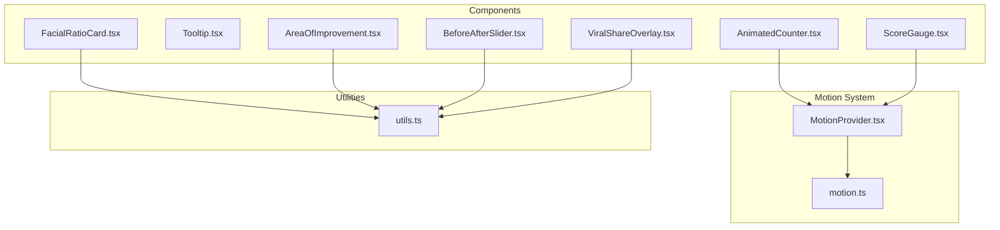
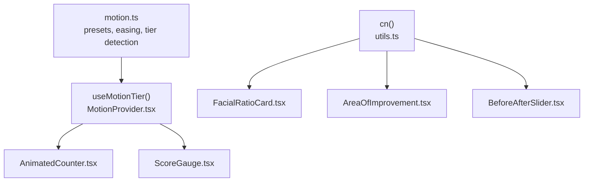
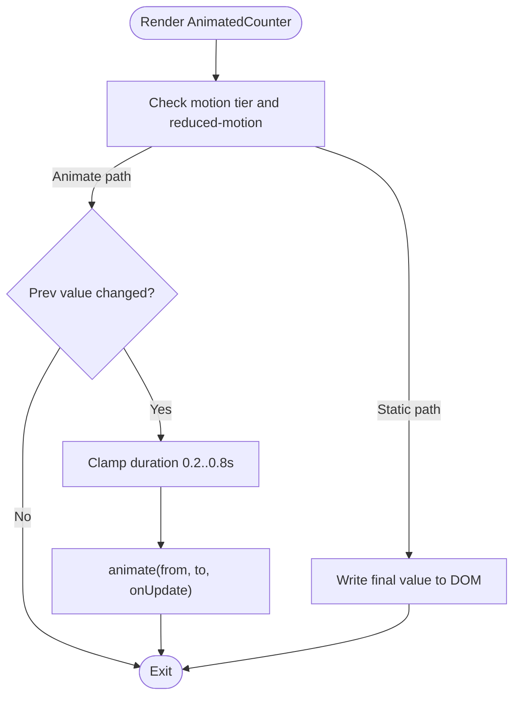
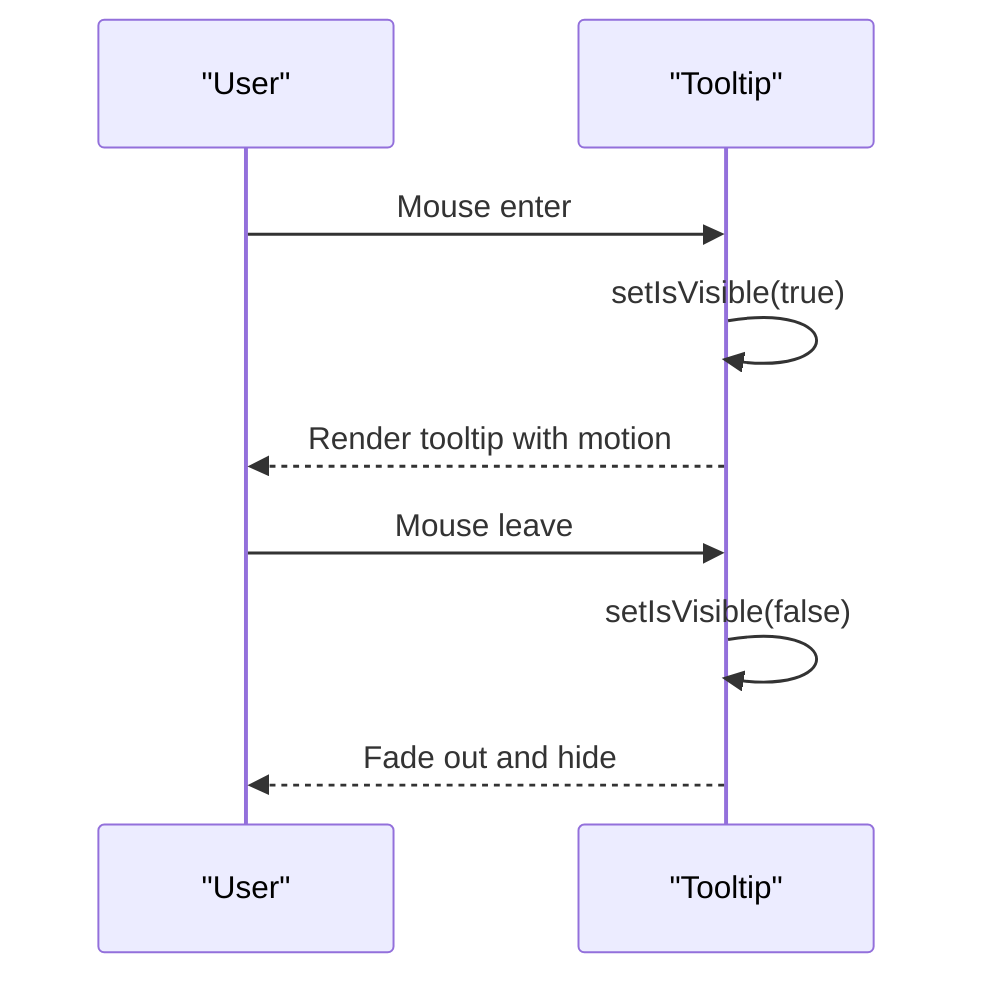
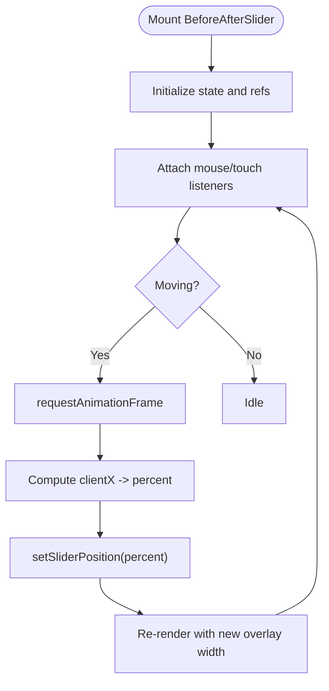
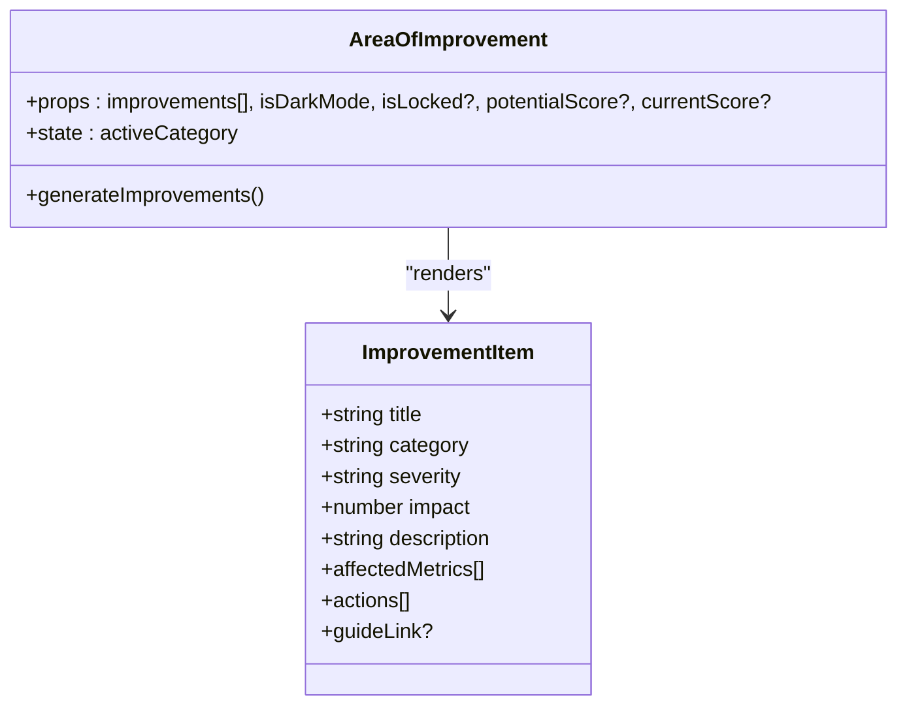
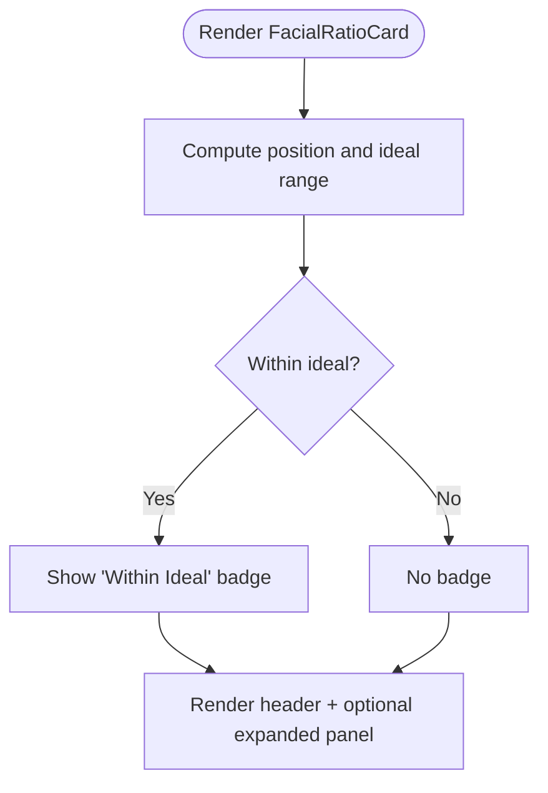
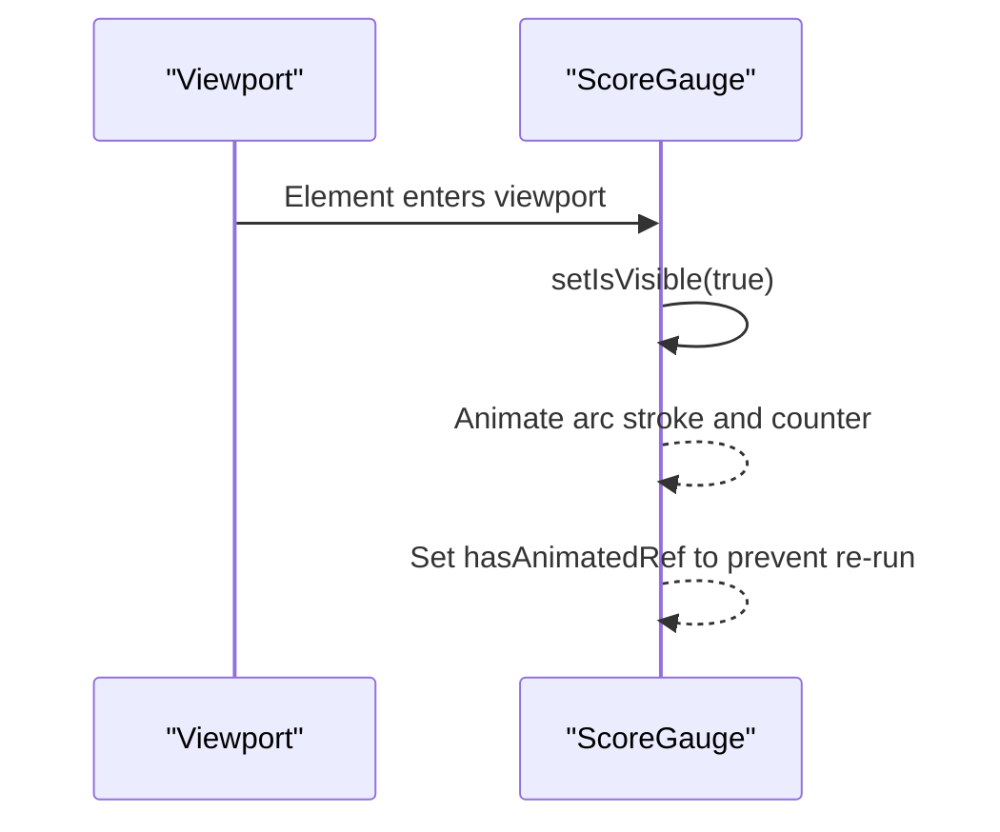
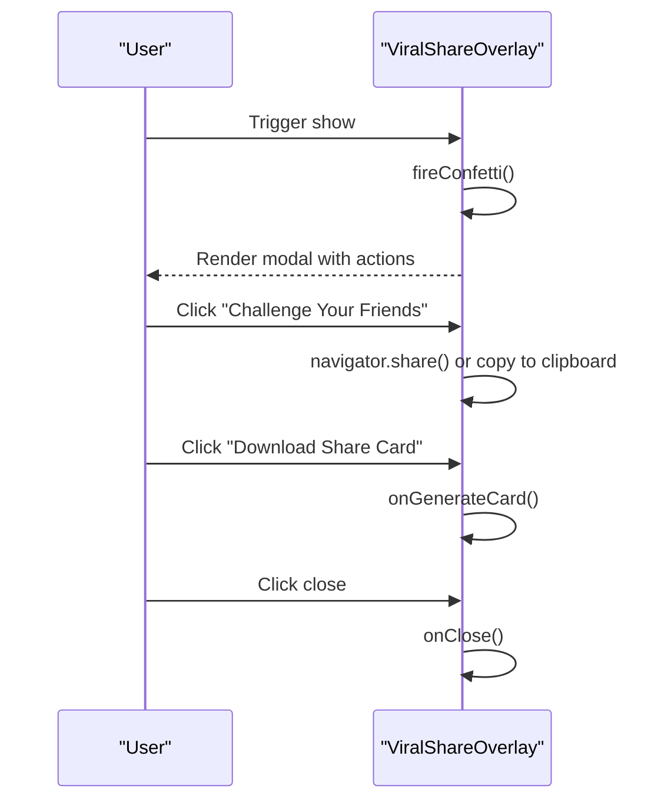
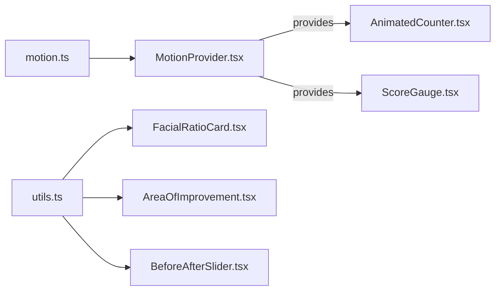

# UI Primitives

<cite>
**Referenced Files in This Document**
- [AnimatedCounter.tsx](file://src/components/AnimatedCounter.tsx)
- [Tooltip.tsx](file://src/components/Tooltip.tsx)
- [BeforeAfterSlider.tsx](file://src/components/BeforeAfterSlider.tsx)
- [AreaOfImprovement.tsx](file://src/components/AreaOfImprovement.tsx)
- [FacialRatioCard.tsx](file://src/components/FacialRatioCard.tsx)
- [ScoreGauge.tsx](file://src/components/ScoreGauge.tsx)
- [ViralShareOverlay.tsx](file://src/components/ViralShareOverlay.tsx)
- [MotionProvider.tsx](file://src/context/MotionProvider.tsx)
- [motion.ts](file://src/lib/motion.ts)
- [utils.ts](file://src/lib/utils.ts)
</cite>

## Table of Contents
1. [Introduction](#introduction)
2. [Project Structure](#project-structure)
3. [Core Components](#core-components)
4. [Architecture Overview](#architecture-overview)
5. [Detailed Component Analysis](#detailed-component-analysis)
6. [Dependency Analysis](#dependency-analysis)
7. [Performance Considerations](#performance-considerations)
8. [Troubleshooting Guide](#troubleshooting-guide)
9. [Conclusion](#conclusion)

## Introduction
This document describes the foundational UI primitive components that power FaceAnalytics Pro’s analytical dashboards and interactive experiences. It focuses on six core primitives:
- AnimatedCounter: smooth numerical transitions with motion tier awareness
- Tooltip: contextual help with light/dark mode variants
- BeforeAfterSlider: image comparison slider for raw vs. processed visuals
- AreaOfImprovement: categorized improvement cards with severity and actions
- FacialRatioCard: detailed facial measurement cards with gradient scales
- ScoreGauge: animated arc gauge for visual score representation
- ViralShareOverlay: social sharing and reward overlays

It explains component props, styling customization, accessibility, responsive behavior, and integration with the motion and design systems. It also outlines extension patterns and best practices for building higher-level components consistently.

## Project Structure
These primitives live under src/components and integrate with:
- Motion system: device tier detection, presets, and reduced-motion preferences
- Utility helpers: Tailwind merging and class composition
- Icons: Lucide React icons for UI affordances

**Diagram sources**
- [AnimatedCounter.tsx:1-66](file://src/components/AnimatedCounter.tsx#L1-L66)
- [Tooltip.tsx:1-36](file://src/components/Tooltip.tsx#L1-L36)
- [BeforeAfterSlider.tsx:1-156](file://src/components/BeforeAfterSlider.tsx#L1-L156)
- [AreaOfImprovement.tsx:1-629](file://src/components/AreaOfImprovement.tsx#L1-L629)
- [FacialRatioCard.tsx:1-495](file://src/components/FacialRatioCard.tsx#L1-L495)
- [ScoreGauge.tsx:1-252](file://src/components/ScoreGauge.tsx#L1-L252)
- [ViralShareOverlay.tsx:1-255](file://src/components/ViralShareOverlay.tsx#L1-L255)
- [MotionProvider.tsx:1-153](file://src/context/MotionProvider.tsx#L1-L153)
- [motion.ts:1-226](file://src/lib/motion.ts#L1-L226)
- [utils.ts:1-7](file://src/lib/utils.ts#L1-L7)

**Section sources**
- [AnimatedCounter.tsx:1-66](file://src/components/AnimatedCounter.tsx#L1-L66)
- [MotionProvider.tsx:1-153](file://src/context/MotionProvider.tsx#L1-L153)
- [motion.ts:1-226](file://src/lib/motion.ts#L1-L226)
- [utils.ts:1-7](file://src/lib/utils.ts#L1-L7)

## Core Components
This section summarizes each primitive’s purpose, key props, and customization points.

- AnimatedCounter
  - Purpose: Smoothly animates numeric counters with motion tier awareness and reduced-motion support.
  - Key props: value, duration, delay, maxDecimals.
  - Behavior: Static on low tiers or reduced motion; otherwise clamped 0.2–0.8s; single-shot re-animation on value change.
  - Accessibility: No special ARIA attributes; relies on surrounding context for meaning.

- Tooltip
  - Purpose: Lightweight contextual tooltip with dark/light mode variants.
  - Key props: content, isDarkMode.
  - Behavior: Appears on hover with subtle entrance/exit animations.

- BeforeAfterSlider
  - Purpose: Interactive slider to compare “before” and “after” images with overlay effects.
  - Key props: beforeImage, afterImage, beforeLabel, afterLabel, className, beforeImagePosition, afterImagePosition.
  - Behavior: Draggable handle updates overlay width; supports mouse and touch; shows labels and hint.

- AreaOfImprovement
  - Purpose: Categorized improvement cards with severity, impact, affected metrics, and recommended actions.
  - Key props: improvements[], isDarkMode, isLocked?, potentialScore?, currentScore?.
  - Behavior: Category tabs, expandable cards, optional lock overlay, and helper generator for structured items.

- FacialRatioCard
  - Purpose: Detailed card for a single facial ratio metric with ideal range, score, and distribution scale.
  - Key props: ratio, isDarkMode, isLocked?, index?.
  - Behavior: Collapsible detail panel, gradient scale bar, and “within ideal” badge.

- ScoreGauge
  - Purpose: Animated arc gauge with glowing tip and center counter.
  - Key props: score, maxScore?, size?, label?, sublabel?, isDarkMode, delay?.
  - Behavior: Intersection-triggered arc animation; one-shot counter tween; color-coded gradient.

- ViralShareOverlay
  - Purpose: Social sharing and download prompt with confetti and emotional messaging.
  - Key props: isVisible, onClose, isDarkMode, overallScore, topPercentile, referralCode?, onGenerateCard, isGeneratingCard, user, onOpenAuth.
  - Behavior: Modal overlay with share/download actions; confetti on first appearance.

**Section sources**
- [AnimatedCounter.tsx:6-31](file://src/components/AnimatedCounter.tsx#L6-L31)
- [Tooltip.tsx:5-8](file://src/components/Tooltip.tsx#L5-L8)
- [BeforeAfterSlider.tsx:10-28](file://src/components/BeforeAfterSlider.tsx#L10-L28)
- [AreaOfImprovement.tsx:29-35](file://src/components/AreaOfImprovement.tsx#L29-L35)
- [FacialRatioCard.tsx:18-36](file://src/components/FacialRatioCard.tsx#L18-L36)
- [ScoreGauge.tsx:7-34](file://src/components/ScoreGauge.tsx#L7-L34)
- [ViralShareOverlay.tsx:7-31](file://src/components/ViralShareOverlay.tsx#L7-L31)

## Architecture Overview
The primitives integrate with a device-tiered motion system that adapts behavior to hardware and user preferences. They rely on shared utilities for class composition and Tailwind-based styling.

**Diagram sources**
- [MotionProvider.tsx:134-152](file://src/context/MotionProvider.tsx#L134-L152)
- [motion.ts:123-134](file://src/lib/motion.ts#L123-L134)
- [utils.ts:4-6](file://src/lib/utils.ts#L4-L6)
- [AnimatedCounter.tsx:26](file://src/components/AnimatedCounter.tsx#L26)
- [ScoreGauge.tsx:35](file://src/components/ScoreGauge.tsx#L35)
- [FacialRatioCard.tsx:64-70](file://src/components/FacialRatioCard.tsx#L64-L70)
- [AreaOfImprovement.tsx:88-94](file://src/components/AreaOfImprovement.tsx#L88-L94)
- [BeforeAfterSlider.tsx:69-72](file://src/components/BeforeAfterSlider.tsx#L69-L72)

## Detailed Component Analysis

### AnimatedCounter
- Props
  - value: number
  - duration?: number (optional override; clamped to ≤ 0.8s)
  - delay?: number
  - maxDecimals?: number
- Behavior
  - Respects motion tier and reduced-motion preference.
  - Single-shot re-animation triggers only when value changes.
  - Uses easing and duration presets from the motion system.
- Styling
  - Renders a span with a static text snapshot; no extra wrapper styles.
- Accessibility
  - No explicit ARIA; ensure the parent context communicates the semantic meaning.

**Diagram sources**
- [AnimatedCounter.tsx:33-62](file://src/components/AnimatedCounter.tsx#L33-L62)
- [motion.ts:27-31](file://src/lib/motion.ts#L27-L31)

**Section sources**
- [AnimatedCounter.tsx:6-31](file://src/components/AnimatedCounter.tsx#L6-L31)
- [AnimatedCounter.tsx:33-62](file://src/components/AnimatedCounter.tsx#L33-L62)
- [motion.ts:27-31](file://src/lib/motion.ts#L27-L31)

### Tooltip
- Props
  - content: string
  - isDarkMode: boolean
- Behavior
  - Controlled visibility on hover; animated entrance/exit.
  - Absolute positioning with centered placement.
- Styling
  - Dark/light mode variants via conditional classes.
- Accessibility
  - Consider adding aria-describedby or role="tooltip" if used as a standalone element.

**Diagram sources**
- [Tooltip.tsx:10-35](file://src/components/Tooltip.tsx#L10-L35)

**Section sources**
- [Tooltip.tsx:5-8](file://src/components/Tooltip.tsx#L5-L8)
- [Tooltip.tsx:10-35](file://src/components/Tooltip.tsx#L10-L35)

### BeforeAfterSlider
- Props
  - beforeImage, afterImage: strings
  - beforeLabel?, afterLabel?: strings
  - className?: string
  - beforeImagePosition?, afterImagePosition?: string
- Behavior
  - Tracks mouse/touch movement; clamps slider position to container bounds.
  - Uses requestAnimationFrame to throttle updates.
  - Adds analysis overlay and simulated landmark dots.
- Styling
  - Responsive aspect ratio; rounded corners; draggable handle with visual feedback.
- Accessibility
  - Keyboard navigation not implemented; ensure alternative controls if needed.

**Diagram sources**
- [BeforeAfterSlider.tsx:34-64](file://src/components/BeforeAfterSlider.tsx#L34-L64)
- [BeforeAfterSlider.tsx:66-155](file://src/components/BeforeAfterSlider.tsx#L66-L155)

**Section sources**
- [BeforeAfterSlider.tsx:10-28](file://src/components/BeforeAfterSlider.tsx#L10-L28)
- [BeforeAfterSlider.tsx:34-64](file://src/components/BeforeAfterSlider.tsx#L34-L64)
- [BeforeAfterSlider.tsx:66-155](file://src/components/BeforeAfterSlider.tsx#L66-L155)

### AreaOfImprovement
- Props
  - improvements: ImprovementItem[]
  - isDarkMode: boolean
  - isLocked?: boolean
  - potentialScore?: number
  - currentScore?: number
- Behavior
  - Category tabs with counts; filtered lists; severity-based styling; lock overlay.
  - Expandable cards with animated entrances; layout animations via AnimatePresence.
- Helpers
  - generateImprovements: transforms analysis data into structured items with severity and actions.

**Diagram sources**
- [AreaOfImprovement.tsx:18-35](file://src/components/AreaOfImprovement.tsx#L18-L35)
- [AreaOfImprovement.tsx:304-487](file://src/components/AreaOfImprovement.tsx#L304-L487)

**Section sources**
- [AreaOfImprovement.tsx:29-35](file://src/components/AreaOfImprovement.tsx#L29-L35)
- [AreaOfImprovement.tsx:304-487](file://src/components/AreaOfImprovement.tsx#L304-L487)
- [AreaOfImprovement.tsx:492-628](file://src/components/AreaOfImprovement.tsx#L492-L628)

### FacialRatioCard
- Props
  - ratio: RatioData
  - isDarkMode: boolean
  - isLocked?: boolean
  - index?: number
- Behavior
  - Collapsible detail panel; gradient scale bar with ideal zone and marker; “within ideal” badge.
  - Score colorization based on value; viewport-triggered entrance.
- Helpers
  - generateRatioData: builds RatioData from metrics and breakdown.

**Diagram sources**
- [FacialRatioCard.tsx:39-56](file://src/components/FacialRatioCard.tsx#L39-L56)
- [FacialRatioCard.tsx:58-368](file://src/components/FacialRatioCard.tsx#L58-L368)

**Section sources**
- [FacialRatioCard.tsx:18-36](file://src/components/FacialRatioCard.tsx#L18-L36)
- [FacialRatioCard.tsx:39-56](file://src/components/FacialRatioCard.tsx#L39-L56)
- [FacialRatioCard.tsx:58-368](file://src/components/FacialRatioCard.tsx#L58-L368)
- [FacialRatioCard.tsx:374-494](file://src/components/FacialRatioCard.tsx#L374-L494)

### ScoreGauge
- Props
  - score, maxScore?, size?, label?, sublabel?, isDarkMode, delay?
- Behavior
  - Intersection observer triggers arc animation; one-shot counter tween with clamped duration.
  - Dynamic gradient stroke and glow tip; tick marks along arc.
- Styling
  - SVG-based; responsive sizing; color-coded based on score range.

**Diagram sources**
- [ScoreGauge.tsx:42-56](file://src/components/ScoreGauge.tsx#L42-L56)
- [ScoreGauge.tsx:77-114](file://src/components/ScoreGauge.tsx#L77-L114)
- [ScoreGauge.tsx:119-250](file://src/components/ScoreGauge.tsx#L119-L250)

**Section sources**
- [ScoreGauge.tsx:7-34](file://src/components/ScoreGauge.tsx#L7-L34)
- [ScoreGauge.tsx:42-56](file://src/components/ScoreGauge.tsx#L42-L56)
- [ScoreGauge.tsx:77-114](file://src/components/ScoreGauge.tsx#L77-L114)
- [ScoreGauge.tsx:119-250](file://src/components/ScoreGauge.tsx#L119-L250)

### ViralShareOverlay
- Props
  - isVisible, onClose, isDarkMode, overallScore, topPercentile, referralCode?, onGenerateCard, isGeneratingCard, user, onOpenAuth
- Behavior
  - Modal overlay with confetti on first appearance; dynamic emotional message based on score; share via Web Share API or clipboard; download/share card action.
- Accessibility
  - Includes close button with aria-label; ensure focus management and keyboard close support if extended.

**Diagram sources**
- [ViralShareOverlay.tsx:36-41](file://src/components/ViralShareOverlay.tsx#L36-L41)
- [ViralShareOverlay.tsx:46-63](file://src/components/ViralShareOverlay.tsx#L46-L63)
- [ViralShareOverlay.tsx:94-254](file://src/components/ViralShareOverlay.tsx#L94-L254)

**Section sources**
- [ViralShareOverlay.tsx:7-31](file://src/components/ViralShareOverlay.tsx#L7-L31)
- [ViralShareOverlay.tsx:36-41](file://src/components/ViralShareOverlay.tsx#L36-L41)
- [ViralShareOverlay.tsx:46-63](file://src/components/ViralShareOverlay.tsx#L46-L63)
- [ViralShareOverlay.tsx:94-254](file://src/components/ViralShareOverlay.tsx#L94-L254)

## Dependency Analysis
- Motion integration
  - useMotionTier provides tier, flags, and durations; primitives gate animations accordingly.
  - Reduced-motion preference disables tweens and reduces decorative motion.
- Utilities
  - cn merges and tidies Tailwind classes; used across primitives for consistent styling.
- Icons
  - Lucide React icons are used for affordances; ensure icon sizes match component scale.

**Diagram sources**
- [MotionProvider.tsx:134-152](file://src/context/MotionProvider.tsx#L134-L152)
- [motion.ts:123-134](file://src/lib/motion.ts#L123-L134)
- [utils.ts:4-6](file://src/lib/utils.ts#L4-L6)
- [AnimatedCounter.tsx:26](file://src/components/AnimatedCounter.tsx#L26)
- [ScoreGauge.tsx:35](file://src/components/ScoreGauge.tsx#L35)
- [FacialRatioCard.tsx:64-70](file://src/components/FacialRatioCard.tsx#L64-L70)
- [AreaOfImprovement.tsx:88-94](file://src/components/AreaOfImprovement.tsx#L88-L94)
- [BeforeAfterSlider.tsx:69-72](file://src/components/BeforeAfterSlider.tsx#L69-L72)

**Section sources**
- [MotionProvider.tsx:134-152](file://src/context/MotionProvider.tsx#L134-L152)
- [motion.ts:123-134](file://src/lib/motion.ts#L123-L134)
- [utils.ts:4-6](file://src/lib/utils.ts#L4-L6)

## Performance Considerations
- Device-tiered motion
  - Low tier: minimal animations, reduced motion flags, and shorter durations.
  - Mid/high tiers: richer motion with layout springs and counters enabled conditionally.
- Animation budgets
  - Concurrency and per-screen limits enforced by the motion budget; primitives avoid re-triggering animations unnecessarily.
- Rendering cost
  - AnimatedCounter and ScoreGauge use one-shot guards to prevent repeated animations.
  - BeforeAfterSlider throttles updates with requestAnimationFrame and controlled re-renders.
- Accessibility
  - Respect reduced-motion preferences; avoid motion where it causes discomfort.

[No sources needed since this section provides general guidance]

## Troubleshooting Guide
- Animations not playing
  - Verify MotionProvider wraps the app and that tier is detected correctly.
  - Check prefers-reduced-motion setting; primitives intentionally disable tweens when enabled.
- Counter not updating
  - Ensure value prop changes; AnimatedCounter only re-animates on value change.
  - Confirm duration is not clamped to an unintended value.
- Gauge not animating
  - Ensure the element intersects the viewport; ScoreGauge uses intersection observer to trigger.
  - Confirm delay is not excessively long and that flags enable counter tween.
- Slider not responding
  - On mobile, ensure passive touch events are supported; the component handles touchmove.
  - Avoid nested scroll containers that might intercept events.
- Tooltip not visible
  - Confirm isDarkMode toggles appropriate classes; ensure parent has sufficient space for absolute positioning.

**Section sources**
- [MotionProvider.tsx:56-63](file://src/context/MotionProvider.tsx#L56-L63)
- [AnimatedCounter.tsx:33-62](file://src/components/AnimatedCounter.tsx#L33-L62)
- [ScoreGauge.tsx:42-56](file://src/components/ScoreGauge.tsx#L42-L56)
- [BeforeAfterSlider.tsx:34-64](file://src/components/BeforeAfterSlider.tsx#L34-L64)
- [Tooltip.tsx:10-35](file://src/components/Tooltip.tsx#L10-L35)

## Conclusion
These UI primitives form the backbone of FaceAnalytics Pro’s analytical presentation and engagement features. They are designed to be:
- Motion-aware and accessible
- Styling-consistent via shared utilities and design tokens
- Performant across tiers of devices
- Extensible to build higher-level components such as dashboards, insights panels, and onboarding flows

By following the patterns shown—tier-aware animations, controlled re-renders, and robust styling—you can reliably compose new components that feel cohesive and performant across the application.