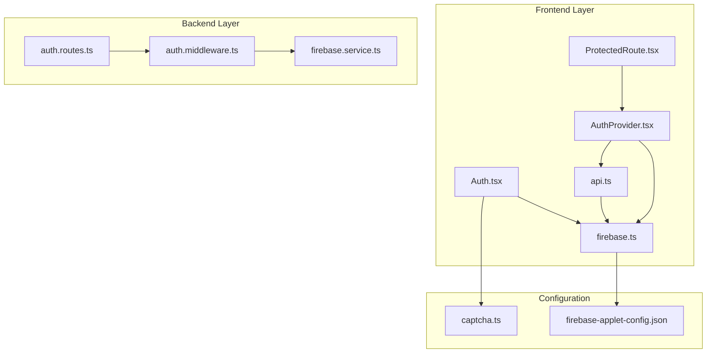
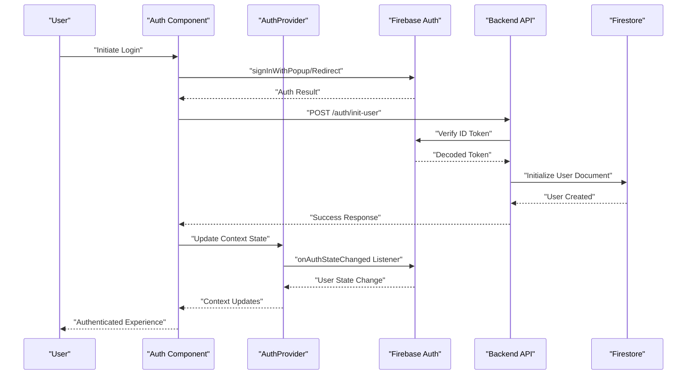
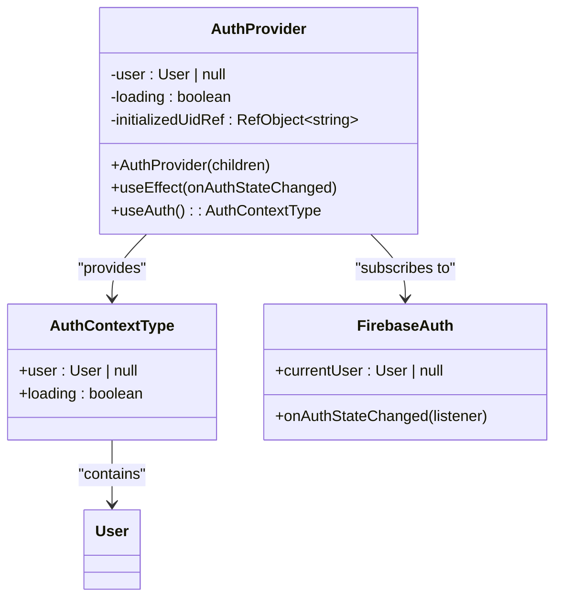
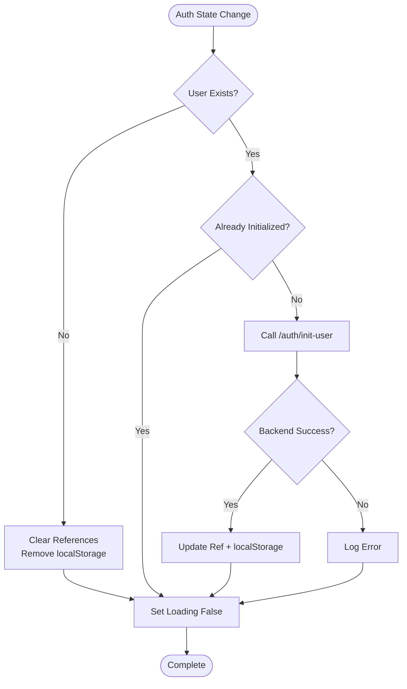
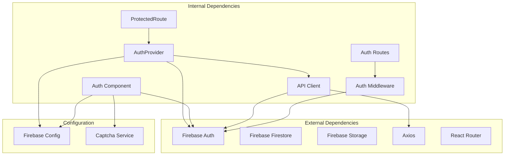

# AuthProvider

<cite>
**Referenced Files in This Document**
- [AuthProvider.tsx](file://src/context/AuthProvider.tsx)
- [firebase.ts](file://src/firebase.ts)
- [Auth.tsx](file://src/components/Auth.tsx)
- [ProtectedRoute.tsx](file://src/routes/ProtectedRoute.tsx)
- [api.ts](file://src/lib/api.ts)
- [auth.routes.ts](file://backend/routes/auth.routes.ts)
- [auth.middleware.ts](file://backend/middleware/auth.middleware.ts)
- [firebase.service.ts](file://backend/services/firebase.service.ts)
- [App.tsx](file://src/App.tsx)
- [captcha.ts](file://src/lib/captcha.ts)
- [firebase-applet-config.json](file://firebase-applet-config.json)
</cite>

## Table of Contents
1. [Introduction](#introduction)
2. [Project Structure](#project-structure)
3. [Core Components](#core-components)
4. [Architecture Overview](#architecture-overview)
5. [Detailed Component Analysis](#detailed-component-analysis)
6. [Dependency Analysis](#dependency-analysis)
7. [Performance Considerations](#performance-considerations)
8. [Troubleshooting Guide](#troubleshooting-guide)
9. [Security Considerations](#security-considerations)
10. [Best Practices](#best-practices)
11. [Conclusion](#conclusion)

## Introduction

The AuthProvider component is the cornerstone of authentication state management in FaceAnalytics Pro. It serves as a centralized authentication context that integrates Firebase Authentication with the frontend application state, providing seamless user session management, login/logout workflows, and protected route handling. This component ensures that user authentication state is consistently maintained across component re-renders and provides a robust foundation for the entire authentication ecosystem.

The AuthProvider coordinates with Firebase Authentication to manage user sessions, handles authentication callbacks, maintains user state persistence, and integrates with backend authentication endpoints for secure user initialization. It also provides custom hooks for consuming authentication state throughout the application and implements sophisticated caching mechanisms to optimize performance while maintaining security.

## Project Structure

The authentication system is organized across multiple layers within the FaceAnalytics Pro application:



**Diagram sources**
- [AuthProvider.tsx:1-75](file://src/context/AuthProvider.tsx#L1-L75)
- [firebase.ts:1-21](file://src/firebase.ts#L1-L21)
- [Auth.tsx:1-696](file://src/components/Auth.tsx#L1-L696)
- [ProtectedRoute.tsx:1-22](file://src/routes/ProtectedRoute.tsx#L1-L22)
- [api.ts:1-36](file://src/lib/api.ts#L1-L36)
- [auth.routes.ts:1-91](file://backend/routes/auth.routes.ts#L1-L91)
- [auth.middleware.ts:1-40](file://backend/middleware/auth.middleware.ts#L1-L40)
- [firebase.service.ts:1-120](file://backend/services/firebase.service.ts#L1-L120)
- [firebase-applet-config.json:1-10](file://firebase-applet-config.json#L1-L10)
- [captcha.ts:1-25](file://src/lib/captcha.ts#L1-L25)

**Section sources**
- [AuthProvider.tsx:1-75](file://src/context/AuthProvider.tsx#L1-L75)
- [App.tsx:456-473](file://src/App.tsx#L456-L473)

## Core Components

The authentication system consists of several interconnected components that work together to provide comprehensive authentication functionality:

### AuthProvider Context
The AuthProvider serves as the central authentication state manager, utilizing Firebase Authentication's `onAuthStateChanged` listener to monitor user authentication state changes. It maintains both in-memory and persistent state caches to optimize performance while ensuring security.

### Firebase Configuration
The firebase.ts module initializes Firebase services including Authentication, Firestore, and Storage, providing the foundational infrastructure for all authentication operations.

### Authentication UI Components
The Auth component provides a comprehensive authentication interface supporting both email/password and Google OAuth authentication methods, with built-in CAPTCHA verification and error handling.

### Protected Route System
The ProtectedRoute component enforces authentication requirements for sensitive application areas, providing loading states and redirect mechanisms for unauthorized access attempts.

### Backend Authentication Services
The backend authentication routes and middleware provide server-side validation, user initialization, and security enforcement using Firebase Admin SDK.

**Section sources**
- [AuthProvider.tsx:6-11](file://src/context/AuthProvider.tsx#L6-L11)
- [firebase.ts:1-21](file://src/firebase.ts#L1-L21)
- [Auth.tsx:31-37](file://src/components/Auth.tsx#L31-L37)
- [ProtectedRoute.tsx:5-21](file://src/routes/ProtectedRoute.tsx#L5-L21)
- [auth.routes.ts:23-88](file://backend/routes/auth.routes.ts#L23-L88)

## Architecture Overview

The authentication architecture follows a multi-layered approach that separates concerns between frontend state management, backend validation, and user interface components:



**Diagram sources**
- [AuthProvider.tsx:18-63](file://src/context/AuthProvider.tsx#L18-L63)
- [Auth.tsx:133-183](file://src/components/Auth.tsx#L133-L183)
- [auth.routes.ts:23-88](file://backend/routes/auth.routes.ts#L23-L88)

The architecture implements several key patterns:

1. **Centralized State Management**: All authentication state is managed in a single context provider
2. **Dual Caching Strategy**: Uses both in-memory and localStorage caching for optimal performance
3. **Backend Synchronization**: Ensures frontend and backend user states remain synchronized
4. **Error Resilience**: Implements fallback mechanisms for various failure scenarios

## Detailed Component Analysis

### AuthProvider Implementation

The AuthProvider component implements a sophisticated authentication state management system with the following key features:

#### State Management Architecture



**Diagram sources**
- [AuthProvider.tsx:6-11](file://src/context/AuthProvider.tsx#L6-L11)
- [AuthProvider.tsx:13-66](file://src/context/AuthProvider.tsx#L13-L66)

#### Initialization Caching Strategy

The AuthProvider implements a two-tier caching mechanism to optimize performance while maintaining security:

1. **Per-tab Cache**: Uses `useRef` to track initialized user IDs within the current browser tab
2. **Cross-session Cache**: Utilizes localStorage to persist initialization state across browser sessions

The caching strategy prevents redundant backend calls for users who have already been initialized, crucial for managing Firestore read quotas on the free tier.

#### Authentication State Flow



**Diagram sources**
- [AuthProvider.tsx:18-63](file://src/context/AuthProvider.tsx#L18-L63)

**Section sources**
- [AuthProvider.tsx:13-66](file://src/context/AuthProvider.tsx#L13-L66)

### Firebase Integration

The Firebase integration provides a comprehensive authentication foundation through the firebase.ts module:

#### Service Initialization

The firebase.ts module initializes multiple Firebase services with specific configurations:

- **Authentication**: Configured with popup redirect resolver for enhanced user experience
- **Firestore**: Optimized for production with HTTP/1.1 transport settings
- **Storage**: Standard Firebase Storage configuration

#### Security Configuration

The Firebase configuration includes several security enhancements:

- **Transport Optimization**: Firestore configured to use HTTP/1.1 instead of gRPC for serverless environments
- **Environment Awareness**: Different initialization strategies for development vs production
- **Error Handling**: Graceful degradation in development environments

**Section sources**
- [firebase.ts:1-21](file://src/firebase.ts#L1-L21)
- [firebase.service.ts:75-111](file://backend/services/firebase.service.ts#L75-L111)

### Authentication UI Component

The Auth component provides a comprehensive authentication interface supporting multiple authentication methods:

#### Multi-Factor Authentication Support

The authentication UI supports both email/password and Google OAuth authentication:

- **Email/Password**: Standard credential-based authentication with CAPTCHA verification
- **Google OAuth**: Popup-based authentication with automatic redirect fallback
- **CAPTCHA Integration**: Built-in Cloudflare Turnstile integration for bot protection

#### Error Handling and User Experience

The authentication component implements sophisticated error handling:

- **Popup Blocked Detection**: Automatic fallback from popup to redirect authentication
- **Domain Validation**: Checks for authorized domains
- **Network Error Handling**: Graceful handling of network connectivity issues
- **User-Cancelled Operations**: Proper handling of user-initiated cancellations

#### Welcome Flow Integration

The Auth component coordinates with the backend initialization process:

- **Token Retrieval**: Fetches Firebase ID tokens for backend verification
- **User Initialization**: Calls `/auth/init-user` endpoint for backend user creation
- **Welcome Email**: Sends welcome emails for new users
- **Referral Integration**: Supports referral code redemption during signup

**Section sources**
- [Auth.tsx:133-183](file://src/components/Auth.tsx#L133-L183)
- [Auth.tsx:88-116](file://src/components/Auth.tsx#L88-L116)
- [Auth.tsx:185-248](file://src/components/Auth.tsx#L185-L248)

### Protected Route System

The ProtectedRoute component provides authentication enforcement for sensitive application areas:

#### Loading State Management

The ProtectedRoute component implements intelligent loading state management:

- **Loading Indication**: Displays spinner while authentication state is being determined
- **Graceful Degradation**: Handles loading states without blocking user experience
- **State Consistency**: Ensures consistent behavior across route transitions

#### Authentication Enforcement

Protected routes enforce authentication requirements:

- **User Presence Check**: Redirects unauthenticated users to landing page
- **Loading State Handling**: Prevents navigation during authentication resolution
- **Child Component Rendering**: Renders protected content when authentication is established

**Section sources**
- [ProtectedRoute.tsx:5-21](file://src/routes/ProtectedRoute.tsx#L5-L21)

### Backend Authentication Services

The backend authentication system provides server-side validation and user management:

#### User Initialization Process

The `/auth/init-user` endpoint implements a secure user initialization process:

- **Token Verification**: Validates Firebase ID tokens using Admin SDK
- **User Existence Check**: Checks Firestore for existing user documents
- **Document Creation**: Creates user documents with default attributes
- **Cache Management**: Maintains in-memory cache for improved performance

#### Security Measures

The backend implements multiple security layers:

- **Rate Limiting**: 5 requests per 15 minutes for authentication endpoints
- **Token Verification**: Server-side verification of Firebase ID tokens
- **Environment Awareness**: Different behavior in development vs production
- **Error Handling**: Graceful error handling with appropriate HTTP status codes

**Section sources**
- [auth.routes.ts:23-88](file://backend/routes/auth.routes.ts#L23-L88)
- [auth.middleware.ts:18-39](file://backend/middleware/auth.middleware.ts#L18-L39)

## Dependency Analysis

The authentication system exhibits well-managed dependencies with clear separation of concerns:



**Diagram sources**
- [AuthProvider.tsx:1-6](file://src/context/AuthProvider.tsx#L1-L6)
- [Auth.tsx:27-29](file://src/components/Auth.tsx#L27-L29)
- [api.ts:1-7](file://src/lib/api.ts#L1-L7)
- [auth.routes.ts:1-8](file://backend/routes/auth.routes.ts#L1-L8)
- [auth.middleware.ts:1-3](file://backend/middleware/auth.middleware.ts#L1-L3)

### Component Coupling Analysis

The authentication system demonstrates excellent modularity with minimal coupling between components:

- **AuthProvider**: Independent of UI components, focusing solely on state management
- **Auth Component**: Self-contained authentication UI with clear boundaries
- **ProtectedRoute**: Pure routing component with no external dependencies
- **API Client**: Encapsulated HTTP client with authentication integration

### Circular Dependency Prevention

The system avoids circular dependencies through careful architectural decisions:

- **Context Provider Pattern**: Centralized state management prevents mutual dependencies
- **Service Layer Separation**: Backend services operate independently of frontend components
- **Configuration Isolation**: Firebase configuration is isolated from business logic

**Section sources**
- [AuthProvider.tsx:1-75](file://src/context/AuthProvider.tsx#L1-L75)
- [App.tsx:456-473](file://src/App.tsx#L456-L473)

## Performance Considerations

The authentication system implements several performance optimization strategies:

### Caching Strategy

The dual caching mechanism optimizes performance while maintaining security:

- **Per-tab Cache**: Prevents redundant backend calls within the same browser tab
- **Cross-session Cache**: Persists initialization state across browser restarts
- **Cache Validation**: Uses localStorage to validate cached initialization status

### Network Optimization

Several network optimization techniques are employed:

- **Lazy Loading**: Authentication components are loaded on-demand
- **Efficient API Calls**: Minimizes unnecessary backend requests
- **Connection Pooling**: Axios interceptor manages connection reuse

### Memory Management

The system implements proper memory management:

- **Cleanup Functions**: All event listeners are properly cleaned up
- **Reference Management**: useRef provides efficient state persistence
- **Component Lifecycle**: Proper cleanup in useEffect return functions

**Section sources**
- [AuthProvider.tsx:18-63](file://src/context/AuthProvider.tsx#L18-L63)
- [api.ts:9-33](file://src/lib/api.ts#L9-L33)

## Troubleshooting Guide

### Common Authentication Issues

#### Authentication State Not Persisting

**Symptoms**: Users appear logged out after page refresh
**Causes**: 
- localStorage access blocked by browser settings
- Firebase authentication state not properly detected
- Backend initialization failures

**Solutions**:
- Verify localStorage availability in browser settings
- Check Firebase authentication state synchronization
- Monitor backend initialization logs for errors

#### Google Authentication Failures

**Symptoms**: Google login redirects fail or popup blockers trigger
**Causes**:
- Popup blocked by browser extensions
- Unauthorized domain configuration
- Network connectivity issues

**Solutions**:
- Implement automatic redirect fallback for popup failures
- Verify authDomain configuration matches Firebase console
- Test network connectivity and CORS settings

#### Backend Initialization Errors

**Symptoms**: New users cannot access protected features
**Causes**:
- Firestore initialization failures
- Firebase Admin SDK configuration issues
- Rate limiting restrictions

**Solutions**:
- Verify Firebase Admin credentials are properly configured
- Check Firestore permissions and database availability
- Monitor rate limit usage and adjust accordingly

### Debugging Authentication Flows

#### Frontend Debugging

Enable detailed logging in the AuthProvider to trace authentication state changes:

```javascript
// Add logging to track authentication state transitions
console.log('User state changed:', currentUser);
console.log('Initialization cache:', initializedUidRef.current);
```

#### Backend Debugging

Monitor backend authentication endpoints for proper token verification:

```javascript
// Enable detailed logging in auth middleware
console.log('Token verification result:', decodedToken);
console.log('User initialization status:', userDoc.exists);
```

**Section sources**
- [AuthProvider.tsx:48-50](file://src/context/AuthProvider.tsx#L48-L50)
- [Auth.tsx:152-182](file://src/components/Auth.tsx#L152-L182)
- [auth.routes.ts:75-87](file://backend/routes/auth.routes.ts#L75-L87)

## Security Considerations

### Token Management

The authentication system implements secure token management practices:

- **Automatic Token Refresh**: Axios interceptor automatically refreshes Firebase ID tokens
- **Secure Storage**: Tokens are stored in memory rather than localStorage
- **Token Validation**: Backend verifies all incoming ID tokens before processing requests

### Session Security

Several security measures protect user sessions:

- **Short-lived Tokens**: Firebase ID tokens are automatically managed by Firebase SDK
- **Session Monitoring**: onAuthStateChanged listener detects unauthorized session changes
- **Rate Limiting**: Backend implements rate limiting to prevent abuse

### Data Protection

The system implements comprehensive data protection measures:

- **Encrypted Communication**: All authentication data transmitted over HTTPS
- **Minimal Data Exposure**: Only necessary user data is stored and transmitted
- **Access Control**: Strict backend validation prevents unauthorized access

### Error Handling Security

Security-conscious error handling prevents information leakage:

- **Generic Error Messages**: User-friendly error messages hide technical details
- **Selective Logging**: Sensitive information is not logged to prevent exposure
- **Graceful Degradation**: System continues functioning even when individual components fail

**Section sources**
- [api.ts:9-29](file://src/lib/api.ts#L9-L29)
- [auth.middleware.ts:18-39](file://backend/middleware/auth.middleware.ts#L18-L39)
- [Auth.tsx:152-182](file://src/components/Auth.tsx#L152-L182)

## Best Practices

### Authentication State Management

Follow these best practices for authentication state management:

1. **Centralized State**: Use a single AuthProvider for all authentication state
2. **Consistent Patterns**: Apply uniform authentication patterns across all components
3. **Error Boundaries**: Implement proper error handling for all authentication flows
4. **Loading States**: Always provide feedback during authentication operations

### Performance Optimization

Implement these performance optimization strategies:

1. **Caching Strategy**: Use dual caching for optimal performance while maintaining security
2. **Lazy Loading**: Load authentication components only when needed
3. **Efficient APIs**: Minimize backend calls and optimize API usage
4. **Memory Management**: Properly clean up event listeners and references

### Security Implementation

Adopt these security best practices:

1. **Token Verification**: Always verify tokens on the backend
2. **Rate Limiting**: Implement rate limiting for all authentication endpoints
3. **Input Validation**: Validate all user inputs and authentication data
4. **Error Handling**: Hide sensitive information in error messages

### User Experience

Focus on these user experience improvements:

1. **Progressive Enhancement**: Provide fallbacks for different authentication methods
2. **Clear Feedback**: Always inform users about authentication status
3. **Accessibility**: Ensure authentication flows are accessible to all users
4. **Performance**: Optimize authentication for fast user experiences

## Conclusion

The AuthProvider component in FaceAnalytics Pro represents a comprehensive and well-architected authentication solution that effectively integrates Firebase Authentication with React's state management patterns. Through its sophisticated caching strategy, robust error handling, and secure backend integration, it provides a reliable foundation for user authentication across the entire application.

The system's modular design ensures maintainability while its performance optimizations demonstrate careful consideration of real-world usage patterns. The combination of frontend state management, backend validation, and user interface components creates a cohesive authentication experience that balances security, performance, and usability.

Key strengths of the implementation include the dual caching mechanism that optimizes performance while maintaining security, the comprehensive error handling that provides graceful degradation, and the clean separation of concerns that enables easy maintenance and extension. The AuthProvider serves as an exemplary model for authentication state management in modern React applications, particularly those requiring integration with Firebase Authentication and serverless backend architectures.