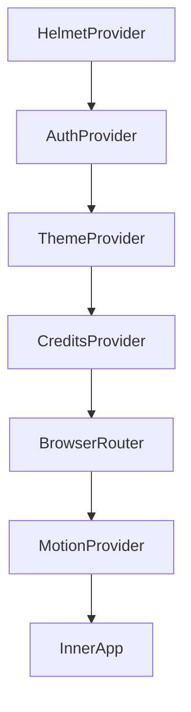
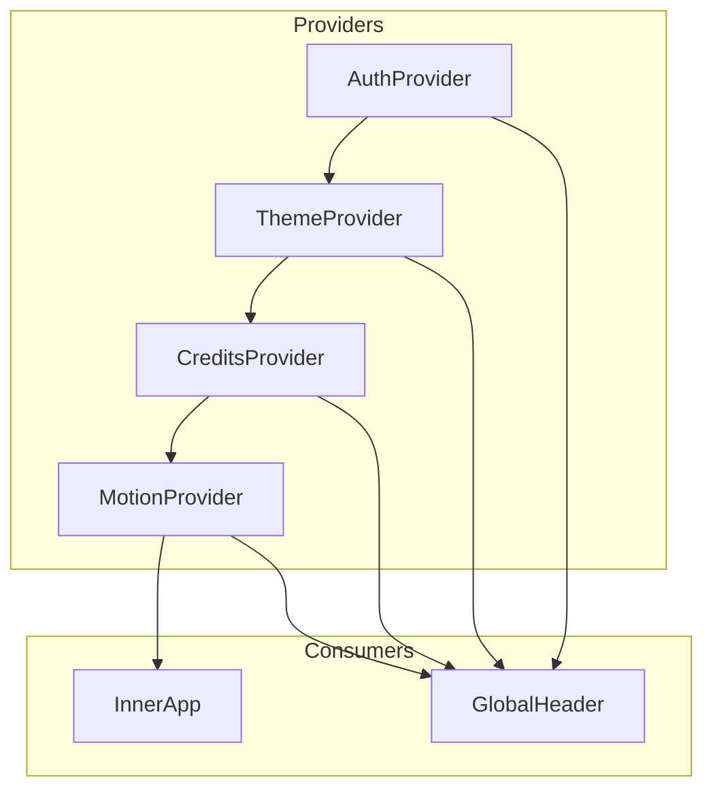
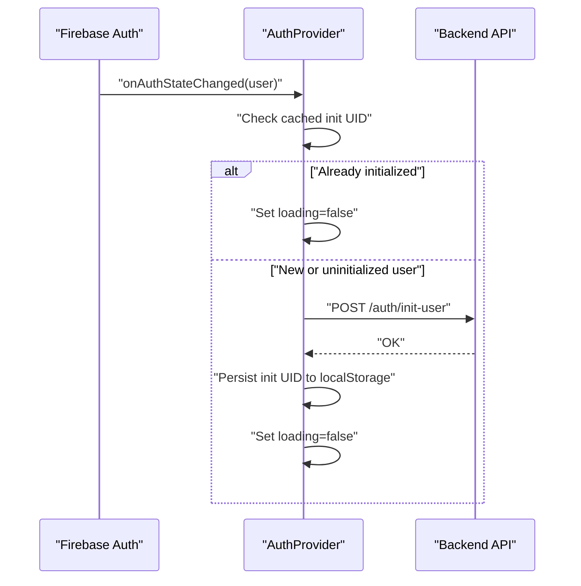
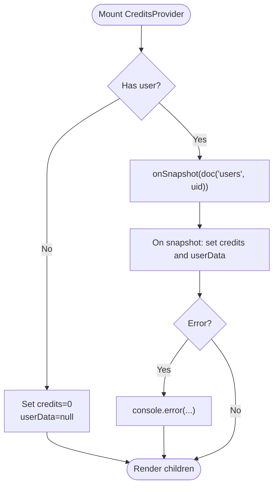
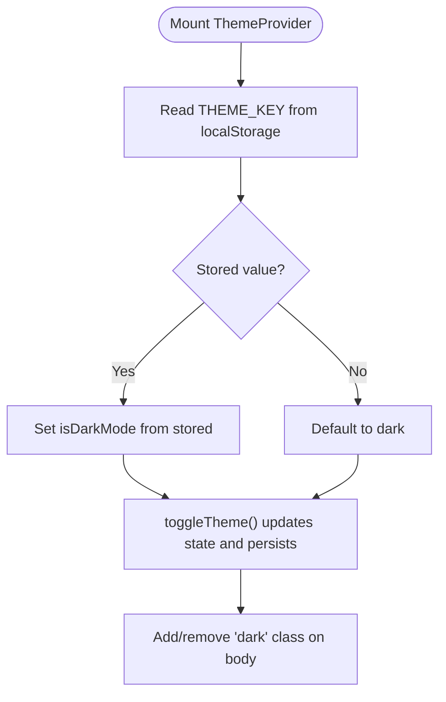
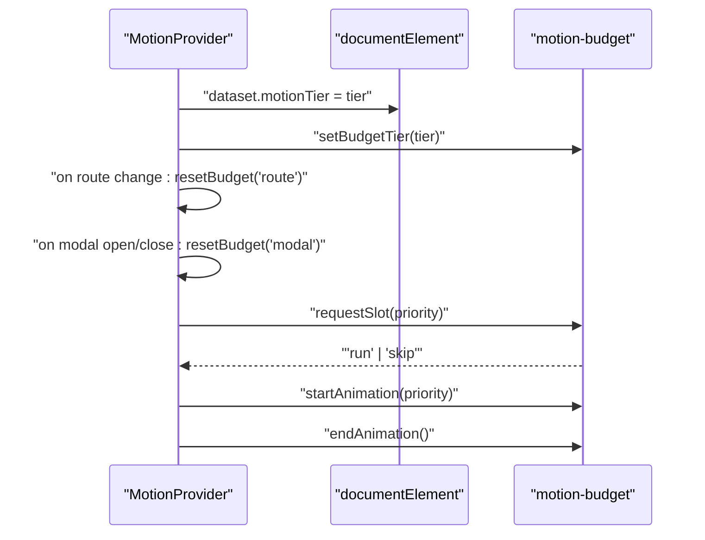
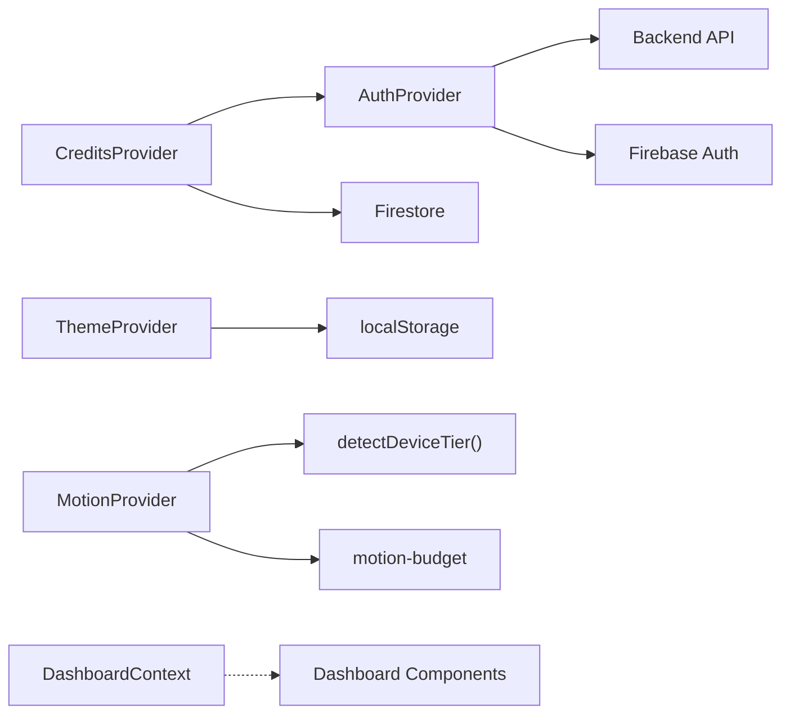

# Context Providers

<cite>
**Referenced Files in This Document**
- [AuthProvider.tsx](file://src/context/AuthProvider.tsx)
- [CreditsProvider.tsx](file://src/context/CreditsProvider.tsx)
- [ThemeProvider.tsx](file://src/context/ThemeProvider.tsx)
- [MotionProvider.tsx](file://src/context/MotionProvider.tsx)
- [DashboardContext.tsx](file://src/context/DashboardContext.tsx)
- [App.tsx](file://src/App.tsx)
- [GlobalHeader.tsx](file://src/components/GlobalHeader.tsx)
- [motion.ts](file://src/lib/motion.ts)
- [motion-budget.ts](file://src/lib/motion-budget.ts)
- [ErrorBoundary.tsx](file://src/components/ErrorBoundary.tsx)
- [MOTION.md](file://docs/MOTION.md)
</cite>

## Table of Contents
1. [Introduction](#introduction)
2. [Project Structure](#project-structure)
3. [Core Components](#core-components)
4. [Architecture Overview](#architecture-overview)
5. [Detailed Component Analysis](#detailed-component-analysis)
6. [Dependency Analysis](#dependency-analysis)
7. [Performance Considerations](#performance-considerations)
8. [Troubleshooting Guide](#troubleshooting-guide)
9. [Conclusion](#conclusion)

## Introduction
This document explains the React context providers system in FaceAnalytics Pro and how the Provider Pattern manages global state across the application. It documents each provider’s responsibilities, the provider hierarchy, implementation patterns for state updates and subscriptions, performance optimizations, and error handling. It also describes how components consume context via custom hooks and the benefits over prop drilling.

## Project Structure
The application wraps the entire UI in a strict provider hierarchy. Providers are composed from outermost to innermost as follows:
- HelmetProvider (from react-helmet-async)
- AuthProvider
- ThemeProvider
- CreditsProvider
- BrowserRouter
- MotionProvider
- InnerApp (application layout and routing)

This ordering ensures that downstream consumers can rely on authentication, theme, credits, and motion state consistently.

**Diagram sources**
- [App.tsx:456-472](file://src/App.tsx#L456-L472)

**Section sources**
- [App.tsx:456-472](file://src/App.tsx#L456-L472)

## Core Components
- AuthProvider: Manages Firebase authentication state, initializes user on the backend, and prevents redundant initialization via local caching.
- CreditsProvider: Subscribes to Firestore user data for credits and user profile, memoizing values to avoid re-renders.
- ThemeProvider: Tracks dark/light mode preference, persists it to localStorage, and toggles a body class for styling.
- MotionProvider: Detects device tier, reflects it on HTML dataset, orchestrates motion budget and concurrency, exposes requestSlot/startAnimation/endAnimation/resetBudget, and integrates with reduced-motion preferences.
- DashboardContext: Supplies dashboard-wide actions and state to dashboard components.

**Section sources**
- [AuthProvider.tsx:13-75](file://src/context/AuthProvider.tsx#L13-L75)
- [CreditsProvider.tsx:13-55](file://src/context/CreditsProvider.tsx#L13-L55)
- [ThemeProvider.tsx:12-48](file://src/context/ThemeProvider.tsx#L12-L48)
- [MotionProvider.tsx:45-153](file://src/context/MotionProvider.tsx#L45-L153)
- [DashboardContext.tsx:16-33](file://src/context/DashboardContext.tsx#L16-L33)

## Architecture Overview
The provider stack coordinates authentication, theming, credits, routing, and motion orchestration. Consumers access state via custom hooks and benefit from centralized updates without prop drilling.

**Diagram sources**
- [App.tsx:64-426](file://src/App.tsx#L64-L426)
- [GlobalHeader.tsx:31-34](file://src/components/GlobalHeader.tsx#L31-L34)

**Section sources**
- [App.tsx:64-426](file://src/App.tsx#L64-L426)
- [GlobalHeader.tsx:31-34](file://src/components/GlobalHeader.tsx#L31-L34)

## Detailed Component Analysis

### AuthProvider
Responsibilities:
- Subscribe to Firebase onAuthStateChanged.
- Initialize user on the backend only once per session using a combination of in-memory ref and localStorage to avoid repeated initialization.
- Expose user and loading state to consumers.

Implementation patterns:
- Uses onAuthStateChanged to subscribe/unsubscribe.
- Uses localStorage to persist a per-user initialization key.
- Uses useRef to track initialization across renders.
- Provides a custom hook useAuth with a runtime guard to ensure usage inside the provider.

Error handling:
- Logs backend initialization failures to console.
- Does not throw from provider; consumers should check loading and user presence.

Performance:
- Avoids unnecessary backend calls by caching initialization per user UID.
- Uses minimal state updates and unsubscribes on unmount.

**Diagram sources**
- [AuthProvider.tsx:18-63](file://src/context/AuthProvider.tsx#L18-L63)

**Section sources**
- [AuthProvider.tsx:13-75](file://src/context/AuthProvider.tsx#L13-L75)

### CreditsProvider
Responsibilities:
- Subscribe to Firestore user document for credits and user data.
- Memoize the context value to prevent unnecessary re-renders.

Implementation patterns:
- Uses onSnapshot to listen to doc changes.
- Resets state when user is null.
- Memoizes value with useMemo to stabilize object identity.

Error handling:
- Logs Firestore errors to console.
- Falls back to zero credits and null user data when user is missing.

Performance:
- Memoization reduces re-renders for consumers.
- Subscription cleanup on user change or unmount.

**Diagram sources**
- [CreditsProvider.tsx:18-40](file://src/context/CreditsProvider.tsx#L18-L40)

**Section sources**
- [CreditsProvider.tsx:13-55](file://src/context/CreditsProvider.tsx#L13-L55)

### ThemeProvider
Responsibilities:
- Persist and toggle dark/light mode preference.
- Apply/remove a body class for styling.
- Provide a toggle function to consumers.

Implementation patterns:
- Reads persisted preference from localStorage on mount.
- Updates localStorage on toggle.
- Adds/removes a class on document.body based on theme.

Error handling:
- Gracefully handles missing localStorage by defaulting to dark mode.

Performance:
- Minimal state and effects; class toggling is lightweight.

**Diagram sources**
- [ThemeProvider.tsx:12-39](file://src/context/ThemeProvider.tsx#L12-L39)

**Section sources**
- [ThemeProvider.tsx:12-48](file://src/context/ThemeProvider.tsx#L12-L48)

### MotionProvider
Responsibilities:
- Detect device tier and reflect it on HTML dataset for CSS scoping.
- Integrate with reduced-motion preferences.
- Manage motion budget and concurrency across animations.
- Expose requestSlot/startAnimation/endAnimation/resetBudget to consumers.
- Reset screen budget on route changes and modal transitions.

Implementation patterns:
- Uses detectDeviceTier and prefersReducedMotion helpers.
- Syncs budget tier with device tier.
- Resets budget on route changes and modal transitions.
- Memoizes callbacks and value to avoid churn.
- Exposes graceful fallback when used outside provider (e.g., tests/storybook).

**Diagram sources**
- [MotionProvider.tsx:45-132](file://src/context/MotionProvider.tsx#L45-L132)
- [motion.ts:167-220](file://src/lib/motion.ts#L167-L220)
- [motion-budget.ts:34-79](file://src/lib/motion-budget.ts#L34-L79)

**Section sources**
- [MotionProvider.tsx:45-153](file://src/context/MotionProvider.tsx#L45-L153)
- [motion.ts:167-220](file://src/lib/motion.ts#L167-L220)
- [motion-budget.ts:34-79](file://src/lib/motion-budget.ts#L34-L79)
- [MOTION.md:67-74](file://docs/MOTION.md#L67-L74)

### DashboardContext
Responsibilities:
- Provide dashboard-wide actions and state to dashboard components.
- Supply a provider wrapper and a custom hook for consumption.

Implementation patterns:
- Exposes a typed context value with flags and callbacks.
- Provides a DashboardProvider wrapper and useDashboardContext hook.

Error handling:
- Throws if hook is used outside provider.

**Section sources**
- [DashboardContext.tsx:16-33](file://src/context/DashboardContext.tsx#L16-L33)

## Dependency Analysis
Provider dependencies and relationships:
- AuthProvider depends on Firebase auth and the backend API for initialization.
- CreditsProvider depends on AuthProvider and Firestore.
- ThemeProvider is self-contained and depends on localStorage.
- MotionProvider depends on device detection utilities and a motion budget singleton.
- DashboardContext is independent and used by dashboard components.

**Diagram sources**
- [AuthProvider.tsx:2-4](file://src/context/AuthProvider.tsx#L2-L4)
- [CreditsProvider.tsx:2-4](file://src/context/CreditsProvider.tsx#L2-L4)
- [ThemeProvider.tsx:10](file://src/context/ThemeProvider.tsx#L10)
- [MotionProvider.tsx:12-30](file://src/context/MotionProvider.tsx#L12-L30)
- [motion.ts:167-220](file://src/lib/motion.ts#L167-L220)
- [motion-budget.ts:30-32](file://src/lib/motion-budget.ts#L30-L32)

**Section sources**
- [AuthProvider.tsx:2-4](file://src/context/AuthProvider.tsx#L2-L4)
- [CreditsProvider.tsx:2-4](file://src/context/CreditsProvider.tsx#L2-L4)
- [ThemeProvider.tsx:10](file://src/context/ThemeProvider.tsx#L10)
- [MotionProvider.tsx:12-30](file://src/context/MotionProvider.tsx#L12-L30)
- [motion.ts:167-220](file://src/lib/motion.ts#L167-L220)
- [motion-budget.ts:30-32](file://src/lib/motion-budget.ts#L30-L32)

## Performance Considerations
- Memoization: CreditsProvider memoizes its value to avoid re-renders for consumers. MotionProvider memoizes callbacks and value to minimize churn.
- Subscription cleanup: CreditsProvider unsubscribes on user change or unmount; MotionProvider cleans up media listeners and resets budgets.
- Reduced-motion gating: MotionProvider respects user preferences and tier constraints to avoid heavy animations on constrained devices.
- Device-tiered presets: motion.ts defines tiered presets for durations, stagger, flags, and limits to keep UI responsive across devices.
- Budget and concurrency: motion-budget.ts enforces per-screen and concurrent limits per tier to prevent jank.
- Route and modal resets: MotionProvider resets screen budget on route changes and modal transitions to keep animations usable.

**Section sources**
- [CreditsProvider.tsx:42-43](file://src/context/CreditsProvider.tsx#L42-L43)
- [MotionProvider.tsx:94-108](file://src/context/MotionProvider.tsx#L94-L108)
- [motion.ts:40-51](file://src/lib/motion.ts#L40-L51)
- [motion-budget.ts:44-64](file://src/lib/motion-budget.ts#L44-L64)
- [MOTION.md:67-74](file://docs/MOTION.md#L67-L74)

## Troubleshooting Guide
- Authentication initialization failures: AuthProvider logs backend initialization errors; verify network connectivity and backend endpoint availability.
- Credits subscription errors: CreditsProvider logs Firestore errors; check Firestore rules and user document existence.
- Theme persistence issues: ThemeProvider defaults to dark mode if localStorage is unavailable; ensure localStorage is enabled.
- Motion budget exceeded: MotionProvider requests slots and may skip decorative animations; adjust priorities or reduce concurrent animations.
- Error boundaries: ErrorBoundary catches rendering errors and offers a reload action; inspect console for error details.

**Section sources**
- [AuthProvider.tsx:48-50](file://src/context/AuthProvider.tsx#L48-L50)
- [CreditsProvider.tsx:34-36](file://src/context/CreditsProvider.tsx#L34-L36)
- [ThemeProvider.tsx:14-18](file://src/context/ThemeProvider.tsx#L14-L18)
- [MotionProvider.tsx:94-100](file://src/context/MotionProvider.tsx#L94-L100)
- [ErrorBoundary.tsx:16-56](file://src/components/ErrorBoundary.tsx#L16-L56)

## Conclusion
The provider stack in FaceAnalytics Pro centralizes authentication, theming, credits, routing, and motion orchestration. Consumers use custom hooks to access state without prop drilling, while providers implement robust subscription handling, memoization, and performance optimizations. MotionProvider’s tiered system and budget controls ensure a smooth experience across devices, and error boundaries provide resilient fallbacks.