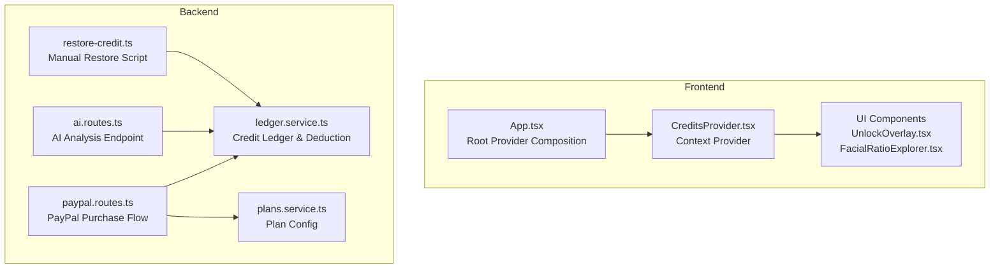
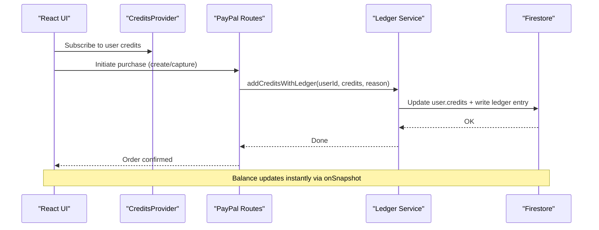
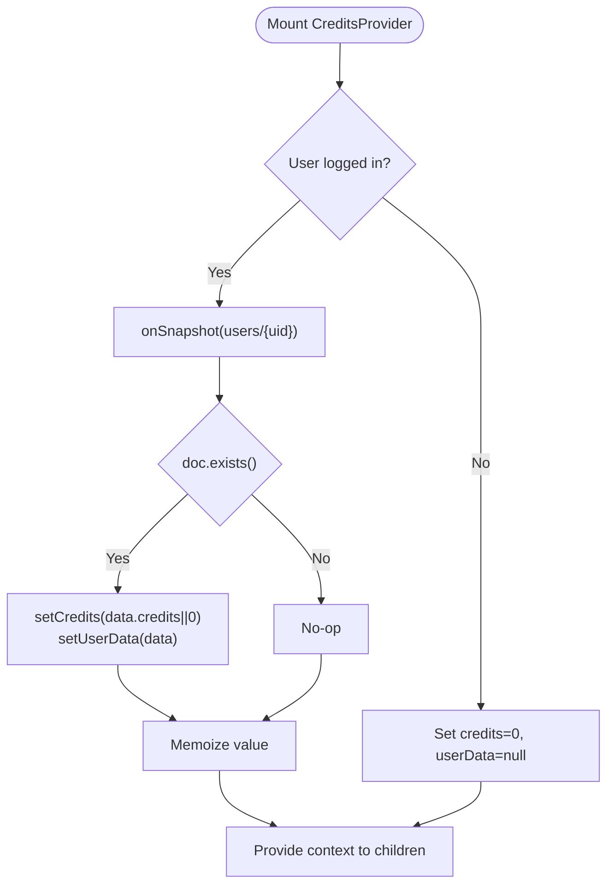
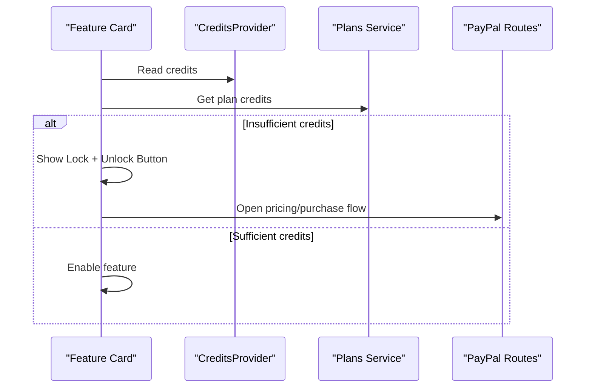
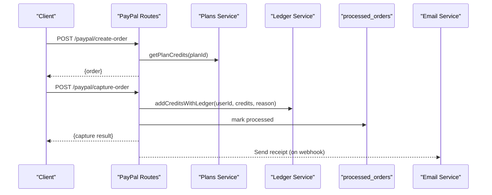
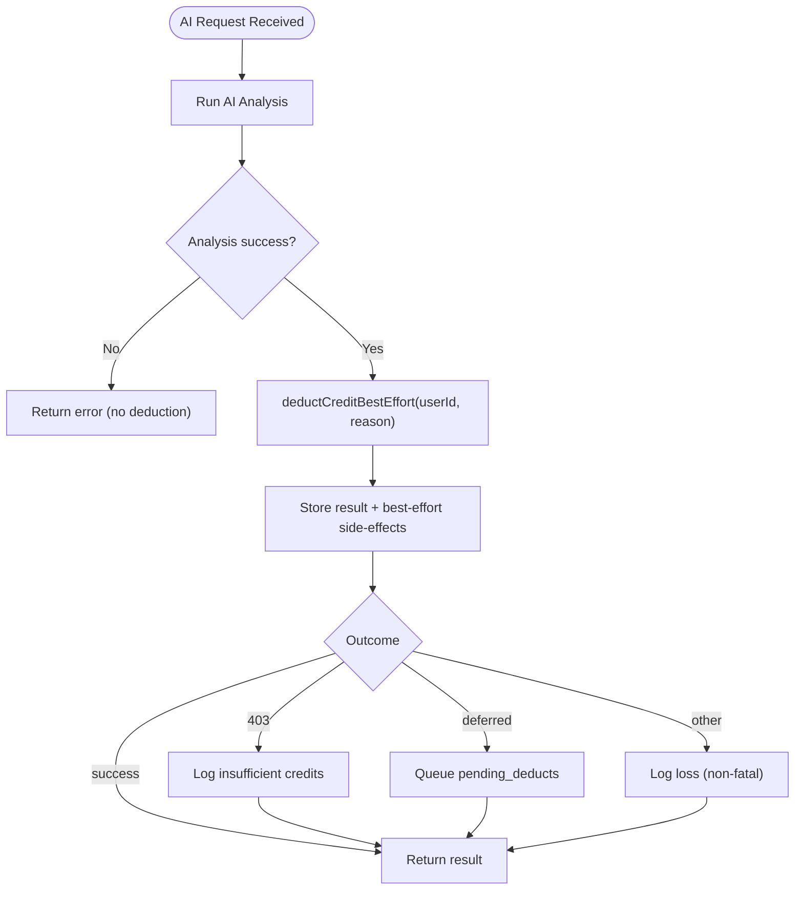
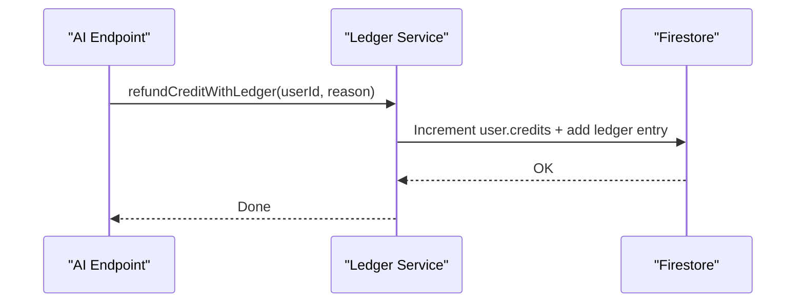
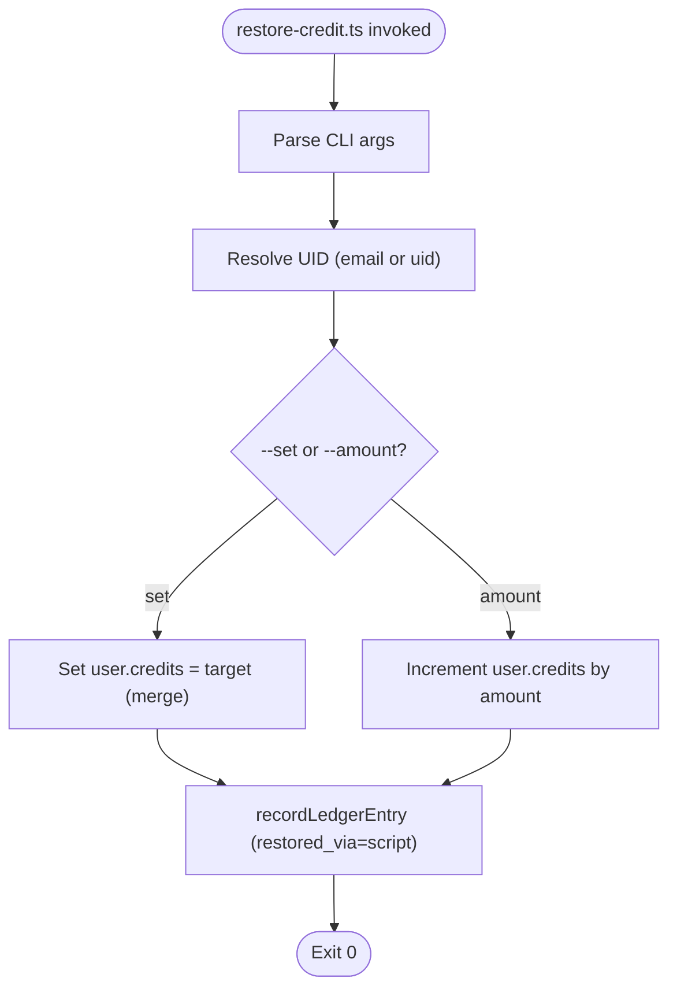
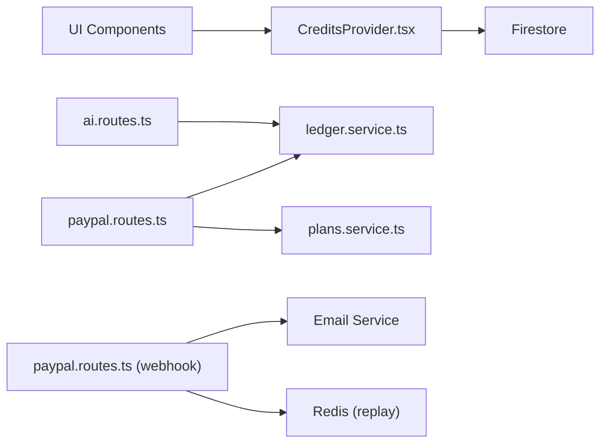

# CreditsProvider

<cite>
**Referenced Files in This Document**
- [CreditsProvider.tsx](file://src/context/CreditsProvider.tsx)
- [App.tsx](file://src/App.tsx)
- [UnlockOverlay.tsx](file://src/components/dashboard/UnlockOverlay.tsx)
- [FacialRatioExplorer.tsx](file://src/components/FacialRatioExplorer.tsx)
- [paypal.routes.ts](file://backend/routes/paypal.routes.ts)
- [ledger.service.ts](file://backend/services/ledger.service.ts)
- [ai.routes.ts](file://backend/routes/ai.routes.ts)
- [plans.service.ts](file://backend/services/plans.service.ts)
- [restore-credit.ts](file://backend/scripts/restore-credit.ts)
</cite>

## Table of Contents
1. [Introduction](#introduction)
2. [Project Structure](#project-structure)
3. [Core Components](#core-components)
4. [Architecture Overview](#architecture-overview)
5. [Detailed Component Analysis](#detailed-component-analysis)
6. [Dependency Analysis](#dependency-analysis)
7. [Performance Considerations](#performance-considerations)
8. [Troubleshooting Guide](#troubleshooting-guide)
9. [Conclusion](#conclusion)

## Introduction
This document explains the CreditsProvider component that powers premium feature access in FaceAnalytics Pro. It covers how user credits are tracked, how purchases integrate with PayPal, and how credit consumption is enforced for AI-powered features. It also documents the backend credit ledger, refund and restoration mechanisms, error handling strategies, and performance considerations for real-time balance updates.

## Project Structure
CreditsProvider is a React context provider that subscribes to Firestore user documents and exposes the current credit balance and user data to the rest of the app. It is initialized at the application root and consumed by UI components that gate premium features.

**Diagram sources**
- [App.tsx:456-472](file://src/App.tsx#L456-L472)
- [CreditsProvider.tsx:13-46](file://src/context/CreditsProvider.tsx#L13-L46)
- [paypal.routes.ts:18-159](file://backend/routes/paypal.routes.ts#L18-L159)
- [ledger.service.ts:97-141](file://backend/services/ledger.service.ts#L97-L141)
- [ai.routes.ts:474-505](file://backend/routes/ai.routes.ts#L474-L505)
- [plans.service.ts:13-33](file://backend/services/plans.service.ts#L13-L33)
- [restore-credit.ts:122-154](file://backend/scripts/restore-credit.ts#L122-L154)

**Section sources**
- [App.tsx:456-472](file://src/App.tsx#L456-L472)
- [CreditsProvider.tsx:13-46](file://src/context/CreditsProvider.tsx#L13-L46)

## Core Components
- CreditsProvider: Subscribes to the authenticated user’s Firestore document and exposes credits and user data to consumers via a React context.
- UI Consumers: Components like UnlockOverlay and feature cards use credits to show unlock actions or locked states.
- Backend Services:
  - PayPal routes: Create, capture orders, and webhook handling to add credits.
  - Ledger service: Atomic credit deductions, refunds, and immutable audit entries.
  - AI routes: Enforce credit consumption after successful AI calls.
  - Plans service: Centralized plan definitions and credit amounts.
  - Restore script: Manual credit restoration and auditing.

**Section sources**
- [CreditsProvider.tsx:6-54](file://src/context/CreditsProvider.tsx#L6-L54)
- [paypal.routes.ts:18-159](file://backend/routes/paypal.routes.ts#L18-L159)
- [ledger.service.ts:97-141](file://backend/services/ledger.service.ts#L97-L141)
- [ai.routes.ts:474-505](file://backend/routes/ai.routes.ts#L474-L505)
- [plans.service.ts:13-33](file://backend/services/plans.service.ts#L13-L33)
- [restore-credit.ts:122-154](file://backend/scripts/restore-credit.ts#L122-L154)

## Architecture Overview
The credit system is built around real-time Firestore snapshots and server-side atomic operations:

- Real-time balance: CreditsProvider listens to the user document and keeps the UI in sync.
- Purchase flow: PayPal routes create and capture orders, then add credits via the ledger service.
- Consumption flow: AI endpoints run analysis first, then attempt to deduct credits with best-effort handling.
- Audit and safety: Every credit change is recorded in the ledger; refunds and restores are supported.

**Diagram sources**
- [CreditsProvider.tsx:25-37](file://src/context/CreditsProvider.tsx#L25-L37)
- [paypal.routes.ts:129-151](file://backend/routes/paypal.routes.ts#L129-L151)
- [ledger.service.ts:245-268](file://backend/services/ledger.service.ts#L245-L268)

## Detailed Component Analysis

### CreditsProvider
- Purpose: Provide real-time access to user credits and profile data.
- Behavior:
  - Uses onSnapshot to subscribe to the authenticated user’s Firestore document.
  - Extracts credits and user data, defaulting to zero when the user is not logged in.
  - Memoizes the context value to avoid unnecessary re-renders.
- Integration points:
  - Consumed by global layout and feature components to gate premium experiences.
  - Drives unlock overlays and feature cards that react to credit availability.

**Diagram sources**
- [CreditsProvider.tsx:18-43](file://src/context/CreditsProvider.tsx#L18-L43)

**Section sources**
- [CreditsProvider.tsx:13-46](file://src/context/CreditsProvider.tsx#L13-L46)

### UI Feature Gating and Unlock Overlays
- UnlockOverlay: Presents a premium unlock call-to-action with visual cues and secure payment messaging.
- Feature cards (e.g., FacialRatioExplorer): Show lock icons and “Unlock” buttons when credits are insufficient; otherwise display results.
- These components rely on credits exposed by CreditsProvider to decide whether to render locked states or active features.

**Diagram sources**
- [UnlockOverlay.tsx:12-128](file://src/components/dashboard/UnlockOverlay.tsx#L12-L128)
- [FacialRatioExplorer.tsx:669-722](file://src/components/FacialRatioExplorer.tsx#L669-L722)
- [plans.service.ts:21-23](file://backend/services/plans.service.ts#L21-L23)
- [paypal.routes.ts:18-159](file://backend/routes/paypal.routes.ts#L18-L159)

**Section sources**
- [UnlockOverlay.tsx:12-128](file://src/components/dashboard/UnlockOverlay.tsx#L12-L128)
- [FacialRatioExplorer.tsx:669-722](file://src/components/FacialRatioExplorer.tsx#L669-L722)
- [plans.service.ts:13-33](file://backend/services/plans.service.ts#L13-L33)

### PayPal Purchase Integration
- Create Order: Validates planId, constructs PayPal payload with custom_id containing plan metadata, and returns order to the client.
- Capture Order: Verifies order status and custom_id, then adds credits atomically via the ledger service and marks the order processed.
- Webhook: Signature-verified, replay-protected, and idempotent; upon approved/completed events, adds credits and sends a receipt email.

**Diagram sources**
- [paypal.routes.ts:25-76](file://backend/routes/paypal.routes.ts#L25-L76)
- [paypal.routes.ts:79-159](file://backend/routes/paypal.routes.ts#L79-L159)
- [paypal.routes.ts:161-299](file://backend/routes/paypal.routes.ts#L161-L299)
- [plans.service.ts:21-23](file://backend/services/plans.service.ts#L21-L23)
- [ledger.service.ts:245-268](file://backend/services/ledger.service.ts#L245-L268)

**Section sources**
- [paypal.routes.ts:25-76](file://backend/routes/paypal.routes.ts#L25-L76)
- [paypal.routes.ts:79-159](file://backend/routes/paypal.routes.ts#L79-L159)
- [paypal.routes.ts:161-299](file://backend/routes/paypal.routes.ts#L161-L299)
- [plans.service.ts:13-33](file://backend/services/plans.service.ts#L13-L33)

### Credit Consumption for Analysis Features
- AI endpoints run the analysis first, then attempt to deduct a credit with best-effort semantics:
  - Transactional deduction succeeds immediately.
  - Business errors (insufficient credits/user not found) are surfaced to the client.
  - Transient failures queue a pending_deducts entry for later reconciliation.
  - Dev-mode accounts may bypass deduction under quota exhaustion to keep testing viable.

**Diagram sources**
- [ai.routes.ts:474-505](file://backend/routes/ai.routes.ts#L474-L505)
- [ledger.service.ts:189-240](file://backend/services/ledger.service.ts#L189-L240)

**Section sources**
- [ai.routes.ts:474-505](file://backend/routes/ai.routes.ts#L474-L505)
- [ledger.service.ts:189-240](file://backend/services/ledger.service.ts#L189-L240)

### Refund Handling
- When an AI call fails after a credit was deducted, the system refunds the credit and records a ledger entry.
- This ensures no user loses credits due to backend failures.

**Diagram sources**
- [ledger.service.ts:147-169](file://backend/services/ledger.service.ts#L147-L169)

**Section sources**
- [ledger.service.ts:147-169](file://backend/services/ledger.service.ts#L147-L169)

### Credit Restoration Mechanisms
- Admin/manual restoration is performed via a dedicated script that can:
  - Add credits to a user.
  - Set a user’s balance to a target value.
  - Record ledger entries for auditability.
- The script supports resolution by UID or email and writes explicit metadata for traceability.

**Diagram sources**
- [restore-credit.ts:39-154](file://backend/scripts/restore-credit.ts#L39-L154)
- [ledger.service.ts:60-91](file://backend/services/ledger.service.ts#L60-L91)

**Section sources**
- [restore-credit.ts:122-154](file://backend/scripts/restore-credit.ts#L122-L154)
- [ledger.service.ts:60-91](file://backend/services/ledger.service.ts#L60-L91)

## Dependency Analysis
- CreditsProvider depends on:
  - Auth context for user identity.
  - Firestore SDK for real-time subscription.
- UI components depend on CreditsProvider for gating and unlocking.
- Backend services depend on:
  - Plans service for plan credit amounts.
  - Ledger service for atomic credit operations.
  - Email service for receipts (webhook path).
  - Redis for webhook replay protection.

**Diagram sources**
- [CreditsProvider.tsx:1-5](file://src/context/CreditsProvider.tsx#L1-L5)
- [paypal.routes.ts:14-14](file://backend/routes/paypal.routes.ts#L14-L14)
- [ai.routes.ts:484-490](file://backend/routes/ai.routes.ts#L484-L490)
- [paypal.routes.ts:161-299](file://backend/routes/paypal.routes.ts#L161-L299)

**Section sources**
- [paypal.routes.ts:14-14](file://backend/routes/paypal.routes.ts#L14-L14)
- [ai.routes.ts:484-490](file://backend/routes/ai.routes.ts#L484-L490)

## Performance Considerations
- Real-time subscriptions: onSnapshot provides instant updates but can cause frequent renders. Memoization in CreditsProvider prevents unnecessary re-renders for consumers.
- Backend best-effort deduction: Ensures AI responses are not delayed by transient database issues; pending_deducts reconciles missed charges later.
- Idempotency: processed_orders and webhook replay protection prevent duplicate credit additions.
- Caching strategies:
  - Frontend: rely on Firestore listeners; consider local optimistic updates only for UI feedback, not for state persistence.
  - Backend: Redis-based deduplication for webhooks; consider result caching for repeated scans to reduce redundant AI calls.

[No sources needed since this section provides general guidance]

## Troubleshooting Guide
- Insufficient credits:
  - Backend returns 403 with INSUFFICIENT_CREDITS; clients should prompt purchase or explain remaining credits.
  - Frontend should show unlock overlays and pricing options.
- Transaction failures:
  - If a deduction fails due to transient issues, the system queues a pending_deducts entry; reconciliation runs later.
- Credit synchronization issues:
  - Verify Firestore listener is active and user is authenticated.
  - Confirm processed_orders and webhook replay protection are functioning.
- Refund anomalies:
  - Ensure refundCreditWithLedger is called when AI fails after deduction.
  - Check ledger entries for audit trails.

**Section sources**
- [ai.routes.ts:493-504](file://backend/routes/ai.routes.ts#L493-L504)
- [ledger.service.ts:189-240](file://backend/services/ledger.service.ts#L189-L240)
- [paypal.routes.ts:167-179](file://backend/routes/paypal.routes.ts#L167-L179)

## Conclusion
CreditsProvider forms the backbone of FaceAnalytics Pro’s premium access model. It pairs real-time credit visibility with robust backend flows for purchases, consumption, refunds, and restoration. Together with the ledger service and PayPal integration, it ensures a reliable, auditable, and user-friendly premium experience.